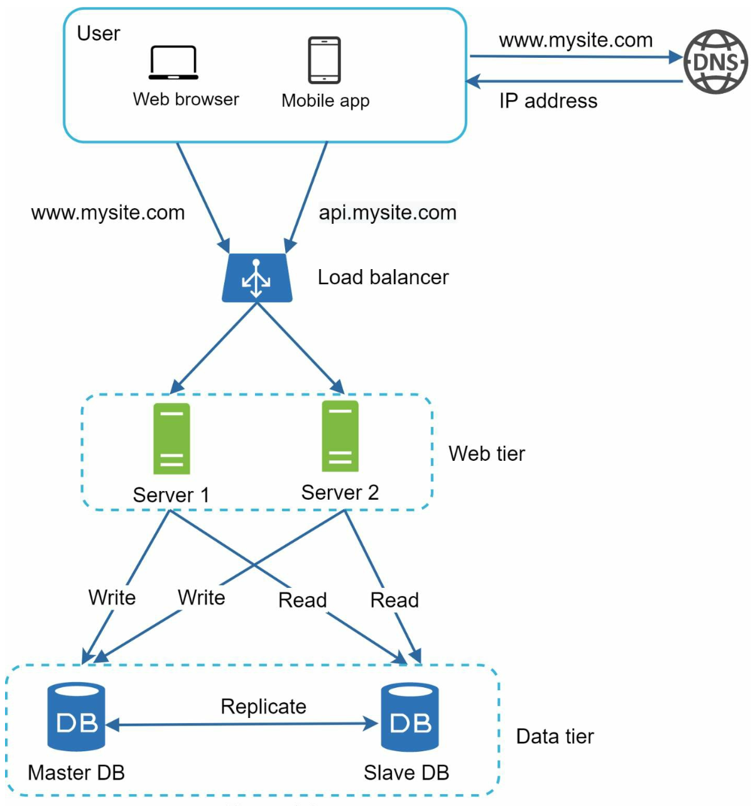
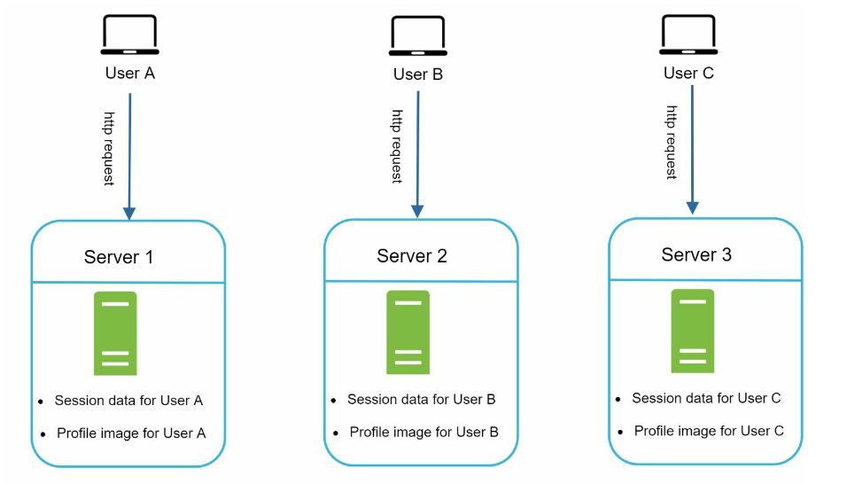

# 第 1 章：从零到百万用户

> 原章节：Scale from Zero to Millions of Users · 原项目路径 `01. Scaling/`

## 本章导读

几乎每一道系统设计题，最后都会落到同一个问题上：**用户变多了怎么办？**

这一章不讲某个具体系统，而是讲一条"成长路线"——从一台服务器开始，随着用户从 100 涨到 1 亿，架构是怎么一步步演化的。它是整本书的地基：后面 27 章反复用到的负载均衡、缓存、CDN、消息队列、分片，全都在这里第一次登场。

学完这一章，你应该能回答：为什么单机扛不住？加机器为什么不是简单地"再来一台"？数据库为什么会成为瓶颈？

## 你将学到

- 一个请求从浏览器发出到拿到响应，中间经过了哪些环节
- 垂直扩展与水平扩展的本质区别，以及为什么最终必须走向水平扩展
- 数据库为什么会成为第一个瓶颈，以及复制、分片两种解法各自的代价
- 缓存的正确用法，以及它带来的三个新问题
- 什么让一台服务器变得"无状态"，为什么这件事如此重要
- 各个组件如何组合成一个能支撑百万用户的完整架构

---

## 1. 单机起步：一切都跑在一台机器上

最开始，用户没几个，一台服务器就够了。Web 应用、数据库、缓存全部塞在同一台机器里。

<div align="center">
  
</div>

### 一个请求的完整旅程

你打开浏览器，输入 `api.mysite.com`，按下回车。接下来发生了什么？

1. **DNS 解析**：浏览器不认识域名，只认识 IP 地址。它去问 DNS 服务器："`api.mysite.com` 对应哪个 IP？"
2. **拿到 IP**：DNS 返回 Web 服务器的 IP，比如 `15.125.23.214`。
3. **发起 HTTP 请求**：浏览器向这个 IP 发送请求。
4. **返回响应**：Web 服务器处理完，返回 HTML 页面或 JSON 数据。

> **为什么这里要讲 DNS？**
> 因为后面章节会反复出现一个设计手法：**把某一层做成可替换的**。DNS 就是最外层的"可替换点"——GeoDNS 能把用户导向最近的数据中心（见第 9 节），这在容灾和降低延迟上非常关键。

### 流量从哪来

两类客户端，通信方式略有不同：

| 客户端 | 业务逻辑在哪 | 与服务器怎么通信 |
|---|---|---|
| Web 应用 | 服务端语言（Python、Java 等） | HTTP，返回 HTML 或 JSON |
| 移动应用 | 客户端（iOS/Android） | HTTP + JSON，只传数据不传页面 |

移动端只交换 JSON 这点很重要：**数据传输量小**，意味着同样的带宽能服务更多用户。

### 单机的问题

只有一个问题，但是致命的：**所有东西都在一起，任何一个坏了，全部玩完。**

更要命的是，你没法单独给数据库加内存——因为 Web 应用也在同一台机器上抢资源。

---

## 2. 第一步拆分：把数据库搬出去

用户多起来之后，第一个被拆出去的是数据库。

<div align="center">
  
</div>

**为什么先拆数据库？** 因为 Web 服务器基本是"无记忆"的——它收到请求、算一下、返回结果，不存东西。而数据库要存所有数据，是真正的资源消耗大户。把两者分开，就能**各自独立扩展**：Web 服务器不够就加 Web 服务器，数据库不够就升数据库，互不干扰。

### 选关系型还是非关系型

这是初学者最容易纠结的问题。先记住一个判断原则：**默认选关系型数据库（SQL）**，除非有明确理由不选。

关系型数据库（MySQL、PostgreSQL）的优势在于：有几十年的工程积累，支持事务、连接（JOIN）、复杂查询，社区成熟。

非关系型数据库（NoSQL）分四类：

- **键值存储（Key-Value Store）**：Redis、DynamoDB
- **文档存储（Document Store）**：MongoDB
- **列存储（Column Store）**：Cassandra、HBase
- **图数据库（Graph Database）**：Neo4j

**什么时候该考虑 NoSQL？** 满足以下任一条：

1. 应用需要**极低延迟**（NoSQL 通常省掉了事务和 JOIN 的开销）
2. 数据是**非结构化的**，或者根本没有关联关系
3. 只需要**序列化和反序列化**数据（JSON、XML、YAML），不需要复杂查询
4. 需要存储**海量数据**，且关系型数据库的扩展成本无法接受

> **初学者常见误区**
> "NoSQL 比 SQL 先进 / 性能更好"——错。NoSQL 是**放弃了某些能力换取另一些能力**。放弃了事务和 JOIN，换来的是更容易的水平扩展。如果你的业务需要跨表事务（比如转账），强行上 NoSQL 会让你的代码里充满手写的补偿逻辑，得不偿失。
> 选型要看**业务需要什么**，不是看**哪个更时髦**。

---

## 3. 垂直扩展 vs 水平扩展

<div align="center">
  
</div>

### 垂直扩展（Vertical Scaling）：把机器换得更强

给现有的服务器加 CPU、加内存、换更快的 SSD。

**优点**：简单，代码一行不用改。

**缺点**：
- **有物理上限**。单台机器最多能塞多少 CPU、多少内存，是有天花板的。
- **没有冗余**。这台机器挂了，服务就挂了。
- **成本不是线性的**。性能翻倍的机器，价格往往远超两倍。

### 水平扩展（Horizontal Scaling）：用更多机器

不再追求单台更强，而是加更多台普通机器。

**优点**：
- **理论上无上限**，加机器就行。
- **天然冗余**，坏一台不影响整体。
- **成本线性**，可以用便宜的商用机器。

**代价**：引入了新的复杂性。多台机器意味着：
- 请求要**分发**给哪一台？→ 需要**负载均衡器**
- 数据要**存在**哪一台？→ 需要**分片**（见第 12 节）
- 用户状态要**记在**哪一台？→ 需要**无状态化**（见第 8 节）

> **这就是整本书的主线**
> 系统设计的绝大部分复杂度，都来自"从一台变成多台"这件事。后面每一章，本质上都在解决这个转变带来的某个具体问题。

---

## 4. 负载均衡器：把请求分出去

<div align="center">
  
</div>

负载均衡器（Load Balancer）站在用户和 Web 服务器之间，把请求分发给多台服务器。

它带来两个直接好处：

1. **冗余（Redundancy）**：如果服务器 1 挂了，流量自动转到服务器 2，用户毫无感知。
2. **可扩展（Scalability）**：流量涨了，往后面再加几台服务器就行。

**还有一个容易被忽略的好处**：负载均衡器对外暴露一个固定 IP，用户只知道这一个地址。内部服务器怎么加、怎么减、IP 怎么变，用户完全不需要知道。这叫**解耦**。

---

## 5. 数据库复制：让数据也有备份

Web 层可以随便加机器了，但数据库还是单点——它挂了，整个系统就挂了。

解决方案是**数据库复制（Replication）**：把数据复制到多台数据库上。

<div align="center">
  
</div>

### 主副本模型（Primary-Replica）

> **术语勘误**：原笔记使用的是 **Master-Slave（主从）**。这个叫法在业界已逐渐弃用，现在标准术语是 **Primary-Replica（主副本）** 或 **Leader-Follower（主从）**。下文统一使用新术语。详见文末【勘误与补充】。

- **主库（Primary）**：处理所有**写**操作。插入、更新、删除都必须走主库。
- **副本库（Replica）**：处理**读**操作。

**为什么副本库可以有很多个，主库通常只有一个？** 因为在绝大多数应用里，**读远多于写**。比如刷朋友圈，一百个人看，可能只有一个人发。所以你可以用很多台副本库来分担读压力，而主库只需要一台。

### 复制带来的两个好处

1. **性能提升**：读操作可以并行分散到多台副本库上。
2. **高可用与数据可靠**：数据有多份拷贝，坏一台不丢数据。

### 出故障了怎么办

- **副本库挂了（只有一台）**：读请求临时转到主库。
- **副本库挂了（有多台）**：读请求转给其他健康的副本库，同时拉起一台新的替换。
- **主库挂了**：从副本库里**提升（Promote）**一台成为新的主库。

### 主从延迟：这里有个经典的坑

主库挂了要提升副本库时，**选中的副本库可能还没有同步完最新的数据**——这部分还没复制过去的数据就丢了。这是复制模型固有的取舍：**要么保证不丢数据（同步复制，慢），要么保证速度（异步复制，可能丢）**。

> **原笔记的说法需要更新**
> 原文写的是"通过运行数据恢复脚本来补齐数据，可以用多主（multi-master）或环形复制（circular replication）来帮忙"。这是比较旧的做法。现代工程实践是：
> - 使用**半同步复制（Semi-Synchronous Replication）**，至少保证一台副本收到数据后才向客户端确认；
> - 使用 **GTID / WAL 位点**做精确的故障切换，而不是靠脚本"捞数据"；
> - 使用 **Patroni、Orchestrator、MHA** 这类自动化故障转移工具，把切换时间从人工的几十分钟压到秒级。
>
> **多主和环形复制要慎用**：多台机器都能写，就必然出现**写冲突（Write Conflict）**，需要额外的冲突解决逻辑（比如"最后写入者胜出"，但这会丢数据）。除非业务真的能接受，否则不要用。

### 主从延迟导致的"读不到自己写的数据"

这是初学者最容易踩的坑，也是面试常考点：

> 用户发了一条评论，页面刷新后评论不见了。过几秒再刷新，又出现了。

**原因**：写请求走了主库，但读请求被路由到了还没同步完的副本库。

**解决方案**（按推荐程度）：

1. **写后读走主库**：用户自己刚写完的一段时间内（比如 1 秒），该用户的读请求强制走主库。
2. **会话粘性**：同一用户的读写都路由到同一节点。
3. **等待位点**：读之前先确认副本库已经追上了指定的 WAL 位点。

---

## 6. 缓存：用内存换时间

<div align="center">
  
</div>

**缓存（Cache）** 把频繁访问的数据放在内存里，减少数据库压力。内存的读取速度比磁盘快几个数量级，所以缓存层能极大提升响应速度。

### 什么时候该用缓存

判断标准很简单：**读多写少**。如果一个数据被读一万次才改一次，缓存收益极高。反过来，如果数据每秒都在变，缓存只会让你疲于同步，得不偿失。

### 缓存的五个考量点

**1. 使用场景**
读频繁、写稀少的场景。典型如：用户资料、商品详情、排行榜。

**2. 过期策略（Expiration）**
缓存数据到期后被移除。**如果不设过期时间，数据会永久占用内存**，最终把内存撑爆。

> **工程实践**：过期时间一定要**加随机抖动**。如果一万个 key 都是"60 分钟后过期"，它们会在同一秒集体失效，所有请求瞬间砸到数据库——这就是**缓存雪崩**。

**3. 一致性（Consistency）**
让缓存和数据库保持同步。不一致的根源是：**更新数据库和更新缓存不是一个原子操作**。你先更新数据库、再删缓存，中间这段时间就有窗口期。

> **推荐做法：先更新数据库，再删除缓存**（Cache-Aside 模式）。
> **为什么不"更新缓存"而是"删除缓存"？** 因为删除是幂等的、简单的；而更新缓存需要你算出新值，在并发下容易写入旧值（两个请求 A、B 同时更新，B 先写缓存，A 后写缓存，结果缓存里留了 A 的旧值）。
> 删除缓存也会有极小概率出错，但概率远低于更新缓存。想彻底解决，需要配合**延迟双删**或**订阅数据库变更日志（CDC）**。

**4. 故障缓解（Mitigating Failures）**
单台缓存服务器就是一个**单点故障（SPOF）**。应该部署多台缓存服务器，并跨数据中心分布。

**5. 淘汰策略（Eviction Policy）**
缓存满了要淘汰数据。常见策略：

| 策略 | 含义 | 适用场景 |
|---|---|---|
| **LRU**（Least Recently Used） | 淘汰最久未被访问的 | 通用默认选择，最常用 |
| **LFU**（Least Frequently Used） | 淘汰访问次数最少的 | 访问频率差异大，且热点稳定 |
| **FIFO**（First In First Out） | 先进先出 | 简单场景 |
| **TTL** | 按过期时间淘汰 | 配合其他策略使用 |
| **W-TinyLFU** | LRU + LFU 的混合 | 命中率最优，Caffeine 采用 |

> **原笔记说"LRU 是最流行的淘汰策略"**——这话没错，但需要补充：LRU 有个致命弱点，**它挡不住偶发的批量扫描**（比如一次全表遍历会把所有热点数据挤出缓存）。所以现代高性能缓存（如 Caffeine）用的是 W-TinyLFU。

### 原笔记缺失的核心内容：三种缓存读写模式

这是本章最重要的补充。缓存和数据库怎么配合，有三种成熟模式：

**① Cache-Aside（旁路缓存）—— 最常用**

```
读：先查缓存 → 命中就返回 → 未命中就查数据库 → 写入缓存
写：先更新数据库 → 再删除缓存
```
应用代码自己管理缓存。简单、可控，是绝大多数业务的默认选择。

**② Write-Through（写穿）**

```
写：同时写缓存和数据库，缓存层保证两者都成功才返回
```
写操作变慢，但缓存永远是新的。适合写少、但要求强一致的场景。

**③ Write-Back（写回）**

```
写：只写缓存，标记为脏 → 后台异步批量刷回数据库
```
写入极快，但**有丢数据的风险**（缓存宕机时未刷盘的数据就没了）。适合写密集、能容忍少量丢失的场景（如计数器、日志）。

### 原笔记缺失的核心内容：缓存三大故障

这三个概念初学者极易混淆，务必分清：

| 名称 | 英文 | 场景 | 后果 | 对策 |
|---|---|---|---|---|
| **缓存穿透** | Cache Penetration | 查询一个**数据库里也不存在**的数据 | 每次都绕过缓存打数据库 | 布隆过滤器拦截、缓存空值并设短过期 |
| **缓存击穿** | Cache Breakdown | **某个热点 key** 过期的瞬间，大量并发请求同时打过来 | 单点压力瞬间飙升 | 互斥锁重建、逻辑过期（不设物理过期） |
| **缓存雪崩** | Cache Avalanche | **大量 key 同时过期**，或缓存服务整体宕机 | 数据库被瞬间压垮 | 过期时间加随机抖动、多级缓存、熔断降级 |

---

## 7. CDN：把静态资源推到用户家门口

<div align="center">
  
</div>

**CDN（内容分发网络）** 把静态内容（图片、CSS、JavaScript、视频）缓存到全球各地的边缘节点上，用户从**最近的节点**取数据，而不是从遥远的源站。

**为什么能快这么多？** 因为光速是有限的。从北京到美国西海岸一个来回至少 150 毫秒，而从北京到北京的 CDN 节点可能只要 5 毫秒。物理距离无法被优化掉，只能靠"把内容搬近一点"。

### 工作流程

1. 用户请求静态资源，DNS 把它导向最近的 CDN 节点。
2. 如果该节点有缓存，直接返回。
3. 如果没有，节点回源站拉取，缓存下来，再返回给用户。

### CDN 的四个考量点

1. **成本**：CDN 由第三方运营，按流量计费，进出都要钱。
2. **缓存过期时间**：太短则频繁回源，太长则内容更新不及时。需要按资源类型分别设置。
3. **CDN 回退（Fallback）**：CDN 临时故障时，客户端要能检测到并回源站取。
4. **缓存失效（Invalidation）**：文件更新后要主动让 CDN 上的旧缓存失效。

> **补充：Pull CDN vs Push CDN**
> - **Pull CDN（拉取型）**：节点按需回源拉取。适合流量大、内容多但更新不频繁的场景。**绝大多数网站用这个**。
> - **Push CDN（推送型）**：你主动把内容推给 CDN。适合内容少、更新频繁、或访问量极低的场景（因为拉取型在低流量下会反复回源，浪费）。

---

## 8. 无状态 Web 层：让服务器可以随意增删

<div align="center">
  
</div>

这是整章最重要的架构思想之一。

**有状态（Stateful）** 的服务器会"记住"用户——比如把 session 存在自己的内存里。问题来了：

> 用户 A 登录后，session 存在服务器 1 的内存里。下一次请求被负载均衡器分到了服务器 2，服务器 2 不认识这个 session，**用户被踢出登录**。

<div align="center">
  
</div>

**无状态（Stateless）** 的做法是：**把 session 从服务器内存里搬到共享存储**（比如 Redis 集群）。任何一台服务器收到请求，都能从共享存储里读出 session。这样每台服务器都是"可替换的"。

### 无状态带来的两个能力

1. **容易水平扩展**：加机器不需要做任何数据迁移。
2. **可以自动伸缩（Auto-scaling）**：流量高峰自动加机器，低谷自动减机器。**这是有状态架构做不到的**——因为你没法随意杀掉一台持有 session 的机器。

> **三种 session 方案的取舍**（补充内容）
>
> | 方案 | 优点 | 缺点 |
> |---|---|---|
> | **粘性会话（Sticky Session）** | 实现最简单，不用改代码 | 负载不均；那台机器挂了用户就掉线；无法自动伸缩 |
> | **集中式 session 存储（Redis）** | 无状态、可伸缩、可容灾 | 引入一次网络往返；session 存储成了新的关键依赖 |
> | **JWT 等自包含令牌** | 服务端完全不用存 | 无法主动失效（除非引入黑名单）；令牌体积大 |
>
> 生产环境**推荐第二种**。粘性会话只适合临时方案。

---

## 9. 多数据中心：离用户更近

<div align="center">
  
</div>

把服务部署到多个地理位置的数据中心，好处有两个：**降低延迟**（用户访问近的机房）和**提高可用性**（一个机房整体挂了还有其他机房）。

### 两个关键手段

1. **GeoDNS 路由**：根据用户的地理位置，把域名解析到最近的数据中心的 IP。
2. **数据复制**：跨数据中心同步数据，避免用户在不同机房看到不一致的数据。

### 三个必须解决的问题

- **流量重定向**：需要可靠的机制把用户导向正确的机房，并且能在机房故障时快速切换。
- **数据同步**：跨机房复制的延迟远高于同机房。**常用策略是"异步复制 + 冲突解决"**，并且要接受跨机房场景下的最终一致性。
- **测试与部署**：必须用自动化部署工具，保证所有机房的服务版本一致。手工部署多个机房，迟早会出现版本漂移。

---

## 10. 消息队列：把同步变成异步

<div align="center">
  
</div>

**消息队列（Message Queue）** 是一个持久化的组件，支持**异步通信**。它充当缓冲区，把异步请求排队分发给下游。

- **生产者（Producer / Publisher）**：创建消息并发送到队列。
- **消费者（Consumer / Subscriber）**：从队列取消息并执行对应动作。

### 它解决了什么问题

假设用户上传一张图片，你要做：压缩、生成缩略图、写数据库、发通知。如果全部同步执行，用户要等好几秒。

用消息队列：
1. 用户上传 → 立即返回"上传成功"。
2. 后端把任务丢进队列。
3. 后台的工作进程慢慢处理。

**用户体验立刻变好**，而且后端处理能力可以独立扩展——任务堆积了就多加几个消费者。

### 核心价值：解耦

生产者不需要知道消费者是谁、有几个、在不在线。这个特性让系统可以**独立演进**：新加一个"图片审核"服务，只要订阅同一个队列就行，生产者代码一行不用改。

> **勘误：原笔记这里有一处技术错误**
> 原文写的是"A message queue is a durable component, **stored in memory**"（消息队列是一个持久化组件，存在内存中）。
>
> **这两句话自相矛盾，而且"存在内存中"是错的。**
>
> - **durable（持久化）** 和 **in memory（仅存内存）** 是互斥的。只存内存的东西，进程重启就没了，谈不上持久化。
> - 消息队列的**核心价值就是消息不丢**。如果只存内存，Broker 重启时正在排队的订单、支付回调全部丢失，这在生产环境是不可接受的。
>
> **正确说法**：现代消息队列（Kafka、RabbitMQ、RocketMQ、Pulsar）都是**把消息持久化到磁盘**的。它们之所以快，不是因为"存在内存里"，而是因为：
> - **顺序写磁盘**（append-only log），比随机写快几个数量级；
> - **页缓存（Page Cache）**：操作系统会把最近读写的磁盘数据缓存在空闲内存里，所以"写磁盘"实际上大部分是写内存，由内核异步刷盘；
> - **零拷贝（Zero-Copy）**：用 `sendfile` 系统调用，数据不经过用户态，直接从页缓存发到网卡。
>
> 内存确实会被用起来，但那是**性能优化手段**（缓存），不是**存储方式**。

---

## 11. 日志、指标与自动化

<div align="center">
  
</div>

系统上线只是开始，你还得知道它跑得好不好。

- **日志（Logging）**：记录错误和系统状态。出问题时，日志是唯一的线索。**关键点：多台服务器要收集到统一的地方**，否则排查故障时你得一台台登录去看。
- **指标（Metrics）**：反映性能和用户行为。CPU、内存、QPS、响应延迟、错误率。指标能让你**在用户投诉之前发现问题**。
- **自动化（Automation）**：把测试、部署、扩缩容自动化。**手工操作是事故的主要来源**——人在凌晨三点做紧急扩容时，一定会出错。

> 这三样东西会在第 20 章（监控告警系统）展开讲成一整个系统。

---

## 12. 数据库扩展：最后的瓶颈

Web 层可以随便加机器了，但**数据库依然是瓶颈**。为什么？因为 Web 服务器是无状态的，加一台就多一份算力；而数据库是**有状态的**，数据只有一份，加机器解决不了"数据在哪"的问题。

### 垂直扩展数据库

给数据库加硬件。缺点是：
- **单点故障风险更大**（更贵的机器，坏了损失更大）
- **成本极高**
- **有物理上限**

### 水平扩展：分片（Sharding）

<div align="center">
  
</div>

把大数据库拆成多个更小的部分，叫**分片（Shard）**。每个分片**结构（schema）相同**，但存放**不同的数据**。

**分片键（Sharding Key）怎么选？** 这是分片方案成败的关键。原则是：**选一个能均匀分布数据的键**。

- 按 `user_id` 分片：用户数据天然均匀，且同一个用户的数据都在同一片，查询高效。
- 按 `created_at` 分片：**很糟糕**。所有新写入都会集中在最新的那个分片，形成热点。

### 分片带来的三个新问题

**1. 重新分片（Resharding）**

两种情况下必须重新分片：
- 单个分片增长太快，存不下了；
- 数据分布不均，某些分片提前被写满（**分片倾斜**）。

> 原笔记说"用一致性哈希来解决"——**这个说法不完整，甚至有点误导**。
> 一致性哈希确实能把"增加节点时受影响的数据比例"从"几乎全部"降到"1/N"，但**它不能自动解决分片倾斜**——如果数据本身分布不均，一致性哈希也救不了你。而且一致性哈希只负责"决定数据去哪个节点"，**不负责把已有数据搬过去**，迁移逻辑还得自己写。
> 更常见的做法是：**一开始就规划足够多的逻辑分片**（比如 1024 个），让逻辑分片数量远大于物理机器数量，将来扩容时只需要把整个逻辑分片搬走，不用重新哈希。这个思路会在第 5 章详细展开。

**2. 名人问题（Celebrity Problem）**

某个分片被过度访问，导致该分片过载。比如一个超级明星发了一条动态，所有粉丝都来访问他的数据，而这些数据都在同一个分片上。

> **注意**：这其实是**热点 key 问题**，不是分片算法问题。一致性哈希解决不了它——因为无论怎么哈希，"同一个人"的数据总是在同一个分片上。
>
> **正确对策**：
> - 给热点数据**单独分配分片**；
> - **加缓存**（最有效，热点数据放内存里，根本不打数据库）；
> - **key 加盐**（把 `celebrity_123` 拆成 `celebrity_123_0` ~ `celebrity_123_9` 分散到多个分片，读的时候合并）。

**3. 跨分片 JOIN 与反范式化**

数据分散到多台机器后，**跨分片的 JOIN 变得极其困难**——因为 JOIN 需要把数据拉到一起，而数据在不同机器上。

**常见解法：反范式化（De-normalization）**。把需要 JOIN 的数据冗余到同一张表里，让查询能在一张表内完成。代价是**写放大**和**一致性维护成本**——同一份数据存了多处，更新时要保证都更新到。

---

## 13. 把所有零件拼起来：百万用户架构全貌

> **原笔记缺失的内容**
> 原文从"Section 12 数据库扩展"直接跳到了结论，没有把前面 12 个组件拼成一张完整的架构图。这是本章最重要的收口，这里补上。

<div align="center">
  
</div>

把前面所有组件按用户规模的演进顺序串起来，就是一条清晰的成长路线：

| 阶段 | 用户规模 | 架构变化 | 解决的核心问题 |
|---|---|---|---|
| 1 | 1 ~ 1 千 | 单机（Web + DB + Cache 同机） | 能跑起来 |
| 2 | 1 千 ~ 1 万 | 数据库拆分 | 资源独立扩展 |
| 3 | 1 万 ~ 10 万 | 加负载均衡 + 多台 Web 服务器 | Web 层冗余与扩展 |
| 4 | 10 万 ~ 50 万 | 数据库主副本复制 | 数据库读扩展 + 高可用 |
| 5 | 50 万 ~ 100 万 | 加缓存层 + CDN | 减少数据库压力、加速静态资源 |
| 6 | 100 万 + | Web 层无状态化 + 多数据中心 | 自动伸缩、就近访问 |
| 7 | 千万 + | 加消息队列 | 解耦、削峰、异步化 |
| 8 | 亿级 | 数据库分片 | 突破单库存储与写入上限 |

**最终形态的请求链路**：

```
用户 → DNS/GeoDNS → CDN（静态资源）
                  ↓
              负载均衡器
                  ↓
        ┌─────────┼─────────┐
     Web 服务器  Web 服务器  Web 服务器   ← 无状态，可任意增删
        └─────────┼─────────┘
                  ↓
    ┌─────────────┼─────────────┐
  缓存集群      消息队列      共享 Session 存储
                  ↓
        ┌─────────┼─────────┐
      主库      副本库      副本库          ← 写走主，读走副本
        ↓
    分片 1     分片 2     分片 3           ← 突破单库上限
```

> **注意这条路线不是"必须按顺序走"的清单**，而是"问题驱动"的演化逻辑。
> 现实中的架构决策永远从**约束**出发：用户量多大？读写比例如何？能容忍多少数据丢失？预算多少？**没有约束就没有最优解**——这也是第 3 章面试框架要教你的第一件事。

---

## 勘误与补充

### 勘误 1：Master-Slave 是过时的术语

- **原文说法**：全文使用 "Master-Slave Model"、"master database"、"slave database"。
- **问题**：`Master/Slave`（主/奴）这一术语因带有奴隶制隐喻，在技术社区已被广泛弃用。主流数据库厂商与开源社区均已改用新词。
- **正确说法**：使用 **Primary-Replica（主副本）** 或 **Leader-Follower（主从）**。
  - MySQL 官方文档：`SOURCE/REPLICA`（旧称 `MASTER/SLAVE`）
  - PostgreSQL：`Primary/Standby`
  - Redis：`Master/Replica`（Redis 保留了 master 一词，但已不用 slave）
  - Kafka：`Leader/Follower`
- **延伸**：这不是"政治正确"问题，而是**沟通准确性问题**。你在面试或写文档时说 `Primary-Replica`，面试官会认为你了解现代实践；说 `Master-Slave` 则可能被追问"你知道这个术语已经被淘汰了吗"。

### 勘误 2：消息队列不是"存在内存中"

- **原文说法**：`A message queue is a durable component, stored in memory`（消息队列是一个持久化组件，存在内存中）。
- **问题**：自相矛盾且技术错误。仅存内存的组件无法提供持久性保证，Broker 重启即丢消息。
- **正确说法**：消息队列**持久化到磁盘**。其高性能来自顺序写、页缓存和零拷贝，而非"存在内存中"。
- **延伸**：这个区别在面试中很关键。当被问到"消息队列如何保证消息不丢"时，答案链条是：**生产者确认（ack）→ Broker 持久化到磁盘（并多副本）→ 消费者手动提交 offset**。任何一环缺失都可能丢消息。

### 勘误 3：主库故障转移的"数据恢复脚本"是过时做法

- **原文说法**："选中的从库可能不是最新的，因此需要运行数据恢复脚本来更新数据（多主和环形复制可能有帮助）"。
- **问题**：手工跑脚本"捞数据"的方式在现代系统中已不常见，且引入多主/环形复制会带来写冲突问题。
- **正确说法**：使用**半同步复制**保证至少一台副本已收到数据；用 **GTID / LSN** 做精确位点切换；用 **Patroni / Orchestrator / MHA** 实现自动故障转移。
- **延伸**：这里涉及一个核心概念——**RPO（恢复点目标）和 RTO（恢复时间目标）**。RPO 是"能容忍丢多少数据"，RTO 是"能容忍停多久"。选同步还是异步复制，本质上是在调这两个指标。

### 勘误 4：一致性哈希不能解决分片倾斜和名人问题

- **原文说法**：分片的"重新分片"和"名人问题"可以"用一致性哈希来克服"。
- **问题**：一致性哈希解决的是**"节点增减时数据重新分布的比例"**问题（从 ~100% 降到 ~1/N）。它**不解决**数据本身分布不均导致的倾斜，也**不解决**热点 key 问题——因为同一个人的数据无论怎么哈希都在同一个节点上。
- **正确说法**：倾斜要靠**预先规划大量逻辑分片** + **合理的分片键选择**；热点要靠**缓存**、**key 加盐**、**热点数据单独分片**。
- **延伸**：第 5 章会详细讲一致性哈希，学完再回来看这一条会更清楚。

### 勘误 5：LRU 不是唯一值得知道的淘汰策略

- **原文说法**："LRU is the most popular cache eviction policy"。
- **问题**：说法本身没错，但对初学者有误导性——LRU 有一个致命弱点：**无法抵抗顺序扫描**。一次全表遍历会把所有热点数据挤出缓存，导致命中率骤降。
- **正确说法**：应了解 **LFU**（抗扫描但会积累"历史热点"）、**W-TinyLFU**（Caffeine 采用，兼顾两者）。生产环境的缓存选型需要根据访问模式决定。

### 补充 1：三种缓存读写模式

原笔记完全没有提到 Cache-Aside / Write-Through / Write-Back。详见第 6 节表格。**这是初级开发者最需要掌握、也最容易在面试中被问到的缓存知识。**

### 补充 2：缓存三大故障（穿透 / 击穿 / 雪崩）

原笔记只提了"一致性"和"淘汰策略"，完全没有覆盖缓存失效导致的故障场景。详见第 6 节表格。**这三个概念必须分清，混用是面试中的减分项。**

### 补充 3：主从延迟导致的读一致性问题

原笔记讲了复制，但没讲复制带来的**副作用**：用户写完立刻读，可能读到旧数据。详见第 5 节。这是真实业务中投诉率很高的一类 bug。

### 补充 4：Pull CDN vs Push CDN

原笔记只讲了 CDN 的一般工作流程（本质是 Pull 模式），没有区分两种 CDN 类型及各自的适用场景。详见第 7 节。

### 补充 5：Session 三种存储方案的取舍

原笔记只说"把 session 移到共享存储"，没有对比其他方案。详见第 8 节表格。

### 补充 6：百万用户架构的完整收口

原笔记从 Section 12 直接跳到 Conclusion，缺少"把 12 个组件拼成完整架构"的收尾。详见第 13 节。

---

## 常见误区

| 误区 | 为什么错 | 正确理解 |
|---|---|---|
| 加机器就能解决问题 | 数据库是有状态的，加机器解决不了"数据在哪"；引入多台机器反而带来负载均衡、分片、状态同步等新问题 | 扩展是**分层**的：Web 层加机器容易，数据层加机器难。瓶颈永远在数据层 |
| NoSQL 比 SQL 更先进 | NoSQL 是用事务和 JOIN 换取水平扩展能力，不是全面超越 | 默认选 SQL，除非有明确理由（低延迟、无结构、超大规模） |
| 缓存就是为了快 | 缓存引入了**一致性**、**穿透/击穿/雪崩**、**内存成本**三类新问题 | 缓存是**用一致性换性能**的交易，必须同时设计失效与降级策略 |
| 有了主从复制就不会丢数据 | 异步复制下，主库挂了且未同步的数据会丢失 | 是否丢数据取决于复制模式（同步/半同步/异步）与 RPO 目标 |
| 一致性哈希能解决热点问题 | 同一 key 的数据无论怎么哈希都在同一节点 | 热点要靠缓存、key 加盐、独立分片 |
| 分片键随便选一个 id 就行 | 分片键决定了数据能否均匀分布、查询能否局部化 | 分片键要**基数高、分布均匀、且是查询的主要维度** |
| 消息队列就是把请求排队慢慢处理 | 消息队列的核心价值是**解耦**和**削峰**，排队只是表象 | 生产者与消费者互相不感知，才能独立演进和扩展 |

---

## 面试速记

- **一句话概括**：本章是系统设计的"总纲"——它描述了一个系统随用户规模增长而演化的标准路径，以及每一步引入的新组件和新技术债。

- **必答要点**：
  1. Web 层**无状态化**是水平扩展的前提（session 外置到 Redis）。
  2. 数据库是**有状态**的，是扩展的真正瓶颈；解法是复制（读扩展）和分片（写/存储扩展）。
  3. **读写分离**要处理主从延迟导致的读一致性问题。
  4. 缓存是"用一致性换性能"，必须配套设计失效、穿透防护和降级策略。
  5. **每个组件都引入新的故障点**——加冗余的同时要保证冗余本身可管理。

- **加分项**：
  1. 主动区分**同步 / 半同步 / 异步复制**，并用 RPO/RTO 讨论取舍。
  2. 主动指出**一致性哈希解决什么、不解决什么**。
  3. 主动提到**过期时间加随机抖动**防雪崩、**布隆过滤器**防穿透。
  4. 能说明**为什么扩容时用"逻辑分片"而不是重新哈希**。

- **高频追问**：
  1. *"如果主库挂了，怎么保证不丢数据？"*
     → 半同步复制保证至少一台副本已落盘；用 GTID 精确定位切换位点；自动故障转移工具把 RTO 压到秒级。若业务要求 RPO=0，需要同步复制，代价是写延迟上升。
  2. *"缓存和数据库怎么保持一致？"*
     → 推荐 Cache-Aside：先更新数据库，再删除缓存。异步场景可用 CDC 订阅 binlog 做最终一致。强一致场景需要分布式锁或放弃缓存。
  3. *"为什么不用粘性会话（Sticky Session）？"*
     → 粘性会话让服务器变回有状态，导致负载不均、机器故障即掉线、无法自动伸缩。它是临时方案，不是架构方案。
  4. *"分片后怎么处理跨分片查询？"*
     → 优先反范式化把数据冗余到同表；其次用应用层聚合；最后才考虑引入 ES/数仓做异构索引。

---

## 延伸阅读

- [ByteByteGo 系统设计面试课程](https://bytebytego.com/courses/system-design-interview) — 原笔记的来源
- [AWS：Relational vs NoSQL](https://aws.amazon.com/nosql/) — 官方选型对比
- [MySQL 复制官方文档](https://dev.mysql.com/doc/refman/8.0/en/replication.html) — 含半同步复制与 GTID
- [Patroni](https://patroni.readthedocs.io/) — PostgreSQL 高可用自动故障转移
- [Caffeine 缓存库](https://github.com/ben-manes/caffeine) — W-TinyLFU 淘汰算法的工业实现
- [Redis 官方文档：客户端缓存与失效](https://redis.io/docs/manual/client-side-caching/) — 缓存一致性实践
