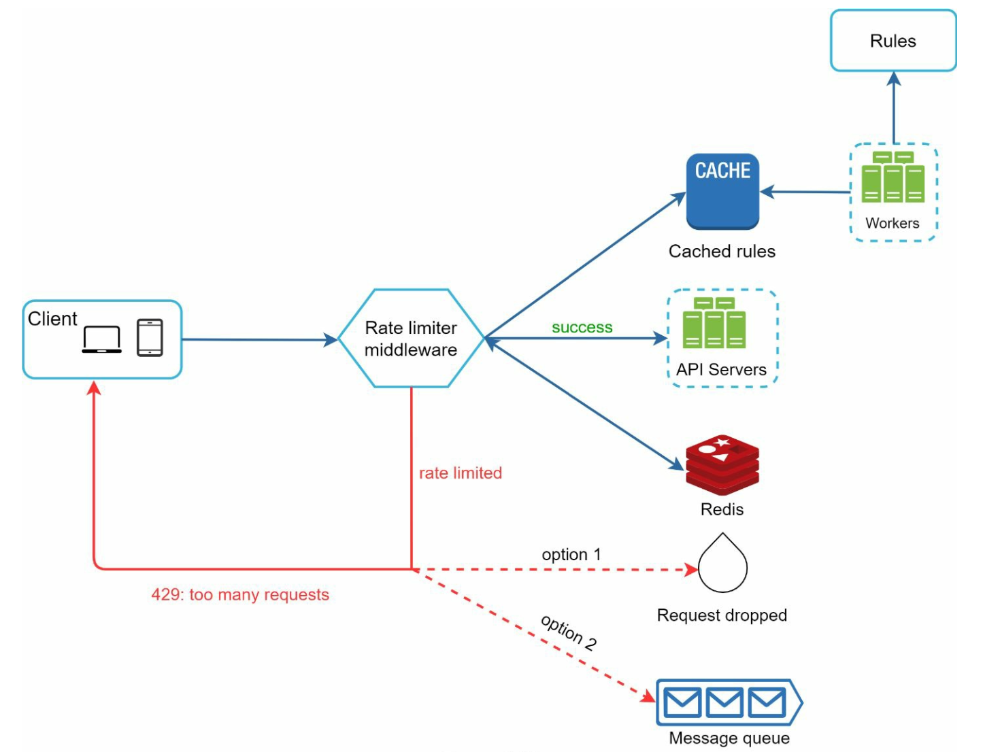

# 第 4 章：设计限流器

> 原章节：Design a Rate Limiter · 原项目路径 `04. Rate Limiter/`

## 本章导读

想象你的登录接口没有做任何限制。某个脚本小子写了个 for 循环，每秒发一万次登录请求，试你的密码。你的数据库连接池被打满，正常用户全部登录失败。

这不是假设——这是每个上线过的服务都遇到过的真实场景。

「限流器（Rate Limiter）」就是解决这类问题的组件：**它决定"单位时间内，某个主体最多能做多少次某个操作"**。

这一章是全书第一个完整的系统设计题。它比第 1 章具体，比后面的章节简单，非常适合用来练习第 3 章的面试框架。而且限流器本身就是面试高频题——因为它足够小，能在 45 分钟里讲透；又足够深，能一路问到分布式一致性和故障降级。

学完这一章，你应该能回答：限流器该放在客户端、网关还是服务端？五种限流算法各自的代价是什么？为什么分布式限流必须保证原子性？**限流器自己挂了的时候，应该放行还是拒绝？**

## 你将学到

- 限流的三个业务价值，以及它和"节流、熔断、降级"的区别
- 限流器的三种部署位置及各自的适用场景
- 五种限流算法的原理、优缺点和适用场景，以及一张完整的对比表
- 限流系统的整体架构，以及限流规则该定义在哪个维度上
- 分布式限流的核心难题：为什么"读-判断-写"三步必须原子，Lua 脚本如何做到
- **fail-open 与 fail-closed**：限流器自身故障时的关键决策
- 工业界实现：Redis `INCR` + `EXPIRE`、`redis-cell`、Nginx `limit_req`、Envoy

---

## 1. 什么是限流器，为什么需要它

「限流器（Rate Limiter）」是一个控制客户端或服务发送请求速率的组件。它可以作用在 API 层，也可以作用在更底层（比如 TCP 连接数、数据库连接数）。

原笔记给了三个业务价值，逐条展开：

**价值一：防止拒绝服务攻击（DoS / DDoS）**

攻击者用大量请求淹没服务，目的是耗尽你的资源（CPU、内存、数据库连接、带宽），让正常用户无法使用。限流器把超额的请求挡在门外，保护后端的资源不被抢光。

> 需要说清楚的是：**限流器不是 DDoS 防护的完整方案**。它只能挡住"应用层"的请求洪流。真正的流量型 DDoS（比如用僵尸网络打满你的带宽）要在更上游处理——CDN、清洗中心、云厂商的防护服务。限流器是纵深防御中的一层，不是全部。

**价值二：降低成本**

每一次请求都要消耗资源。如果某个调用方因为写错了循环，每秒钟发十万次无意义的查询，你会为这些请求付出真实的金钱——云数据库的 IOPS 是按量计费的，带宽是按流量计费的。限流可以挡住这部分浪费。

**价值三：防止过载**

即使请求都是合法的、来自真实用户的，也可能超过系统的处理能力。限流器把流量削到系统能承受的水平，保证已经进入系统的请求能正常完成，而不是所有请求都变慢、最后一起超时。

**业务场景举例**（原笔记给的三个例子都很典型）：

| 场景 | 限制什么 | 为什么 |
|---|---|---|
| 发帖 | 每用户每分钟最多 5 条 | 防垃圾信息、防机器人刷屏 |
| 注册账号 | 每 IP 每天最多 10 个 | 防批量注册小号 |
| 领取奖励 | 每用户每天 1 次 | 防刷单、防薅羊毛 |

### 顺带分清四个概念

初学者经常把这四个词混着用，但它们的含义完全不同：

| 概念 | 英文 | 做什么 | 例子 |
|---|---|---|---|
| **限流** | Rate Limiting | 超过阈值就**拒绝**请求 | 每秒超过 100 次，返回 429 |
| **节流** | Throttling | 超过阈值就**放慢**（排队、延迟） | 超过 100 次/秒的部分排队等待 |
| **熔断** | Circuit Breaking | **停止调用**一个正在故障的下游 | 下游错误率超过 50%，直接不调用它 |
| **降级** | Degradation | 返回**功能不完整但可用**的结果 | 推荐服务挂了，返回热门榜单兜底 |

**限流是"拦"，节流是"缓"，熔断是"断"，降级是"退"。** 四个词在面试里混用会显得很不专业。

---

## 2. 第一步：理解问题、明确需求

> 对应原笔记的 **Step 1: Understanding the Problem**

按第 3 章的框架，第一步要先澄清需求。原笔记列出了两组内容，这里整理清楚。

### 功能性需求（Key Features）

- 服务端的 API 限流器
- 支持多种限流规则（不同 API 不同阈值）
- 在分布式环境下能正常工作
- 可以选择做成独立服务，也可以做成应用内的代码库
- 被限流时要明确告知用户

### 非功能性需求（Requirements）

- **精确限流**：不能误杀（把合法请求拒掉），也不能漏放（让超额请求通过）
- **低延迟**：限流器在请求关键路径上，它慢一点，所有请求都慢一点
- **低内存占用**：要为海量用户维护计数器，内存效率必须高
- **分布式能力**：多个节点共享同一套限流状态
- **异常处理清晰**：被限流时要返回明确的状态码和提示
- **高容错**：限流器自身故障时，不能把整个服务拖垮

> **这里有个需要主动澄清的关键问题（原笔记没提）**：
> "限流器应该精确到什么程度？"
> 因为"精确"和"低延迟 + 低内存"是矛盾的。精确的方案（比如滑动窗口日志）要为每个请求存时间戳；省内存的方案（比如固定窗口计数器）在窗口边界上会放过多余的请求。
> **主动问出这个问题，并说明你选择哪种取舍，是面试中的加分动作。**

### 完整话术示例

> "在开始设计前，我先确认几个问题。
>
> **限流维度**：我们是按用户 ID 限流、按 IP 限流，还是按 API key？不同维度对应不同的存储结构和 key 设计。我的假设是**按用户 ID 为主，IP 为辅**（未登录用户按 IP）。
>
> **部署形态**：限流器是做成一个独立的服务，还是作为中间件嵌入网关？我的假设是**作为 API 网关的中间件**，这样所有服务的限流逻辑统一。
>
> **规则数量**：大概有多少条限流规则？是几十条还是几万条？这决定了规则是放配置文件还是放数据库。
>
> **精确度要求**：我们允许在窗口边界上有少量超额请求吗？如果允许，我可以用滑动窗口计数器省下大量内存；如果要求严格，就必须用滑动窗口日志。
>
> **被限流后的行为**：是直接返回 429，还是排队等待？我默认是**直接拒绝并返回 429 + `Retry-After` 头**。
>
> **故障时的行为**：如果限流器依赖的 Redis 挂了，是放行所有请求，还是拒绝所有请求？这个我们待会儿要专门讨论。
>
> 我先按这些假设往下走。"

---

## 3. 第二步：高层设计——限流器放在哪里

> 对应原笔记的 **Step 2: High-Level Design**

限流器可以放在三个位置，各有取舍。

<div align="center"></div>

### 位置一：客户端实现

把限流逻辑写在客户端（App、SDK、前端）里。

**缺点：客户端完全不可信。**

- 攻击者可以绕过客户端，直接调你的 API
- 用户改一下配置就能关掉限流
- 客户端版本发出去就收不回来，规则改了要等用户升级

**结论：客户端限流只能作为"体验优化"（比如避免用户误操作触发限流），不能作为安全措施。**

> **但有一个例外值得知道**：客户端**主动配合**限流是很有价值的。比如客户端收到 429 后，按 `Retry-After` 退避重试，而不是立刻重试。这不是"限流"，是"礼貌"。真正的限流必须在服务端。

### 位置二：服务端实现

限流逻辑放在 API 服务内部（比如一个拦截器 / 中间件）。

**优点**：完全可控，服务端说了算。

**缺点**：如果有很多个服务，每个服务都要实现一遍限流逻辑，**规则散落各处，难以统一管理和修改**。

### 位置三：中间件（API 网关）

把限流做成 API 网关（API Gateway）的一层。

**优点**：

- **集中管理**：所有服务的限流规则在一处配置
- **统一实现**：不用每个服务重复造轮子
- **和微服务架构天然契合**

**缺点**：网关是单点，需要保证它自身的高可用和低延迟。

### 怎么选（原笔记给的选型指南）

| 原则 | 说明 |
|---|---|
| 评估现有技术栈，选效率最高的方案 | 如果你已经用了 Nginx / Envoy / Kong，直接用它们的限流能力 |
| 根据业务需求选择算法 | 见第 4 节的对比表 |
| 用微服务架构就用 API 网关 | 这是最自然的选择 |
| 资源有限就买商业方案 | 云厂商的 API 网关通常自带限流，不用自己造 |

> **补充一条原笔记没说的工程判断**：
> **限流最好在多层同时做。** 真实系统通常是：
> - **接入层（Nginx / Envoy）**：做粗粒度的 IP 级限流，挡住明显的洪水攻击
> - **网关层**：做用户级 / API key 级的业务限流
> - **服务层**：做最细粒度的业务规则（比如"每个用户每天最多领 1 次奖励"）
>
> 为什么要分层？因为**越靠外层，能挡掉的流量越多，代价越小**。让洪水在接入层就被挡掉，后面的组件就不用承担这份压力。

---

## 4. 第三步：深入设计——五种限流算法

> 对应原笔记的 **Step 3: Rate Limiting Algorithms**

这是本章的核心。五种算法，我们从最简单的开始。

### 算法一：令牌桶（Token Bucket）

<div align="center"></div>

**怎么工作**

想象一个水桶，旁边有个水龙头以固定速率往里滴"令牌"：

1. 桶的容量固定（比如 5 个令牌），装满就不再增加
2. 每来一个请求，就从桶里取走 1 个令牌
3. 桶里有令牌 → 请求放行；桶是空的 → 请求被拒绝（或排队）

**两个参数**：

- **桶容量（Bucket Size）**：决定能承受多大的突发流量。容量 5 意味着最多允许连续 5 个请求瞬间通过。
- **补充速率（Refill Rate）**：决定长期的稳定速率。比如每秒补 1 个令牌，长期平均就是 1 QPS。

**为什么它能支持突发流量？**

这是令牌桶最重要的特性。如果桶容量 10、补充速率 1/秒，那么：

- 系统空闲了 10 秒，桶里攒了 10 个令牌
- 突然来了 10 个请求 → **全部放行**（瞬间 10 QPS）
- 之后的请求只能按每秒 1 个的速度通过

也就是说，**长期速率被限制在补充速率上，但允许短时间内的突发**。这非常符合真实业务的形态——用户不是匀速操作，而是"安静一会儿，然后连着点几下"。

**优点**：实现简单、内存占用极小（只需存两个数字：当前令牌数、上次补充时间）、支持突发。

**缺点**：两个参数需要调优。容量太小挡不住正常突发，容量太大又失去了保护作用。

> **工程实现的关键技巧：不需要真的开一个定时器去补令牌。**
> 只需存"当前令牌数"和"上次补充的时间戳"。每次请求来时，按时间差惰性计算应该补多少令牌：
>
> ```
> 应补令牌数 = (当前时间 - 上次补充时间) × 补充速率
> 当前令牌数 = min(桶容量, 当前令牌数 + 应补令牌数)
> ```
>
> 这叫**惰性计算**。省掉了后台定时任务，是令牌桶在生产环境中唯一合理的实现方式。

### 算法二：漏桶（Leaky Bucket）

<div align="center"></div>

**怎么工作**

想象一个底部有个小孔的桶：

1. 请求进来先放进一个**先进先出队列（FIFO Queue）**
2. 桶底以**固定的速率**把请求"漏"出去（交给后端处理）
3. 队列满了，新来的请求就被丢弃

**和令牌桶的区别是什么？**

这是初学者最容易搞混的地方，一句话说清：

> **令牌桶限制的是"速率上限"，允许突发；漏桶强制的是"恒定流出速率"，不允许突发。**
>
> - 令牌桶：桶里攒了令牌，突发请求就能立刻全部通过。
> - 漏桶：无论进来多快，出去的速度恒定不变。突发只能排队等待。

**优点**：内存占用小（只需要一个队列）；**流出速率绝对稳定**，这对保护脆弱的下游特别有用。

**缺点**：突发流量会填满队列，**后续的请求要么长时间等待，要么直接被丢弃**。

> **适用场景**：下游是一个处理能力固定、且不能被突刺冲击的服务。比如给第三方支付网关发请求——对方要求你必须匀速调用，这时候漏桶就是正确选择。

**一个典型的工业实现**：[uber-go/ratelimit](https://github.com/uber-go/ratelimit)（原笔记给的链接）。它实现了"不漏桶"式的限流——调用方会阻塞到下一个令牌可用为止。

> **术语提醒**：原笔记把这个算法写成了 "Leaking Bucket"，**正确术语是 "Leaky Bucket"**。详见【勘误 1】。

### 算法三：固定窗口计数器（Fixed Window Counter）

<div align="center"></div>

**怎么工作**

1. 把时间切成固定长度的窗口（比如每 1 分钟一个窗口）
2. 每个窗口维护一个计数器，初始为 0
3. 请求进来，计数器 +1
4. 计数器超过阈值 → 拒绝；到了下一个窗口，计数器归零

**优点**：实现极简单，内存占用小（每个窗口只需要一个整数）。如果业务对精度要求不高，这是最经济的选择。

**缺点：窗口边界问题。**

这是这个算法唯一的、但很严重的缺陷。看一个具体例子：

**假设限制是"每分钟最多 3 个请求"，窗口按自然分钟切分。**

```
时间轴：  |---- 00:00 ~ 00:59 ----|---- 01:00 ~ 01:59 ----|
请求分布：                 58s 59s | 00s 01s 02s
每个窗口计数：              2 个   |        3 个
```

- 00:00–00:59 这个窗口只有 2 个请求 → 没有超限
- 01:00–01:59 这个窗口有 3 个请求 → 也没有超限

**但是在 00:00:58 到 01:00:02 这 4 秒内，一共通过了 5 个请求。**

而这 5 个请求全部落在"00:00:58 到 01:00:58"这个 60 秒的滑动区间内——**这个区间里的请求数是 5，是限额 3 的 1.67 倍。**

<div align="center"></div>

这就是原笔记说的"窗口边缘的流量突刺会让实际通过的请求数超过配额"。**攻击者只要卡在窗口切换的瞬间发请求，就能拿到接近 2 倍的配额。**

### 算法四：滑动窗口日志（Sliding Window Log）

<div align="center"></div>

**怎么工作**

1. 为每个限流主体维护一个**有序集合**，里面存每一次请求的时间戳
2. 新请求到来时，先删掉所有落在窗口之外的时间戳（比如删除 60 秒之前的）
3. 剩下的元素个数就是当前窗口内的请求数
4. 如果数量 < 限额 → 放行，并把当前时间戳加入集合；否则拒绝

**优点**：**完全精确**。因为它记录的是真实的请求时间，窗口是真正"滑动"的，不存在固定窗口的边界问题。

**缺点**：**内存消耗极高。**

假设限制是"每小时最多 100 万次请求"，那么最坏情况下你要为单个用户存 100 万个时间戳。一个时间戳按 8 字节算就是 8 MB，10 万个用户就是 800 GB——**完全不可接受**。

> **所以滑动窗口日志只适合限额很小的场景**（比如"每分钟 5 次"这种）。原笔记给的"高内存消耗"这个判断是准确的。
>
> **实现提示**：在 Redis 里用 **Sorted Set（ZSET）** 实现——member 用请求 ID（保证唯一），score 用时间戳。这样既能按 score 范围删除过期元素，又能用 `ZCARD` 取计数。

### 算法五：滑动窗口计数器（Sliding Window Counter）

<div align="center"></div>

**怎么工作**

这是固定窗口和滑动窗口日志的折中方案，也是最常被工业界采用的方案。

它只保留**两个**计数器：当前窗口的计数，和上一个窗口的计数。然后用一个加权公式来估算"过去 60 秒内的请求数"。

**公式**：

```
估算请求数 = 当前窗口计数 + 上一个窗口计数 × 上一个窗口的重叠比例
```

其中，重叠比例 = 上一个窗口在当前滑动窗口中所占的比例。

**完整算例**（这个例子一定要会手推）：

假设限额是**每分钟 7 个请求**，当前时刻是 01:00:18（即当前窗口已经过去了 30%）。

- 上一个窗口（00:00–00:59）的计数 = 5
- 当前窗口（01:00–01:59）的计数 = 3

那么，过去 60 秒是"01:00:18 往前推 60 秒"，即从 00:00:18 到 01:00:18。这段区间里：

- 完整包含当前窗口已经过去的部分（01:00:00–01:00:18），共 3 个请求
- 包含上一个窗口的后 42 秒（00:00:18–00:59:59），占上一个窗口的 `42/60 = 70%`

```
估算请求数 = 3 + 5 × 0.7 = 3 + 3.5 = 6.5
向下取整 → 6
```

`6 < 7`，所以**新请求放行**。

**优点**：

- 内存占用小（每个主体只需要 2 个计数器，而不是 100 万个时间戳）
- 平滑掉了固定窗口的边界突刺（因为上一个窗口的计数被按比例算进来了）

**缺点**：**它是一个近似，不是精确值。**

因为公式假设"上一个窗口里的请求是均匀分布的"，但实际上可能全部集中在窗口末尾。所以估算值可能偏乐观，也可能偏保守。

> **这是可以接受的取舍吗？** 在实践中通常可以。有公开的工程分析指出，在真实流量下这种近似的误差通常只有百分之几（远小于固定窗口在边界上可能达到的 100% 超额）。**面试时说清"这是近似、误差来源是均匀分布假设"，比只说'它是近似的'要有力得多。**

### 五种算法对比与选型

原笔记逐个列了五种算法，但没有横向对比。这张表是本章最需要补上的内容：

| 算法 | 精确度 | 内存 | 支持突发 | 实现复杂度 | 典型适用场景 |
|---|---|---|---|---|---|
| **令牌桶** | 高 | 极低（2 个数字） | ✅ 支持，且可调 | 低 | **通用首选**。API 网关、需要允许合理突发的业务 |
| **漏桶** | 高 | 低（一个队列） | ❌ 强制匀速 | 低 | 下游要求恒定速率（第三方 API、脆弱的下游服务） |
| **固定窗口计数器** | 低（边界可超 100%） | 极低（1 个整数） | ❌ | 极低 | 对精度要求不高的粗粒度保护，比如 IP 级洪水拦截 |
| **滑动窗口日志** | 最高（精确） | **极高** | ❌ | 中 | 限额很小的场景（每分钟几次），且要求严格精确 |
| **滑动窗口计数器** | 中（近似） | 低（2 个计数器） | 部分平滑 | 中 | **工业界最常用**。要在精度和内存之间取平衡的场景 |

**选型决策树**（面试时可以直接照着说）：

```
需要严格精确吗？
├─ 是 → 限额大吗？
│        ├─ 大（每秒几千）→ 滑动窗口计数器（接受近似）+ 短窗口
│        └─ 小（每分钟几次）→ 滑动窗口日志
└─ 否 → 需要允许突发吗？
         ├─ 需要 → 令牌桶
         └─ 不需要，要匀速 → 漏桶
```

> **一句话记住**：**令牌桶是通用答案，滑动窗口计数器是工业答案，滑动窗口日志是精确但昂贵的答案。**

---

## 5. 把算法落到系统上：整体架构

> 对应原笔记的 **High-Level Architecture** 一节

选好算法之后，要把它落成一个真实系统。

<div align="center"></div>

### 数据存储

**用内存缓存（如 Redis）来存计数器。**

为什么必须是内存而不是数据库？

- 限流器在**每一个请求**的关键路径上，它的延迟会被加到所有请求上
- Redis 的读写在**百微秒级**，而 MySQL 在毫秒级——差一个数量级
- 计数器是高频读写的临时数据，不需要持久化保证

> **补充一点原笔记没说的**：限流状态**可以接受丢失**。如果 Redis 重启，计数器归零，最坏的结果是"短时间内放宽了限流"。这个代价通常可以接受。
> **所以限流用的 Redis 一般不开 AOF 持久化**，甚至可以用 `maxmemory-policy noeviction` 之外更激进的策略——因为它就是一份缓存。这一点和"存用户数据"的 Redis 是完全不同的使用姿势。

### 三步流程

原笔记给的三步很清晰：

1. 客户端发请求到中间件
2. 中间件检查 Redis 里的计数器
3. 根据限额决定处理还是拒绝

**这里要补上第 4 步——被拒绝之后要做什么**（原笔记的流程在"拒绝"之后就断了）：

4. **如果拒绝**：返回 **HTTP 429（Too Many Requests）**，并在响应头里告知用户什么时候可以重试

**响应头应该带什么？**

| 响应头 | 含义 | 示例 |
|---|---|---|
| `X-RateLimit-Limit` | 窗口内的总配额 | `100` |
| `X-RateLimit-Remaining` | 剩余可用次数 | `7` |
| `X-RateLimit-Reset` | 配额重置的时间（Unix 时间戳） | `1710000000` |
| `Retry-After` | 建议多少秒后重试（配合 429） | `12` |

> 上面的 `X-RateLimit-*` 是事实标准（GitHub、Twitter 等都在用）。IETF 有一个正在推进的标准草案，去掉了 `X-` 前缀，改成 `RateLimit-Limit` / `RateLimit-Remaining` / `RateLimit-Reset`。**面试时说"我用 `X-RateLimit-*` 这套事实标准，同时知道 IETF 在推进无前缀版本"是最加分的答案。**
>
> **为什么一定要返回这些头？** 因为一个"好的"限流器不只拒绝请求，还要让调用方知道**如何正确重试**。返回 429 但不告诉对方何时可以重试，会导致客户端盲目重试，反而加剧拥塞。

### 限流规则定义在哪个维度上

原笔记没有提这一点，但它是设计限流系统时必须回答的问题。常见的限流维度：

| 维度 | 适用场景 | 注意事项 |
|---|---|---|
| **用户 ID** | 已登录用户的业务限流 | 最准确，但未登录用户没有 ID |
| **IP 地址** | 未登录用户、防爬 | **共享 NAT 下大量用户共用一个 IP**，容易误杀 |
| **API Key / 租户 ID** | 面向开发者的开放平台 | 按套餐分级限流 |
| **接口路径** | 保护特定接口 | 常和上面几个维度组合 |
| **全局** | 保护整个系统不被打垮 | 兜底，不区分来源 |

**规则怎么组合？** 真实系统通常是**多个规则同时生效，取最严格的那个**：

```
规则 1：用户 12345 每分钟最多 100 次
规则 2：IP 1.2.3.4 每分钟最多 500 次
规则 3：/api/login 接口全局每分钟最多 10000 次

→ 三个规则都检查，任何一个超限就拒绝
```

> **IP 限流的一个大坑**：公司、学校、运营商出口都在用 NAT，一个 IP 背后可能是几万个真实用户。如果按 IP 限得太死，会一次性误杀整个公司。**对策**：对已登录用户优先用用户 ID；IP 限流只用于"防洪水"这种粗粒度场景，阈值要放得很宽。

---

## 6. 第三步（续）：分布式限流、性能与监控

> 对应原笔记的 **Advanced Considerations** 一节

单机限流器很简单：一个内存里的计数器就够了。但真实系统是多台机器，问题立刻变得复杂。

### 分布式环境的核心难题

原笔记只写了一句话："**Challenges: Race conditions, synchronization issues. Solutions: Use locks, Lua scripts, or sorted sets in Redis.**"

**这句话太简略了，缺了最关键的一环：为什么需要原子性。** 这里完整补上。

#### 为什么需要原子性：一个具体的竞态条件

假设限流规则是"每分钟最多 5 个请求"，计数器存在 Redis 里，当前值是 4。

现在有**两个请求同时到达**，分别落在两台不同的服务器上：

```
时刻 T1:  服务器 A 读取计数器 → 得到 4
时刻 T2:  服务器 B 读取计数器 → 得到 4
时刻 T3:  服务器 A 判断 4 < 5 → 放行
时刻 T4:  服务器 B 判断 4 < 5 → 放行
时刻 T5:  服务器 A 写入计数器 → 5
时刻 T6:  服务器 B 写入计数器 → 5
```

**结果：两个请求都放行了，但计数器只涨到了 5。** 实际上这个窗口里应该有 6 个请求（原来的 4 个 + 新的 2 个），**超额了 1 个**。

这就是「竞态条件（Race Condition）」：**"读 → 判断 → 写"这三步不是一个原子操作**，两个请求的这三步交错执行了，导致判断基于的是过期的数据。

**问题有多严重？** 在单机限流里，这个问题很小（因为并发窗口极短）。但在分布式限流里：

- 如果有 100 台服务器，每台都在同一瞬间读到 `4`，就可能放行 100 个请求
- **限额是 5，实际放行了 104 个——限流器彻底失效**

> **面试中一定要说出这句话**："分布式限流的第一个难题是竞态条件——读、判断、写必须作为一个原子操作完成，否则并发请求会读到同一个旧值，导致超额放行。"

#### 怎么保证原子性

原笔记给了三个方案，但没说清各自的代价。这里逐个分析：

**方案 A：加分布式锁（不推荐）**

思路：每个请求先抢一把分布式锁，拿到锁之后再做"读-判断-写"，做完释放锁。

**为什么通常不推荐？**

- **性能灾难**：限流器在每一个请求的关键路径上。加锁意味着所有请求串行化，吞吐量会被锁竞争拖垮。
- **引入新的故障点**：锁服务本身挂了怎么办？锁没释放（客户端崩溃）怎么办？需要额外处理锁超时、锁续期。
- **收益不成比例**：为了限流这一个操作引入分布式锁，架构复杂度大幅上升。

**结论**：加锁是"可行但代价过高"的方案。**只有在限流逻辑非常复杂、无法用单条原子命令表达时，才考虑它。**

**方案 B：Lua 脚本（推荐）**

这是分布式限流的**主流方案**。

**为什么 Lua 脚本能保证原子性？**

关键事实：**Redis 执行命令是单线程的，而且一个 Lua 脚本在执行期间，Redis 不会处理其他任何命令。**

也就是说，当 Redis 开始执行一个 Lua 脚本时，它会把整个脚本当成**一个不可分割的整体**执行完，中途不会被其他请求插进来。这正好解决了"读-判断-写"被交错执行的问题。

**用 Lua 实现滑动窗口日志的示意**：

```lua
-- KEYS[1] = 限流 key（如 rate_limit:user:12345）
-- ARGV[1] = 当前时间戳（毫秒）
-- ARGV[2] = 窗口大小（毫秒）
-- ARGV[3] = 限额

local key        = KEYS[1]
local now        = tonumber(ARGV[1])
local window     = tonumber(ARGV[2])
local limit      = tonumber(ARGV[3])

-- 1. 删除窗口外的旧记录
redis.call('ZREMRANGEBYSCORE', key, 0, now - window)

-- 2. 统计窗口内的请求数
local count = redis.call('ZCARD', key)

-- 3. 判断是否超限
if count < limit then
    -- 4. 未超限：记录本次请求，放行
    redis.call('ZADD', key, now, now .. '-' .. math.random())
    redis.call('PEXPIRE', key, window)
    return 1          -- 放行
else
    return 0          -- 拒绝
end
```

**关键点**：这四步（删除过期、计数、判断、写入）在同一个脚本里，Redis 保证它们原子执行。**无论多少个并发请求同时到达，都不会出现两个请求读到同一个旧值的情况。**

> **一个必须知道的 Redis 坑**：如果用的是 **Redis Cluster**，Lua 脚本里涉及的所有 key 必须在**同一个哈希槽（slot）**上，否则会报 `CROSSSLOT` 错误。
> 解决办法是使用 **hash tag**——把 key 写成 `rate_limit:{user:12345}:window`，花括号里的部分决定了分片，保证同一个用户的 key 落在同一个槽上。
> **面试中能主动提这一点，说明你真的用过 Redis Cluster 做限流。**

**方案 C：Sorted Set（有序集合）**

这其实是**滑动窗口日志的数据结构**，不是独立的"原子性方案"。

- `ZREMRANGEBYSCORE` 删除过期记录
- `ZCARD` 统计数量
- `ZADD` 添加新记录

**但如果这三条命令分开执行，它依然有竞态条件。** 所以正确用法是：**把 Sorted Set 的操作包在 Lua 脚本里**（就是上面方案 B 的代码）。

**结论**：原笔记把"Lua 脚本"和"有序集合"并列成两种方案，其实它们是**协作关系**——Sorted Set 是数据结构，Lua 是保证原子性的手段。

#### 其他分布式问题

| 问题 | 表现 | 对策 |
|---|---|---|
| **状态同步延迟** | 多个 Redis 副本之间同步有延迟 | 限流状态用**单个 Redis 主节点**（或 Redis Cluster 的单一分片）保证强一致 |
| **跨数据中心延迟** | 用户在美国，限流器在亚洲，每次请求多 150 ms | 每个数据中心独立限流（各分一部分配额），或用就近的限流节点 |
| **Redis 成为单点** | Redis 挂了，限流器全挂 | 见下面的 fail-open / fail-closed |
| **热 key** | 某个超级用户的计数器被高频访问 | 本地缓存 + 批量上报；或对同一用户做 key 分片 |

### 性能优化

原笔记给了两条，都很对：

1. **多数据中心部署降低延迟**——就近限流，但要注意配额如何分配（各机房独立配额，还是全局共享？）
2. **最终一致性模型做同步**——限流状态不需要强一致，短暂的不一致（多放行几个请求）通常可以接受

**再补一条最实用的**：

3. **本地预检 + 远程精确限流**。每台服务器在内存里维护一个粗略的本地计数器，先本地判断；只有本地计数接近阈值时，才去问 Redis。这样能把绝大部分请求的限流判断做成**零网络开销**。

> **不过要小心**：本地预检会让限额变得不精确（每台机器都有自己的计数）。所以它只适合"防洪水"这类粗粒度场景，不适合"每用户每天 1 次领奖"这种必须精确的场景。

### 监控

原笔记说："定期分析，确保算法有效，并按需调整规则。"

这句话方向对，但太笼统。**具体要监控什么？**

| 指标 | 为什么重要 |
|---|---|
| **被限流的请求比例** | 如果超过 1%，说明规则可能太严，正在误杀正常用户 |
| **被限流的请求来源分布** | 是少数几个 IP 在刷，还是大面积用户都触发了？前者是攻击，后者是规则设计错误 |
| **限流器的 P99 延迟** | 它在关键路径上，延迟升高会拖慢所有请求 |
| **Redis 的命中率和错误率** | 限流器依赖 Redis，它的健康度就是限流器的健康度 |
| **规则命中分布** | 哪些规则从来没触发过？可能是阈值设得毫无意义 |

> **一个很容易被忽略的点**：**限流规则需要和业务方一起 review**。规则太松等于没有，太严会误杀用户。这个"调参"过程是持续的，不是一次性的。

---

## 7. 第四步（原笔记缺失）：收尾

原笔记在"监控"之后就结束了，**没有 Step 4 收尾环节**。按第 3 章的框架，收尾要总结取舍、指出不足、提出改进方向。这里补上本章应该有的收尾内容。

### 硬限流 vs 软限流（Hard vs Soft Rate Limiting）

这是一个非常实用的设计选择：

| 类型 | 行为 | 适用场景 |
|---|---|---|
| **硬限流** | 超过阈值直接返回 429，拒绝请求 | 保护系统不被打垮；对外 API 的配额 |
| **软限流** | 允许请求通过，但打上"超限"标记 | 观察期：先看看新规则会影响多少用户，再决定要不要真的拒绝 |

**软限流的价值**：上线一条新规则时，先用软限流跑一周，统计"如果硬限流会有多少请求被拒"。**避免因为阈值设错而误杀大量正常用户。**

### 不同接口用不同的限流规则

不应该所有接口用同一个阈值。典型的差异化：

| 接口类型 | 限流策略 |
|---|---|
| 读接口（查询） | 阈值可以放宽，因为成本低 |
| 写接口（发帖、评论） | 阈值要收紧，因为要落库 |
| 昂贵接口（报表导出、全量搜索） | 阈值极低，甚至要求排队 |
| 敏感接口（登录、短信验证码、支付） | **阈值最低，且必须 fail-closed**（见下） |

### 客户端如何优雅地应对被限流

限流器设计得好，还要调用方配合。**这三条是面试加分项**：

1. **客户端缓存**：减少不必要的请求，从源头降低触发限流的概率
2. **指数退避 + 抖动（Exponential Backoff with Jitter）**：被限流后，不要立刻重试，等待时间按 `1s → 2s → 4s → 8s` 递增，并加入随机抖动避免"重试风暴"
3. **尊重 `Retry-After` 头**：服务端告诉你等多久，就等多久

```python
import random, time

def call_with_backoff(fn, max_retries=5):
    for attempt in range(max_retries):
        resp = fn()
        if resp.status_code != 429:
            return resp
        # 优先使用服务端给的 Retry-After
        wait = float(resp.headers.get("Retry-After", 2 ** attempt))
        # 加抖动，避免所有客户端同时重试
        wait += random.uniform(0, wait * 0.1)
        time.sleep(wait)
    raise Exception("rate limited after retries")
```

### 关键决策：限流器自身故障时，放行还是拒绝？

**这是本章最重要、也是原笔记完全没提的一个决策。** 面试中主动提出这个问题，会显著加分。

限流器依赖 Redis。**如果 Redis 挂了，你的限流器该怎么办？** 只有两个选择：

| 策略 | 行为 | 好处 | 代价 |
|---|---|---|---|
| **fail-open（故障放行）** | Redis 挂了 → **放行所有请求** | 服务保持可用 | 限流失效，可能被洪水打垮 |
| **fail-closed（故障拒绝）** | Redis 挂了 → **拒绝所有请求** | 保护后端不被压垮 | **Redis 一挂，整个服务全面不可用** |

**怎么选？**

核心判断依据是：**"失去限流保护"和"服务完全不可用"，哪个后果更严重？**

| 场景 | 推荐策略 | 理由 |
|---|---|---|
| 普通读接口 | **fail-open** | 短时间没有限流不会致命；但全部拒绝会立刻造成全站不可用 |
| 登录 / 短信验证码 / 支付 | **fail-closed** | 这些接口被刷的后果（盗号、短信轰炸产生真金白银的损失）比短暂不可用更严重 |
| 内部服务调用 | **fail-open + 本地兜底** | 内部流量可控 |

**实践中最重要的折中：fail-open + 本地兜底限流。**

```
如果 Redis 不可用：
  1. 降级到每台服务器内存里的本地令牌桶（阈值设得很宽，比如全局阈值的 1/N）
  2. 至少保证单个节点不会被无限打垮
  3. 同时触发告警，让人工介入
```

**为什么这是最优解？**

- 纯 fail-open 会让后端完全裸奔，一个洪水就能打垮整个系统
- 纯 fail-closed 会让"Redis 抖动 5 秒"升级成"全站故障 5 分钟"
- **fail-open + 本地兜底** 保住了可用性，同时保留了一层粗糙但有效的保护

> **面试标准答法**：
> "限流器故障时，默认应该 **fail-open**——因为限流器是保护层，不是业务功能，它不该成为新的单点故障。但这个默认要分场景：对于登录、验证码、支付这类安全敏感接口，应该 **fail-closed**，因为被刷的代价高于短暂不可用。生产环境的做法是 **fail-open + 本地内存限流兜底 + 告警**，既不裸奔也不全挂。"

**这个回答包含了三层：默认策略、按场景区分、工程折中。** 能说出这三层，说明你真正思考过，而不是背了一个名词。

---

## 8. 补充：工业界实现

原笔记只给了 uber-go/ratelimit 一个链接。这里补齐主流实现，面试中能报出具体的产品名和配置项，是明显的加分项。

### Redis：`INCR` + `EXPIRE`（固定窗口）

这是最经典的实现，也是最容易写错的。

```bash
# 每次请求执行：
INCR rate_limit:user:12345          # 计数器 +1，返回新值
EXPIRE rate_limit:user:12345 60     # 设置 60 秒过期
```

**它为什么有坑？**

如果 `INCR` 成功、但在 `EXPIRE` 之前进程崩溃（或网络中断），这个 key 就**永远不会过期**。结果是这个用户被**永久限流**。

**正确写法（三种）**：

**写法一：用 Lua 脚本保证原子性**

```lua
local current = redis.call('INCR', KEYS[1])
if current == 1 then
    redis.call('EXPIRE', KEYS[1], ARGV[1])
end
return current
```

只在第一次（`current == 1`）时设置过期时间，且整个操作原子。

**写法二：用 `SET ... EX ... NX` 先建 key**

```bash
SET rate_limit:user:12345 0 EX 60 NX   # 不存在才创建，并带上过期时间
INCR rate_limit:user:12345             # 再自增
```

**写法三：直接在一个命令里完成**

```
SET rate_limit:user:12345 0 EX 60 NX
```

`INCR` 本身是原子的，所以计数器不会算错；问题只出在"过期时间可能没设上"。上面三种写法都能解决。

> **注意**：这个方案实现的是**固定窗口计数器**，所以它有窗口边界的突刺问题（见第 4 节）。它适合"防洪水"这类粗粒度场景。

### `redis-cell`：用 GCRA 实现令牌桶

`redis-cell` 是一个 Redis 模块，提供 `CL.THROTTLE` 命令，底层用的是 **GCRA（Generic Cell Rate Algorithm，通用信元速率算法）**。

**GCRA 是什么？** 它是"漏桶作为计量器（Leaky Bucket as a Meter）"的等价实现。它不需要真的维护一个桶和队列，而是用一个**理论到达时间（TAT, Theoretical Arrival Time）**来表示状态——**每个限流主体只需要存一个时间戳**，内存效率极高。

```bash
CL.THROTTLE user:12345 15 30 60 1
#              key     上限 补速 窗口 消耗
# → 返回：是否允许、总配额、剩余、重试等待秒数、重置秒数
```

**它的优势**：单条命令、原子、返回信息完整（包含 `Retry-After` 所需的秒数）、内存极省。

**选用前需要注意**：`redis-cell` 是一个第三方 Redis 模块，需要单独编译加载；而且项目的更新节奏比较慢。**在生产环境选用前，应评估它的维护状态和你的 Redis 版本兼容性。** 如果你不想引入模块，用 Lua 脚本自己实现 GCRA 或令牌桶也是常见做法。

### Nginx：`limit_req`（漏桶）

Nginx 内置的 `limit_req` 模块实现的是**漏桶算法**，这是它在生产环境中最广泛的用途之一。

```nginx
http {
    # 定义限流区域：按客户端 IP 限流，共享内存 10MB，速率 10 请求/秒
    limit_req_zone $binary_remote_addr zone=api_limit:10m rate=10r/s;

    server {
        location /api/ {
            # 应用限流：允许突发 20 个请求，且不延迟处理（nodelay）
            limit_req zone=api_limit burst=20 nodelay;

            proxy_pass http://backend;
        }
    }
}
```

**关键参数**：

| 参数 | 含义 |
|---|---|
| `limit_req_zone` | 定义限流区域。`$binary_remote_addr` 是限流维度（这里按 IP） |
| `rate=10r/s` | 漏桶的流出速率 |
| `burst=20` | 队列容量。允许 20 个请求排队 |
| `nodelay` | 队列中的请求**立即处理**，而不是按速率平滑放出 |

**关于 `nodelay` 的重要区别**：

- **不加 `nodelay`**：超出的请求会排队，并按 `rate` 匀速放行——这是**标准漏桶**行为，会增加响应延迟。
- **加 `nodelay`**：`burst` 范围内的请求立刻放行——这时的行为更接近**令牌桶**（允许突发），只是超出 `burst` 的部分才被拒绝。

> **这是面试中一个很好的细节**：能说出"Nginx 的 `limit_req` 本质是漏桶，但加 `nodelay` 后行为趋近令牌桶"，说明你真的读过文档，而不是只知道"Nginx 能限流"。
>
> Nginx 还有 `limit_conn`（限制并发连接数），它和 `limit_req`（限制请求速率）是两个不同的维度，经常一起用。

### Envoy：本地限流 + 全局限流

Envoy 作为现代服务网格的数据面，提供了两级限流：

| 类型 | 过滤器 | 特点 |
|---|---|---|
| **本地限流（Local Rate Limit）** | `envoy.filters.http.local_ratelimit` | 每个 Envoy 实例独立计数，**用令牌桶实现**。零网络开销，但全局配额是"每实例配额 × 实例数" |
| **全局限流（Global Rate Limit）** | `envoy.filters.http.ratelimit` + 外部 RLS 服务 | Envoy 把请求描述符（descriptor）发给一个 gRPC 限流服务（**RLS**），由它做全局计数。精确，但多一次网络调用 |

**为什么 Envoy 要分两级？**

- 本地限流挡掉绝大部分明显的超量流量，**不产生网络开销**
- 全局限流只对"通过了本地检查、但可能突破全局配额"的请求做精确判定

**Envoy 的故障策略是可配置的**——在 `ratelimit` 过滤器里有 `failure_mode_deny` 选项：设为 `true` 就是 **fail-closed**，设为 `false`（默认）就是 **fail-open**。**这正好印证了第 7 节讲的决策：这不是"对错"问题，而是"配置项"问题，取决于业务场景。**

### 其他值得一提的实现

| 产品 / 库 | 算法 | 备注 |
|---|---|---|
| **Guava `RateLimiter`**（Java） | 令牌桶 | **仅限单 JVM**，不能跨进程共享状态。适合单机场景 |
| **Bucket4j**（Java） | 令牌桶 | 支持分布式（可接 Redis、Hazelcast、JDBC），API 友好 |
| **Kong API Gateway** | 多种 | 插件式，支持按 consumer / credential 限流 |
| **AWS API Gateway** | 固定窗口 | 通过 **Usage Plan** 配置"速率 + 突发"两个值 |
| **Cloudflare** | 多种 | 边缘节点限流，能在流量到达源站前就挡住 |

> **一个选型建议**：如果你已经有 API 网关（Nginx、Envoy、Kong），**优先用网关自带的限流能力**。自己实现一套分布式限流器，要处理的边界情况（原子性、Redis Cluster、fail-open、时钟漂移、规则热更新）比想象中多得多。

---

## 勘误与补充

> 原笔记本章的算法描述基本正确，但在**术语、结构完整性和工程深度**三个方面有明显问题。以下逐条说明。

### 勘误 1：`Leaking Bucket` 是错误的术语

- **原文说法**：第二种算法的标题写作 **"Leaking Bucket"**，配图名为 `leaking-bucket.png`。
- **问题**：`Leaking` 是"正在漏的"（动词进行时），`Leaky` 是"会漏的"（形容词）。这个算法的标准英文名是 **Leaky Bucket**——它描述的是"一个会漏的桶"这个**容器属性**，而不是"正在发生泄漏"这个动作。在英文技术文献、Nginx / Envoy 文档、以及 Alex Xu 原书中，统一写作 **Leaky Bucket**。
- **正确说法**：**Leaky Bucket（漏桶）**。搜索相关资料时用 `leaky bucket` 才能找到正确的算法资料（用 `leaking bucket` 会搜到大量关于"内存泄漏"的无关内容）。
- **延伸**：这类术语错误在面试中是明显的减分项——面试官会怀疑你只是"看过中文博客的二手转述"，而不是读过原始资料。**本章正文已统一改用 Leaky Bucket。**
- **说明**：图片文件名 `leaking-bucket.png` 是原项目自带的资源，按规范不做重命名，仅正文术语已更正。

### 勘误 2：章节结构断层——缺少 Step 4，且 Step 2 的内容被放到了 Step 3 之后

- **原文说法**：原笔记的编号是 `Step 1: Understanding the Problem` → `Step 2: High-Level Design` → `Step 3: Rate Limiting Algorithms`，之后直接跳到 `High-Level Architecture` 和 `Advanced Considerations` 两个无编号小节，**没有 Step 4**。
- **问题**：两处结构问题。
  1. **缺少收尾环节**。按第 3 章的四步框架（也是 Alex Xu 原书的结构），最后必须有 Step 4（Wrap-Up）。原笔记在"监控"之后就结束了，读者看不到"硬/软限流""不同接口不同规则""客户端如何优雅重试"这些收尾内容。
  2. **Step 2 与 Step 3 的内容错位**。`High-Level Architecture`（整体架构、Redis 存储、三步流程）在逻辑上属于 **Step 2 高层设计**，却被放在了 **Step 3 算法**之后。这会让读者误以为"先选算法，再想架构"，而正确的顺序是相反的——**先确定架构和存储，再选算法**。
- **正确说法**：完整的逻辑顺序应为 **Step 1 需求 → Step 2 高层设计（部署位置 + 整体架构 + 数据存储）→ Step 3 深入设计（算法 + 分布式 + 性能 + 监控）→ Step 4 收尾**。本章正文为了便于你对照原笔记，**保留了原笔记的小节顺序**，但在第 5 节开头显式标注了它实际属于 Step 2，并补写了第 7 节的 Step 4 收尾内容。**阅读时请按上面的逻辑顺序理解，不要按小节编号理解。**
- **延伸**：这个结构断层不只是"排版问题"。**它反映了一个常见的思维误区：把算法当成了设计的起点。** 实际工程中，算法只是最后一步的实现选择——先有约束（延迟、内存、精度），才有算法的取舍。

### 勘误 3：分布式限流只给了结论，没有解释"为什么"

- **原文说法**：`Distributed Environments` 一节只有两句：挑战是 "Race conditions, synchronization issues"，解决方案是 "Use locks, Lua scripts, or sorted sets in Redis"。
- **问题**：三个层面的缺失。
  1. **没解释为什么会有竞态条件**。读者不知道"读-判断-写"三步交错执行会导致什么后果，也就无法判断这个问题的严重性。
  2. **没解释 Lua 脚本为什么能保证原子性**。只是把 Lua 列为一个选项，读者会以为它和"加锁"是等价的两种选择。实际上 **Lua 的原子性来自"Redis 单线程执行脚本、中途不处理其他命令"** 这一机制——不理解这一点，就无法在 Redis Cluster 场景下正确使用它。
  3. **把"Lua 脚本"和"有序集合"并列成两种方案，是概念混淆**。有序集合（Sorted Set）是**数据结构**，Lua 是**保证原子性的手段**。二者是协作关系，不是并列关系——用 Sorted Set 实现滑动窗口日志时，仍然需要 Lua 来保证那几条命令原子执行。
- **正确说法**：详见第 6 节。核心要点是：**分布式限流的原子性问题来自"读-判断-写"三步可能被并发交错；Lua 脚本通过 Redis 的单线程执行模型把这三步变成一个不可分割的整体；Sorted Set 是滑动窗口日志的数据结构，需要配合 Lua 使用。**
- **延伸**：`Use locks` 这个建议在实践中要谨慎。**每个请求都加一次分布式锁，会让限流器成为性能瓶颈**，而且引入锁服务本身又增加了故障点。加锁只在"限流逻辑复杂到无法用单条原子命令表达"时才值得考虑。

### 勘误 4：Leaky Bucket 的缺点描述不准确

- **原文说法**：Leaking Bucket 的 Cons 是 "Traffic bursts may **delay** recent requests"（突发流量可能**延迟**最近的请求）。
- **问题**：`delay`（延迟）这个词弱化了后果。漏桶的队列是**有界**的——队列满了之后，新来的请求不是"被延迟"，而是**被直接丢弃（拒绝）**。把后果说成"延迟"会让人以为请求最终一定会被处理，从而低估这个算法在突发场景下的代价。
- **正确说法**：突发流量会填满队列，**队列中排队的请求会被延迟处理（增加延迟），而队列满之后的请求会被直接拒绝**。所以漏桶的准确代价是"**高延迟 + 突发时丢弃**"，而不仅仅是"延迟"。
- **延伸**：这一点在选型时很关键。如果你的下游是一个"响应慢但不会拒绝"的服务，用漏桶没问题；如果下游有超时限制，被延迟的请求最终还是会超时失败——**这时候漏桶的效果和直接拒绝几乎没有区别，但多消耗了队列内存。**

### 补充 1：五种算法的横向对比表与选型决策树

原笔记逐个介绍了五种算法，但没有横向对比，读者无法判断"什么时候该用哪个"。详见第 4 节末尾的对比表和决策树。**这是本章最需要补上的一块内容。**

### 补充 2：限流规则的定义维度

原笔记完全没有提"限流该按什么维度定义"。详见第 5 节末尾的表格，其中 **NAT 导致的 IP 限流误杀**是一个必须知道的坑。

### 补充 3：被限流后的响应设计（HTTP 429 与响应头）

原笔记的"三步流程"在"决定拒绝"之后就断了，没有说拒绝之后要做什么。详见第 5 节：**返回 429 + `X-RateLimit-*` + `Retry-After`**，并说明了为什么告知重试时间如此重要。

### 补充 4：fail-open 与 fail-closed

**这是原笔记最大的内容缺失。** 原笔记只写了"High fault tolerance"（高容错）这一个需求，但没有说"容错"具体该怎么做。详见第 7 节——这是分布式限流器设计中最重要的一个决策，也是面试高频追问点。

### 补充 5：工业界实现清单

原笔记只给了一个 uber-go/ratelimit 的链接。详见第 8 节：Redis `INCR`+`EXPIRE`（含"key 永不过期"这个经典坑的三种正确写法）、`redis-cell` 与 GCRA、Nginx `limit_req`（含 `nodelay` 的行为差异）、Envoy 的两级限流与 `failure_mode_deny`。

### 补充 6：限流 vs 节流 vs 熔断 vs 降级

原笔记没有区分这四个概念。详见第 1 节末尾的表格。**混用这四个词在面试中是明显的减分项。**

---

## 常见误区

| 误区 | 为什么错 | 正确理解 |
|---|---|---|
| 客户端做限流就够了 | 客户端完全不可信，攻击者直接调 API 就能绕过 | 限流**必须在服务端**。客户端只能做体验优化 |
| 限流器就是一个计数器，很简单 | 分布式环境下"读-判断-写"存在竞态条件 | 必须用 **Lua 脚本**或原子命令保证三步原子执行 |
| 用分布式锁做限流很稳妥 | 每个请求加锁会让限流器成为性能瓶颈，还引入新的故障点 | 优先用 **Lua 脚本**；加锁只在限流逻辑无法用单条原子命令表达时才考虑 |
| Lua 脚本和有序集合是两种并列方案 | 一个是"保证原子性的手段"，一个是"数据结构" | Sorted Set 是滑动窗口日志的存储结构，**仍需 Lua 保证原子性** |
| 限流器挂了就拒绝所有请求最安全 | 这会让"Redis 抖动 5 秒"升级为"全站故障 5 分钟" | 默认应 **fail-open**；只有登录/验证码/支付这类接口才 fail-closed |
| fail-open 就是完全不做限流 | 那后端会彻底裸奔 | 生产做法是 **fail-open + 本地内存限流兜底 + 告警** |
| 固定窗口计数器够用了 | 窗口边界上实际通过量可接近限额的 2 倍 | 攻击者卡在窗口切换瞬间发请求即可超额；需要精度就用滑动窗口 |
| 滑动窗口日志是最佳方案 | 内存消耗随请求数线性增长，限额大时完全不可用 | 它只适合"每分钟几次"的小限额场景；大限额用滑动窗口计数器 |
| 令牌桶和漏桶差不多 | 令牌桶允许突发（桶里攒的令牌可以一次用完），漏桶强制匀速 | **令牌桶限速率上限，漏桶限恒定流出速率** |
| 限流状态必须持久化，不能丢 | 计数器丢了最坏只是短暂放宽限流，代价可以接受 | 限流状态是**可丢失的缓存**，通常不为此开 AOF |
| 按 IP 限流最方便 | NAT 环境下大量用户共享一个 IP，容易大面积误杀 | 已登录用户优先按 **用户 ID**；IP 限流阈值要放宽，只做粗粒度防护 |
| 所有接口用同一个限流阈值 | 读接口和支付接口的成本差几个数量级 | 按接口成本分级；敏感接口阈值最低且必须 fail-closed |
| 被限流了就让客户端立刻重试 | 会造成"重试风暴"，把系统打得更垮 | 用**指数退避 + 抖动**，并尊重 `Retry-After` 头 |

---

## 面试速记

- **一句话概括**：限流器是在请求关键路径上按维度限制速率的保护层，它的设计难点不在算法本身，而在**分布式原子性**和**故障时的降级策略**。

- **必答要点**：
  1. **部署位置**：客户端不可信，服务端可控，**API 网关最适合微服务**；真实系统应该分层限流。
  2. **五种算法**：令牌桶（通用首选，支持突发）、漏桶（强制匀速）、固定窗口（简单但有边界突刺）、滑动窗口日志（精确但费内存）、滑动窗口计数器（工业最常用）。
  3. **存储用 Redis**：限流状态在关键路径上，必须用内存存储；状态可丢失，不必持久化。
  4. **分布式原子性**：`读 → 判断 → 写` 必须原子执行，否则并发请求会读到同一个旧值导致超额放行。用 **Lua 脚本**解决。
  5. **被限流返回 429** + `X-RateLimit-*` + `Retry-After`，让调用方能正确重试。

- **加分项**：
  1. **主动提出 fail-open vs fail-closed 的决策**，并说明"默认 fail-open，安全敏感接口 fail-closed，生产用 fail-open + 本地兜底 + 告警"。
  2. **主动说明 Lua 的原子性来源**——Redis 单线程执行脚本、中途不处理其他命令；并提到 **Redis Cluster 的 CROSSSLOT 问题要用 hash tag 解决**。
  3. **主动区分限流 / 节流 / 熔断 / 降级**四个概念。
  4. **主动指出令牌桶不需要后台定时器**——用"上次补充时间"惰性计算即可。
  5. **主动提到 Nginx `limit_req` 加 `nodelay` 后行为趋近令牌桶**，或 Envoy 的 `failure_mode_deny` 配置项。

- **高频追问**：
  1. *"限流器自己挂了怎么办？"*
     → 默认 **fail-open**（限流器是保护层，不该成为新的单点）。但登录、验证码、支付这类接口要 **fail-closed**，因为被刷的代价高于短暂不可用。生产实践是 **fail-open + 每节点本地内存限流兜底 + 告警**，既不裸奔也不全挂。
  2. *"为什么不能只用一条 `INCR`？"*
     → `INCR` 本身是原子的，但固定窗口需要配合 `EXPIRE`。如果 `INCR` 成功而 `EXPIRE` 没执行，key 永不过期，用户会被**永久限流**。正确做法是用 Lua 脚本，或先 `SET key 0 EX 60 NX` 再 `INCR`。
  3. *"怎么在 Redis Cluster 里跑限流 Lua 脚本？"*
     → 脚本涉及的所有 key 必须在同一个哈希槽。用 **hash tag**，比如 `rate_limit:{user:12345}`，花括号内的部分参与分片计算，保证同一用户的 key 落在同一槽上。
  4. *"滑动窗口计数器的误差有多大？"*
     → 误差来自"上一个窗口的请求均匀分布"这个假设。如果请求集中在窗口末尾，估算值会偏乐观（放过多余请求）。实际流量下误差通常在百分之几，远小于固定窗口在边界上可能达到的近 100% 超额。**要严格精确就用滑动窗口日志，代价是内存。**
  5. *"限流规则怎么做到热更新？"*
     → 规则存配置中心（如 etcd、Apollo、Nacos），各节点订阅变更；本地缓存规则，避免每次请求都去查配置中心。**规则查询本身不能成为新的性能瓶颈。**

---

## 延伸阅读

- [ByteByteGo 系统设计面试课程](https://bytebytego.com/courses/system-design-interview) — 原笔记的来源
- [Stripe：Rate Limiters 工程博客](https://stripe.com/blog/rate-limiters) — 讲清了限流器作为"可靠性工具"的四层设计，非常推荐
- [Cloudflare：How we built rate limiting capable of scaling to millions of domains](https://blog.cloudflare.com/counting-things-a-lot-of-different-things/) — 边缘限流的工业级实现
- [Nginx `limit_req` 官方文档](https://nginx.org/en/docs/http/ngx_http_limit_req_module.html) — 漏桶实现的权威说明
- [Envoy：Global Rate Limiting](https://www.envoyproxy.io/docs/envoy/latest/configuration/http/http_filters/ratelimit_filter) — 含 `failure_mode_deny` 等故障策略配置
- [redis-cell（GCRA 限流模块）](https://github.com/brandur/redis-cell) — 单命令令牌桶实现，注意评估其维护状态
- [IETF：RateLimit header fields for HTTP（草案）](https://datatracker.ietf.org/doc/draft-ietf-httpapi-ratelimit-headers/) — `RateLimit-*` 响应头的标准来源
- [RFC 6585：429 Too Many Requests](https://datatracker.ietf.org/doc/html/rfc6585#section-4) — 状态码的正式定义
- [uber-go/ratelimit](https://github.com/uber-go/ratelimit) — 原笔记提供的 Go 实现（漏桶式阻塞限流）
