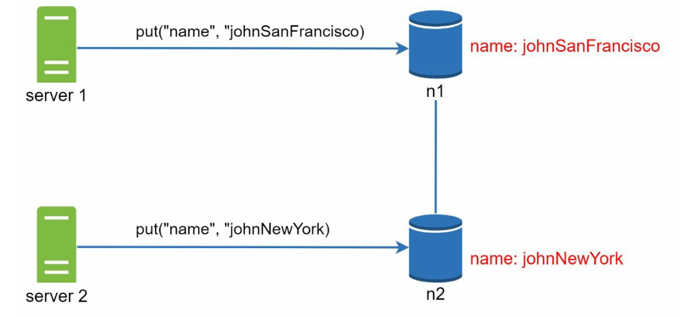
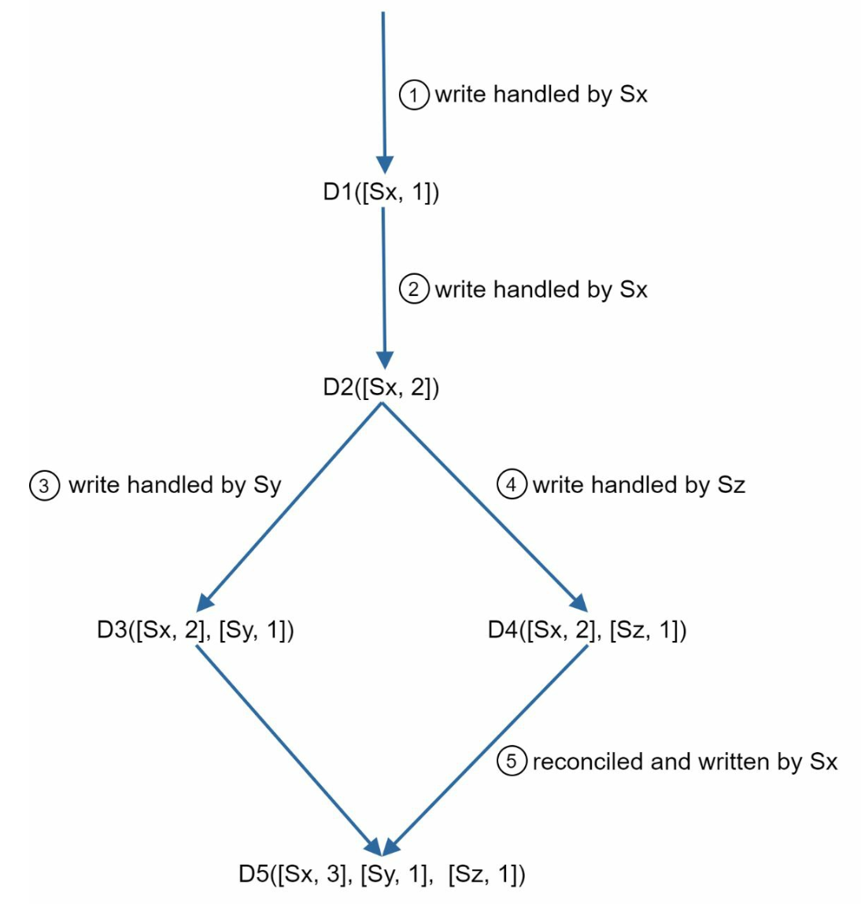
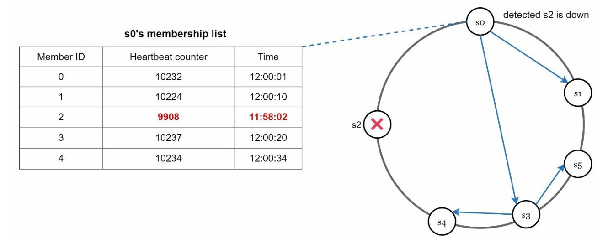

# 第 6 章：设计一个键值存储

> 原章节：Design a Key-Value Store · 原项目路径 `06. Key-Value Store/`

## 本章导读

你每天都在用键值存储，只是没意识到。Redis 是键值存储，DynamoDB 是键值存储，甚至你写过的 `Map<String, User>` 也是。

但这章要设计的不是单机版的 `HashMap`——它要能存 PB 级数据、要能在机器坏掉时继续服务、要能在网络断开时仍然让用户读写。一旦数据被拆到几十台机器上，"存进去"和"读出来"这两件最基础的事，就变成了一堆艰难的取舍。

学完这一章，你应该能回答：为什么 CAP 定理不是"三选二"？`R + W > N` 这个公式凭什么能保证强一致？两台机器同时改了一个值，系统怎么知道发生了冲突？机器永久下线后，几 TB 的数据怎么用最少的流量对齐？

## 你将学到

- 单机键值存储的天花板在哪，为什么必须走向分布式
- CAP 定理的准确含义，以及为什么它常被误读成"三选二"
- PACELC 定理：即使没有网络分区，一致性依然要付出代价
- 一致性哈希如何做数据分片，虚拟节点如何解决异构机器问题
- Quorum 读写模型与 `R + W > N` 的推导，以及各种 W/R 组合的取舍
- 向量时钟如何检测"两个版本同时发生"的冲突
- 故障处理三件套：Gossip 协议、Sloppy Quorum + Hinted Handoff、Merkle 树
- 以 Cassandra 为例的写入路径与读取路径

---

## 1. 什么是键值存储：从一个 HashMap 说起

**键值存储（Key-Value Store）** 是一类非关系型数据库，数据以「键值对（Key-Value Pair）」的形式存储。每个键（key）唯一，通过键就能取到值（value）。

它对外的接口极其简单，只有两个操作：

- `put(key, value)`：写入数据。
- `get(key)`：读取数据。

就是这么简单。没有 JOIN，没有事务，没有 SQL 解析器——正因为放弃这些东西，它才能做到极高的读写性能和近乎无限的扩展能力。

### 本章的设计目标

我们要设计的是一个**分布式的、高可用的**键值存储，约束条件如下：

| 约束 | 说明 |
|---|---|
| 数据规模 | 键值对很小（< 10 KB），但总量极大 |
| 可用性 | 高可用，部分节点故障不影响服务 |
| 扩展性 | 自动扩缩容，加机器就能扛更多流量 |
| 一致性 | **可调（Tunable）**——业务自己选要强一致还是最终一致 |
| 延迟 | 低延迟 |

> **注意"可调一致性"这一点。** 它不是"我们尽量做到一致"，而是**把一致性做成一个可以配置的参数**。同一套系统，A 业务配成强一致，B 业务配成最终一致。这是 Dynamo 系数据库（Cassandra、Riak）最核心的设计哲学，本章后面讲的 `W`、`R` 两个参数就是它的实现方式。

### 单机版本：先跑起来再说

最朴素的实现：用一个「哈希表（Hash Table）」把键值对存在内存里。

优化手段也很直觉：

- **数据压缩**：键值对通常有大量重复前缀，压缩能省下可观内存。
- **冷热分离**：不常访问的数据放到磁盘上，把宝贵的内存留给热点数据。

**但单机方案有个无法绕开的硬伤：内存是有上限的。** 一台机器装 256 GB 内存已经很奢侈了，可生产环境的数据量动辄 TB 起步。内存塞不下，就只能走向分布式。

---

## 2. 分布式键值存储与 CAP 定理

**分布式键值存储（Distributed Key-Value Store）** 把数据分散到多台服务器上。一旦这么做，一个绕不开的问题立刻出现：**网络会断，机器会坏，这时候系统该保什么、该舍什么？**

这就是 CAP 定理要回答的问题。

### CAP 定理的三个字母

| 字母 | 名称 | 含义 |
|---|---|---|
| **C** | 一致性（Consistency） | 所有客户端在同一时刻看到同样的数据 |
| **A** | 可用性（Availability） | 每个请求都能得到响应，即使部分节点已经宕机 |
| **P** | 分区容错性（Partition Tolerance） | 网络分区（节点之间消息丢失或延迟）时系统仍能继续运行 |

<div align="center">
  
</div>

### 这里有个被广泛误传的说法：「CAP 只能三选二」

你大概在网上见过这张图，被解释成"三个只能选两个，所以系统分为 CP、AP、CA 三类"。**这个说法不准确，而且会误导你的设计思路。**

准确的表述是：

> **在分布式系统中，网络分区（P）是客观存在的物理事实，不是你能"选择"放弃的东西。**
> 网线会被挖断、交换机固件会有 bug、机房之间的专线会抖动。你不能在架构评审时说"我们这个系统决定不支持分区容错"——因为分区该来还是会来。
>
> **所以 P 是必选项。CAP 真正要你做的选择是：当分区真的发生时，你要保 C 还是保 A。**

这就是为什么原文明确写道：**CA 系统在现实世界中不存在**。所谓"CA 系统"其实就是单机系统——没有网络，自然没有分区，但也就没有分布式。

### 分区发生时到底在纠结什么

假设有三台节点 n1、n2、n3，现在 n3 和 n1、n2 之间的网络断了。

<div align="center">
  
</div>

此时会出现两种不一致：

1. 用户往 n1 或 n2 写入的新数据，**传不到 n3**，n3 上的数据变旧了。
2. 用户往 n3 写入的新数据，**传不到 n1、n2**，n1、n2 上的数据变旧了。

现在一个客户端来读数据，你必须做选择：

- **选 CP（保一致性）**：把 n1、n2 上的写操作全部阻塞，直到分区恢复。客户端会收到错误或超时——**服务不可用了，但数据是准的**。
- **选 AP（保可用性）**：n1、n2 继续接受读写，哪怕可能返回旧数据。等分区恢复后再把数据同步给 n3——**服务一直可用，但可能读到脏数据**。

**注意这里的取舍是"分区期间"的取舍，不是永久的。** 分区恢复后，AP 系统会通过后面要讲的「反熵（Anti-Entropy）」机制把数据补齐。

### 典型系统

| 类型 | 保什么 | 舍什么 | 典型场景 |
|---|---|---|---|
| **CP** | 一致性 + 分区容错 | 分区期间牺牲可用性 | 银行转账、库存扣减、分布式锁 |
| **AP** | 可用性 + 分区容错 | 分区期间牺牲一致性 | 购物车、点赞数、社交动态、DNS |
| **CA** | 一致性 + 可用性 | 分区容错（**现实中不存在**） | 单机数据库 |

> **怎么判断业务该选哪个？** 问自己一个问题：**"读到旧数据"和"服务不可用"，哪个后果更严重？**
> 银行扣款读到旧余额 → 会重复扣钱，必须 CP。
> 朋友圈点赞数少算一个 → 用户根本不会发现，AP 更划算。

### 补充：CAP 之外还有 PACELC

CAP 定理有个被长期诟病的短板：**它只描述了"分区发生时"的行为**。可现实中 99.9% 的时间网络是正常的，那这时候就没有取舍了吗？

有的。2012 年 Daniel Abadi 提出了 **PACELC 定理**来补上这一块：

> **P**（Partition）发生时，在 **A**（Availability）和 **C**（Consistency）之间选；
> **E**（Else，即没有分区时），在 **L**（Latency，延迟）和 **C**（Consistency）之间选。

换句话说：**没有分区的时候，一致性依然不是免费的，它的代价是延迟。**

为什么？因为要保证强一致，写操作就必须等待足够多的副本确认收到数据。等待是需要时间的——跨机房一次往返可能就是几十毫秒。如果你愿意放弃一点一致性（比如读本地副本，不等待同步），延迟就能大幅下降。

用 PACELC 的记号来标注几个真实系统：

| 系统 | 分区时（P → A or C） | 无分区时（E → L or C） | 完整标注 |
|---|---|---|---|
| Dynamo / Cassandra（默认一致性级别 ONE） | 选 A | 选 L | **PA/EL** |
| Riak（默认配置） | 选 A | 选 L | **PA/EL** |
| BigTable / HBase | 选 C | 选 C | **PC/EC** |
| VoltDB / 传统关系型数据库 | 选 C | 选 C | **PC/EC** |

> **这张表对初学者最大的价值**：它告诉你**"AP 系统"和"低延迟"不是一回事**。Cassandra 是 PA/EL——它不仅在分区时选可用性，在正常运行时也选择用延迟换一致性。所以它默认的读操作可能读到旧数据，这不是 bug，是设计。
> 面试时如果你能说出"Cassandra 是 PA/EL 系统"，比只说"Cassandra 是 AP 系统"要高一个层次。
>
> **注意**：数据库的一致性行为**高度依赖配置**。Cassandra 可以通过把 `R`、`W` 调大（如 `QUORUM`）来获得强一致，此时它在 E 分支上就变成了 `EC`。**所以标注一个系统时，一定要说明是"默认配置"还是"特定配置"。**

---

## 3. 数据分片：一致性哈希

数据量太大，单机放不下，就必须**分片（Partitioning / Sharding）**：把数据按某种规则分散到多台服务器上。

### 最直觉的做法，以及它为什么不行

最直觉的做法是取模：`服务器编号 = hash(key) % N`。

问题在于 **N 会变**。假设你现在有 4 台服务器，某天扩容到 5 台，那么 `hash(key) % 4` 和 `hash(key) % 5` 的结果对绝大多数 key 都不一样——**几乎全部数据都要搬家**。这个迁移量在生产环境是不可接受的。

**「一致性哈希（Consistent Hashing）」** 解决了这个问题：加一台服务器，只有大约 `1/N` 的数据需要迁移。

<div align="center">
  
</div>

### 工作原理

1. 把哈希值空间想象成一个环（通常取 `0 ~ 2^32 - 1`，首尾相接）。
2. 每台服务器用自己的 IP 或名字做哈希，落到环上的某个位置。
3. 每个 key 也做哈希，落到环上。
4. **从 key 的位置出发，顺时针走，遇到的第一个服务器就是它该去的机器。**

### 虚拟节点：解决两个问题

朴素的一致性哈希有两个毛病：

1. **数据倾斜**：环上的位置是哈希出来的，可能不均匀。运气不好时，某台服务器负责的区间特别大，扛了 80% 的数据。
2. **无法表达机器能力差异**：新买的机器比老机器强 4 倍，凭什么只能分到同样多的数据？

解法是**虚拟节点（Virtual Node，简称 vnode）**：不让一台物理服务器在环上只出现一次，而是出现很多次（比如 150 次），每次的位置不同。**物理服务器的虚拟节点数量与它的容量成正比**——性能强 4 倍的机器，就分配 4 倍的虚拟节点。

<div align="center">
  
</div>

这样带来两个好处：

- **负载均衡**：虚拟节点数量一多，每个物理节点分到的区间数量趋于平均，倾斜问题基本消失。
- **异构支持（Heterogeneity）**：机器能力可以用虚拟节点数量精确表达。

> **一句话记住虚拟节点的作用**：把"一台机器"在环上拆成"很多个点"，既让分布更均匀，又让机器的强弱可以被量化。

---

## 4. 数据复制：让数据有备份

分片解决了"存不下"，但没解决"机器坏了怎么办"。如果一台机器永久下线，它负责的那段环上的数据就全丢了。

**「数据复制（Replication）」** 的思路是：同一份数据存到 `N` 台不同的服务器上。

### 副本怎么选

在一致性哈希环上选副本的规则很直观：

1. 先按常规方法找到 key 应该归属的那台服务器（顺时针第一个）。
2. **继续顺时针往下走**，把接下来遇到的前 `N - 1` 台服务器也作为副本。
3. 关键细节：**如果遇到的是同一个物理服务器的虚拟节点，要跳过**，继续往后找，直到凑齐 `N` 台不同的物理机器。

第 3 点很重要。如果不跳过虚拟节点，你可能会把三个副本全放在同一台物理机上——那台机器一挂，三个副本同时消失，复制就白做了。

<div align="center">
  
</div>

### 跨数据中心放置副本

副本不应该都放在同一个机房。理想做法是：**把副本分散到不同的数据中心**。

原因很直接：单台机器会坏（概率高，影响小），整个机房也会坏（概率低，影响大）。如果三个副本全在同一个机房，一次机房级故障就会让数据永久丢失。

> **原笔记这里有一处笔误**：原文写的是"Place replicas in distinct data centers to improve reliability **in case of virtual nodes**"（把副本放在不同数据中心，以在虚拟节点的情况下提高可靠性）。这里的 "virtual nodes" 显然是 "node failures"（节点故障）的笔误——虚拟节点和数据中心的可靠性没有任何关系。详见文末【勘误与补充】。

---

## 5. 一致性：Quorum 与 `R + W > N`

数据复制到了 N 台机器上，新的问题来了：**用户写一个值，是写完一台就返回成功，还是等所有 N 台都写完？**

这就是「法定人数（Quorum）」要解决的取舍。

### 三个参数

| 参数 | 名称 | 含义 |
|---|---|---|
| **N** | 副本总数（Replica Count） | 一份数据总共存几份 |
| **W** | 写法定人数（Write Quorum） | 一次写操作必须收到 **W 个副本**的确认，才算成功 |
| **R** | 读法定人数（Read Quorum） | 一次读操作必须等到 **R 个副本**返回结果，才算成功 |

<div align="center">
  
</div>

### 核心规则：`W + R > N`

**只要满足 `W + R > N`，就能保证强一致性。**

这个公式看起来像变魔术，其实原理是**鸽巢原理（Pigeonhole Principle）**，推导只有两步：

**第一步**：一次写入会更新至少 W 个副本。一次读取会询问至少 R 个副本。

**第二步**：如果 `W + R > N`，那么"被写入的副本集合"和"被读取的副本集合"**必然有交集**。

用反证法看更清楚：假设两个集合没有交集，那么它们的元素总数 `W + R` 最多就是 N（因为总共只有 N 个副本）。但条件说 `W + R > N`，矛盾。所以交集一定存在。

**第三步**：既然读操作问到的 R 个副本里，至少有一个持有最新写入的值，那么只要读取时**从 R 个响应里挑选版本号最高的那个**返回，就一定能读到最新数据。

> **直觉版解释**：把 N 个副本想象成 N 个同学，老师要通知一件事。只要老师通知的人数（W）和被问的人数（R）加起来超过全班人数（N），那么**被问的人里一定有至少一个听过通知**。你只要让被问到的同学投票选"最新版本"，就能拿到正确答案。

### 各种 W / R 组合的取舍

以最常见的 `N = 3` 为例：

| 配置 | 满足 `W+R>N`？ | 强一致 | 写性能 | 读性能 | 适用场景 |
|---|---|---|---|---|---|
| `W = 3, R = 1` | 4 > 3 ✓ | 是 | 慢（要等 3 台） | 快（只问 1 台） | 读多写少 |
| `W = 1, R = 3` | 4 > 3 ✓ | 是 | 快（只等 1 台） | 慢（要问 3 台） | 写多读少 |
| `W = 2, R = 2` | 4 > 3 ✓ | 是 | 中等 | 中等 | **最常用**（均衡） |
| `W = 1, R = 1` | 2 ≤ 3 ✗ | 否 | 最快 | 最快 | 能容忍最终一致 |
| `W = 2, R = 1` | 3 ≤ 3 ✗ | 否 | 中等 | 快 | 能容忍最终一致 |

> **这里要纠正一个流传很广的简化说法。** 你可能会看到"`W = 1` 就是写快但可能读到旧数据"——**这个说法只在 R 也小的时候成立**。
>
> 严格来说：
> - **`W = 1, R = 3`**：虽然只等 1 台写确认，但因为要问 3 台读，`1 + 3 > 3` 仍然满足强一致。**它只是写快、读慢，并不牺牲一致性。**
> - **`W = 1, R = 1`**：这才是不一致的组合，因为 `1 + 1 = 2 ≤ 3`，读到的副本和写入的副本可能完全不重叠。
> - **`W = 1` 真正需要警惕的风险不是"读到旧数据"，而是"持久性"**：如果唯一确认写入的那台机器在数据复制到其他副本之前就宕机了，这次写入就永久丢失了。
>
> **记住判断标准只有一个：看 `W + R` 是否大于 `N`，而不是单独看 W 或 R 是大是小。**

### 一致性模型

`W`、`R` 调节的最终效果，落到三种一致性模型上：

- **强一致性（Strong Consistency）**：读操作一定能读到最近一次写入的结果。任何客户端、任何时刻都不会看到旧数据。代价是延迟高、可用性低。
- **弱一致性（Weak Consistency）**：读操作**可能**读不到最新的值。系统不保证什么时候能读到新值。
- **最终一致性（Eventual Consistency）**：弱一致性的特例——**只要给足够的时间，所有更新都会传播到所有副本，最终所有副本一致**。

> **最终一致性是 AP 系统的默认选择**。它不是"不管一致性"，而是"把一致性从'立刻保证'放宽到'最终保证'"。这个放宽换来了可用性和低延迟，是绝大多数互联网业务的正确选择。
> **但要小心**：最终一致性对**读己之写（Read-Your-Own-Writes）**不友好。用户刚保存了资料，刷新页面却看到旧内容——这是实际业务中投诉率很高的一类 bug，需要单独处理（比如写后一段时间内强制读主副本）。

---

## 6. 冲突解决：版本化与向量时钟

有了副本，就必然有**不一致**：网络一抖，两个副本同时被修改，就会出现两个互相矛盾的版本。

<div align="center">
  
</div>

### 版本化（Versioning）

思路是：**把每一次数据修改都当成一个不可变的新版本（Immutable Version）**，而不是原地覆盖。

比如服务器 1 把用户的 `name` 改成 "Alice"，服务器 2 同时把 `name` 改成 "Bob"。现在系统里有两个版本 v1 和 v2，**它们互相冲突**——系统必须知道"这两个修改是并发的"，才能要求上层去解决。

### 向量时钟（Vector Clock）

**向量时钟**就是用来判断版本之间关系的数据结构。它的形式是一串 `[服务器, 版本号]` 对：

```
D([S1, v1], [S2, v2], ..., [Sn, vn])
```

其中 `D` 是数据项，`Si` 是服务器标识，`vi` 是该服务器上的版本计数器。

**更新规则**（数据在服务器 Si 上被修改时）：

1. 如果向量时钟里**已经有 Si 这一项**，就把它的计数器加 1。
2. 如果**没有 Si**，就新增一项 `[Si, 1]`。

**冲突判断规则**：

| 情况 | 判断条件 | 含义 |
|---|---|---|
| **无冲突** | 版本 X 的所有计数器都 **≤** 版本 Y 的对应计数器 | X 是 Y 的祖先，Y 更新 |
| **有冲突** | 至少存在一个计数器，X 中比 Y 中大，同时另一个计数器 Y 比 X 中大 | X 和 Y 是兄弟（并发修改） |

### 一个完整例子

假设数据 D 有三个副本 S1、S2、S3。

**① 初始状态**：客户端在 S1 上写入 D。

```
D1([S1, 1])
```

**② 同一个写入传播到 S2、S3**：此时三个副本都是 `D1([S1, 1])`，一致。

**③ 网络分区，两个副本同时被修改**：

- 用户 A 在 S1 上修改 D → S1 的计数器加 1 → `D2([S1, 2])`
- 用户 B 在 S2 上修改 D → S2 不在时钟里，新增一项 → `D3([S1, 1], [S2, 1])`

**④ 判断冲突**：

比较 `D2([S1, 2])` 和 `D3([S1, 1], [S2, 1])`：

- `D2` 里 S1 = 2，`D3` 里 S1 = 1 → D2 在这一项上更大。
- `D3` 里 S2 = 1，而 `D2` 里**根本没有 S2 这一项** → 可以理解为 0，所以 D3 在这一项上更大。

**两边各有胜负 → 判定为并发冲突（兄弟版本）。**

**⑤ 冲突解决**：向量时钟只负责**发现**冲突，不负责**解决**。解决必须交给业务逻辑：

- **让用户决定**：像购物车那样，把两个版本都展示出来，让用户自己合并（Dynamo 的做法）。
- **自动合并**：如果是集合类型，可以取并集（把两个购物车合并）。
- **最后写入者胜出（Last Write Wins, LWW）**：按时间戳挑一个。简单，但**会静默丢数据**，只在能容忍丢失的场景用。

### 向量时钟的代价

- **客户端变复杂**：客户端必须理解版本概念，还要实现合并逻辑。
- **时钟会膨胀**：服务器越多、修改越频繁，向量时钟的条目越多。需要**截断策略（Trimming）**——比如给条目数设上限，超了就丢弃最老的条目（代价是可能漏判某些冲突）。

### 向量时钟 vs 版本向量：别把它们混为一谈

这两个词经常被混用，但严格来说有区别：

| | 向量时钟（Vector Clock） | 版本向量（Version Vector） |
|---|---|---|
| **追踪对象** | **事件**的因果关系 | **数据副本**的版本关系 |
| **计数器含义** | 每个**进程**上发生过多少个事件 | 每个**副本**上该数据被改了多少次 |
| **递增时机** | 每个事件（含内部事件、发消息、收消息）都递增 | 只有数据被修改时才递增 |
| **典型用途** | 分布式调试、因果一致性、快照 | 乐观复制、冲突检测 |

**Dynamo 用的到底是什么？** Dynamo 论文里写的是 "vector clock"，但它的条目是 `[节点, 计数器]` 形式，而且只在数据被修改时递增——从定义上看，它**更接近版本向量**。

> **面试时怎么说才稳妥**：可以这样表述——"Dynamo 用的机制论文里叫 vector clock，实质上是对每个副本维护一个版本计数器，属于版本向量的用法。它检测并发更新的能力是一样的，只是严格来说追踪的是数据版本而不是事件因果。"这样既展示了准确性，又不会显得在抠字眼。

---

## 7. 处理故障

分布式系统里，故障是常态而不是异常。要处理三类：检测故障、临时故障、永久故障。

### 7.1 故障检测：Gossip 协议

**最基本的原则**：不能因为另一台服务器说"n3 挂了"，就相信 n3 挂了。

为什么？因为**可能是 n3 和那台服务器之间的网络出了问题，而 n3 本身活得好好的**。如果草率地判定 n3 下线，然后启动数据迁移，就会产生大量无谓的数据搬运——等网络恢复后还要再搬回来。

所以判断一台机器下线，**至少需要两个独立的信源**。

**「Gossip 协议（流言协议）」** 是达成这种"集体判断"的常用手段：

<div align="center">
  
</div>

工作方式：

1. 每个节点维护一份**成员列表**，记录所有节点的 ID 和**心跳计数器（Heartbeat Counter）**。
2. 每个节点周期性地把自己的心跳计数器加 1。
3. 每个节点周期性地**随机挑选若干节点**，把自己的心跳信息发给它们。
4. 收到消息的节点据此更新自己的成员列表（如果对方的心跳比自己记录的新，就更新）。
5. **如果某个节点的心跳计数器连续多个周期没有增长，就判定它下线。**

> **为什么叫"流言"？** 因为它的传播方式和八卦一模一样：你告诉三个朋友，三个朋友各告诉三个朋友……信息以指数速度扩散到全网。它的优点是**完全去中心化**，没有任何一个节点需要知道全局状态；缺点是**收敛需要时间**（通常是秒级），而且信息传播有随机性，不能保证某一时刻全网认知完全一致。
> Cassandra、Riak、Consul、Redis Cluster 都用 Gossip 做集群成员管理。

### 7.2 临时故障：Sloppy Quorum + Hinted Handoff

节点短暂宕机（重启、GC 卡顿、网络抖动）是最常见的故障。如果严格坚持 `W + R > N` 的法定人数要求，那么只要有几个节点同时不可用，**整个系统就没法读写了**。

**「Sloppy Quorum（宽松法定人数）」** 放宽了这个要求：

<div align="center">
  
</div>

- 不再严格要求必须是"那 N 台指定的副本"响应。
- 而是在哈希环上**跳过故障节点，继续往后找，取前 W 个健康节点完成写、前 R 个健康节点完成读**。
- 故障节点被暂时忽略。

这样做的直接效果是：**可用性大幅提升**——只要还有足够的健康节点，服务就不中断。

但代价是：**数据被写到了"本来不该存这个 key"的节点上**。如果不做后续处理，这些数据就成了孤儿。

**「Hinted Handoff（暗示移交）」** 就是收尾机制：

- 当某个节点代替故障节点接收了写入时，它会**记一条"提示"（hint）**，说明"这条数据本来是给 n3 的"。
- 等 n3 恢复上线后，这个节点**把提示的数据推回给 n3**，实现数据一致性。

> **这两个机制必须成对使用。** 只用 Sloppy Quorum 不用 Hinted Handoff，等于让数据永久丢失在错误的节点上。面试时如果你能主动把两者配对说出来，是明显的加分项。

### 7.3 永久故障：Merkle 树

节点永久下线（硬盘损坏、机器报废）后，需要把它的副本数据补到一台新机器上。问题是：**怎么知道两台机器上的数据哪里不一样？**

最笨的办法是把两边所有数据都拉出来逐条比对——几 TB 的数据，网络传输和比对的开销都是灾难性的。

**「Merkle 树（Merkle Tree，也叫哈希树 Hash Tree）」** 是解决这个问题的经典数据结构。它能让两台副本**只传输真正不一致的那部分数据**。

#### 树的结构

- **叶子节点（Leaf Node）**：存储各个数据块的哈希值。
- **非叶子节点（Non-Leaf Node）**：存储它所有子节点哈希值合并后再哈希的结果。
- **根哈希（Root Hash）**：代表整棵树所覆盖的全部数据的综合状态。

#### 构建过程（四步）

**Step 1：把键空间划分成桶（Bucket）**

比如把 `0 ~ 2^32` 的键空间切成 4 段，每段一个桶。

<div align="center">
  
</div>

**Step 2：对桶内每个 key 做哈希**

用均匀哈希函数把桶里所有 key 各自算出一个哈希值。

<div align="center">
  
</div>

**Step 3：把桶内所有 key 的哈希合并成一个桶哈希**

<div align="center">
  
</div>

**Step 4：逐层向上合并，直到算出根哈希**

两个相邻桶的哈希合并再哈希 → 得到上一层节点；再两两合并 → 最终得到根哈希。

<div align="center">
  
</div>

#### 同步过程（这是重点）

现在有两台副本 A 和 B，各自有一棵 Merkle 树。同步流程是：

1. **先比较两棵树的根哈希**。
2. **根哈希相同** → 说明两边数据完全一致，**同步结束，零数据传输**。
3. **根哈希不同** → 说明有差异，但不知道在哪。于是**分别比较左子节点的哈希**：
   - 左子节点哈希相同 → **左半边整棵子树的数据一定都一致，直接整块跳过**。
   - 左子节点哈希不同 → 差异在左半边，继续往左递归。
4. 再比较右子节点，同样的逻辑。
5. 一路递归下去，最终定位到**具体哪几个桶**不一致。
6. **只同步这几个桶的数据。**

#### 为什么这样快

关键在于第 3 步的"整块跳过"：

- **暴力比对**：N 条数据，全都要比 → 复杂度 `O(N)`。
- **Merkle 树比对**：只需要沿着"有差异的那条路径"往下走 → 复杂度 `O(log N)`。

举个具体例子：假设有 100 万个键值对，分成 1024 个桶。如果只有一个桶里的 10 条数据不一致：

- 暴力比对：传输并比对 100 万条数据。
- Merkle 树：比较 1 次根哈希 + 约 10 层子节点哈希（因为 1024 = 2^10）+ 最后同步那 1 个桶的数据。**传输量从 100 万条降到 10 条。**

**Merkle 树的优势总结**：

| 优势 | 说明 |
|---|---|
| **高效** | 只同步不一致的数据，大幅降低网络传输 |
| **可扩展** | 数据量越大，相对收益越明显（`O(log N)` vs `O(N)`） |
| **可靠** | 通过哈希保证数据一致性，篡改或损坏都能被检测出来 |

> **顺带一提**：Merkle 树也是**区块链**的核心数据结构。比特币用 Merkle 树来验证"某笔交易是否在某个区块里"，原理完全相同——只需要拿到从该交易到根哈希的那条路径（约 `log N` 个哈希值），就能验证，而不用下载整个区块。学一个概念，两个领域都用得上。

---

## 8. 处理数据中心故障

单个节点的故障处理完了，还要考虑**整个数据中心挂掉**的情况。历史上这不是假设——机房断电、光缆被挖断、冷却系统故障都真实发生过。

策略是：**把数据复制到多个数据中心**，并且做好跨机房的流量调度。

- **数据层面**：副本跨机房分布。通常的做法是"同机房 2 副本 + 异地机房 1 副本"这种组合，兼顾同机房的低延迟和跨机房的容灾。
- **流量层面**：某个机房整体不可用时，通过 DNS 或全局负载均衡把用户流量切到其他机房。
- **一致性层面**：跨机房的复制延迟远高于同机房，所以跨机房通常采用**异步复制**，并接受跨机房的最终一致性。

---

## 9. 读写路径：以 Cassandra 为例

前面讲的是架构层面的设计。落到具体实现，一条数据是怎么写进去、又是怎么读出来的？

### 写入路径

<div align="center">
  
</div>

1. **写「提交日志（Commit Log）」**：数据首先顺序追加到磁盘上的日志文件。这一步是**持久性保证**——即使机器立刻断电，重启后也能从日志恢复。
2. **写「内存表（Memtable）」**：同时写入内存中的数据结构。这一步是**性能保证**——所有读操作优先命中内存。
3. **刷盘到「SSTable（Sorted String Table，排序字符串表）」**：当内存表写满（达到阈值），把它整体**顺序写**到磁盘，形成一个不可变的 SSTable 文件。然后清空内存表，继续接收新数据。

> **为什么要先写日志再写内存？** 这是经典的 **WAL（Write-Ahead Log，预写日志）** 模式。内存虽然快，但断电就没了。如果只写内存，机器一挂，最近几秒的写入全部丢失。日志是顺序写的，速度很快（比随机写快几个数量级），所以这个"额外的"步骤带来的延迟开销很小，却换来了"任何时刻断电都不丢数据"。
> 数据库领域有句名言：**"先写日志，再改数据"**。MySQL 的 redo log、PostgreSQL 的 WAL、Kafka 的分段日志，本质都是这个模式。

### 读取路径

<div align="center">
  
  
</div>

1. **先查内存表（Memtable）**：如果命中，直接返回，速度最快。
2. **内存未命中**：这时要去磁盘上的多个 SSTable 里找。但 SSTable 可能有很多个，逐个打开查找代价很高。
3. **用「布隆过滤器（Bloom Filter）」快速排除**：布隆过滤器能告诉你"这个 key **一定不在**这个 SSTable 里"或者"**可能在**"。它能**确定性地排除**绝大多数不包含该 key 的文件，大幅减少磁盘 IO。
4. **读取并合并**：从布隆过滤器判定"可能包含"的 SSTable 中读取数据，按时间戳合并出最新版本，返回给客户端。

> **布隆过滤器在这里的角色是"省掉无用的磁盘查找"。** 注意它的特性：说"不在"就一定不在（**没有假阴性**），说"在"则有一定概率是假的（**有假阳性**）。这个"宁可错杀不可放过"的特性，正好适合做前置过滤——误判最多是白读一次文件，不会漏数据。
>
> **补充：Compaction（压实）**。SSTable 会越积越多，同一个 key 的多个版本散落在不同文件里。后台的 compaction 进程会定期把多个 SSTable 合并成一个，丢弃被覆盖的旧版本和已删除的墓碑标记。这是 Cassandra 维护成本的主要来源之一，也是写放大（Write Amplification）的根源。

---

## 10. 最终架构

把所有组件拼起来，得到完整的架构图：

<div align="center">
  
</div>

- 客户端通过简单的 API 与键值存储交互：`get(key)` 和 `put(key, value)`。
- **协调者（Coordinator）**：充当客户端和键值存储之间的代理节点。客户端连上任意一个节点，这个节点就充当协调者，负责转发请求、收集响应、返回结果。
- 节点通过**一致性哈希**分布在环上。
- 系统**完全去中心化（Decentralized）**：增加和移除节点可以自动完成，不需要人工干预。
- 数据在多个节点上有副本。
- **没有任何单点故障（SPOF）**：每个节点的职责完全相同，任何一个节点挂了，它的工作可以被其他节点接管。

> **"每个节点职责相同"这件事的价值容易被低估。** 如果系统里有一个"主节点"专门负责分配数据、管理元信息，那它就是单点故障——它挂了整个系统就瘫痪，而且它会成为性能瓶颈。让所有节点对等，是 Dynamo 系架构最重要的设计决策，代价是成员管理、数据分布、故障检测全部要用去中心化协议（Gossip、一致性哈希、Merkle 树）来实现，复杂度更高。

---

## 勘误与补充

> 本节逐条指出原笔记中不准确、过时或缺失的地方。

### 勘误 1：CAP 定理被简化成"三选二"，这个框架是错的

- **原文说法**：原文开篇写 "According to CAP theorem only two of the three guarantees can be achieved"（CAP 定理下只能满足三个保证中的两个），并把系统分为 CP、AP、CA 三类。
- **问题**：前半句的"三选二"框架具有误导性。它暗示 P 是一个可以主动"放弃"的选项，仿佛只要选择 CA 就能得到一个既一致又可用、只是不支持分区的系统。但**网络分区不是设计选项，而是物理现实**——你无法通过架构决策让它不发生。
- **正确说法**：**P 在分布式系统中是必选项**。CAP 真正描述的是"**当分区发生时**，系统在 C 和 A 之间如何取舍"。所以现实世界中只存在 **CP 系统和 AP 系统**，不存在 CA 系统。
- **延伸**：原笔记其实在下文自己纠正了这一点（明确写了 "a CA system cannot exist in real-world applications"），这是正确的。但它前面的"三选二"框架仍然会误导读者，所以这里单独点出来。面试时如果被问"CAP 三选二怎么选"，正确回答是："这个前提本身就不成立，P 是必选的，实际是在 C 和 A 之间选。"

### 勘误 2：CAP 中的 C 不是"所有客户端看到同样的数据"

- **原文说法**：原文把 Consistency 定义为 "All clients see the same data simultaneously"（所有客户端同时看到相同的数据）。
- **问题**：这个定义过于宽泛，容易和"最终一致性"里的"一致性"混淆。CAP 定理中学术意义上的 C，指的是**线性一致性（Linearizability）**——一个更强的保证。
- **正确说法**：CAP 里的 C 要求系统的行为**等价于一个单机系统**：一旦某次写入返回成功，之后任何客户端的任何读取都必须看到这次写入（或更新的值）。它要求所有操作看起来像是在某个全局时间点上原子地发生的。
- **延伸**：区分这一点很重要，因为"最终一致性"也常常被叫做"一致"，但它在 CAP 的框架里属于**牺牲了 C**的那一类。初学者最容易在这里绕晕。

### 勘误 3：把"虚拟节点"和"数据中心故障"扯上了关系

- **原文说法**："Place replicas in distinct data centers to improve reliability **in case of virtual nodes**"（把副本放在不同数据中心，以在虚拟节点的情况下提高可靠性）。
- **问题**："virtual nodes"（虚拟节点）在这里说不通。虚拟节点是一致性哈希环上的技术概念，和数据中心的可靠性没有任何关系。这是一处明显的笔误。
- **正确说法**：应该是 "in case of **node failures**" 或 "**data center outages**"——跨数据中心放置副本的目的是抵御节点故障和机房级故障。
- **延伸**：原笔记下一节"Handling Data Center Outages"讲的正是这个主题，内容是对的，只是上一节这句话表述错了。

### 勘误 4：W = 1 不等于"可能读到旧数据"

- **原文说法**：原文写道 "If W = 1 and R = N, the system is optimized for fast write"（W=1、R=N 时系统为快速写入优化）。这句本身是对的，但很多读者会顺势理解为"W=1 就会读到旧数据"。
- **问题**：`W = 1, R = N` 时，`W + R = N + 1 > N`，**依然满足强一致性**。它只是写快、读慢，并没有牺牲一致性。真正的判据是 `W + R` 与 `N` 的大小关系，而不是单个参数。
- **正确说法**：`W = 1` 需要警惕的是**持久性风险**——如果唯一确认写入的副本在数据扩散前宕机，这次写入会丢失。要读到旧数据，必须 `W + R ≤ N`。
- **延伸**：原笔记列出的 "If W + R <= N, strong consistency is not guaranteed" 是正确的，读者应该以这一条为准来判断。

### 勘误 5：术语笔误 "vector locks"

- **原文说法**：原文小标题写的是 "Versioning and **vector locks** are used to solve inconsistency problems"。
- **问题**：`vector locks`（向量锁）不是一个存在的数据结构，是 `vector clocks`（向量时钟）的拼写错误。
- **正确说法**：应为**向量时钟（Vector Clock）**。原笔记同一节下面的小标题就写对了。

### 补充 1：PACELC 定理

原笔记完全没有提及 PACELC。CAP 只描述分区时的取舍，而 PACELC 补上了"正常运行时的取舍"——即延迟与一致性之间的权衡。详见第 2 节。**这是判断一个数据库真实行为特征的关键框架，也是面试中能显著加分的知识点。**

### 补充 2：`R + W > N` 的推导与直觉

原笔记只给出了结论 `W + R > N`，没有解释为什么。详见第 5 节。**理解"读集合与写集合必然相交"这个鸽巢原理的推导，比记住公式重要得多。**

### 补充 3：Merkle 树的比较过程

原笔记列出了 Merkle 树的构建四步和一句"compare child hashes recursively"，但没有讲清楚**为什么这样能减少传输量**。详见第 7.3 节。这是本章最值得花时间理解的数据结构。

### 补充 4：向量时钟与版本向量的区别

原笔记混用了 "vector clock" 的概念，没有区分它和 "version vector"。详见第 6 节。Dynamo 论文里虽然叫 vector clock，但实质更接近版本向量。

### 补充 5：写入路径中的 Compaction（压实）

原笔记讲了 commit log → memtable → SSTable 的写入路径，但没提 SSTable 会不断累积、需要后台合并。详见第 9 节。这是理解 LSM-Tree 系数据库写放大问题的关键。

### 补充 6：Sloppy Quorum 必须配合 Hinted Handoff

原笔记把两者列为两个独立条目，没有强调它们**必须成对使用**。详见第 7.2 节。只用前者会导致数据永久遗留在错误的节点上。

---

## 常见误区

| 误区 | 为什么错 | 正确理解 |
|---|---|---|
| CAP 是"三选二" | P（分区容错）不是可选项，网络分区是物理事实 | P 必选，实际是在分区发生时于 C 和 A 之间取舍。CA 系统现实中不存在 |
| CAP 中的 C 就是"数据一致" | CAP 的 C 特指线性一致性，比日常说的"一致"强得多 | 最终一致性在 CAP 框架里属于牺牲 C 的那一类 |
| AP 系统性能一定好 | 可用性和延迟是两个维度。PACELC 中 E 分支才讨论延迟 | Cassandra 是 PA/EL；也有 PA/EC 的系统（如 PNUTS） |
| `W = 1` 就会读到旧数据 | 判据是 `W + R` 与 `N` 的关系，不是单个参数 | `W=1, R=N` 仍是强一致。`W=1` 的真实风险是持久性 |
| 一致性哈希能解决数据倾斜 | 它解决的是"节点增减时的迁移比例"，不是"分布是否均匀" | 倾斜要靠**虚拟节点**和合理的 key 设计 |
| 虚拟节点只是为了让分布更均匀 | 它还能表达机器能力的差异 | 虚拟节点数量应与物理机容量成正比，实现异构支持 |
| 副本数 N 越大越可靠 | N 越大，写延迟越高、一致性维护成本越高 | N 要在可靠性、延迟、成本之间权衡，通常取 3 |
| 向量时钟能自动解决冲突 | 它只负责**检测**并发冲突，不负责**解决** | 解决需要业务逻辑：用户合并、集合取并集、或 LWW（会丢数据） |
| 节点宕机了应该立刻开始数据迁移 | 可能只是网络抖动，误判会导致无谓的数据搬运 | 至少需要两个独立信源确认，用 Gossip 做集体判断 |
| Merkle 树用来存储数据 | 它存的是哈希，不存原始数据 | Merkle 树是**校验和索引结构**，用于快速定位差异 |
| 布隆过滤器能准确判断元素是否存在 | 它有假阳性，只能说"可能存在" | 说"不在"一定准（无假阴性），说"在"可能不准 |

---

## 面试速记

- **一句话概括**：本章设计一个去中心化、可调一致性、高可用的分布式键值存储——核心是用一致性哈希分片、用多副本保证可用、用 Quorum 调节一致性、用向量时钟和 Merkle 树处理不一致。

- **必答要点**：
  1. **CAP 的准确表述**：P 必选，实际是分区时在 C 和 A 之间取舍；CA 系统不存在。
  2. **数据分片用一致性哈希**，虚拟节点解决分布不均和异构机器问题。
  3. **`W + R > N` 保证强一致**，原理是读写集合必然相交（鸽巢原理）。N=3、W=R=2 是最常用的均衡配置。
  4. **冲突检测用向量时钟**：所有计数器都 ≤ 则无冲突，各有大小则为并发冲突。检测归系统，解决归业务。
  5. **故障处理三件套**：Gossip 检测、Sloppy Quorum + Hinted Handoff 应对临时故障、Merkle 树应对永久故障。

- **加分项**：
  1. 主动提到 **PACELC**，说明 Cassandra 是 PA/EL，并解释"正常运行时的取舍是延迟 vs 一致性"。
  2. 主动区分**向量时钟与版本向量**，指出 Dynamo 的实现更接近后者。
  3. 讲清 Merkle 树的比较复杂度是 `O(log N)` 而非 `O(N)`，并说明"哈希相同则整棵子树跳过"是关键。
  4. 说明**写入路径的 WAL 模式**（commit log → memtable → SSTable）以及 Compaction 带来的写放大。

- **高频追问**：
  1. *"为什么不能用 `hash(key) % N` 做分片？"*
     → N 变化时几乎全部 key 的归属都会改变，导致全量数据迁移。一致性哈希把迁移量降到约 `1/N`。
  2. *"W + R > N 为什么能保证强一致？"*
     → 写入集合大小 W、读取集合大小 R，若 `W + R > N` 则两集合必有交集，读取时从 R 个响应中取版本号最高的即可。前提是读取端要能识别版本号。
  3. *"如果两个数据中心之间的网络断了，你的键值存储会怎么表现？"*
     → 取决于配置。选 CP 则少数派一侧拒绝写入（牺牲可用性）；选 AP 则两侧都继续服务，恢复后通过 Merkle 树做反熵同步，期间可能读到旧数据。
  4. *"Sloppy Quorum 会不会导致数据不一致？"*
     → 会临时不一致，但 Hinted Handoff 会在故障节点恢复后把数据推回去。两者必须配对使用，否则数据会永久遗留在错误的节点上。
  5. *"N = 3 时，如果同时挂了两台机器还能服务吗？"*
     → 要看 W 和 R。若 W=2、R=2，只剩 1 台健康节点时无法满足法定人数，写入会失败。这正是 CP 系统的表现。可以用 Sloppy Quorum 放宽，代价是引入临时不一致。

---

## 延伸阅读

- [ByteByteGo 系统设计面试课程](https://bytebytego.com/courses/system-design-interview) — 原笔记的来源
- [Dynamo: Amazon's Highly Available Key-value Store](https://www.allthingsdistributed.com/files/amazon-dynamo-sosp2007.pdf) — 本章架构的原始论文，强烈建议读第 4 节（向量时钟）和第 5 节（故障处理）
- [Cassandra 官方文档：Architecture](https://cassandra.apache.org/doc/latest/cassandra/architecture/index.html) — 写入路径与 compaction 的工程实现
- [PACELC 定理原始论文（Daniel Abadi）](https://www.cs.umd.edu/~abadi/papers/abadi-pacelc.pdf) — 补上 CAP 缺失的那一半
- [Redis Cluster 规范](https://redis.io/docs/reference/cluster-spec/) — 工业界的分片与 Gossip 实现
- [Riak：Vector Clocks 文档](https://docs.riak.com/riak/kv/latest/learn/concepts/causal-context/) — 向量时钟的实战用法与截断策略
- [布隆过滤器误判率计算器](https://hur.st/bloomfilter/) — 交互式验证 `m`、`k` 与误判率的关系
