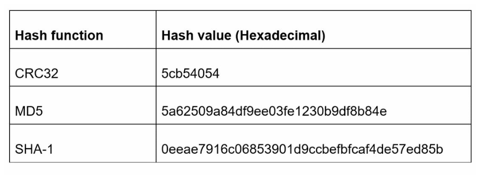

# 第 8 章：设计一个 URL 短链服务

> 原章节：Design a URL Shortener · 原项目路径 `08. URL Shortener/`

## 本章导读

`https://www.example.com/2024/03/15/blog/how-to-design-a-url-shortener.html?utm_source=twitter&utm_medium=social` —— 这条链接有 118 个字符。发到微博上占位置，发到短信里会被截断，印在海报上没人愿意手打。

短链服务做的事看起来极其简单：把长链接换成 `https://tinyurl.com/zn9edcu`。但当你被要求"每天生成 1 亿条短链、保存 10 年"时，几个真正的难题就冒出来了：

- 7 个字符到底能装下多少个链接？够用吗？
- 两条不同的长链接，生成的短码撞车了怎么办？
- 用 301 还是 302？这个选择看起来无所谓，其实决定了你能不 能做点击统计。
- 短链天生会隐藏真实目标——**这正好是钓鱼攻击最喜欢的特性**。你怎么防？

学完这一章，你应该能回答这些问题，并且能独立完成一次完整的容量估算。

## 你将学到

- 短链服务的完整需求，以及如何把需求换算成具体的存储量和 QPS
- 两套短码生成方案：Base 62 进制转换 vs 哈希 + 冲突解决
- **62 的 7 次方到底等于多少**，以及为什么 6 个字符不够用
- 哈希碰撞的三种处理手段：布隆过滤器预检、唯一索引兜底、冲突后重试
- 301 与 302 重定向的完整取舍（这是原笔记讲得最不充分的地方）
- 如何防止短链被用于钓鱼和恶意跳转
- 缓存、限流、分片在高读写比场景下的配合方式

---

## 1. 问题背景与需求

**「URL 短链服务（URL Shortener）」** 的核心功能只有两件事：

1. **缩短**：给一个长 URL，返回一个短 URL。
2. **重定向**：用户访问短 URL，跳转到原始的长 URL。

听起来是个玩具项目。但一旦加上规模约束，它就变成了一个非常典型的系统设计题——**读远多于写、需要低延迟、需要唯一性保证、需要长期存储**。这些特征组合起来，正好能覆盖系统设计面试的大部分考点。

### 需求

| 需求 | 数值 |
|---|---|
| 短链必须**唯一** | 同一个短码不能对应两个长链接 |
| 短链尽可能**短** | 越短越好用 |
| **写入量** | 每天生成 1 亿条短链 |
| **服务年限** | 10 年 |
| **读写比** | 读 : 写 = **10 : 1** |
| **总记录数** | **3650 亿条** |
| **总存储** | 约 **365 TB** |

### 这些数字是怎么来的（自己算一遍）

**① 10 年总共生成多少条短链？**

```
1 亿条/天 × 365 天/年 × 10 年 = 3,650 亿条 = 365,000,000,000 条
```

**② 需要多少存储？**

原笔记给出 365 TB。反推一下：`365 TB ÷ 3650 亿条 = 1000 字节/条`，也就是**每条记录约 1 KB**。

这个假设是合理的——一条记录包含 `id`（8 字节）、`shortURL`（7 个字符，约 7~10 字节）、`longURL`（平均 100~200 字节），再加上索引、行开销和存储引擎的额外占用，1 KB 是个稳妥的估算。

**③ 平均 QPS 是多少？**

```
写 QPS = 1 亿 ÷ 86,400 秒 ≈ 1,157
读 QPS = 1,157 × 10 ≈ 11,574
总 QPS ≈ 12,731
```

**④ 峰值 QPS？**

按经验，峰值通常是平均值的 **2~3 倍**（互联网流量有明显的日内波动）。所以：

```
峰值写 QPS ≈ 3,500
峰值读 QPS ≈ 35,000
```

> **这两个数字（约 1 万和 3 万）是本章所有架构决策的出发点。** 记住它们：它们决定了你需要多少台 Web 服务器、多大的缓存、几个数据库分片。
>
> **注意读写比是 10:1，但读 QPS 绝对值也不算特别高（3.5 万）。** 这意味着一个设计良好的缓存层（比如 Redis）基本能扛住绝大部分读流量，数据库的压力主要来自写入和缓存未命中。

---

## 2. 第一步：高层设计

### 2.1 API 设计

短链服务只需要两个接口：

**① 创建短链**

```
POST /api/v1/data/shorten

请求体：{ "longUrl": "https://www.example.com/very/long/path" }
响应体：{ "shortUrl": "https://short.ly/zn9edcu" }
```

**② 访问短链（重定向）**

```
GET /api/v1/{shortUrl}

响应：HTTP 301 或 302，Location 头指向原始长链接
```

> **注意第二个接口的返回值。** 它不返回 JSON，而是返回一个**重定向响应**。这是 REST API 中比较少见的形态，但对短链服务来说是天经地义的——用户的浏览器拿到 `Location` 头就会自动跳转。

<div align="center">
  
</div>

### 2.2 重定向：301 还是 302

这是一个**看起来无关紧要、实际上影响很大**的选择。

| | **301 Moved Permanently** | **302 Found** |
|---|---|---|
| **语义** | 永久重定向 | 临时重定向 |
| **浏览器行为** | **会缓存**。下次访问同一个短链，浏览器直接跳到长链接，**不再请求短链服务** | **不缓存**。每次点击都要回短链服务 |
| **服务器压力** | 小（大量请求被浏览器缓存挡掉了） | 大（每次点击都要处理） |
| **点击统计** | **无法统计**（请求根本没到服务器） | **可以完整统计**（每次点击都经过服务器） |
| **能否改目标** | **不能**。用户浏览器里缓存的 301 会一直生效，即使你在数据库里改了映射 | **可以**。每次都来问服务器，改了立刻生效 |
| **能否撤销恶意链接** | **不能**（同上） | **可以** |

**原笔记提到了 301 的缓存特性和 302 的统计能力，但没有把代价讲透。** 完整的权衡是这样的：

**选 301 意味着**：
- 服务器压力小、用户体验略快（少一次往返）。
- **代价是彻底放弃点击分析能力**。而点击分析恰恰是短链服务最有商业价值的部分——"这条链接被点了多少次、从哪个渠道来的、什么时间段最活跃"，这些数据是做营销投放决策的依据。
- **更严重的代价是不可撤销**。如果你的服务被用来生成指向钓鱼网站的短链，你**无法通过修改数据库来止损**——已经缓存了 301 的用户浏览器会继续跳到恶意网站。

**选 302 意味着**：
- 每次点击都经过你的服务器，**统计、风控、A/B 测试、目标变更、链接撤销全部可行**。
- 代价是服务器压力大（但可以通过缓存和水平扩展解决）、多一次网络往返。

> **工业界的实际选择**：几乎所有**商业短链服务都使用 302**（或 307），因为它们要靠点击数据做产品。TinyURL、Bitly、微博短链、微信短链都是如此。
>
> **什么时候可以用 301？** 如果你做的是纯内部工具（比如公司内网的链接转发），完全不需要统计，且目标是固定的，那 301 更省资源。
>
> **一个更严格的细节**：HTTP 规范说 302 默认不可缓存，但**部分浏览器和代理仍可能缓存它**。如果你要确保每次点击都到服务器，应该用 **307 Temporary Redirect**（语义更明确）并显式加上 `Cache-Control: no-store` 响应头。

### 2.3 短链生成：需要一个好的哈希函数

短链生成的核心是把长 URL 映射成一个短的标识符。原笔记把它叫做"哈希函数"，并给出两个要求：

1. **每个长 URL 必须映射到唯一的一个短码。**
2. **每个短码必须能反查回长 URL。**

<div align="center">
  
</div>

> **严格来说，第 1 条要求需要修正。** "每个长 URL 映射到唯一短码"是**函数**的定义（同一输入必然得到同一输出），这个没问题。但真正的唯一性要求是反过来的：**每个短码只能对应一个长 URL**。
>
> 这两者的区别很关键：
> - 如果**同一个长 URL 每次生成的短码不同**（比如用随机数），那是允许的——只是浪费存储。
> - 如果**两个不同的长 URL 生成了同一个短码**，那就是**碰撞（Collision）**，会导致跳转错误，**绝对不能接受**。
>
> 所以约束是：**短码 → 长 URL 必须是一对一的。**

---

## 3. 第二步：深挖设计

### 3.1 数据模型

最直观的方案是用关系型数据库存一张映射表：

<div align="center">
  
</div>

| 列名 | 类型 | 说明 |
|---|---|---|
| `id` | `BIGINT` 主键 | 自增或分布式生成的唯一 ID |
| `shortURL` | `VARCHAR(7)` | 短码，加唯一索引 |
| `longURL` | `VARCHAR(2048)` | 原始长链接 |

**为什么用关系型数据库？** 因为短链服务的数据是**高度结构化**的（就是三列的映射关系），而且需要**强唯一性约束**（`shortURL` 上的唯一索引是碰撞检测的最后一道防线）。这些正是关系型数据库最擅长的事。

**数据量太大怎么办？** 3650 亿条记录，单库肯定放不下。解决方案是**分片（Sharding）**：
- 按 `id` 范围分片，或按 `hash(id) % 分片数` 分片。
- 分片键选 `id` 还是 `shortURL`？如果选 `shortURL`，需要先把短码转回 `id` 才能定位分片，多一步；直接按 `id` 分片更简单。
- **推荐做法**：用一个独立的「ID 生成器」（见第 7 章）来产生全局唯一的 `id`，然后 `id % 分片数` 决定这条记录落在哪个分片。这样分片规则简单且均匀。

### 3.2 方案一：Base 62 编码

**「Base 62 编码（Base 62 Conversion）」** 是短链服务最常用的方案。它的思路是：**先给每个长链接分配一个唯一的十进制数字 ID，再把这个数字用 62 进制表示出来。**

**为什么是 62？** 因为可用字符集是：

```
0-9  （10 个）  +  a-z（26 个）  +  A-Z（26 个）  =  62 个字符
```

62 个字符意味着每一位能表达 62 种可能，比十六进制（16）和十进制（10）都紧凑得多。

**编码示例**：把 ID `2009215674938` 转成 Base 62：

```
2009215674938  →  zn9edcu
```

> **我实际验算过这个例子，原笔记的答案是正确 的。** 验算过程（从右往左逐位取余）：
>
> | 步骤 | 被除数 | ÷62 后的商 | 余数 | 余数对应的字符 |
> |---|---|---|---|---|
> | 1 | 2009215674938 | 32406704434 | 30 | `u` |
> | 2 | 32406704434 | 522688781 | 12 | `c` |
> | 3 | 522688781 | 8428851 | 59 | `d`（索引 13 → 字符 `d`） |
> | 4 | 8428851 | 135949 | 3 | `e`（索引 14） |
> | 5 | 135949 | 2192 | 9 | `9` |
> | 6 | 2192 | 35 | 22 | `n`（索引 23） |
> | 7 | 35 | 0 | 35 | `z`（索引 35） |
>
> 倒过来读余数就是 `zn9edcu`。**原笔记正确。**

#### 7 个字符到底能表示多少 URL？（关键验算）

原笔记说"7 个字符支持约 3.5 万亿个 URL"。我们来算：

```
62^1 = 62
62^2 = 3,844
62^3 = 238,328
62^4 = 14,776,336
62^5 = 916,132,832
62^6 = 56,800,235,584          ≈ 568 亿
62^7 = 3,521,614,606,208       ≈ 3.52 万亿
```

**`62^7 = 3,521,614,606,208 ≈ 3.52 万亿`** —— **原笔记说的"3.5 trillion"是正确的。**

**那够用吗？** 需求是 3650 亿条：

```
3.52 万亿 ÷ 3650 亿 ≈ 9.65 倍
```

**有约 9.6 倍的余量，足够。**

**如果只用 6 个字符呢？**

```
62^6 = 56,800,235,584 ≈ 568 亿
```

568 亿 **小于** 3650 亿——**6 个字符不够用，必须用 7 个。** 这就是"7 位"这个数字的来源。

**7 位短码能撑多少年？** 按每天 1 亿条的速度：

```
3,521,614,606,208 ÷ 100,000,000 = 35,216 天 ≈ 96.4 年
```

**约 96 年。** 所以 7 位短码有充足的安全边际。

#### 一个实用的工程技巧

如果 `id` 从 1 开始自增，那么：
- `id = 1` → 短码 `1`（1 个字符）
- `id = 62` → 短码 `10`（2 个字符）
- ...

**短码长度会随着 ID 增长而不固定。** 这本身没问题（原笔记也提到了这一点），但如果你希望所有短码都是固定的 7 位，可以让 ID 从 `62^6 = 56,800,235,584` 开始分配。这样从第一条记录起就是 7 位。

> **原笔记把"长度不固定"列为 Base 62 方案的一个特点。** 这确实是个特点，但**不是缺点**——短码短一点反而更好（更省空间、更易读）。真正需要固定长度的情况是出于产品一致性考虑。

### 3.3 方案二：哈希 + 冲突解决

另一条路线是**对长 URL 本身做哈希**，取哈希值的前几位作为短码。

<div align="center">
  
</div>

常用哈希算法：**CRC32**（快但空间小）、**MD5**、**SHA-1**。

**做法**：对长 URL 计算哈希，取前 7 个字符作为短码。

**问题**：**一定会碰撞。**

为什么？因为哈希函数的输出空间远大于 7 个字符能表达的空间。以 MD5 为例，它输出 128 位（约 `3.4 × 10^38` 种可能），而你只取前 7 个十六进制字符——`16^7 = 268,435,456` 种可能。**把 3.4 × 10^38 种输入映射到 2.7 亿个槽位，根据鸽巢原理，碰撞是必然的。**

> **这就是「生日悖论（Birthday Paradox）」在起作用。** 直觉上你会觉得"要有 2.7 亿条记录才可能碰撞"，但实际上：**只需要大约 √(2.7 亿) ≈ 1.6 万条记录，碰撞概率就超过 50%。**
>
> 这是很多人对碰撞的第一个误解。**碰撞不是"数据量接近容量上限时才发生"，而是"数据量达到容量平方根量级时就频繁发生"。** 对短链服务来说，每天 1 亿条，碰撞是**每时每刻都在发生**的日常事件。

#### 三种冲突处理手段

**① 布隆过滤器预检（Bloom Filter Pre-check）**

<div align="center">
  
</div>

在写入新短码之前，先问布隆过滤器："这个短码**可能**已经存在吗？"

- **布隆过滤器说"不存在"** → **一定不存在**（布隆过滤器没有假阴性），可以**跳过数据库查询，直接写入**。这一步省掉了一次昂贵的数据库 IO。
- **布隆过滤器说"可能存在"** → 有一定概率是误判（假阳性），需要**回数据库确认**。

> **这里要纠正原笔记的一个说法。** 原笔记写的是 "Resolve collisions with Bloom Filters"（用布隆过滤器解决冲突）。**布隆过滤器不能"解决"冲突，它只能"提前发现可能的冲突"，从而减少数据库查询。**
>
> 原因：布隆过滤器**只有假阳性，没有假阴性**，而且**无法删除元素**（标准布隆过滤器不支持删除，因为一个位被多个元素共享）。它本质上是一个**概率性的存在性预判器**，不是权威数据源。
>
> **它在这个系统里的正确定位是：性能优化手段，用来降低数据库负载。** 真正的冲突判定必须由数据库承担（见下一条）。

**② 唯一索引兜底（Unique Index）—— 这才是真正的裁决者**

在 `shortURL` 列上建**唯一索引（UNIQUE INDEX）**：

```sql
ALTER TABLE url_mapping ADD UNIQUE INDEX uk_short_url (shortURL);
```

插入时，如果短码已存在，数据库会返回**唯一键冲突错误**（MySQL 的 `Duplicate entry`，错误码 1062）。应用层捕获这个错误，就知道发生了碰撞。

**为什么必须要有唯一索引？** 因为它是**唯一可靠的碰撞检测机制**：

- 布隆过滤器可能误判（假阳性），但绝不会漏判（无假阴性）——所以它能当"预警"，不能当"判决"。
- 应用层的"先查再插"（check-then-act）在并发下**不可靠**：两个请求同时查询发现短码不存在，然后同时插入，就会产生两条记录。这叫**竞态条件（Race Condition）**。
- **只有数据库的唯一约束能在并发下保证正确性**，因为它是原子的。

**③ 冲突后重试（Retry）**

检测到碰撞后，重新生成一个短码再试：

- **做法一（原笔记提到）**：在长 URL 后面追加一个预定义字符串，重新哈希。缺点是原笔记自己也说了——**开销大**，而且可能连续多次碰撞。
- **做法二（更常用）**：给短码加一个**随机盐**或**递增计数器**，重新哈希。
- **做法三（推荐）**：直接**回退到 Base 62 方案**——用一个分布式 ID 生成器产生唯一 ID，转成 Base 62。**这样根本不会有碰撞。**

> **一个工程上的取舍**：重试次数要设上限（比如 3 次）。超过上限就返回错误或降级，而不是无限重试——否则在极端情况下会拖垮整个服务。

### 3.4 两种方案的完整对比

| 维度 | **哈希 + 冲突解决** | **Base 62 编码** |
|---|---|---|
| 短码长度 | **固定**（都是 7 位） | 不固定，随 ID 增长（除非从 `62^6` 起分配） |
| 是否需要 ID 生成器 | **不需要** | **需要**（见第 7 章） |
| 是否可能碰撞 | **可能**，需要处理 | **不可能**（ID 唯一 → 短码唯一） |
| 能否预测下一个短码 | 不能（哈希不可预测） | **能**（ID +1，短码可推算） |
| 写入性能 | 差（碰撞要重试，额外查库） | 好（一次写入，无重试） |
| 安全性 | **好**（短码不可枚举） | **差**（可枚举，见下） |

**原笔记的对比基本准确**，但最后一行"Easy to find the next short URL if ID increments by 1 (Can be a security concern)"需要展开——这是一个**真实且严重**的安全问题。

**短码可枚举意味着什么？**

如果短码就是顺序 ID 的 Base 62 表示，那么攻击者可以：

1. **遍历爬取所有短链**：从 `/1`、`/2`、`/3` 一路往下请求，就能拿到**整个服务里所有的长链接**。
2. **推测业务量**：注册两个账号，各生成一条短链，比较短码的差值，就能估算出平台每天生成多少短链。这是竞争对手最想知道的数字。
3. **推测用户行为**：如果短码和创建时间相关，还能推测出某条短链是什么时候创建的。

**对策**：

- **ID 加随机偏移**：不直接从 1 开始，而是从一个随机的大数开始（比如 `10^12 + random`）。简单有效，但只能延缓，不能根治（攻击者仍可小范围遍历）。
- **短码加扰（Scramble）**：对 ID 做一个**可逆的双射变换**（比如乘上一个与 62 互质的数，再取模），让相邻 ID 对应的短码看起来毫无关系。这样既保留了"ID 唯一 → 短码唯一"的性质，又让短码无法被顺序枚举。**这是最实用的方案。**
- **直接使用随机短码**：每次随机生成 7 位短码，配合唯一索引检测碰撞。安全性最高，但碰撞概率上升，写入成本增加。

> **注意这里有一个根本性的取舍：唯一性 vs 不可预测性。**
> - 要保证唯一性，最省事的办法是"用一个递增计数器"——但这牺牲了不可预测性。
> - 要保证不可预测性，最省事的办法是"随机生成"——但这牺牲了唯一性（需要碰撞检测和重试）。
> - **"加扰后的 ID"是两者的折中**：唯一性来自 ID，不可预测性来自变换。

### 3.5 短链生成流程

<div align="center">
  
</div>

1. **查询长 URL 是否已存在**：同一个长链接重复提交时，直接返回已有的短码，避免浪费存储。（可选：这一步在超高并发下可能成为瓶颈，可以用布隆过滤器加速。）
2. **已存在** → 直接返回已有的短码。
3. **不存在** → 执行以下步骤：
   - 用**分布式 ID 生成器**产生一个全局唯一的 ID（见第 7 章）。
   - 把 ID 用 **Base 62** 转成短码。
   - 把 `<id, shortURL, longURL>` 写入数据库。

> **第 1 步的"查重"要不要做？** 有取舍：
> - **做**：节省存储（同一个长链接只存一份），返回结果稳定（同一链接永远同一个短码）。
> - **不做**：写入路径更短更快，但同一个长链接可能对应多个短码。
>
> 原笔记选择了"做"。这是更常见的做法。但要注意：**在高并发下，"先查再插"存在竞态**——两个请求同时发现不存在，然后各自插入。这时需要在 `longURL` 上也加唯一索引，或者接受重复（大多数业务能接受）。

### 3.6 短链重定向流程

<div align="center">
  
</div>

1. 用户点击短链。
2. 查询 `<shortURL, longURL>` 的映射关系：
   - **先查缓存**（Redis 等）——命中就返回，这是绝大部分请求的路径。
   - **缓存未命中** → 查数据库，然后把结果**写回缓存**。
3. 返回重定向响应（301 或 302），浏览器跳转到长链接。

> **为什么缓存如此关键？** 因为读 QPS（约 3.5 万）是写 QPS（约 3,500）的 10 倍，而且**短链的访问分布极度不均**——少数热门链接（比如大 V 发的活动链接）会占据绝大部分流量。这正是缓存的理想场景。
>
> **缓存用 LRU 淘汰策略**（见第 1 章）：热门短链常驻内存，冷门链接自然淘汰。Redis 单机就能扛住十万级 QPS，一两台就能覆盖峰值。
>
> **但要注意缓存三大故障**（见第 1 章）：如果大量短链同时过期，会造成缓存雪崩；如果缓存整个挂掉，请求会瞬间压垮数据库。所以过期时间要加随机抖动，并配置熔断降级。

---

## 4. 第三步：额外考量

### 4.1 限流（Rate Limiter）

短链服务的创建接口是**典型的滥用目标**：

- 垃圾广告发布者用它批量生成指向垃圾站的短链。
- 攻击者用它做**短链轰炸**，快速耗尽你的存储和 ID 空间。

**对策**：按 **IP 地址**或**账号**限制创建速率。比如"每个 IP 每小时最多创建 100 条短链"。实现方案见第 4 章（限流器）。

> **注意区分**：**创建接口要限流，重定向接口不能限流**（或阈值要极高）。因为重定向是正常用户的高频操作，限流会直接伤害用户体验。

### 4.2 扩展性

**① Web 层：无状态**

Web 服务器不保存任何状态（session 外置到 Redis），所以可以随意增删。流量涨了加机器，流量降了减机器，见第 1 章。

**② 数据库层：复制 + 分片**

- **复制（Replication）**：主库负责写，多个副本库负责读。因为读写比是 10:1，读扩展收益明显。
- **分片（Sharding）**：3650 亿条记录必须分片。按 `id` 哈希分片最均匀。

### 4.3 分析（Analytics）

点击分析是短链服务最有商业价值的部分。需要收集：

- 点击次数、点击时间分布
- 来源渠道（`Referer` 头）
- 地理位置（IP 归属地）
- 设备类型（`User-Agent`）

> **工程实现上的关键点：不要同步写分析数据。** 每次点击都同步写一条分析记录，会让重定向的延迟从几毫秒涨到几十毫秒。正确做法是**异步化**：把点击事件丢进**消息队列（Message Queue）**，由后台消费者批量写入分析系统（如 ClickHouse、Hive）。
>
> **这也是 301 和 302 取舍的另一个维度**：用 301 时，浏览器缓存了重定向，**后续点击根本不会产生事件**，你的分析数据会严重失真——你只知道"第一次点击"，之后的全是黑盒。

### 4.4 高可用与可靠性

- **数据库复制**：主库挂了能快速切换（见第 1 章的故障转移）。
- **缓存容错**：缓存宕机时要有降级策略（比如直接查库 + 限流保护），不能让请求把数据库打穿。
- **多可用区部署**：跨机房分布，避免单机房故障导致服务中断。

### 4.5 安全：如何防止短链被用于钓鱼与恶意跳转

**这是原笔记完全没有覆盖、但对初学者极其重要的内容。**

短链的**核心特性**（把真实目标藏起来）恰好也是**攻击者最需要的东西**：

| 攻击手法 | 说明 |
|---|---|
| **钓鱼（Phishing）** | 短链看起来像是可信服务的链接，用户点开才发现是仿冒的银行/电商登录页 |
| **恶意软件分发** | 短链指向自动下载木马的页面 |
| **绕过安全检测** | 邮件网关、IM 风控通常会对链接做域名信誉检查，但短链的域名是"干净的"，能直接绕过 |
| **短链跳板** | 短链指向另一个短链，层层嵌套，让追踪变得极难 |
| **隐蔽跳转** | 根据 `User-Agent` 或 IP 返回不同目标：给安全扫描器返回正常页面，给真实用户返回钓鱼页 |

**防御措施（按实现成本从低到高）**：

**① 目标 URL 安全扫描（必做）**

在创建短链时和每次跳转时，把目标 URL 送到安全检测服务检查：

- **Google Safe Browsing API**：免费的恶意网址库，覆盖钓鱼和恶意软件。
- **VirusTotal**、**PhishTank**、**腾讯/阿里的 URL 安全检测服务**。
- 自建黑名单：维护已知恶意域名列表。

> **注意"创建时扫描"是不够的**——攻击者可以先创建一个指向正常页面的短链，过几天再把目标页面换成钓鱼页。所以**跳转时也要扫描**，或者对目标 URL 做定期的重新扫描。

**② 预览页 / 中间页（Interstitial Page）**

点击短链时先跳到一个预览页，展示真实目标 URL 和域名，用户确认后再跳转：

```
你即将访问：https://suspicious-site.example.com/login
[ 继续访问 ]  [ 返回 ]
```

- **优点**：最有效的用户侧防护，用户能看到真实目标。
- **缺点**：增加一次点击，体验变差。很多产品只在"目标域名首次出现"或"域名信誉低"时才弹预览页。
- **实际案例**：微信、QQ 对非白名单域名的链接都会显示中间页。这是国内最成功的短链风控实践。

**③ 域名信誉分级**

对目标域名做分级：
- **白名单**（如 `github.com`、`taobao.com`）：直接跳转，不弹预览。
- **灰名单**（未知域名）：弹预览页。
- **黑名单**：直接拒绝。

**④ 创建侧风控**

- **速率限制**：单 IP / 单账号每小时最多创建 N 条。
- **账号体系**：要求登录才能创建短链，这样每条短链都能追溯到人。匿名创建是滥用行为的温床。
- **内容检测**：对目标 URL 的路径和查询参数做敏感词检测（比如 `login`、`verify`、`account` 这类词出现在可疑域名上时提高风控等级）。
- **行为分析**：同一个账号短时间内生成大量指向不同域名的短链，是典型的滥用特征。

**⑤ 短链有效期与撤销能力**

- 给短链设置**有效期**（比如 1 年），减少长期存活的恶意链接。
- 提供**撤销接口**，并且——**这就是为什么推荐 302 而不是 301**：用 301 时，用户浏览器已经缓存了重定向，**你撤销了数据库里的记录也拦不住已经缓存了的浏览器**。用 302 才能真正做到"一键封禁"。

**⑥ 签名短码（防枚举）**

如果短码是顺序 ID 转来的，攻击者能遍历所有短链。更安全的做法是：短码中包含一个 **HMAC 签名**，服务端收到请求时先验签，签名不对就直接拒绝。

- **优点**：无法枚举，无法伪造。
- **缺点**：短码变长（签名至少 4~6 个字符），与"尽可能短"的目标冲突。
- **折中**：不把签名放进短码，而是**用加扰的 ID**（见第 3.4 节），让短码不可预测但仍保持唯一。

**⑦ 记录与审计**

所有创建和跳转行为都要**留日志**（谁在什么时候创建了指向哪里的短链、被访问了多少次、来源 IP 是什么）。这既是风控的数据基础，也是出事后的追责依据。

> **一个心态上的提醒**：短链服务天生就是一个**高风险的开放重定向（Open Redirect）**系统。你无法做到 100% 防住滥用，但要确保：**出问题时你能快速发现（监控）、快速定位（日志）、快速止损（撤销能力）**。这三件事比"事前 100% 拦截"更现实。

---

## 勘误与补充

> 本节逐条指出原笔记中不准确、过时或缺失的地方。

### 勘误 1：布隆过滤器不能"解决"哈希冲突

- **原文说法**：`Resolve collisions with Bloom Filters for efficient lookup`（用布隆过滤器解决冲突，以实现高效查找）。
- **问题**：**布隆过滤器不能解决冲突，也不能判定冲突。** 它是一个概率性数据结构，只有**假阳性（False Positive）**而没有假阴性（False Negative）——它说"可能存在"时可能是误判，说"不存在"时才一定准确。而且标准布隆过滤器**不支持删除元素**，无法在冲突解决后把元素移除。更根本的是，布隆过滤器是**内存中的概率结构**，不是持久化的权威数据源。
- **正确说法**：布隆过滤器的正确定位是**性能优化手段**——用它做**前置过滤**，快速排除"一定不存在"的短码，从而减少昂贵的数据库查询。**真正的冲突裁决必须由数据库的唯一索引（UNIQUE INDEX）承担**，因为只有数据库约束能在并发下原子地保证唯一性。
- **延伸**：完整的碰撞处理链路应该是三层：
  1. **布隆过滤器预检**（减少数据库压力）
  2. **唯一索引兜底**（原子性保证，真正的裁决者）
  3. **冲突后重试**（生成新短码，重试次数要设上限）
  原笔记只提到了第 1 层，且对其作用有误解。

### 勘误 2："每个长 URL 映射到一个短码"不是唯一性的完整表述

- **原文说法**：`Each longURL must be hashed to one hashValue`（每个长 URL 必须哈希到一个哈希值）。
- **问题**：这句话描述的是**函数的确定性**（同一个输入总得到同一个输出），但短链服务真正需要保证的唯一性是反方向的：**每个短码只能对应一个长 URL**。
- **正确说法**：约束应该是「短码 → 长 URL 是**一对一的**」。同一个长 URL 允许有多个短码（只是浪费存储），但一个短码绝不能对应两个长 URL（会导致跳转错误）。
- **延伸**：这也是为什么 Base 62 方案"天生无碰撞"——因为它从唯一的 ID 出发，短码和长 URL 天然一一对应。而哈希方案从长 URL 出发，多个不同输入可能映射到同一个输出，才需要冲突处理。

### 勘误 3：301 重定向的代价被严重低估

- **原文说法**：原笔记先描述 301，强调"The browser caches the response, and subsequent requests for the same URL will not be sent to the URL shortening service"（浏览器会缓存响应，后续请求不再发给短链服务），然后描述 302 "useful for analytics like tracking clicks"（适合做点击统计）。**它把"减少服务器压力"呈现为 301 的主要优势，但没有说明这个优势的代价。**
- **问题**：这个表述容易让读者认为"301 省资源、302 能统计，按需选就行"。实际上 301 的代价远不止"少了统计"：
  - **无法修改跳转目标**：用户浏览器里的 301 缓存会一直生效，你在数据库里改了映射也没用。
  - **无法撤销恶意链接**：这是**安全问题**，不只是产品问题。发现短链被用于钓鱼后，301 让你无法止损。
  - **点击数据严重失真**：不是"少统计"，而是"只知道第一次点击，之后全是黑盒"。而点击分析恰恰是短链服务的主要商业价值。
- **正确说法**：**需要统计、需要风控、需要可撤销的场景，必须用 302（或 307）**。301 只适合"目标固定、无需统计"的内部工具场景。工业界的商业短链服务（Bitly、TinyURL、微博短链、微信短链）**普遍使用 302**。
- **延伸**：如果要用 302 但担心被缓存，应该用 **307 Temporary Redirect** 并显式加 `Cache-Control: no-store`。

### 勘误 4：碰撞概率被隐性地低估了

- **原文说法**：原笔记说"取哈希值的前 7 个字符会导致哈希碰撞"（`this method can lead to hash collisions`），但没有说明碰撞**有多频繁**。
- **问题**：读者容易形成"要有很多数据才会碰撞"的错误直觉。
- **正确说法**：根据**生日悖论（Birthday Paradox）**，在一个有 `M` 个槽位的空间里，只需要大约 `√M` 次插入，碰撞概率就超过 50%。以 7 位十六进制字符（`16^7 = 268,435,456` 个槽位）为例，**只需要约 1.6 万条记录，碰撞概率就超过一半**。对每天生成 1 亿条短链的服务来说，碰撞是**日常事件**，不是边缘情况。
- **延伸**：这个结论是选择 Base 62 方案（用唯一 ID，无碰撞）而不是哈希方案的**最有力理由**。

### 勘误 5：Base 62 的数值全部正确（诚实说明）

- **原文说法**：原笔记给出"7 个字符支持约 3.5 万亿个 URL"，以及示例 `2009215674938 → zn9edcu`。
- **核验结果**：**两处都正确。**
  - `62^7 = 3,521,614,606,208 ≈ 3.52 万亿`，与"3.5 trillion"一致。
  - 我实际做了 7 次除 62 取余的验算，`2009215674938` 确实编码为 `zn9edcu`。
- **补充**：原笔记没有算出"6 个字符不够用"这个关键结论。`62^6 = 56,800,235,584 ≈ 568 亿`，小于需求所需的 3650 亿，**所以必须用 7 位**。这才是"7"这个数字的真正来源。另外，7 位短码按每天 1 亿条的速度可以撑 **约 96.4 年**，余量充足。

### 补充 1：短链的安全与合规（钓鱼防护）

原笔记完全没有覆盖安全内容。但短链服务是一个天然的**开放重定向系统**，是钓鱼攻击的高发载体。详见第 4.5 节，包含目标 URL 扫描、预览页、域名信誉分级、创建侧风控、撤销能力、签名短码等完整方案。

### 补充 2：短码可枚举问题的具体对策

原笔记只提了一句"ID 递增可能带来安全问题"，没有给出方案。详见第 3.4 节，包含 ID 随机偏移、**短码加扰（可逆双射变换）**、随机短码三种方案及取舍。

### 补充 3：点击分析的异步化实现

原笔记只列了 "Analytics" 一项。真正的工程要点是**不要同步写分析数据**，而要通过消息队列异步化。详见第 4.3 节。这也是 301/302 取舍的另一个维度。

### 补充 4：完整的需求量级估算

原笔记列出了需求数字但没有展示推导过程。详见第 1 节，包含记录数、存储量、平均/峰值 QPS 的完整计算，以及"每条记录约 1 KB"这个隐含假设的反推验证。

---

## 常见误区

| 误区 | 为什么错 | 正确理解 |
|---|---|---|
| 布隆过滤器能解决哈希碰撞 | 它有假阳性、无法删除元素、不是持久化数据源 | 它只能做**前置过滤**减少数据库查询，真正的裁决者是**数据库唯一索引** |
| 数据量不大就不会有碰撞 | 生日悖论：约 `√M` 次插入就有 50% 碰撞概率 | 7 位十六进制字符只需约 1.6 万条就频繁碰撞 |
| 301 比 302 好，因为省服务器资源 | 301 的代价是无法统计、无法改目标、**无法撤销恶意链接** | 商业短链服务普遍用 302/307，因为点击数据是核心价值 |
| 6 位短码就够用了 | `62^6 ≈ 568 亿 < 3650 亿` | 必须用 7 位，`62^7 ≈ 3.52 万亿` |
| Base 62 生成的短码是安全的 | 顺序 ID 转来的短码可被遍历，攻击者能爬取全部短链 | 要对 ID 做**加扰变换**，或用随机短码 |
| 短码越短越好 | 短码长度决定了容量上限，太短会提前耗尽 | 7 位是"容量够用 + 尽量短"的平衡点 |
| 创建短链不需要限流 | 短链创建是垃圾广告和滥用的主要入口 | 创建接口必须限流；重定向接口不能限流 |
| 点击统计可以同步写数据库 | 同步写会让重定向延迟从毫秒涨到几十毫秒 | 用消息队列异步化，后台批量写入分析系统 |
| 用哈希方案更简单，不需要 ID 生成器 | 省掉了 ID 生成器，却引入了碰撞处理和重试逻辑 | 哈希方案的复杂度并不低，而且有**不可预测**这个额外好处 |
| 同一个长链接必须返回同一个短码 | 这不是硬性要求，只是节省存储的产品选择 | 硬性要求是**一个短码只能对应一个长链接**（方向相反） |

---

## 面试速记

- **一句话概括**：本章设计一个每天生成 1 亿条、保存 10 年、读远多于写的 URL 短链服务——核心是「唯一 ID + Base 62 编码」生成短码，配合缓存扛读流量、分片扛存储量。

- **必答要点**：
  1. **量级估算**：3650 亿条记录、约 365 TB 存储、平均写 QPS ≈ 1,157、平均读 QPS ≈ 11,574、峰值读约 3.5 万。
  2. **两套生成方案**：Base 62（无碰撞、需 ID 生成器、可被枚举）vs 哈希 + 冲突解决（固定长度、可能碰撞、不可预测）。
  3. **`62^7 = 3.52 万亿 > 3650 亿`，所以需要 7 位短码**；6 位（568 亿）不够用。
  4. **碰撞处理三层**：布隆过滤器预检 → 唯一索引兜底 → 冲突后重试（有上限）。
  5. **读路径先查缓存**，因为读是写的 10 倍且访问分布极不均匀。

- **加分项**：
  1. 主动说明 **301 vs 302 的完整取舍**，并指出 301 会导致"无法撤销恶意链接"这个**安全问题**。
  2. 主动用**生日悖论**量化碰撞频率（约 `√M` 次插入即有 50% 概率），说明碰撞是日常事件。
  3. 主动提到**短码可枚举**问题及**加扰 ID** 的解法。
  4. 主动提出**点击分析要异步化**（消息队列），不能同步写。
  5. 主动提到**安全防护**：目标 URL 扫描、预览页、创建侧限流。

- **高频追问**：
  1. *"两条不同的长链接生成了同一个短码怎么办？"*
     → 唯一索引会返回冲突错误；应用层捕获后重新生成短码重试（最多 3 次）。用布隆过滤器做前置过滤可以大幅减少数据库查询，但它不能替代唯一索引，因为并发下"先查再插"存在竞态。
  2. *"为什么不用 301？"*
     → 301 会被浏览器永久缓存，导致：① 无法统计点击（请求根本不到服务器）；② 无法修改跳转目标；③ **无法撤销恶意链接**。商业短链服务需要这三项能力，所以用 302/307。
  3. *"短码会不会被遍历爬取？"*
     → 如果短码是顺序 ID 转来的，会。对策：对 ID 做可逆的双射加扰（比如乘以与 62 互质的数再取模），让相邻 ID 的短码毫无关联；或者直接使用随机短码配合唯一索引。
  4. *"缓存挂了怎么办？"*
     → 降级为直接查库，同时开启限流保护数据库不被击穿。缓存要设置随机抖动的过期时间防雪崩，并做多副本部署防单点故障。
  5. *"你怎么防止短链被用来钓鱼？"*
     → 创建时和跳转时都做目标 URL 安全扫描（Google Safe Browsing 等）；对未知域名弹预览页展示真实目标；创建侧做限流和账号绑定；提供撤销接口（这也是必须用 302 的原因）；所有操作留审计日志。
  6. *"同一个长链接重复提交，要返回同一个短码吗？"*
     → 不是硬性要求。返回同一个短码能省存储、结果稳定，但"先查再插"在高并发下有竞态，需要在 `longURL` 上也加唯一索引。如果业务能接受，允许重复更简单。

---

## 延伸阅读

- [ByteByteGo 系统设计面试课程](https://bytebytego.com/courses/system-design-interview) — 原笔记的来源
- [RFC 9110: HTTP 语义（3xx 重定向）](https://www.rfc-editor.org/rfc/rfc9110.html#name-redirection-3xx) — 301/302/307 的权威定义
- [Google Safe Browsing API](https://developers.google.com/safe-browsing) — 免费的恶意网址检测服务
- [布隆过滤器误判率计算器](https://hur.st/bloomfilter/) — 交互式验证 `m`、`k` 与误判率的关系
- [Bitly 工程博客](https://word.bitly.com/) — 商业短链服务的真实架构与数据实践
- [MDN: HTTP 重定向](https://developer.mozilla.org/en-US/docs/Web/HTTP/Redirections) — 各类重定向的实际浏览器行为
