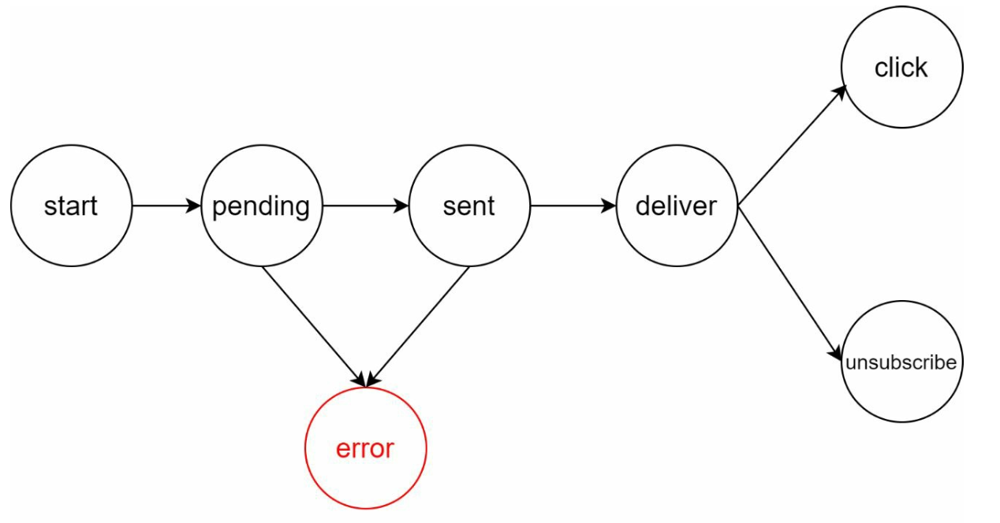

# 第 10 章：设计通知系统

> 原章节：Design a Notification System · 原项目路径 `10. Notification System/`

## 本章导读

通知系统看起来是全套系统设计题里最简单的一道——不就是"调个第三方接口，把消息推给用户"吗？但把规模拉到一天 1600 万条、要同时对接苹果、谷歌、短信网关和邮件服务商、还要保证一条都不能丢、不能重复发的时候，问题就变得有意思了。

这一章要解决的核心问题是：**如何把一个"调 API"的小功能，做成一个能扛住亿级用户、还能处理"一条公告发给一亿人"这种极端场景的分布式系统。**

学完这一章，你应该能回答：推送、短信、邮件三种渠道的本质区别是什么？设备令牌为什么会失效、失效了怎么办？为什么"去重"必须在消费端做，而不能在生产端做？一条营销公告要怎么发，才不会把验证码短信挤掉？

## 你将学到

- 三种通知渠道（APNs / FCM / SMS / Email）的本质差异与选型依据
- 设备令牌（device token）的完整生命周期：获取、刷新、失效、清理
- 用消息队列解耦通知生产与投递的架构，以及它解决了什么问题
- 通知去重的正确做法：为什么去重键是 `event_id` + `user_id`，为什么必须在消费端做幂等
- 用户通知偏好（opt-out）与合规要求（GDPR、CAN-SPAM、TCPA）
- 扇出风暴：一条公告发给一亿用户时的分批、限速与优先级队列

---

## 1. 需求与规模

任何系统设计都从"要做什么、要做多大"开始。通知系统的需求可以拆成四块。

### 功能需求

- **通知渠道**：推送（Push）、短信（SMS）、邮件（Email）三种。
- **投递时效**：软实时（soft real-time），允许秒级延迟，但不允许分钟级、更不允许丢失。
- **覆盖平台**：iOS、Android、桌面端。
- **触发方式**：既可能由客户端行为触发（比如"你的订单已发货"），也可能由服务端定时任务触发（比如"你的会员明天到期"）。
- **用户偏好**：用户可以关闭某一类通知（opt-out）。

### 规模估算

原笔记给出的日发送量是：

| 渠道 | 日发送量 |
|---|---|
| 推送 | 1000 万 |
| 短信 | 100 万 |
| 邮件 | 500 万 |
| **合计** | **1600 万** |

我们来算一下 QPS（Queries Per Second，每秒请求数）：

```
日均 QPS = 16,000,000 / 86,400 ≈ 185 QPS
峰值 QPS ≈ 185 × 3 ≈ 555 QPS
```

> **为什么要算这个数？**
> 因为 185 QPS 这个量级意味着：**单台服务器扛不住，但也不是特别夸张**——一个设计得当的集群，几十台机器就能处理。真正难的不是平均负载，而是两个极端：**流量尖峰**（比如电商大促时所有订单同时发货）和**扇出风暴**（一条公告发给一亿人）。这两个场景会在第 6 节展开。

### 一个容易被忽略的约束

**通知是"尽力而为"（best-effort）的。** 这一点非常关键，很多初学者会误以为"调用 APNs 接口返回成功 = 用户收到了"。事实是：

- APNs 和 FCM 都**不保证送达**。设备关机、无网络、用户关闭了通知权限，消息就静静消失了。
- 短信网关也不保证送达，运营商层面的过滤、手机停机都会导致丢失。
- 邮件更不可靠，可能进垃圾箱、被企业防火墙拦截。

所以，**如果业务要求"用户一定能看到"（比如验证码、支付结果），就不能只依赖推送**。正确的做法是"推送 + 应用内消息箱（inbox）"双保险：推送只负责"提醒用户去看"，真正的消息存在服务端，用户打开 App 时拉取。这条原则会在第 4 节和第 6 节反复出现。

---

## 2. 高层设计：三种渠道与核心组件

### 三种渠道的本质区别

初学者最容易犯的错，是把三种渠道当成"同一个接口的三个参数"。它们的实现机制、成本、可靠性完全不同。

| 维度 | APNs | FCM | SMS | Email |
|---|---|---|---|---|
| 全称 | Apple Push Notification service | Firebase Cloud Messaging | Short Message Service | 电子邮件 |
| 覆盖平台 | iOS / macOS / watchOS / tvOS | Android / iOS / Web | 所有手机 | 所有平台 |
| 寻址标识 | device token（64 位十六进制字符串） | registration token（约 150 字符） | 手机号 | 邮箱地址 |
| 通信协议 | HTTP/2 provider API | HTTP v1（REST） | SMPP 或服务商 HTTP API | SMTP 或服务商 API |
| 鉴权方式 | 证书（`.p12`）或 Token（`.p8` + JWT） | OAuth2 服务账号 | 服务商 API Key | SMTP 凭据 / API Key |
| 载荷上限 | 4 KB（VoIP 类 5 KB） | 4 KB | 单条 160 字符（长短信拼接） | 通常 25 MB（含附件） |
| 批量能力 | 一个请求对应一个 token（靠 HTTP/2 多路复用提效） | 一个请求最多 500 个 token | 逐条发送 | 逐条发送 |
| 成本 | 免费 | 免费 | 按条计费 | 极低 |
| 典型延迟 | 亚秒级 | 亚秒级 | 秒级 | 秒到分钟级 |
| 送达保证 | 尽力而为 | 尽力而为 | 尽力而为 | 尽力而为（可能进垃圾箱） |
| 典型用途 | 通知、角标、静默推送 | 同左 | 验证码、紧急告警 | 营销、账单、周报 |

> **APNs 和 FCM 的关键差异**，面试里被问到要能答上来：
> - **APNs 是苹果自建的、只服务苹果设备的通道**。开发者通过 HTTP/2 长连接把消息交给苹果，苹果再分发到设备。因为苹果掌控了从操作系统到硬件的全链路，所以它支持一些 FCM 没有的能力，比如静默推送（silent push，不弹通知但唤醒 App 后台拉数据）和角标（badge）的精确控制。
> - **FCM 是谷歌的跨平台通道**，同时支持 Android、iOS 和 Web。在 iOS 上，FCM 实际上是把消息**再转发给 APNs**——也就是说，给 iOS 发 FCM 消息，链路上多了一跳。FCM 的优势是支持**主题（topic）订阅**和**设备组（device group）**，一次请求可以发给一大批订阅了同一主题的设备。
> - **两者都要求 App 在前台/后台保持与厂商服务的注册关系**，而这个关系是通过 token 维系的——token 一旦失效，推送就发不出去。

### 组件一：联系信息收集

要发通知，先得有"地址"。

<div align="center"></div>

- **App 安装时**：客户端向 APNs / FCM 注册，拿到一个 device token，然后上报给通知服务器。
- **用户注册时**：收集手机号和邮箱。

这些信息存两张表：

| 表 | 存什么 | 用途 |
|---|---|---|
| **Device Tokens 表** | `user_id`、`device_token`、`platform`、`device_id`、`updated_at` | 推送 |
| **User 表** | `user_id`、`phone`、`email` | 短信、邮件 |

> **这里有个工程细节值得注意**：`device_tokens` 表的主键**不能是 `user_id`**，因为一个用户可能有多台设备（手机 + 平板 + 桌面端），一个用户对应多行。反过来，**同一个 token 也可能绑定过多个 `user_id`**——用户在同一台设备上切换账号时，如果 App 没有正确注销旧 token，就会出现"给 A 发推送，结果 B 的手机也响了"的事故。所以推送前必须按 `user_id` 精确过滤，并且要在用户登出时主动解绑。

### 组件二：通知发送流程

<div align="center"></div>

三个角色：

1. **触发服务（Trigger Service）**：产生通知事件的源头。它可能是一个微服务（订单服务发"已发货"）、一个定时任务（cron job 发"会员到期提醒"），或者一个分布式系统。**关键点：触发服务不关心通知怎么发，它只负责"抛出一个事件"。**
2. **通知服务器（Notification Server）**：对外提供 API，接收触发服务的请求。它负责：
   - 基础校验（邮箱格式、手机号格式是否合法）；
   - 查询数据库或缓存，补齐渲染通知所需的数据（用户昵称、订单号等）；
   - 把通知事件投递到下游。
3. **第三方服务（Third-Party Service）**：APNs、FCM、Twilio/Nexmo（短信）、SendGrid/Mailchimp（邮件），真正把消息送到用户手上。

### 这个初步设计的三个问题

原笔记很诚实地列出了它的缺陷：

- **单点故障（SPOF, Single Point of Failure）**：一台通知服务器挂了，整个通知链路瘫痪。
- **难以独立扩展**：数据库、缓存、处理逻辑全耦合在一台机器上，没法按瓶颈分别扩容。
- **性能瓶颈**：发通知是资源密集型操作，同步等待第三方 API 返回会拖垮服务器。

---

## 3. 改进设计：用消息队列解耦

<div align="center"></div>

改进思路是三个动作：

1. **把数据库和缓存搬出通知服务器**，让它们成为独立的、可各自扩展的组件。
2. **部署多台通知服务器**，前面加负载均衡，消除单点故障。
3. **引入消息队列（Message Queue）解耦**。

### 为什么消息队列是这里的关键

假设没有消息队列：通知服务器收到"给 100 万个用户发大促提醒"的请求，就得同步地一个个调第三方 API。这会带来三个后果：

- 通知服务器被长时间占用，无法响应其他请求；
- 第三方 API 限流或超时时，请求失败，需要重试逻辑，而重试逻辑写在同步链路里极其脆弱；
- 流量洪峰直接打到第三方，可能被对方封禁。

引入消息队列之后，链路变成：

```
通知服务器 → 投递到消息队列（立即返回）→ worker 从队列拉取 → 调第三方 API
```

**通知服务器只负责"把事件写进队列"，这个操作很快，写完就能返回。** 真正的发送工作交给下游的 worker（工作进程）。好处是：

- **削峰**：洪峰先堆在队列里，worker 按自己的节奏消费，不会打垮第三方。
- **解耦**：通知服务器不需要知道有几个 worker、worker 部署在哪。
- **可独立扩展**：队列积压了就多加几个 worker，通知服务器一行代码不用改。

> **消息队列必须持久化。** 这一点在第 1 章已经强调过：Kafka、RabbitMQ、RocketMQ 都把消息写到磁盘。如果队列只存在内存里，Broker 重启就会丢掉正在排队的通知——而这些通知里可能有用户正在等的验证码。

### 消息队列的分区设计

一个实用细节：**队列要按渠道（或按优先级）分区（Partition）**。

如果把推送、短信、邮件全塞进同一个队列，一个 worker 池要同时处理三种完全不同的下游（HTTP/2 长连接、SMPP、SMTP），代码会变得非常难维护，而且**一种渠道的下游变慢会拖垮所有渠道**。

合理的做法是按渠道拆队列：

| 队列 | 消费者 | 特点 |
|---|---|---|
| `push_queue` | Push Worker | 量大，走 APNs/FCM |
| `sms_queue` | SMS Worker | 量小，成本高，需要严格限速 |
| `email_queue` | Email Worker | 量大，延迟容忍度高 |

再叠加一层**优先级**，就得到了第 6 节要讲的优先级队列。

---

## 4. 深入设计：可靠性

可靠性要解决两个方向相反的问题：**不能丢**（漏发），和**不能重**（多发）。

### 4.1 防丢失：持久化 + 重试

<div align="center"></div>

原笔记的做法是：**把通知数据持久化到数据库，并实现重试机制。**

具体来说，要引入一个**通知日志库（Notification Log DB）**。每次要发一条通知，先往日志表里写一条记录（状态为"待发送"），worker 发送成功后再更新为"已发送"。

```
通知日志表
├── event_id        事件 ID
├── user_id         接收者
├── channel         渠道（push / sms / email）
├── status          pending / sent / failed
├── retry_count     已重试次数
├── next_retry_at   下次重试时间
└── created_at      创建时间
```

有了这张表，才能实现**指数退避重试（Exponential Backoff）**：第一次失败后等 1 秒重试，第二次等 2 秒，第三次等 4 秒……避免下游短暂抖动时疯狂重试把它打垮。

> **重试必然带来重复。** 这是分布式系统的基本规律：只要允许重试，投递语义就是"至少一次（at-least-once）"，而不是"恰好一次（exactly-once）"。比如 worker 调用 APNs 超时了——它不知道对方到底收到没有，只能重试，于是用户可能收到两条。
> 所以**重试和去重必须成对出现**。下一小节讲去重。

### 4.2 去重：key 的设计才是重点

原笔记说：

> Check event IDs to avoid sending duplicate notifications. When a notification event first arrives, check if it is seen before by checking the event ID. If seen before discard it, otherwise send out the notification.

翻译过来就是"用事件 ID 去重，见过就丢弃"。**这个思路方向是对的，但 key 设计错了，而且错得很典型。**

> **勘误：只用一个 event ID 去重会漏发**
> 假设运营要发一条"双十一大促"公告给 100 万个用户，触发服务产生的**是一个事件**，event ID 是 `evt_20241111_promo`。
> 如果去重键就是 `event_id`，那么第一个用户被发送后，这个 ID 就被标记为"已处理"——**后面 999,999 个用户全部会被误判为重复而丢弃**。
> **正确做法**：去重键是 **(`event_id`, `user_id`) 的组合**。它的语义是"**这个事件对这个用户**是否已经发过"，粒度才是对的。

于是去重逻辑变成：

```python
def handle(notification):
    key = f"notif_dedup:{notification.event_id}:{notification.user_id}"
    # SETNX + 过期时间：如果 key 不存在则写入并返回 True，否则返回 False
    is_first_time = redis.set(key, "1", nx=True, ex=86400)
    if not is_first_time:
        return  # 重复通知，丢弃
    send_to_third_party(notification)
```

用 Redis 的 `SET key value NX EX ttl` 一条命令同时完成"判断是否存在"和"写入"，天然原子。TTL（过期时间）设成 24 小时，既覆盖了重试窗口，又不会让去重表无限膨胀。

### 4.3 为什么幂等必须做在消费端，而不是生产端

这是本章最值得琢磨的一个设计问题。

**生产端（触发服务）做不了可靠的去重**，原因有三：

1. **生产端自己就会重试。** 触发服务调用通知服务器超时了，它不知道请求到底成功没有，只能重试——重试就会产生重复事件。**你没法用一个会产生重复的组件去消除重复。**
2. **同一个逻辑事件可能有多个生产端。** 比如订单服务有两个实例，故障转移时都可能触发一次"订单已发货"通知。
3. **消息队列本身只保证"至少一次"。** Kafka 的消费者如果处理完消息但还没提交 offset 就崩溃了，重启后会重新消费这条消息。这是 at-least-once 语义的必然结果，不是 bug。

**消费端（worker）才是唯一能拿到"权威状态"的地方**：它在真正调用第三方 API 之前，才第一次知道"这条通知到底发出去了没有"。所以：

- **去重检查放在 worker 里**，紧挨着第三方调用；
- **用 (event_id, user_id) 作为幂等键**；
- 检查与发送之间要尽量缩短时间窗口。

> **一个绕不开的取舍：先标记还是后标记？**
> - **先写去重键、再发送**（check-then-act）：如果 worker 写完键就崩溃，这条通知会**永远丢失**（因为键已存在，重试时会被当成重复丢弃）。这是"至多一次（at-most-once）"。
> - **先发送、再写去重键**：如果发送成功后 worker 崩溃，重试时键不存在，会**重复发送**。这是"至少一次（at-least-once）"。
> 现实中的选择取决于业务：**营销通知宁可重复也别丢**（选后者），**验证码宁可丢失让用户重新点一次也别重复**（选前者，或者干脆不走这套去重、靠验证码本身的时效性）。没有银弹。

---

## 5. 通知偏好与合规

原笔记在需求里提了一句"用户可以 opt-out"，在附加组件里提了一句"通知设置表"，但**完全没有展开**。这是一个真实的缺口——通知偏好不只是产品功能，更是法律要求。

### 5.1 偏好的维度：渠道 × 类别

一个常见的设计错误是把偏好做成"开/关推送"。真实场景里，用户想表达的是：

> "我不想收营销推送，但订单状态、验证码还是要发给我。"

所以偏好必须是**两个维度的笛卡尔积**：

| | 推送 | 短信 | 邮件 |
|---|---|---|---|
| **事务类**（验证码、订单、安全） | 通常不可关 | 通常不可关 | 可关 |
| **社交类**（点赞、评论、关注） | 可关 | 可关 | 可关 |
| **营销类**（活动、优惠券） | 可关 | 可关 | 可关 |

存储上就是一张设置表：

```
notification_settings
├── user_id
├── channel      push / sms / email
├── category     transactional / social / marketing
├── enabled      boolean
└── updated_at
```

### 5.2 偏好检查应该放在哪里

**必须在发送前检查，而且是在 worker 里检查，不是只在入队时检查。**

原因：用户可能在"事件入队"和"worker 真正发送"之间修改了偏好。这个窗口在高负载时可能长达几分钟。如果在入队时就锁定了，用户会收到他刚刚关掉的通知，体验很差（也可能违规）。

但反过来，**每条通知都查一次数据库会拖垮 DB**。折中方案：

1. 偏好数据**缓存到 Redis**，key 是 `notif_pref:{user_id}`，TTL 设短一些（比如 5 分钟）；
2. 用户修改偏好时**主动删除缓存**（Cache-Aside 模式，见第 1 章）；
3. 接受**秒级的不一致**——这在业务上完全可以接受。

### 5.3 合规：不是可选项

| 法规 | 地区 | 对通知系统的要求 |
|---|---|---|
| **GDPR**（通用数据保护条例） | 欧盟 | 处理个人数据需有合法依据；营销通知必须**明确同意（opt-in）**；必须提供便捷退订；用户有权要求删除数据（right to erasure），删除时要一并清理 device token 和通知记录 |
| **CAN-SPAM** | 美国（邮件） | 商业邮件必须有**清晰的退订链接**；退订请求须在 **10 个工作日内**生效；邮件头（From / Reply-To）必须真实；必须标注为广告 |
| **TCPA** | 美国（短信/电话） | 营销短信需要**事先书面同意（prior express written consent）**；限制发送时段（当地时间 8:00–21:00）；违规罚金极高 |
| **CASL** | 加拿大 | 需明示或默示同意；退订须在 10 个工作日内生效 |
| **《个人信息保护法》** | 中国 | 需告知并取得同意；《通信短信息服务管理规定》要求商业短信须经用户同意并提供退订方式 |

> **工程上的落地**：合规要求最终都会变成几个具体的字段和检查点。
> - 设置表里加 `consent_at`（同意时间）和 `consent_source`（同意来源，比如"注册页勾选框"）——**这是被审计时要拿出来的证据**。
> - 退订必须**端到端打通**：用户在 App 里点了退订，或者回复了短信"TD"，都要能写回偏好表，并且**立即影响正在排队的通知**。
> - 删除账号时，device token、通知日志、偏好记录要**一并删除**，不能只删用户表。

---

## 6. 扇出风暴：一条公告发给一亿用户

这是原笔记完全没覆盖、但生产环境一定会遇到的场景。

**场景**：运营要给全站 1 亿用户发一条营销公告。

### 6.1 直接循环会发生什么

假设最朴素的做法是"遍历 1 亿个 user_id，逐个调用发送接口"：

- 单次调用按 50 毫秒（网络往返 + 第三方处理）算，一个 worker 每秒只能发 **20 次**；
- 总共需要 `100,000,000 / 20 = 5,000,000` **worker 秒**；
- 即使上 1000 个 worker，也要 `5,000,000 / 1000 = 5000 秒 ≈ 83 分钟`；
- 更糟的是，这 1 亿次调用会**瞬间打满 APNs / FCM 的配额**，导致正常业务的验证码、订单通知全部被限流——**这才是真正的灾难**。

### 6.2 五个正确的做法

**① 分批（Batching）**

不要一个用户一条消息，而是把用户列表切成批次：

```
1 亿用户 → 切成 10 万批，每批 1000 人 → 每批一条队列消息
```

队列里的消息数从 1 亿降到 10 万，**降低了 1000 倍**。worker 拿到一批后，用第三方支持的批量接口一次发出去——比如 FCM 一个请求可以带 500 个 token，那么 1 亿条推送只需要 `100,000,000 / 500 = 200,000` 个请求，比逐条发送减少了 500 倍。

**② 限速（Rate Limiting）**

总发送速率必须被主动钳制在第三方配额之下。假设 APNs 允许 5000 请求/秒：

```
200,000 个请求 / 5000 = 40 秒（理论下限）
```

限速的实现方式通常是**令牌桶（Token Bucket）**：worker 每次调第三方前先从桶里取一个令牌，取不到就等待。这样即使队列里堆了 10 万条消息，出口速率也是平稳的。

**③ 优先级队列（Priority Queue）**

这是**保证"营销不挤掉验证码"的关键**。把所有通知按业务重要性分成几档：

| 优先级 | 典型通知 | 处理策略 |
|---|---|---|
| **P0** | 验证码、安全告警、支付结果 | 永不限速、永不降级，独立 worker 池 |
| **P1** | 订单状态、物流更新 | 正常处理 |
| **P2** | 社交互动（点赞、评论） | 系统繁忙时降速 |
| **P3** | 营销、活动、推荐 | 系统繁忙时暂停，只占用空闲产能 |

**P0 必须有独立的队列和独立的 worker 池**，物理隔离。如果只是"同一个队列里排优先级"，那么 P3 的 10 万条消息堵在前面，P0 照样要等——优先级就形同虚设。

**④ 按用户限流**

单个用户每天收到的营销通知要有上限（比如 3 条）。这既是防骚扰，也是防止某个 bug 导致同一用户被狂轰滥炸。实现上是一个 `user_id → 今日已发营销条数` 的计数器，放在 Redis 里，按天重置。

**⑤ 按本地时间发送**

**不要在凌晨 3 点给用户发营销推送。** 按用户所在时区（或粗略按国家/地区）把发送任务排到当地时间的合理时段（比如 9:00–20:00）。实现上是把受众按地域分桶，每个桶用定时任务在自己的时间窗口内触发。

> **顺带一提**：即使做了分批，**去重依然要做**。因为批量任务本身可能因为故障转移被触发两次，所以每个批次的处理也要带幂等键（`event_id` + 批次 ID，或者干脆在 worker 内对每个用户再做一次 `(event_id, user_id)` 去重）。

---

## 7. 其他组件、安全与完整流程

### 7.1 原笔记提到的其余组件

<div align="center"></div>

| 组件 | 作用 | 工程要点 |
|---|---|---|
| **通知模板（Template）** | 预置模板，保证格式一致、渲染高效 | 模板要做**版本管理**；渲染时注意**变量转义**，防止用户昵称里带恶意内容导致注入 |
| **通知设置** | 用户的 opt-in / opt-out | 见第 5 节 |
| **限流（Rate Limiting）** | 限制给单个用户发通知的频率 | 用户级 + 全局级双层限流 |
| **重试机制** | 第三方失败时重试 | 指数退避 + 最大重试次数 + 死信队列（DLQ） |
| **队列监控** | 跟踪队列积压，动态扩缩 worker | 积压量是关键指标，可以驱动自动伸缩 |
| **事件追踪（Event Tracking）** | 收集打开率、点击率、参与度 | 归因困难：用户可能在多个渠道收到同一条通知，要设计好归因窗口 |

> **关于事件追踪的一个坑**：打开率（open rate）这个指标很容易被高估。因为推送的"打开"往往只能通过"App 被启动"来推断，而用户可能只是因为别的通知启动了 App。要更准确，需要用**深度链接（deep link）**把用户带到具体页面，再记录页面到达事件。

### 7.2 安全

原笔记只写了一句"用 AppKey 和 AppSecret 来认证和保护推送 API"。这里需要说清楚，因为**它其实混淆了两个不同的鉴权层次**：

- **自家 API 的鉴权**（AppKey / AppSecret）：这是**你的服务对外**的鉴权。触发服务调用通知服务器时，用 AppKey 标识身份、AppSecret 签名，防止未授权方调用你的通知接口。这属于常规的 API 网关鉴权。
- **对接第三方通道的鉴权**（另一个层次）：
  - **APNs**：用**证书认证**（`.p12` 证书，需要定期续期）或**令牌认证**（`.p8` 私钥签发 JWT，苹果推荐，一个 key 可覆盖所有 App，且不过期）。
  - **FCM**：用 **OAuth2 服务账号**（下载 JSON 凭据，换取 access token）。
  - **短信/邮件服务商**：各自的 API Key。

**这两层不能混为一谈。** AppKey/AppSecret 保护的是你自己的入口，APNs 证书/令牌保护的是你与苹果之间的通道。原笔记只提了前者，容易让初学者以为"配好 AppKey 就能推送了"。

### 7.3 完整的通知流程

<div align="center"></div>

把前面的组件串起来，一条通知的完整旅程是：

1. **触发服务**调用通知服务器 API，提交一个通知事件（含 `event_id`、`user_id`、模板 ID、变量）。
2. **通知服务器**校验请求合法性，从缓存或数据库补齐渲染所需的数据（用户昵称、订单号等），做基础校验（邮箱/手机号格式）。
3. **通知服务器**把通知事件投递到对应的**消息队列**（按渠道 + 优先级分区），立即返回。
4. **Worker** 从队列拉取事件，执行：
   - 去重检查（`(event_id, user_id)`）；
   - 偏好检查（用户是否关闭了该渠道 × 该类别的通知）；
   - 限流检查（用户级 + 全局级）；
   - 渲染模板；
   - 调用第三方服务；
   - 更新通知日志状态。
5. **第三方服务**把通知投递到用户设备。

---

## 8. 关键优化与小结

原笔记列出的优化项，逐条点评：

1. **水平扩展（Horizontal Scaling）**：加更多通知服务器分摊负载。✅ 正确，但要注意通知服务器本身应该是**无状态**的，状态都在数据库、缓存和队列里（呼应第 1 章）。
2. **消息队列**：解耦处理，应对高并发。✅ 本章第 3 节已展开。
3. **缓存**：缓存频繁访问的数据，降低延迟。✅ 特别是用户偏好和模板，见第 5 节。
4. **"Distributed Crawling"**：❌ **这条是错的**，与通知系统毫无关系，详见文末勘误。

---

## 勘误与补充

### 勘误 1：只用一个 event ID 去重会导致大面积漏发

- **原文说法**：`Check event IDs to avoid sending duplicate notifications. When a notification event first arrives, check if it is seen before by checking the event ID. If seen before discard it, otherwise send out the notification.`
- **问题**：一个通知事件（比如一条全站公告）通常会**扇出给多个用户**。如果去重键就是全局的 `event_id`，那么第一个用户被发送后，这个 ID 就被标记为"已处理"，后续所有用户都会被误判为重复而**全部丢弃**。这不是小概率 bug，而是必然发生的功能故障。
- **正确说法**：去重键必须是 **(`event_id`, `user_id`) 的组合**，语义是"这个事件对这个用户是否已经发过"。存储上用 Redis 的 `SET key value NX EX ttl` 保证原子性。
- **延伸**：这类"幂等键选错粒度"的问题在分布式系统里非常常见。判断幂等键是否正确的方法：**问自己"这个 key 唯一标识的是哪一次'副作用'"**。这里副作用是"给某个用户发一条通知"，所以 key 必须包含用户维度。

### 勘误 2：Key Optimizations 里的 "Distributed Crawling" 与通知系统无关

- **原文说法**：Key Optimizations 第 4 条 —— `Distributed Crawling: Optimize message delivery geographically for better performance.`
- **问题**：**通知系统里没有"爬虫"（crawling）**。"Distributed Crawling" 显然是**从其他章节（如网页爬虫章节）误抄过来的**，与通知投递没有任何逻辑关系。把"分布式爬取"当成通知系统的优化项，会误导初学者。
- **正确说法**：这一条应当删除。如果想说"地理就近投递"，正确的表述是：**把发送 worker 部署在离第三方服务接入点较近的区域**，或者利用 APNs / FCM 自带的全球接入点。这属于**部署拓扑优化**，与爬虫无关。
- **延伸**：原项目是个人读书笔记，出现跨章节抄写残留是正常的。**读笔记时保持判断力，比记住笔记内容更重要**——这也是本项目做"勘误"的意义。

### 勘误 3：AppKey / AppSecret 不是对接 APNs / FCM 的鉴权方式

- **原文说法**：Security 一节 —— `Use AppKey and AppSecret to authenticate and secure APIs for push notifications.`
- **问题**：这句话把**两个不同层次的鉴权混为一谈**。AppKey/AppSecret 是**你自己的服务对外提供的 API 的鉴权**；而对接 APNs / FCM 需要的是完全不同的凭据（APNs 证书或 `.p8` 令牌、FCM 的 OAuth2 服务账号）。只说 AppKey/AppSecret，会让初学者以为配好它就能推送。
- **正确说法**：鉴权分两层——**对外**用 AppKey/AppSecret（或 OAuth2）保护你的通知 API；**对下**用 APNs 证书/令牌、FCM 服务账号、短信/邮件服务商的 API Key。两层都要配置，且凭据的轮换周期不同。
- **延伸**：APNs 的证书认证需要**每年续期**，忘记续期会导致推送集体失败——这是运维事故的经典原因。苹果推荐改用**基于令牌（token-based）的认证**，`.p8` 私钥不过期，且一个 key 可用于多个 App。

### 勘误 4：APNs 的正确缩写，以及"推送保证送达"的错误预期

- **原文说法**：`iOS Push Notifications: Use Apple Push Notification Service (APNS)`；整体设计默认"调用第三方成功即送达"。
- **问题**：① 苹果官方缩写是 **APNs**（小写 s），不是 APNS；② 更重要的问题是，全文没有指出**推送是"尽力而为"的，不保证送达**。设备离线、用户关闭通知权限、token 失效都会导致静默丢失。
- **正确说法**：APNs 和 FCM 都是 best-effort 通道。如果业务要求"用户一定能看到"，必须做**推送 + 应用内消息箱**双保险：推送只负责提醒，真正的消息存在服务端，用户打开 App 时同步。
- **延伸**：这个认知直接决定了架构——如果以为推送可靠，就不会设计消息箱；等线上发现"用户投诉没收到验证码"时再补，成本高得多。

### 补充 1：设备令牌（device token）的完整生命周期

原笔记只说"收集 device token"，完全没有讲它的生命周期管理。这是生产环境**最容易出事故**的地方。

**① 获取（Registration）**

App 首次启动时，向 APNs / FCM 注册，拿到 token：
- iOS：`registerForRemoteNotifications()` → 回调 `didRegisterForRemoteNotificationsWithDeviceToken`
- Android：`FirebaseMessaging.getInstance().getToken()`

App 把 token 连同 `user_id`、`device_id`、平台、App 版本上报给通知服务器。

**② 刷新（Refresh）**

**token 不是永久的，它会变。** 变化时机包括：重装 App、从备份恢复、清除数据、系统升级、长期未使用。所以客户端**必须监听刷新回调**并重新上报：
- iOS：每次启动都调用注册方法，拿到新 token 就上报；
- Android：监听 `onNewToken()` 回调。

> **最常见的线上 bug**：客户端只在首次安装时上报 token，从不监听刷新。结果用户换手机后，推送发到了旧 token 上——**用户再也收不到通知，而且没有任何报错**。

**③ 失效（Invalidation）**

token 会在以下情况失效：用户卸载 App、注销账号、关闭通知权限、长时间未活跃。

**通知服务器怎么知道 token 失效了？** 靠发送时的错误响应：
- **APNs**：返回 `410 Unregistered`（并在响应体里带上"该 token 失效的时间戳"），或 `400 BadDeviceToken`。
- **FCM**：返回 `UNREGISTERED` 或 `NOT_FOUND` 错误码。

**④ 清理（Cleanup）**

收到失效响应后，要**立即从 `device_tokens` 表删除该 token**。如果不清，每次发送都会白白调用一次第三方接口，浪费配额、拖慢发送速度。

除了被动清理，还要**主动清理**：定期删除"超过 N 天（比如 90 天）没有任何 token 刷新、且用户从未打开 App"的记录。

**⑤ 多账号 / 多设备的边界情况**

- 一个用户多台设备 → 一个 `user_id` 对应多行 token，发送时全部要发。
- 一台设备多个账号 → 同一 token 可能绑定过多个 `user_id`。**用户登出时必须解绑**，否则会出现"A 的消息推到了 B 的手机上"这种隐私事故。
- 给同一用户的多台设备发通知时，可以考虑**只给最近活跃的一台发**（比如用户正在用平板，就不给手机弹），避免多设备同时响铃。

### 补充 2：用户通知偏好与合规

原笔记在需求里提了 opt-out，在组件里提了通知设置表，但**完全没有展开**，更没有提合规。详见第 5 节。**核心要点**：偏好要按"渠道 × 类别"两个维度建模；偏好检查必须在 worker 发送前做；GDPR / CAN-SPAM / TCPA 等法规对营销通知有强制的同意与退订要求，这些最终都要落成数据库字段和检查点。

### 补充 3：扇出风暴（Fan-out Storm）

原笔记完全没有覆盖"一条公告发给一亿用户"的场景。详见第 6 节。**核心要点**：分批（把 1 亿条消息压成 10 万条批次）、限速（令牌桶钳制在第三方配额之下）、优先级队列（P0 事务性通知必须有独立的队列和 worker 池，与营销物理隔离）、用户级限流、按本地时间发送。

### 补充 4：推送不可靠，需要"应用内消息箱"兜底

原笔记没有指出推送的 best-effort 本质。详见第 1 节和第 4 节。**核心要点**：任何"用户必须看到"的消息（验证码、支付结果、安全告警）都不能只依赖推送，必须有服务端的消息箱，用户打开 App 时同步拉取。

---

## 常见误区

| 误区 | 为什么错 | 正确理解 |
|---|---|---|
| 调用第三方 API 成功 = 用户收到了 | APNs / FCM / 短信 / 邮件全部是 best-effort，设备离线、权限关闭、token 失效都会静默丢失 | 重要通知必须配"应用内消息箱"兜底 |
| 用 event ID 去重就够了 | 一个事件会扇出给多个用户，用全局 event ID 会让第一个用户之后的全部被误判为重复 | 幂等键是 (`event_id`, `user_id`) |
| 去重放在生产端更省事 | 生产端自己就会因超时重试而产生重复；消息队列本身也只保证 at-least-once | 幂等必须做在消费端（worker），紧挨第三方调用 |
| 消息队列可以只放内存里，快 | 只存内存的组件不提供持久性，Broker 重启即丢消息 | 现代消息队列（Kafka / RabbitMQ / RocketMQ）都持久化到磁盘 |
| 用户 opt-out 只是个产品开关 | 营销通知的同意与退订是 GDPR / CAN-SPAM / TCPA 的**法律要求**，违规有实打实的罚金 | 同意时间、同意来源、退订链路都要落库并可审计 |
| 偏好只在入队时检查一次就行 | 用户可能在入队后、发送前修改偏好，窗口期可能长达几分钟 | 在 worker 发送前检查，偏好缓存到 Redis，修改时主动失效 |
| 给一亿用户发公告就是多开几个 worker | 会瞬间打满第三方配额，把验证码等 P0 通知一起挤掉 | 分批 + 限速 + **优先级队列物理隔离** + 用户级限流 |
| 群发通知不用考虑用户所在时区 | 凌晨发营销推送会引发大量投诉和退订 | 按用户地域分桶，只在当地合理时段发送 |
| AppKey / AppSecret 配好就能推送 | 那是你自己 API 的鉴权，不是对接 APNs / FCM 的凭据 | 对外用 AppKey，对下用 APNs 证书/令牌、FCM 服务账号 |
| device token 是永久不变的 | 重装、恢复备份、系统升级、长期不用都会让 token 变化或失效 | 客户端监听刷新回调并重新上报；服务端按 410 / UNREGISTERED 清理 |

---

## 面试速记

- **一句话概括**：通知系统是一个**以消息队列为核心、以"至少一次投递 + 消费端幂等"为可靠性基础**的扇出型系统，难点在于多渠道异构、设备令牌生命周期管理和极端扇出场景。

- **必答要点**：
  1. **架构**：触发服务 → 通知服务器（校验 + 补数据）→ 消息队列（按渠道/优先级分区）→ worker → 第三方服务（APNs / FCM / SMS / Email）。
  2. **可靠性**：通知日志表持久化 + 指数退避重试 + **(`event_id`, `user_id`) 去重**。
  3. **幂等位置**：去重必须在**消费端**做，因为生产端会因超时重试产生重复，且消息队列只保证 at-least-once。
  4. **设备令牌生命周期**：注册 → 刷新（监听回调）→ 失效（410 / UNREGISTERED）→ 清理；token 会变，必须持续维护。
  5. **偏好与合规**：偏好按"渠道 × 类别"建模，在 worker 发送前检查；营销通知受 GDPR / CAN-SPAM / TCPA 约束。

- **加分项**：
  1. 主动指出**推送是 best-effort**，重要通知需要"应用内消息箱"兜底。
  2. 主动区分**两层鉴权**（AppKey/AppSecret 对外，APNs 证书/令牌、FCM 服务账号对下）。
  3. 主动提出**优先级队列物理隔离**，保证营销公告不挤掉验证码。
  4. 主动给出扇出风暴的**量化估算**（1 亿条 → 分批 10 万条 → 批量 500/请求 → 20 万请求）。
  5. 主动讨论**去重键的先后顺序取舍**（at-most-once vs at-least-once）。

- **高频追问**：
  1. *"用户抱怨重复收到同一条通知，怎么排查？"*
     → 先确认重试是否触发了重复（超时后重试是正常的）；检查去重键是不是用成了全局 `event_id`（应该带 `user_id`）；检查去重键的 TTL 是否短于重试窗口；检查是否有多个生产端发出同一逻辑事件。
  2. *"怎么保证营销推送不影响验证码短信？"*
     → P0 事务性通知走独立的队列和独立的 worker 池，物理隔离；营销走低优先级队列，系统繁忙时暂停；全局和用户级双层限流；两者配额分开申请。
  3. *"device token 失效了但没清理，会有什么后果？"*
     → 每次发送都白白调用一次第三方接口，浪费配额、拖慢整体发送速度；失效 token 占比高时，有效通知的送达率会明显下降。所以要靠 410 / UNREGISTERED 响应被动清理，并定期主动清理长期未活跃的 token。
  4. *"给一亿用户发一条公告，怎么设计？"*
     → 预计算受众并按分片存储 → 切成 10 万批（每批 1000 人）投递到低优先级队列 → 令牌桶限速在第三方配额之下 → 用 FCM 批量接口（500 token/请求）降低请求数 → 按用户时区分时段发送 → 全程带幂等键防重复。

---

## 延伸阅读

- [ByteByteGo 系统设计面试课程](https://bytebytego.com/courses/system-design-interview) — 原笔记的来源
- [Apple Push Notification service 官方文档](https://developer.apple.com/documentation/usernotifications) — 含 token 认证与 410 响应处理
- [Firebase Cloud Messaging 官方文档](https://firebase.google.com/docs/cloud-messaging) — 含批量发送与错误码说明
- [GDPR 官方全文](https://gdpr-info.eu/) — 营销通知的同意与退订要求
- [FTC：CAN-SPAM 合规指南](https://www.ftc.gov/business-guidance/resources/can-spam-act-compliance-guide-business) — 邮件营销的强制要求
- [FCC：TCPA 与自动呼叫](https://www.fcc.gov/consumers/guides/stop-unwanted-robocalls-and-texts) — 短信营销的同意与时段限制
