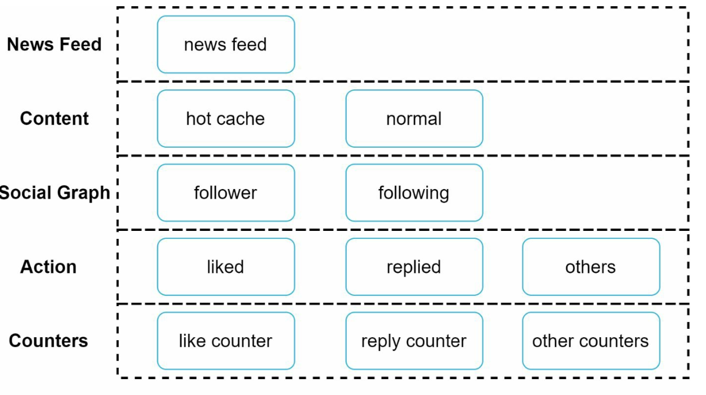

# 第 11 章：设计信息流系统

> 原章节：Design a News Feed System · 原项目路径 `11. News Feed System/`

## 本章导读

信息流（News Feed）是你每天都会用、却很少去想它有多难的东西。打开微信朋友圈、刷微博、看 Twitter——屏幕上的内容是怎么在几百毫秒内被拼出来的？

这一章要解决的核心问题是：**当你有 1000 万活跃用户、有人有 5000 个好友、还有人有一千万粉丝时，"把好友的动态聚合给你看"这件事，到底该在写入的时候做，还是在读取的时候做？**

这不是一个可以含糊过去的问题——它决定了整个系统的成本、延迟和可扩展性。学完这一章，你应该能回答：为什么 Twitter、微博这类系统最终都选择了"推拉结合"？一个大 V 发一条动态，系统要付出多少代价？为什么"按时间倒序"正在被"算法排序"取代，架构上要做什么改造？

## 你将学到

- 信息流系统的两条核心链路：发布（Feed Publishing）与读取（News Feed Building）
- **推模式（Fan-out on Write / 写扩散）、拉模式（Fan-out on Read / 读扩散）、推拉结合**的完整对比与选型依据
- 为什么 Twitter / 微博最终选择"普通用户推、大 V 拉"的混合模式
- 大 V 问题的量化：一个 1000 万粉丝的用户发一条动态，成本是多少
- 五层缓存架构各自解决什么问题
- 从时间倒序到算法排序：排序系统需要哪些新组件

---

## 1. 需求与规模

### 功能需求

- **平台**：同时支持 Web 和移动端。
- **发布**：用户可以发帖（文字、图片、视频、链接）。
- **消费**：用户可以看到好友的动态，聚合在自己的信息流里。
- **排序**：原笔记为了简化，设定为**按时间倒序（reverse chronological order）**。

### 规模估算

原笔记给的数字是：

- 单用户最多 **5000 个好友**
- **1000 万日活用户（DAU, Daily Active Users）**
- 信息流里包含文字、图片、视频

这些数字看起来不大，但一旦开始算扇出（fan-out）的量，就会发现问题。

**我们先算读取量。** 假设每个用户每天刷新信息流 10 次：

```
日读取量 = 10,000,000 × 10 = 100,000,000 次
平均读 QPS = 100,000,000 / 86,400 ≈ 1,157 QPS
峰值读 QPS ≈ 1,157 × 3 ≈ 3,500 QPS
```

**再算写入量。** 假设每个用户每天发 1 条动态，平均每人 200 个好友：

```
日发帖量 = 10,000,000 条
日扇出写入量 = 10,000,000 × 200 = 2,000,000,000 次（20 亿次）
平均扇出 QPS = 2,000,000,000 / 86,400 ≈ 23,000 QPS
峰值扇出 QPS ≈ 23,000 × 3 ≈ 70,000 QPS
```

> **注意这两个数字的不对称**：读是 3500 QPS，扇出写是 70000 QPS——**写入侧的负载是读取侧的 20 倍**。
> 这个不对称正是本章所有设计的出发点。单台 Redis 大约能扛 10 万次简单操作/秒，70,000 QPS 的峰值已经接近它的极限了，而且还只是"平均情况"，没算大 V。所以**扇出必须能分片、能削峰、能选择性地放弃**。

### 一个必须先想清楚的问题

信息流系统的本质是**一次多对多的聚合**：你关注了 N 个人，系统要把这 N 个人最近的动态，按某个顺序合并成一条列表给你。

这里立刻出现了一个分叉：

- 我可以在**别人发帖的时候**，就把帖子塞进所有粉丝的信息流里（**写的时候扩散**）；
- 也可以在**我读的时候**，才去把关注的人最近的帖子捞出来合并（**读的时候扩散**）。

这两种选择，就是本章的核心。第 4 节会展开。

---

## 2. 高层设计：两条链路与 API

信息流系统可以拆成两条相对独立的链路。

### 2.1 两条链路

| 链路 | 触发 | 做什么 |
|---|---|---|
| **发布链路（Feed Publishing）** | 用户发帖 | 存帖 + 传播到好友的信息流 |
| **读取链路（News Feed Building）** | 用户刷信息流 | 聚合好友的帖子，按序返回 |

两条链路的负载特征完全不同：**发布是写密集且会放大**，**读取是读密集且要求低延迟**。把它们分开设计，才能各自优化。

### 2.2 两个 API

原笔记给出的 API 设计很简洁：

**发布动态**

```
POST /v1/me/feed
参数：
  content     动态内容（文字、图片 URL 等）
  auth_token  鉴权令牌
```

**获取信息流**

```
GET /v1/me/feed
参数：
  auth_token  鉴权令牌
```

> **这里有个现代实践上的补充**：真实的信息流 API 一定是**基于游标（cursor）分页**的，而不是 `offset` + `limit`。原因是信息流是**持续变化**的：你用 `offset=20` 翻到第二页，如果这期间有人发了新帖，第一页的内容会整体后移，你第二页就会看到第一页已经看过的内容（重复），或者漏掉内容。游标（比如"上一页最后一条的时间戳/ID"）能锚定一个稳定的位置。
> 参数大概长这样：`GET /v1/me/feed?cursor=<last_post_id>&limit=20`。

### 2.3 发布链路

<div align="center"></div>

一条动态的发布流程：

1. **用户**通过发布 API 提交动态。
2. **负载均衡器**把请求分发到某台 Web 服务器。
3. **Web 服务器**校验 `auth_token`，把请求转发给后端服务。
4. **帖子服务（Post Service）**把帖子写入数据库和缓存。
5. **扇出服务（Fanout Service）**把帖子传播到好友的信息流缓存里。
6. **通知服务（Notification Service）**给好友发通知。

### 2.4 读取链路

<div align="center"></div>

1. **用户**通过读取 API 请求信息流。
2. **负载均衡器**分发请求。
3. **Web 服务器**把请求转发给信息流服务。
4. **信息流服务（News Feed Service）**从信息流缓存里取出**帖子 ID 列表**，再根据这些 ID 去数据库或内容缓存里取完整的帖子详情，组装后返回。

> **为什么分两步取？** 因为"帖子 ID 列表"很小、变化很快，适合放在缓存里；"帖子详情"（正文、图片 URL、作者信息）体积大、变化慢，适合放在另一层缓存或数据库。**如果信息流缓存里直接存完整帖子，一条帖子被 200 个人引用就要存 200 份，内存会爆炸。** 存 ID 是标准做法，这个细节在下一节会再出现。

---

## 3. 发布链路深入：扇出服务

### 3.1 扇出服务的五个步骤

<div align="center"></div>

原笔记给出的扇出流程是：

1. **取好友 ID**：从图数据库（Graph DB）里取出作者的好友列表。
2. **按缓存过滤**：读取用户设置，排除掉不该看到这条动态的人（比如被静音的好友、分组可见的例外）。
3. **投递到消息队列**：把"过滤后的好友列表 + 新帖子 ID"打包，投进消息队列。
4. **扇出 worker 消费**：worker 从队列里取任务，更新好友的信息流缓存。
5. **写入信息流缓存**：把新帖子 ID 追加到好友的缓存列表里。

<div align="center"></div>

> **两个关键设计细节**，原笔记提到了，值得展开：
>
> **① 缓存里存的是 `<post_id, user_id>` 映射，不是完整帖子对象。** 原因上面说过——避免存储放大。一个 5000 好友的大 V 发帖，如果存完整帖子就是 5000 份副本；存 ID 只有 5000 个 8 字节的数字。
>
> **② 缓存列表有长度上限（configurable limit）。** 每个用户的信息流缓存只保留最近 N 条（比如 500 条）。因为绝大多数用户只看最新的内容，保留更早的没有意义，反而会吃掉大量内存。实现上是 `LPUSH`（头插）+ `LTRIM`（保留前 N 个）。

### 3.2 为什么要用消息队列

扇出是一个**天然的异步操作**：用户发帖后，不需要等"传播给所有好友"完成才能看到"发布成功"。所以：

```
帖子服务（写库，立即返回"发布成功"）→ 消息队列 → 扇出 worker（慢慢传播）
```

好处和第 10 章通知系统一样：**削峰、解耦、可独立扩展**。大 V 发帖会产生巨大的扇出任务，先堆在队列里，worker 按自己的能力消费，不会把缓存集群打垮。

---

## 4. 核心议题：推模式、拉模式与推拉结合

这是本章最重要的一节。原笔记提到了这三种模式，但对比不够系统，这里补全。

### 4.1 三种模式是什么

**① 推模式（Fan-out on Write / 写扩散）**

用户发帖时，**立刻**把帖子 ID 写进所有好友的信息流缓存。

- 读的时候，直接读自己的缓存列表即可，O(1)。
- 代价：写的时候要写 N 次（N = 好友数）。

**② 拉模式（Fan-out on Read / 读扩散）**

用户发帖时，**只写自己的发件箱（outbox）**。好友读信息流时，系统**实时**去拉取所有关注对象的发件箱，合并排序后返回。

- 写的时候只写 1 次，O(1)。
- 代价：读的时候要拉 M 次（M = 关注数）并合并排序。

**③ 推拉结合（Hybrid）**

对**大部分用户**用推模式（他们的粉丝少，写入放大可接受，读取快）；对**大 V（粉丝极多）**用拉模式（不推，等粉丝来读时再拉）。

### 4.2 完整对比表

| 维度 | 推模式（Fan-out on Write） | 拉模式（Fan-out on Read） | 推拉结合（Hybrid） |
|---|---|---|---|
| **写入成本** | 高，O(粉丝数)，一条动态写 N 次 | 低，O(1)，只写自己的发件箱 | 中，普通用户 O(粉丝数)，大 V O(1) |
| **读取成本** | 低，O(1)，直接读预计算好的列表 | 高，O(关注数)，需实时拉取 + 归并排序 | 中，普通部分 O(1)，大 V 部分 O(大 V 数) |
| **读取延迟** | 低且稳定（毫秒级，一次缓存读） | 高且随关注数增长（要拉 M 个源再排序） | 低（大 V 数量通常只有几十到几百） |
| **写入延迟** | 高（要等扇出完成才可见，或异步有延迟） | 低（写完自己发件箱即可） | 低 |
| **存储放大** | 高：一条动态存 N 份 | 无：一条动态只存 1 份 | 中 |
| **实时性** | 好（写完即扇出） | 取决于缓存，可能差 | 好（大 V 的动态读取时现拉，反而更实时） |
| **热点抗性** | **差**：大 V 发帖即风暴 | **好**：大 V 发帖不影响任何人 | 好 |
| **不活跃用户** | **浪费**：给从不登录的用户白写 | **友好**：不登录就不产生读取成本 | 友好（可对不活跃用户关闭推送） |
| **实现复杂度** | 低 | 中 | 高 |
| **适合场景** | 粉丝少、活跃度高的社交关系 | 粉丝多、或读少写多的场景 | 大规模社交网络（Twitter / 微博 / Instagram） |

### 4.3 为什么最终都选"推拉结合"

先看两个极端为什么都不行。

**纯推模式的死穴是"大 V"。** 一个 1000 万粉丝的用户发一条动态，就要写 1000 万次缓存——这个量级我们下一节会算，结论是**单次发布就会压垮集群**。而且这种负载是**脉冲式**的：大 V 往往在晚间发帖，几百万次写入会在几秒内砸下来。

**纯拉模式的死穴是"读取延迟"。** 如果每个用户关注了 500 个人，每次刷新信息流都要拉 500 个发件箱、做一次 500 路归并排序。虽然每个发件箱的读取都很快（Redis 单次约 0.1 毫秒），但 500 次就是 50 毫秒，再加上网络往返和排序，很容易突破 100 毫秒。而且**这个成本是每个用户每次刷新都要付的**——读取 QPS 是 3500，乘以 500 就是 175 万次缓存读/秒。**读扩散把成本从"少数人的写入"转移到了"所有人的每一次读取"上，这在读多写少的社交场景里是更糟糕的交换。**

**推拉结合是怎么做的？**

```
普通用户（粉丝 < 阈值，比如 1 万）发帖 → 推模式：扇出给所有粉丝
大 V（粉丝 ≥ 阈值）发帖        → 拉模式：只写自己的发件箱，不扇出
```

当**你**读信息流时：

```
① 读你自己的信息流缓存（里面是普通好友的动态，已预计算好）
② 额外拉取你关注的所有大 V 的最近动态（通常只有几十个）
③ 把 ①② 合并，按时间（或算法分数）排序，返回
```

**这个设计为什么成立？** 关键在于两个统计事实：

1. **大 V 的数量极少。** 一个用户可能关注 500 个人，但其中粉丝过万的通常只有几十个。所以第 ② 步的拉取成本是 O(几十)，而不是 O(500)。
2. **绝大多数用户是"普通用户"。** 平台上的粉丝数分布是典型的**幂律分布（Power Law）**：头部 0.1% 的用户拥有 90% 的关注。所以推模式覆盖了 99.9% 的写入量，而写放大对这些人来说很小（平均 200 个粉丝）。

> **推拉结合的本质是"按成本选择策略"**：谁的成本高（大 V），就用拉模式把成本延后、摊薄到读取时；谁的成本低（普通人），就用推模式换取读取时的低延迟。**这是一个典型的"把昂贵操作从热路径上移走"的工程思路**，你在缓存、索引、预计算里会反复见到它。

> **阈值该设多少？** 这是一个纯工程经验值，没有标准答案。设低了（比如 1000 粉丝），会有大量用户走拉模式，读取成本上升；设高了（比如 100 万粉丝），会有更多用户走推模式，写入放大上升。实践中会**根据集群负载动态调整**，甚至做 A/B 测试。

### 4.4 原笔记没提的两个重要变体

**① 不活跃用户不推送（Inactive User Optimization）**

如果某个用户已经 30 天没登录了，给他扇出就是纯浪费——他不会来看。做法是：

- 维护一个"活跃用户"集合（登录时打点，比如用 Redis 的 bitmap 按天记录）；
- 扇出时**跳过不活跃用户**；
- 当不活跃用户下次登录时，**临时按拉模式构建他的信息流**（拉取所有关注对象的最近动态），构建完成后标记为活跃，之后恢复推送。

在一个日活 1000 万、月活可能 5000 万的平台里，这意味着**扇出量直接减少 80%**。这是最划算的优化之一。

**② 新用户 / 冷启动**

新注册用户没有任何信息流缓存，第一次打开时要么是空的（体验差），要么需要按拉模式实时构建。通常的做法是：

- 立即按拉模式构建一次（拉取关注对象的最近动态）；
- 如果关注的人太少，混入一些"热门内容"或"推荐内容"填充，避免空白页。

---

## 5. 大 V 问题的量化

"大 V 发帖会压垮系统"这句话，只有算出来才有说服力。我们来算一遍。

### 5.1 场景

一个 **1000 万粉丝**的用户（比如一个明星）发布一条动态。

**如果走纯推模式**，扇出服务需要：

```
1000 万次缓存写入（每次是一个 LPUSH + 一次 LTRIM）
```

### 5.2 需要多久

**单台 Redis 节点**的处理能力（简单命令、pipeline 批量）大约是 **10 万次操作/秒**。但每次扇出实际上是 `LPUSH` + `LTRIM` 两个操作，所以有效吞吐约 **5 万次/秒**：

```
1000 万 / 5 万 = 200 秒 ≈ 3.3 分钟
```

**这是单线程 Redis 串行处理的理想值。** 如果算上扇出 worker 的网络开销（每个 worker 每秒可能只能处理几千次写入），时间会更长。

**分片之后呢？** 如果我们有 100 个 Redis 分片（按 `user_id` 分片），每个分片只需要处理 10 万次写入：

```
每个分片 10 万次 / 5 万次每秒 = 2 秒
```

看起来很快了。但要注意：

- **这是峰值叠加的。** 如果这个大 V 不是唯一的大 V，或者恰好赶上晚间高峰，多个大 V 同时发帖，写入量会叠加到同一个分片上（因为分片是按粉丝 `user_id` 分的，某个分片可能同时承载多个大 V 的粉丝）。
- **扇出 worker 本身是瓶颈。** 1000 万次写入，即使每个 worker 每秒能写 1 万次，也需要 1000 个 worker 干 1 秒——而实际中 worker 还要做过滤、查图数据库等操作，真实吞吐会低得多。
- **这还只是"一条动态"。** 如果一个明星一天发 10 条，就是 1 亿次写入。

### 5.3 存储放大

每条信息流缓存条目大约 8–16 字节（帖子 ID + 一些元数据）。1000 万条：

```
1000 万 × 8 字节 ≈ 80 MB（每条动态）
```

如果这个明星一天发 10 条动态：

```
80 MB × 10 = 800 MB / 天（只为一个用户）
```

而一个 200 好友的普通用户，发 10 条动态只产生：

```
200 × 10 = 2,000 次写入 ≈ 16 KB
```

**两者的写入量相差 5 万倍。** 这就是为什么必须对大 V 特殊处理。

### 5.4 拉模式下的成本对比

改用拉模式后，这个大 V 发帖的成本是：

```
1 次写入（写自己的发件箱）
```

成本几乎为零。而代价被转移到了读取侧：**每个关注他的粉丝，每次刷新信息流时多拉一次他的发件箱。**

如果这个明星有 1000 万粉丝，其中 100 万是日活、每人每天刷新 10 次：

```
100 万 × 10 = 1000 万次额外读取 / 天
平均 = 1000 万 / 86,400 ≈ 116 QPS
```

**116 QPS，而且是可以缓存、可以合并的**（同一个大 V 的发件箱被 100 万粉丝读，完全可以加一层缓存）。

**对比一下：写侧从 1000 万次脉冲式写入，变成了读侧 116 QPS 的平稳读取。** 这就是推拉结合的价值——它把一个"必然打垮系统"的操作，换成了一个"完全可控"的操作。

---

## 6. 读取链路深入：五层缓存架构

<div align="center"></div>

原笔记给出了五层缓存，每一层解决不同的问题：

| 缓存层 | 存什么 | 解决什么问题 |
|---|---|---|
| **信息流缓存（News Feed Cache）** | 用户的帖子 ID 列表（`user_id → [post_id, ...]`） | 让"读信息流"变成一次 O(1) 的缓存读 |
| **内容缓存（Content Cache）** | 帖子详情（正文、图片 URL、作者信息），热点内容放热缓存（hot cache） | 避免为每个帖子 ID 都查一次数据库 |
| **社交图谱缓存（Social Graph Cache）** | 用户关系（关注、好友、拉黑） | 扇出时快速取好友列表；读取时判断可见性 |
| **动作缓存（Action Cache）** | 用户行为（点赞、回复、转发） | 快速渲染"我是否点过赞"这类个性化状态 |
| **计数缓存（Counter Cache）** | 点赞数、评论数、粉丝数 | 高并发计数不能每次都写数据库 |

### 6.1 为什么计数要单独一层缓存

计数（点赞数、评论数）有一个特点：**读极多、写极多、但精度要求不高**。

一条热门动态可能有 100 万人点赞，如果每次点赞都 `UPDATE posts SET like_count = like_count + 1`，数据库会被打爆（这是典型的**热点行更新**问题）。

标准做法是**在 Redis 里做原子计数**（`INCR`），异步批量刷回数据库。用户看到的数字可能有一两秒的延迟，但完全可以接受。

> **注意"计数缓存"和"业务数据"的区别**：计数是**可推导的、容忍短暂不一致的**；而"这条评论是否被删除了"是**必须准确的**。把两者混在一起设计，就会出现"点赞数对但评论内容错了"的诡异现象。所以计数要独立成一层。

### 6.2 缓存的失效顺序

一个容易被忽略的细节：**五层缓存之间是有依赖的**。

比如用户删了一条动态，需要失效：

1. 内容缓存里的帖子详情；
2. 所有粉丝的信息流缓存里的那个 post_id（这个很贵，通常靠**读取时过滤**——取到 post_id 后发现帖子已删就跳过，而不是去遍历所有人的缓存删除）；
3. 相关计数。

**这解释了为什么"信息流缓存里存 ID 而不存完整帖子"还有第二个好处**：帖子被删或被修改时，只需要失效一份内容缓存，所有引用它的信息流会自动"看到"最新状态（或者发现帖子不存在而跳过）。

---

## 7. 信息流排序：从时间倒序到算法排序

原笔记把"按时间倒序"当作一个简化假设。但**现代信息流几乎全部是算法排序**，这是本章最需要补充的内容。

### 7.1 为什么要从时间倒序转向算法排序

按时间倒序的问题很简单：**它假设"最新的就是最相关的"，但这不是事实。**

- 你关注了 500 个人，其中 490 个是你不太关心的。如果按时间倒序，这 490 个人的碎碎念会淹没你真正想看的那 10 个人。
- 时间倒序无法处理"质量"：一条精心写的长文和一句"早安"，在时间线上是平等的。
- 时间倒序无法处理"时效衰减"：一条 3 天前的重磅新闻，应该比 3 秒前的一条无意义动态更靠前吗？这取决于内容。

所以主流平台（Facebook、Instagram、Twitter、微博、抖音）都改成了**算法排序**。Facebook 早期叫 EdgeRank，公式大意是：

```
分数 = 亲和力（Affinity） × 内容权重（Weight） × 时间衰减（Time Decay）
```

- **亲和力**：你和作者的历史互动频率（你经常给他点赞评论，说明你关心他）。
- **内容权重**：内容类型（视频 > 图片 > 文字？）、话题热度、是否包含链接。
- **时间衰减**：越旧的内容分数越低。

现代系统则用**机器学习模型**（GBDT、深度神经网络、多任务学习）来预测"你会不会对这条内容产生互动（点击、点赞、评论、停留）"，直接以预测的互动概率作为排序分数。

### 7.2 架构上要怎么支持

这是关键问题：**算法排序需要一个完整的新子系统，而不是"把 ORDER BY 换个字段"。**

标准的排序架构是**两阶段（Two-Stage）**的：

```
候选生成（Candidate Generation） → 排序（Ranking） → 策略过滤（Policy） → 返回
```

**① 候选生成（召回）**

先从海量内容里挑出**几百到几千个候选**。来源包括：

- 推模式预计算的信息流缓存（普通好友的动态）；
- 拉模式拉取的大 V 动态；
- 站外推荐（你没关注但可能感兴趣的内容）；
- 广告、运营内容。

目标是**快速**从几百万条降到几千条。这里用轻量模型或规则。

**② 特征获取（Feature Fetching）**

对每个候选，拉取排序所需的特征：

| 特征类别 | 举例 |
|---|---|
| 用户特征 | 年龄、性别、活跃时段、长期兴趣标签 |
| 作者特征 | 粉丝数、历史互动率、内容质量分 |
| 内容特征 | 类型、长度、话题、情感、是否含媒体 |
| 上下文特征 | 当前时间、设备、网络、地理位置 |
| **交互特征** | 你和这个作者过去 30 天的互动次数、你对该话题的点击率 |

**交互特征是最重要也最难的**，它需要从行为日志里实时聚合。这通常由一个**特征存储（Feature Store）**来提供，要求毫秒级读取。这是算法信息流相比时间倒序**新增的核心基础设施**。

**③ 排序（Ranking）**

把特征喂给模型，得到每条候选的分数。**这一步需要在线模型服务**（如 TensorFlow Serving、Triton），要保证 P99 延迟在几十毫秒以内。

> **为什么必须两阶段？** 因为用大模型给几百万条内容打分是不现实的。假设大模型单条打分需要 1 毫秒，几百万条就要几百万毫秒（几十分钟）。所以必须先用廉价手段把候选降到几千条，再用昂贵模型精排。

**④ 策略过滤（Policy / Re-ranking）**

模型分数不是最终结果，还要经过一系列业务规则：

- **去重与打散**：不能连续出现 5 条同一个作者的内容；
- **已读过滤**：你已经看过的内容不再展示（需要一个"曝光记录"，通常用 Redis 存近期已展示的 post_id，或布隆过滤器节省内存）；
- **多样性**：不能全是同一话题，要保证内容多样性；
- **降权/屏蔽**：违规内容、被拉黑作者、用户主动隐藏的话题；
- **广告插入**：按固定位置插入广告，并且要保证广告和内容的相关性；
- **业务规则**：比如"用户刚注册，优先展示关注引导"。

### 7.3 算法排序的代价

必须诚实地讲清楚代价，否则初学者会以为"算法排序 = 更好"：

| 代价 | 说明 |
|---|---|
| **几乎丧失缓存能力** | 时间倒序的信息流是**所有人共享**的（同一个作者的内容对所有人可见，排序一致），可以大量缓存。算法排序下**每个用户的信息流都是独一无二的**，缓存命中率骤降，计算成本大幅上升 |
| **需要实时特征基础设施** | 特征存储、实时计算（Flink）、在线模型服务，都是重量级组件 |
| **调试困难** | "我为什么看到这条？"很难解释。需要可解释性工具和人工审核通道 |
| **信息茧房（Filter Bubble）** | 只推你喜欢的，会让你看不到不同观点。需要主动注入多样性和探索内容 |
| **A/B 实验基础设施** | 排序效果只能通过实验验证，需要完整的实验平台和指标埋点 |

> **一句话总结**：时间倒序是"工程简单、产品平庸"；算法排序是"工程复杂、产品更优"。**面试时如果你能说出"算法排序会破坏信息流的可缓存性"这一点，基本就能和只背了名词的候选人区分开。**

---

## 8. 扩展性、可靠性与监控

原笔记的最后一部分。

### 8.1 扩展性

1. **数据库扩展**：
   - **水平分片（Sharding）**：按 `user_id` 分片（保证同一用户的数据在同一片）。**不要按时间分片**——那样所有写入会集中在最新的分片（见第 1 章的分片键选择）。
   - **读副本（Read Replica）**：高流量查询走副本，主库只负责写。
2. **无状态 Web 层**：Web 服务器不保存状态，才能自由增删（见第 1 章）。

### 8.2 缓存

- 把频繁访问的数据放内存；
- 用多层缓存降低延迟和数据库压力（见第 6 节）。

### 8.3 可靠性

1. **一致性哈希（Consistent Hashing）**：用于**数据分片**——决定某个用户的信息流缓存在哪个节点。节点增减时只影响 1/N 的数据。
2. **消息队列**：解耦 + 削峰。

> **术语上的一个小澄清**：原笔记把一致性哈希写在"Reliability"下面，表述为"均匀分发请求"。更准确的说法是：**一致性哈希负责的是"数据放哪"，负载均衡器负责的是"请求发给谁"**。两者解决的是不同层次的问题。一致性哈希用在缓存集群的分片上是标准做法，但把它的作用描述成"分发请求"容易让初学者和负载均衡混淆。

### 8.4 监控

- 跟踪 **QPS** 和**延迟**（特别是 P99 尾延迟，平均值会掩盖问题）；
- 监控**缓存命中率**，命中率下降是系统出问题的第一信号；
- 队列积压量（驱动 worker 自动伸缩）。

---

## 勘误与补充

### 勘误 1："按时间倒序"不是现代信息流的主流做法

- **原文说法**：`Sorting: Feeds are sorted in reverse chronological order for simplicity.`
- **问题**：作为**教学简化**这没问题，但如果把它当成真实系统的做法就会误导人。现代主流信息流（Facebook、Instagram、Twitter、微博、抖音）**几乎全部采用算法排序**，按时间倒序的反而成了少数（而且往往被用户当作一种可选功能提供）。
- **正确说法**：时间倒序是"默认假设"，算法排序是"生产现实"。算法排序需要在架构上新增**候选生成、特征存储、在线模型服务、策略过滤**四个环节，并且会**显著降低缓存命中率**。详见第 7 节。
- **延伸**：面试时如果只讲时间倒序，会被认为"没做过真实系统"。正确策略是：**先用时间倒序把架构讲清楚（这是基础），再主动补充"如果要算法排序，需要加什么"**——这样既显得思路清晰，又体现了深度。

### 勘误 2：一致性哈希的定位被写偏了

- **原文说法**：Reliability 一节 —— `Consistent Hashing: Distribute requests evenly across servers.`
- **问题**：一致性哈希解决的是**数据分片**问题（"这个 key 应该放在哪个节点上"），而不是**请求分发**问题（那是负载均衡器的职责）。把它描述成"均匀分发请求"，会让初学者误以为一致性哈希和负载均衡是同一类东西。
- **正确说法**：一致性哈希用于**缓存集群 / 存储集群的分片**，它保证节点增减时只有 1/N 的数据需要迁移。请求分发是负载均衡器（或客户端侧的服务发现）负责的。两者是不同层次的机制。
- **延伸**：一致性哈希的另一个常见误解是"它能解决热点问题"。**不能**——同一个 key 无论怎么哈希都在同一个节点上（详见第 1 章勘误 4）。

### 勘误 3：推 / 拉模式的对比过于简略，且缺少关键结论

- **原文说法**：只列出了推模式的 pros/cons（实时、但对好友多的用户资源密集）和拉模式的 pros/cons（对不活跃用户高效、但读取慢），然后一句 `Hybrid Approach` 带过。
- **问题**：没有给出**系统的对比维度**（写入成本、读取成本、延迟、存储放大），也没有解释**为什么混合方案能成立**（依赖于粉丝数的幂律分布）。初学者看完只知道"有个混合方案"，不知道"为什么它可以，以及阈值怎么定"。
- **正确说法**：见第 4 节的完整对比表和"为什么选推拉结合"的论证。核心是**粉丝数服从幂律分布**——大 V 极少，所以"给大 V 走拉模式"的读取成本是 O(几十)，完全可控。
- **延伸**：混合方案的阈值不是固定值，要根据集群负载动态调整。另外原笔记没提的两个重要变体是**不活跃用户不推送**和**新用户冷启动**，见第 4.4 节。

### 补充 1：大 V 问题的量化

原笔记只说推模式"对好友多的用户资源密集"，没有量化。详见第 5 节。**核心数字**：1000 万粉丝 × 一条动态 = 1000 万次缓存写入 ≈ 80 MB 存储；单台 Redis 串行处理需约 200 秒；改用拉模式后，写入侧成本降到 1 次，读取侧增加约 116 QPS（可缓存）。**这是面试中非常有说服力的一组数字。**

### 补充 2：信息流排序的架构支持

原笔记只说了"按时间倒序"。详见第 7 节。**核心要点**：算法排序需要两阶段架构（候选生成 → 精排），依赖特征存储和在线模型服务；**它会破坏信息流的可缓存性**（每个用户的流都不同），这是最容易被忽略的代价。

### 补充 3：分页必须用游标，不能用 offset

原笔记没有提分页。信息流是持续变化的，`offset` 分页会导致重复和漏项（详见第 2.2 节）。正确做法是**基于游标（cursor）分页**，用"上一页最后一条的 ID/时间戳"锚定位置。

### 补充 4：不活跃用户优化与冷启动

原笔记没提。详见第 4.4 节。**不活跃用户不推送**是投入产出比最高的优化之一——在一个日活远小于月活的平台里，能直接砍掉大部分扇出量。

---

## 常见误区

| 误区 | 为什么错 | 正确理解 |
|---|---|---|
| 信息流就是"把好友的帖子按时间排一下" | 这是拉模式，读取成本是 O(关注数)，在 5000 好友的上限下延迟不可接受 | 大规模系统用**推拉结合**：普通用户推、大 V 拉 |
| 推模式一定比拉模式好 | 推模式对大 V 是灾难：1000 万粉丝 = 1000 万次写入 | 选择取决于**粉丝数分布**；幂律分布决定了必须混合 |
| 拉模式一定更省资源 | 拉模式把成本从"少数人的写入"转移到了"所有人的每次读取"，读多写少场景下更糟 | 拉模式适合读少、或粉丝极多的场景 |
| 信息流缓存里应该存完整帖子 | 一条帖子被 200 人引用就要存 200 份，内存爆炸 | 缓存里存 `post_id`，详情放内容缓存，读取时二次取 |
| 缓存列表越长越好 | 用户只看最新内容，保留更早的纯属浪费内存 | 用 `LTRIM` 保留最近 N 条（比如 500 条） |
| 算法排序只是换个排序字段 | 算法排序需要候选生成、特征存储、在线模型服务、策略过滤四套新组件 | 它是一个完整的子系统，而且会**破坏缓存命中率** |
| 一致性哈希能解决热点问题 | 同一个 key 无论怎么哈希都在同一节点 | 热点要靠缓存、key 加盐、独立分片 |
| 分页用 `offset` + `limit` 就行 | 信息流持续变化，`offset` 会导致重复和漏项 | 用游标（cursor）分页锚定位置 |
| 扇出失败无所谓，用户下次刷新就有了 | 如果帖子没进任何人的缓存，就永远不会出现 | 扇出要有重试和死信队列；同时保留"读取时兜底"的能力 |

---

## 面试速记

- **一句话概括**：信息流系统是一个**把"多对多聚合"的昂贵操作，按用户成本分摊到写侧或读侧**的系统；核心决策是推 / 拉 / 推拉结合的选择。

- **必答要点**：
  1. **两条链路**：发布链路（写库 + 扇出）和读取链路（读缓存 + 组装），负载特征不同，要分开设计。
  2. **推拉结合**：普通用户走推模式（写放大可接受、读取快），大 V 走拉模式（避免写入风暴）。依据是**粉丝数服从幂律分布**。
  3. **缓存存 ID 不存内容**：信息流缓存存 `post_id` 列表 + 长度上限，避免存储放大。
  4. **扇出异步化**：用消息队列解耦，削峰 + 可独立扩展。
  5. **五层缓存**：信息流 / 内容 / 社交图谱 / 动作 / 计数，各司其职。

- **加分项**：
  1. 主动给出**大 V 问题的量化**（1000 万粉丝 → 1000 万次写入 → 约 80 MB → 单机约 200 秒）。
  2. 主动指出**算法排序会破坏信息流的可缓存性**，并说明两阶段排序架构。
  3. 主动提出**不活跃用户不推送**（能砍掉大部分扇出量）。
  4. 主动指出**分页必须用游标**，并解释 `offset` 分页为什么会重复/漏项。
  5. 主动说明**阈值要动态调整**，而不是一个固定值。

- **高频追问**：
  1. *"大 V 发帖会怎样？"*
     → 纯推模式下产生 1000 万次缓存写入的脉冲，会打垮集群。解决：大 V 走拉模式，只写自己的发件箱；粉丝读取时现拉（通常只关注几十个大 V，成本可控）。进一步可以对大 V 的发件箱加缓存。
  2. *"怎么判断一个用户该推还是该拉？"*
     → 按粉丝数阈值（经验值，如 1 万）动态判定；阈值根据集群负载调整。另外可以叠加"活跃度"判断：不活跃用户一律不推，登录时按拉模式重建。
  3. *"为什么信息流缓存里存 ID 而不是帖子内容？"*
     → 避免存储放大（一条帖子被 N 个人引用）；另外帖子被删改时只需失效一份内容缓存，所有引用者自动看到最新状态（或跳过已删帖子）。
  4. *"算法排序要加什么组件？"*
     → 候选生成（召回）→ 特征获取（特征存储 + 实时聚合）→ 排序（在线模型服务）→ 策略过滤（去重、打散、已读过滤、多样性、广告插入）。代价是缓存命中率大幅下降、需要 A/B 实验平台。

---

## 延伸阅读

- [ByteByteGo 系统设计面试课程](https://bytebytego.com/courses/system-design-interview) — 原笔记的来源
- [Facebook：News Feed 排序原理](https://about.fb.com/news/2018/01/news-feed-fyi-bringing-people-closer-together/) — 算法排序的官方解释
- [Instagram Engineering：Feed 排序](https://instagram-engineering.com/) — 工业界实践
- [Redis 官方文档：List 与 LPUSH / LTRIM](https://redis.io/docs/data-types/lists/) — 信息流缓存的基础数据结构
- [Apache Flink 官方文档](https://flink.apache.org/) — 实时特征计算
- [Feature Store 概念综述（Feast）](https://feast.dev/) — 特征存储的工业实现
