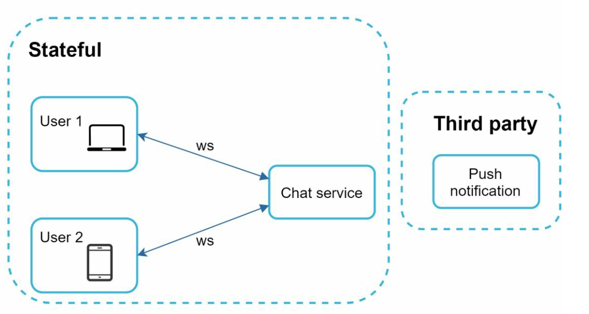

# 第 12 章：设计聊天系统

> 原章节：Design a Chat System · 原项目路径 `12. Chat System/`

## 本章导读

聊天系统是系统设计面试里出现频率最高的题目之一，也是最容易"讲得对但讲得浅"的题目。很多人能说出"用 WebSocket"，但答不上来：WebSocket 连接断了怎么办？消息怎么保证不丢？两个人同时发消息谁在前？群聊里"已读"状态怎么算？

这一章要解决的核心问题是：**如何设计一个支撑 5000 万日活的实时聊天系统，并且保证消息不丢、不重、不乱序。**

学完这一章，你应该能回答：为什么聊天服务器必须"有状态"，这是第 1 章"无状态"原则的例外吗？轮询、长轮询、WebSocket、SSE 各自适合什么场景？端到端加密为什么会让服务端搜索和内容审核变得不可能？"在线状态"这个看起来最简单的功能，为什么工程代价极高？

## 你将学到

- 四种通信协议（轮询 / 长轮询 / WebSocket / SSE）的完整对比与选型
- 为什么 WebSocket 必须配合服务发现或共享状态——以及它如何呼应第 1 章的"无状态"原则
- 消息可靠投递的三要素：客户端 ACK、离线消息存储、会话内有序性
- 多设备同步机制（`cur_max_message_id`）
- 在线状态（Presence）的工程代价：心跳频率、过期判定、广播风暴的量化
- 已读回执的实现与它的放大效应
- 端到端加密（E2EE）的基本原理，以及它对服务端能力的根本性限制

---

## 1. 需求与规模

### 功能需求

- **一对一聊天**
- **群聊**，单个群最多 100 人
- **在线状态指示**（在线 / 离线）
- **多设备支持**（手机 + 平板 + 桌面端同时在线）
- **推送通知**（用户离线时）

### 规模与约束

- **5000 万日活用户（DAU）**
- **消息永久保存**（chat history 永久留存）
- 单条消息最长 10 万字符
- 文本消息（媒体消息属于扩展项）

### 一个关键的规模数字：并发连接数

聊天系统和前面几章最大的不同在于：**它不是"请求-响应"模型，而是"长连接"模型。**

5000 万日活用户在高峰时段同时在线，意味着系统要**同时维持几千万个 TCP 连接**。这个数字决定了整个架构的形态。

我们来估算需要多少台聊天服务器：

| 单机承载连接数 | 需要的服务器数 | 说明 |
|---|---|---|
| 10 万 | 500 台 | 保守估计，未做深度调优 |
| 50 万 | 100 台 | 需要 epoll / IOCP 等事件驱动模型 |
| 100 万 | 50 台 | 需要 64 GB 以上内存 + 精心调优 |

> **单个连接要占用多少内存？** 大致包括：内核的 socket 收发缓冲区（默认几十 KB，可调小）、应用层的连接对象（用户 ID、会话状态、心跳时间戳等，通常 1–10 KB）。所以一个 64 GB 内存的服务器，理论上能扛 100 万个连接，但实际要留足余量。
>
> **这也是为什么聊天服务器的实现语言很关键**：用"一个连接一个线程"的模型（比如传统 Java Servlet）是不可能扛住百万连接的——100 万个线程光是栈空间就要几百 GB。必须用事件驱动（epoll / kqueue / IOCP）或协程模型，比如 Go 的 goroutine、Erlang/Elixir 的进程、Node.js 的事件循环。

**记住这个"几千万并发连接"的约束，本章后面的所有设计——有状态、心跳、广播风暴——都源于它。**

---

## 2. 通信协议：从轮询到 WebSocket

发送和接收是两个方向的问题，但**接收方向更难**：服务器怎么把消息"推"给客户端？

原笔记对比了三种方案，我们逐一展开，并补充第四种（SSE）。

### 2.1 轮询（Polling）

<div align="center"></div>

客户端每隔 N 秒问一次服务器："有新消息吗？"

- **优点**：实现最简单，任何 HTTP 客户端都能做，穿过任何防火墙。
- **缺点**：
  - **绝大多数请求是空转**。如果消息平均每分钟一条，而客户端每秒轮询一次，那 60 个请求里 59 个是浪费的。
  - **延迟高**。最坏情况下，消息要等一整个轮询周期才被看到（N 秒延迟）。
  - **服务器压力大**。5000 万用户 × 每秒 1 次 = 5000 万 QPS 的空请求——**这个数字本身就是灾难**。

**结论：轮询只适合"消息极少、延迟不敏感"的场景，比如每天早上拉一次系统公告。不能用于聊天。**

### 2.2 长轮询（Long Polling）

<div align="center"></div>

客户端发起请求，**服务器不立即返回，而是把这个连接挂起（hold）**，直到有消息或超时（比如 30 秒）才返回。客户端收到响应后，立刻再发一个新的长轮询请求。

- **优点**：延迟大幅降低（消息一到就返回），空请求大幅减少。
- **缺点**：
  - **服务器仍然要维持大量连接**——和 WebSocket 一样占资源，但**每次收到响应后都要重建连接**，产生额外的握手开销和"重连风暴"。
  - **仍然是半双工**。客户端发送消息还得另开一个 HTTP 请求。
  - **超时重连的瞬间是流量尖峰**。如果 100 万个客户端的长轮询都在同一秒超时，就会同时发起 100 万个新请求。
  - **对不活跃用户是浪费**：一个用户可能几小时没消息，但他仍然占着一个挂起的连接。

> **为什么原笔记说长轮询"对不活跃用户低效"？** 因为它没有区分"连接存在"和"有数据流动"。长轮询下，一个不活跃用户依然消耗一个服务器连接槽位，而且每 30 秒就要重新握手一次。相比之下，WebSocket 的连接是稳定的，重连频率低得多。

### 2.3 WebSocket（推荐方案）

<div align="center"></div>

WebSocket 在 HTTP 之上做一次**协议升级握手（Upgrade）**，之后这条 TCP 连接就变成**全双工（full-duplex）**的持久连接：客户端和服务器可以随时互相发消息。

- **优点**：
  - **真正的双向实时通信**，收发共用一个连接。
  - **每条消息的额外开销极小**。WebSocket 的帧头只有 2–14 字节；而一个 HTTP 请求光请求头就几百字节。在聊天这种"消息短、频率高"的场景里，这个差距是决定性的。
  - **连接稳定**，不需要频繁重连。
- **缺点**：
  - 需要客户端和服务器都支持（现代浏览器都支持）。
  - **中间设备（代理、企业防火墙）可能拦截或超时断开**，需要心跳维持。
  - **需要处理连接的有状态性**（这是下一节的主题）。

> **生产环境务必用 `wss://`（WebSocket over TLS），不要用 `ws://`。** 原笔记写的是"使用 WebSockets（ws）协议"，这在生产环境是不安全的——`ws://` 是明文的，消息内容、鉴权令牌全部裸奔。`wss://` 走 TLS，等价于 HTTPS。

### 2.4 补充：SSE（Server-Sent Events）

原笔记完全没提 SSE，但它是一个非常实用的选择。

**SSE 是"服务器单向推送给客户端"的协议，跑在普通 HTTP 之上。**

```http
GET /events HTTP/1.1
Accept: text/event-stream
```

服务器保持这个 HTTP 响应不结束，持续往里面写数据：

```
data: {"type":"message","from":"alice","text":"hi"}
data: {"type":"presence","user":"bob","status":"online"}
```

| 维度 | WebSocket | SSE |
|---|---|---|
| 方向 | 双向 | **单向**（服务器 → 客户端） |
| 协议 | 自定义帧协议（需 Upgrade） | **普通 HTTP**，`text/event-stream` |
| 自动重连 | 需自己实现 | **浏览器内置**（`Last-Event-ID` 断点续传） |
| 数据格式 | 二进制 / 文本 | **仅文本**（二进制需 Base64） |
| 代理 / 防火墙兼容性 | 可能被拦截 | **几乎无阻碍**（就是 HTTP） |
| 连接数限制 | 无特殊限制 | HTTP/1.1 下同域名最多 6 条（HTTP/2 下无此限制） |
| 适合场景 | 聊天、协同编辑、游戏 | **通知、信息流更新、股价行情、大模型流式输出** |

> **SSE 的适用场景**：如果你只需要"服务器推、客户端收"，SSE 比 WebSocket 更简单、更稳。
> - **大模型的流式输出**（ChatGPT 打字机效果）就是 SSE——这正是 2023 年以来 SSE 重新流行的原因。
> - **股票行情、体育比分、物流轨迹**：单向推送，SSE 足够。
> - **聊天系统能不能用 SSE？** 可以，但需要"**SSE 收 + HTTP POST 发**"的组合。这样做的代价是发送路径没有复用连接（每次发消息开一个 HTTP 请求），在高频聊天场景下不如 WebSocket。**所以聊天通常选 WebSocket；SSE 更适合单向推送的场景。**

### 2.5 协议选型总结

| 协议 | 实时性 | 服务器成本 | 实现复杂度 | 推荐场景 |
|---|---|---|---|---|
| 轮询 | 差（秒级） | 极高（大量空请求） | 极低 | 极低频、延迟不敏感 |
| 长轮询 | 中（近实时） | 高（挂起连接 + 频繁重连） | 低 | 兼容性受限、无法用 WebSocket 时 |
| **WebSocket** | **好（毫秒级）** | **中（稳定连接）** | **中** | **聊天、协同、游戏** |
| SSE | 好（毫秒级） | 中 | **低** | **单向推送：通知、行情、流式输出** |

**发送方向的选择**：原笔记说"发送端用 HTTP，利用持久连接提升效率"。这个说法在早期是对的（HTTP keep-alive 可以复用 TCP 连接），但**既然已经为接收建立了一条 WebSocket 连接，发送也走同一条连接是更自然的做法**——省掉一次握手、省掉一套鉴权逻辑，而且天然保证了"发送和接收在同一个会话上下文里"。实践中主流 IM 都是收发都走 WebSocket。

<div align="center"></div>

---

## 3. 有状态 vs 无状态：为什么聊天服务器必须"记住"连接

这是本章最重要的一个呼应点，也是第 1 章"无状态"原则的**一个正当例外**。

### 3.1 回顾第 1 章的原则

第 1 章说：**Web 层应该无状态**，把 session 外置到共享存储，这样任何一台服务器都能处理任何请求，加机器不需要迁移数据，还能自动伸缩。

那为什么聊天服务器是**有状态**的？

### 3.2 因为 WebSocket 连接本身就是状态

关键区别在这里：

- **HTTP 请求是"瞬时"的**：请求进来、处理、返回，连接就结束了。服务器不需要"记住"任何东西。
- **WebSocket 连接是"持久"的**：一条 TCP 连接在服务器上**长期存在**，对应一个内存里的连接对象。**这个连接对象就是状态。**

<div align="center"></div>

<div align="center"></div>

于是产生了一个具体问题：

> **用户 A 的消息，怎么送到用户 B 手里？**
>
> A 的消息到达的是 **Chat Server 1**（因为 A 的连接在 Server 1 上）。但 B 的连接可能在 **Chat Server 2** 上。**Server 1 必须想办法把消息转发给 Server 2。**

### 3.3 三种解法

**① 服务发现 + 直接转发（原笔记的方案）**

维护一张"用户 → 所在聊天服务器"的映射表。Server 1 查到"B 在 Server 2 上"，就把消息转发给 Server 2，Server 2 再通过 B 的连接推出去。

- 实现直观；
- 但需要一张**高可用、低延迟的映射表**（这就是原笔记用 ZooKeeper 的原因）；
- 服务器上下线时要及时更新映射，否则会转发到已死的节点。

**② 发布订阅（Pub/Sub，工业界更常用）**

每台聊天服务器**订阅**它所承载用户的频道。Server 1 收到 A 发给 B 的消息后，直接**发布**到 B 的频道（比如 Redis Pub/Sub 或 Kafka 的一个 topic），所有订阅了 B 的服务器都会收到——但只有真正持有 B 连接的那台会推送。

- 不需要维护"用户在哪台机器"的精确映射；
- 天然支持"一个用户在多台设备上"（多台服务器都订阅同一个用户）；
- 代价是引入了消息中间件，且**广播范围可能过大**（所有服务器都收到消息，但只有一台用得上）。

**③ 粘性会话（Sticky Session）**

在负载均衡器上做**一致性哈希**，把同一个用户总是路由到同一台服务器。

- 实现最简单，不用改应用代码；
- **但这是最不推荐的做法**，原因和第 1 章讲的一样：
  - **负载不均**：热门用户所在的服务器可能过载；
  - **服务器故障 = 用户掉线**：那台机器上的所有连接全部断开，用户要重连到别的机器，而重连后映射关系全变了；
  - **无法优雅扩缩容**：扩容时新机器分不到用户，缩容时要把用户"赶走"。

> **这就是第 1 章"无状态"原则的例外与它的边界。**
> - 第 1 章说"Web 层无状态"，指的是**业务处理层**：处理一个 HTTP 请求不需要任何前置状态。
> - 聊天服务器**必然有状态**，因为"保持连接"就是它的核心职责。
> - **但"有状态"不等于"放弃可扩展性"。** 正确的做法是：
>   - 让状态**尽可能小**（只存连接和会话上下文，不存业务数据）；
>   - 用**服务发现或 Pub/Sub**把"状态在哪"这件事外部化，让任何服务器都能找到任意用户；
>   - 支持**优雅下线（Graceful Shutdown）**：关闭前先通知客户端"我要下线了，请重连到别的服务器"，避免惊群；
>   - 用**抖动退避（Jittered Backoff）**处理重连风暴——如果一台服务器挂了，10 万个客户端同时重连会再次打垮集群。让每个客户端等待一个随机时间（比如 0–30 秒）再重连，能把尖峰摊平。

> **面试加分点**：如果你能主动说"聊天服务器的有状态是不可避免的，但我们可以把状态最小化，并用服务发现把状态位置外部化，从而保留水平扩展能力"，这个回答的层次就明显高于"用 WebSocket 就行了"。

---

## 4. 高层设计：组件与数据模型

### 4.1 组件划分

<div align="center"></div>

原笔记把服务分成两类，这个划分很重要：

**无状态服务（Stateless Services）**

- 处理注册、登录、用户资料管理；
- 集成服务发现，向客户端推荐"最合适的聊天服务器"；
- **可以随意增删，因为不持有连接。**

**有状态服务（Stateful Services）**

- **聊天服务器（Chat Server）**：维护持久的 WebSocket 连接，负责消息投递和同步；
- **在线状态服务器（Presence Server）**：管理在线 / 离线状态。

**其他组件**

- **API 服务器**：登录、注册、改资料等；
- **通知服务器**：用户离线时发推送（复用第 10 章的设计）；
- **KV 存储（Key-Value Store）**：存聊天记录。

### 4.2 为什么聊天记录用 KV 存储而不是关系型数据库

原笔记给了四条理由，都是站得住的：

1. **易于水平扩展**：KV 存储天生支持分片，加节点就能扩容。
2. **极低延迟**：KV 存储的读写通常是内存或 LSM-tree 顺序写，延迟远低于 B+ 树。
3. **关系型数据库处理"长尾数据"能力差**：当索引大到超过内存，随机访问（每次查询要走多次磁盘 IO）会变得非常昂贵。聊天记录正是典型的"数据量巨大、但每次只按主键查一小段"的场景。
4. **有成功案例**：Facebook Messenger 和 Discord 都用过这类存储。

> **补充一点具体背景**（原笔记没说，但很有说服力）：
> - **Facebook Messenger** 长期使用 **HBase**（一个基于 HDFS 的宽列存储，属于 KV 家族）来存储消息。
> - **Discord** 早期用 **Cassandra** 存消息，后来因为维护成本和延迟问题，**迁移到了 ScyllaDB**（一个 C++ 重写的、兼容 Cassandra 协议的高性能实现）。
>
> 这两个案例都印证了同一个结论：**聊天消息的访问模式（按会话查最近 N 条）非常适合宽列 / KV 存储，而不适合需要 JOIN 和复杂索引的关系型数据库。**

### 4.3 数据模型

原笔记给出的模型：

**一对一聊天**

```
message_id (PK) | channel_id | sender_id | content | created_at
```

**群聊**

```
(channel_id, message_id) (复合主键) | sender_id | content | created_at
```

<div align="center"></div>

<div align="center"></div>

> **这个复合主键的设计非常值得琢磨。** 为什么群聊要 `(channel_id, message_id)` 而不是只用 `message_id`？
>
> 因为在宽列存储（如 Cassandra / HBase）里，**主键的第一部分是分区键（Partition Key），决定数据落在哪个节点；后面的部分是排序键（Clustering Key），决定同一分区内的物理顺序。**
>
> - 用 `channel_id` 做分区键 → **同一个会话的所有消息都在同一个节点上，且物理上按 `message_id` 有序排列**。
> - 于是"取某个会话最近的 50 条消息"就变成了一次**顺序范围扫描**，而不是跨节点查询 + 排序。这是宽列存储性能的关键。
> - 而一对一聊天用 `message_id` 做主键，是因为一对一场景下 `channel_id` 可以由两个用户 ID 推导出来，且消息量相对可控。

### 4.4 消息 ID 的设计：全局唯一 vs 本地序号

原笔记提到：

> IDs can be generated using a global 64-bit sequence number generator like Snowflake. A better approach is to use local sequence number generator. Local means IDs are only unique within a group. The reason why local IDs work is that maintaining message sequence within one-on-one channel or a group channel is sufficient.

这段话**结论是对的，但表述容易让人误解**，需要澄清：

- **"排序只需要会话内有序"是对的。** 消息 A 和消息 B 谁先谁后，只在同一个会话里有意义。跨会话比较时间先后没有业务价值。
- **但"用本地序号"不等于"不需要全局唯一 ID"。** 你依然需要一个能跨系统引用的标识，用于：
  - 消息同步（客户端上报 `cur_max_message_id`）；
  - 推送通知的载荷；
  - 撤回、回复引用、举报；
  - 去重（防止重试导致重复入库）。

**实践中常见的做法是两者并存**：

| 字段 | 作用 | 生成方式 |
|---|---|---|
| `message_id` | **全局唯一标识** | Snowflake / ULID（64 位、大致按时间递增） |
| `seq` | **会话内序号** | 每个 `channel_id` 一个本地自增计数器 |

或者，如果只用本地序号，那么**主键必须是 `(channel_id, seq)` 的组合**——`(channel_id, seq)` 合起来就是全局唯一的。这正是原笔记群聊模型的设计。

> **Snowflake 是什么？** 一个 64 位的 ID 生成算法，结构是：`1 位符号 + 41 位时间戳（毫秒） + 10 位机器 ID + 12 位序列号`。
> - **全局唯一**：机器 ID 区分不同节点，序列号区分同一毫秒内的不同请求；
> - **大致有序**：高位是时间戳，所以生成的 ID 基本随时间递增，这对数据库索引非常友好（避免随机写入）。
> - **无中心协调**：每台机器自己就能生成，不需要请求一个中心服务（这也是它比"数据库自增 ID"更适合分布式的核心原因）。

---

## 5. 服务发现

<div align="center"></div>

服务发现（Service Discovery）的职责是：**根据地理位置、服务器容量等条件，给客户端推荐最合适的聊天服务器。**

原笔记用的是 **Apache ZooKeeper**：

- 它维护聊天服务器的注册表；
- 服务器上线时注册自己，下线时注销；
- 客户端通过它查询"我该连哪台服务器"。

**为什么"地理位置"很重要？** 因为 WebSocket 是长连接，**连接的物理距离直接决定了延迟**。北京的客户端连到北京机房，往返可能只要 5 毫秒；连到美西机房，往返要 150 毫秒以上。所以服务发现要优先推荐就近的服务器。

**为什么"服务器容量"也很重要？** 因为每台服务器的连接数是有限的（见第 1 节的估算）。如果某台服务器已经接近上限，就不应该再往它上面分配新连接。这叫**负载感知（Load-Aware）路由**。

> **补充：ZooKeeper 在现代架构里的定位**
> ZooKeeper 是一个**分布式协调服务**，擅长的是"配置管理、命名服务、分布式锁、Leader 选举"这类需要强一致性的场景。用它做服务发现是可以的（很多老系统这么做），但它比较重——需要自己维护一个 3 或 5 节点的 ZK 集群。
>
> 现代系统更常用：
> - **etcd / Consul**：轻量、原生支持服务发现和健康检查；
> - **Nacos**：国内常用，同时支持服务发现和配置中心；
> - **云厂商的服务注册中心**（如 Kubernetes 的 Service + Endpoint）；
> - **服务网格（Service Mesh）**：把服务发现下沉到 Sidecar。
>
> **面试时的建议**：说 ZooKeeper 不算错（原书就这么写的），但如果你补一句"现代实践中更常用 etcd / Consul / Nacos，ZooKeeper 更常见于 Leader 选举这类协调场景"，会显得你对技术演进有判断。

---

## 6. 消息流转：一对一与群聊

### 6.1 一对一聊天

<div align="center"></div>

1. **用户 A** 发消息给 **Chat Server 1**。
2. **Chat Server 1** 分配一个全局唯一的消息 ID，把消息**存入 KV 存储**。
3. **如果 B 在线**：消息被转发到 B 所在的 **Chat Server 2**，通过 B 的 WebSocket 连接推送出去。
4. **如果 B 离线**：发一条**推送通知**（复用第 10 章的通知系统），同时把消息留在 B 的离线消息箱里。

> **注意第 2 步的顺序**：**先持久化，再转发**。这个顺序不能颠倒。如果先转发再落库，一旦服务器在转发后、落库前崩溃，这条消息就永远消失了——A 以为发出去了，B 也收到了，但重新登录后消息不见了。

### 6.2 群聊

<div align="center"></div>

原笔记的方案是：**把消息复制到每个成员的收件箱（inbox / message sync queue）里。**

- **优点**：每个成员的收件箱是独立的、有序的，同步逻辑非常简单——"读自己的收件箱"就够了。
- **缺点**：**写放大**。一个 100 人的群，一条消息要写 100 份。群越大，成本越高。

**算一下量级**：假设平均每人每天在 5 个群里各发 10 条消息，群平均 20 人：

```
每人每天产生的收件箱写入 = 5 群 × 10 条 × 20 人 = 1,000 次
全站 = 50,000,000 × 1,000 = 500 亿次 / 天
平均 = 500 亿 / 86,400 ≈ 57,870 次 / 秒
峰值（3 倍）≈ 173,000 次 / 秒
```

**17 万次写入/秒**——这需要大量的分片，但还在可控范围内。**原笔记设定群聊上限 100 人，正是为了让这个放大倍数有上界。**

> **那么超过 100 人的"大群"怎么办？**
> 这是原笔记没覆盖的场景。像 Discord 的服务器、Telegram 的频道，成员可以达到几十万甚至上百万。这时候"复制到每个人的收件箱"完全不可行——一条消息要写 100 万份。
>
> **解法是切换成"拉模式"**（和第 11 章信息流的思路一致）：
> - 消息**只存一份**，挂在 `channel_id` 下；
> - 每个成员维护一个"已读到哪个 `seq`"的水位线（`last_read_seq`）；
> - 成员上线时，**主动拉取** `seq > last_read_seq` 的消息。
> - 这就是"**小群推、大群拉**"的混合策略，和"普通用户推、大 V 拉"是同一个工程思路。

### 6.3 消息同步（多设备）

<div align="center"></div>

一个用户可能同时在手机、平板、桌面端登录。**每台设备都要看到完整的消息历史，不能有缺口。**

原笔记的机制是：**每台设备维护一个变量 `cur_max_message_id`，记录这台设备已经收到的最大消息 ID。**

一条消息是"新消息"需要满足两个条件：

1. **接收者 ID 等于当前登录用户 ID**（这条消息是发给我的）；
2. **KV 存储里的消息 ID 大于该设备的 `cur_max_message_id`**（我还没收到过）。

设备上线或重连时，用这个水位线去拉取增量：

```
拉取条件：message_id > cur_max_message_id AND recipient_id = me
```

**为什么需要"每设备"而不是"每用户"一个水位线？** 因为不同设备的进度不同。手机可能一直在用，`cur_max_message_id` 是 1000；平板三天没开，还停在 800。如果共用一个水位线，平板就会漏掉 800–1000 之间的消息。

> **这个设计的优雅之处**：它把"同步"变成了一次**单调递增的游标扫描**，而不是"记录每台设备收到了哪些消息"（那会是一个巨大的状态集合）。**只要消息 ID 单调递增，同步逻辑就退化成一次范围查询。** 这也解释了为什么消息 ID 需要"大致有序"。

---

## 7. 消息可靠投递：ACK、离线消息与顺序

原笔记完全没有覆盖这一块，但它是聊天系统的核心难点。可靠投递要同时解决三个问题：**不丢、不重、不乱序。**

### 7.1 客户端 ACK：不丢不重

**问题**：客户端发了消息，怎么知道服务器收到了？服务器推了消息，怎么知道客户端收到了？

**答案：确认机制（ACK, Acknowledgement）。**

**发送方向（客户端 → 服务器）**：

1. 客户端生成一个**客户端消息 ID**（`client_msg_id`，通常是 UUID），连同消息内容一起发出。
2. 服务器**持久化**消息，然后返回一个 **ACK**，包含服务器分配的 `message_id` 和 `seq`。
3. 客户端收到 ACK 后，把消息标记为"已发送"。
4. **如果超时没收到 ACK**，客户端**用同一个 `client_msg_id` 重发**。
5. 服务器看到重复的 `client_msg_id`，**直接返回之前的 ACK，不重复入库**。

**这就是幂等（Idempotency）**：同一个操作执行多次，效果和执行一次相同。`client_msg_id` 就是幂等键。

**接收方向（服务器 → 客户端）**：

1. 服务器通过 WebSocket 推送消息。
2. 客户端收到后，**回一个 ACK**（包含 `message_id`）。
3. 服务器收到 ACK 后，才把这条消息从"待投递"状态移除。
4. **如果超时没收到 ACK**，服务器重推。

> **为什么两段都要 ACK？** 因为**发送方的"已发送"和接收方的"已收到"是两件不同的事**。
> - 服务器 ACK 给发送方，表示"我收下了，会负责送到"；
> - 接收方 ACK 给服务器，表示"我确实收到了"。
> 缺了任何一段，都会出现"以为送到了其实没送到"的盲区。

### 7.2 离线消息

**用户 B 离线时，消息去哪了？**

原笔记只说"发推送通知"，但**推送是不可靠的**（第 10 章已经讲过）。正确的做法是：

1. **消息持久化到 B 的离线消息箱**（offline inbox）；
2. **发一条推送通知**，提醒 B"你有新消息"；
3. **B 上线后**，通过 `cur_max_message_id` 水位线**拉取增量消息**。

**离线消息箱的设计要点**：

| 要点 | 说明 |
|---|---|
| **存储位置** | 独立于聊天记录。聊天记录是"按会话存"的（`channel_id` 分区），离线消息箱是"按用户存"的（`user_id` 分区）——因为"我有哪些未读"是一个用户维度的查询 |
| **TTL（过期时间）** | 通常设 30 天或更长。超过期限的消息不再保留在离线箱里（但仍在聊天记录里，用户打开会话时仍能看到） |
| **容量上限** | 如果离线箱堆积过多（比如用户半年没登录，加入了一个活跃的群），可以只保留最近 N 条，其余靠"打开会话时从聊天记录拉取" |
| **清理时机** | 用户读取后（水位线推进）就清理 |

> **这里有个和第 11 章信息流一致的思路**：**离线消息箱是"写扩散"的产物**——因为它要支持"我有哪些未读"这种用户维度的查询，所以必须按用户存一份。而**聊天记录是"读扩散"的**——按会话存一份，谁要看谁来读。**同一个系统里两种模式并存，各取所长。**

### 7.3 消息顺序

**问题**：A 连发两条消息"你好"、"在吗"，B 会不会先看到"在吗"？

**关键结论：聊天系统只需要保证"会话内有序"，不需要全局有序。**

原因：
- 跨会话的先后顺序没有业务意义（A 在一个群里发的消息和另一个群里发的消息，谁先谁后不重要）；
- 全局有序需要一个全局时钟或全局序列，这在分布式系统里极其昂贵（参见 Lamport 时钟、TrueTime 的复杂度）。

**实现方式**：

1. **服务器分配会话内序号**。收到消息后，服务器为这条消息分配该 `channel_id` 下的下一个 `seq`。**序号由服务器分配，不由客户端分配**——因为客户端的时钟不可信，两个客户端可能产生相同的序号。
2. **客户端按 `seq` 排序渲染**。收到的消息先放进缓冲区，按 `seq` 排序后再展示。
3. **乱序和缺口处理**：
   - 如果收到 `seq = 5`，但只到 `seq = 3`（缺 4），客户端**先缓存 5，等 4 到达后再一起渲染**（或者显示"正在接收消息…"）。
   - 如果长时间等不到 4，客户端主动向服务器请求补拉 `seq = 4` 的消息。
   - **不能跳过缺口直接显示**，否则用户看到的顺序就是错的。

> **一个容易被忽略的细节**：**消息 ID 和时间戳要分开看。**
> - **排序依据是 `seq`**（服务器分配的、严格单调递增的会话内序号）；
> - **展示依据是 `created_at`**（服务器收到消息的时间戳，用于显示"昨天 14:23"）。
> - 不要用客户端的时间戳排序——不同设备的时钟可能相差几分钟，会导致消息顺序错乱。

---

## 8. 在线状态（Presence）的工程代价

<div align="center"></div>

"显示谁在线"看起来是最简单的功能，实际上是**成本极高的功能之一**。原笔记提到了心跳和扇出模型，但没讲清代价。

### 8.1 心跳机制（Heartbeat）

<div align="center"></div>

**为什么需要心跳？** 因为 TCP 连接"看起来还在"不等于"对端还活着"。

比如用户的手机进了电梯、地铁、或者被系统杀掉了 App 进程——**这些情况下，服务器这一侧的 TCP 连接可能还处于 ESTABLISHED 状态**（这叫**半开连接 / Half-Open Connection**），服务器不知道对方已经走了。如果不主动探测，服务器会一直以为用户在线，并且持续往这个死连接上推消息。

**心跳的做法**：客户端每隔一段时间发一个小包（比如 `{"type":"ping"}`），服务器收到就更新"最后活跃时间"。如果**超过阈值（比如 2–3 个心跳周期）没收到心跳，就标记为离线**。

> **阈值的取舍**：
> - **太短**（比如 10 秒）：网络抖动就会误判用户离线，用户会看到"好友状态闪烁"；
> - **太长**（比如 5 分钟）：用户已经退出了，还显示"在线"5 分钟。
>
> 常见取值是 **30 秒心跳 + 90 秒超时**（即允许丢 2 次心跳）。

**心跳的成本有多大？**

```
心跳间隔 30 秒：5000 万 / 30 ≈ 167 万次心跳 / 秒
心跳间隔 60 秒：5000 万 / 60 ≈ 83 万次心跳 / 秒
```

**每秒 167 万次心跳**——这些请求虽然包很小，但仍然要占用服务器的 CPU、网络和事件循环。这是 Presence 服务的核心负载。

> **一个重要的优化**：**WebSocket 连接本身就是一个"活性信号"。** 当连接正常关闭时，服务器会立刻收到 TCP 的 FIN/RST，可以马上判定离线，**根本不需要心跳**。心跳真正要解决的只是"半开连接"这一种情况。
>
> 所以实践中会：**拉长心跳间隔**（60 秒甚至更长）、**开启 TCP keepalive**、并且在**移动端做智能心跳**（App 在前台时心跳密集，切到后台后大幅降低频率甚至暂停——因为后台被系统挂起后发不出心跳，靠推送唤醒）。

### 8.2 扇出模型与广播风暴

<div align="center"></div>

原笔记的扇出模型是：**每个好友对维护一个频道**（channel A-B、A-C、A-D），用户 A 的状态变化时，向所有好友频道发布一次事件。

> **原文自己指出："上述设计对小型用户群有效。"** 这句话是对的，但没量化。我们来算一下它在大规模下会怎样。

**假设**：
- 5000 万用户；
- 平均每个用户 150 个好友（社交网络的平均好友数大致在这个量级）；
- 每个用户每天上下线 10 次（切网络、切后台、锁屏都会触发）。

**好友对频道总数**：

```
5000 万 × 150 = 75 亿个频道
```

**每天产生的 Presence 事件数**：

```
5000 万 × 10 次状态变化 × 150 个好友 = 750 亿条消息 / 天
平均 = 750 亿 / 86,400 ≈ 86.8 万条 / 秒
峰值（3 倍）≈ 260 万条 / 秒
```

**每秒 86 万条、峰值 260 万条的 Presence 广播**——而这**只是为了显示一个小小的绿点**。这个成本是不可接受的。

**真实系统怎么做？** 核心思路是**"不要主动广播，按需拉取"**：

| 优化 | 做法 | 效果 |
|---|---|---|
| **按需拉取（Lazy Pull）** | 不主动维护 Presence，用户打开某个会话时，才去查询对方的在线状态 | 把广播变成单次查询，成本从 O(好友数) 降到 O(1) |
| **短 TTL 缓存** | 查询结果缓存 30 秒 | 同一对好友的反复查询只打一次后端 |
| **只推给"正在看"的人** | 只给"当前打开了这个会话窗口"的用户推 Presence 更新 | 大幅缩小扇出范围 |
| **批量 + 节流** | 把 N 秒内的状态变化合并成一次推送 | 减少"状态抖动"造成的无效广播 |
| **防抖（Debounce）** | 用户 3 秒内快速上下线，只广播最终状态 | 消除锁屏/切后台造成的抖动 |
| **近似状态** | 显示"5 分钟前活跃"而不是精确的实时状态 | 允许更大的缓存窗口，成本大幅下降 |

> **一句话总结 Presence 的设计哲学**：**它是一个"可以牺牲精确性换取成本"的功能。** 用户能容忍"好友状态延迟 30 秒"，但不能容忍"App 卡顿"。所以工程上永远选择"近似 + 拉取 + 缓存"，而不是"精确 + 广播"。

---

## 9. 已读回执（Read Receipt）

原笔记没提，但这是现代 IM 的标配功能，也是**一个典型的"看起来简单、实际有放大效应"的功能**。

### 9.1 基本流程

1. B 打开了和 A 的会话，看到了 A 的消息；
2. B 的客户端向服务器发送"已读回执"，内容是"我读到了消息 X"；
3. 服务器把这个回执转发给 A；
4. A 的客户端把对应的消息标记为"已读"（双勾变蓝）。

### 9.2 放大效应

**一对一聊天**：每收到一条消息，就要发一条回执。**消息量翻倍。**

**群聊**（100 人）：一条消息被 99 个人看到，就可能产生 99 条回执。

```
一个活跃的 100 人群，每天 1000 条消息
→ 回执量 = 1000 × 99 = 99,000 条 / 天
```

如果全站有 100 万个这样的群：

```
100 万 × 99,000 = 990 亿条回执 / 天
平均 ≈ 114,000 条 / 秒
```

**这是和消息本身同一量级的负载。**

### 9.3 工程上的优化

| 优化 | 说明 |
|---|---|
| **水位线（Watermark）而不是逐条** | 不要发"我读了消息 5"，而是发"我的已读水位是 5"（即 5 及之前的都读了）。这样连续读 10 条只发 1 次 |
| **批量 + 节流** | 把 1 秒内的多次已读合并成一次上报 |
| **大群不显示逐人已读** | 100 人群里显示"99 人都读了"没有意义。通常只显示"全部已读"或干脆不显示（WhatsApp 在群里只显示所有成员都读后的蓝勾） |
| **尊重隐私设置** | 用户关闭"已读回执"后，自己也不再看到别人的已读状态（**对等原则**，否则用户可以通过"别人能不能看到我已读"来推断） |
| **不要对机器人 / 系统消息发回执** | 无意义 |

> **一个产品层面的思考**：已读回执是一个**强社交压力的功能**。它把"你没回我"变成了可观测的事实，容易引发焦虑和冲突。很多 App 把它做成可关闭的开关，正是出于这个考虑。**系统设计不只是技术问题。**

---

## 10. 端到端加密（E2EE）

原笔记把"End-to-End Encryption: Ensure message privacy"放在 **Future Extensions** 里，和"支持图片视频"并列。**这是一个严重的低估**——E2EE 不是一个可以后加的功能开关，而是**一个会约束整个系统的架构决策**。

### 10.1 基本原理

**端到端加密的核心是：只有通信双方的设备能解密消息，服务器只能看到密文。**

主流实现是 **Signal 协议（Signal Protocol）**，被 WhatsApp、Signal、Google Messages（RCS）等采用。它由两部分组成：

**① X3DH（Extended Triple Diffie-Hellman）——建立初始密钥**

- 每个用户在服务器上**预先发布**一组公钥（身份公钥、签名预共享公钥、一次性预共享公钥）；
- 发送方 A 用这些公钥 + 自己的私钥，通过几次 Diffie-Hellman 密钥交换，**算出一个共享密钥**；
- **关键点：即使 B 离线，A 也能算出共享密钥并发出第一条消息**（因为用的是 B 预先上传的公钥）。这就是所谓**异步密钥协商**。

**② Double Ratchet（双棘轮）——持续更新密钥**

- **对称棘轮（Symmetric Ratchet）**：每发一条消息，就用 KDF（密钥派生函数）从当前密钥派生出下一个密钥。这样**每条消息用不同的密钥**。
  - 效果：**前向保密（Forward Secrecy）**——即使攻击者窃取了某一时刻的密钥，也**无法解密之前的消息**。
- **DH 棘轮（DH Ratchet）**：每当收到对方的新公钥，就再做一次 Diffie-Hellman 交换，刷新密钥链。
  - 效果：**后向保密 / 入侵恢复（Post-Compromise Security）**——即使密钥泄露，只要攻击者停止监听，后续消息会重新变得安全。

**用一个类比理解**：想象两个人各拿一本"一次性密码本"，每写一个字就撕掉一页（对称棘轮）；而且每隔一段时间，两人会通过一次公开的对话重新约定一本新密码本（DH 棘轮）。**撕掉的页无法复原（前向保密），重新约定的新本子让窃听者无法跟上（后向保密）。**

### 10.2 E2EE 对服务端能力的限制

这是最重要的部分：**E2EE 一旦启用，服务器能看到的信息就只剩下密文和元数据，很多功能做不了了。**

| 功能 | 非 E2EE（服务器可见明文） | E2EE（服务器只见密文） |
|---|---|---|
| **全文搜索** | 服务器建索引，跨设备搜索 | ❌ **不可行**。只能**在本地设备上搜**（WhatsApp 的搜索是本地索引）。换设备就搜不到旧消息，除非本地重建索引 |
| **内容审核 / 反垃圾** | 服务器扫描关键词、图片 | ❌ **不可行**。只能靠**用户举报** + **元数据启发式**（比如"这个账号一天加了 500 个人"） |
| **媒体转码 / 生成缩略图** | 服务器统一处理 | ❌ **不可行**。必须**客户端加密前处理**，服务器只存不透明的二进制块 |
| **服务端机器人 / 智能回复** | 服务器读消息后生成回复 | ❌ **不可行**，除非把机器人做成一个"参与方"，让它能解密 |
| **多设备同步** | 简单，服务器直接推明文 | ⚠️ **困难**。每台设备有独立的密钥，发送方要为**每台接收设备**单独加密一份 |
| **消息备份 / 迁移** | 服务器直接导出 | ⚠️ **困难**。要么用**用户口令派生的密钥**加密后上传（WhatsApp），要么依赖**平台密钥链**（iMessage 用 iCloud Keychain） |
| **元数据（谁和谁聊、何时、多频繁）** | 可见 | ✅ **依然可见**（E2EE 不保护元数据！） |

> **两个必须澄清的常见误解**：
>
> **① E2EE 保护内容，但不保护元数据。** 服务器仍然知道"用户 A 在 3 月 5 日 14:23 给用户 B 发了消息，大小 2KB，之后 B 在 14:25 回复了"。这些元数据本身就能泄露大量信息（社交图谱、作息规律、关系亲疏）。**要保护元数据，需要更激进的技术（如匿名通信网络），那会带来巨大的性能代价。**
>
> **② "有加密"不等于"端到端加密"。** Telegram 的**默认聊天（Cloud Chats）不是端到端加密**——它用的是客户端到服务器的加密，服务器能看到明文。只有手动开启的 **Secret Chats** 才是 E2EE。这是业内一个被广泛误解的点。

### 10.3 一个真实的工程矛盾

E2EE 把平台放到了一个两难位置：

- **用户隐私 vs 内容监管**：平台无法扫描 CSAM（儿童性虐待材料）或恐怖主义内容，而很多司法管辖区要求平台主动发现并上报。这是全球性的政策争议焦点。
- **典型折中**：WhatsApp 不做内容扫描，但**依赖用户举报**——用户举报某条消息后，客户端会把该消息（连同前后几条）**解密后上传**给平台审核。这是一个"隐私保护 + 事后审核"的折中方案。

> **面试时的正确态度**：如果你在面试里被问到"要不要做 E2EE"，**不要直接说"要，为了安全"**。正确的回答是：**"这取决于产品定位。如果要做 E2EE，就必须接受'没有服务端全文搜索、没有服务端内容审核、多设备同步变复杂'这几个代价，并且要在产品层面提前设计好替代方案。这是一个架构级决策，不能后加。"**

---

## 11. 扩展性、错误处理与未来扩展

### 11.1 扩展性

- **水平扩展**：用户增长就加服务器（聊天服务器、Presence 服务器）；
- **负载均衡**：流量均匀分布（配合服务发现做负载感知路由）；
- **缓存**：降低数据库压力、提升延迟。

### 11.2 错误处理

- **重试机制**：消息投递失败时重试 + 排队（注意：重试必须配合幂等键，见第 7.1 节）；
- **服务器故障**：用服务发现重新分配服务器。
  - **关键补充**：服务器故障时，**所有连接它的客户端会同时重连**（惊群 / Thundering Herd）。必须让客户端用**抖动退避**（比如等待 `random(0, 30)` 秒）重连，否则重连流量会把集群再打垮一次。
  - **优雅下线**：服务器主动关闭前，先通知客户端"我要下线了，请连接到 X 服务器"，让重连有序进行。

### 11.3 未来扩展（原笔记列出）

1. **媒体支持**（图片、视频）：需要客户端压缩 + 云存储（对象存储如 S3）+ CDN 分发。
2. **端到端加密**：见第 10 节。
3. **客户端缓存**：本地存最近的消息，减少数据传输、支持离线阅读。
4. **更快的加载**：用地理分布的缓存网络（CDN）加速媒体和静态资源。

---

## 勘误与补充

### 勘误 1：把 E2EE 列在"未来扩展"里严重低估了它的影响

- **原文说法**：Future Extensions 第 2 条 —— `End-to-End Encryption: Ensure message privacy.`
- **问题**：把 E2EE 和"支持图片视频"、"客户端缓存"并列，暗示它是一个**可以后加的功能**。实际上 **E2EE 是一个架构级决策**：一旦启用，服务端就**无法做全文搜索、无法做内容审核、无法做媒体转码**，多设备同步和备份也会变得复杂。这些能力如果一开始没有设计替代方案，后期补不上。
- **正确说法**：E2EE 必须在架构设计阶段就决定，并同步设计替代方案——本地搜索索引、用户举报机制、客户端媒体处理、口令派生的备份密钥。详见第 10 节。
- **延伸**：一个常被混淆的事实是 **Telegram 的默认聊天不是端到端加密**（Cloud Chats 用客户端到服务器加密），只有手动开启的 Secret Chats 才是 E2EE。判断一个产品是否真 E2EE，要看它的默认会话，而不是看它是否宣传了"加密"。

### 勘误 2：原笔记没有覆盖"消息可靠投递"，而这才是聊天系统的核心

- **原文说法**：全文只提了消息 ID、KV 存储、`cur_max_message_id` 同步，以及 Error Handling 里的"重试机制"。
- **问题**：**没有讲 ACK 机制、没有讲离线消息怎么存、没有讲消息顺序如何保证**。而这三件事（不丢、不重、不乱序）恰恰是聊天系统最难的部分。只讲"用 WebSocket 推消息"是远远不够的——WebSocket 只是通道，通道本身不保证可靠性。
- **正确说法**：见第 7 节。核心是——**发送方用 `client_msg_id` 做幂等键 + 服务器 ACK**；**接收方收到后回 ACK，超时重推**；**离线消息存用户维度的离线箱，配合推送唤醒，上线后用 `cur_max_message_id` 拉增量**；**顺序靠服务器分配的会话内 `seq` 保证，客户端按 `seq` 排序渲染并处理缺口**。

### 勘误 3：Presence 的扇出模型被低估了规模

- **原文说法**：`Presence updates are pushed to friends using a publish-subscribe model in which each friend pair maintains a channel.` 并承认"上述设计对小型用户群有效"。
- **问题**：承认了"对小型用户群有效"，但**没有量化它在大规模下有多糟**，也没有给出解法。实际上按 5000 万用户 × 150 好友计算，会产生 **75 亿个好友对频道**和**每秒约 87 万条 Presence 广播**——只为显示一个绿点。这个成本是不可接受的。
- **正确说法**：真实系统用**按需拉取 + 短 TTL 缓存 + 只推给正在看的人 + 防抖节流 + 近似状态**的组合，而不是全量广播。详见第 8.2 节。
- **延伸**：Presence 是"**可以牺牲精确性换成本**"的典型功能。用户能接受状态延迟 30 秒，不能接受 App 卡顿。

### 勘误 4：WebSocket 应该用 `wss://` 而不是 `ws://`

- **原文说法**：`Uses WebSockets (ws) protocol for sending and receiving messages.`
- **问题**：`ws://` 是**明文**的。生产环境用 `ws://` 意味着消息内容、鉴权令牌、用户 ID 全部以明文在网络上传输，可被中间人窃听或篡改。
- **正确说法**：生产环境必须使用 **`wss://`**（WebSocket over TLS），等价于 HTTP 的 HTTPS。原笔记写 `ws` 应该只是泛指"WebSocket 协议"，但字面上会误导初学者。
- **延伸**：同样的原则适用于所有长连接协议。另外要注意：TLS 终止通常发生在负载均衡器上，所以从 LB 到后端聊天服务器这一段是否需要再加密，取决于你的网络信任边界。

### 补充 1：SSE（Server-Sent Events）

原笔记对比了轮询 / 长轮询 / WebSocket，漏掉了 SSE。详见第 2.4 节。**核心要点**：SSE 是"服务器单向推送"的轻量方案，跑在普通 HTTP 上、浏览器自动重连、穿透防火墙能力强；适合通知、行情、大模型流式输出；**不适合需要客户端高频发送的聊天场景**（但可以用"SSE 收 + POST 发"组合）。

### 补充 2：WebSocket 与"无状态原则"的关系

原笔记给了有状态 / 无状态两张架构图，但没有解释**为什么聊天服务器必须是有状态的，以及它和第 1 章"无状态 Web 层"原则的关系**。详见第 3 节。**核心要点**：WebSocket 连接本身就是状态；有状态不等于放弃扩展性——要让状态最小化，用服务发现或 Pub/Sub 把"状态在哪"外部化，并支持优雅下线和抖动退避重连。

### 补充 3：已读回执

原笔记完全没提。详见第 9 节。**核心要点**：已读回执有放大效应（100 人群里一条消息可能产生 99 条回执），必须用**水位线 + 批量 + 节流**优化，大群通常不显示逐人已读；并且要遵守**对等原则**（你关闭已读回执，就也看不到别人的）。

### 补充 4：大群（超过 100 人）的消息投递

原笔记把群聊上限设为 100 人，避开了大群问题。但真实的"频道 / 服务器"场景（Discord、Telegram）成员可达几十万。详见第 6.2 节。**核心要点**：小群用**写扩散**（复制到每个成员收件箱），大群改用**读扩散**（消息只存一份，成员按 `last_read_seq` 水位线拉取）。这和第 11 章"普通用户推、大 V 拉"是同一个思路。

### 补充 5：ZooKeeper 的现代替代方案

原笔记用 ZooKeeper 做服务发现。详见第 5 节。**核心要点**：ZooKeeper 更擅长分布式协调（Leader 选举、分布式锁），做纯服务发现偏重；现代更常用 **etcd / Consul / Nacos** 或 Kubernetes 原生服务发现。

---

## 常见误区

| 误区 | 为什么错 | 正确理解 |
|---|---|---|
| 聊天系统用 WebSocket 就万事大吉 | WebSocket 只是通道，不保证消息不丢、不重、不乱序 | 通道之上必须有 **ACK + 幂等键 + 会话内序号 + 离线箱** |
| 聊天服务器应该像 Web 层一样无状态 | WebSocket 连接本身就是状态，服务器必须"记住"它 | 有状态不可避免；解法是**状态最小化 + 服务发现/Pub-Sub 外部化位置 + 优雅下线** |
| 用粘性会话（Sticky Session）把用户固定到一台机器最简单 | 负载不均、机器故障即掉线、无法自动扩缩容 | 粘性会话只适合临时方案；生产用服务发现或 Pub/Sub |
| 消息只需要全局唯一 ID 就能保证顺序 | 全局有序需要全局时钟，极其昂贵；且跨会话顺序没有业务意义 | 只需**会话内有序**；用服务器分配的 `seq`，客户端按 `seq` 排序渲染 |
| 客户端时间戳可以用来排序消息 | 不同设备时钟可能相差几分钟，会导致顺序错乱 | 排序用服务器的 `seq`，展示用服务器的 `created_at` |
| 服务器推消息成功了，用户就一定收到了 | 推送是 best-effort；且服务器无法区分"连接还在"和"对端已死" | 需要**接收方 ACK**；离线消息存离线箱，用 `cur_max_message_id` 拉增量 |
| 心跳越频繁，在线状态越准 | 30 秒心跳在 5000 万用户下就是 **167 万次/秒** 的负载 | 连接正常关闭时 TCP 会通知，不需要心跳；心跳只需覆盖"半开连接"，间隔可拉长到 60 秒甚至更久 |
| Presence 就是给所有好友广播状态变化 | 5000 万用户 × 150 好友 = 75 亿频道、87 万条/秒的广播，只为显示一个绿点 | 按需拉取 + 短 TTL 缓存 + 只推给正在看的人 + 防抖 |
| 端到端加密是个可以后加的功能 | E2EE 一旦启用，服务端就做不了搜索、审核、转码、机器人 | 必须在架构阶段决策，并同步设计替代方案（本地搜索、举报机制、客户端处理） |
| E2EE 能保护一切隐私 | E2EE 只保护**内容**，**元数据**（谁和谁聊、何时、多频繁）服务器依然可见 | 元数据保护需要匿名通信网络，代价巨大 |
| 群聊就是"把消息复制给每个人"，永远如此 | 100 人以内可行，几十万人的频道写放大无法承受 | 小群写扩散，大群读扩散（按 `last_read_seq` 拉取） |
| 服务器挂了让客户端立刻重连就行 | 一台服务器上的几十万客户端同时重连会打垮集群（惊群） | 客户端用**抖动退避**重连；服务器**优雅下线**先通知再关闭 |

---

## 面试速记

- **一句话概括**：聊天系统是一个**以"有状态的长连接"为基础、以"至少一次投递 + 幂等 + 会话内有序"为可靠性保证**的实时系统，难点在于连接管理、可靠投递和 Presence 的成本控制。

- **必答要点**：
  1. **协议选型**：WebSocket（全双工、低开销）是聊天首选；SSE 适合单向推送；长轮询是兼容性兜底。
  2. **有状态是本质**：WebSocket 连接就是状态。用**服务发现（用户 → 服务器映射）或 Pub/Sub**把"状态在哪"外部化，从而保留水平扩展能力。
  3. **可靠投递三件套**：发送方用 `client_msg_id` 做幂等键 + 服务器 ACK；接收方 ACK + 超时重推；离线消息存用户维度的离线箱，上线用 `cur_max_message_id` 拉增量。
  4. **顺序只需会话内**：服务器分配会话内 `seq`，客户端按 `seq` 排序渲染并处理缺口。
  5. **数据模型**：聊天记录用 KV / 宽列存储；群聊主键用 `(channel_id, message_id)`，让"取最近 N 条"变成一次范围扫描。

- **加分项**：
  1. 主动把"聊天服务器有状态"和第 1 章的"无状态原则"对照，说明它是**正当例外**以及如何保留扩展性。
  2. 主动给出 **Presence 的量化成本**（75 亿频道、87 万条/秒），并提出按需拉取。
  3. 主动指出 **E2EE 会破坏服务端搜索与内容审核**，并说明它是架构级决策。
  4. 主动提出**大群用读扩散**（小群推、大群拉），呼应第 11 章的推拉结合。
  5. 主动提到**惊群问题**和**抖动退避重连**、**优雅下线**。
  6. 主动提到**已读回执的放大效应**和水位线优化。

- **高频追问**：
  1. *"WebSocket 连接怎么在服务器之间路由消息？"*
     → 三种方式：服务发现维护 `user_id → server` 映射后直接转发；Pub/Sub（每台服务器订阅自己承载的用户，消息广播到订阅者）；粘性会话（不推荐）。生产多用 Pub/Sub 或服务发现 + 负载感知路由。
  2. *"消息怎么保证不丢？"*
     → 发送侧：`client_msg_id` 幂等键 + 服务器 ACK + 超时重发；服务器侧：先持久化再转发；接收侧：接收方 ACK + 超时重推；离线侧：离线消息箱 + 推送唤醒 + `cur_max_message_id` 拉增量。
  3. *"两个人同时发消息，谁在前？"*
     → 由服务器分配会话内 `seq` 决定，不由客户端时钟决定。客户端按 `seq` 渲染，遇到缺口先缓存并补拉，不跳过。
  4. *"在线状态怎么实现？成本多大？"*
     → 心跳（建议 60 秒 + 超时 90 秒）+ TCP keepalive 覆盖半开连接；不主动全量广播，改成按需拉取 + 短 TTL 缓存 + 只推给正在看会话的人 + 防抖。量化：全量广播在 5000 万用户下约 87 万条/秒，不可接受。
  5. *"如果要加端到端加密，架构上要改什么？"*
     → 服务端只存密文；搜索改为客户端本地索引；内容审核改为用户举报 + 元数据启发式；媒体在客户端加密前处理；多设备要每台设备单独加密；备份用口令派生密钥。这些都要在架构阶段一并设计。

---

## 延伸阅读

- [ByteByteGo 系统设计面试课程](https://bytebytego.com/courses/system-design-interview) — 原笔记的来源
- [MDN：WebSocket API](https://developer.mozilla.org/en-US/docs/Web/API/WebSockets_API) — 协议细节与浏览器实现
- [MDN：Server-Sent Events](https://developer.mozilla.org/en-US/docs/Web/API/Server-sent_events) — SSE 规范与用法
- [Signal 协议规范](https://signal.org/docs/) — X3DH 与 Double Ratchet 的官方文档
- [Discord：How Discord Stores Billions of Messages](https://discord.com/blog/how-discord-stores-billions-of-messages) — Cassandra 到 ScyllaDB 的迁移实录
- [Facebook Engineering：Messenger 与 HBase](https://engineering.fb.com/) — 大规模消息存储的工业实践
- [ZooKeeper 官方文档](https://zookeeper.apache.org/doc/current/) — 分布式协调服务
