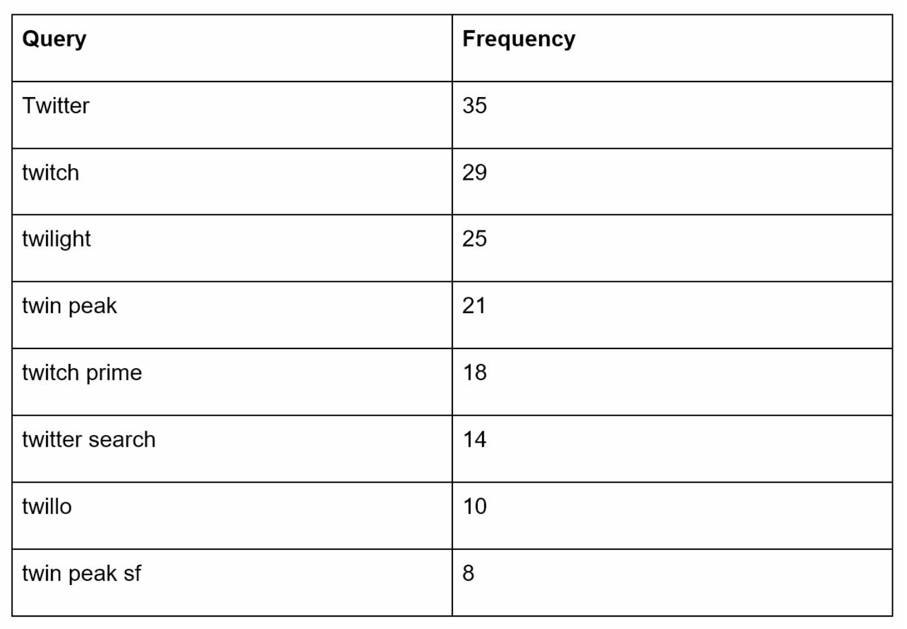
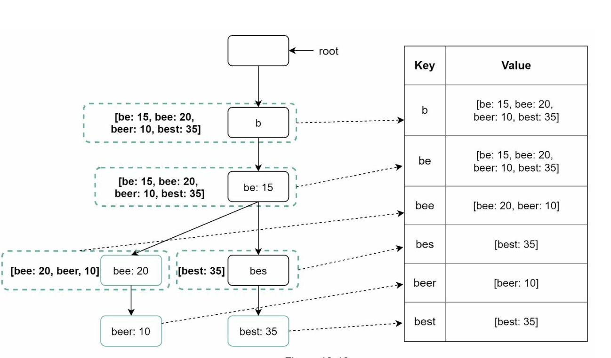

# 第 13 章：设计搜索自动补全系统

> 原章节：Design a Search Autocomplete System · 原项目路径 `13. Search Autocomplete/`

## 本章导读

你在搜索框里敲下 "t"，还没敲第二个字母，下拉框里就已经列出了 "taobao"、"twitter"、"天气"。这个功能叫自动补全（Autocomplete），也叫即时搜索（Typeahead）或增量搜索（Incremental Search）。

它看起来是个"小功能"，但它有一个非常苛刻的约束：**每一次按键都要触发一次查询，而且必须在 100 毫秒内返回结果。** 当你每天有 1000 万用户在搜索框里敲字时，这意味着每秒几万次的请求，全部要打在一个能在毫秒级返回"最热门的 5 条建议"的系统上。

这一章要解决的核心问题是：**如何用前缀树（Trie）在内存里存下上亿条查询，并让每一次按键都能在 100 毫秒内拿到 Top-K 结果？**

学完这一章，你应该能回答：为什么必须在 Trie 的每个节点上缓存 Top-K？一个 Trie 怎么塞进内存？"刚刚火起来的搜索词"怎么能几分钟内出现在补全里，而不是等一天？个性化推荐和用户隐私为什么天然冲突？

## 你将学到

- 自动补全系统的两个核心服务：数据采集（Data Gathering）与查询（Query）
- **Trie（前缀树）**的原理，以及**在每个节点缓存 Top-K 结果**这一关键优化
- 存储优化：双数组 Trie、前缀压缩、序列化 + 内存映射（mmap）
- 从批处理到流式：如何让热搜词在几分钟内出现（双层 Trie / Lambda 架构）
- 分片策略与负载均衡
- 个性化与隐私的冲突及其设计原则

---

## 1. 需求与规模

### 功能需求

原笔记给出的约束：

- 最多返回 **5 条**自动补全结果；
- 按**查询热度（频率）**排序；
- 只支持**小写英文字母**；
- 响应时间 **< 100 毫秒**，且系统可扩展。

### 规模估算

原笔记给出了三个数字，但**没有给出推导过程**。我们把它算一遍——因为这三个数字决定了整个架构。

**① QPS 是怎么来的？**

```
假设：
  日活用户（DAU）= 10,000,000
  每人每天搜索次数 ≈ 10 次
  每次搜索平均敲 ≈ 20 个字符
  → 每一次按键都触发一次补全请求

日请求量 = 10,000,000 × 10 × 20 = 2,000,000,000（20 亿次）
平均 QPS = 2,000,000,000 / 86,400 ≈ 23,148
峰值 QPS = 23,148 × 2 ≈ 46,296 ≈ 48,000
```

> **为什么"每次按键都请求一次"是合理的假设？**
> 因为这是自动补全的**用户体验要求**。如果只在用户停下打字 300 毫秒后才请求（这叫**防抖 / Debounce**），那响应会显得迟钝。真实系统通常是"防抖 + 立即请求"的混合策略：用户快速连续输入时防抖，停顿后立即发请求。所以量级估算按"每次按键一次请求"是合理的上界。
>
> **注意峰值倍数只有 2 倍**——这和其他系统（常用 3 倍）不同。原因是**搜索行为本身就分散在全天**，不像电商下单那样集中在几个时间点。

**② 存储增长**

原笔记说每天新增 **0.4 GB** 查询数据。我们来算一下长期累积：

```
一年 = 0.4 GB × 365 = 146 GB
十年 = 0.4 GB × 365 × 10 = 1,460 GB ≈ 1.46 TB
```

**1.46 TB 的原始查询日志**——如果全量塞进内存，成本无法接受。所以**必须裁剪（Pruning）**：

> 关键洞察：**只有热门的查询才值得出现在补全建议里。** 一个只被搜过一次的冷门查询，永远不会有人看到它的建议。
>
> 所以：**只保留 Top 1 亿条热门查询**。假设每条查询平均 50 字节：
>
> ```
> 100,000,000 × 50 字节 = 5,000,000,000 字节 ≈ 5 GB
> ```
>
> **5 GB**——这就完全可以放进几台机器的内存里了。**从 1.46 TB 压到 5 GB，靠的就是"只留 Top-K"这一条裁剪规则。** 这是本章最重要的设计思想之一，后面 Trie 的节点 Top-K 缓存也是同一个思路的延伸。

**③ 高可用**

系统不能因为故障而停机（原笔记的 "High Availability" 要求）。这意味着 Trie 要有副本，查询服务要能容灾。

---

## 2. 高层设计：两个服务

系统可以拆成两个相对独立的服务：

**① 数据采集服务（Data Gathering Service）**

- 收集用户查询，聚合成频率数据；
- 负责构建 Trie。

**② 查询服务（Query Service）**

- 根据用户输入的前缀，返回 Top-K 建议。

原笔记有一句很诚实的说明：

> Real-time processing is not practical for large data sets; however, it is a good starting point.

意思是"大数据集下实时处理不现实，但作为起点是可以的"。**这句话的结论是对的（实时全量重建 Trie 不可行），但表述有点绝对**——现代系统通过"双层 Trie"做到了准实时。这个我们放到第 8 节详细讲。

### 2.1 数据采集服务

<div align="center"></div>

- 从**分析日志（Analytics Logs）**里聚合查询数据，更新**频率表（Frequency Table）**；
- 定期（原笔记说每周）处理历史数据，构建 Trie。

### 2.2 查询服务

<div align="center"></div>

<div align="center"></div>

- 使用数据采集服务产出的频率表；
- 根据用户输入，从 Trie 里取出 Top-K 建议；
- 用缓存和高效数据结构优化查询速度。

比如用户输入 `tw`，系统返回：

| 排名 | 查询 | 频率 |
|---|---|---|
| 1 | twitter | 1,000,000 |
| 2 | twitch | 800,000 |
| 3 | twilio | 500,000 |
| 4 | twitch tv | 300,000 |
| 5 | twenty one pilots | 200,000 |

> **这里有一个隐含的要求**：返回的必须是**按频率降序排列的前 5 名**，而不是"前 5 个匹配的"。这意味着系统不能只是"找到所有以 `tw` 开头的查询"，还必须**排序**。如果每次查询都要遍历整个子树再排序，性能会很差——**这正是"节点缓存 Top-K"要解决的问题**（见第 4.2 节）。

---

## 3. 深入设计：Trie（前缀树）

### 3.1 Trie 是什么

**Trie（前缀树 / 字典树）**是一棵**树形数据结构**，用来高效地存储和检索字符串。

它的核心思想是：**把字符串的公共前缀合并到同一条路径上。**

假设要存 `tree`、`try`、`true` 三个词：

```
        (root)
          |
          t
          |
          r
         / \
        e   y  ← "try" 结束
        |
        e
        |
        e  ← "tree" 结束
        |
        u
        |
        e  ← "true" 结束
```

可以看到：`tr` 这个前缀只存了一次，三个词共享它。

**Trie 的两个关键特性**（原笔记提到的）：

1. **紧凑存储（Compact Storage）**：分层表示前缀，最大程度减少冗余。存 N 个词的总节点数，远小于所有词的字符数之和。
2. **频率信息（Frequency Information）**：可以在节点上存储查询的热度。

<div align="center"></div>

### 3.2 关键优化：在每个节点缓存 Top-K

原笔记提到了这一点，但只有一句话：

> Cache top-k queries at each node to speed up retrieval and avoid traversing the whole trie.

**这一句话是整个系统的性能关键，必须展开讲透。**

**先看"不缓存"会怎样。**

用户输入 `t`，你要返回以 `t` 开头的 Top 5 查询。朴素做法是：

1. 走到 `t` 节点；
2. **遍历 `t` 的整个子树**，收集所有以 `t` 开头的查询；
3. 按频率排序，取前 5 个。

问题在于：**以 `t` 开头的查询可能有上千万条。** 遍历这个子树要访问上千万个节点，耗时可能是几百毫秒甚至几秒——**远超 100 毫秒的预算**。

而且更糟的是：**这个成本是"每敲一个字母就要付一次"**。用户输入 `twitter` 的 7 个字母，就要做 7 次这样的遍历。

**缓存 Top-K 的做法。**

在**每个节点上**预先存好"以该节点为前缀的 Top-K 查询"：

```
节点 't'  →  [twitter, twitch, twilio, taobao, tumblr]
节点 'tw' →  [twitter, twitch, twilio, twitch tv, twenty one pilots]
节点 'twi'→  [twitter, twitch, twilio, twitch tv, twitch prime]
```

于是查询变成了：

1. 沿着前缀走到目标节点（`t` → `w`，共 2 步）；
2. **直接读出该节点缓存的 Top-5 列表**，返回。

**复杂度从"遍历子树 + 排序"（O(子树大小)）降到"走前缀长度 + 读 K 条"（O(前缀长度 + K)）。** 对于 `tw` 这个前缀，就是 2 步 + 读 5 条——**微秒级**。

<div align="center"></div>

**代价是什么？内存。**

```
Top-K 缓存内存 ≈ 节点数 × K × 每条记录的字节数
```

粗略估算：假设压缩后的 Trie 有约 1 亿个节点，K = 5，每条记录存一个 4 字节的查询 ID：

```
100,000,000 × 5 × 4 字节 = 2,000,000,000 字节 ≈ 2 GB
```

**仅仅是 Top-K 缓存就要 2 GB**，再加上树结构本身（每个节点要有子节点指针、字符等），总内存可能到 5–10 GB。

**这就是为什么必须做存储优化（第 5 节）和分片（第 7 节）。**

> **一个实用技巧：不是每个节点都值得缓存。**
> - **浅层节点**（`a`、`b`、`t`）被查询的频率极高，**必须缓存**；
> - **深层节点**（比如 `twitterscriptsyntax` 的第 15 层）可能一个月都没人查到，**缓存它纯属浪费内存**。
> - 优化做法：只给"访问频率超过阈值"或"深度小于某个值"的节点建缓存。也可以按访问频率动态决定（类似缓存的 LRU 思想）。

### 3.3 Trie 的三种操作

原笔记把 Trie 的操作分成创建、更新、删除：

**① 创建（Create）**

- 定期（原笔记说每周）用聚合后的查询数据构建；
- 数据来源是分析日志或数据库。

**② 更新（Update）**

- 原笔记说"很少实时更新，每周替换旧数据"。

> **这个说法在今天是过时的**——现代系统通过流式管道 + 双层 Trie 做到了准实时更新。详见第 8 节。

**③ 删除（Delete）**

<div align="center"></div>

- 用**过滤层（Filter Layer）**移除不想要的或有害的建议（比如仇恨言论、色情内容、侵权内容）；
- **过滤层的价值在于灵活性**：可以根据不同的规则动态调整，不需要重建整个 Trie；
- 不想要的建议会**异步地**从数据库中物理删除。

> **为什么要有"过滤层"而不是直接改 Trie？**
> 因为 Trie 是**批量构建、只读**的（每构建一次成本很高）。如果每次要删一个词就改 Trie，代价太大。所以做法是：
> - Trie 保持不动；
> - 维护一个**黑名单（Blocklist）**，查询时过滤掉黑名单里的词；
> - 定期重建 Trie 时，才把这些词物理移除。
>
> **但这里有一个坑**：如果 Trie 节点上缓存的是 Top-5，而其中 2 个被黑名单过滤了，你只能返回 3 条——**用户看到的建议数量不足**。
>
> **解法是"超额取（Over-fetch）"**：节点上缓存 **Top-(K + F)**，其中 F 是预估的过滤比例。查询时取 K+F 条，过滤掉黑名单里的，再返回前 K 条。F 的大小要根据历史过滤率动态调整。

---

## 4. 查询处理流程

把前面的设计串起来，一次查询的完整流程是：

1. **前缀查找（Prefix Search）**
   - 从 Trie 根节点开始，沿着用户输入的每个字符往下走，定位到前缀节点。
   - 如果中途走不通（前缀不存在），直接返回空结果。

2. **取 Top-K**
   - **如果节点有 Top-K 缓存**：直接读取，O(1)。
   - **如果没有缓存**：遍历子树收集候选，排序后取前 K（这个路径很慢，所以要尽量避免）。

3. **过滤与超额取**
   - 对候选应用过滤规则（黑名单、敏感词、合规要求）；
   - 因为过滤会减少结果数，所以要超额取 K+F 条。

4. **组装响应**
   - 返回结果，通常包含建议文本、以及可选的元数据（比如是否是个"实体"、跳转链接）。

> **原笔记在"查询处理流程"这一节写的是"遍历子树收集有效建议"，而在"优化"一节写的是"缓存 Top-K 避免遍历"——这两处是矛盾的。** 正确流程是：**优先走 Top-K 缓存，遍历子树只作为兜底。** 详见文末勘误 1。

---

## 5. 存储优化：如何把 Trie 塞进内存

原笔记完全没有涉及这一块，但它是自动补全系统的**工程核心**——Trie 能不能放进内存，直接决定了系统的成本和延迟。

### 5.1 优化一：双数组 Trie（Double-Array Trie）

**问题**：朴素的 Trie 用指针连接节点。在 64 位系统上，一个指针就是 8 字节；一个节点如果有多个子节点，还要用数组或哈希表存子节点——**指针的开销比数据本身还大**，而且**指针跳转对 CPU 缓存极不友好**（每次跳转都可能是一次缓存未命中）。

**双数组 Trie 的解法**：用**两个整数数组** `base[]` 和 `check[]` 表示整棵树，完全不用指针。

**状态转移规则**：

```
从状态 s 出发，读入字符 c，到达下一个状态 t：

    t = base[s] + c

如果 check[t] == s，则 t 是合法状态；
否则说明这条转移不存在。
```

**为什么这样设计？**

- **O(1) 转移**：一次加法 + 一次数组访问，没有指针追踪。
- **内存紧凑**：两个 `int` 数组，每个节点只占 8 字节（相比指针 + 哈希表的几十字节，节省数倍）。
- **缓存友好**：数组是连续内存，CPU 预取器能有效工作。

**代价**：

- **构建困难**。要在两个数组里"塞"下所有节点，同时保证 `base[s] + c` 不冲突，这是一个约束满足问题，构建算法相当复杂（经典算法是 Aho-Corasick 和 Darts 的实现）。
- **不适合频繁动态插入**。构建是一次性的离线过程，正好符合"Trie 定期重建"的需求。

> **工业界的实际使用**：双数组 Trie 被广泛用于中日文分词器（如 MeCab、HanLP）、输入法词库、以及一些搜索引擎的词表实现。**它的前提是"词典相对静态、查询极频繁"——这正是自动补全的场景。**

### 5.2 优化二：前缀压缩（Path Compression / Radix Tree）

**问题**：Trie 里有很多"独生子节点链"。比如 `unbelievable` 这个词，从 `u` 到结尾有 12 层，每层只有一个子节点——**这些节点除了"往下走"没有任何信息量**，白白占用 11 个节点的空间。

**前缀压缩的解法**：**把只有一个子节点的连续链，合并成一条边，边上标注整段字符串。**

```
压缩前：                     压缩后：
  u                            u
  |                            |
  n                       "nbelievable"
  |                     ← 一条边，标签是整段字符串
  b
  |
  e
  ...
```

**效果**：

- **节点数大幅减少**。对于自然语言词表，通常能减少 50%–90% 的节点。
- **查询深度降低**，但每次比较的是字符串而不是单个字符（需要字符串比较）。

**代价**：实现更复杂；插入和删除时要处理边的分裂（split）和合并。

> **这就是"压缩前缀树（Compressed Trie）"或"基数树（Radix Tree）"**。Redis 的 Stream 内部就用基数树存消息 ID；Lucene 的 **FST（Finite State Transducer，有限状态转换器）**是它的进一步推广（不仅压缩前缀，还压缩后缀，能共享公共后缀）。

### 5.3 优化三：序列化 + 内存映射（mmap）

**问题**：Trie 可能有好几 GB。如果每个查询服务进程都在自己堆内存里重建一份，会：

- **启动慢**：构建一次要几分钟到几十分钟；
- **内存浪费**：10 个进程就占 10 份内存；
- **GC 压力大**：几 GB 的堆对象会让 GC 停顿变得不可接受。

**解法**：**离线构建 → 序列化成扁平文件 → 查询服务用 mmap 映射进来。**

流程：

```
批量任务构建 Trie
   ↓
序列化为无指针的扁平文件（用偏移量代替指针）
   ↓
存入对象存储 / 本地磁盘
   ↓
查询服务 mmap 映射（不拷贝，直接读）
```

**为什么 mmap 这么好用？**

| 好处 | 说明 |
|---|---|
| **进程间共享物理内存** | 10 个进程 mmap 同一个文件，操作系统只保留**一份物理内存**（页缓存），全部共享 |
| **按需加载** | 只有被访问到的页才会从磁盘读入内存。冷门的子树永远不占内存 |
| **启动瞬时** | 不需要解析和构建，映射即可用 |
| **无 GC 压力** | 数据在堆外，GC 完全不感知 |

**一个必须满足的前提**：**序列化后的结构必须"无指针"**。因为 mmap 的虚拟地址在不同进程、不同次启动时是不一样的，所以不能用绝对指针，只能用**相对于文件起始位置的偏移量（offset）**。

> **这不是什么冷门技巧**——**Lucene 的 FST 就是这么做的**：把词表（term dictionary）构建成 FST，序列化到索引文件，查询时 mmap 进来。这是搜索引擎的标准做法。**你的 Trie 完全可以照搬这个思路。**

### 5.4 优化四：KV 存储方案（原笔记提到，但要说清代价）

原笔记提到另一种存储方案：

> Key-Value Store: Maps prefixes to node data for fast access. Every prefix in the trie is mapped to a key in a hash table.

也就是：**把所有前缀都作为 key 存进一个 KV 存储（比如 Redis）**，value 是节点数据。

<div align="center"></div>

**优点**：

- **实现简单**：不用自己写数据结构，直接用现成的 KV 存储（Redis、RocksDB）；
- **天然可扩展**：KV 存储自带分片能力。

**代价（原笔记没说）**：

| 代价 | 说明 |
|---|---|
| **失去前缀共享** | Trie 的核心优势是"`tr` 只存一次"。而 KV 方案里，`t`、`tr`、`tre`、`tree` 是**四个独立的 key**。存储量会膨胀到 Trie 的数倍 |
| **每次查询一次网络往返** | 走 Trie 是本地内存操作（微秒级）；查 KV 是**网络调用**（毫秒级）。用户敲 7 个字母就是 7 次网络往返，100 毫秒预算很紧张 |
| **KV 存储本身也要分片** | 分片后，"前缀在哪一片"又成了新问题 |

**所以正确的定位是**：

- **KV 方案适合"查询量不大、想快速上线"的场景**（工程成本低）；
- **自建 Trie + mmap 适合"查询量极大、对延迟和成本敏感"的场景**（工程成本高，但性能最优）。

**这不是"哪个更好"的问题，而是"在什么规模下选哪个"的问题。**

---

## 6. 数据采集管道

原笔记在高层设计里假设"用户每次搜索就实时更新数据"，然后指出这不实际：

> Users may enter billions of queries per day. Updating the trie on every query is not feasible.
> Top suggestions may not change much once the trie is built.

这两条理由都成立。**注意第二条**：一旦 Trie 建好，Top 建议**短期内不会有大的变化**——今天的 "twitter" 和昨天的 "twitter" 都在第一名。所以**不需要每次查询都更新**。

### 6.1 更新后的设计（批处理管道）

<div align="center"></div>

原笔记的管道有四个环节：

**① 分析日志（Analytics Logs）**

- 存储原始查询数据，供后续聚合；
- **日志是追加写的（append-only）、不建索引**——这是关键。因为日志只需要顺序写入和批量读取，不建索引能极大提升写入吞吐（呼应第 1 章讲的"顺序写比随机写快几个数量级"）。

**② 聚合器（Aggregators）**

- 把日志处理成**频率表（Frequency Table）**，供构建 Trie 使用；
- **聚合频率取决于业务**：Twitter 这种实时性要求高的场景，聚合间隔要短；普通场景每周一次就够。

**③ Worker**

- 异步服务，负责重建 Trie 并存入持久化存储。

**④ 存储（Storage）**

- **Trie 缓存（Trie Cache）**：分布式缓存，把 Trie 放在内存里供快速读取；
- **Trie 数据库（Trie DB）**：
  - **文档存储（如 MongoDB）**：因为 Trie 每周重建一次，可以定期对它做**快照（snapshot）**，序列化后存进数据库；
  - **KV 存储**：前缀 → 节点数据的映射（见第 5.4 节）。

> **这套管道的延迟是"小时级到天级"的**：日志写入 → 定期聚合 → 重建 Trie → 发布。如果每周重建一次，一个新出现的热搜词可能要**等上一周**才能出现在补全里。这在今天的产品标准下是不可接受的（想象一下"某地突发地震"这种词要等一周才出现）。
> **第 8 节会讲怎么把它压缩到分钟级。**

---

## 7. 扩展性：分片与负载均衡

<div align="center"></div>

一个 Trie 可能有几 GB 到几十 GB，单机放不下、也扛不住 48,000 QPS。所以要**分片（Sharding）**。

### 7.1 按前缀范围分片

原笔记的方案是：**按前缀的首字母范围分片**：

```
分片 1：a – m
分片 2：n – z
```

**为什么这样分？** 因为一次前缀查询**只会命中一个分片**——查 `tw` 只需要去 `n-z` 那片，不需要跨分片查询。**这是前缀分片最大的优势：查询不需要广播。**

### 7.2 但首字母分布极不均匀

**英文单词的首字母分布严重倾斜**：`s`、`c`、`p`、`a` 开头的词远多于 `x`、`z`、`q`。如果把 26 个字母平均分成两片，两片的负载可能相差好几倍。

所以原笔记提出了**二级分片**：

```
第一级：a-m / n-z
第二级（在负载高的前缀内再分）：
  aa-ag / ah-an / ...
```

**核心思想：分片粒度要能自适应数据分布，而不是简单地按字母表切。**

> **分片键怎么选，是分片方案成败的关键**（第 1 章讲过）。这里的分片键是"前缀字符串"，它天然满足两个要求：
> - **查询局部性**：同一个前缀只在一片上；
> - **可再细分**：一个前缀太热，可以继续往下切。
>
> 但要注意：**前缀分片也意味着"负载会随时间漂移"**——今天 `s` 开头的查询多，明天可能 `c` 开头多。所以分片边界需要**定期重新评估**。

### 7.3 分片映射管理器（Shard Map Manager）

请求要路由到正确的分片，需要一个**分片映射管理器**：

```
客户端请求 "tw" → 分片映射管理器 → "tw 在分片 2" → 转发到分片 2
```

**这里有两个工程细节**（原笔记没说）：

1. **分片映射管理器不能是单点，也不能是每次请求都调用。** 如果每次查询都问一次映射管理器，那它就成了瓶颈（48,000 QPS 全打到它身上）。做法是**客户端缓存分片映射表**，只在分片拓扑变化时才刷新。
2. **映射表本身就是一份配置**，可以用 ZooKeeper / etcd 这类协调服务来维护和推送（呼应第 12 章的服务发现）。

---

## 8. 实时性：让热搜词几分钟内出现

这是原笔记最大的缺口。它的批处理管道是**小时级到天级**的延迟，而现实要求是**分钟级**。

### 8.1 为什么需要实时

考虑这几个场景：

- **突发事件**："某地地震"、"某航班失联"——这类查询会在几分钟内爆发，如果补全系统一周后才收录，用户体验就很差。
- **实时热点**：一场球赛、一个综艺节目、一次发布会，热度可能在几小时内冲上顶峰然后消退。
- **电商大促**："双十一红包"这种词，只在特定时间点有热度。

**补全系统如果不能反映实时热点，它的价值就大打折扣。**

### 8.2 双层 Trie（Lambda 架构）

**核心思路：不要试图实时重建整个 Trie，而是维护一个"基础层 + 热点层"。**

```
┌─────────────────────────────────────────┐
│  基础层（Base Trie）                      │
│  · 全量 Top 1 亿查询                       │
│  · 天级 / 周级批量重建                      │
│  · 稳定、覆盖全面、体积大                    │
└─────────────────────────────────────────┘
                  +
┌─────────────────────────────────────────┐
│  热点层（Hot Layer）                      │
│  · 只含最近几分钟 / 几小时突增的查询          │
│  · 秒级 / 分钟级流式更新                     │
│  · 体积小（几千到几万条）、放在内存 / Redis    │
└─────────────────────────────────────────┘
                  ↓
        查询时合并两层的结果
```

**查询时的合并逻辑**：

1. 先去**热点层**查这个前缀（数据量小，极快）；
2. 再去**基础层**查（走 Top-K 缓存）；
3. **合并两个列表，去重，按分数排序，取 Top-K**。

**为什么这个设计成立？** 因为它**把"全量重建"这个昂贵操作，替换成了"小规模增量更新"**——热点层只有几千到几万条，更新它只需要毫秒级，可以做到秒级刷新。而基础层保持天级重建，成本可控。

> 这正是**Lambda 架构（批处理层 + 速度层）**的思想：**用批处理层保证"全和准"，用速度层保证"快"**，查询时合并两者。

### 8.3 流式管道怎么搭

```
用户查询 → Kafka（消息队列）
              ↓
        流处理（Flink / Spark Streaming / Kafka Streams）
              ↓
     滑动窗口计数（最近 5 分钟 / 1 小时）
              ↓
        热度超过阈值？
              ↓ 是
        写入热点层（Redis）
```

**几个关键设计点**：

| 设计点 | 说明 |
|---|---|
| **滑动窗口（Sliding Window）** | 统计"最近 5 分钟"和"最近 1 小时"的频率。用多个窗口能同时捕捉"瞬时爆发"和"持续热门" |
| **近似计数（Count-Min Sketch）** | 精确统计几亿个查询的频率需要巨大内存。**Count-Min Sketch** 是一个概率数据结构，用固定的小内存就能估算频率（可能有轻微高估，但不会漏掉高频项）。**这是流式频率统计的标准工具** |
| **阈值 + 防抖** | 只有"热度超过阈值"的查询才进热点层，避免噪声（比如某个爬虫刷了几百次同一个词）污染建议 |
| **时间衰减（Decay）** | 热点会过期。分数要按时间指数衰减，否则一个月前的热点还会挂在补全里。过期后自动从热点层移除 |
| **幂等写入** | 流处理可能重放（至少一次语义），写入热点层要幂等（直接覆盖分数，而不是累加） |

> **一个必须注意的边界**：**热点层的内容仍然要过过滤层（黑名单）**。突发事件往往会伴随大量恶意查询（比如针对某个人的人身攻击），如果不加过滤，这些内容会立刻出现在所有人的补全建议里。**实时性和合规必须同时满足。**

### 8.4 批处理 vs 流式：怎么选

| 维度 | 纯批处理 | 双层（批 + 流） |
|---|---|---|
| 新词出现延迟 | 小时～天级 | 秒～分钟级 |
| 实现复杂度 | 低 | 高（需要 Kafka + 流处理 + 热点层） |
| 成本 | 低 | 高（多一套实时链路） |
| 适合场景 | 查询分布稳定的产品 | 有实时热点的产品（搜索、社交、新闻） |

**建议**：**先做批处理，把基础层做稳；当业务确实需要实时热点时，再加热点层。** 不要一上来就上流式——那会显著增加复杂度和运维成本。

---

## 9. 个性化与隐私

原笔记完全没有涉及这个话题，但现代搜索的补全**几乎都是个性化的**，而个性化和隐私之间存在天然冲突。

### 9.1 个性化的层次

| 层次 | 依据 | 例子 |
|---|---|---|
| **全局** | 全站热度 | 输入 `tw` → `twitter` |
| **群体（Cohort）** | 地域、语言、设备 | 中文用户输入 `tw` → 可能优先给 `推特`；日本用户 → `twitter` 仍是第一 |
| **个人** | 用户自己的搜索历史 | 你经常搜"Python 教程"，输入 `py` → 优先给 `python tutorial` 而不是 `pytorch` |

**架构上怎么支持？**

- **全局层**：就是第 3 节的 Trie，所有用户共享；
- **群体层**：按地域 / 语言建多棵 Trie（原笔记在"多语言支持"里提到了"为不同国家构建独立的 Trie"）；
- **个人层**：**不放进 Trie**，而是单独存（比如 Redis 里 `user_id → 最近 N 条查询`，带 TTL），查询时和全局结果合并。

**为什么个人层不能进 Trie？** 因为 Trie 是**所有用户共享**的。如果把某个用户的私人查询写进全局 Trie，**它就会变成所有人的补全建议**——这是严重的隐私泄露。

> **这是一条铁律：个性化数据必须与全局频率数据物理隔离。** 个性化数据只能存在"用户自己的读路径"上，绝不能回流到全局统计里。

### 9.2 隐私风险

自动补全的隐私风险比想象中严重：

| 风险 | 说明 |
|---|---|
| **共享设备泄露** | 家里的共用电脑，你搜过"离婚律师"，下一个人输入 `离` 就看到这个建议。**这是真实的隐私泄露** |
| **敏感查询污染全局** | 如果敏感查询（医疗、财务、性相关）进入了全局频率表，它们会变成所有人的建议。**必须有过敏感词过滤** |
| **个性化即追踪** | 要个性化就必须记录用户历史。这些历史本身就是敏感的画像数据，受 GDPR 等法规约束 |
| **名誉侵权（Defamation）** | 这是**真实发生过的法律问题**：多国法院（德国、法国、日本等）曾判决要求 Google 移除某些自动补全建议，因为输入某人姓名时会出现"骗子""罪犯"等诽谤性联想。Google 为此建立了人工审核和移除流程 |
| **搜索引擎投毒** | 攻击者可以通过大量刷同一个查询（比如"某品牌 骗局"），把它刷进补全建议里，达到抹黑目的。**这就是为什么热点层要有阈值和反刷机制** |

### 9.3 设计原则

| 原则 | 做法 |
|---|---|
| **默认不用个人历史做补全** | 或至少需要用户**明确同意**（opt-in） |
| **敏感类别永久排除** | 医疗、财务、性相关、自伤等类别，无论多热都不进全局建议 |
| **提供"清除历史"入口** | GDPR 的"被遗忘权"要求；清除后个性化建议立即失效 |
| **群体优先于个人** | 能用"同地区同语言用户的热搜"解决，就不要用"这个用户的历史"——前者隐私风险低得多 |
| **实时热点也要过滤** | 热点层同样要过黑名单（第 8.3 节） |
| **可申诉的移除流程** | 对名誉侵权类投诉，要有明确的人工审核和移除机制 |

> **一句话总结**：**自动补全的每一个建议，都是"用户想搜什么"的一次公开投票。** 把私人投票变成公开结果，就必须极其谨慎。**技术上的最优（个性化）未必是产品上的最优（隐私）。**

---

## 10. 高级特性

### 10.1 多语言支持

原笔记的两点：

1. **用 Unicode 支持非英文语言**：Unicode 能覆盖全球几乎所有书写系统；
2. **按国家 / 地区构建独立的 Trie**：不同语言、不同地区的热词完全不同，分开建 Trie 既能提升相关性，也能减小单棵树的规模。

> **补充：非拉丁语系（中文、日文、韩文）的额外挑战。**
> - **分词问题**：英文天然按空格分词，而中文"北京大学"是一个词还是"北京"+"大学"？需要分词器。这会影响"前缀"的切分方式。
> - **前缀的粒度**：中文的"前缀"可以是字符级，也可以是拼音级。很多中文输入法同时支持"拼音前缀"（输入 `bjdx` → "北京大学"），这相当于**在 Trie 上挂了一棵拼音映射树**。
> - **Unicode 的存储开销**：一个中文字符在 UTF-8 里占 3 字节，而英文字母只占 1 字节。所以中文 Trie 的内存开销明显更高，存储优化（第 5 节）更关键。

### 10.2 热门查询（Trending Queries）

原笔记的处理方式是：**动态更新 Trie 节点，或者给最近的查询更高的权重。**

**这本质上就是第 8 节讲的"双层 Trie + 时间衰减"。** 一个具体的权重设计：

```
score(query) = Σ (每次搜索的权重 × 时间衰减因子)

时间衰减因子 = exp(-λ × (now - search_time))
```

- `λ` 越大，衰减越快，热搜更新越灵敏；
- `λ` 越小，越平滑，热搜更稳定。

**这个公式的好处**：不需要"定期清零"，**老查询的分数会自然衰减到可忽略**。这和 Redis 的 LFU 淘汰、以及各种热度排行榜的实现是同一个思路。

---

## 11. 其他优化（原笔记列出）

1. **节点缓存 Top-K**：避免冗余遍历（第 3.2 节已详述）。
2. **限制前缀长度**：原笔记说"限制到 50 个字符"。见文末勘误 3。
3. **AJAX 请求**：用轻量的异步请求实现实时响应。**这是最基础的一环**——如果用同步请求，每次按键都要刷新页面，体验灾难。
4. **浏览器缓存**：把常搜词的补全结果缓存在浏览器里。

> **补充：浏览器缓存的正确做法**
> 原笔记说"把补全结果存进浏览器缓存"，但没说怎么存。正确做法是**在响应上设置 HTTP 缓存头**：
> ```http
> Cache-Control: public, max-age=60
> ```
> 这样同一个前缀（比如 `tw`）在 60 秒内重复请求会直接命中浏览器缓存，不打到服务端。
>
> **两个注意点**：
> - **前缀不同，缓存不能混用**。`tw` 和 `twi` 是两份缓存，所以 key 必须包含完整前缀。
> - **个性化结果不能设公开缓存**。如果建议里混了用户私人的搜索历史，`Cache-Control: public` 会导致**代理服务器把 A 的个性化结果返回给 B**——这是严重的安全漏洞。个性化结果必须用 `Cache-Control: private`，或者干脆不缓存。
> - **缓存时间不能太长**。热点词要实时反映，`max-age` 设太长会让用户看到过期的建议。60 秒是一个常见的折中。

---

## 勘误与补充

### 勘误 1：查询流程自相矛盾（遍历子树 vs 不遍历）

- **原文说法**：Query Processing Flow 一节写 `Prefix Search: Traverse the subtree to collect valid suggestions`；而 Optimizations 一节写 `Cache at Each Node: Store the top-k queries to avoid redundant traversals`。
- **问题**：这两处**互相矛盾**。如果已经缓存了 Top-K，就不需要遍历子树；如果要遍历子树，缓存就没意义了。原笔记把"朴素做法"和"优化做法"并列在流程里，会让初学者搞不清到底该怎么做。
- **正确说法**：**主路径是"走前缀 → 直接读节点缓存的 Top-K"**（O(前缀长度 + K)）；遍历子树只作为**兜底**（节点没有缓存时），而且要尽量避免走到这条路径。
- **延伸**：这提醒我们，原笔记里的"流程"和"优化"两节是分开写的，可能存在内部不一致。读的时候要把它们对齐。

### 勘误 2："实时处理不现实"是过时的表述

- **原文说法**：`Real-time processing is not practical for large data sets; however, it is a good starting point.`；Trie 的 Update 操作写 `Rarely updated in real-time; weekly updates replace old data.`
- **问题**：**"实时全量重建 Trie"确实不现实，但"实时更新建议"完全可行。** 现代系统用"基础层 + 热点层"的双层结构，让热点词在**秒到分钟级**就能出现在补全里。原笔记的表述容易让初学者以为"补全系统只能是小时/天级延迟"，这是不对的。
- **正确说法**：用 **Lambda 架构**——基础层天级/周级批量重建（保证全和准），热点层秒级/分钟级流式更新（保证快），查询时合并两层。详见第 8 节。
- **延伸**：这也是一个"原笔记反映的是它写作年代实践"的例子。技术在演进，读书笔记的结论也要跟着更新。

### 勘误 3："限制前缀长度到 50" 的数字和理由都不严谨

- **原文说法**：`Limit prefix length to reduce search space as users rarely type a loong search query (say 50).`
- **问题**：① 数字 50 非常随意。用户在搜索框里敲 50 个字符的情况几乎不存在，真实的分界点在 **20–30 个字符**左右；② 理由不完整。"用户很少打长查询"只是表象，**真正的原因是：超过一定长度后，补全建议基本收敛（只剩 1–2 个候选），继续建深层节点是纯浪费**。而且限制深度能直接**给 Trie 的大小设一个上界**，这对内存规划很重要。
- **正确说法**：限制前缀长度的目的是**给 Trie 深度设上界、控制内存**，而不只是"用户不打长词"。实践中的阈值通常在 20–30 字符之间，具体取决于语言（中文按字符计，阈值更低）。
- **延伸**：任何"经验数字"都要问清楚"为什么是这个数"。面试时说"限制前缀长度"是加分项，但如果说不出理由，反而会被追问。

### 勘误 4：KV 存储方案被当成了等价选项，其实代价很大

- **原文说法**：`Storage Options: Trie DB — Document Store (e.g., MongoDB) / Key-Value Store: Maps prefixes to node data for fast access.`
- **问题**：把 KV 存储和 Trie 并列成"两种存储选项"，没有说明它们**性能特征完全不同**。KV 方案会**失去前缀共享**（`t`、`tr`、`tre` 是三个独立 key，存储量膨胀数倍），而且**每次查询是一次网络往返**（用户敲 7 个字母就是 7 次），在 100 毫秒的预算下很紧张。
- **正确说法**：KV 方案适合**查询量不大、想快速上线**的场景（工程成本低）；**自建 Trie + mmap** 适合**查询量极大、对延迟和成本敏感**的场景。两者是"规模不同阶段的取舍"，不是等价的。
- **延伸**：这一点和第 1 章"选 SQL 还是 NoSQL"的思路一致——**没有绝对更优的方案，只有更适合当前约束的方案。**

### 补充 1：节点缓存 Top-K 的细节与内存代价

原笔记只有一句话。详见第 3.2 节。**核心要点**：把"遍历子树 + 排序"（O(子树大小)）降为"走前缀 + 读 K 条"（O(前缀长度 + K)）；代价是内存（约 1 亿节点 × 5 × 4 字节 ≈ 2 GB）；**浅层热节点必须缓存，深层冷节点可以按访问频率选择性缓存**。

### 补充 2：Trie 的内存优化四招

原笔记完全没讲。详见第 5 节。**核心要点**：

1. **双数组 Trie**：用 `base[]` + `check[]` 两个整数数组代替指针，O(1) 转移、内存紧凑、缓存友好（代价是构建复杂）。
2. **前缀压缩（Radix Tree）**：把独生子节点链合并成一条带字符串标签的边，节点数可减少 50%–90%。
3. **序列化 + mmap**：离线构建、序列化成**无指针**的扁平文件（用偏移量代替指针），查询时 mmap 映射，实现**进程间共享物理内存 + 按需加载 + 零 GC 压力**。Lucene 的 FST 就是这么做的。
4. **KV 存储方案**：实现简单但失去前缀共享、每次查询一次网络往返（见勘误 4）。

### 补充 3：流式实时性（双层 Trie / Lambda 架构）

原笔记的管道是小时/天级延迟。详见第 8 节。**核心要点**：基础层（天级批量重建，保证全和准）+ 热点层（秒/分钟级流式更新，保证快），查询时合并；流处理用 Kafka + Flink/Spark Streaming，频率统计用 **Count-Min Sketch** 省内存，热度用**时间衰减**自动过期，写入要**幂等**，热点层同样要过**黑名单过滤**。

### 补充 4：个性化与隐私

原笔记完全没提。详见第 9 节。**核心要点**：个性化分全局/群体/个人三层；**个人层绝不能写进全局 Trie**（否则私人查询变成所有人的建议）；共享设备、敏感查询、名誉侵权（多国法院曾判 Google 移除诽谤性补全建议）、搜索引擎投毒都是真实风险；设计上要"默认不个性化 + 敏感类别永久排除 + 提供清除历史 + 群体优先于个人"。

### 补充 5：过滤层与 Top-K 缓存的交互（超额取）

原笔记的过滤层和 Top-K 缓存是分开讲的，没说它们会互相影响。**问题**：如果节点缓存 Top-5，其中 2 条被黑名单过滤掉，用户只能看到 3 条建议。**解法**：节点缓存 **Top-(K+F)**，查询时取 K+F 条、过滤后返回前 K 条；F 根据历史过滤率动态调整。详见第 3.3 节。

### 补充 6：QPS 48,000 的推导

原笔记直接给出了 48,000 的峰值 QPS，没有推导。详见第 1 节。**推导**：1000 万 DAU × 每人 10 次搜索 × 每次 20 次按键 = 20 亿请求/天 → 平均 23,148 QPS → 峰值（2 倍）≈ 46,296 ≈ 48,000。**注意峰值倍数只有 2 倍**，因为搜索行为分散在全天。

---

## 常见误区

| 误区 | 为什么错 | 正确理解 |
|---|---|---|
| 每次查询都遍历 Trie 子树找 Top-K | 以 `t` 开头的查询可能上千万条，遍历一次几百毫秒，而且每敲一个字母都要付一次 | **在每个节点缓存 Top-K**，查询降为 O(前缀长度 + K) |
| 每个节点都缓存 Top-K 就行 | 深层冷节点可能一个月没人查，缓存它是纯浪费内存 | 浅层热节点必须缓存；深层按访问频率选择性缓存 |
| Trie 的 Top-K 缓存不需要考虑过滤层 | 缓存 Top-5 里若有 2 条被黑名单过滤，用户只看到 3 条 | **超额取（Over-fetch）Top-(K+F)**，过滤后再截取 K 条 |
| 补全系统只能做到小时/天级延迟 | 双层 Trie 可以做到秒/分钟级 | 基础层批量重建 + 热点层流式更新，查询时合并（Lambda 架构） |
| 用 KV 存储存所有前缀和自建 Trie 等价 | KV 方案失去前缀共享（存储膨胀数倍），且每次查询一次网络往返 | 小规模用 KV 快速上线，大规模用 Trie + mmap |
| Trie 直接放进每个进程的堆内存就行 | 几 GB × 10 个进程 = 几十 GB 内存，启动慢、GC 停顿严重 | **序列化 + mmap**：进程间共享物理内存、按需加载、零 GC 压力（前提是结构无指针） |
| 限制前缀长度只是为了"用户不打长词" | 真正原因是"超过一定长度建议会收敛"以及"给 Trie 深度设上界" | 阈值取 20–30 字符（按语言调整），目的是控制内存 |
| 个性化建议就是把用户历史加进去 | 如果把用户私人查询写进全局 Trie，它会变成**所有人**的建议 | 个性化数据必须与全局数据**物理隔离**，只走用户自己的读路径 |
| 敏感查询只要不热门就不会有问题 | 敏感查询一旦进入全局频率表，就会出现在所有人的补全里 | 敏感类别（医疗/财务/性相关）要**永久排除**，与热度无关 |
| 个性化补全结果可以设 `Cache-Control: public` | 代理服务器会把 A 的个性化结果返回给 B，是严重的安全漏洞 | 个性化结果必须 `private` 或不缓存 |
| 热点层可以不过滤，先快速上线 | 突发事件常伴随大量恶意查询，不滤就会把攻击内容推给所有人 | 热点层**必须**同样过黑名单过滤 |
| 用精确计数统计实时频率就行 | 几亿个查询的精确频率需要巨大内存 | 用 **Count-Min Sketch** 近似计数，固定小内存即可 |
| 热搜词进了 Trie 就一直在 | 一个月前的热点还挂在补全里，体验很差 | 分数要**按时间指数衰减**，过期自动移除 |

---

## 面试速记

- **一句话概括**：自动补全系统是一个**用 Trie 把"前缀 → Top-K"预计算好、靠内存 + 分片扛住高 QPS** 的读密集型系统，核心矛盾是"低延迟"与"海量数据"。

- **必答要点**：
  1. **两个服务**：数据采集服务（聚合查询、构建 Trie）+ 查询服务（按前缀返回 Top-K）。
  2. **Trie + 节点 Top-K 缓存**：把查询从"遍历子树 + 排序"降到"走前缀 + 读 K 条"，这是 100 毫秒预算能达标的关键。
  3. **数据裁剪**：只保留 Top 1 亿热门查询（约 5 GB），而不是全量日志（十年约 1.46 TB）。
  4. **分片**：按前缀范围分片（`a-m` / `n-z`），因为一次前缀查询只命中一个分片，不需要跨分片；首字母分布不均，所以要二级分片。
  5. **存储选型**：小规模用 KV 存储快速上线；大规模用自建 Trie + 序列化 + mmap。

- **加分项**：
  1. 主动给出 **QPS 48,000 的推导**（1000 万 × 10 次 × 20 键 = 20 亿/天 → 峰值 48k）。
  2. 主动讲 **Trie 的内存优化**：双数组 Trie、前缀压缩、序列化 + mmap（无指针结构、进程间共享、零 GC）。
  3. 主动提出**双层 Trie（Lambda 架构）**解决实时性：基础层批量重建 + 热点层流式更新。
  4. 主动指出**个性化数据绝不能进全局 Trie**，并讨论隐私风险（共享设备、名誉侵权、投毒）。
  5. 主动提到**过滤层与 Top-K 缓存的交互**（超额取 K+F）。
  6. 主动提到**时间衰减**让热搜自动过期。

- **高频追问**：
  1. *"Trie 怎么保证 100 毫秒内返回？"*
     → 每个节点缓存 Top-K，查询是"走前缀长度 + 读 K 条"，微秒级；再用分片把单机数据量和 QPS 压下来；再加浏览器 / CDN 缓存层。
  2. *"一个 Trie 有几十 GB，怎么放进内存？"*
     → 四招：前缀压缩减少节点数；双数组 Trie 去掉指针开销；只保留 Top-K 热门查询（5 GB 而不是 1.46 TB）；序列化 + mmap（多进程共享物理内存 + 按需加载 + 零 GC）。放不下的部分再分片。
  3. *"怎么让刚火起来的词马上出现在补全里？"*
     → 双层 Trie：基础层天级重建保证全量覆盖，热点层用 Kafka + Flink 做滑动窗口计数（Count-Min Sketch 省内存），秒级写入 Redis；查询时合并两层结果。热点层同样要过黑名单，并用时间衰减自动过期。
  4. *"个性化补全会泄露隐私吗？"*
     → 会。三个真实风险：共享设备上你的私人搜索会被下一个人看到；个性化数据若流入全局 Trie 会变成所有人的建议；补全建议本身可能构成名誉侵权（多国法院有判例）。原则是"默认不个性化 + 敏感类别永久排除 + 数据物理隔离 + 提供清除历史"。
  5. *"为什么要用双数组 Trie？"*
     → 朴素 Trie 的指针开销比数据本身还大，且指针跳转对 CPU 缓存不友好。双数组用 `base[]` + `check[]` 两个整数数组实现 O(1) 状态转移，内存紧凑、缓存友好。代价是构建复杂、不适合频繁动态插入——但 Trie 本来就是定期批量重建的，正好契合。

---

## 延伸阅读

- [ByteByteGo 系统设计面试课程](https://bytebytego.com/courses/system-design-interview) — 原笔记的来源
- [Lucene FST（Finite State Transducer）](https://blog.mikemccandless.com/2010/12/using-finite-state-transducers-in.html) — 序列化 + mmap 压缩 Trie 的工业级实现
- [Darts: Double-ARray Trie System](https://github.com/taku910/mecab) — 双数组 Trie 的经典实现（MeCab 词库）
- [Count-Min Sketch 原理](https://en.wikipedia.org/wiki/Count%E2%80%93min_sketch) — 流式频率统计的概率数据结构
- [Google：Autocomplete 政策与移除请求](https://support.google.com/websearch/answer/7368877) — 补全建议的合规与申诉流程
- [Apache Flink 官方文档](https://flink.apache.org/) — 滑动窗口与流式聚合
- [GDPR 官方全文](https://gdpr-info.eu/) — 个性化数据的同意与删除要求
