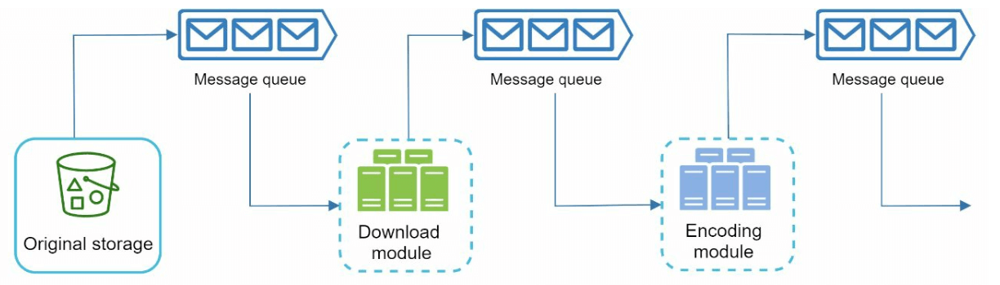

# 第 14 章：设计 YouTube

> 原章节：Design YouTube · 原项目路径 `14. Youtube/`

## 本章导读

上传一个视频，全世界都能流畅播放——这件事听起来理所当然，但它是整个互联网工程里最贵、最难的一类问题。

为什么难？因为视频同时踩中了三个"最"：**存储量最大**（一段 4K 视频动辄几十 GB）、**带宽消耗最大**（视频流量常年占全球互联网下行流量的六成以上）、**计算量最大**（转码是 CPU 密集型任务，比处理一条文本请求贵几个数量级）。

这一章要解决的核心问题只有一个：**同一份视频，怎么让一台 4K 电视、一台五年前的安卓手机、和一个正在坐地铁的 iPhone 都能流畅播放，同时把成本压到可接受？**

学完这一章，你应该能回答：为什么上传完不能马上播放？为什么服务器要存同一个视频的好几个版本？CDN 的钱到底花在哪里？

## 你将学到

- 视频系统的完整链路：上传 → 转码 → 分发 → 播放，每一段做了什么
- **容器格式（Container）** 与 **编码格式（Codec）** 的区别——初学者最容易混淆的一对概念
- H.264 / H.265 / VP9 / AV1 四种编码的技术取舍，以及**专利授权**这个绕不开的商业约束
- 为什么必须生成"码率阶梯（Bitrate Ladder）"，以及 **ABR（自适应码率）** 如何工作
- **HLS 与 DASH** 两大流媒体协议的区别与选型
- 用 **DAG（有向无环图）** 组织转码任务，以及资源调度器的设计
- 视频系统的三大优化方向：上传速度、内容安全、带宽成本
- **内容审核（CSAM 检测）** 与 **版权识别（Content ID）** 在整个架构中的位置

---

## 1. 先看规模：YouTube 到底有多大

设计任何系统，第一步都是搞清楚"规模有多大"。原笔记给出的数据是 2020 年的，已经明显过时。这里用可查证的公开数据更新一遍。

| 指标 | 原笔记（2020 年） | 当前公开数据 | 来源 |
|---|---|---|---|
| 月活用户 | 20 亿 | 超过 25 亿（常被引用的口径） | 行业统计综合 |
| 每日观看量 | 50 亿次视频观看 | YouTube Shorts 日均观看量已超过 2000 亿次 | YouTube for Press |
| 每日上传量 | 每分钟 500 小时 | 平均每天上传超过 2000 万个视频 | YouTube for Press |
| 覆盖语言 | 80 种语言 | 100 多个国家、80 种语言 | YouTube for Press |
| 广告收入 | 2019 年 151 亿美元 | 2024 年 361 亿美元 | Alphabet 2024 年财报（10-K） |
| 行业地位 | — | 连续多年位居美国流媒体观看时长第一 | Nielsen，2026 年 1 月 |

> **关于「每分钟上传 500 小时」这个数字**
> 这个说法流传极广，来自更早年份的官方口径。YouTube 官方新闻页目前使用的表述已经换成了「平均每天上传超过 2000 万个视频」。两者并不矛盾——2000 万个视频里包含大量几十秒的 Shorts，平均时长被大幅拉低。**引用统计数据时，一定要写清楚年份和口径**，否则很容易在面试里被追问倒。

**这些数字对设计意味着什么？** 日均 2000 万次上传，意味着：

- 上传通道必须能水平扩展，且要能容忍断网重传（移动网络下上传失败是常态，不是异常）；
- 转码集群的规模必须是"按需弹性"的——上传量有波峰波谷，固定容量要么浪费要么排队；
- 分发成本是最大的一项支出。**视频系统的成本结构里，带宽通常比存储和计算加起来还高**，所以后面所有"成本优化"几乎都围绕带宽展开。

---

## 2. 第一步：明确需求与范围

面试时，题目永远是模糊的。你必须先把它收窄成一份明确的清单。

### 核心功能

只保留两条最核心的：

1. **上传视频**
2. **观看视频**

其余功能（评论、点赞、订阅、推荐、搜索、直播）在这个阶段**明确排除**。不是它们不重要，而是它们每一个都值得单独一章，混在一起讲只会让架构图变成一团乱麻。

> **这是系统设计面试的第一个加分点**：主动说出"我不做推荐系统，因为它是独立的机器学习系统，与视频分发链路的耦合很弱"。面试官会立刻知道你分得清主次。

### 支持的平台

移动 App、网页浏览器、智能电视。

**为什么这里要单独列出平台？** 因为它们的解码能力差异巨大：

- 智能电视的芯片解码能力最弱，往往只支持 H.264；
- 新手机普遍支持 H.265、部分支持 AV1；
- 浏览器的支持情况取决于内核版本和操作系统。

这正是"必须转码成多种编码"的根本原因——**不是我们想多存几份，而是客户端根本不统一。**

### 假设条件

| 项目 | 取值 |
|---|---|
| 日活用户（DAU） | 500 万 |
| 平均视频大小 | 300 MB |
| 单个视频上限 | 1 GB |
| 每日新增存储 | 150 TB |

> **勘误提示**：原笔记直接给出了"每日存储 150 TB"，但**没有给出推导过程**。如果你按字面算 `500 万 × 300 MB`，得到的是 **1.5 PB（1500 TB）**，和 150 TB 差了整整 10 倍。正确的前提是「**只有 10% 的用户会上传视频**」。详见文末【勘误与补充】。

---

## 3. 粗略估算：把成本算出来

### 每日存储需求

```
每日上传视频数 = 500 万 DAU × 10%（上传比例）= 50 万个
每日新增存储 = 50 万 × 300 MB = 150,000,000 MB = 150 TB
```

**注意这里有个常被忽略的放大效应**：150 TB 只是"原始视频"的量。转码后要生成多个清晰度，总存储量通常是原始的 1.5～2 倍；如果再加多副本冗余（对象存储一般 3 副本或纠删码），实际占用的物理空间还要再放大。**估算存储时只看原始文件，是初学者最常见的低估来源。**

### CDN 带宽成本

原笔记的算法是：

```
500 万用户 × 每天看 5 个视频 × 0.3 GB × $0.02/GB = $150,000/天
```

这个算式本身是对的。但有两个细节需要说清楚：

**第一，$0.02/GB 是什么价？** 我查了 AWS 官方的 CloudFront 按量付费价格表（美国/加拿大区域）：

| 月度用量 | 单价（USD/GB） |
|---|---|
| 前 1 TB | 免费 |
| 之后 9 TB | $0.085 |
| 之后 40 TB | $0.080 |
| 之后 100 TB | $0.060 |
| 之后 350 TB | $0.040 |
| 之后 524 TB | $0.030 |
| 之后 4 PB | $0.025 |
| **超过 5 PB** | **$0.020** |

也就是说，**$0.02/GB 是最高的量级档位**（月流量超过 5 PB 才能拿到）。而上面的算式得出的日流量是 750 万 GB，月流量约 225 PB，远超 5 PB——所以这个假设是自洽的。但如果你的系统规模小得多，用 $0.02 估算会严重低估成本，小规模时应该用 $0.085/GB 起步。

**第二，0.3 GB 是上传尺寸，不是下载尺寸。** 用户实际下载多少流量，取决于 ABR 选中的清晰度。地铁上的手机很可能只拉 480p（几百 kbps），一小时的视频也就几百 MB 而不是几个 GB。所以 **$15 万/天 是上限估计，不是精确值**。真实系统里，观看清晰度的分布会显著降低这个数字。

> **估算的正确态度**：粗略估算的目的不是算出精确答案，而是**判断量级、找出成本大头**。这里算完你就会发现：CDN 带宽（$15 万/天）比存储（150 TB/天）更值得优化。这个结论直接决定了后面「成本优化」一节的优先级。

---

## 4. 高层设计：七个组件与两条主流程

<div align="center">
  
</div>

| 组件 | 职责 |
|---|---|
| **客户端（Client）** | 手机、电脑、电视上的 App 或浏览器 |
| **CDN** | 存储并就近分发视频流 |
| **API 服务器** | 处理除视频流以外的所有交互（上传、改元数据、评论等） |
| **元数据库（Metadata DB）** | 存视频元数据：标题、描述、大小、时长、状态 |
| **原始存储（Original Storage）** | 存上传的原始视频，对象存储 |
| **转码服务器（Transcoding Servers）** | 把视频转成多种分辨率和编码 |
| **转码后存储（Transcoded Storage）** | 存转码结果，供 CDN 回源 |

> **架构上的关键分工**：**视频流不经过 API 服务器**。API 服务器只处理控制面（metadata、权限、列表），数据面（几百 MB 到几 GB 的视频字节）全部走 CDN。如果让视频流穿过应用服务器，你的应用服务器会被带宽彻底压垮——这是初学者设计视频系统时最容易犯的错。

### 流程一：视频上传

<div align="center">
  
</div>

上传是**两条并行进行的流程**：

**（A）视频字节的上传**

1. 视频被上传到对象存储（blob storage）。
2. 转码服务器把它转成多种格式。
3. 转码完成后，下面两步**并行执行**：
   - 3a. 转码后的视频写入转码后存储；
   - 3b. 转码完成事件写入**完成队列（completion queue）**。
4. 3a.1 视频被分发到 CDN。
5. 3b.1 完成处理器（completion handler）更新元数据，并通知用户"视频已发布"。

**（B）元数据的上传**

<div align="center">
  
</div>

客户端**并行地**发送一个更新视频元数据的请求，请求里包含文件名、大小、格式等信息。

> **为什么要并行？** 因为视频字节上传很慢（几百 MB），而元数据只有几 KB。如果串行，用户要等视频传完才能看到标题被保存。并行上传让"元数据立刻可见、视频后台慢慢传"，用户体验完全不同。
>
> **代价是状态不一致**：元数据可能先到，而视频字节还没传完。所以元数据需要一个 `status` 字段来标记生命周期——这一点在第 15 章（Google Drive）里会展开讲。

### 流程二：视频播放

<div align="center">
  
</div>

- 视频**直接从 CDN 的边缘服务器**流出，以最小化延迟。
- 常见的流媒体协议有 MPEG-DASH、Apple HLS、Adobe HDS。
- 不同的流媒体协议支持的编码格式和播放器不同。

> **勘误提示**：原笔记把 Adobe HDS 列为"常见协议"之一，这是过时信息。HDS 基于 Flash，而 Flash 已于 2020 年底全面停止支持。详见文末【勘误与补充】。

---

## 5. 视频转码：为什么必须做这一步

**转码（Transcoding）** 就是把视频从一种格式转换成另一种格式的过程。原笔记给出了三个理由，都正确：

1. **节省存储**：原始视频体积巨大（未经压缩的 1080p 视频每分钟可达数 GB），压缩后体积下降一到两个数量级。
2. **保证兼容性**：不同设备、浏览器支持的编码格式不同，必须为它们准备各自能播的版本。
3. **适配网络状况**：网络好的时候给高清，网络差的时候给低清，避免卡顿。

**但这三条里，第 3 条才是真正的核心。** 第 1、2 条是"做一次就行"的静态问题，第 3 条要求系统**同时提供多个清晰度并让客户端动态切换**——这才是视频系统复杂度的主要来源。后面第 7 节的"码率阶梯"就是在解决它。

### 转码的两个组成概念

原笔记在这里给出了两个术语，但讲得太简略，初学者几乎必然混淆。这里单独展开。

---

## 6. 容器格式与编码格式：初学者最容易混淆的一对概念

原笔记只写了两行：

- **容器（Container）**：封装视频、音频和元数据（如 MP4、AVI）。
- **编码（Codec）**：压缩与解压缩算法（如 H.264、VP9）。

这两句话是对的，但不够用。我们来把它讲透。

### 类比：快递箱与里面的东西

**容器格式就像快递箱**，它规定了"箱子里怎么摆放东西"：视频轨道放哪、音频轨道放哪、字幕放哪、时间戳怎么记、封面图放哪。

**编码格式就像箱子里的物品本身**，它规定了"画面数据怎么被压缩成字节"。

同一个箱子可以装不同的东西：`MP4` 容器里可以装 H.264，也可以装 H.265，甚至可以装 AV1。反过来，同一个 H.264 码流既可以装进 `MP4`，也可以装进 `MPEG-TS`，或者 `MKV`。

> **所以「MP4 格式」这个说法本身是含混的。** 当有人说"这个视频是 MP4 的"，他只知道箱子是什么，不知道里面装的是什么。而**能不能播放，取决于箱子里的编码**，而不是箱子本身。这就是"我明明下载了 MP4，为什么电视还是播不了"这类问题的根源。

### 常见容器格式

| 容器 | 扩展名 | 典型用途 | 能装什么 |
|---|---|---|---|
| **MP4**（ISO Base Media File Format） | `.mp4` | 最通用，点播、下载 | H.264、H.265、AV1、AAC、Opus 等 |
| **fMP4**（Fragmented MP4） | `.m4s` / `.mp4` | 流媒体分片（HLS/DASH 都用） | 同上，但被切成可独立加载的碎片 |
| **WebM** | `.webm` | 网页播放，开源生态 | VP8、VP9、AV1 + Vorbis、Opus |
| **MPEG-TS** | `.ts` | 传统 HLS 分片、数字电视广播 | H.264、H.265、AAC |
| **MKV**（Matroska） | `.mkv` | 本地播放，几乎什么都能装 | 几乎所有编码 |
| **AVI** | `.avi` | 老格式，已基本淘汰 | 老编码，不支持现代特性 |

> **fMP4 是理解现代流媒体的关键**。传统 MP4 的索引（moov box）在文件末尾或开头，播放器必须拿到整个文件才能开始解码。fMP4 把文件切成一个个自包含的碎片，每个碎片可以独立解析——**这正是流媒体"边下边播"的前提**。

### 编码格式的四国杀

这是本章最重要的技术选型。四种编码各有取舍：

| 编码 | 制定方 | 专利授权 | 压缩效率 | 硬件解码支持 | 编码成本 |
|---|---|---|---|---|---|
| **H.264 / AVC** | ITU-T + MPEG | 专利池收费（Via LA 等），但已广泛授权 | 基准线 | 几乎所有设备（含老电视） | 低，编码最快 |
| **H.265 / HEVC** | ITU-T + MPEG | **多个专利池并存**（Via LA、HEVC Advance、Velos Media 等），授权最复杂 | 同画质下比 H.264 省约 40%～50% 码率 | 较广，新设备基本支持 | 中高 |
| **VP9** | Google | **免专利费** | 同画质下比 H.264 省约 30%～50% 码率 | 较广（Chrome、Android、多数新 GPU） | 高（纯软件编码慢） |
| **AV1** | AOMedia（Google、Netflix、Amazon、Apple、Microsoft、Mozilla 等联合） | **免专利费** | 比 VP9 再省约 20%～30% | 新硬件普遍支持（较新的 GPU、SoC） | 最高，但 SVT-AV1 等编码器已大幅缩小差距 |

> **表中的压缩效率是行业普遍引用的近似区间，具体数字强依赖视频内容和编码器参数，不要当成精确值使用。**

**为什么专利授权这么重要？** 因为它不是技术问题，而是商业问题：

- H.264 和 H.265 的专利池要求按设备数或内容量收费。H.265 的麻烦在于**同时存在多个互不覆盖的专利池**，厂商要一家一家谈，法务成本极高。
- 这正是 Google 推 VP9、AOMedia 推 AV1 的直接动因——**用免专利费的编码绕开授权成本**。
- 也是为什么 Netflix、YouTube、Twitch 这些流量巨头**有强烈动机自己扛下 AV1 高昂的编码成本**：省下的带宽费和专利费，远大于多花的 CPU。

**对初学者的启示**：技术选型从来不只看"哪个压缩率高"。**授权成本、生态支持、编码算力**三者常常比压缩率更能决定最终选择。

---

## 7. 码率阶梯与 ABR：为什么要生成多个清晰度

原笔记提到"转码要适配网络状况"，但没有解释**具体怎么适配**。这是本章最重要的补充。

### 问题：一条视频，网络状况千差万别

同一个视频，用户可能在千兆光纤上看，也可能在地铁里用 3G 看。如果你只提供一个 1080p 的高码率版本：

- 光纤用户：很爽，但白白浪费了带宽；
- 地铁用户：缓冲卡顿，体验灾难。

如果你只提供一个 480p 的低码率版本：所有人都能播，但画质很差。

**怎么办？答案是同时准备好几个版本，让客户端自己选。**

### 码率阶梯（Bitrate Ladder）

把同一个视频编码成一系列"分辨率 + 码率"组合，从低到高排列，就叫**码率阶梯**。一个典型的阶梯大致长这样（数值为示意，不同平台差异很大）：

| 分辨率 | 建议码率（H.264） | 典型场景 |
|---|---|---|
| 240p | ~300 kbps | 极差网络，仅保证能看 |
| 360p | ~700 kbps | 移动网络 |
| 480p | ~1.2 Mbps | 移动网络较好 |
| 720p | ~2.5 Mbps | 家用宽带 |
| 1080p | ~5 Mbps | 主流高清 |
| 1440p | ~9 Mbps | 高分屏 |
| 2160p（4K） | ~20 Mbps 起 | 大屏 + 高带宽 |

**关键点：阶梯不是简单地把同一个文件压缩到不同码率，而是要重新编码。** 降低分辨率本身就能大幅降低码率，而且低分辨率下的编码参数（如量化步长）也要重新调整。所以 **7 档阶梯 ≈ 7 次完整编码**，这是转码成本的主要来源。

**代价一：转码算力。** 一次上传要跑 7 次编码，AV1 又要比 H.264 慢得多。这就是为什么转码集群必须是弹性伸缩的，也是为什么"冷门视频按需转码"是一个有效的省钱手段。

**代价二：存储放大。** 只算 240p 到 1080p 这五档，码率之和约 9.7 Mbps（0.3 + 0.7 + 1.2 + 2.5 + 5），而 1080p 单档只有 5 Mbps——**这几档的体积之和大约是最高档的 2 倍**。如果再加上 1440p 和 4K，倍数还要更高。所以前面说"转码后总存储是原始的 1.5～2 倍"，来源就在这里。

### ABR（自适应码率，Adaptive Bitrate）如何工作

有了阶梯，还需要一套机制让客户端在播放过程中**动态切换**。这套机制叫 ABR。

**前置条件：分片与对齐（Segmentation & Alignment）**

转码时，每一档都要被切成**时长相同的小分片**（HLS 传统上是 6 秒左右，低延迟场景会用 1～2 秒），并且**所有档位的第 k 个分片必须覆盖完全相同的时间区间**。这叫**分片对齐**。

> **为什么必须对齐？** 因为播放器要在分片边界切换档位。如果第 k 个分片在不同档位里覆盖的时间不一样，切换时画面就会跳帧或者重复。**分片对齐是 ABR 能工作的前提，而它又要求编码时按 GOP（Group of Pictures，图像组）边界切分**——这就解释了原笔记里"GOP alignment"这个词的含义。

**GOP 是什么？** 视频压缩利用了帧之间的相似性：I 帧是完整画面（关键帧），P 帧只记录"相对前一帧的变化"，B 帧记录双向变化。一个 GOP 从一个 I 帧开始，到下一个 I 帧之前结束。**只有 I 帧能独立解码**，所以分片必须从 I 帧开始——否则播放器从中间某个分片开始播时，没有参考帧，画面就废了。

**播放器的决策循环**

1. 播放器先下载**清单文件（manifest）**，里面有所有档位和分片地址。
2. 开始播放：先选一个较低档位，快速拉起首屏（减少起播时间）。
3. 每下完一个分片，测量实际下载速度，并结合当前缓冲区水位，决定下一片选哪一档：
   - 网速够、缓冲区充足 → 升档；
   - 网速掉下来、缓冲区见底 → 降档。
4. 切换只发生在**分片边界**，所以用户看到的是画质变化，而不是卡顿或花屏。

> **这就是 ABR 的全部精髓**：把"清晰度选择"从服务端一次性决策，变成客户端逐分片的持续决策。服务端只负责**把阶梯准备齐全**，选择权交给离用户最近、信息最全的客户端。

**一个容易被忽略的细节**：ABR 算法本身也有好坏之分。保守的算法（缓冲区优先）画质稳定但平均码率低；激进的算法（吞吐量优先）画质高但容易在网速抖动时反复升降档，造成"画质抽搐"。主流播放器（如 hls.js、Shaka Player、ExoPlayer）都内置了可调策略。

---

## 8. 流媒体协议：HLS 与 DASH 的区别与选择

原笔记只列了协议名，没有解释区别。这里补上。

**先纠正一个常见误解：HLS 和 DASH 不是编码格式，而是"打包 + 传输"协议。** 它们规定了清单文件长什么样、分片怎么命名、播放器怎么发现和请求分片。它们和编码格式是正交的——HLS 里可以装 H.264，也可以装 H.265。

| 维度 | **HLS**（HTTP Live Streaming） | **DASH**（Dynamic Adaptive Streaming over HTTP） |
|---|---|---|
| 制定方 | Apple | MPEG（ISO/IEC 23009-1 国际标准） |
| 清单文件 | `.m3u8` 播放列表（文本） | `.mpd`（Media Presentation Description，XML） |
| 传统分片格式 | MPEG-TS | fMP4 |
| 现代分片格式 | fMP4（CMAF） | fMP4（CMAF） |
| 编码支持 | 以 H.264 / H.265 + AAC 为主 | **编码无关**，H.264 / H.265 / VP9 / AV1 都支持 |
| 原生支持 | Safari、iOS、Android、智能电视**原生支持** | 浏览器需通过 MSE（Media Source Extensions）；Safari 桌面版可用，iOS 支持有限 |
| DRM | FairPlay（Apple 专用） | Widevine / PlayReady（基于 CENC 通用加密） |
| 生态现状 | 兼容性最好，是事实上的默认选择 | 更灵活，YouTube、Netflix 等大型平台大量使用 |

**怎么选？实际工程里的答案往往是"两个都要"：**

- **对 Apple 生态（Safari、iOS、tvOS）用 HLS**，因为它是唯一原生支持的协议，用 DASH 会带来额外兼容性风险；
- **对 Android、Chrome、智能电视等用 DASH**，因为它能承载 VP9 / AV1 这些免专利费编码，长期看带宽成本更低；
- 很多平台会**同时输出两套清单，但共用同一套分片**——这就是 **CMAF（Common Media Application Format）** 的价值。

> **CMAF 值得单独记住**：它把分片格式统一成 fMP4，让同一份分片文件同时被 HLS 和 DASH 引用。**没有 CMAF，你就要为每个档位存两份分片（TS 一份、fMP4 一份），存储和 CDN 回源成本直接翻倍。** 这是一个"用标准解决成本问题"的经典案例。

### 分片与 CDN 预热的成本

**分片粒度是个权衡：**

- **分片太短**（如 1 秒）：ABR 切换更灵敏、起播更快，但分片数量暴涨。一个 1 小时的视频会产生 3600 个分片，每个分片都是一次独立的 HTTP 请求，请求开销和 CDN 日志量都会显著上升。
- **分片太长**（如 10 秒）：请求数少、CDN 效率高，但 ABR 反应迟钝，用户要等 10 秒才能换清晰度。

所以主流选择是 **4～6 秒**，低延迟直播场景才用 1～2 秒。

**CDN 预热的成本（Preheating / Prefetching）：**

一个新视频刚发布时，CDN 边缘节点上什么都没有。第一个观众访问时会触发**回源（origin fetch）**——边缘节点跑到源站拉分片。这带来三个问题：

1. **首次播放延迟高**：用户要等回源完成；
2. **源站带宽瞬时飙升**：一个热门视频发布，成千上万个边缘节点同时回源，源站可能被打爆；
3. **成本**：回源流量虽然部分 CDN 免费（例如 CloudFront 从 AWS 源站回源不计费），但从自建源站回源是要钱的。

**预热（Preheat）** 就是主动把分片推到边缘节点，避免用户触发回源。但它不是免费的：

- **边缘存储成本**：视频总时长 × 档位数 × 分片大小，全推到边缘非常昂贵；
- **预热流量本身也要钱**（源站 → 边缘）；
- **预热了没人看就是纯浪费**。长尾视频（90% 的视频只被看过个位数次数）预热毫无意义。

> **所以预热的正确姿势是"按热度分级"**：只对预测会爆的内容（大 V 发布、官方活动）预热，其余交给 Pull CDN 按需回源。这正好对应原笔记"成本优化"里的第一条——**只把热门视频放 CDN，冷门视频从高容量存储服务器直接服务**。

---

## 9. 转码流水线：DAG 模型

<div align="center">
  
</div>

**转码为什么需要一整套流水线？** 因为单次转码耗时极长（一段长视频可能要几十分钟到几小时），而且任务之间有依赖关系。用一套"任务图"来组织，才能最大化并行度并支持失败重试。

### DAG（有向无环图）

**DAG（Directed Acyclic Graph，有向无环图）** 用节点表示任务，用有向边表示依赖关系，"无环"保证不会出现循环等待。

原始视频首先被拆成三部分：

- **视频轨**：转成不同分辨率、编码、码率的多个版本；
- **音频轨**：转成不同编码（AAC / Opus）和码率的版本；
- **元数据**：时长、编码参数、宽高比等。

在此之上还有派生任务：

- **缩略图（Thumbnail）**：可以由用户上传，也可以由系统自动抽取（通常取视频的几个时间点各生成一张，供用户挑选封面）；
- **水印（Watermark）**：在画面上叠加标识信息，用于版权归属或泄露溯源。

**DAG 的价值在于并行。** 视频轨编码、音频轨编码、缩略图生成、水印处理之间没有依赖，可以全部并行执行；只有最后的"打包/合并"必须等它们全部完成。一个串行要几小时的任务，在几百个 worker 上并行后可能只要几分钟。

### 转码架构的五个组件

<div align="center">
  
</div>

**① 预处理器（Preprocessor）**

<div align="center">
  
</div>

它承担四件事：

1. **视频切分**：把视频流按 **GOP 边界**切成更小的块。按 GOP 切分是为了兼容老客户端——老播放器不支持任意位置起播，只能从关键帧开始。
2. **按 GOP 对齐切分**：保证每个分片从 I 帧开始（前面已经讲过为什么）。
3. **生成 DAG**：根据**客户端程序员写的配置文件**生成任务图。也就是说，"要生成哪几档清晰度、要不要加水印、抽几张缩略图"是配置驱动的，不是硬编码的。
4. **落盘中间数据**：把切好的 GOP 和元数据写入临时存储。**这样万一后续编码失败，可以直接从持久化的中间数据重试，而不必让用户重新上传。**

> 第 4 点是最容易被忽略但工程价值最高的一点。**转码是长耗时任务，失败是常态**（worker 被抢占、机器故障、内存不足）。没有中间态持久化，一次失败就要从头再来，成本高得无法接受。

**② DAG 调度器（DAG Scheduler）**

<div align="center">
  
</div>

它把 DAG 图拆成若干个**阶段（Stage）**，按顺序或并行地把任务放进资源管理器的任务队列。

- **阶段 1**：拆出视频、音频、元数据；
- **阶段 2**：视频轨再拆成"视频编码"和"缩略图生成"两个任务。

阶段之间是依赖关系，阶段内部是并行关系。

**③ 资源管理器（Resource Manager）**

<div align="center">
  
</div>

它负责资源分配的效率，内部有三个队列和一个调度器：

| 组件 | 作用 |
|---|---|
| **任务队列（Task Queue）** | 优先级队列，存放待执行的任务 |
| **worker 队列（Worker Queue）** | 优先级队列，存放各个 worker 的利用率信息 |
| **运行队列（Running Queue）** | 存放当前正在运行的任务，以及正在执行它们的 worker |
| **任务调度器（Task Scheduler）** | 挑选最合适的"任务 + worker"组合，并指令该 worker 执行 |

> **注意"worker 队列"这个设计**：它维护的不是 worker 列表，而是**worker 的利用率信息**。调度器据此把任务派给最空闲、或者最适合该任务类型（比如有 GPU 加速）的 worker。这就是**资源感知调度**，比简单的轮询分发效率高得多。

**④ 任务 worker（Task Workers）**

<div align="center">
  
</div>

真正干活的人。不同的 worker 可以运行不同类型的任务——有的专做视频编码，有的专做缩略图抽取，有的专做水印叠加。**任务类型与 worker 能力匹配，是资源利用率的关键。**

**⑤ 临时存储（Temporary Storage）**

存放中间数据供重试使用。存储系统的选型取决于**数据类型、数据量、访问频率、数据生命周期**等因素：

- 访问极频繁、只活几分钟的中间数据 → 内存或本地 SSD；
- 需要跨机器共享、活几小时 → 分布式文件系统或对象存储。

**⑥ 输出**

转码完成的视频，已准备好分发给 CDN。

---

## 10. 系统优化：速度、安全、成本

### 速度优化

**① 并行分片上传**

<div align="center">
  
</div>

把大视频切成小块，**并行上传**，并支持**断点续传（resumable upload）**。

> **为什么断点续传对视频特别重要？** 因为上传动辄几百 MB 到几 GB，在移动网络下几乎必然会中断。如果没有断点续传，用户每次失败都要从头再来——这是体验杀手。实现上，客户端把文件切块、记录每块的 ETag、失败时只重传缺失的块。

**② 分布式上传中心**

把 CDN 当作上传入口，让用户就近上传。

> **这里有个反直觉的点**：CDN 传统上只做"下行加速"（把内容推给用户），但现代 CDN 也支持"上行加速"——用户就近接入边缘节点，边缘节点再通过 CDN 的优质骨干网把数据传回源站。**跨洲上传走公网丢包严重，走 CDN 骨干网会快很多。**

**③ 并行处理（用消息队列解耦）**

<div align="center">
  
</div>

<div align="center">
  
</div>

用消息队列把各个模块解耦，从而获得高并行度。

> **消息队列在这里的核心价值是"削峰 + 解耦"**：上传是用户触发的、不可控的（可能一秒钟来一万个视频）；转码是重计算、必须限速的。中间放一个队列，上传侧永远不阻塞，转码侧按自己的处理能力消费。上传量突增时队列变长，但**用户的上传体验不受影响**——这正是第 1 章讲过的消息队列价值。

### 安全优化

**① 预签名 URL（Pre-Signed URL）**

<div align="center">
  
</div>

只有经过授权的用户才能上传视频。做法是：API 服务器用自己持有的凭证生成一个**带签名、带有效期**的 URL，客户端拿着它直接上传到对象存储。

> **勘误提示：预签名 URL 不是加密，而是授权。** 它的本质是"服务端替你签了一张限时通行证"。这样做的两个好处：客户端**拿不到你的长期密钥**；上传流量**不经过应用服务器**，直接进对象存储，应用服务器不会被大文件压垮。
>
> **要记住的安全边界**：预签名 URL 一旦泄露，在有效期内任何人都能用。所以有效期要短（通常几分钟到几小时），并且要限制文件大小和上传路径。

**② 内容保护**

- **DRM 系统（数字版权管理）**：Apple FairPlay、Google Widevine、Microsoft PlayReady，用于付费内容防拷贝；
- **AES 加密**：对视频流做对称加密（HLS 的 AES-128、DASH 的 CENC 通用加密）；
- **水印（Watermarking）**：画面叠加标识，用于溯源泄露来源。

> **补充：隐形水印（Forensic Watermarking）** 比可见水印更强——它把用户 ID 编码成肉眼不可见的水印嵌入画面。一旦内容泄露，可以从泄露的视频里解出水印，**精确定位是哪个账号泄露的**。这是付费内容平台的标准做法。

### 成本优化

原笔记给了四条，都正确：

1. **只把热门视频放 CDN，冷门视频从高容量存储服务器直接服务。** 长尾视频访问量极低，放 CDN 的存储成本远大于收益。
2. **冷门视频按需编码。** 不必为每个上传的视频都生成全部档位——可以先只生成最低档位，等真的有人看了再补齐。**这是最有效的成本优化之一，因为它同时省下了转码算力和存储。**
3. **按热度做区域化分发。** 只在"这个视频真的火"的地区预热到边缘。
4. **自建 CDN 并与 ISP 合作（peering）。** 当流量足够大时，自建 CDN 并向 ISP 支付对等互联费用，比按量买 CDN 便宜得多。这是 Netflix 的 Open Connect 模式。

> **补充第 5 条：选择更高效的编码。** 前面说过，AV1 相比 H.264 能省约一半码率。虽然编码更贵，但**编码是一次性成本，带宽是持续成本**。对一个被观看上亿次的视频，用 AV1 省下的 CDN 流量费远远超过多花的 CPU 时间。这也是 YouTube 和 Netflix 大力投入 AV1 的原因。

---

## 11. 错误处理

原笔记把它分成两类，这个划分是对的：

**可恢复错误（Recoverable Errors）**

上传失败、转码失败、资源分配失败——都可以重试。实现上需要：

- **重试要带退避（backoff）和抖动（jitter）**，否则失败的任务会同时重试，形成"重试风暴"；
- **重试次数要有上限**，超限后进入死信队列（DLQ）等待人工介入，而不是无限重试；
- **重试要幂等**，否则同一个转码任务重试两次会产生两份输出。

**不可恢复错误（Non-Recoverable Errors）**

格式损坏的视频文件——停止处理并返回错误码。

> **补充：还有一类"看似可恢复、实则不能盲目重试"的错误。** 比如"视频被判定为违规内容"，重试一万次结果也一样，必须走审核流程。设计错误处理时，**要区分"失败原因在系统侧（可重试）"还是"在输入侧（不可重试）"**。

---

## 12. 内容审核与版权识别：原笔记完全缺失的一环

原笔记从头到尾没有提到内容审核。但对任何真实运营的视频平台，**这是必须存在的架构组件，而且它直接决定了"能不能上线"**。

### 为什么必须有

- **法律义务**：绝大多数国家和地区都要求平台主动检测并移除儿童性虐待材料（CSAM）。美国的法定报告渠道是 NCMEC（National Center for Missing & Exploited Children）。
- **版权责任**：平台如果放任侵权内容传播，可能承担连带责任。
- **商业风险**：广告主不会在有违规内容的平台上投放广告。

### 架构位置

内容审核**不是**一个独立的旁路系统，它是转码 DAG 里的**一个节点**，位置很关键：

```
上传 → 原始存储 → 预处理器 → DAG 调度
                                 │
                    ┌────────────┼────────────┐
                转码任务      审核任务      指纹任务
                    │            │            │
                    └────────────┼────────────┘
                                 ↓
                        【发布闸门】
                                 ↓
                             CDN 分发
```

**三个要点：**

1. **审核与转码并行**，不要串行。串行会让每个视频的发布延迟增加审核时间，而审核本身可能很慢。
2. **发布闸门（Publish Gate）必须在 CDN 分发之前。** 转码结果可以先落到"未发布"的存储桶，只有审核通过的视频才被允许分发到 CDN 并对外可见。**如果先发布再审核，违规内容已经传播出去了，撤下来也来不及。**
3. **审核任务需要读取视频帧**，所以它依赖预处理阶段产出的 GOP 数据——这就是它必须挂在 DAG 里的原因。

### 两类审核技术

**① CSAM 检测：基于感知哈希**

核心技术是**感知哈希（Perceptual Hashing）**，代表实现是微软的 PhotoDNA 以及面向视频的 CSAI Match 类工具。原理是：把画面转换成一组对"缩放、压缩、轻微裁剪"不敏感的指纹，然后与已知违规内容的指纹库比对。

- **关键优势**：即使内容被重新编码、加水印、改分辨率，指纹依然能匹配——**这是普通 MD5 哈希做不到的**，因为 MD5 只要改一个字节就完全变了。
- **关键约束**：匹配需要"已知违规内容库"，而这个库由专业机构维护，平台无法自行生成。所以这类检测**必须与外部机构对接**。

**② 版权识别：Content ID 模式**

YouTube 的 Content ID 是这套模式的经典实现，流程是：

1. **版权方上传参考文件**（音乐、影视片段等），系统为其生成内容指纹；
2. **用户上传视频时，系统计算指纹并与参考库比对**；
3. **命中后按版权方预设的策略处理**：屏蔽、静音、变现收益归版权方、或允许并追踪数据。

> **Content ID 与 CSAM 检测的共同点是"指纹比对"，区别在于：**
> - CSAM 检测的**库是封闭的**（只有执法和 NCMEC 相关方持有），命中后必须**立即移除并上报**；
> - Content ID 的**库是开放的**（版权方主动上传），命中后**按策略处理，不一定要移除**。
>
> 在面试中主动区分这两者，是很强的加分项。

### 工程上的现实约束

- **审核必须有申诉通道**。自动判定必然有误伤，误伤热门创作者的内容会造成严重的公关事故。
- **审核要分级**：低风险内容自动放行，高风险内容转人工。全量人工审核在经济上不可行。
- **审核结果要可追溯**：谁在什么时候、基于什么规则做了判定，必须留痕，以应对监管问询。

---

## 勘误与补充

> 本节逐条指出原笔记中不准确、过时或缺失的地方。

### 勘误 1：「每日存储 150 TB」缺少关键前提，按字面算会差 10 倍

- **原文说法**：假设中列出「Daily Active Users: 5 million」「Average Video Size: 300 MB」「Daily Storage Need: 150 TB」。
- **问题**：这三个数字摆在一起，读者自然会算 `500 万 × 300 MB = 1.5 PB = 1500 TB`，与给出的 150 TB **相差 10 倍**。原笔记没有给出任何推导过程，读者无法复现这个结果。
- **正确说法**：正确的前提是「**只有约 10% 的 DAU 会上传视频**」：
  ```
  500 万 × 10% × 300 MB = 50 万 × 300 MB = 150 TB
  ```
  这才是 150 TB 的来源。
- **延伸**：**在系统设计里，"给出数字"和"给出可复现的推导"是两件事。** 面试时如果只报数字不写公式，面试官无法判断你是算出来的还是背下来的。建议养成习惯：每个数字后面都跟一行算式。

### 勘误 2：Adobe HDS 已被淘汰，不应列为「常见流媒体协议」

- **原文说法**：`Some of the popular streaming protocols are MPEG_DASH, Apple HLS, Adobe HDS.`（常见的流媒体协议有 MPEG-DASH、Apple HLS、Adobe HDS。）
- **问题**：Adobe HDS（HTTP Dynamic Streaming）依赖 Adobe Flash 运行时。**Flash 已于 2020 年 12 月全面停止支持**，所有主流浏览器均已移除 Flash。把 HDS 与 HLS、DASH 并列会严重误导初学者。
- **正确说法**：当前主流协议是 **HLS** 和 **DASH** 两个。此外还有面向超低延迟的 **LL-HLS（Low-Latency HLS）** 和 **LL-DASH**。历史上还有 Microsoft Smooth Streaming（MSS），同样已边缘化。
- **延伸**：HLS 和 DASH 都基于**分片 + HTTP** 的架构，本质相同，差别在清单格式、分片格式和生态支持。真正值得记住的结论是：**现代流媒体已经完全建立在普通 HTTP 之上**，因此可以直接复用 CDN 的全部能力——这是它们能取代 RTMP 等专用协议的根本原因。

### 勘误 3：Key Statistics 数据停留在 2020 年，多个数字已被官方口径取代

- **原文说法**：`Key Statistics (2020)`：月活 20 亿、每日观看 50 亿次视频、37% 移动互联网流量来自 YouTube、80 种语言、2019 年广告收入 151 亿美元。
- **问题**：这些数据距今已数年，多个口径已被官方替换：
  - 「每日观看 50 亿次视频」已严重过时——**YouTube Shorts 单日观看量就超过 2000 亿次**；
  - 「每分钟上传 500 小时」这一经典表述，YouTube 官方新闻页目前已改用「**平均每天上传超过 2000 万个视频**」；
  - 广告收入应更新为 **2024 年 361 亿美元**（Alphabet 2024 年 10-K 财报）；
  - 「37% 的移动互联网流量来自 YouTube」这一说法**未注明来源与年份**，且此类流量占比数据逐年波动、强依赖统计口径，不适合作为事实引用。建议改用有明确出处的官方指标，例如「YouTube 连续多年位居美国流媒体观看时长第一（Nielsen）」。
- **正确说法**：见第 1 节的更新表。**引用统计数据时必须同时给出年份和来源。**
- **延伸**：**这是系统设计笔记里最危险的一类错误——数字看起来精确，但已经过期。** 面试中如果引用过时数据并当成现状，会暴露"只会背笔记、不跟进事实"的问题。养成习惯：任何统计数据都标注年份，超出 2～3 年就主动说明"这是 X 年的数据，量级仍有参考价值，但最新数字需要核实"。

### 勘误 4：转码的「三个重要性」中，真正关键的那一条被写成了次要项

- **原文说法**：转码的重要性为——① 减少存储空间；② 保证跨设备兼容；③ 适配网络状况。
- **问题**：三条本身都对，但排序和展开方式会让初学者以为**转码主要是为了省空间**。实际上，① 和 ② 是"做一次就结束"的静态问题，而 ③ 要求系统**同时维护多个清晰度并支持播放中动态切换**——这才是视频系统绝大部分复杂度和成本的来源（转码算力 × N 档、存储 × 2 倍、CDN 分片管理、ABR 播放器逻辑）。
- **正确说法**：转码的核心目的是**构建码率阶梯以支持 ABR**，存储和兼容性是附带收益。详见第 7 节。
- **延伸**：这个判断会直接影响架构决策。如果转码只是为了省空间，那"存一份最高清的就够了"；正是因为要支持 ABR，才必须有"转码流水线 + 分片 + 清单 + CDN 预取"这一整套设施。

### 勘误 5：单个视频上限 1 GB 是简化假设，与真实平台差距很大

- **原文说法**：假设中列出 `Upload Limits: Max 1 GB per video`。
- **问题**：这是原书为了简化估算而设定的假设，但**读者容易把它误当成真实平台的限制**。真实 YouTube 的单个视频上限远高于此——官方帮助中心给出的上限是「12 小时或 256 GB，取较小者」（需要完成账号验证，未验证账号默认 15 分钟）。
- **正确说法**：作为**估算假设**，1 GB 是合理的简化；但作为**事实陈述**，它与真实平台不符。写估算时要明确标注"这是我们设定的假设"，而不是"这是 YouTube 的限制"。
- **延伸**：**区分"我设定的假设"和"真实系统的参数"，是粗略估算的基本功。** 面试时主动说明"这里我把上限设为 1 GB 以便计算，真实值要大得多"，会让面试官知道你的简化是有意识的。

### 补充 1：容器格式与编码格式的区别

原笔记只有两行定义，没有解释二者的关系和为什么这个区分重要。详见第 6 节。**「MP4 视频为什么播不了」这类问题的答案就在这里：能不能播取决于编码，不取决于容器。**

### 补充 2：四种编码格式的技术与商业取舍

原笔记只举了 H.264 和 VP9 两个例子，没有对比。详见第 6 节的四国杀表格，重点是 **H.265 的多专利池困境**与 **AV1 的免专利费路线**。

### 补充 3：码率阶梯与 ABR 工作原理

原笔记说"转码是为了适配网络状况"，但完全没有解释**怎么适配**。详见第 7 节。这是全章最重要的补充：**没有码率阶梯和 ABR，整个转码流水线的存在理由就说不清楚。**

### 补充 4：HLS 与 DASH 的区别、选型与 CMAF

原笔记只列了协议名。详见第 8 节。核心结论：**两者都基于 HTTP 分片，差别在生态；CMAF 让同一套分片同时服务两者，能把存储和回源成本减半。**

### 补充 5：分片粒度与 CDN 预热的成本

原笔记完全没有涉及。详见第 8 节末。**这是视频系统成本结构里最容易被忽视的一块。**

### 补充 6：内容审核与版权识别的架构位置

原笔记完全没有提及。详见第 12 节。**对任何真实运营的平台，这不是可选项。** 关键结论：审核任务挂在转码 DAG 上并行执行，且**发布闸门必须位于 CDN 分发之前**。

### 补充 7：预签名 URL 的定位是「授权」而非「加密」

原笔记把它放在 Safety Optimizations 下，容易让人以为它是一种加密手段。详见第 10 节。**它的本质是限时通行证，安全边界在于有效期要短。**

---

## 常见误区

| 误区 | 为什么错 | 正确理解 |
|---|---|---|
| 转码就是为了压缩体积 | 压缩只是副产品，核心目的是构建**码率阶梯**以支持自适应播放 | 转码 = 为同一内容生成 N 个可切换的版本，代价是 N 倍算力和约 2 倍存储 |
| MP4 是一种视频编码 | MP4 是**容器**，里面可以装 H.264、H.265、AV1 等任意编码 | 能不能播放取决于**编码**；容器只决定"怎么打包" |
| HLS 和 DASH 是不同的编码格式 | 二者是**打包 + 传输协议**，与编码正交 | HLS 里可以装 H.264，DASH 里也可以装 H.264；真正的差别在清单格式与生态支持 |
| 视频只存一份就够了 | 单一清晰度无法兼顾光纤用户和地铁用户 | 必须存**码率阶梯**，总存储约为最高档的 2 倍；可用 CMAF 避免 HLS/DASH 各存一份 |
| 上传完成就能播放 | 转码是异步的，且必须等转码 + 审核都通过才能发布 | 元数据先落库并标记 `pending`，转码与审核完成后才置为可播放 |
| 让客户端把视频上传到应用服务器再转存 | 大文件会占满应用服务器的带宽和内存，且服务器持有长期密钥风险高 | 用**预签名 URL** 让客户端直传对象存储 |
| 预签名 URL 是一种加密 | 它不含加密，只是带签名和有效期的临时授权 | 有效期要短、要限制路径和大小；泄露后有效期内任何人都能用 |
| 冷门视频也预先转码所有档位 | 长尾视频访问量极低，预转码的算力和存储几乎全浪费 | **按需转码**：先出最低档位，有人看了再补齐 |
| 视频放 CDN 就一定更省钱 | CDN 按流量计费，视频 egress 是系统里最大的单项成本 | 只把热门内容放 CDN，冷门内容从高容量存储直接服务 |
| 审核可以等发布后再做 | 内容一旦分发就已经传播，事后下架无法挽回 | 审核任务与转码并行，但**发布闸门必须在 CDN 分发之前** |

---

## 面试速记

- **一句话概括**：YouTube 是一个**写少读多、带宽成本主导**的系统——核心挑战不是"存视频"，而是"把同一份内容以最合适的形态、最低的成本，送到能力千差万别的终端上"。

- **必答要点**：
  1. **控制面与数据面分离**：API 服务器只管元数据，视频字节走对象存储 + CDN，绝不穿过应用服务器。
  2. **转码是为了码率阶梯**，不是单纯为了压缩；转码是异步、长耗时、可重试的任务，必须用 DAG + 队列 + 中间态持久化来组织。
  3. **上传用预签名 URL 直传对象存储**，并支持分片并行 + 断点续传。
  4. **播放走 CDN + ABR**：客户端根据实测带宽和缓冲区水位，在分片边界动态切换档位；分片必须 GOP 对齐。
  5. **成本大头是带宽**：优化手段按收益排序为——按需转码 > 只把热门放 CDN > 更高效的编码（AV1）> 自建 CDN 与 ISP 对等互联。

- **加分项**：
  1. 主动区分**容器格式与编码格式**，并指出"能不能播取决于编码"。
  2. 主动提到 **CMAF** 让 HLS 和 DASH 共用同一套 fMP4 分片，避免存储翻倍。
  3. 主动提到 **AV1 免专利费但编码慢**，并指出"编码是一次性成本、带宽是持续成本"这个决策框架。
  4. 主动指出**内容审核的发布闸门必须在 CDN 分发之前**。

- **高频追问**：
  1. *"为什么要生成多个清晰度？不能实时转码吗？"*
     → 实时转码在每个请求上都要做一遍重计算，延迟高、成本高，而且无法复用。预生成阶梯后，CDN 只需像分发静态文件一样分发分片。代价是 N 倍编码算力和约 2 倍存储，但换来的是 ABR 能力和可缓存性，这个交换是值得的。
  2. *"如果用户上传到一半断网了怎么办？"*
     → 分片上传 + 断点续传：客户端记录已成功上传的分片，重连后只补缺失的部分。服务端按分片记录状态，最终校验整体完整性后再触发转码。
  3. *"转码失败怎么处理？"*
     → 区分可恢复与不可恢复错误。可恢复的（worker 崩溃、超时）从**预处理器持久化的 GOP 中间态**重试，带指数退避和抖动；不可恢复的（源文件损坏、违规内容）直接终止并返回错误码。重试必须幂等，且要有次数上限和死信队列。
  4. *"怎么降低 CDN 成本？"*
     → 按收益排序：冷门视频按需转码、只把热门内容放 CDN、采用 AV1 等高效编码、按热度做区域化分发、规模化后自建 CDN 并与 ISP 做对等互联。

---

## 延伸阅读

- [ByteByteGo 系统设计面试课程](https://bytebytego.com/courses/system-design-interview) — 原笔记的来源
- [YouTube for Press](https://blog.youtube/press/) — YouTube 官方统计数据页（本章数据来源）
- [Alphabet 2024 年 10-K 财报](https://www.sec.gov/Archives/edgar/data/1652044/000165204425000014/goog-20241231.htm) — YouTube 广告收入的权威出处
- [Amazon CloudFront 按量付费定价](https://aws.amazon.com/cloudfront/pricing/pay-as-you-go/) — 本章 CDN 单价来源
- [RFC 8216: HTTP Live Streaming (HLS)](https://datatracker.ietf.org/doc/html/rfc8216) — HLS 官方规范
- [ISO/IEC 23009-1: MPEG-DASH](https://www.iso.org/standard/83314.html) — DASH 国际标准
- [AOMedia：AV1 编码规范与生态](https://aomedia.org/) — 免专利费编码的官方入口
- [Apple HLS Authoring Specification](https://developer.apple.com/documentation/http-live-streaming/hls-authoring-specification-for-apple-devices) — 苹果官方推荐的码率阶梯与分片时长
- [hls.js](https://github.com/video-dev/hls.js/) — 在浏览器里实现 HLS 与 ABR 的开源播放器，读它的源码能真正理解 ABR 决策逻辑
- [Google Shaka Player](https://github.com/shaka-project/shaka-player) — 同时支持 DASH 与 HLS 的开源播放器
