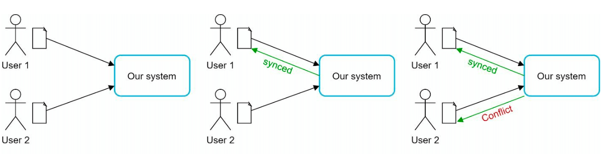
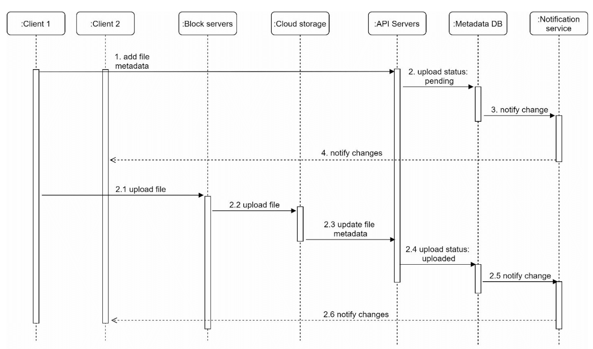

# 第 15 章：设计 Google Drive

> 原章节：Design Google Drive · 原项目路径 `15. Google Drive/`

## 本章导读

云盘看起来是个"存文件"的系统，好像没什么难的。但只要你用过它，就会遇到这些问题：

- 我在手机上改了一句话，为什么电脑上要等几秒才同步过来？它怎么知道文件变了？
- 同一个文件，我在两台设备上同时改了，会怎么样？会不会丢数据？
- 我改了一个 100 MB 文档里的一个错别字，为什么它不用重新上传 100 MB？
- 免费额度是 10 GB，可服务商有上千万用户，它真的准备了那么多硬盘吗？

**这一章真正的难点不是"存文件"，而是"同步"和"冲突"。** 存储本身早就被对象存储解决了；难的是让多台互不通信、时钟不同步、还经常离线的设备，最终对同一份数据达成一致，并且**一个字节都不能丢**。

学完这一章，你应该能回答：两台设备同时改了同一个文件，系统该怎么判？怎么只传变化的那一小块数据？服务器怎么把"文件变了"这件事告诉一百万个在线客户端？

## 你将学到

- 云盘系统的完整组件：块服务器、对象存储、元数据库、通知服务、离线队列
- **块级同步（Block-level Sync）** 的原理——为什么只传变化的数据块，以及**内容定义分块（CDC）** 如何解决"插入一个字节导致全文件重传"的问题
- **rsync 滚动校验和** 算法为什么能在 O(1) 时间内滑动窗口
- **增量同步（Delta Sync）** 的完整交互流程
- 文件同步的冲突解决：保留双副本、最后写入者胜出、**版本向量** 三种策略的取舍
- 通知服务的四种推送机制：长轮询、WebSocket、SSE、移动推送，以及各自的成本
- 存储成本优化：去重、压缩、冷热分层，以及它们各自踩的坑
- 元数据库的表结构设计，以及"块表"如何支撑去重和版本回溯

---

## 1. 需求与范围

### 功能需求

1. 上传和下载文件
2. 多设备之间同步文件
3. 保留文件修订历史（Revision History）
4. 支持带权限的文件分享
5. 文件被编辑、删除、分享时发送通知

### 非功能需求

| 需求 | 含义 |
|---|---|
| **可靠性** | **数据丢失是不可接受的**——这是整章最重要的一条约束 |
| **快速同步** | 同步延迟过高会让用户以为文件丢了 |
| **带宽效率** | 尽量少传数据（用户可能在移动网络下） |
| **可扩展性** | 支撑 1000 万日活用户 |
| **高可用** | 服务器故障或网络问题时仍能工作 |

> **「数据丢失不可接受」这条约束会一路决定后面的设计。** 它直接排除了"用时间戳做最后写入者胜出"这种简单但有损的冲突解决策略；它也让"主库故障后直接提升一个可能没同步完的副本"变成不可接受的操作。**记住这条约束，后面很多设计取舍就都有了理由。**

### 约束与假设

| 项目 | 取值 |
|---|---|
| 每个用户免费空间 | 10 GB |
| 单文件上限 | 10 GB |
| 平均上传文件大小 | 500 KB |
| 上传频率 | 每用户每天 2 个文件 |
| 总存储需求 | 500 PB |

> **勘误提示**：这里的「500 PB」按字面算不出来。`1000 万用户 × 10 GB = 100 PB`，只有 500 PB 的五分之一。详见文末【勘误与补充】。

---

## 2. 粗略估算：配额不等于实际占用

### 先算容量

```
配额总量 = 1000 万用户 × 10 GB = 100,000,000 GB = 100 PB
```

### 再算真实流量

```
每日新增文件数 = 1000 万 × 2 = 2000 万个
每日新增数据量 = 2000 万 × 500 KB = 10,000,000,000 KB ≈ 10 TB/天
一年累计 ≈ 10 TB × 365 ≈ 3.65 PB
```

**这两个数字放在一起，暴露了一个重要的认知**：

> **用户配额（100 PB）和实际占用（每年 3.65 PB）差了将近 30 倍。**
>
> 绝大多数用户根本用不满 10 GB。所以服务商**不会**真的准备 100 PB 硬盘——它们做的是**配额超卖（Oversubscription）**：承诺的容量远大于实际物理容量，靠"大多数人用不满"这个统计规律来运营。
>
> **这是所有存储型业务的商业模型基础**，也是为什么"免费 10 GB"这种承诺在经济上成立。

**但设计系统时，你仍然要按最坏情况估算**：如果某个用户真的传了 10 GB 的大文件（比如一个视频工程），你的单文件上传通道必须能扛住。**这就是为什么需要块级上传和断点续传，而不是简单的 HTTP POST。**

### 500 PB 是怎么来的？

如果一定要凑到 500 PB，需要额外的放大假设：

```
100 PB（用户数据）
  × 约 2 倍（保留多版本历史）
  × 约 2.5 倍（多副本或纠删码冗余）
  ≈ 500 PB
```

这个推导是自洽的，**但原笔记完全没有给出，读者无法复现**。详见文末【勘误与补充】。

---

## 3. 单机起步：命名空间（Namespace）

<div align="center">
  
</div>

最简单的方案：

1. **Web 服务器**：处理上传和下载
2. **元数据库**：记录用户信息、登录信息、文件信息
3. **存储目录**：按命名空间组织的文件目录

目录结构是这样的：

```
drive/                      ← 根目录
├── namespace_user_A/       ← 用户 A 的命名空间
│   ├── report.docx
│   └── photos/
│       └── trip.jpg
├── namespace_user_B/
│   └── notes.md
└── ...
```

**关键设计：每个文件或文件夹由「命名空间 + 相对路径」唯一确定。**

```
namespace_user_A + "photos/trip.jpg"  →  唯一确定一个文件
```

### 为什么这个模型不够用

这个方案有三个致命问题：

**① 无法扩展。** 所有文件在一台机器的文件系统里，容量和 IOPS 都有上限。

**② 没有冗余。** 磁盘坏了，数据就没了——而我们的约束是"数据丢失不可接受"。

**③ 命名空间模型撑不住「分享」。** 这是最容易被忽略的一点。

> **补充：为什么"命名空间 + 路径"模型和分享功能天然冲突？**
>
> 命名空间模型隐含一个假设：**一个文件只属于一个用户**。但分享会打破它——用户 A 把一个文件夹分享给 B 之后，这个文件夹同时属于两个人的"视图"。
>
> 更麻烦的是**同一份物理数据会出现在两个命名空间里**，如果你按命名空间存副本，那就产生了冗余和不一致；如果不存副本而只存引用，那"路径"就不再是唯一标识了。
>
> **真实云盘的解法是：抛弃路径作为唯一标识，改用「文件 ID + 父子关系」。** 文件有自己的 ID，路径只是"从根节点走下来的一个视图"。这样一个文件可以被多个父节点引用，分享就变成了"在别人的目录树里加一个引用"。**这是从"文件系统模型"转向"图模型"的关键一步。**

### API 设计

**① 上传文件**，支持两种模式：

- **简单上传（Simple Upload）**：文件小的时候用，一次 HTTP 请求搞定。
- **可续传上传（Resumable Upload）**：
  - 端点：`https://api.example.com/files/upload?uploadType=resumable`
  - 先发一个初始请求，拿到一个可续传的 URL；
  - 然后上传数据并监控上传状态；
  - 如果中断，从断点继续。

**② 下载文件**

- 端点：`https://api.example.com/files/download`

**③ 获取文件修订历史**

- 端点：`https://api.example.com/files/list_revisions`

> **为什么必须支持可续传上传？** 因为单文件上限是 10 GB，而 10 GB 在移动网络下几乎不可能一次传完。**可续传不是优化，是功能必需。**

---

## 4. 走向分布式

原笔记给出了四项改进，都正确：

**① 分片（Sharding）**：按 `user_id` 把存储分散到多台服务器上。

> **为什么选 `user_id` 作为分片键？** 因为云盘的访问模式是"用户只看自己的文件"——按 `user_id` 分片后，一个用户的所有文件都在同一片上，**避免了跨分片查询**。如果按文件 ID 随机分片，那么"列出我的所有文件"就要查遍所有分片。

**② 对象存储（Amazon S3）**：用 S3 做可扩展、有冗余的文件存储，并开启**跨区域复制（Cross-Region Replication）**。

<div align="center">
  
</div>

**③ 负载均衡器**：把流量分发到多台 Web 服务器。

**④ 元数据库复制**：通过数据库分片和复制保证可用性。

> **这里的分工要讲清楚：**
> - **文件内容（字节）** 存对象存储。它天然支持近乎无限的容量、多副本冗余、按量计费。
> - **文件元数据（谁、什么时候、多大、叫什么）** 存关系型数据库。它需要事务、需要 JOIN、需要一致性。
>
> **把这两者分开，是云盘架构的第一个关键决策。** 混在一起（比如把元数据也存成 S3 里的 JSON）会让你在"查我最近修改的 10 个文件"这种查询上付出巨大代价。

### 同步冲突：一个例子

<div align="center">
  
</div>

原笔记给的例子：

- 用户 1 和用户 2 同时尝试更新同一个文件，但用户 1 的操作先被系统处理。
- 用户 1 的更新成功了，用户 2 收到一个**同步冲突（Sync Conflict）**。
- 系统把同一份文件的两个副本都呈现出来：用户 2 的本地副本，和服务端的最新版本。
- 用户 2 可以选择合并两个文件，或者用一个覆盖另一个。

**这个例子本身是对的，但它只讲了"发现冲突之后怎么办"，没有讲"系统怎么知道这里发生了冲突"。** 后者才是真正的难点，见第 6 节。

---

## 5. 改进后的高层设计

<div align="center">
  
</div>

九个组件，逐个说明：

**① 用户交互（User Interaction）**
用户通过浏览器或移动 App 访问。

**② 块服务器（Block Servers）**
- 文件被切成**最大 4 MB 的块（Block）**，每块分配一个**唯一的哈希值**；
- 各块**独立地**存放在云存储（如 Amazon S3）中；
- 重建文件时，按特定顺序把这些块拼起来。

> **这是整章最重要的一个设计。** 一旦文件被拆成"按内容哈希寻址的块"，三件事同时变得可能：**去重**（相同哈希的块只存一份）、**增量同步**（只传变化的块）、**断点续传**（块是天然的重传单位）。第 10 节会详细展开。

**③ 云存储（Cloud Storage）**
块存放在云存储中，获得可扩展性和冗余。

**④ 冷存储（Cold Storage）**
不活跃的文件迁移到冷存储以降低成本。

**⑤ 负载均衡器（Load Balancer）**
把请求均匀分发给 API 服务器。

**⑥ API 服务器（API Servers）**
- 处理用户认证、资料管理、文件元数据更新；
- 管理所有**非上传类**的工作流。

**⑦ 元数据库与缓存（Metadata Database and Cache）**
- 存储用户、文件、块、版本的元数据；
- 频繁访问的元数据缓存起来以加快读取。

**⑧ 通知服务（Notification Service）**
- 一个**发布/订阅（Publisher/Subscriber）系统**，把文件变化（新增、编辑、删除）通知给客户端；
- 保证客户端能拉取到最新的更新。

**⑨ 离线备份队列（Offline Backup Queue）**
临时保存文件变更信息，供离线客户端在恢复在线后同步。

> **注意 ⑧ 和 ⑨ 的分工**：⑧ 负责**在线**推送，⑨ 负责**离线**暂存。**这个"在线推送 + 离线队列"的组合，是所有移动端同步系统的标准模式**——因为你永远不知道客户端此刻在不在线。

---

## 6. 核心难点：同步冲突的判定与解决

这是本章最需要讲透的部分。原笔记只给了一个"冲突发生了"的例子，但没讲清楚**系统凭什么判定这里存在冲突**。

### 先分清两类"冲突"

很多人把这两件事混为一谈：

| 类型 | 场景 | 是否需要"解决冲突" |
|---|---|---|
| **假冲突（顺序更新）** | 设备 A 改了文件，同步完成；之后设备 B 才改 | **不需要**。B 的版本本来就基于 A 的版本，直接采用 B 的即可 |
| **真冲突（并发更新）** | 设备 A 和 B 在**互不知情**的情况下同时改了同一个文件 | **需要**。两个版本都基于同一个旧版本，谁也不是谁的后续 |

**关键问题是：如何区分这两者？**

### 策略一：最后写入者胜出（Last-Write-Wins, LWW）

最简单的策略：谁的时间戳晚，谁赢。

**优点**：实现极简单，不需要额外的元数据。

**缺点（很致命）**：

1. **会丢数据。** 输的那一方的修改被直接丢弃。而我们的约束是"数据丢失不可接受"——**LWW 直接违反了这个约束。**
2. **时间戳不可信。** 设备的系统时钟可能不准（用户手动改过、时区错误、电池耗尽后重置）。一台时钟慢了 5 分钟的设备，它的修改永远赢不了。
3. **无法区分并发与顺序。** 设备 A 在 10:00:00 修改，设备 B 在 10:00:01 修改，但 B 根本没看到 A 的修改——LWW 会认为 B 赢了，于是 A 的修改被静默丢弃。

> **结论：对云盘这种"数据丢失不可接受"的系统，LWW 是不可接受的。** 它只适合那些"丢掉旧值无所谓"的场景，比如用户在线状态、最后活跃时间这类可重算的数据。

### 策略二：保留双副本（Keep Both Copies）

**这是 Google Drive 和 Dropbox 实际采用的做法。** 检测到冲突时：

- 服务端保留自己的版本；
- 把客户端的版本另存为一个新文件，文件名带上冲突标记，例如
  `report (conflicted copy 2026-09-20).docx`；
- 通知用户"这里有个冲突，你来处理"。

**优点**：
- **零数据丢失**，符合"数据丢失不可接受"的约束；
- 不需要用户实时在线就能保证安全。

**缺点**：
- 用户要手动清理，长期使用会积累一堆 `conflicted copy` 文件；
- 冲突频繁时体验很差。

> **注意原笔记的表述**：原笔记在 File Sync 一节写的是「**First processed version wins**」（先被处理的版本胜出）。这个说法和它自己在 Sync Conflicts 一节写的"两个副本都保留"是一致的——因为"胜出"指的是**哪个版本继续用原文件名**，而不是"哪个版本被丢弃"。但**"wins"这个词极具误导性**，读者很容易理解成"输的那个被删掉了"，从而和"数据丢失不可接受"产生矛盾。详见文末【勘误与补充】。

### 策略三：版本向量（Version Vector）

**这是唯一能在原理上正确区分"顺序更新"和"并发更新"的方法。** 现代同步系统（包括分布式数据库）普遍使用它。

**核心思想**：每个设备维护一个计数器向量，记录"我知道每个设备写到了第几版"。

假设有两个设备 A 和 B。文件的当前版本向量是 `{A: 3, B: 5}`，意思是"A 写到了第 3 版，B 写到了第 5 版，且双方都已知晓"。

设备要写入时，**把自己那一项加一**。比较两个版本时：

```
若 V1 的每一项都 ≥ V2 的对应项，且 V1 ≠ V2
    → V1 支配（dominates）V2，说明 V2 是 V1 的祖先，属顺序更新，无冲突，V1 胜出
若 V1 和 V2 互不支配
    → 真并发冲突，必须保留双副本交给用户处理
```

**举例说明：**

| 场景 | A 的版本 | B 的版本 | 判定 | 处理 |
|---|---|---|---|---|
| B 在 A 同步完成后才改 | `{A:2, B:1}` | `{A:2, B:2}` | A 支配 B | 顺序更新，采用 B |
| A 和 B 离线各改各的 | `{A:2, B:1}` | `{A:1, B:2}` | 互不支配 | **真冲突**，保留双副本 |
| 三方都改过 | `{A:2, B:2, C:1}` | `{A:1, B:2, C:2}` | 互不支配 | **真冲突** |

> **版本向量为什么能解决问题？** 因为它记录的是**因果关系**，而不是**墙上时钟**。设备不需要知道"现在几点"，只需要知道"我基于哪个版本改的"。**因果关系不受时钟漂移影响，这是它相对 LWW 的根本优势。**

**版本向量的代价**：

- 向量长度随设备数增长。一个用户有 5 台设备，向量就有 5 项；有 50 台设备就很占空间。实际实现中常用**版本向量 + 修剪**，或者用 **Dotted Version Vector** 等变体来控制体积。
- 需要在文件级（而不是块级）维护——块级维护版本向量的开销太大，没有必要。

### 那实时协同编辑呢？

如果你要设计的是**Google Docs**（多人同时在一个文档里打字），上面这套都不够用，因为冲突粒度是"字符"而不是"文件"。那类系统用的是：

- **OT（Operational Transformation，操作变换）**：把编辑操作做变换后重新应用；
- **CRDT（Conflict-free Replicated Data Type，无冲突复制数据类型）**：设计出天然可交换、可合并的数据结构。

> **但对云盘来说不需要。** 云盘的同步粒度是"整个文件"，用户不会期望两个人在同一个 `.docx` 上逐字协同。**选对粒度，是避免过度设计的关键。**

---

## 7. 元数据库设计

<div align="center">
  
</div>

原笔记给出四张核心表：

| 表 | 作用 |
|---|---|
| **用户表（User）** | 用户资料和偏好设置 |
| **文件表（File）** | 文件元数据：大小、名称、路径 |
| **块表（Block）** | 记录文件的各个块，用于重建文件 |
| **文件版本表（File Version）** | 保存文件修订历史 |

**这四张表的相互关系，是理解整个系统数据模型的关键：**

```
User  ──1:N──▶  File  ──1:N──▶  File Version  ──N:M──▶  Block
                 │                     │                    │
              "谁拥有"            "第几版"          "按内容哈希寻址的物理块"
```

**几个关键设计点：**

**① `File` 和 `File Version` 必须分开。**
`File` 存的是"这个概念"（名称、路径、所有者），`File Version` 存的是"某个时刻的内容"（大小、块的列表、时间戳）。**分开之后，"查看历史版本"和"回滚到某一版"就变成了简单查询，而不是"去备份系统里捞文件"。**

**② `File Version` 与 `Block` 是多对多关系。**
一个版本包含多个块，而同一个块可以被多个版本引用——**这正是去重的实现方式**。你只改了一个 4 MB 的块，新旧两个版本共享其余所有块，存储只增加了一个块。

**③ `Block` 表按内容哈希索引。**
块表的主键应该是**块的哈希值**，而不是自增 ID。这样"这个块我是不是已经存过了"就变成一次主键查询，O(1)。

**④ 块是引用计数的（Reference Counting）。**
多个版本可能引用同一个块。删除文件时，**不能直接删块**，必须先检查引用计数——只有当没有任何版本引用这个块时，才能真正删除。这是垃圾回收（GC）逻辑的核心，也是很多自研云盘系统出现"误删数据"bug 的地方。

---

## 8. 文件上传流程

<div align="center">
  
</div>

原笔记给的流程：

1. **文件上传**：文件被块服务器切块、压缩、加密；块上传到块服务器，再存进 S3。
2. **元数据上传**：客户端把元数据发给 API 服务器；元数据以 `pending` 状态存入数据库。
3. **完成**：S3 触发回调，把文件状态更新为 `uploaded`；通知服务通知相关用户。

**这个流程里有三个值得展开的工程细节：**

### 细节一：压缩和加密的顺序不能颠倒

必须是 **先压缩，再加密**。

**为什么？** 因为加密会把数据变成高熵的伪随机字节流，**几乎无法再被压缩**。如果先加密再压缩，压缩算法看到的是一堆随机数据，压缩率接近 1:1，白费 CPU。

> 这个顺序问题在工程上很容易搞错，而且错了之后**不会有报错**——系统照常运行，只是存储和带宽成本悄悄翻倍。

### 细节二：`pending` 状态是必须的

元数据在视频/文件字节上传完成**之前**就已经写进数据库了。这是"并行上传"的必然结果（第 14 章讲过同样的模式）。所以必须有状态机：

```
pending（元数据已到，字节未到）
   ↓ S3 回调确认所有块到齐
uploaded（可以下载）
   ↓
deleted（软删除，等待 GC）
```

**如果没有这个状态机**，用户在字节还没传完时去下载，会拿到一个不完整的文件——而且**下载不会报错**，只会得到一个损坏的文件。这类 bug 极其难排查。

### 细节三：为什么用回调（Callback）而不是轮询

S3 上传完成后主动回调 API 服务器，比客户端或服务端轮询"传完了吗"要高效得多。**轮询会浪费大量无意义的请求**，而回调只在真正完成时触发一次。

> **代价**：回调可能丢失或重复。所以回调处理必须**幂等**，并且要有一个兜底的**对账任务**（比如每 10 分钟扫描一次超过 30 分钟仍处于 `pending` 的记录，去 S3 核对块是否齐全）。

---

## 9. 块级同步：云盘省带宽的核心

这是原笔记讲得最浅、但工程价值最高的一块。原笔记只写了一句「Delta Sync: Transfer only modified blocks instead of the entire file」。**但"只传变化的块"这句话里藏着整个云盘系统最精妙的一个算法问题。**

### 问题：什么是"变化的块"？

假设你有一个 100 MB 的文件，被切成 25 个 4 MB 的固定大小块：

```
块1 块2 块3 ... 块25     （每个 4 MB）
```

现在你在文件的**最开头**插入了一个字节。

**用固定大小切块会发生什么？**

```
原始：  [ABCD][EFGH][IJKL][MNOP]...
插入后：[XABC][DEFG][HIJK][LMNO][P...]
```

**每一个块的边界都向右移了一位，所以每一个块的内容都变了。** 25 个块的哈希全部不同 → **系统认为整个文件都变了，要重新上传 100 MB。**

> **这就是固定大小分块的致命缺陷：一次头部插入，导致全文件重传。** 而这恰恰是最常见的编辑模式——在文档开头加一段话、在代码文件顶部加一个 import、在表格最前面插入一行。

### 解法一：rsync 的滚动校验和

rsync 解决这个问题的方法非常巧妙：**它不假设块的边界是固定的，而是在旧文件里"滑动"地寻找匹配。**

**流程（简化版）：**

1. **接收方（服务端）**把旧文件按固定大小切块，对每块计算两个校验和：
   - **弱校验和（Weak Checksum）**：Adler-32 变体，用于快速筛选；
   - **强校验和（Strong Checksum）**：MD5（现代实现多用 xxHash、BLAKE3），用于最终确认。
   把这些校验和发给发送方（客户端）。

2. **发送方（客户端）**拿着旧文件的校验和列表，在自己的新文件上**逐字节滑动一个窗口**：
   - 对当前窗口算弱校验和；
   - 在旧块的弱校验和哈希表里查；
   - **没命中 → 窗口向右滑一个字节，继续**；
   - **命中 → 再用强校验和确认**。确认通过，说明"这段内容和旧文件的某一块完全相同"，于是标记为"复用"，窗口直接跳过这一整块。

3. **最终，发送方只把"没有匹配上的那些片段"发给接收方**，并附带一份"如何把复用片段和新片段拼起来"的指令列表。

**关键点：弱校验和是「可滚动的（Rolling）」**

rsync 的弱校验和定义为：

```
a(k, l) = (Σ Xi) mod M                    （窗口内所有字节的和）
b(k, l) = (Σ (l - i + 1) · Xi) mod M      （字节的加权和）
s = a + 2^16 · b
```

**它的妙处在于：当窗口向右滑动一个字节时，a 和 b 都可以在 O(1) 时间内更新，而不需要重新遍历整个窗口。**

```
滑出字节 X_out，滑入字节 X_in：
a' = a - X_out + X_in
b' = b - (l - k + 1) · X_out + a'
```

**这就是"滚动"的含义。** 如果没有这个性质，每次滑动都要重新计算整个窗口的校验和，算法复杂度会从 O(n) 退化到 O(n × 窗口大小)，完全不可用。

> **这是计算机科学里一个非常漂亮的技巧**，值得记住它的思想：**设计一个"增量可更新"的摘要函数，让滑动窗口的代价从 O(w) 降到 O(1)。**

### 解法二：内容定义分块（CDC）

rsync 是"客户端和服务端协商"，适合点对点的场景。**在云盘这种"客户端上传到对象存储"的架构里，更常用的方案是内容定义分块（Content-Defined Chunking, CDC）。**

**核心思想：让块的边界由「内容」决定，而不是由「位置」决定。**

具体做法：用一个**滚动哈希**（Rabin 指纹，或 FastCDC 里用的 Gear hash）扫过整个文件。**当哈希值满足某个条件时（比如 `hash mod 2^22 == 0`），就在这里切一刀。**

因为切分条件只依赖"当前位置往前的一段字节内容"，所以：

```
原始：  ...数据A[边界]数据B...
插入后：...数据A[X]数据B...
```

**在插入点之前，所有边界位置完全不变；插入点之后，边界也会在很短的范围内重新对齐到原来的位置。** 结果就是：**只有插入点附近的一两个块变了，其余块的哈希完全不变。**

<div align="center">
  
</div>

**对比一下那个 100 MB 文件的例子：**

| 方案 | 头部插入 1 字节后需要上传的数据量 |
|---|---|
| 固定 4 MB 分块 | **100 MB**（全部重传） |
| 内容定义分块（平均 4 MB） | **约 4～8 MB**（只有插入点附近变了） |

**节省超过 90%。**

**CDC 的代价：**

1. **块大小不固定**，所以元数据里必须记录每个块的边界（或长度），索引结构更复杂。
2. **需要调参**：要设置最小块大小（避免产生大量碎片）、平均块大小、最大块大小。参数没调好会导致块数量爆炸或去重效果差。
3. **滚动哈希的计算有 CPU 开销**，不过 FastCDC 这类优化实现已经把它压得很低了。

> **工业界的现实**：Google Drive、Dropbox、restic、BorgBackup 等系统都用的是 CDC 思路。**你不需要自己实现它，但必须知道"为什么固定分块不行"，这是面试里的高频考点。**

### Delta Sync 的完整交互

<div align="center">
  
</div>

把上面的原理串成一个完整的交互流程：

1. **客户端切块**：本地按 CDC 把文件切成块，计算每块的哈希。
2. **客户端上报块清单**：只发哈希列表（每块约 32 字节），不发数据。
   - 一个 100 MB 的文件分成 25 块，清单只有约 800 字节。
3. **服务端比对**：对每个哈希查块表，返回"哪些块我还没有"。
4. **客户端只上传缺失的块**。
5. **服务端组装**：把新块和已有的块按顺序拼成新版本，写入 `File Version` 表。

> **注意第 3 步的价值**：它同时实现了**去重**。如果另一个用户（或者你自己的另一个文件）已经上传过内容相同的块，服务端直接说"我有了"，**一个字节都不用传**。**增量同步和去重，本质上是同一个机制的两个侧面。**

---

## 10. 文件同步：压缩与冲突处理

原笔记在 File Sync 一节给了三点：

1. **增量同步（Delta Sync）**：只传变化的块，不传整个文件（详见第 9 节）。
2. **压缩（Compression）**：按文件类型选择合适的压缩算法。
3. **冲突解决（Conflict Resolution）**：
   - 先被处理的版本胜出；
   - 冲突的版本单独保存，交给用户解决。

**关于压缩，补充一点：压缩算法的选择要看数据类型。**

| 数据类型 | 建议 | 原因 |
|---|---|---|
| 文本、代码、日志 | 通用压缩（zstd、gzip） | 压缩比高，通常能到 3:1 以上 |
| 图片（JPEG/PNG）、视频、音频 | **不要压缩** | 这些格式本身已经是压缩格式，再压几乎没收益，纯浪费 CPU |
| 数据库文件、虚拟机镜像 | 通用压缩 | 通常有大量重复模式 |

> **"对已压缩数据再压缩"是一个常见的性能陷阱**：CPU 100% 跑满，存储只省了 1%。生产系统一般用**文件扩展名 + 魔数（Magic Number）** 做白名单，只对已知可压缩的类型启用压缩。

**关于冲突解决**，详见第 6 节——那里给出了三种策略的完整对比。这里只强调一句：

> 原笔记写的「First processed version wins」在**结果上是正确的**（它指的是"哪个版本保留原文件名"），但**用词有严重误导性**。详见文末【勘误与补充】。

---

## 11. 文件下载流程

<div align="center">
  
</div>

下载流程由"别处新增或修改了文件"触发。客户端有两种途径知道这件事：

- **客户端 A 在线时**：如果文件被别的客户端改了，**通知服务会主动告诉 A**。
- **客户端 A 离线时**：变更信息被存入缓存（离线备份队列）；等 A 重新上线，它主动拉取最新的变更。

**一旦客户端知道文件变了，它会：**

1. **触发（Trigger）**：通知服务告知客户端有文件更新。
2. **拉取元数据（Metadata Fetch）**：客户端通过 API 服务器获取更新后的元数据——**注意是拉取，不是推送**。
3. **下载块（Block Download）**：客户端从块服务器下载**变化的块**，重建文件。

> **第 2 步和第 3 步的顺序至关重要：先元数据，后数据。**
>
> 因为元数据里才有"这个新版本由哪些块组成、每块的哈希是什么"这份清单。客户端拿着清单才能算出"我本地已经有哪些块、还缺哪些块"——**于是下载也变成了增量的**。
>
> **这就是为什么"通知"只需要是一个信号，而不需要携带数据。** 第 12 节会展开这一点。

---

## 12. 通知服务：怎么知道别的设备改了文件

原笔记只写了三行：「目的是让客户端了解文件变化；机制是实现**长轮询（Long Polling）** 做异步通知；当文件被新增、编辑或删除时，通知被推送给所有相关客户端。」

**长轮询只是四种机制之一，而且不一定是最优选择。** 这里把四种都讲清楚。

### 四种推送机制对比

| 机制 | 原理 | 优点 | 缺点 | 适用场景 |
|---|---|---|---|---|
| **长轮询（Long Polling）** | 客户端发一个请求，服务端**不立即返回**，而是挂起（如 30～60 秒）；有事件就立即返回，超时就返回空，客户端马上再发一个 | 实现简单；兼容所有代理和防火墙；不需要协议升级 | **每个客户端占用一个连接**；服务端连接数压力大；事件到达有"返回 + 重新发起"的空窗期 | 兼容性优先的场景，原笔记的选择 |
| **WebSocket** | 通过 HTTP Upgrade 建立全双工长连接 | 真正的双向实时；服务端可随时推送；无空窗期 | 需要负载均衡器支持协议升级；连接状态管理复杂；断线重连要处理 | 桌面客户端、Web 端 |
| **SSE（Server-Sent Events）** | 基于 HTTP 的**单向**服务端推送流 | 比 WebSocket 简单；自动重连；走标准 HTTP | 只能服务端→客户端单向；HTTP/1.1 下每个连接占用一个 TCP 连接 | 只需服务端推送的场景 |
| **移动推送（APNs / FCM）** | 通过 Apple / Google 的推送通道唤醒 App | **App 被杀死或后台时也能收到**；省电 | 不保证送达、不保证时效；载荷有大小限制；依赖第三方 | 移动端**必须**用 |

### 推荐架构：混合方案

**没有任何一种机制能覆盖所有场景**，实际系统都是组合使用：

```
桌面客户端  ──▶ WebSocket（长连接，实时）
Web 客户端  ──▶ SSE 或 WebSocket
移动 App    ──▶ APNs / FCM 推送（唤醒）──▶ 再走 API 拉取变更
```

### 最关键的设计原则：通知只是「提示」，不是「数据」

> **通知服务绝不能承担"传输变更内容"的职责，它只负责告诉客户端"有东西变了，去拉一下"。**

**为什么？** 因为通知是**不可靠**的：

- 长轮询会超时；
- WebSocket 会断线；
- 移动推送会丢失、会被系统延迟批量下发；
- 服务端在推送过程中崩溃，事件就没了。

**如果通知里带着数据，丢了就等于丢数据。** 但如果通知只是"嘿，去看看"的提示，那么：

- 通知丢了 → 客户端下一次轮询/重连时会发现；
- 通知重复了 → 客户端拉取是幂等的，重复拉取没有副作用；
- 通知乱序了 → 客户端以服务端返回的版本号为准，不依赖通知顺序。

**这个模式叫「提示式通知（Hint-based Notification）」，是所有可靠同步系统的基石。** 面试时主动讲出这一点，是很强的加分项。

### 容量估算：长轮询到底贵不贵

假设 1000 万 DAU，高峰期 10% 在线，即 **100 万个并发连接**。

| 资源 | 估算 |
|---|---|
| 文件描述符 | 每个连接 1 个 fd。Linux 默认 `ulimit -n` 是 1024，**必须调大到 10 万以上**，或用 epoll 多路复用 |
| 内存 | 每个挂起的连接约占几十 KB 到上百 KB（请求上下文、缓冲区）。100 万 × 50 KB ≈ **50 GB** |
| 服务器数量 | 按每台 10 万连接算，需要 **约 10 台** 专门的推送服务器 |

**这就引出了两个设计要点：**

1. **通知服务必须按 `user_id` 分片。** 一个用户的多个设备要连到**同一台**通知服务器（用一致性哈希路由），否则服务端要跨机器广播，成本极高。
2. **必须有重连风暴的防护。** 一次部署或一次故障，100 万客户端会同时重连，瞬间把服务器打爆。防护手段是**客户端重连加随机抖动（Jitter）**，把重连时间摊开。这个手法和"缓存过期时间加抖动"是同一个思想。

---

## 13. 存储成本优化

原笔记给了三条，都正确。这里补充每条背后的坑。

### ① 去重（De-duplication）

原笔记写的是「**在账户级别**用基于哈希的比对移除重复的块」。

**这里有个重要的取舍需要补充：**

| 去重范围 | 节省效果 | 问题 |
|---|---|---|
| **账户级（同一用户内部）** | 一般 | 单个用户很少存大量重复文件，收益有限 |
| **全局（跨所有用户）** | **高** | 有**隐私侧信道风险** |

**全局去重的隐私问题是什么？**

如果系统跨用户去重，那么"这个块是否存在"就泄露了信息。攻击者可以：

1. 拿到一份疑似存在的文件（比如某公司的内部文档）；
2. 计算它的哈希；
3. 尝试上传；
4. **如果系统回答"这个块我已经有了，不用传"，就证明了别人也拥有这份文件。**

这就是著名的 **"learn-the-hash" 攻击**。Dropbox 早期因为做全局去重而受到过这类质疑。

**还有一个更根本的矛盾：加密会破坏去重。**

- 如果每个用户用**自己的密钥**加密，那么相同的明文块会产生**不同的密文**，哈希也就不同 → **去重彻底失效**。
- 如果为了让去重生效而用**收敛加密（Convergent Encryption）**（密钥 = 明文的哈希），那么相同明文产生相同密文 → 去重生效，但**又回到了上面那个隐私问题**。

> **结论：去重、加密、隐私，这三者只能取其二。** 这是一个真实的、没有完美解的系统设计权衡。面试时能主动指出这个矛盾，比单纯说"用哈希去重"要深得多。

### ② 版本控制策略

原笔记的两条建议：

- 限制保存的修订数量；
- 对频繁编辑的文件优先保留近期版本。

**补充：这就是"保留策略（Retention Policy）"。** 常见的分级做法：

```
最近 30 天：保留每一个版本
30 天 ~ 1 年：每小时保留一个
1 年以上：每天保留一个
超过 5 年：只保留每月一个
```

> **为什么可以这样砍？** 因为"回滚到某个版本"的需求，**越久远的版本被回滚的概率越低**，而且久远版本的精确度要求也越低（没人会想回滚到"三个月前某天的 14:32"这一版）。**这是用"精度"换"成本"的经典思路。**

### ③ 冷存储（Cold Storage）

把很少访问的文件迁到更便宜的存储，例如 Amazon S3 Glacier。

**必须补充的坑：冷存储的取回是有延迟的。**

| 存储层级 | 取回延迟 | 相对成本 |
|---|---|---|
| 标准存储 | 毫秒级 | 基准 |
| 低频访问（IA） | 毫秒级 | 较低 |
| **Glacier 即时取回（Instant Retrieval）** | 毫秒级 | 中等 |
| **Glacier 弹性取回（Flexible Retrieval）** | **分钟到小时级** | 低 |
| **Glacier 深度归档（Deep Archive）** | **小时级** | 最低 |

**这意味着你不能随便把文件扔进最便宜的层级。** 如果用户第二天突然要打开一个被归档到 Deep Archive 的文件，他要等几个小时——这在产品上完全不可接受。

**正确做法**：基于**访问时间（Last Access Time）** 制定生命周期策略，并且**分级下沉**：

```
90 天未访问  → 低频访问层
1 年未访问   → Glacier 即时取回层
3 年未访问   → Glacier 深度归档
```

> **注意"记录访问时间"本身也有成本**：每次读取都写一次访问时间，会产生大量写操作。所以实际系统常用**抽样记录**或**按批次统计**，而不是精确记录每一次访问。

### 补充：纠删码（Erasure Coding）与三副本

原笔记没提这一点，但它对存储成本影响巨大。

- **三副本（3× Replication）**：每份数据存 3 个完整副本，存储开销 3 倍。读取快、恢复快。
- **纠删码（Erasure Coding）**：把数据切成 k 份，再计算出 m 份校验数据，共 k+m 份。比如 10+4 配置，存储开销只有 **1.4 倍**，能容忍任意 4 份丢失。

| 方案 | 存储开销 | 恢复代价 |
|---|---|---|
| 3 副本 | 3.0× | 低（直接复制） |
| 10+4 纠删码 | 1.4× | 高（要读 10 份并重算） |
| 6+3 纠删码 | 1.5× | 中 |

> **所以现代对象存储（包括 S3）普遍采用纠删码而不是三副本**，能省下一半以上的存储成本。代价是**恢复时需要读取多个节点并做计算**，恢复时间更长。**对冷数据（几乎不读）来说，这个代价完全可以接受。**

---

## 14. 故障处理

原笔记给了五条，逐条分析并补充：

**① 负载均衡器故障**
备用负载均衡器接管（主备模式）。

**② 块服务器故障**
待处理的任务重新分配给其他服务器。

> **补充**：块服务器是**无状态**的（块数据在对象存储里，不在块服务器本地），所以它可以随时被替换。**这正是把块存到对象存储而不是本地磁盘的价值。**

**③ 元数据库故障**
原笔记写的是「**Promote a slave node to master**（提升一个从节点为主节点）」，并把流量重定向到剩余副本。

> **这里有术语和逻辑两个问题**：
> - **术语**：`Master/Slave` 已被业界弃用，应使用 **Primary-Replica（主副本）**。详见文末【勘误与补充】。
> - **逻辑**：异步复制下，被提升的副本**可能还没有同步完最新数据**，提升它会**丢掉最后那一部分写入**——这**直接违反了本章"数据丢失不可接受"的约束**。

**④ 云存储故障**
用跨区域复制来获取不可用的文件。

**⑤ 通知服务故障**
客户端重连到其他服务器。

> **补充：客户端重连必须加随机抖动。** 通知服务挂掉时，100 万客户端会同时尝试重连。如果所有客户端都立刻重连，新服务器会瞬间被打爆，形成**重连风暴（Thundering Herd）**——结果就是整个服务雪崩。做法是：重连间隔 = 基础间隔 × (1 + 随机数)，并随重试次数指数增长。

---

## 勘误与补充

> 本节逐条指出原笔记中不准确、过时或缺失的地方。

### 勘误 1：「500 PB 总存储」没有给出推导，按字面算不出来

- **原文说法**：约束与假设中列出「Users get 10 GB free space」「10 million DAU」「Total storage required: 500 PB」。
- **问题**：按最直接的算法 `1000 万 × 10 GB = 100 PB`，**只有 500 PB 的五分之一**。原笔记没有给出任何推导过程，读者无法复现，也无法判断这个数字是否合理。
- **正确说法**：要得到 500 PB，需要补齐额外假设——约 2 倍的版本历史开销，再叠加约 2.5 倍的冗余（多副本或纠删码）：
  ```
  100 PB × 2（版本历史）× 2.5（冗余） ≈ 500 PB
  ```
  这个推导是自洽的，但**必须写出来**。
- **延伸**：更值得记住的是另一个事实——**用户配额（100 PB）和真实占用（约 3.65 PB/年）差了近 30 倍**。云盘业务的商业模型建立在**配额超卖**之上：承诺的容量远大于物理容量。作为工程师，你既要理解这一点，又**不能依赖它**——因为总有用户会把 10 GB 用满，你的上传通道必须扛得住。

### 勘误 2：「First processed version wins」用词有严重误导性

- **原文说法**：File Sync 一节写「**First processed version wins**（先被处理的版本胜出）」，同时又说「Conflicting versions are saved separately for user resolution（冲突版本单独保存，交给用户解决）」。
- **问题**：这两句话在**逻辑上并不矛盾**（"胜出"指的是哪个版本继续用原文件名，而不是哪个版本被丢弃），但**"wins"这个词极具误导性**。读者几乎必然理解成"输的那个版本被删掉了"。而本章的非功能需求白纸黑字写着「**数据丢失是不可接受的**」——如果"胜出"意味着丢弃另一份，那就直接违反了这条约束。
- **正确说法**：应明确表述为「**服务端版本保留原文件名，客户端版本被另存为一个带冲突标记的新文件**」。这是 Google Drive 和 Dropbox 的实际行为，业界称为**保留双副本（Keep Both Copies）**。
  同时应说明：**判定"是否存在冲突"靠的是因果关系，不是时间戳**。文件级的时间戳或单调递增版本号**无法区分"顺序更新"和"并发更新"**——而只有并发更新才需要保留双副本。正确做法是**版本向量（Version Vector）**。详见第 6 节。
- **延伸**：**最后写入者胜出（LWW）看似简单，实则违反本章的核心约束**：它依赖墙上时钟（设备时钟可能不准），且无法区分并发与顺序，会静默丢弃数据。LWW 只适用于"丢掉旧值无所谓"的数据（如用户在线状态），**不适用于任何用户文件**。

### 勘误 3：「Master-Slave」是过时的术语

- **原文说法**：故障处理一节写「Promote a slave node to master（提升一个从节点为主节点）」。
- **问题**：`Master/Slave`（主/奴）因带有奴隶制隐喻，在技术社区已被广泛弃用，主流数据库厂商与开源社区均已改用新词。
- **正确说法**：使用 **Primary-Replica（主副本）** 或 **Leader-Follower（主从）**。
  - MySQL 官方：`SOURCE / REPLICA`（旧称 `MASTER / SLAVE`）
  - PostgreSQL：`Primary / Standby`
  - Redis：`Master / Replica`
  - Kafka：`Leader / Follower`
- **延伸**：这不只是用词问题。**用对术语，面试官会认为你了解现代实践**；用旧术语，可能被追问"你知道这个词已经被淘汰了吗"。

### 勘误 4：主库故障「提升副本」的做法，与本系统的核心约束冲突

- **原文说法**：Metadata Database Failure → `Promote a slave node to master`，并把流量重定向到剩余副本。
- **问题**：**异步复制**下，被提升的副本可能还落后于原主库。提升它的瞬间，**尚未复制过去的那部分写入就永久丢失了**。而本章的第一条非功能需求就是「**数据丢失是不可接受的**」。原笔记没有指出这个矛盾，也没有给出解法。
- **正确说法**：要满足"不丢数据"，必须做到：
  1. **使用半同步复制（Semi-Synchronous Replication）**：至少保证一台副本收到并持久化后才向客户端确认写入；
  2. **用 GTID / LSN 做精确的位点切换**，而不是"挑一台看起来最新的"；
  3. **用自动故障转移工具**（如 MySQL 生态的 Orchestrator、Vitess，PostgreSQL 的 Patroni）把切换时间压到秒级，避免人工误操作；
  4. **接受代价**：半同步会增加写延迟。这是一个明确的 **RPO / RTO 权衡**——RPO（恢复点目标）是"能容忍丢多少数据"，RTO（恢复时间目标）是"能容忍停多久"。**约束是 RPO = 0，那你就必须付这个延迟成本。**
- **延伸**：**"非功能需求"不是写在文档里好看的，它会一条条约束你的技术选型。** 本章的"数据丢失不可接受"这一条，同时排除了 LWW 冲突策略和异步复制的故障转移方案——**能看出这两处关联，就是系统设计能力成熟的标志。**

### 补充 1：块级同步与内容定义分块（CDC）

原笔记只有一句「只传变化的块」，完全没有解释**为什么固定大小分块会失效**。详见第 9 节。这是全章最重要的补充：**固定 4 MB 分块下，在文件开头插入一个字节会导致 100% 重传；内容定义分块能把重传量压到 5% 以下。**

### 补充 2：rsync 滚动校验和算法

原笔记只在延伸阅读里提了 delta sync，正文没有讲原理。详见第 9 节。核心是**弱校验和的增量可更新性**——它把滑动窗口的代价从 O(w) 降到 O(1)，这是整个算法能成立的前提。

### 补充 3：通知服务的四种机制与容量估算

原笔记只说了"用长轮询"。详见第 12 节。最重要的结论有两条：
- **没有一种机制能覆盖所有场景**，实际系统是 WebSocket / SSE / 长轮询 / 移动推送的混合方案；
- **通知只能作为"提示"，绝不能承载数据**——因为通知是不可靠的（会丢、会重、会乱序），而客户端拉取是幂等的。

### 补充 4：存储成本优化的三个隐藏矛盾

原笔记给了"去重 / 版本控制 / 冷存储"三条，方向都对，但都缺了关键的代价。详见第 13 节：
- **去重 vs 加密 vs 隐私，三者只能取其二**（收敛加密 + 全局去重会带来"learn-the-hash"侧信道）；
- **冷存储的取回有分钟到小时的延迟**，不能盲目下沉；
- **纠删码比三副本省一半以上存储**，代价是恢复更慢，适合冷数据。

### 补充 5：命名空间模型无法支撑「分享」

原笔记用"命名空间 + 相对路径"作为文件的唯一标识。这在单机阶段没问题，但**分享功能会打破"一个文件只属于一个用户"这个隐含假设**。详见第 3 节。真实云盘最终都转向了**「文件 ID + 父子引用」的图模型**，路径只是从根节点走下来的一个视图。

### 补充 6：`pending` 状态机与块引用计数

原笔记提到元数据以 `pending` 状态入库，但没有解释为什么必须有状态机，也没有提到块的引用计数。详见第 8 节和第 7 节：
- **没有 `pending` 状态机**，用户可能下载到不完整文件，而且**下载不会报错**；
- **没有块引用计数**，删除文件时可能误删仍被其他版本引用的块——这是自研云盘最常见的"数据丢失"事故来源。

### 补充 7：压缩必须在加密之前

原笔记只说了"按文件类型压缩"，没提顺序。详见第 8 节。**加密后的数据几乎不可压缩**，顺序搞反会让存储和带宽成本悄悄翻倍，而且不会有任何报错。

---

## 常见误区

| 误区 | 为什么错 | 正确理解 |
|---|---|---|
| 云盘就是"存文件"，难点在存储 | 对象存储早就解决了存储问题；真正的难点是**多设备一致性与冲突判定** | 难点是同步协议、冲突检测、增量传输，不是硬盘 |
| 用最后修改时间就能解决冲突 | 设备时钟可能不准；且时间戳**无法区分顺序更新与并发更新** | 用**版本向量**判断因果关系；无法判定顺序时保留双副本 |
| 冲突时"先处理的胜出"，另一份就丢了 | 这与"数据丢失不可接受"直接冲突 | 服务端版本保留原名，客户端版本另存为带冲突标记的新文件 |
| 文件改了一个字节，就要重新上传整个文件 | 如果按固定大小分块，确实会这样——这正是问题所在 | 用**内容定义分块（CDC）**，让边界由内容决定，只重传插入点附近的块 |
| 固定大小分块和内容定义分块差不多 | 固定分块下，**头部插入一个字节会让所有块边界偏移，导致全文件重传** | 编辑模式以"开头插入"为主时，两者差距可达 20 倍以上 |
| 去重总是好事，越多越好 | 全局去重会泄露"某人拥有某文件"的信息；且**加密会让去重彻底失效** | 去重、加密、隐私三者只能取其二，需要按业务选 |
| 通知服务可以把变更内容直接推给客户端 | 通知会丢失、重复、乱序；带数据就等于丢数据 | 通知只做"提示"，客户端收到后**主动拉取**权威数据 |
| 长轮询很便宜，开个连接而已 | 100 万并发连接意味着百万级 fd 和几十 GB 内存 | 必须按 `user_id` 分片、用 epoll 多路复用、并给重连加随机抖动 |
| 冷存储便宜，把老文件都迁过去 | Glacier 深度归档的取回要**小时级**，用户无法接受 | 按访问时间**分级下沉**，并保留"即时取回"这一层 |
| 块服务器挂了数据就丢了 | 块数据在对象存储里，块服务器本身是**无状态**的 | 块服务器可随时替换，任务重新分配即可 |
| 三副本是唯一的高可靠方案 | 纠删码（如 10+4）只需 1.4 倍存储就能容忍任意 4 份丢失 | 热数据用副本（恢复快），冷数据用纠删码（省钱） |

---

## 面试速记

- **一句话概括**：Google Drive 是一个**以「多设备最终一致」为核心难题的分布式同步系统**——它的技术重心不在"存"，而在"**怎么用最少的字节，让互不通信、时钟不同步、经常离线的设备，对同一份数据达成一致，且一个字节都不丢**"。

- **必答要点**：
  1. **内容与元数据分离**：文件字节存对象存储（按内容哈希寻址的块），元数据存关系型数据库（用户表 / 文件表 / 块表 / 版本表）。
  2. **块级同步 + 内容定义分块**：文件切成块，只传变化的块；用 CDC 而不是固定大小分块，避免"插入一个字节导致全文件重传"。
  3. **冲突判定靠因果关系，不靠时钟**：用版本向量区分"顺序更新"和"并发更新"；真冲突时**保留双副本**，绝不静默丢弃。
  4. **通知是提示，不是数据**：通知服务（长轮询 / WebSocket / 移动推送）只告诉客户端"有变化"，客户端再主动拉元数据 → 再拉缺失的块。因为通知不可靠，而拉取幂等。
  5. **状态机 + 引用计数**：元数据有 `pending → uploaded → deleted` 生命周期；块按引用计数回收，避免误删。

- **加分项**：
  1. 主动指出**去重、加密、隐私三者只能取其二**（收敛加密会导致 learn-the-hash 攻击）。
  2. 主动指出本章的"数据丢失不可接受"这条约束**同时排除了 LWW 冲突策略和异步复制的故障转移**，并给出替代方案（版本向量 / 半同步复制）。
  3. 主动提到 **CDC 让重传量从 100% 降到 5% 以下**，并说明"头部插入"是最常见的编辑模式。
  4. 主动说明**压缩必须在加密之前**，否则压缩率归零且不会报错。

- **高频追问**：
  1. *"两台设备同时改了同一个文件，怎么处理？"*
     → 先判因果：用版本向量比较两个版本，若一方支配另一方则是顺序更新，直接采用新的；若互不支配则是真并发冲突。冲突时服务端版本保留原文件名，客户端版本另存为带冲突标记的新文件并通知用户，保证零数据丢失。绝不用时间戳做 LWW，因为设备时钟不可信且无法区分并发与顺序。
  2. *"为什么不用固定大小分块？"*
     → 因为在文件开头插入少量数据会让所有块边界右移，每个块的哈希都变，导致 100% 重传。内容定义分块用滚动哈希让边界由内容决定，插入点之后很快重新对齐，只重传 1～2 个块。代价是块大小不固定，索引和参数调优更复杂。
  3. *"1000 万用户在线，通知服务怎么扛？"*
     → 按 `user_id` 一致性哈希分片，保证同一用户的所有设备连到同一台推送服务器；用 epoll 支撑单机十万级连接；把 `ulimit -n` 调高；客户端重连加随机抖动和指数退避，防重连风暴。移动端用 APNs/FCM 唤醒后走 API 拉取，不依赖推送通道传数据。
  4. *"怎么降低存储成本？"*
     → 四层手段：① 块级去重（注意加密与隐私的取舍）；② 版本保留策略按时间分级降精度；③ 按访问时间把冷数据分级下沉到低成本存储（注意取回延迟）；④ 冷数据用纠删码替代三副本，把存储开销从 3× 降到 1.4×。
  5. *"主库挂了怎么办？"*
     → 用半同步复制保证至少一台副本已持久化最新写入，用 GTID/LSN 精确定位切换位点，用自动故障转移工具把 RTO 压到秒级。因为本章约束是"数据丢失不可接受"（RPO = 0），不能依赖异步复制 + 直接提升副本。

---

## 延伸阅读

- [ByteByteGo 系统设计面试课程](https://bytebytego.com/courses/system-design-interview) — 原笔记的来源
- [rsync 算法技术报告](https://rsync.samba.org/tech_report/) — 滚动校验和与增量传输的原始论文
- [FastCDC 论文（USENIX ATC '16）](https://www.usenix.org/conference/atc16/technical-sessions/presentation/xia) — 现代内容定义分块算法
- [restic 设计文档](https://restic.readthedocs.io/en/stable/100_references.html) — 一个开源备份工具如何用 CDC + 去重组织存储，源码可读性很好
- [Google Drive 官方帮助：冲突文件](https://support.google.com/drive/answer/3143942) — 真实的冲突处理行为
- [Dropbox 技术博客：增量同步与去重](https://dropbox.tech/infrastructure) — 工业界实现细节
- [Amazon S3 存储类别对比](https://aws.amazon.com/s3/storage-classes/) — 冷热分层的取回延迟与成本
- [Amazon S3 生命周期策略](https://docs.aws.amazon.com/AmazonS3/latest/userguide/object-lifecycle-mgmt.html) — 如何按访问时间自动分层
- [CRDT 入门（Martin Kleppmann）](https://crdt.tech/) — 想深入实时协同编辑时的下一步
