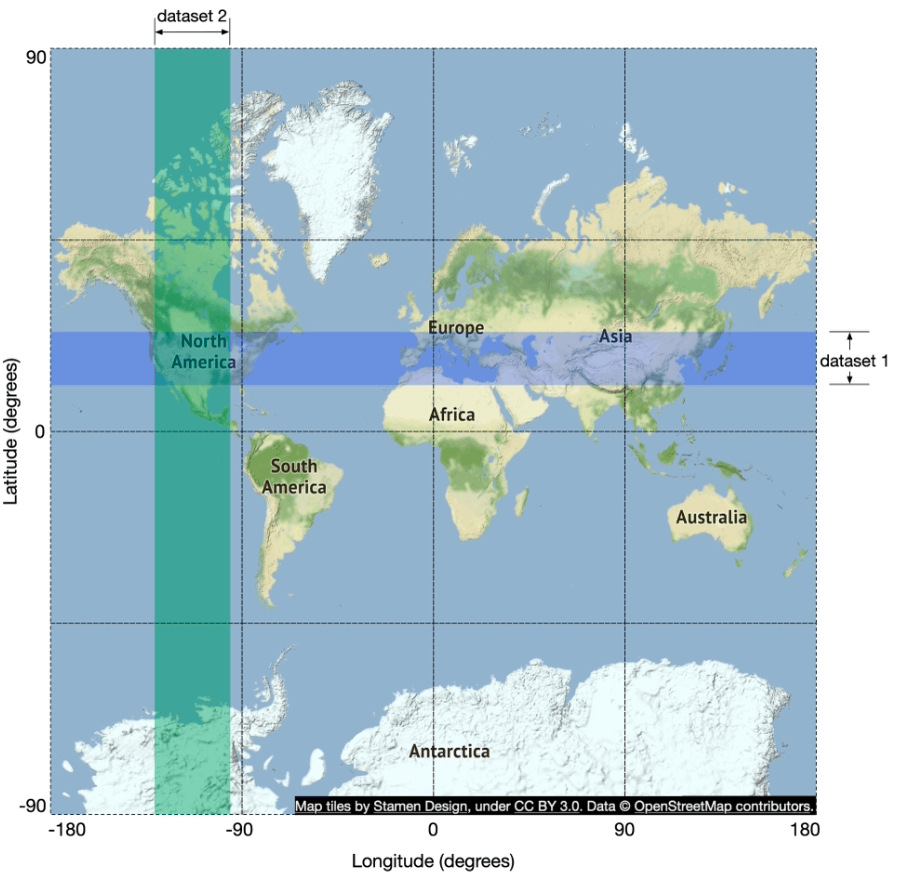
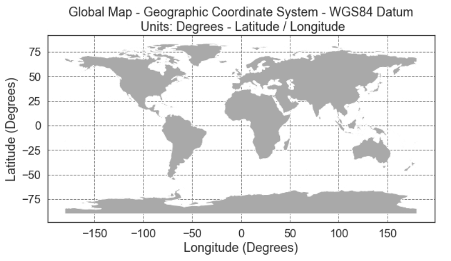

# 第 16 章：设计附近服务（Proximity Service）

> 原章节：Proximity Service · 原项目路径 `16. Proximity Service/`

## 本章导读

打开地图 App，点"附近的餐厅"，一秒钟内返回结果。这个功能简单得让人觉得理所当然。

但这里藏着一个数据库根本无法直接回答的问题：

> **「给我找出这个点周围 500 米内的所有商家」——这条查询，用 B+ 树索引怎么写？**

答案是：**写不出来**。B+ 树是一维索引，它只能高效地回答"某个字段在某个范围内"的查询。而"周围 500 米"是**二维范围查询**——纬度和经度必须**同时**满足条件。对纬度建索引，只能过滤掉南北方向的候选；对经度建索引，只能过滤东西方向。两个索引都用上，数据库也只能各扫一遍再求交集，数据量一大就彻底跑不动。

**所以这一章的核心问题只有一个：怎么把二维的空间位置，压缩成一维的、可以用普通索引快速查找的键。**

学完这一章，你应该能回答：GeoHash 到底是什么、它有什么著名的坑、为什么工业界最终选了 Redis GEO 或 PostGIS、以及处理用户位置数据时要遵守哪些合规要求。

## 你将学到

- 为什么朴素的范围查询和普通索引都无法解决二维搜索问题
- **GeoHash** 的编码原理，以及**不同长度对应多大的实际范围**（本章会完整验算）
- GeoHash 最著名的坑——**边界问题**，以及为什么"查询相邻 8 个格子"是必需的
- **四叉树（Quadtree）** 如何按数据密度自适应划分空间，以及它的运维代价
- **Google S2** 与 Hilbert 曲线，以及它为什么适合地理围栏（Geofencing）
- 工业界的两大实现：**Redis GEO** 与 **PostGIS**，以及它们底层用的索引结构
- 数据库分片与缓存键的选择（为什么缓存键应该是 geohash 而不是坐标）
- 位置数据的**隐私合规**要求与工程对策

---

## 1. 需求与范围

**附近服务（Proximity Service）** 用来查找附近的地点：餐厅、酒店、加油站、商户等。Google Maps、Yelp 这类应用都提供这个功能。

### 功能需求

1. **按位置搜索商家**：给定用户的经纬度和搜索半径，返回附近的商家
2. **商家维护**：商家所有者可以新增、更新、删除商家信息（**不要求实时生效**）
3. **查看详情**：按需返回商家的详细信息

> **注意第 2 条的"不要求实时生效"**。这一句看起来是限制，实际上是**巨大的简化**——它允许我们把商家数据做成**每天批量更新**，从而彻底绕开"写操作如何影响空间索引"这个难题。**在系统设计里，识别出"哪些需求不要求实时"，往往能省掉一半的复杂度。**

### 非功能需求

| 需求 | 含义 |
|---|---|
| **低延迟** | 用户要立刻拿到结果 |
| **数据隐私** | 遵守 GDPR 和 CCPA 等法规 |
| **高可用** | 能扛住热门地区的流量峰值 |

### 粗略估算

```
日活用户（DAU）         = 1 亿
商家总数                = 2 亿
每用户每天搜索次数       = 5 次

搜索 QPS = 1 亿 × 5 / 86,400 秒
         = 5 亿 / 86,400
         ≈ 5,787 QPS
```

> **勘误提示**：原笔记写的是「≈ 5,000 QPS」。按它自己给的数字算出来应该是 **约 5,800 QPS**。详见文末【勘误与补充】。

**还要注意：QPS 是平均值，不是峰值。** 位置服务的流量有极强的时段性和地域性——周五晚上 7 点，市中心的搜索量可能是凌晨的几十倍。所以容量规划要按**峰值 QPS = 平均 QPS × 峰值系数**来算，通常取 2～3 倍，也就是**约 1.2 万 ～ 1.7 万 QPS**。

---

## 2. API 设计

### 搜索附近商家

```
GET /v1/search/nearby
```

请求参数：

| 参数 | 含义 |
|---|---|
| `latitude` | 用户所在纬度 |
| `longitude` | 用户所在经度 |
| `radius` | 搜索半径（默认 5000 米） |

### 商家管理 API

| 端点 | 说明 |
|---|---|
| `GET /v1/businesses/{id}` | 获取商家详情 |
| `POST /v1/businesses` | 新增商家 |
| `PUT /v1/businesses/{id}` | 更新商家信息 |
| `DELETE /v1/businesses/{id}` | 删除商家 |

---

## 3. 数据模型与高层架构

### 数据模型

原笔记的判断是：因为「搜索附近商家」和「查看商家详情」这两个功能读取量极大，所以**关系型数据库（如 MySQL）是合适的选择**。

**这个判断是对的，而且理由值得展开：**

- 这是一个**读多写极少**的系统。商家信息由店主维护，更新频率低（每天批量一次）；而搜索和查看详情是高频操作。
- 商家信息是**高度结构化**的（名称、地址、电话、营业时间、分类），并且需要**事务保证**（比如"新增商家的同时写入索引"）。
- 数据量（2 亿条）对现代关系型数据库完全在可控范围内。

### 数据表

两张核心表：

- **商家表（Business Table）**：存商家的详细信息
- **空间索引表（Geospatial Index Table）**：存"格子 → 商家 ID"的映射

### 高层架构

<div align="center">
  
</div>

系统分成两部分：

**① 位置服务（LBS，Location-Based Service）**
- 处理基于位置的搜索查询
- **只读、无写请求**
- QPS 很高（尤其是密集区域的峰值时段），且服务本身**无状态**

**② 商家服务（Business Service）**
- 处理两类请求：商家所有者增删改商家；顾客查看商家详情

**③ 负载均衡器**：把流量路由到 LBS 和商家服务。

**④ 数据库集群**
- 用 **Primary-Replica（主副本）** 架构应对读多的负载
- **LBS 读到的数据可能和主库刚写入的数据有短暂不一致**
- **但这个不一致不是问题，因为商家信息本来就不是实时更新的**

> **"这个不一致不是问题"这句话是本章最优雅的一个设计判断。** 它把一条"看起来是缺陷"的特性，通过业务约束（商家信息不要求实时）转化成了"可以接受"。
>
> **在面试中主动做这种判断，比堆砌技术方案更有说服力。** 它说明你不是在"套架构"，而是在"根据约束做取舍"。

---

## 4. 朴素方案：二维范围查询为什么不行

<div align="center">
  
</div>

最直觉的做法是：以用户位置为圆心、给定半径画一个圆，找出圆内所有商家。

### 原笔记给的 SQL

```sql
SELECT business_id, latitude, longitude
FROM business
WHERE (latitude BETWEEN :lat - radius AND :lat + radius)
AND (longitude BETWEEN :long - radius AND :long + radius);
```

**这段 SQL 有一个严重的单位错误。**

- `radius` 的单位是**米**（默认 5000 米）
- `latitude` 和 `longitude` 的单位是**度**

**你不能用"度"减去"米"。** `:lat - radius` 在语义上是错的——把 5000 米当成 5000 度来算，结果会是"从北极到南极"的整个范围。详见文末【勘误与补充】。

**正确的写法需要把距离换算成度数：**

```sql
-- 1 度纬度 ≈ 111,320 米（全球近似恒定）
-- 1 度经度 ≈ 111,320 × cos(纬度) 米（随纬度收缩）
SELECT business_id, latitude, longitude
FROM business
WHERE latitude
      BETWEEN :lat - (:radius / 111320.0)
          AND :lat + (:radius / 111320.0)
  AND longitude
      BETWEEN :long - (:radius / (111320.0 * COS(RADIANS(:lat))))
          AND :long + (:radius / (111320.0 * COS(RADIANS(:lat))));
```

### 这里还有第二个问题：方框 ≠ 圆

上面这段 SQL 查出来的是一个**矩形（包围盒）**，不是圆。矩形的四个角上的商家，实际距离圆心超过半径，属于**误报（False Positive）**。

<div align="center">
  
</div>

**所以完整的流程是"两阶段"：**

1. **粗筛**：用包围盒 + 索引快速捞出候选集（可能包含误报）
2. **精筛**：对候选集逐个计算真实球面距离（Haversine 公式），过滤掉圆外的点，再按距离排序

> **这种"先用廉价的空间索引粗筛、再用精确计算精筛"的两阶段模式，是所有空间数据库的通用做法。** PostGIS 的 `ST_DWithin`、Redis 的 `GEOSEARCH`、Elasticsearch 的 geo 查询，内部都是这么做的。

### 为什么给经纬度建索引也没用

原笔记写的是：「在经度和纬度列上建索引，虽然会稍微好一点，但仍然非常慢。」

**这个结论对，但理由要讲清楚，否则初学者会以为"两个索引加起来就行"：**

- **B+ 树索引是严格一维的。** 对 `latitude` 建索引后，数据库能快速定位到"纬度在 [37.77, 37.78] 之间"的那一段记录，但这些记录**在经度上是完全乱序的**。
- 同理，`longitude` 索引在纬度上是乱序的。
- **两个索引的交集**只能靠"分别扫描两段再求交"，而两段各自都可能包含几百万条记录。**索引帮你缩小了范围，但没有解决"二维同时约束"这个根本问题。**
- 建**复合索引** `(latitude, longitude)` 也不行：复合索引只在"第一个字段是等值查询"时才能高效利用后续字段。这里是**范围查询**，第二个字段依然用不上。

**结论：一维索引无法解决二维范围查询。必须先把二维数据映射成一维键，或者改用专门的空间索引结构。**

---

## 5. 把二维压成一维：空间索引的两大流派

<div align="center">
  
</div>

原笔记的分类是对的，这里把它的含义讲清楚：

| 流派 | 代表 | 核心思想 |
|---|---|---|
| **哈希类（Hash）** | 均匀网格（Even Grid）、**GeoHash** | 把空间切成固定形状的格子，**格子编号就是一维键**。查询变成"先算格子编号，再按键查表" |
| **树类（Tree）** | **四叉树（Quadtree）**、**Google S2**、**R 树（R-Tree）** | 用树结构递归划分空间，**划分粒度随数据密度自适应** |

**两派的核心差异只有一个：格子大小是固定的还是自适应的。**

- **固定格子**：实现极简单（算编号 → 查索引），但**无法适应数据密度**——市中心 1 平方公里有 1000 家店，郊区 100 平方公里只有 1 家。用同一个格子大小，要么市中心格子塞爆，要么郊区格子空得浪费。
- **自适应格子**：树结构会根据数据量决定"这个区域要不要继续细分"，密度高的地方格子小、密度低的地方格子大。代价是**索引结构复杂，更新代价高**。

> **记住这个权衡，本章后面所有方案的取舍都是它的展开。**

---

## 6. 方案一：均匀网格（Even Grid）

<div align="center">
  
</div>

**做法**：把世界切成固定大小的方格，每个格子有编号，格子编号 → 商家 ID 列表。

**问题**：**商家分布极不均匀。**

- 曼哈顿的一个格子可能有几千家餐厅；
- 撒哈拉沙漠的一个格子可能一家都没有。

**结果**：市中心格子对应的商家列表极长，查询变成一次大列表遍历；而绝大多数格子是空的，浪费索引空间。

> **这就是"固定格子"流派的根本局限。** 后面两种方案，本质上都是在用不同方式缓解这个问题。

---

## 7. 方案二：GeoHash

<div align="center">
  
  
</div>

### 编码原理

原笔记的描述是对的，这里讲得更细一点：

1. **第一次划分**：沿**本初子午线（经度 0°）**和**赤道（纬度 0°）**把地球分成四个象限。
2. **每层再四分**：每个格子再分成四个更小的格子，如此递归。
3. **交错编码**：每个格子的编号由**经度位和纬度位交替**组成——第 1 位是经度，第 2 位是纬度，第 3 位是经度……依此类推。

**为什么经度位和纬度位要交替？** 因为这样能让"相邻的格子"拥有**相邻的编号**。如果先把所有经度位排完再排纬度位，那么南北相邻的两个格子编号会相差极大，无法利用"编号范围"做邻域查询。**交错（也叫 Morton 编码 / Z-order 曲线）就是为了保持空间局部性。**

最后，把这一串二进制位每 5 位一组，用 **base32** 编码成字符。base32 的字母表是：

```
0123456789bcdefghjkmnpqrstuvwxyz
```

注意它**去掉了 `a`、`i`、`l`、`o` 四个字母**——因为它们和数字 `0`、`1` 太容易混淆。所以一个 geohash 字符串里永远不会出现这四个字母。

**GeoHash 共有 12 个精度层级（12 个字符）。**

### 精度验算：不同长度对应多大的范围

这是本章最需要"自己算一遍"的地方。先把公式写出来：

```
长度为 n 的 geohash 有 5n 个二进制位
其中经度占 ⌈5n/2⌉ 位，纬度占 ⌊5n/2⌋ 位（第 1 位是经度）

经度格宽 = 360° / 2^⌈5n/2⌉
纬度格高 = 180° / 2^⌊5n/2⌋

换算：1° 纬度 ≈ 111.32 km（全球近似恒定）
      1° 经度 ≈ 111.32 × cos(纬度) km（随纬度收缩）
```

按这个公式算出来（以赤道附近为例，经度按最大宽度计）：

| 长度 | 总 bit | 经度 bit | 纬度 bit | 经度格宽 | 纬度格高 | **实际范围** |
|---|---|---|---|---|---|---|
| 1 | 5 | 3 | 2 | 45° | 45° | 约 **5000 km × 5000 km** |
| 2 | 10 | 5 | 5 | 11.25° | 5.625° | 约 **1250 km × 625 km** |
| 3 | 15 | 8 | 7 | 1.40625° | 1.40625° | 约 **156 km × 156 km** |
| 4 | 20 | 10 | 10 | 0.3515625° | 0.17578125° | 约 **39.1 km × 19.6 km** |
| 5 | 25 | 13 | 12 | 0.043945° | 0.043945° | 约 **4.9 km × 4.9 km** |
| 6 | 30 | 15 | 15 | 0.010986° | 0.005493° | 约 **1.22 km × 0.61 km** |
| 7 | 35 | 18 | 17 | 0.0013733° | 0.0013733° | 约 **153 m × 153 m** |
| 8 | 40 | 20 | 20 | 0.00034332° | 0.00017166° | 约 **38.2 m × 19.1 m** |
| 9 | 45 | 23 | 22 | 4.2915e-5° | 4.2915e-5° | 约 **4.8 m × 4.8 m** |
| 10 | 50 | 25 | 25 | 1.0729e-5° | 5.3644e-6° | 约 **1.19 m × 0.60 m** |
| 11 | 55 | 28 | 27 | 1.3411e-6° | 1.3411e-6° | 约 **14.9 cm × 14.9 cm** |
| 12 | 60 | 30 | 30 | 3.3528e-7° | 1.6764e-7° | 约 **3.7 cm × 1.9 cm** |

> **验算示例（长度 6）**：
> ```
> 30 bit，经度 15 bit，纬度 15 bit
> 经度格宽 = 360° / 2^15 = 360 / 32768 = 0.010986328125°
> 换算成米 = 0.010986328125 × 111.32 km = 1.2230 km
> 纬度格高 = 180° / 2^15 = 180 / 32768 = 0.0054931640625°
> 换算成米 = 0.0054931640625 × 111.32 km = 0.6115 km
> ```
> 所以 **6 位 geohash ≈ 1.22 km × 0.61 km**，与常见资料一致。

**一个必须注意的细节：格子的实际宽度随纬度收缩。**

上面表格里的经度宽度是**赤道上的最大值**。经度 1° 的实际长度 = `111.32 × cos(纬度)` km。所以：

- 在赤道（纬度 0°）：6 位 geohash ≈ **1.22 km × 0.61 km**
- 在北纬 37.77°（旧金山）：`cos(37.77°) ≈ 0.790`，实际是 **约 0.97 km × 0.61 km**
- 在北纬 60°（赫尔辛基）：`cos(60°) = 0.5`，实际只有 **约 0.61 km × 0.61 km**
- 在极点附近：经度宽度趋近于 0，格子退化成一条线

> **所以"6 位 geohash 是 1.2 km × 0.6 km"这个说法只在赤道严格成立。** 工程上做容量估算时，**必须按服务覆盖区域的最高纬度来算**，否则会低估北半球高纬度地区的格子数量。

### 如何用 geohash 长度匹配搜索半径

<div align="center">
  
</div>

原笔记给出的映射表是：

| 搜索半径 | GeoHash 长度 |
|---|---|
| 0.5 km | 6 |
| 1 km | 5 |
| 2 km | 5 |
| 5 km | 4 |
| 20 km | 4 |

**这个表大体合理，但有一项是边界情况，需要修正。** 我们用"格子尺寸应当不小于搜索半径（取较小的那个维度，即纬度方向）"这条规则验算一遍：

| 半径 | 长度 6（0.61 km） | 长度 5（4.9 km） | 长度 4（19.6 km） | 长度 3（156 km） | 结论 |
|---|---|---|---|---|---|
| 0.5 km | **够**（0.61 ≥ 0.5） | 够但浪费 | — | — | **6** ✓ |
| 1 km | 不够（0.61 < 1） | **够** | 够但浪费 | — | **5** ✓ |
| 2 km | 不够 | **够** | 够但浪费 | — | **5** ✓ |
| 5 km | 不够 | 不够（4.9 < 5） | **够** | 够但浪费 | **4** ✓ |
| 20 km | 不够 | 不够 | **不够（19.6 < 20）** | **够** | **应为 3，或改用 5×5 邻域** |

**结论**：前四项都正确；**最后一项「20 km → 长度 4」是边界情况**——长度 4 的格子在纬度方向只有约 19.6 km，**略小于 20 km 的搜索半径**。严格来说应该用长度 3（约 156 km），但那样检索范围会放大近 8 倍，代价太高。

**实践中的折中**：继续用长度 4，但把邻域从 **3×3 扩展到 5×5**。5 个格子的纬度跨度 = 5 × 19.6 = 98 km，远超 20 km，完全覆盖得住。详见文末【勘误与补充】。

### GeoHash 的"局部性保证"——注意它是单向的

原笔记写的是：「GeoHash 保证两个 geohash 共享的前缀越长，它们就越近。」

**这句话是对的**，因为共享长度为 k 的前缀意味着两个点落在**同一个 k 级格子里**，它们的距离必然不超过该格子的对角线长度。

**但真正要命的是它的逆命题不成立：**

> **两个位置很近的点，geohash 可能共享极短的前缀，甚至完全没有共享前缀。**

**这就是 GeoHash 最著名的坑——边界问题。**

---

## 8. GeoHash 的边界问题

<div align="center">
  
</div>

### 问题一：相邻格子不共享前缀

看上面这张图。中心格子是 `9q8zn9`，它的八个邻居分别是：

```
9q8zn6   9q8znd   9q8znf
9q8zn3   9q8zn9   9q8znc
9q8zn2   9q8zn8   9q8znb
```

**关键观察**：这九个格子的 geohash **只在最后一个字符上不同**，它们共享的前缀只有 **5 个字符**（`9q8zn`）。

**这意味着什么？** 假设用户站在 `9q8zn9` 的东边界上，往东 10 米就有一家餐厅——那家餐厅的 geohash 是 `9q8znc`。如果你只用"前缀匹配 `9q8zn9`"来查询，**这家近在眼前的餐厅会被完全漏掉**。

### 问题二：极近的两个点可能完全没有共享前缀

原笔记提到的这个情况是真实存在的，而且比第一个问题更极端：

> **赤道上的两个点，纬度分别是 +0.0001° 和 −0.0001°。它们的实际距离只有约 22 米，但 geohash 可能一个字符都不共享。**

**为什么？** 回顾编码规则：第 1 位是经度，**第 2 位是纬度**。赤道以北，第 2 位是 `0`；赤道以南，第 2 位是 `1`。两个点在第 2 位就分道扬镳，**所以它们的第一个字符就已经不同了。**

**同样的问题还会出现在：**

| 边界 | 说明 |
|---|---|
| **赤道（纬度 0°）** | 第 2 位翻转，最极端的情况 |
| **本初子午线（经度 0°）** | 第 1 位翻转 |
| **180° 经线（反经线）** | 东西半球分界，格子需要环绕（Wrap-around） |
| **两极附近** | 经度方向的格子被极度压缩，编码退化 |

### 解决方案：查询相邻格子

**做法**：先算出用户所在的格子，再算出它周围的 **8 个邻居格子**，然后**同时查询这 9 个格子**，最后合并去重、按距离排序。

```
查询键列表 = [my_geohash, 邻居1, 邻居2, ..., 邻居8]   ← 共 9 个
```

**工程上要注意四个细节：**

**① 9 个格子是"最小覆盖集"，不是"完整覆盖集"。**

如果用户站在格子的角落，半径又刚好大于格子尺寸，那么 3×3 可能仍然不够——需要根据"半径 / 格子尺寸"的比值动态扩大邻域（如 5×5）。**通用做法是：取能覆盖 `半径 + 格子对角线` 的最小邻域。**

**② 反经线需要环绕处理。**

如果一个格子位于经度 180° 附近，它东边的邻居应该"绕回"到 −180°。**如果实现时忘了处理，就会出现"在日期变更线附近搜不到东西"的诡异 bug。** Redis 的 geohash 辅助函数内部就实现了这种环绕。

**③ 两极需要特殊处理。**

纬度接近 ±90° 时，经度方向的格子宽度趋近于 0，同一纬度圈上的格子数量会爆炸。**实际业务里一般直接限制服务范围（比如不覆盖极地），而不是硬解这个问题。**

**④ 9 个格子查完还要去重。**

同一家商家只会落在一个格子里，所以 9 次查询的结果**天然不重复**。但如果你查询的邻域重叠了（比如两次查询的邻域有交集），就可能重复。**最后一步的去重不能省。**

> **一句话记住 GeoHash 的边界问题**：**GeoHash 保证"前缀相同 ⇒ 位置相近"，但不保证"位置相近 ⇒ 前缀相同"。** 前者让查询成为可能，后者让查询必须查邻域。**这个不对称性，是面试中最容易被追问的点。**

---

## 9. 方案三：四叉树（Quadtree）

<div align="center">
  
</div>

### 什么是四叉树

**四叉树（Quadtree）** 是一种树形数据结构，它递归地把二维空间分成四个象限，**每个内部节点恰好有四个子节点**，分别对应四个子区域。

**关键规则**：从根节点开始递归四分，**直到每个叶子节点包含的商家数量不超过 x 个**（本章取 x = 100）。

<div align="center">
  
</div>

<div align="center">
  
</div>

**这就是"自适应格子"的威力**：市中心商家密集，树会自动细分很多层，格子很小；郊区商家稀疏，树很快就停止细分，格子很大。**格子大小自动匹配数据密度，不需要人工调参。**

### 四叉树适合什么查询

**四叉树特别适合 k 近邻（k-Nearest Neighbors, kNN）查询**，比如"找出离我最近的加油站"。

**为什么？** 因为 kNN 查询可以**从用户所在的叶子节点开始，逐层向外扩展**：先看本叶子，不够就回溯到父节点看兄弟节点，直到凑够 k 个且确定不会有更近的。**这个"由近及远"的搜索顺序，正是树结构天然支持的。**

> **对比一下 GeoHash**：GeoHash 查询"半径 R 内的所有商家"很自然，但查"最近的 3 家"就有点别扭——你不知道该选多大的半径。**四叉树的层次结构让"逐步扩大搜索范围"变得优雅。**

### 内存占用验算

原笔记说：「四叉树索引不会占用太多内存（通常在 GB 级别），很容易放进一台服务器。」

**我们验算一下：**

```
2 亿个商家，每个叶子节点最多 100 个商家
叶子节点数 ≈ 2 亿 / 100 = 200 万个
内部节点数 ≈ 200 万 / 3 ≈ 67 万个（每个内部节点有 4 个子节点，所以内部节点数约为叶子的 1/3）
总节点数 ≈ 267 万个

叶子节点存储商家 ID：2 亿 × 8 字节 = 1.6 GB
加上节点边界、指针等开销，总计约 2 GB 量级
```

**所以"GB 级别"这个判断是准确的。** ✓

### 构建时间

原笔记说：「构建树的时间复杂度是 O(n log n)，可能需要几分钟。」

**这个也是对的。** 每次插入的代价是树的深度（约 `log₄(2亿/100) ≈ 10` 层），n 次插入即 O(n log n)。2 亿次插入，实测量级确实在几分钟。

### 运维上的三个坑

原笔记在这一节写得相当扎实，这里补充说明为什么每个坑都致命：

**① 构建期间无法服务流量**

树在服务器启动时构建，**构建完成前这台服务器不能处理请求**。所以新版本必须**灰度发布**到一小部分服务器，而不是一次性全量重启——否则会出现"所有服务器同时不可用"的窗口。

**② 增量重建会导致大量缓存失效**

商家信息变更时，最简单的做法是"重建整棵树"。但重建会让**所有服务器的树结构都变**，而如果树是按 geohash 或其他键分片缓存的，缓存会大面积失效。

**③ 在线更新需要加锁，实现复杂**

也可以在树构建完成后动态更新，但**多线程读写同一棵树必须加锁**，这会引入并发正确性问题和性能瓶颈。

> **这三条合起来说明一件事：四叉树是一个"读极快、写极痛"的结构。** 它适合"数据每天批量更新一次"的场景——**而这恰好就是本章的需求**（商家信息不要求实时）。**需求和数据结构的匹配，就是架构设计的本质。**

---

## 10. 方案四：Google S2

<div align="center">
  
  
</div>

### 核心思想

**S2** 把球面映射到一维索引，**基于 Hilbert 曲线**。原笔记的表述是：「Hilbert 曲线上彼此靠近的两个点，在一维空间中也是靠近的。」

**这里值得补充一点：Hilbert 曲线比 GeoHash 用的 Z-order 曲线（Morton 编码）有更好的局部性。**

| 曲线 | 局部性 | 说明 |
|---|---|---|
| **Z-order（Morton）** | 一般 | 存在"跳跃"——相邻的两个格子编号可能相差很大 |
| **Hilbert** | **更好** | 连续移动时**从不相邻跨越**，相邻格子的编号总是接近 |

> **直观理解**：Z-order 曲线是"画 Z 字"，从一个象限跳到下一个象限时会跨过一段距离；Hilbert 曲线是"画 U 字再旋转"，它在二维空间里连续爬行，**不会出现长距离跳跃**。所以在"按编号范围查询"时，Hilbert 曲线能圈出更紧凑的空间区域，**扫描的无效数据更少**。

### S2 的独特优势

原笔记列出的几点都正确：

1. **把地球分成小格子，基于 Hilbert 曲线**
2. **非常适合地理围栏（Geofencing）**：它可以**用不同层级的格子覆盖任意形状的区域**
3. **地理围栏还允许定义围绕目标区域的参数**
4. **可以指定最小层级、最大层级和最大格子数**，而不是只能用固定的精度

**这第 4 点才是 S2 真正的杀手锏。** 用 GeoHash 时，你只能选"长度 6"或"长度 7"这样的单一精度。但一个城市级的区域，用长度 6 覆盖会产生海量格子，用长度 4 又太粗糙、会覆盖到区域外。

**S2 允许你混用不同层级的格子来逼近目标形状**——大块区域用粗格子，边界处用细格子。**这就是"用最少的格子覆盖任意形状"的能力，也是地理围栏的核心需求。**

> **什么是地理围栏？** 它是"当用户进入/离开某个区域时触发动作"的功能，比如"到家时自动打开灯"、"进入商场推送优惠券"。**它的难点不是判断一个点是否在区域内，而是如何高效地为几千万个用户同时判断。**

---

## 11. 工业实现：Redis GEO 与 PostGIS

原笔记只给了算法，没有提工业实现。**但面试和实际工作中，你几乎不会自己实现 GeoHash——你会直接用现成的系统。** 这里补上两个最主流的。

### Redis GEO

**它是什么**：Redis 内置的地理位置功能，用几个命令就能完成"附近搜索"。

| 命令 | 作用 |
|---|---|
| `GEOADD key lon lat member` | 添加一个位置 |
| `GEOPOS key member` | 查询某个成员的坐标 |
| `GEODIST key m1 m2 [unit]` | 计算两个成员之间的距离 |
| `GEOSEARCH key FROMMEMBER m BYRADIUS 500 m` | 半径搜索（推荐使用） |
| `GEORADIUS` / `GEORADIUSBYMEMBER` | 旧版半径搜索命令（Redis 6.2 起已废弃） |

**底层用的是什么索引？**

> **Redis GEO 的底层不是一棵空间树，而是一个有序集合（Sorted Set，ZSET），score 是 52 位的 GeoHash 整数。**

具体来说：

- **每个坐标被编码成一个 52 位整数**（经度 26 位 + 纬度 26 位，交错排列），这个整数作为 ZSET 的 score。
- ZSET 内部用**跳跃表（Skip List）+ 哈希表**实现。跳跃表让"按 score 范围查找"的复杂度为 O(log N)。
- 执行 `GEOSEARCH` 时，Redis 会**计算查询区域对应的 GeoHash 覆盖（通常是 3×3 邻域）**，对每个格子做一次 score 范围扫描，捞出候选，**再逐点计算真实距离过滤并排序**。

**所以 Redis GEO 就是"GeoHash + ZSET 范围查询"的工程化封装**，正好对应本章第 7 节讲的算法。

**优点**：

- **极低延迟**（纯内存，通常亚毫秒级）
- 使用简单，不需要额外的数据库
- 天然支持高并发读

**缺点**：

- **数据必须全部放进内存**。本章的 2 亿商家索引约 4 GB，单机内存还能扛；但数据量再大就很贵。
- **持久化能力弱于数据库**。Redis 的 RDB/AOF 可以持久化，但它的定位是缓存而不是权威数据源。**生产系统通常把 Redis 当"索引缓存"，真正的权威数据在 MySQL/PostgreSQL 里。**
- **不支持复杂的空间运算**（如多边形相交、缓冲区分析）。

**容量验算**：2 亿条记录，每条 = geohash 6 字符（约 6 字节）+ business_id（8 字节）+ ZSET 的跳跃表指针和哈希表开销（每条约几十字节）。粗算下来**约 4～8 GB**，单台大内存机器可以承载。

### PostGIS

**它是什么**：PostgreSQL 的空间扩展，给关系型数据库加上完整的空间数据类型和空间查询能力。

| 能力 | 说明 |
|---|---|
| `geometry` / `geography` 类型 | 表示点、线、多边形等空间对象 |
| `ST_DWithin(geom, point, distance)` | 距离范围内的查询（会用索引） |
| `ST_Distance` / `ST_DistanceSphere` | 计算距离 |
| `ST_Contains` / `ST_Intersects` | 空间关系判断（点在多边形内、两个形状相交） |
| `ST_Buffer` | 缓冲区（生成一个点周围的圆/多边形） |

**底层用的是什么索引？**

> **PostGIS 默认使用 GiST（Generalized Search Tree，通用搜索树）索引。对于二维几何数据，GiST 的行为等价于一棵 R 树（R-Tree）——一棵由"最小包围矩形（MBR）"构成的自平衡树。**

```sql
-- 建表
CREATE TABLE business (
    id      BIGSERIAL PRIMARY KEY,
    name    TEXT,
    geog    GEOGRAPHY(POINT, 4326)   -- 4326 是 WGS84 坐标系
);

-- 建空间索引
CREATE INDEX idx_business_geog ON business USING GIST (geog);

-- 查询 500 米内的商家（索引会被自动使用）
SELECT id, name,
       ST_Distance(geog, ST_MakePoint(-122.416730, 37.776720)::geography) AS dist_m
FROM business
WHERE ST_DWithin(
        geog,
        ST_MakePoint(-122.416730, 37.776720)::geography,
        500
      )
ORDER BY dist_m
LIMIT 50;
```

**GiST / R 树的工作原理**：树上的每个节点存一个**最小包围矩形**，把所有子节点包含在内。查询时，**如果一个节点的包围矩形和查询区域完全不相交，整棵子树直接剪掉**。这就是它能加速二维范围查询的原因。

**PostGIS 的优势**：

- **数据和索引都在数据库里**，天然有事务、备份、复制能力
- 支持**复杂的空间运算**（多边形、缓冲区、相交判断）
- 数据量可以远超内存（靠磁盘和 B 树/GiST 的磁盘友好结构）
- 可以用 SQL 和业务数据 JOIN（比如"找出我关注过的、附近的餐厅"）

**PostGIS 的劣势**：

- 延迟高于 Redis（有磁盘 IO 和查询解析开销）
- 单机写入吞吐有限，需要靠分片扩展

### 其他工业实现速查

| 系统 | 索引结构 | 说明 |
|---|---|---|
| **MySQL** | **R 树**（InnoDB `SPATIAL INDEX`，MySQL 5.7+） | 提供 `ST_Distance_Sphere` 等函数 |
| **Elasticsearch** | **BKD 树**（Lucene 实现） | `geo_point` 类型，支持聚合和排序 |
| **MongoDB** | `2dsphere` 索引（球面几何）、`2d` 索引（平面） | 支持 `$near`、`$geoWithin` |
| **Uber H3** | **六边形**分层索引 | 见下方补充 |

> **补充：为什么 Uber 要做 H3（六边形网格）？**
>
> GeoHash 和四叉树用的是**正方形**格子。正方形有一个几何缺陷：它有 **4 个边邻居**（距离 = 边长）和 **4 个角邻居**（距离 = 边长 × √2 ≈ 1.41 倍）。**这意味着"移动一格"的实际距离取决于方向**，做"扩大一圈搜索"时会产生方向性偏差。
>
> **六边形没有这个问题：它的 6 个邻居到中心的距离完全相等。** 这让"逐环扩展搜索"和"按环形聚合统计"变得干净。H3 在 Uber 被大量用于定价分区、供需热力图等场景。
>
> **这是"网格形状会影响算法正确性"的一个很好的例子**——初学者容易以为格子形状只是审美问题。

---

## 12. 索引方案横向对比

### 原笔记的对比（保留）

**GeoHash**
- 易于使用和实现——不需要构建/重建树
- 支持固定半径的结果
- 更新索引很简单
- **无法根据人口密度动态调整格子大小**

**Quadtree**
- 实现稍微难一些
- 支持 k 近邻查询
- **可以根据人口密度动态调整格子大小**
- 更新索引更复杂，可能需要重建整棵树

### 补充：三方案完整对比

| 维度 | GeoHash | Quadtree | Google S2 |
|---|---|---|---|
| **索引结构** | 固定网格（哈希） | 自适应树 | Hilbert 曲线上的变层级格子 |
| **实现难度** | 低 | 中 | 高 |
| **是否需构建树** | 否 | 是（启动时构建，数分钟） | 否（库函数） |
| **自适应密度** | 否 | **是** | **是**（可指定 min/max level） |
| **半径查询** | 天然支持 | 支持 | 支持 |
| **k 近邻查询** | 需估算半径 | **最擅长** | 支持 |
| **地理围栏** | 弱（只能近似） | 一般 | **最强**（任意形状） |
| **索引更新** | 简单 | **困难**（可能重建整棵树） | 中等 |
| **边界问题** | **有**（需查邻域） | 无 | 无（曲线连续） |
| **适用场景** | 固定半径的"附近搜索" | k 近邻、数据密度差异大 | 复杂地理围栏、大规模地图服务 |
| **工业代表** | Redis GEO、MongoDB `2d` | 自建 LBS 服务 | Google Maps、Uber H3（同类思路） |

> **本章的选择**：因为是"固定半径的附近搜索"，且商家数据每天批量更新（可以容忍重建索引），原笔记选择了 **GeoHash + Redis**。**这是一个"用最简单能满足需求的方案"的决策**，而不是"用最先进的技术"。**在面试中说出这个理由，比直接说"用 GeoHash"更有价值。**

---

## 13. 数据库扩展与缓存策略

### 商家表的分片

原笔记写的是：「**按商家 ID 分片**能保证数据均匀分布。」

**这个做法可行，但需要说清代价：**

- **优点**：商家 ID 是自增或随机的，分布均匀，不会出现热点分片。
- **代价**：**按 ID 分片意味着"按地理位置查询"必须查所有分片**。所以商家表的分片只适用于"按 ID 查详情"这个场景，**地理位置搜索必须靠独立的索引表（Redis GEO）来承担**。

| geohash | business_id |
|---|---|
| `9q9hvu` | 343 |
| `9q9hvu` | 347 |
| `9q9hvu` | 112 |

### 空间索引表的扩展

原笔记的判断很精准：「**可能不太适合分片。在这种情况下所有数据都能放进一台服务器，所以没有分片的技术理由。更好的做法是用只读副本（Read Replica）来分担读负载。**」

**验算一下"能放进一台服务器"这个判断：**

```
2 亿条索引记录 × (geohash 约 6 字节 + business_id 8 字节 + 索引开销约 20 字节)
≈ 2 亿 × 34 字节 ≈ 6.8 GB
```

**约 7 GB，单台大内存服务器完全可以承载。** ✓ 原笔记的判断成立。

### 缓存策略

原笔记这一段写得很好，指出了"用坐标做缓存键"的三个问题：

1. **GPS 坐标不精确**——同一位置，两次定位结果可能相差几米到几十米，导致缓存永远不命中。
2. **用户会移动**——坐标一变，缓存键就变。
3. **更好的缓存键是 geohash**。

| 缓存键 | 缓存值 |
|---|---|
| `geohash` | 该格子内的商家 ID 列表 |
| `business_id` | 商家详情（名称、地址、评价等） |

> **为什么 geohash 做缓存键能解决前两个问题？** 因为**量化（Quantization）**——无论 GPS 报出的坐标是 `37.7767201` 还是 `37.7767298`，只要它们落在同一个 geohash 格子里，缓存键就是同一个。**"把连续值离散化，从而让缓存命中"，是一个通用且非常重要的缓存设计技巧**（和第 1 章讲的"过期时间加随机抖动"是同一类思想）。
>
> **顺带一提**：把坐标量化成 geohash 再发给服务端，**同时也是一个隐私保护手段**——服务端永远拿不到用户的精确位置，只知道"他在这个约 1.2 km × 0.6 km 的格子里"。**一个设计同时解决了性能和隐私两个问题**，这是很好的架构。

**缓存的两个层次：**

- **geohash → 商家 ID 列表**：命中率最高，因为同一格子会被大量用户重复查询。**但要设置较短的过期时间**，否则商家信息更新后会长时间不一致。
- **business_id → 商家详情**：可以设较长的过期时间（因为商家信息本来就不实时）。

---

## 14. 部署策略与最终架构

### 区域与可用区

- 把 LBS 和商家服务**部署到多个区域（Region）**。
- 每个区域内部跨多个**可用区（Availability Zone）** 部署，保证单机房故障不影响服务。

> **对位置服务来说，多区域部署还有一个额外的必要性：延迟。** 用户的搜索请求如果跨洲传输，光速带来的延迟就有 100 毫秒以上。**把 LBS 部署到用户附近，是满足"低延迟"这个非功能需求的必要手段。**

### 实时更新怎么处理

原笔记写的是：「**商家更新每天批量处理一次。**」

**这是一个非常重要的架构决策，值得展开说明它的好处：**

1. **空间索引不需要支持在线写入**——这就完全绕开了"四叉树在线更新要加锁"、"GeoHash 索引更新会引入不一致"这些难题。
2. **可以用离线批处理构建索引**——把索引当成"每天重新生成的产物"，而不是"需要实时维护的状态"。
3. **可以容忍副本延迟**——因为数据本来就有一天的新鲜度容忍度。

> **这就是为什么第 1 节里"商家维护不要求实时生效"这条需求如此关键。** 一条看似无关紧要的需求描述，直接决定了整个索引架构可以有多简单。**读需求时，一定要特别留意"实时性"和"一致性"这两类约束。**

### 最终架构与检索流程

<div align="center">
  
</div>

**完整的附近商家检索流程：**

**① 用户请求**
用户在半径 **500 米**内搜索餐厅。客户端把**纬度（37.776720）、经度（−122.416730）、半径（500m）** 发给负载均衡器。

**② 请求转发**
负载均衡器把请求转发给**位置服务（LBS）**。

**③ 计算 GeoHash 长度**
LBS 根据半径确定合适的 geohash 长度。查参考表：**500 米 对应 geohash 长度 = 6**。

> 验算：长度 6 的格子约 **1.22 km × 0.61 km**，纬度方向 0.61 km ≥ 0.5 km 半径，**够用**。✓

**④ 计算相邻格子**
LBS 计算周围的相邻格子，得到 9 个格子的列表：

```
[my_geohash, neighbor1_geohash, ..., neighbor8_geohash]
```

**⑤ 从 Redis 拉取商家 ID**
对列表中的每个 geohash，LBS 查询 **GeoHash Redis 服务器**，取回商家 ID 列表。**这些查询并行执行以最小化延迟。**

**⑥ 取详情并排序**
LBS 从**商家信息 Redis 服务器**取回完整的商家详情，**按与用户的距离排序**，把排好序的结果返回给客户端。

> **注意第 ⑥ 步的"按距离排序"是必需的**：因为 geohash 格子是正方形，落在格子里的商家可能位于格子的任何位置。**按 geohash 查出来的顺序和真实距离无关**，必须重新计算距离并排序。
>
> 而且这里还应该做**精筛**：把包围盒四个角上、实际超出 500 米的商家过滤掉。**原笔记的流程里没有明确提到这一步。**

### 关键优化

原笔记总结的三条都正确：

- **并行 Redis 调用**：降低响应时间
- **GeoHash 索引**：保证空间查询高效
- **缓存**：加速查找和详情获取

> **补充第四条：限制返回条数并做分页。** 市中心的 500 米内可能有几千家餐厅，全部返回既慢又没用。**应该只返回最近的 N 条（如 50 条），或做分页。** 这也是 `LIMIT` 在空间查询里几乎是必需的原因。

---

## 15. 位置数据的隐私合规

原笔记在非功能需求里提到了"遵守 GDPR 和 CCPA"，但正文完全没有展开。**而位置数据是监管最严格的数据类型之一，这一节不能省。**

### 为什么位置数据特别敏感

**位置数据本身可能不敏感，但它能推断出极敏感的信息：**

- 频繁出现在某宗教场所 → **宗教信仰**
- 频繁出现在某医院/诊所 → **健康状况**
- 夜间出现在某些特定场所 → **性取向**
- 住所 + 工作时间 → **可精确定位到个人**

> **所以"位置数据"在很多法域里不是普通个人信息，而是需要额外保护的类型。**

### 主要法规要求

| 法规 | 对位置数据的要求 |
|---|---|
| **GDPR（欧盟）** | 位置数据属于个人数据。处理需要合法性基础；必须遵循**数据最小化、目的限制、存储期限限制**原则；大规模位置处理通常需要做**数据保护影响评估（DPIA）** |
| **CCPA / CPRA（美国加州）** | **「精确地理位置（Precise Geolocation）」被明确列为敏感个人信息**，消费者有权知情、删除、限制使用 |
| **PIPL（中国《个人信息保护法》）** | **「行踪轨迹」被明确列为敏感个人信息**，处理需取得**单独同意**，且必须具有特定的目的和充分的必要性 |

> **注意中国法规的一个特殊之处**：PIPL 对敏感个人信息要求**单独同意（Separate Consent）**——不能用一揽子隐私政策打包获取，必须为位置数据单独弹窗取得同意。此外，在中国提供地图和位置服务还涉及**测绘资质与地图数据合规**的要求，这是另一个独立的合规维度。

### 工程上的六条对策

**① 数据最小化：不存原始 GPS 轨迹**

> **最常见也最严重的错误是：把用户的每一次定位都落库，形成一条精确的轨迹。** 这条轨迹的价值密度极高，一旦泄露后果严重，而绝大多数业务根本用不到它。
>
> **正确做法**：只在内存里处理当次请求的坐标，**用完即弃**；确实需要保留时，只保留**降精度后的数据**（如 geohash 长度 5 或 6）。

**② 坐标量化 / 网格吸附（Grid Snapping）**

**在客户端就把坐标吸附到 geohash 格子的中心，再发给服务端。** 服务端永远拿不到精确位置，只知道"用户在这个约 1.2 km × 0.6 km 的格子里"。

**这个做法同时解决了性能和隐私问题**（前面第 13 节已经讲过缓存键的量化效应）。**精度可以按业务需要调整**：找餐厅用长度 6 就够了；如果是打车，可能需要长度 7 或更高。

**③ 优先在客户端计算**

把 geohash 索引缓存在客户端，**"附近搜索"直接在本地完成**，根本不上传坐标。代价是数据新鲜度（缓存需要定期更新），**适合对实时性要求不高的场景**。

**④ 短期保留 + 自动删除**

如果业务确实需要保留位置历史（如行程记录），必须设置**明确的保留期限**并自动删除（如 30 天）。**"永久保留"在 GDPR 和 PIPL 下都是高风险的。**

**⑤ 匿名化 vs 假名化——这两者不一样**

> **这是最容易被误解的一点：**
> - **假名化（Pseudonymization）**：用用户 ID 替换真实身份。**假名化后的数据仍然是个人数据**，因为可以通过 ID 重新关联回个人。
> - **匿名化（Anonymization）**：数据**不可逆地**无法关联到任何个人。**只有真正匿名的数据才不受 GDPR 约束。**
>
> **关键陷阱**：把位置数据里的用户 ID 去掉，**并不等于匿名化**。因为**位置本身就是一个强标识符**——研究表明，**只要知道一个人 4 个时间点的位置，就足以在 150 万人中唯一识别出他**。所以"删掉姓名就叫匿名"是错的。

**⑥ 访问控制与审计日志**

**"谁能查询某个用户的位置"必须被严格限制并留痕。** 内部人员滥用位置查询权限是实际发生过的严重事故类型。做法：最小权限、双人审批、全量审计日志。

> **在面试中主动提到"把坐标吸附到 geohash 格子中心，服务端不接触精确位置"，是一个很强的加分项。** 它同时体现了技术能力和合规意识，而且**方案本身很简单**——好的设计往往就是这样。

---

## 勘误与补充

> 本节逐条指出原笔记中不准确、过时或缺失的地方。

### 勘误 1：二维范围查询的 SQL 单位错误——用「度」减「米」

- **原文说法**：
  ```sql
  WHERE (latitude BETWEEN :lat - radius AND :lat + radius)
  AND (longitude BETWEEN :long - radius AND :long + radius);
  ```
- **问题**：**单位不匹配。** `radius` 的单位是**米**（API 定义里默认 5000m），而 `latitude` / `longitude` 的单位是**度**。`:lat - radius` 相当于"用纬度减去 5000"，得出的范围会覆盖从南极到北极的整个地球，**查询完全失效**。这是一个硬性的技术错误，不是表述问题。
- **正确说法**：必须先把距离换算成度数：
  ```sql
  -- 1 度纬度 ≈ 111,320 米
  -- 1 度经度 ≈ 111,320 × cos(纬度) 米（随纬度收缩）
  WHERE latitude
        BETWEEN :lat - (:radius / 111320.0)
            AND :lat + (:radius / 111320.0)
    AND longitude
        BETWEEN :long - (:radius / (111320.0 * COS(RADIANS(:lat))))
            AND :long + (:radius / (111320.0 * COS(RADIANS(:lat))));
  ```
  **注意经度那一项必须乘 `cos(纬度)`**——因为在北纬 60° 处，1 度经度的实际长度只有赤道的一半。**如果漏掉这个因子，高纬度地区会漏掉一半的结果。**
- **延伸**：同时要意识到**包围盒 ≠ 圆**。上面的查询会返回矩形四角上的商家，它们的实际距离超过半径。**必须做第二阶段精筛**：用 Haversine 公式计算真实球面距离，过滤掉圆外的点，再按距离排序。

### 勘误 2：搜索 QPS 的算术有偏差

- **原文说法**：`Search QPS = (100M × 5) / 86,400 ≈ 5,000 QPS`。
- **问题**：按原笔记自己给的数字计算，`5 亿 / 86,400 = 5,787`，**约 5,800 QPS，不是 5,000**。虽然只差 16%，但在粗略估算中，**保留两位有效数字比取整到整数更有价值**（因为你后面要乘峰值系数，误差会被放大）。
- **正确说法**：**约 5,800 QPS（平均）**。更重要的是，**必须再乘峰值系数**——位置服务的流量有极强的时段性和地域性（周五晚 7 点的市中心可能是凌晨的几十倍）。按 2～3 倍估算，**峰值约 1.2 万 ～ 1.7 万 QPS**。
- **延伸**：**粗略估算里"平均值"和"峰值"的区别，比算得准不准重要得多。** 用平均 QPS 做容量规划，系统一定会在高峰时段挂掉。

### 勘误 3：GeoHash 半径映射表中「20 km → 长度 4」是边界情况

- **原文说法**：参考表给出 `20 km → geohash length = 4`。
- **问题**：长度 4 的 geohash 格子在**纬度方向只有约 19.6 km**，而搜索半径是 20 km，**格子尺寸小于搜索半径**。按"格子尺寸应当不小于搜索半径"这条规则，长度 4 严格来说不够用（详见第 7 节的验算表）。
- **正确说法**：有两种处理方式：
  1. **改用长度 3**（约 156 km × 156 km）——安全，但检索范围放大近 8 倍，代价高；
  2. **保持长度 4，但把邻域从 3×3 扩展到 5×5**——5 个格子的纬度跨度约 98 km，远超 20 km。**这是实践中更合理的折中。**
- **延伸**：表格中的前四项（0.5 km → 6、1 km → 5、2 km → 5、5 km → 4）**都正确**。这个勘误只针对最后一项。**而且它揭示了一个更普遍的道理：这类"半径 → 精度"的对照表都是近似值，实现时必须用公式验证，并动态选择邻域大小。**

### 勘误 4：「GeoHash 保证共享前缀越长越近」这句话需要补上它的逆命题不成立

- **原文说法**：`Geohash guarantees that the longer a shared prefix is between two geohashes, the closer they are.`（GeoHash 保证两个 geohash 共享的前缀越长，它们就越近。）
- **问题**：**这句话本身是正确的**（共享长度为 k 的前缀意味着两个点落在同一个 k 级格子里，距离不超过该格子的对角线）。原笔记在 Challenges 一节也正确指出了边界问题。**但把这句话单独放在正文里，极容易让读者误以为"距离近 ⇒ 前缀长"也成立。** 而这个逆命题**恰恰是错的**——这就是 GeoHash 最著名的坑。
- **正确说法**：应当明确表述为**单向保证**：
  > **「前缀相同 ⇒ 位置相近」成立；「位置相近 ⇒ 前缀相同」不成立。**
  
  后半句的两个反例：① 相邻格子（如 `9q8zn9` 和 `9q8znc`）只共享 5 个字符的前缀；② 赤道两侧相距约 22 米的两个点，**可能连一个字符都不共享**（因为第 2 位是纬度位，会在赤道处翻转）。
- **延伸**：**必须查询相邻的 8 个格子**，并处理反经线环绕和两极退化。另外要注意邻域大小不是固定的 3×3——**当搜索半径大于格子尺寸时需要动态扩大邻域**（取能覆盖"半径 + 格子对角线"的最小邻域）。

### 勘误 5：Quadtree 小节内容准确，无技术错误

- **原文说法**：四叉树"每个内部节点恰好有四个子节点"；"递归细分直到每个节点不超过 x 个商家（这里取 100）"；"内存占用通常在 GB 级别"；"构建时间复杂度 O(n log n)，可能需要几分钟"。
- **核查结果**：**这一节内容准确，我们逐条验算过：**
  - 2 亿商家 / 每叶 100 个 ≈ 200 万叶子 + 约 67 万内部节点 ≈ 267 万节点；仅商家 ID 就需 `2 亿 × 8 字节 = 1.6 GB`，加节点开销约 2 GB 量级——**"GB 级别"成立** ✓
  - 每次插入代价为树深（约 `log₄(2亿/100) ≈ 10` 层），n 次插入即 **O(n log n)** ✓
  - "构建期间不能服务流量 → 需要灰度发布"、"增量重建导致缓存失效"、"在线更新需要加锁"这三条运维注意事项，**都是真实存在的问题，写得相当扎实** ✓
- **补充**：四叉树的**核心优势是自适应密度**，核心劣势是**写代价高**。它最适合"数据每天批量更新一次"的场景——**这恰好匹配本章"商家信息不要求实时"的需求**。

### 补充 1：GeoHash 精度的完整验算表

原笔记给出了半径映射表，但没有给出"不同长度对应多大范围"的完整表格和推导公式。详见第 7 节。**核心结论：6 位 geohash ≈ 1.22 km × 0.61 km（赤道），这个数字在常见资料中是对的。** 但要注意两点：
- 经度方向的宽度**随纬度收缩**（北纬 37.77° 处只有约 0.97 km）；
- 12 个精度层级从 5000 km 一直细分到 3.7 cm，**跨越了 5 个数量级**。

### 补充 2：GeoHash 的边界问题及解决方案

原笔记提到了边界问题并给出"需要搜索相邻格子"，但**没有说清问题的严重程度、也没有给出完整的解决方案**。详见第 8 节。**这是本章最容易被面试追问的点。**

### 补充 3：Redis GEO 与 PostGIS 的工业实现

原笔记只讲了算法，没有提工业实现。详见第 11 节。核心结论：
- **Redis GEO 的底层是一个 ZSET（有序集合），score 是 52 位 GeoHash 整数，内部用跳跃表 + 哈希表。** `GEOSEARCH` 做的是"GeoHash 邻域 + score 范围扫描 + 精确距离过滤"。
- **PostGIS 默认用 GiST 索引，对二维几何数据的行为等价于 R 树（最小包围矩形树）。**

### 补充 4：Uber H3 与「六边形网格」的价值

原笔记没提。详见第 11 节末。**核心洞察：正方形网格有 4 个边邻居（距离 = 1 格）和 4 个角邻居（距离 = 1.41 格），做环形扩展搜索时会产生方向偏差；六边形的 6 个邻居距离完全相等，因此更适合"逐环扩展"和"环形聚合"。**

### 补充 5：位置数据的隐私合规与工程对策

原笔记在非功能需求里提了 GDPR 和 CCPA，正文完全没有展开。详见第 15 节。**最重要的三条：**
- **「假名化 ≠ 匿名化」**——删掉用户 ID 不等于匿名，因为位置本身就是强标识符；
- **在客户端把坐标吸附到 geohash 格子中心**，服务端不接触精确位置——**一个设计同时解决性能和隐私**；
- **中国 PIPL 把「行踪轨迹」列为敏感个人信息，需要「单独同意」**，不能打包在通用隐私政策里。

### 补充 6：最终检索流程缺少「精筛」和「限制条数」

原笔记的检索流程在第 ⑥ 步做了"按距离排序"，但**没有明确说明要过滤掉包围盒四角上的误报**，也没有提到限制返回条数。详见第 14 节。**在市中心，500 米内可能有几千家餐厅，全部返回既慢又无用。**

### 补充 7：缓存键用 geohash 的深层原因

原笔记给出了结论（"更好的键是 geohash"）和理由（GPS 不精确、用户会移动），但没说透。详见第 13 节。**本质是「量化（Quantization）」——把连续值离散化，让缓存键稳定，从而让缓存能命中。**

---

## 常见误区

| 误区 | 为什么错 | 正确理解 |
|---|---|---|
| 给经纬度各建一个索引，二维查询就快了 | B+ 树是**严格一维**的；两个一维索引的交集仍需各扫一遍 | 必须先把二维映射成一维键（GeoHash），或改用 R 树 / 四叉树等空间索引 |
| 用 `latitude ± radius` 就能做范围查询 | `radius` 是米，`latitude` 是度，**单位不匹配** | 必须换算：纬度用 `radius / 111320`，经度用 `radius / (111320 × cos(纬度))` |
| 包围盒查询的结果就是最终结果 | 矩形四角上的商家实际距离超过半径，属误报 | **两阶段**：包围盒粗筛 → Haversine 精筛 → 按距离排序 |
| GeoHash 前缀相同就意味着距离近，反之亦然 | 只有**单向**成立：「前缀相同 ⇒ 距离近」对；**「距离近 ⇒ 前缀相同」错** | 必须查询**相邻 8 个格子**，并处理反经线环绕与两极退化 |
| GeoHash 的格子大小是固定的 | 经度方向的实际宽度**随纬度收缩**（1° 经度 = 111.32 × cos(纬度) km） | 容量估算要按服务区域的**最高纬度**算，否则高纬度地区会低估格子数 |
| 查询固定用 3×3 邻域就够了 | 当搜索半径大于格子尺寸时，3×3 覆盖不足 | 取能覆盖「半径 + 格子对角线」的**最小邻域**，半径大时要扩到 5×5 |
| 用坐标当缓存键最自然 | GPS 有抖动（同一位置两次定位不同），用户还会移动，**缓存永远不命中** | 用 **geohash 当缓存键**——把坐标量化，让缓存键稳定 |
| 四叉树什么场景都比 GeoHash 好 | 四叉树**写代价极高**：在线更新要加锁，重建会让缓存大面积失效 | 数据频繁更新的场景用 GeoHash；每天批量更新的场景才适合四叉树 |
| 把位置数据里的用户 ID 删掉就匿名了 | **位置本身就是强标识符**——几个时间点的位置就足以唯一识别一个人 | 那是**假名化**，仍是个人数据；真正的匿名化要求不可逆 |
| 在中国做位置服务，只要遵守 GDPR 就够了 | PIPL 对**「行踪轨迹」**有额外要求，且地图服务还有测绘资质合规 | 需要**单独同意**，且地图/位置服务有独立的合规维度 |
| 位置服务可以只部署在一个区域 | 跨洲请求的光速延迟就超过 100 ms，无法满足低延迟要求 | 多区域部署，LBS 就近服务用户 |

---

## 面试速记

- **一句话概括**：附近服务要解决的核心是**二维空间范围查询**——B+ 树索引解决不了它，所以必须把二维位置**压成一维键**（GeoHash）或改用**空间索引结构**（四叉树 / R 树 / S2）。

- **必答要点**：
  1. **一维索引无法做二维范围查询**。朴素方案要么全表扫描，要么两个一维索引求交，都不行。
  2. **GeoHash 把二维压成一维**：经度位与纬度位交错（Morton 编码），每 5 位一组做 base32 编码，共 12 个精度层级。**6 位 ≈ 1.22 km × 0.61 km（赤道）**。
  3. **必须查询相邻格子**：GeoHash 只保证「前缀相同 ⇒ 距离近」，不保证反向。赤道两侧相距 22 米的点可能零共享前缀。要查 3×3（必要时 5×5）邻域，并处理反经线环绕。
  4. **两阶段查询**：包围盒粗筛 → Haversine 精筛 → 按距离排序，并限制返回条数。
  5. **缓存键用 geohash 而不是坐标**，因为坐标有 GPS 抖动且会随用户移动而变。

- **加分项**：
  1. 主动说出**工业实现**：Redis GEO 底层是 **ZSET + 52 位 GeoHash 整数（跳跃表）**；PostGIS 默认用 **GiST 索引，行为等价于 R 树**。
  2. 主动指出**「商家更新不要求实时」这条需求的价值**——它让索引可以每天离线批量重建，从而完全绕开"空间索引如何在线更新"这个难题。
  3. 主动提到**把坐标吸附到 geohash 格子中心**，一个设计同时解决缓存命中率和隐私合规两个问题。
  4. 主动区分**假名化与匿名化**，并指出位置本身就是强标识符。

- **高频追问**：
  1. *"为什么不用两个普通索引？"*
     → B+ 树是严格一维的。纬度索引能定位纬度范围，但这些记录在经度上完全乱序；两个索引的交集只能靠分别扫描再求交，数据量大时退化成近似全表扫描。复合索引 `(lat, lon)` 也没用，因为第一个字段是范围查询时第二个字段用不上。必须改用空间索引结构。
  2. *"GeoHash 有什么坑？"*
     → 边界问题。核心是**单向保证**：「前缀相同 ⇒ 距离近」成立，但「距离近 ⇒ 前缀相同」不成立。相邻格子只共享父级前缀（如 9 个格子只共享 5 个字符）；赤道两侧相距 22 米的点因为纬度位翻转可能零共享前缀。解法是查询 3×3（半径大时 5×5）邻域，并处理反经线环绕与两极退化。
  3. *"GeoHash 和四叉树怎么选？"*
     → 看两件事：**查询类型**和**更新频率**。固定半径搜索选 GeoHash（实现简单、无需建树、更新容易）；k 近邻查询或数据密度差异极大时选四叉树（自适应密度、天然支持 kNN）。但四叉树**写代价极高**（在线更新要加锁、重建会让缓存大面积失效），所以只适合数据批量更新的场景。本章的商家数据每天批量更新，两者都可行；GeoHash 实现更简单，所以选它。
  4. *"位置数据怎么合规？"*
     → 三条核心措施：① 在客户端把坐标**吸附到 geohash 格子中心**再上传，服务端不接触精确位置；② **不落库原始 GPS 轨迹**，确需保留则降精度 + 设保留期限；③ 严格限制内部人员的位置查询权限并全量审计。同时要清楚**假名化不等于匿名化**——位置本身就是强标识符。中国 PIPL 还把「行踪轨迹」列为敏感个人信息，需要单独同意。
  5. *"峰值流量怎么扛？"*
     → 平均 QPS 约 5,800，按 2～3 倍峰值系数规划到约 1.2 万～1.7 万 QPS。LBS 是**无状态**的，可以直接水平扩展；空间索引数据量约 7 GB，可以整体放进 Redis 集群并靠只读副本分担读负载；缓存以 geohash 为键，命中率天然很高。

---

## 延伸阅读

- [ByteByteGo 系统设计面试课程](https://bytebytego.com/courses/system-design-interview) — 原笔记的来源
- [GeoHash 在线工具与算法说明](https://www.movable-type.co.uk/scripts/geohash.html) — 可视化验证本章的精度表格
- [Redis 官方文档：Geospatial commands](https://redis.io/docs/latest/commands/geoadd/) — `GEOSEARCH` 等命令的权威说明
- [PostGIS 官方文档](https://postgis.net/documentation/) — `ST_DWithin` 与 GiST 索引的使用
- [Google S2 Geometry](https://s2geometry.io/) — S2 的官方文档与设计说明
- [Uber H3](https://h3geo.org/) — 六边形分层空间索引，与 GeoHash 的对比很有启发
- [Quadtree（维基百科）](https://en.wikipedia.org/wiki/Quadtree) — 四叉树的基本定义与变体
- [Hilbert 曲线与空间填充曲线](https://en.wikipedia.org/wiki/Hilbert_curve) — 理解 S2 局部性优势的数学基础
- [Elasticsearch：Geospatial queries](https://www.elastic.co/guide/en/elasticsearch/reference/current/geo-queries.html) — BKD 树的工业应用
