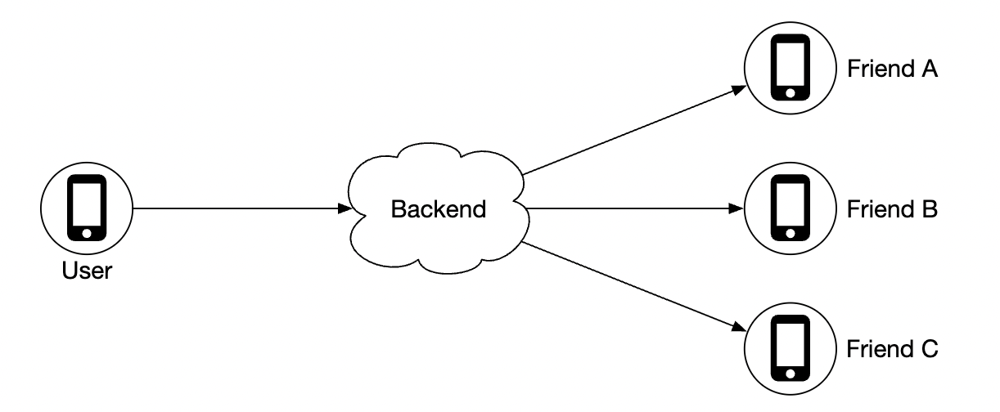
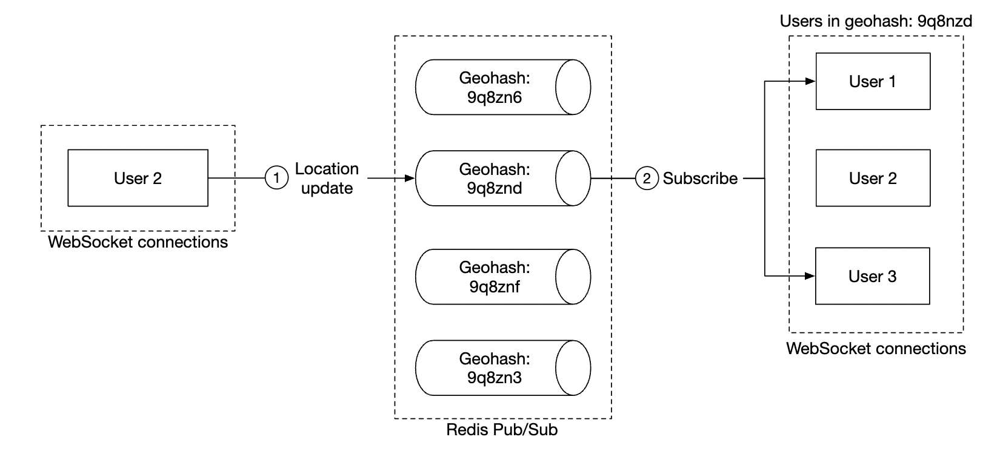

# 第 17 章：附近的朋友

> 原章节：Nearby Friends · 原项目路径 `17. Nearby Friends/`

## 本章导读

你有没有想过，「附近的朋友」这个小功能，可能是整本书里**实时性要求最高、扇出成本最吓人**的一道题？

微信、Facebook、Snapchat 都有这个功能：打开地图，看到几个好友的小头像在附近移动，每个头像旁边写着「距离你 1.2 公里，30 秒前更新」。看起来简单得像个 UI 问题。但把它的数字摊开看：一亿个用户同时在用，每 30 秒上报一次位置，每次上报还要广播给几十个在线好友——**系统每秒要处理上千万条消息**，而且这些消息必须在几百毫秒内送达。

这一章要解决的核心问题是：**如何用一条「广播总线」把一个人的位置变化，实时推给成千上万个关心他的人，同时不把系统烧穿？**

学完这一章，你应该能回答：为什么这里必须用 WebSocket 而不是 HTTP？Redis Pub/Sub 到底丢不丢消息？为什么「每次 GPS 变化都上报」是个错误设计？以及一个更少被讨论但同样重要的问题——**谁能看到我在哪？**

## 你将学到

- 「附近」这个需求如何被拆解成可量化的工程约束（5 英里、30 秒、400 个好友）
- 为什么移动端长连接不能用点对点（P2P），必须走共享后端做扇出
- 扇出爆炸的真实量级：从 33 万次上报，放大到 1300 万条推送
- **Redis Pub/Sub 是即发即忘的**——这个语义缺陷在什么场景下会咬人，以及 Redis Streams / Kafka 的取舍
- 位置上报的节流策略：距离阈值、时间阈值，以及它们带来的「位置不精确」代价
- 位置隐私：精确定位 vs 模糊定位，以及如何防住「多次查询三角定位」
- 有状态服务（WebSocket 服务器）的优雅下线为什么是必修课

---

## 1. 问题定义：把「附近」说清楚

面试里最忌讳的就是听到题目就开始画架构图。第一件事永远是**问清楚边界**。

原笔记给出了一组很好的示范问答，我们逐条看它为什么重要：

| 问题 | 回答 | 为什么关键 |
|---|---|---|
| 多近算「附近」？ | 5 英里（约 8 公里），且这个值要可配置 | 决定了推送过滤半径，直接影响扇出量 |
| 距离是直线距离，还是要考虑中间有河？ | 直线距离 | 直线距离只需要一次球面距离计算，不需要路网寻路——这是数量级的差别 |
| 有多少用户？ | 10 亿用户，其中 10% 用这个功能 | 决定了整章的量级估算 |
| 需要存位置历史吗？ | 需要，对机器学习有价值 | 决定了要额外引入一个写密集的存储 |
| 好友 10 分钟不活跃就消失？ | 是 | 给了 TTL 一个具体的值 |
| 要考虑 GDPR 之类的隐私法规吗？ | 不用，为了简化 | **面试中可以这样简化，真实产品绝对不行**，见第 14 节 |

### 功能需求

1. 用户能在手机上看到附近的好友，每个好友带**距离**和**位置更新时间戳**。
2. 附近好友列表**每隔几秒**刷新一次。

### 非功能需求

- **低延迟（Low Latency）**：位置更新要尽快送达，用户能容忍的延迟是「几秒」级别，不是「几分钟」。
- **可靠性（Reliability）**：**偶尔丢一个位置数据点是可以接受的**，但系统整体必须高可用。这一条是整章设计的钥匙——正是它让「即发即忘」的方案变得可接受。
- **最终一致性（Eventual Consistency）**：位置数据不需要强一致。不同副本之间差几秒是可以接受的。

> **注意第二条和第三条**
> 很多初学者看到「可以丢数据」就觉得这个系统很好做。恰恰相反：**它把难题从「不丢」转移到了「规模」上**。如果不允许丢，你得给每条消息做确认、重传、去重，系统复杂度会翻几倍；允许丢之后，你省下了这些复杂度，但必须扛住每秒上千万条的吞吐。这两条需求合起来，才推导出了后面「Pub/Sub + 拉取兜底」的组合方案。

### 和「附近的人」（Proximity Service）的区别

本书前面讲过「附近的人」这类服务（比如 Yelp、大众点评：找附近的餐厅）。两者最大的区别是：

- **附近的人**：位置是**静态的**。一家餐厅不会一秒钟搬一次家。所以数据可以离线预处理、建空间索引、慢慢查。
- **附近的朋友**：位置**每秒都在变**。数据是**流（Stream）**，不是**快照（Snapshot）**。

这个区别决定了整个架构形态：前者是「查询密集型」，后者是「写入 + 扇出密集型」。**同一个「附近」二字，背后是完全不同的两个系统。**

---

## 2. 量级估算：33 万次上报，1300 万条推送

这是本章最重要的一次计算，请务必跟着算一遍。

### 基础参数

- 使用该功能的日活用户：10 亿 × 10% = **1 亿**
- 同时在线比例：10% → **1000 万并发用户**
- 位置刷新间隔：**30 秒**（人走路很慢，不需要更高频率）
- 平均好友数：**400 个**，且假设他们都用这个功能
- 单页显示：20 个附近好友

### 第一层：位置上报量

$$
\text{上报 QPS} = \frac{10{,}000{,}000}{30} \approx 333{,}333 \approx 33 \text{ 万次/秒}
$$

### 第二层：扇出量（这里是真正的杀手）

关键在**在线比例**。你有 400 个好友，但不是所有人此刻都在用 App。假设同时在线比例也是 10%：

$$
\text{每条更新要推给的人数} = 400 \times 10\% = 40
$$

$$
\text{推送消息总量} = 333{,}333 \times 40 \approx 1{,}333 \text{ 万条/秒}
$$

原笔记写的「~14mil location updates per second」（每秒约 1400 万次位置更新）就是这个数——**但它把「扇出后的推送消息数」叫成了「位置更新数」，这个措辞会误导容量规划**，详见【勘误与补充】。

**一次上报，放大 40 倍。** 这就是「扇出（Fan-out）」的威力。

### 第三层：极端场景——如果好友数不是 400，而是 1000

现在做一次压力测试。假设有 **100 万在线用户**，每人有 **1000 个好友**，且这些好友都在线：

| 上报间隔 | 每秒上报次数 | 每秒扇出消息数 |
|---|---|---|
| 1 秒（不做任何节流） | 1,000,000 | **10 亿条/秒** |
| 5 秒 | 200,000 | **2 亿条/秒** |
| 30 秒 | 33,333 | **3333 万条/秒** |
| 60 秒 | 16,667 | **1667 万条/秒** |

再换成带宽看看。一条位置更新消息（`user_id` + 经度 + 纬度 + 时间戳 + 协议头）大约 100 字节：

- **10 亿条/秒 × 100 字节 = 100 GB/s ≈ 800 Gbps** —— 这个量级已经超过任何单一集群的出口带宽，物理上不可能。
- 3333 万条/秒 × 100 字节 ≈ 3.3 GB/s ≈ 27 Gbps —— 仍然很大，但至少在可建设的范围内。

### 从这次计算里能得出三个结论

**结论一：降低上报频率只能线性地降低总量，救不了你。**
从 1 秒改成 30 秒，消息量从 10 亿降到 3333 万——降了 30 倍，但仍然是几千万。**因为乘数是「好友数」，不是「频率」。**

**结论二：真正的大头是「一个用户有 N 个好友」这件事本身。**
这就是为什么后面要引入**距离阈值过滤**（不在 5 英里内的人根本不推）和**推送合并**（把 40 条零散消息合成 1 条批量消息）。这两招改变的是「每条更新乘以几」，而不是「每秒多少次更新」。

**结论三：必须在客户端节流。**
如果每个客户端都按「GPS 一有变化就上报」来做，那么 1 秒 1 次是常态，系统直接崩。第 7 节专门讲怎么节流。

---

## 3. 通信协议：为什么必须是 WebSocket

在画架构图之前，得先定通信方式。因为「附近的朋友」用的通信模型，和本书前面所有章节都不一样——**它不是请求-响应（Request-Response），而是服务端主动推送（Server Push）**。

### 为什么不用 P2P

最直觉的想法是：让手机和手机直接通信，不走服务器。

这在桌面端（比如 BitTorrent）可行，在移动端完全不可行，原因有三：

1. **NAT 穿透（NAT Traversal）**：手机大多在运营商 NAT 后面，没有公网 IP，两台手机根本连不上，需要 STUN/TURN 打洞，而移动网络的 NAT 行为多变，打洞成功率低。
2. **连接不稳定**：地铁、电梯、切换基站，移动网络会频繁断连重连。
3. **耗电**：维持 P2P 长连接需要频繁心跳，而手机的电池预算极其紧张。

还有第四个更根本的问题：**P2P 要求双方同时在线**。但「附近的朋友」里，我上线时你可能刚下线，我需要的是「你最后已知的位置」，而不是「此刻和你建立连接」。

### 四种方案的对比

| 方案 | 方向 | 服务端开销 | 是否适合本场景 | 原因 |
|---|---|---|---|---|
| **短轮询（Polling）** | 客户端 → 服务端 | 低 | 不适合 | 要「几秒内」感知变化，轮询间隔就得压到秒级，1000 万客户端每秒一次请求 = 1000 万 QPS 的空请求 |
| **长轮询（Long Polling）** | 客户端 → 服务端（挂起） | 中 | 勉强可用 | 每条消息都要重新建立一次 HTTP 请求，连接开销大；服务端要为每个挂起的请求保留一个连接上下文 |
| **SSE（Server-Sent Events）** | 服务端 → 客户端（单向） | 低 | 半适合 | 原生支持断线重连、走标准 HTTP；但**只能服务端推**，客户端上报位置还得另开一条通道 |
| **WebSocket** | 双向 | 低 | **最适合** | 一次 TCP 握手后全双工，单条消息开销只有几字节；上行下行共用一条连接 |

**结论**：用 WebSocket。因为它同时满足两个需求——**服务端主动推好友位置**（下行）+ **客户端持续上报自己的位置**（上行），而 SSE 只能解决一半，长轮询要付出双倍连接成本。

> **这里有一个关键的架构后果**
> WebSocket 服务器是**有状态（Stateful）**的。它必须记住「哪个用户连在我这台机器上」。
>
> 这和本书第 1 章反复强调的「Web 层要无状态」是矛盾的。所以本章的设计里，**无状态的 REST API 服务器和有状态的 WebSocket 服务器是分开的两组服务**——前者管好友关系、用户资料这些常规业务，后者专门管实时位置。第 10 节会讲有状态服务怎么扩容和下线。

---

## 4. 高层设计：一个共享后端做扇出

既然不能用 P2P，那就让**服务端充当扇出（Fan-out）机制**：所有人的位置都上报到服务端，服务端负责找到「谁该收到这条更新」，然后转发出去。

<div align="center"></div>

后端具体做三件事：

1. **接收**所有活跃用户的位置更新。
2. 对每一条更新，**找出所有应该收到它的活跃用户**，并转发。
3. **如果两个好友之间的距离超过配置阈值（5 英里），就不转发**——这一步是扇出的第一道过滤器。

听起来很简单。难点在于**规模**：第 2 节算出来的每秒上千万条消息，任何单机组件都扛不住。

### 先给一个简单版本

<div align="center"></div>

逐个组件看它们各自负责什么：

- **负载均衡器（Load Balancer）**：把流量分发给 REST API 服务器和双向的 WebSocket 服务器。
- **REST API 服务器**：处理辅助任务——管理好友关系、更新用户资料等。这些是常规的请求-响应业务，可以无状态水平扩展。
- **WebSocket 服务器**：**有状态**服务器。它把位置更新转发给对应的客户端，同时负责客户端首次连接时「播种（Seeding）」附近好友的位置数据。
- **Redis 位置缓存（Location Cache）**：存每个活跃用户的**最新位置**。每条记录都带 **TTL（生存时间）**。TTL 过期就说明这个用户不再活跃，数据自动清除。
- **用户数据库（User Database）**：存用户和好友关系。关系型或 NoSQL 都可以。
- **位置历史数据库（Location History Database）**：存用户位置的历史轨迹。**它不直接服务于「附近的朋友」功能**，而是给离线分析（比如机器学习）用。
- **Redis Pub/Sub**：轻量级消息总线。**为每个用户开一个频道（Channel）**，位置更新通过这个频道广播出去。

<div align="center"></div>

上图是这个设计的核心机制：**WebSocket 服务器订阅（Subscribe）所有连在自己身上的用户的好友频道**，一旦收到消息，就转发给对应的客户端。

---

## 5. Redis Pub/Sub：广播总线怎么工作，以及它什么时候会骗你

这是全章最需要讲透的部分。

### 5.1 它解决什么问题

先想一个朴素方案：**不用 Pub/Sub，每台 WebSocket 服务器自己判断**。

问题立刻出现：用户 A 连在服务器 1 上，他的好友 B 连在服务器 2 上。B 的位置更新被服务器 2 收到——但服务器 2 **根本不知道 A 的存在**。它没法把 B 的位置推给 A。

那让服务器 2 把「B 的新位置」广播给所有 WebSocket 服务器？这就是**全量广播**：140 台服务器互相发消息，其中 99% 的接收者手上根本没有关心 B 的人。纯浪费。

**Pub/Sub 的价值就在于此**：它提供了一个「按兴趣订阅」的中转层。服务器 2 只管把 B 的位置发到 `channel:B`，**谁关心 B，谁就订阅了 `channel:B`**。服务器 2 完全不需要知道订阅者是谁、有几台机器、在哪。

这就是**解耦（Decoupling）**——生产者和消费者互相不感知。它让「加一台 WebSocket 服务器」变成一件不需要通知任何人的事。

### 5.2 但是：Redis Pub/Sub 是即发即忘的

**这是原笔记完全没有讲清楚、而初学者最容易踩坑的地方。**

Redis Pub/Sub 的投递语义是 **至多一次（At-Most-One）**：

- 消息**不落盘**。Redis 只是把消息复制到「当前这一刻」在 `server.clients` 里注册了该频道的连接的发包缓冲区，然后立刻返回。
- 消息**没有确认（Ack）**。发布者不知道有没有人收到、收到几个。
- 消息**没有重放（Replay）**。历史消息不存在，你不可能「从某个位置重新消费」。
- 消息**没有消费者组（Consumer Group）**。每个订阅者都收到全量消息，无法做「同一个消息只被一台机器处理」的负载均衡。

说白了：**Pub/Sub 像广播电台，不像邮局。** 你打开收音机之前播出的内容，永远听不到了；而邮局会把信留在信箱里等你回来取。

### 5.3 这在什么情况下会咬人

本章的非功能需求说了「偶尔丢数据点可以接受」，所以基础场景确实没问题。但下面四种情况，丢失是不可接受的：

**情况一：客户端首次连接（冷启动）。**
用户 A 刚打开 App。他不能靠订阅 Pub/Sub 拿到好友位置——因为**过去的位置更新早就被丢弃了**。他必须先**回源查询 Redis 位置缓存**，做一次快照拉取。这就是原笔记说的「seeding」。**这说明：Pub/Sub 永远不能作为唯一的数据源，必须有一个「当前状态存储」兜底。**

**情况二：WebSocket 服务器扩容 / 缩容 / 重启。**
服务器下线时，连在它上面的用户要重连到新服务器。新服务器需要重新 `SUBSCRIBE` 那批好友频道。**在这个重订阅的窗口期（几百毫秒到几秒），所有经过这些频道的更新全部丢失。** 结果是：用户的地图上，某个好友的位置「卡住」了，直到下一次更新（最长 30 秒）才恢复。

**情况三：网络抖动导致的订阅断连。**
Redis 客户端与 Redis 服务器之间的连接也会断。重连期间同样是黑洞。

**情况四：任何需要「事件流」语义的功能。**
如果产品经理后来说「我要做『小明 5 分钟前路过你公司附近』的提醒」，Pub/Sub 直接不成立——你需要的是历史事件流。

### 5.4 补救手段：推送 + 拉取兜底

在讨论「换掉 Pub/Sub」之前，先记住一个更便宜、更通用的解法：

> **给每条位置更新带上单调递增的版本号（或时间戳），客户端记录每个好友的「最后看到的版本」。一旦发现版本号跳变（出现断档），就主动发起一次快照拉取，从 Redis 位置缓存补齐当前状态。**

这个模式叫**推送 + 拉取兜底（Push with Pull Fallback）**，它把「保证不丢」这个难题，转化成了「丢了之后能自愈」。对于「只关心最新值」的状态型数据，这是最优解——因为你**本来就不需要那些中间态消息**。

### 5.5 如果要换掉它：Streams vs Kafka

原笔记给的替代方案是 Erlang（见第 15 节），但 Erlang 解决的不是这个问题。**真正语义上的替代品是 Redis Streams 和 Kafka。**

| 方案 | 投递语义 | 持久化 | 重放 | 消费者组 | 典型延迟 | 适合什么 |
|---|---|---|---|---|---|---|
| **Redis Pub/Sub** | 至多一次 | 无 | 无 | 无 | 亚毫秒 | 允许丢的实时广播；只关心最新值 |
| **Redis Streams** | 至少一次 | 有（受内存限制，可配 AOF/RDB） | 有 | 有 | 毫秒级 | 中等规模、需要重放与消费位点 |
| **Kafka** | 至少一次（可配精确一次） | 有（磁盘 + 多副本） | 有（按 offset） | 有 | 几毫秒到几十毫秒 | 大规模、需要持久化、重放、多消费者 |
| **NATS** | 至多一次（Core）/ 至少一次（JetStream） | JetStream 有 | JetStream 有 | 有 | 亚毫秒 | 轻量高吞吐的实时消息 |

**为什么本场景不直接用 Kafka 做广播？**

三条理由：

1. **延迟**。Kafka 的端到端延迟通常是几毫秒到几十毫秒，而 Pub/Sub 是亚毫秒。对于「几秒内送达」的需求，Kafka 其实够用——但代价在后面两条。
2. **成本与复杂度**。每秒上千万条消息全部落盘、多副本复制，存储和网络成本极高。而**位置更新的绝大多数中间态消息是垃圾**——30 秒前的位置对用户毫无价值，消费者收到后只会丢掉。
3. **语义错配**。位置数据是**「最新值覆盖」（Last-Write-Wins）**的状态，不是**事件流**。对一个状态型数据做「持久化事件日志」，是在用错误的工具。

**正确的组合是：把两条链路分开。**

```text
实时广播链路（快、允许丢）：  WebSocket 服务器 → Redis Pub/Sub → 订阅的 WebSocket 服务器
历史分析链路（慢、不能丢）：  位置更新 → Kafka → Cassandra（位置历史）→ 离线分析 / 路况建模
```

这也正好对应原笔记里的设计——它同时有「Redis Pub/Sub」和「位置历史数据库 + Kafka 用于分析」。**两条链路各自用对了工具，只是原文没有把这个「为什么」讲出来。**

> **Redis 7.0 的一个补充**
> Redis 7.0 引入了**分片 Pub/Sub（Sharded Pub/Sub）**，用 `SSUBSCRIBE` / `SPUBLISH` 命令。在 Redis Cluster 模式下，普通 Pub/Sub 的消息必须通过集群总线（Cluster Bus）广播到**所有**节点，这在大集群里是巨大的浪费；分片 Pub/Sub 让消息只在持有该频道的分片内传播，显著降低集群内部流量。如果你要在大规模集群里用 Pub/Sub，这是必知的一个特性。

---

## 6. 位置更新的完整流程

现在把上面的零件串成一条完整链路。

<div align="center"></div>

1. 手机客户端把位置更新发给负载均衡器。
2. 负载均衡器把它转发到该客户端**那条持久连接所在的 WebSocket 服务器**。
3. WebSocket 服务器把位置写入**位置历史数据库**（用于离线分析）。
4. 位置数据写入 **Redis 位置缓存**。同时，WebSocket 服务器把位置**缓存在自己的内存里**，用于后续的距离计算（避免每次都去查 Redis）。
5. WebSocket 服务器把位置**发布（Publish）到该用户自己的频道**。
6. Redis Pub/Sub 把这条更新**广播给该频道的所有订阅者**——也就是那些「手上连着这个用户的好友」的 WebSocket 服务器。
7. 订阅的 WebSocket 服务器收到更新，**计算这条更新该发给哪些用户**（距离是否在阈值内），然后发送。

下面是同一流程的更详细版本：

<div align="center"></div>

### 关于「40 条」这个数字

原笔记有一句话容易被忽略，但它其实是整个容量模型的关键：

> 「平均而言，每次要转发 40 条位置更新，因为一个用户平均有 400 个好友，其中 10% 在线。」

这句话解释了第 2 节里那个 40 倍的放大系数从哪来。它也提示了一个优化方向：**如果把 40 条消息合并成 1 条批量消息发给同一个接收者，扇出量能降低近 40 倍。**

具体算一下：1000 万在线用户，每人平均从 40 个在线好友那里收更新，好友每 30 秒更新一次：

- **不合并**：10,000,000 × (40 / 30) ≈ **1333 万条/秒**
- **按 5 秒窗口合并**：10,000,000 × (1 / 5) = **200 万条/秒**

**降了 6.7 倍**，代价是消息最多延迟 5 秒。对于「几秒内送达」的需求，这笔交易非常划算。

### 距离阈值需要一个「滞回（Hysteresis）」

原文说「距离超过阈值就不转发」。听起来没问题，但实现时会遇到**抖动**：

假设阈值是 5 英里。一个好友正好在 5.0 英里处走动，一会 4.99、一会 5.01。系统就会疯狂地在「推送」和「不推送」之间切换，客户端上的头像反复出现消失。

**解法**：用两个不同的半径——

- **显示半径**：5 英里（决定「谁出现在列表里」）
- **推送半径**：6 英里（决定「谁收到更新」）

只有当好友移动到 6 英里以外才停止推送，回到 5 英里以内才重新出现在列表里。中间这 1 英里的缓冲区，就是滞回带。这是**控制理论里的经典手法**，在系统设计里同样适用（类似 TCP 的慢启动阈值、缓存的高低位水位线）。

---

## 7. 位置上报的节流策略：不是每次 GPS 变化都上报

原文只说了「位置刷新间隔是 30 秒」，但**没有说这个 30 秒是怎么来的、客户端应该怎么实现**。这是初级开发者最容易做错的地方。

### 为什么不能「GPS 一变就上报」

手机 GPS 芯片每秒都会输出一个新坐标，即使你坐着不动，坐标也会在几米范围内漂移。如果按这个频率上报：

- 上报量从每秒 33 万次变成每秒 **1000 万次**（第 2 节算过，扇出后是 10 亿条/秒）。
- 手机电量会以肉眼可见的速度下降（GPS 是高耗电模块）。
- 移动流量消耗巨大。
- **而且毫无价值**：我坐在椅子上，坐标从 (39.9042, 116.4074) 变成 (39.9043, 116.4075)，对好友来说没有任何意义。

### 双阈值 + 心跳：一个可用的节流规则

工程上常用的规则是三个参数组合：

| 参数 | 含义 | 建议值 |
|---|---|---|
| **距离阈值 D** | 移动超过 D 米才触发上报 | 100 米 |
| **最小间隔 T_min** | 两次上报之间至少间隔多久 | 15 秒 |
| **最大间隔 T_max** | 即使完全没动，也要定期上报一次（心跳） | 120 秒 |

上报条件写成伪代码：

```python
if (distance_since_last_report > 100 or now - last_report > 120) \
   and (now - last_report > 15):
    send_location_update()
```

- 第一个条件：**移动够远**（位置有意义的变化），**或者**太久没报（证明「我还活着」）。
- 第二个条件：**频率上限**（防止高速移动时上报过密）。

### 距离阈值换算成实际频率

100 米的距离阈值，在不同速度下对应的上报频率差别很大：

| 出行方式 | 典型速度 | 移动 100 米耗时 | 有效上报频率 |
|---|---|---|---|
| 步行 | 1.4 m/s（5 km/h） | 约 71 秒 | 很稀疏 |
| 骑行 | 4.2 m/s（15 km/h） | 约 24 秒 | 接近 30 秒基线 |
| 城市驾车 | 8.3 m/s（30 km/h） | 约 12 秒 | 是基线的 2.5 倍 |
| 高速公路 | 27.8 m/s（100 km/h） | 约 3.6 秒 | 是基线的 8 倍 |

**注意最后一行的含义**：如果只用距离阈值、不加 `T_min` 上限，高速行驶的用户会把上报频率推到 3.6 秒一次——比 30 秒基线高 8 倍。这就是为什么 `T_min` 是必需的。

### 代价：位置是不精确的

节流不是免费的，你必须诚实地接受三个后果：

1. **地图上的位置是「上一次上报时的位置」**。一个高速行驶的好友，地图上显示的位置最多可能偏差 `27.8 m/s × 15 s ≈ 417 米`。所以 UI 上必须显示「**30 秒前更新**」这个时间戳——这正是功能需求里明确要求带上时间戳的原因。
2. **「到达」类事件会漏判**。如果产品要做「好友到达你附近 500 米时通知你」，靠 100 米的采样粒度可能会「跳过去」（从 600 米直接跳到 400 米之外再跳到 350 米），需要在服务端做插值或降低该场景的阈值。
3. **静止的用户会一直显示同一个位置**。靠 `T_max` 心跳来区分「静止」和「App 被杀掉」——如果不发心跳，服务端无法判断该用户是站着不动还是已经退出。

> **一个真实的取舍**
> 节流本质上是**用位置精度换系统容量和电池续航**。这个取舍点应该做成**可配置的**（原笔记也提到 5 英里应该可配置）。步行导航场景需要更高的精度，而「看看朋友在哪个城市」只需要城市级精度——**同一个系统应该支持多种精度档位**。

---

## 8. API 设计

### WebSocket 例程

需要支持五类消息：

| 例程 | 方向 | 说明 |
|---|---|---|
| **周期性位置更新** | 客户端 → 服务端 | 用户把自己的位置发给 WebSocket 服务器 |
| **接收位置更新** | 服务端 → 客户端 | 服务器推送好友的位置和时间戳 |
| **WebSocket 客户端初始化** | 双向 | 客户端发送自己的位置，服务器返回附近好友的位置快照（seeding） |
| **订阅新好友** | 服务端 → 客户端 | 服务器告知客户端「你应该开始追踪这个好友了」，比如好友刚上线 |
| **取消订阅好友** | 服务端 → 客户端 | 服务器告知客户端「这个好友你可以不用追踪了」，比如好友下线 |

> **注意最后两条为什么是服务端主动发起的**
> 这是一个容易被忽略的设计细节：**客户端不应该自己去维护「该追踪哪些好友」这份列表**。因为「谁在线」这件事只有服务端知道。如果让客户端自己轮询好友列表，就会产生大量无效请求。让服务端通过 WebSocket 主动下发「订阅/退订」指令，客户端只做执行者——这是一个**职责划分**的经典例子：**把判断逻辑放在拥有数据的那一侧。**

### HTTP API

用于辅助职责的传统请求-响应接口，比如：

- 添加 / 删除好友
- 更新用户资料
- 查询好友列表

这些接口可以完全无状态，走常规的 REST 服务器。

---

## 9. 数据模型

### 位置缓存

```text
user_id  →  (latitude, longitude, timestamp)
```

**为什么选 Redis？**

1. 我们**只关心当前位置**，不需要历史——这是典型的 KV 场景。
2. Redis 原生支持 **TTL 过期淘汰（TTL Eviction）**，正好用来实现「用户不活跃就自动移除」。
3. 读写都是内存操作，延迟在亚毫秒级，能扛住每秒几十万次的写入。

TTL 的取值和需求对齐：功能需求说「好友 10 分钟不活跃就从功能中消失」，所以 TTL 设为 10 分钟。用户每 30 秒上报一次，只要还活着就会不断刷新 TTL；一旦停止上报（关掉 App、卸载、断网），10 分钟后记录自动消失。

### 位置历史表

同样的四个字段，但存在关系型/宽列数据库里。原笔记推荐 **Cassandra**，理由是**它针对写密集负载做了优化**。

这个选择是对的，理由值得展开：

- 位置历史是**纯追加（Append-Only）**的写入模式，没有更新、没有复杂查询。
- 数据量极大：1000 万并发用户 × 每 30 秒一条 = **每天约 288 亿条记录**。这个量级下，任何需要「随机写 + 二级索引」的数据库都会被压垮。
- Cassandra 的 **LSM-Tree（Log-Structured Merge Tree）** 存储引擎把随机写转成顺序写，天然适合这种场景。

> **补充：为什么位置历史不能和位置缓存用同一个存储？**
> 因为两者的**访问模式完全相反**：缓存是「高频写 + 高频按主键读 + 数据会过期」，历史是「高频写 + 几乎不读 + 数据永久保留」。把它们放在同一个存储里，任何一边的优化都会伤害另一边。**按访问模式拆分存储，而不是按业务概念拆分**——这是数据建模的核心原则之一。

---

## 10. 扩展性深挖：每个组件怎么长大

逐个组件过一遍。

### REST API 服务器

最简单：通过自动伸缩组（Auto-scaling Group）复制实例即可。它们是无状态的。

### WebSocket 服务器

可以水平扩展，但有一个**必须处理的细节：优雅下线（Graceful Shutdown）**。

WebSocket 服务器是**有状态**的——它记住了「哪些用户连在我这里」。你不能直接把它杀掉，否则：

- 上面所有用户的连接被硬断开，客户端要经历一次完整的重连（TCP 握手 + WebSocket 升级 + 快照拉取）。
- 重连风暴可能在几秒内把所有其他服务器压垮。

**正确做法**：在负载均衡器里把这个节点标记为 **draining（排水）**，**停止向它分配新连接**，然后：

1. 给现有客户端发送「请重连到其他服务器」的指令（或者等客户端自然重连）。
2. 等待连接数降到 0，或者等待一个超时（比如 60 秒）。
3. 确认连接已排空后，再从服务器池中移除。

> **这就是「有状态服务」和「无状态服务」在运维上的根本差别**：无状态服务可以随时 `kill -9`，有状态服务必须先「排空」。第 1 章讲的自动伸缩，在有状态服务上做不到。

### 客户端初始化

客户端第一次连上某台服务器时，服务器需要做四件事：

1. 拉取该用户的好友列表（查用户数据库）。
2. 在 Redis Pub/Sub 上**订阅这些好友的频道**。
3. 从 Redis 位置缓存里**读取这些好友的当前位置**。
4. 把这份位置快照**下发给客户端**。

注意第 2 步和第 3 步的分工——**这正是第 5.3 节讲的「Pub/Sub 不能作为唯一数据源」的直接体现**：订阅负责「未来的更新」，快照负责「此刻的状态」。两者缺一不可。

### 用户数据库

按 `user_id` **分片（Shard）**。

原笔记还给了一个组织上的建议：**把用户/好友数据通过一个专门的服务和 API 暴露出去，由专门的团队维护**。这是**微服务边界**的划分思路——好友关系是多个功能（附近的朋友、动态、私信）都要用的公共能力，把它做成独立服务，避免每个功能各自去查同一张表。

### 位置缓存

可以通过增加 Redis 节点来分片。

原笔记提到一个很聪明的点：**TTL 本身就限制了内存占用上限**。因为只有「活跃用户」的数据才在缓存里，不活跃的会自动过期。所以内存用量不是「历史总用户数」的函数，而是「**同时在线用户数**」的函数——这是一个常数级的上限，不会随时间无限增长。

即便如此，**写入负载仍然很大**，需要靠分片来分担。

### Redis Pub/Sub 服务器

原笔记在这里说：

> 「我们利用这样一个事实：如果频道被创建但没有在使用，是不消耗内存的。因此我们可以为所有使用该功能的用户**预分配（Pre-allocate）频道**，避免处理『用户上线时创建一个新频道并通知活跃 WebSocket 服务器』这种情况。」

**这段推理有问题**，见【勘误与补充】。简单说：Redis Pub/Sub 的频道是**隐式存在**的——`SUBSCRIBE` 一个不存在的频道会自动创建它，最后一个订阅者离开后它自动销毁。所以「预分配频道」在 Redis Pub/Sub 里没有对应的操作。

真正需要预分配的，是**「频道 → Redis 节点」的归属映射**（也就是哈希环上的分布）。预先算好这份映射并缓存在每台 WebSocket 服务器内存里，新用户上线时就能**直接算出该去哪个节点订阅**，而不需要一次分布式协调。

---

## 11. 深挖：Redis 集群的容量规划

这一节是原笔记最有价值的量化分析，我们完整跟一遍。

### 内存需求

> 「我们需要大约 **200 GB 内存**来维护所有的 Pub/Sub 频道。可以用 **2 台各 100 GB 的 Redis 服务器**实现。」

推算一下这个数字的来源：使用该功能的用户总数是 **1 亿**（10 亿 × 10%）。200 GB ÷ 1 亿 = **每个频道约 2 KB**。

> **这里要诚实说明**：原笔记没有解释 200 GB 是怎么来的。上面这个「2 KB/频道」是我们按它给的数字反推的。更合理的解释是——**内存主要消耗在「订阅关系」上，而不是「频道名」上**：
> 1000 万并发用户 × 400 个好友 = **40 亿条订阅关系**。200 GB ÷ 40 亿 ≈ **50 字节/条**，这个量级对「一个订阅项（客户端指针 + 频道引用）」是合理的。
> 但请注意，**这是我们的事后推算，不是原文给出的推导过程**。面试时如果你要引用这个数字，建议自己把推导讲出来，而不是直接甩「200 GB」这个结论。

### CPU 需求（真正的瓶颈）

> 「考虑到我们需要每秒推送约 1400 万条位置更新，假设单台服务器能处理约 **10 万次推送/秒**，我们至少需要 **140 台 Redis 服务器**。」

验算：14,000,000 ÷ 100,000 = **140**。✓

> **关于「10 万次/秒」这个假设**
> 这是一个**保守的容量规划值**。真实的 Redis Pub/Sub 单机吞吐和三个因素强相关：**消息大小**、**每个频道的订阅者数量**、**网络带宽**。消息越大、订阅者越多，吞吐越低。
> 工程上的正确做法是：**在自己的硬件上用真实消息做压测**，而不是照搬任何一个数字。原笔记给 10 万是合理的起点，但不是定律。

### 结论：需要分布式 Redis 集群

单机 100 GB 内存 + 10 万次/秒，两个维度都撑不住，所以必须上集群。这就需要**服务发现（Service Discovery）**组件（ZooKeeper 或 etcd）来跟踪哪些节点是活的。

需要在服务发现里编码的数据是**「频道 → 节点」的分布信息**：

<div align="center"></div>

WebSocket 服务器从 ZooKeeper 拉取这份数据，用来判断「某个频道在哪台 Redis 上」。**为了效率，哈希环数据可以缓存在每台 WebSocket 服务器的内存里**，避免每次订阅都去查 ZooKeeper。

### 集群的弹性伸缩

- **按需扩缩容**：可以起一个每日定时任务，根据历史流量数据调整集群规模。
- **超量配置（Over-provision）**：也可以故意多配一些容量来应对突发流量。这是**成本换稳定性**的交易。

### 为什么 Redis 集群要当「有状态存储」对待

原笔记这一点讲得很好：Redis 集群在这里**不能当作无状态组件随意增删**，原因有两个：

1. **它持有状态**——频道和订阅关系都在节点内存里。
2. **它需要和订阅者协调**——节点增减时，频道要迁移，订阅者必须**交接（Hand-off）**到新节点。

### 伸缩时的三个风险

| 风险 | 后果 | 缓解手段 |
|---|---|---|
| **大量重订阅请求** | 频道迁移导致 WebSocket 服务器集中重订阅，可能压垮 ZooKeeper 和 Redis | 分批迁移；限制并发重订阅速率 |
| **位置更新丢失** | 迁移窗口内的更新丢失（本章可接受，但应尽量减少） | **把操作安排在一天中流量最低的时段** |
| **迁移数据量过大** | 全量重哈希会导致几乎所有频道搬家 | **用一致性哈希（Consistent Hashing）**，把迁移量从「几乎全部」降到约 1/N |

<div align="center"></div>

> **一致性哈希在这里解决什么、不解决什么**（和第 1 章的呼应）
> - **解决**：节点增减时的**迁移量**。从「重新哈希，几乎全部频道搬家」降到「只有相邻节点的 1/N 搬家」。
> - **不解决**：**热点**。如果某个超级明星用户的位置更新极其频繁，他所在的频道所在节点依然会过载。对策是**给热点频道单独分配节点**，或者**本地缓存 + 限流**。
> - **也不解决**：**迁移本身**。一致性哈希只决定「谁该持有哪个频道」，具体怎么把订阅关系搬过去、怎么让订阅者交接，还得自己实现。

---

## 12. 深挖：好友增删与「鲸鱼」用户

### 添加 / 删除好友

只要好友关系发生变化，**负责该用户的 WebSocket 服务器就必须订阅 / 取消订阅**对方的位置频道。

实现方式：因为「附近的朋友」是一个更大 App 的一部分，可以假设客户端注册了一个**回调（Callback）**——当好友关系变化的事件发生时，客户端会向 WebSocket 服务器发一条消息，触发相应的订阅 / 退订动作。

> **这里有一个原笔记没有展开的坑：时序问题。**
> 假设 A 和 B 刚成为好友。客户端回调触发订阅，但**订阅生效之前的这段时间**，B 的位置更新 A 是收不到的。如果此时 A 打开地图，会看到 B 的位置是**从缓存快照里读出来的旧值**（可能是几十秒前的）。
> 正确做法是：**订阅成功之后再拉一次快照**，保证「订阅生效点」和「快照时间点」之间的空窗最小。这是分布式系统里反复出现的模式——**「建立监听」和「读取当前值」之间永远存在窗口，必须显式处理。**

### 好友特别多的用户（「鲸鱼」用户）

原笔记给的方案很直接：**给好友总数设上限**，比如 Facebook 就是 **5000 个好友**上限。

为什么需要这个上限？回到第 2 节的扇出公式：

$$
\text{扇出量} = \text{上报频率} \times \text{好友数} \times \text{在线比例}
$$

**好友数是一个直接乘数。** 如果没有上限，一个加了 10 万好友的账号每次移动，就要产生 10 万条推送。这就是**热点问题（Hot Key / Celebrity Problem）**的一个变体。

原笔记说：「处理『鲸鱼』用户的 WebSocket 服务器负载会更高，但只要有足够多的 WebSocket 服务器，就没问题。」

**这个说法只对了一半**：

- 对的部分：**扇出是分散的**。10 万条推送会被分发到「手上连着这 10 万好友」的多台服务器上，不是单机承担。这一点原笔记说对了。
- 不对的部分：**「发布」这一侧是集中的**。该用户的 WebSocket 服务器要一次性把消息 Publish 到一个被 10 万订阅者订阅的频道上，**这台 Redis 节点**和**这条发布路径**会成为瓶颈。加更多 WebSocket 服务器解决不了这个单点。

**更完整的对策**（按有效性排序）：

1. **好友数上限**（最直接，也最容易被产品接受）。
2. **对高频用户降采样**：对好友数超过阈值的账号，降低其位置更新频率。
3. **分级推送**：只推送给「距离在阈值内」的好友——这一步在原设计里已经有了，它天然地把 10 万好友削减到几百个。
4. **热点频道独立分片**：把鲸鱼用户的频道放到专用 Redis 节点上。

---

## 13. 深挖：附近随机陌生人

面试官可能会追问：「如果产品要加一个功能——偶尔在地图上看到一个**随机的陌生人**，怎么改设计？」

这改变了问题的性质：原来我们只需要在**好友图（Friend Graph）**上做扇出，现在需要在整个**地理空间**上做扇出。

原笔记给的方案是：**基于 geohash 定义一组 Pub/Sub 频道池**。

<div align="center"></div>

机制：

- 把世界按 geohash 切成网格，**每个 geohash 单元对应一个 Pub/Sub 频道**。
- 任何处在这个 geohash 单元里的用户，都订阅该频道的消息，从而收到**同一单元内其他随机用户**的位置更新。

<div align="center"></div>

### 边界问题

geohash 有一个经典缺陷：**两个人在现实中离得很近，但恰好被一条格线分开，属于不同的 geohash 单元**。如果只订阅自己所在的那个单元，就会漏掉隔壁单元里那个「其实就在你旁边」的人。

解法：**同时订阅相邻的 geohash 单元**（通常是周围 8 个，加上自己共 9 个）。

<div align="center"></div>

> **代价提醒**
> 订阅 9 个单元意味着**接收量变成 9 倍**。这是一个典型的**「召回率 vs 成本」取舍**：
> - 只订阅 1 个单元 → 便宜，但会漏人。
> - 订阅 9 个单元 → 不漏人，但流量 ×9。
> - 折中方案：**根据 geohash 单元的实际大小动态决定**。geohash 前缀越短，单元越大（一个 4 字符的 geohash 单元约 39 km × 20 km），此时订阅 9 个单元意味着覆盖极大区域，流量不可接受；反之，前缀越长单元越小（7 字符约 153 m × 153 m），订阅 9 个单元的代价可以忽略。
> **所以「订阅几个相邻单元」应该和 geohash 精度一起调参**，而不是固定 9 个。

---

## 14. 位置隐私：谁能看到我

原笔记在需求澄清阶段就明确说了「不用考虑 GDPR，为了简化」。**这是面试场景的合理简化，但在真实产品里，位置数据是最敏感的数据类别之一。**

这一节补齐这块内容。

### 14.1 谁能看到我

「附近的朋友」的访问控制模型看似简单：**只有我的好友能看到我**。但实际要回答的问题远不止这一个：

- 我能不能对**特定好友**隐藏位置？（比如「对某人隐身」）
- 我能不能设置**时间段**？（比如「只在工作日 9-18 点可见」）
- 好友的好友能不能看到我？（转发的边界在哪）
- 我退出 App 后，我的位置还会保留多久？
- 我能不能看到**谁看过我的位置**？

**设计上的关键点**：访问控制必须在**服务端**执行，而且必须在**扇出的最早环节**执行。如果在 WebSocket 服务器转发时才过滤，位置数据已经在内部网络里流转过了，日志、抓包、内部人员都能看到。**越早过滤越安全。**

### 14.2 精确定位 vs 模糊定位

不是所有场景都需要米级精度。常见的精度分级：

| 精度档位 | 展示形式 | 典型 geohash 前缀长度 | 单元尺寸 |
|---|---|---|---|
| **精确** | 真实坐标 + 距离 | 7~9 位 | 153 m ~ 5 m |
| **街区级** | 取网格中心 | 6 位 | 约 1.2 km × 0.6 km |
| **区域级** | 取网格中心 | 5 位 | 约 4.9 km × 4.9 km |
| **城市级** | 只显示城市名 | 4 位 | 约 39 km × 20 km |

> **geohash 精度对照表**（这是空间索引的基本功，建议记住 5~8 位这几档）
>
> | 长度 | 单元尺寸（宽 × 高） |
> |---|---|
> | 1 | 5009 km × 4993 km |
> | 2 | 1252 km × 624 km |
> | 3 | 156 km × 156 km |
> | 4 | 39.1 km × 19.5 km |
> | 5 | 4.9 km × 4.9 km |
> | 6 | 1.22 km × 0.61 km |
> | 7 | 153 m × 153 m |
> | 8 | 38.2 m × 19.1 m |
> | 9 | 4.77 m × 4.77 m |
>
> 注意**单元宽度和高度的比例**：奇数位时宽是高的 2 倍，偶数位时是正方形。这是因为 geohash 交错编码经度和纬度，每多一位就只把一个方向再对半分。

**关键工程约束：模糊化必须在服务端做。**

> **这是一个初学者常犯的错误**：为了「保护隐私」，把精确坐标下发给客户端，让客户端自己取整显示。
> **这完全没有保护作用。** 任何人抓包、或者反编译 App、或者用中间人代理，都能直接拿到精确坐标。**隐私处理必须在数据离开你控制的边界之前完成。**

### 14.3 防「多次查询三角定位」

这是最容易被忽略、也最危险的攻击方式。

**攻击原理**：假设系统只返回「用户在 geohash 网格 A 内」这种模糊信息。攻击者一个人看不出来什么。但是——

1. 攻击者用**多个账号**（或者收买多个好友）在不同时间点查询目标用户的位置。
2. 每次得到一个网格或一个带噪声的坐标。
3. **取多次观测的交集**，或者**对带噪声的坐标求平均**，就能把真实位置逼近到很高精度。

如果系统每次返回的都是**同一个网格中心点**，攻击者只要两次观测到不同网格，就能推断出目标在网格边界附近。如果系统每次返回的是**独立随机噪声**，攻击者多查几次做平均，噪声就被消掉了。

**防护手段**（必须组合使用）：

| 手段 | 原理 | 注意 |
|---|---|---|
| **时间窗内噪声一致** | 同一个时间窗（比如 5 分钟）内，对同一目标返回**同一个**模糊坐标；窗口切换时才换新噪声 | 单纯加独立随机噪声会被平均掉，必须「窗口内一致」 |
| **按查询者加盐** | 噪声的随机种子取决于「查询者 ID + 时间窗」，不同查询者看到不同的偏移 | 防止多个账号合谋求平均 |
| **限制查询频率** | 对「查询同一目标」的请求做限流 | 直接抬高攻击成本 |
| **异常模式检测** | 检测「同一账号短时间内查询同一目标多次」「多个新注册账号查询同一目标」 | 需要风控系统配合 |
| **返回模糊网格而非噪声坐标** | 网格是离散的，多次观测只能定位到网格 | 但网格本身可被求交，仍需配合频率限制 |
| **历史数据降精度** | 位置历史只保留聚合后的结果，不保留原始轨迹 | 历史轨迹是「时序三角定位」的最佳素材 |

> **一个更根本的原则**
> **不要在系统里长期保存精确的原始位置数据，除非有明确的业务理由。** 位置历史是「时序三角定位」的完美素材——攻击者只要拿到一个人的完整轨迹，就能推断出他的住址、工作地点、就医记录、宗教活动场所。所以：
> - 原始位置数据设置**短保留期**（比如 30 天），之后降精度或聚合。
> - 用于分析的轨迹数据做**匿名化 + 加噪**，并且与用户身份**解耦存储**。
> - 明确区分「实时位置」（需要精确、短保留）和「历史轨迹」（需要模糊、长保留）。

### 14.4 合规视角

- **GDPR** 把位置数据纳入个人数据范围，并且欧盟数据保护机构的观点是：**位置可以间接暴露健康、宗教、性取向等特殊类别信息**（比如「每周三晚上出现在某诊所」），因此适用更严格的保护要求。
- 核心义务包括：**目的限制**（收集位置只能用于声明的目的）、**数据最小化**（能模糊就不要精确）、**存储限制**（不能无限期保存）、**用户可删除**（被遗忘权）。
- 对中国开发者：个人信息保护法同样把行踪轨迹列为**敏感个人信息**，需要单独同意。

**所以在真实项目里，「不用考虑 GDPR」这个面试简化，恰恰是不能照搬到生产环境的部分。**

---

## 15. 替代方案：Redis Pub/Sub、Streams、Kafka 与 Erlang

第 5.5 节已经对比过 Pub/Sub / Streams / Kafka 的语义差异。这里专门讨论原笔记提到的 Erlang。

### 原笔记的说法

> 「Redis Pub/Sub 的一个替代方案是利用 **Erlang**——一门为分布式计算应用优化的通用编程语言。用它我们可以启动数百万个小的 Erlang 进程，让它们互相通信。我们可以在同一个分布式 Erlang 应用里**同时处理 WebSocket 连接和 Pub/Sub 频道**。不过挑战在于：Erlang 是一门小众语言，很难招到优秀的 Erlang 开发者。」

### 这个说法哪里不准确

**Erlang 解决的不是「Pub/Sub 的语义缺陷」问题。**

原笔记把 Erlang 放在「Alternative to Redis pub/sub」这一节，会让人以为「换成 Erlang 就不会丢消息了」。**这是错的**：

- Erlang/OTP 的进程间消息传递同样是**内存中的、即发即忘的**。进程 A 给进程 B 发消息，如果 B 此刻不存在（已经退出），消息就丢了——这和 Redis Pub/Sub 的语义**完全一样**。
- Erlang 的 `pg`（Process Group）模块做的广播，同样不持久化。

**Erlang 真正解决的问题是另一个**：**用一套统一的并发模型，同时承载「百万级长连接」和「进程间消息路由」**。

它的优势在于：

1. **极轻量的进程**：Erlang 进程不是操作系统线程，一个进程初始只占几百字节，单机跑百万个是常规操作。所以「一个 WebSocket 连接 = 一个 Erlang 进程」在 Erlang 里是自然的设计，在其他语言里是灾难。
2. **隔离与容错**：进程之间完全隔离，一个崩溃不影响其他。配合 **Supervisor 树（监督树）**，崩溃的进程会被自动重启。这正是「偶尔丢消息、但系统整体必须可用」这条非功能需求的完美映射。
3. **热代码升级（Hot Code Swap）**：可以在不停机的情况下更新代码。对于一个连接数千万的长连接服务，这是巨大的运维优势。
4. **分布式透明**：`!`（发送消息）操作符在本地进程和远程进程上写法一样，节点间通信对开发者透明。

**工业界的例证**：WhatsApp 曾公开分享过用 Erlang 在单台服务器上维持**百万级并发长连接**的工程经验（2012 年前后的 Erlang Factory 演讲），这在当时是相当惊人的密度。这是 Erlang 在这个问题域里最有说服力的实战证据。

### 所以正确的表述应该是

> **Erlang 是「换掉整个 WebSocket + 消息总线的实现技术栈」的选项，不是「修复 Pub/Sub 语义」的选项。**
>
> - 想修**语义**（不丢、可重放）→ 用 **Redis Streams** 或 **Kafka**。
> - 想修**连接密度和容错模型** → 考虑 **Erlang/OTP**（或它的现代继承者 Elixir）。
> - 两者可以**叠加**：用 Erlang 承载连接，用 Kafka 做持久化的事件流。

**代价**也很真实：Erlang 生态相对小众，招聘难度高，与主流 Java/Go 技术栈的集成成本不低。**技术选型永远要考虑团队能力，而不只是技术优越性。**

---

## 16. 收尾：本章设计回顾

### 核心组件

- **WebSocket 服务器**：客户端与服务端之间的实时双向通信。有状态，需要优雅下线。
- **Redis**：两个角色——**位置缓存**（快速读写最新位置 + TTL 自动过期）和 **Pub/Sub 频道**（实时广播总线）。
- **位置历史存储（Cassandra）**：写密集，服务于离线分析。
- **Kafka**：把位置更新流式送往其他分析服务。

### 我们解决的问题清单

| 问题 | 解法 |
|---|---|
| 客户端如何实时收到好友位置？ | WebSocket 长连接 |
| 一台服务器怎么知道另一台服务器上的好友？ | Redis Pub/Sub 按频道订阅 |
| 每次更新要推给多少人？ | 距离阈值过滤 + 好友数上限 |
| 每秒上千万条消息怎么扛？ | Redis 集群分片 + 一致性哈希 + 合并推送 |
| 用户不活跃怎么自动清理？ | Redis TTL |
| 好友关系变化怎么同步？ | 客户端回调触发订阅/退订 |
| 随机陌生人怎么做？ | 基于 geohash 的频道池 + 订阅相邻单元 |
| Pub/Sub 丢消息怎么办？ | 推送 + 拉取兜底（版本号检测断档） |

### 一句话总结这个系统的设计哲学

**「用可接受的丢消息，换取极低的延迟和极高的吞吐；用状态快照兜底，弥补丢消息带来的缺口。」**

---

## 勘误与补充

> 本节逐条指出原笔记中不准确、过时或缺失的地方。

### 勘误 1：Redis Pub/Sub 的「即发即忘」语义完全没有被说明

- **原文说法**：原笔记把 Redis Pub/Sub 描述为「轻量级消息总线」，并在「Alternative to Redis pub/sub」一节里把 Erlang 列为替代方案，但**从未说明 Pub/Sub 的投递语义**。
- **问题**：这是本章最关键的一个技术语义缺失。Redis Pub/Sub 是**至多一次（At-Most-One）**投递：消息不落盘、没有确认、没有重放、没有消费者组。**订阅者当时不在线，消息就永久丢失。** 读者如果不了解这一点，会误以为这是一个「消息队列」，从而在需要可靠投递的场景里用错工具。
- **正确说法**：Pub/Sub 是**广播总线（Broadcast Bus）**，不是消息队列。它的语义是「把消息交给此刻在场的订阅者」，仅此而已。在本章的场景下，因为非功能需求明确说了「偶尔丢数据点可接受」，所以它**是合适的**；但这不意味着可以把它当成可靠的传输层。系统的正确性依赖**另一个组件**——Redis 位置缓存（作为状态快照）——来兜底。
- **延伸**：判断一个消息系统能不能用的第一件事，是问它的**投递语义（At-Most-Once / At-Least-Once / Exactly-Once）**和**是否持久化**。这两个问题回答不了，其他都是空谈。见第 5.5 节的对比表。

### 勘误 2：「每秒 1400 万次位置更新」是概念混淆

- **原文说法**：「Given that we need to push ~14mil location updates per second, we will however need at least 140 redis servers...」（考虑到我们需要每秒推送约 1400 万次位置更新……）
- **问题**：同一章前面算出来的**位置更新 QPS 是 33.4 万**（1000 万并发 ÷ 30 秒）。这里的 1400 万不是「位置更新数」，而是**扇出后的推送消息数**（33.4 万 × 40 个在线好友 ≈ 1333 万，四舍五入为 1400 万）。把两者都叫「location updates」，会让读者误以为「位置上报量是 1400 万/秒」，从而在容量规划时算错一个数量级。
- **正确说法**：严格区分三个量——
  - **位置上报量（Update Ingest QPS）**：33.4 万/秒（由客户端节流策略决定）
  - **扇出推送量（Fan-out Push QPS）**：约 1333 万/秒（由好友数和在线率决定）
  - **订阅关系总数（Subscription Count）**：约 40 亿（由并发用户数 × 好友数决定）
  这三个数字对应完全不同的资源：上报量决定入口带宽和写入能力，推送量决定 Redis 集群规模，订阅关系总数决定内存。
- **延伸**：**面试时把这三个量分开说，是加分项**。面试官会立刻知道你做过真实的容量规划，而不是背数字。

### 勘误 3：「为所有用户预分配 Pub/Sub 频道」基于对 Redis 语义的误解

- **原文说法**：「我们可以为所有使用附近好友功能的用户预分配频道，以避免处理『用户上线时创建新频道并通知活跃 WebSocket 服务器』这件事。」
- **问题**：Redis Pub/Sub 的**频道是隐式存在的**——`SUBSCRIBE` 一个不存在的频道会**自动创建**它，当最后一个订阅者离开后频道**自动销毁**。`PUBSUB CHANNELS` 命令只会列出「至少有一个订阅者」的频道。所以「预分配频道」在 Redis Pub/Sub 里**没有对应的操作**，也不存在「上线时创建频道」这个步骤。原文前半句「频道被创建但没在使用时不消耗内存」之所以成立，正是因为这样的频道**根本不存在**，而不是因为有什么预分配机制。
- **正确说法**：真正需要预分配和缓存的是**「频道 → Redis 节点」的归属映射**（哈希环分布）。把这套映射预先算好、缓存在每台 WebSocket 服务器的内存里，新用户上线时就能**直接算出该去哪个节点订阅**，无需一次分布式协调。这才是「避免用户上线时通知所有活跃服务器」的正解。
- **延伸**：这个区分很重要，因为它对应着两类完全不同的成本——**频道的存在成本**（几乎为零）和**频道归属的协调成本**（真实的、需要优化的）。原文把两者混为一谈了。

### 勘误 4：把 Erlang 当作 Pub/Sub 的语义替代品不准确

- **原文说法**：「Redis Pub/Sub 的一个替代方案是利用 Erlang……我们可以在同一个分布式 Erlang 应用里同时处理 WebSocket 连接和 Pub/Sub 频道。」
- **问题**：Erlang 的进程间消息传递**同样是内存中、即发即忘的**，投递语义与 Redis Pub/Sub 一致，**并没有解决任何持久性或丢失问题**。把它放在「替代 Redis Pub/Sub」的标题下，会误导读者以为换语言就能修语义。
- **正确说法**：Erlang 是**实现技术栈的替代**，不是**消息语义的替代**。它真正的优势在于：极轻量进程（单机百万级）、进程隔离与监督树带来的容错、热代码升级。如果目标是修复「丢消息」问题，正确的工具是 **Redis Streams** 或 **Kafka**。
- **延伸**：看到「A 是 B 的替代方案」这种表述时，永远先问一句：**它替代的是 B 的哪个维度？** 是性能、语义、还是实现方式？混淆维度是技术选型中最常见的错误。

### 补充 1：位置上报的节流策略

原笔记只给出「位置刷新间隔 30 秒」这个结果，没有讲客户端应该怎么实现。完整的做法是**距离阈值 + 最小间隔 + 最大间隔心跳**三者组合，详见第 7 节。**这是初级开发者最容易做错、也最容易被面试官追问的工程细节。**

### 补充 2：位置隐私与三角定位防护

原笔记在需求阶段就排除了 GDPR，但真实产品必须处理。核心要点：**模糊化必须在服务端做**；**时间窗内噪声必须一致**（否则会被平均掉）；**按查询者加盐**防多账号合谋；**历史轨迹是三角定位的最佳素材，必须降精度或缩短保留期**。详见第 14 节。

### 补充 3：扇出合并推送（Batching）

原笔记没有提到「把多条推送合并成一条」这个优化。按 5 秒窗口合并，可以把扇出量从 1333 万/秒降到 200 万/秒（降低 6.7 倍），代价是消息最多延迟 5 秒。详见第 6 节。

### 补充 4：推送 + 拉取兜底

原笔记的「客户端初始化时从缓存读快照」实际上就是这个模式的一个特例，但没有把它抽象成通用模式。**给每条更新带版本号，客户端发现断档就主动拉快照**——这是弥补 Pub/Sub 丢失问题的标准解法。详见第 5.4 节。

### 补充 5：距离阈值的滞回设计

原笔记说「超出阈值就不转发」，但没有处理「正好在阈值上抖动」的问题。用**显示半径 5 英里 + 推送半径 6 英里**的双半径设计可以消除抖动。详见第 6 节。

### 补充 6：Redis 7.0 的分片 Pub/Sub

Redis 7.0 引入了 `SSUBSCRIBE` / `SPUBLISH`，让 Pub/Sub 消息在集群模式下只在持有该频道的分片内传播，而不是通过集群总线广播到所有节点。**在大规模 Redis 集群里这是必知特性**，原笔记（写于 Redis 6 时代）自然没有覆盖。

---

## 常见误区

| 误区 | 为什么错 | 正确理解 |
|---|---|---|
| Redis Pub/Sub 就是消息队列 | Pub/Sub 不持久化、无 Ack、无重放、无消费者组 | 它是**广播总线**。需要可靠投递要用 Redis Streams 或 Kafka |
| 只要订阅了就一定能收到消息 | 订阅之前的消息已被丢弃，订阅期间的断连也会丢消息 | 必须有**状态快照兜底**，客户端发现断档要主动拉取 |
| 降低上报频率就能解决扇出问题 | 扇出量 = 频率 × 好友数 × 在线率，频率只是一个乘数 | 真正的大头是**好友数**和**一对多的扇出结构**，要靠距离过滤和合并推送 |
| 每次 GPS 变化都上报，位置最准 | 会导致上报量和扇出量暴涨，电量与流量都撑不住，且精度提升毫无价值 | 用**距离阈值 + 时间阈值**节流，并在 UI 上显示「N 秒前更新」 |
| 节流之后位置还是准的 | 高速移动时，两次上报之间的真实位移可达数百米 | 节流是**用精度换容量**，必须在 UI 上暴露时间戳让用户自行判断 |
| WebSocket 服务器可以像 Web 服务器一样随意增删 | 它是有状态的，硬杀会造成重连风暴 | 必须先 **draining（排水）**，等连接排空再下线 |
| 客户端自己维护「该追踪哪些好友」 | 只有服务端知道谁在线，客户端轮询会产生大量无效请求 | 由服务端通过 WebSocket 主动下发**订阅/退订指令** |
| 给坐标加随机噪声就能保护隐私 | 多次查询求平均就能消掉独立噪声 | 噪声必须在**时间窗内保持一致**，并按查询者加盐 |
| 在客户端把坐标取整就能保护隐私 | 抓包即可拿到精确坐标 | 模糊化必须在**服务端**、在数据离开可信边界之前完成 |
| 好友数上限只是产品规则 | 好友数是扇出量的直接乘数 | 它是**保护系统**的容量约束，也是防热点的第一道防线 |
| 用 geohash 订阅一个格子就够了 | 相邻格子的人可能离你更近，会漏掉 | 要订阅相邻格子，但**订阅数量要随 geohash 精度动态调整** |

---

## 面试速记

- **一句话概括**：这是一个**高吞吐、允许少量丢失的实时位置扇出系统**——用 WebSocket 维持长连接，用 Redis Pub/Sub 做广播总线，用 Redis 位置缓存做状态兜底，用距离阈值和合并推送控制扇出成本。

- **必答要点**：
  1. **量级要算清楚**：10M 并发 → 33 万次上报/秒 → 扇出后 1333 万条推送/秒。把「上报量」和「扇出量」分开说。
  2. **通信选 WebSocket**：因为需要双向（下行推好友位置、上行报自己位置），长轮询和 SSE 各缺一半。
  3. **Redis 承担两个角色**：位置缓存（最新值 + TTL 自动过期）和 Pub/Sub 频道（广播总线）。
  4. **WebSocket 服务器是有状态的**：扩容要处理重连，下线要 draining。这是和无状态 Web 层的根本区别。
  5. **Pub/Sub 是即发即忘的**：丢消息靠「客户端初始化拉快照」和「版本号检测断档后拉取」来兜底。

- **加分项**：
  1. 主动指出**扇出量 ≠ 上报量**，并说明两者的资源消耗完全不同。
  2. 主动提出**合并推送**（按时间窗口打包），并给出降低倍数的估算。
  3. 主动提出**距离阈值的滞回设计**（显示半径 ≠ 推送半径）。
  4. 主动讨论**位置隐私**，特别是「服务端模糊化」和「时间窗内噪声一致」这两个反三角定位要点。
  5. 主动区分 **Pub/Sub / Streams / Kafka** 的投递语义，并说明为什么本场景 Pub/Sub 够用。

- **高频追问**：
  1. *「Redis Pub/Sub 会丢消息吗？丢了怎么办？」*
     → 会。它是至多一次投递，不持久化、无 Ack、无重放。本章需求允许偶尔丢点，所以可用。兜底方案是：客户端初始化时从 Redis 位置缓存拉快照；后续靠版本号检测断档，发现跳变就主动拉一次快照。若业务要求不丢，应换成 Redis Streams 或 Kafka。
  2. *「如果一个用户有 5000 个好友怎么办？」*
     → 先靠距离阈值过滤（5000 个好友里通常只有几十个在 5 英里内），再靠好友数上限兜底，必要时对该账号降采样其位置更新频率。注意「发布侧」是集中的，单纯加 WebSocket 服务器解决不了热点频道的单点压力。
  3. *「为什么不用 Kafka 做实时广播？」*
     → 语义错配：位置是「最新值覆盖」的状态，不是事件流；中间态消息全是垃圾。而且全量落盘 + 多副本的成本和延迟都不划算。正确做法是分两条链路——Pub/Sub 做实时广播，Kafka 做历史分析。
  4. *「怎么防止别人通过反复查询定位我？」*
     → 服务端模糊化；同一时间窗内返回一致的噪声（防平均）；噪声按查询者加盐（防多账号合谋）；限制查询频率；检测异常查询模式；历史轨迹降精度或缩短保留期。

---

## 延伸阅读

- [ByteByteGo 系统设计面试课程](https://bytebytego.com/courses/system-design-interview) — 原笔记的来源
- [Redis Pub/Sub 官方文档](https://redis.io/docs/latest/develop/interact/pubsub/) — 理解频道语义与 `PUBSUB` 系列命令
- [Redis Streams 官方文档](https://redis.io/docs/latest/develop/data-types/streams/) — 需要持久化与消费位点时的选择
- [Apache Kafka 官方文档](https://kafka.apache.org/documentation/) — 投递语义与持久化机制
- [Erlang 官网](https://www.erlang.org/) — 了解 OTP 的进程模型与监督树
- [Geohash 词条](https://en.wikipedia.org/wiki/Geohash) — 精度对照表与编码原理
- [OpenStreetMap](https://www.openstreetmap.org/) — 想自己动手做地理数据实验时最好的公开数据源
