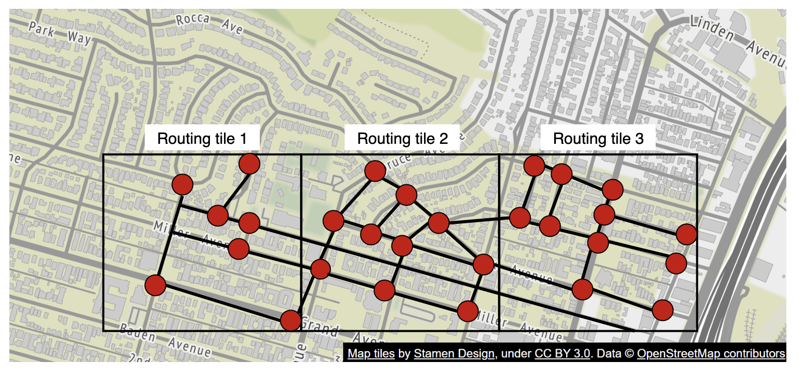
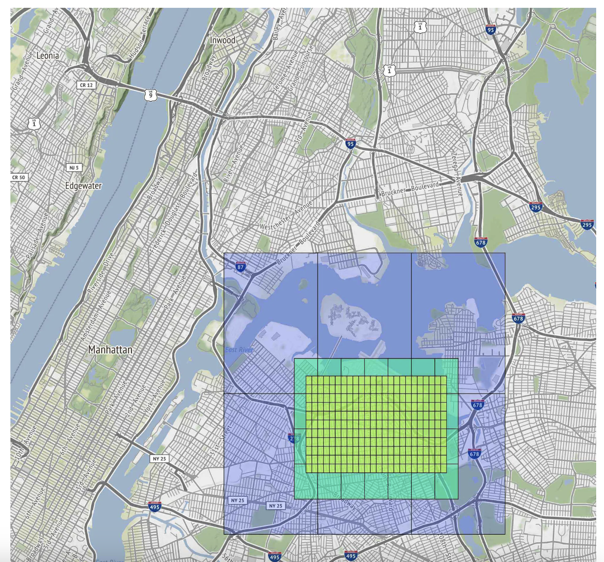
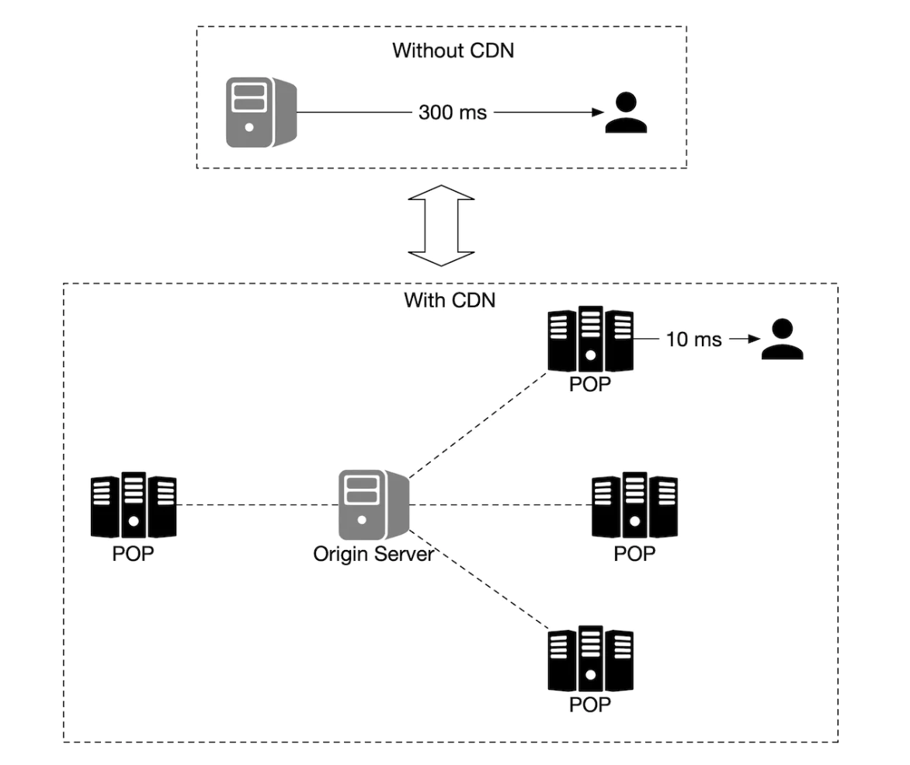
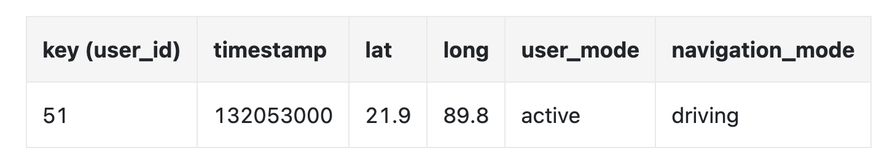
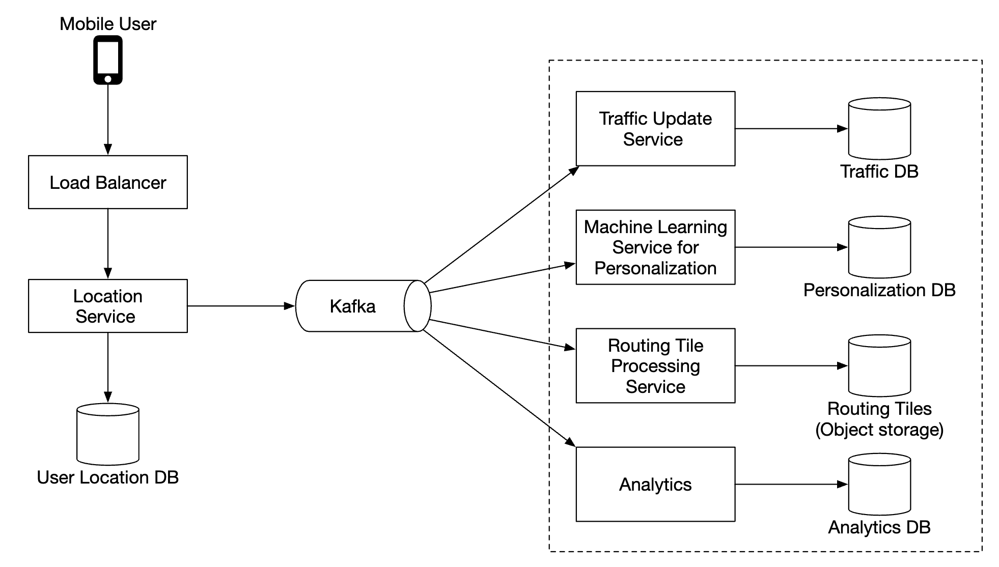

# 第 18 章：Google Maps

> 原章节：Google Maps · 原项目路径 `18. Google Maps/`

## 本章导读

地图可能是你每天都在用、却从来没想过「它怎么做到的」的那类软件。你输入「迪士尼乐园」，两秒钟后它给你一条路线、一个预计到达时间，并且一路上地图会跟着你滑动、自动缩放、实时变红变绿。

这背后藏着三类完全不同的问题，而且它们各自的难点并不相同：

- **几何问题**：地球是个球，怎么把它摊平到屏幕上，还不至于骗得太离谱？
- **图论问题**：全球路网有几千万个路口，怎么在两毫秒内找出两点之间的最快路径？
- **系统工程问题**：几 PB 的地图数据，怎么让一亿人同时按需下载，而且手机流量和电量都撑得住？

原笔记把这三类问题都点到了，但每一条都停在了「有这么回事」的层面。这一章我们要把它们讲透——尤其是**地图投影**，这是初学者最容易被误导的地方：为什么你在网页地图上看到的格陵兰岛，比整个非洲还大？

## 你将学到

- 经纬度、地图投影、地理编码、Geohash 这四块「地图 101」的基石
- **Web Mercator（EPSG:3857）和 WGS84（EPSG:4326）的本质区别**，以及为什么 Web Mercator 在高纬度会严重失真
- 瓦片地图的 **Z/X/Y 三级索引**，以及瓦片数量随缩放级别呈 4 倍增长的规律
- 为什么 **Geohash 和 Z/X/Y 是两套不同的空间索引**（原笔记在这里混用了）
- 路线规划算法的演进：**Dijkstra → A\* → Contraction Hierarchies**，以及为什么纯 Dijkstra 在国家级路网上经济上不成立
- 实时路况的数据来源、更新频率，以及「探针不足时该回退到历史模型」这个工程判断
- 地图数据为什么要**分层存储**，以及怎么做**增量更新**

---

## 1. 需求澄清与范围界定

先看原笔记给出的示范问答，每一问都在缩小范围：

| 问题 | 回答 | 影响 |
|---|---|---|
| 日活多少？ | **10 亿 DAU** | 决定量级 |
| 聚焦哪些功能？ | 位置更新、导航、ETA、地图渲染 | 决定本章范围 |
| 路网数据有多大？有吗？ | 从多个来源获取，原始数据 **TB 级** | 决定离线处理管线 |
| 要考虑路况吗？ | 要，为了准确的 ETA | 引入实时数据流 |
| 支持步行 / 骑行 / 驾车？ | 都要 | 同一张图，不同权重 |
| 多目的地路径规划？ | 不在范围内 | 显著简化问题 |
| 商户信息和照片？ | 不用考虑 | 砍掉了 POI 这一大块 |

**面试技巧**：最后两问是「主动收窄范围」的示范。多目的地规划本质上是**旅行商问题（TSP）**的变体，复杂度完全不在一个量级；POI 和照片则是另一个完整的系统（搜索 + 推荐 + 内容存储）。**主动砍掉它们，才能把时间花在核心难点上。**

最终聚焦三个功能：**用户位置更新、导航服务（含 ETA）、地图渲染**。

### 非功能需求

- **准确性（Accuracy）**：用户不能拿到错误的路线。注意原笔记说的是「不能给错路」，而不是「必须给最快路」——这是一个很重要的宽容度。
- **流畅的导航体验（Smooth Navigation）**：地图渲染必须跟手，不能卡顿。
- **流量与电量（Data and Battery Usage）**：客户端要尽可能少用流量和电。这对移动端是硬约束。
- **高可用与可扩展**：常规要求。

> **「准确性优先于最优性」这个取舍值得展开**
> 导航可以接受「不是最快的那条路」，但不能接受「这条路根本走不通」。这直接影响了架构：路网拓扑数据必须**强一致、高可靠**（不能出现断头路），而 ETA 和路况数据可以是**最终一致**的（差几分钟没关系）。**把不同的数据按不同的可靠性要求区别对待，是设计大型系统的基本功。**

### 关于 Google Maps 的几个背景数字

原笔记给了三个事实：2005 年上线、到 2021 年有 10 亿 DAU 和 99% 的世界覆盖、每天 2500 万次实时位置信息更新。

前两个没问题。**第三个数字需要留意**——它和本章后面自己算出来的量级差了 4 个数量级，详见【勘误与补充】。你读到任何「每天 X 次更新」这类数字时，都要先问一句：**这个 X 统计的到底是什么？**

---

## 2. 地图基础（一）：经纬度定位系统

地球是一个绕轴自转的球体。要定位球面上的一个点，需要两个角度：

- **纬度（Latitude）**：你在赤道以北 / 以南多远。范围 −90°（南极）到 +90°（北极），赤道是 0°。
- **经度（Longitude）**：你在本初子午线以东 / 以西多远。范围 −180° 到 +180°，本初子午线（格林尼治）是 0°。

<div align="center"></div>

这个系统叫 **WGS84（World Geodetic System 1984）**，对应的标准编号是 **EPSG:4326**。

> **两个容易踩的坑**
> 1. **顺序问题**。数学上我们习惯说 (x, y)，也就是先横后纵；但地理坐标的惯例是 **(纬度, 经度)**，先纵后横。更麻烦的是，很多 API（包括 GeoJSON 标准）用的是 **(经度, 纬度)**。这是 GIS 领域最经典的 bug 来源——把两个数字写反，你的点会跑到地球另一边。**写代码时永远显式命名变量 `lat` / `lng`，不要用 `x` / `y`。**
> 2. **WGS84 是「坐标系」，不是「投影」**。它定义的是「球面上的角度」，单位是度。这一点在第 3 节讲 Web Mercator 时会变得关键。

---

## 3. 地图基础（二）：地图投影与 Web Mercator

这是本章最重要、也最容易讲错的一节。

### 3.1 为什么必须投影

屏幕是平的，地球是圆的。把三维球面上的点映射到二维平面的过程，叫 **地图投影（Map Projection）**。

数学上可以证明：**不存在一种投影能同时保持所有几何属性**（这是高斯绝妙定理的直接推论）。任何投影都必须在下面几项里做取舍：

- **等角（Conformal）**：局部角度不变形 → 小范围形状正确，方向感准。
- **等积（Equal-Area）**：面积比例不变形 → 大小关系正确。
- **等距（Equidistant）**：特定方向上距离不变形。

**你最多只能同时拿到一到两项，不可能全都要。**

<div align="center"></div>

### 3.2 Google Maps 选了什么

Google Maps 选择的是一种 Mercator 投影的变体，叫 **Web Mercator（网络墨卡托）**。

> **术语勘误：原文只写了「a modified version of Mercator projection called Web Mercator」，没有解释「modified」在哪里。** 这个「modified」恰恰是关键，我们展开讲。

### 3.3 Web Mercator 到底是什么

先把两个最常被混淆的标准摆清楚：

| | **EPSG:4326（WGS84）** | **EPSG:3857（Web Mercator）** |
|---|---|---|
| 类型 | 地理坐标系（Geographic CRS） | 投影坐标系（Projected CRS） |
| 单位 | **度（Degree）** | **米（Meter）** |
| 形态 | 球面上的角度 | 平面上的直角坐标 |
| 范围 | 经度 ±180°，纬度 ±90° | x、y 各 ±20037508.34 米 |
| 用途 | 存储、传输、计算距离 | 瓦片切分、渲染 |

**Web Mercator 的「modified」体现在一个很微妙的取舍上：**

- 它**使用了 WGS84 椭球的长半轴**作为球体半径：`R = 6378137` 米。
- 但它在投影公式里用的是**球面公式**，而不是 WGS84 椭球公式。

为什么要这样「混搭」？因为椭球公式需要**迭代求解**（纬度换算要解一个超越方程），而球面公式有**闭式解**，计算快得多。代价是：EPSG:3857 的 y 坐标与真正的椭球 Mercator 会有系统性偏差，量级从低纬度的**数公里**一直到高纬度的**数十公里**。对「画地图」来说这个偏差可以接受，对「测量」来说完全不可接受——**用一点精度换极大的计算效率**。

这也是它被戏称为 **Pseudo-Mercator（伪墨卡托）** 的原因。它的历史别名 **EPSG:900913** 是 Google 工程师开的一个玩笑：900913 用 leetspeak 读出来就是「googol」，也就是 Google 名字的来源。

### 3.4 为什么高纬度会严重失真

Web Mercator 是**等角**投影，它保持角度、牺牲面积。这个取舍的数学后果是：

$$
\text{水平方向尺度因子} = \frac{1}{\cos\varphi} \qquad
\text{面积尺度因子} = \frac{1}{\cos^2\varphi}
$$

其中 φ 是纬度。算几组数：

| 纬度 | 水平拉伸倍数 | **面积放大倍数** |
|---|---|---|
| 0°（赤道） | 1.00 | 1.00 |
| 30° | 1.15 | 1.33 |
| 45° | 1.41 | 2.00 |
| 60° | 2.00 | 4.00 |
| 70° | 2.92 | 8.55 |
| 80° | 5.76 | 33.2 |
| 85° | 11.47 | 131.6 |

**在纬度 85° 的地方，一块区域在 Web Mercator 地图上看起来比它实际大 131 倍。**

### 3.5 格陵兰岛 vs 非洲：把数字算一遍

这是最著名的「地图骗局」：

| | 实际面积 | 大致纬度范围 |
|---|---|---|
| **格陵兰岛** | 约 **216.6 万 km²** | 59°N ~ 83°N |
| **非洲** | 约 **3037 万 km²** | 37°N ~ 35°S |

$$
\frac{\text{非洲}}{\text{格陵兰}} = \frac{3037}{216.6} \approx \textbf{14 倍}
$$

**非洲的实际面积是格陵兰的约 14 倍。** 但在 Web Mercator 的世界地图上，格陵兰看起来**比非洲还大**。

原因就在上表：格陵兰的中心纬度约 72°N，面积尺度因子是

$$
\frac{1}{\cos^2 72°} = \frac{1}{0.309^2} \approx \textbf{10.5 倍}
$$

格陵兰被放大了约 10 倍，而非洲大部分在低纬度（放大倍数接近 1）。**10 倍的放大，足以抹平 14 倍的真实差距。**

> **这个现象对工程师的实际影响**
> - **绝不要用 EPSG:3857 的平面坐标直接算距离。** 在纬度 60° 的地方，你以为算出 1000 米，实际地面距离只有 500 米。正确做法是：**在 EPSG:4326 的经纬度上用 haversine 公式算球面距离**，或者用 PROJ / GeographicLib 这类专业的测地线库。
> - **瓦片的分辨率也是「名义值」。** 说「z=18 的瓦片边长 153 米」，这个 153 米是**赤道上的值**；在北京（约 40°N），同样的瓦片覆盖的实际地面宽度只有 `153 × cos(40°) ≈ 117 米`。
> - **展示面积统计数据时不要用 Web Mercator。** 需要用等积投影（如 Equal Earth、Albers）——这是数据新闻里的常识。

### 3.6 为什么纬度只到 85.05°

Web Mercator 的 y 坐标公式是：

$$
y = R \cdot \ln\left(\tan\left(\frac{\pi}{4} + \frac{\varphi}{2}\right)\right)
$$

当 φ 趋近 90° 时，`tan(π/4 + φ/2)` 趋近无穷大，y 也趋近无穷大。**南极点和北极点在 Web Mercator 上根本无法表示。**

工程上的处理是**截断**：把纬度限制在 **±85.05112878°**。

这个数字不是随便取的。要让投影后的世界正好是一个**正方形**（宽 `2πR`、高 `2πR`），需要令 `y = πR`：

$$
\ln\left(\tan\left(\frac{\pi}{4} + \frac{\varphi}{2}\right)\right) = \pi
\;\Rightarrow\;
\tan\left(\frac{\pi}{4} + \frac{\varphi}{2}\right) = e^{\pi} \approx 23.1407
$$

$$
\frac{\pi}{4} + \frac{\varphi}{2} = \arctan(23.1407) \approx 1.52774
\;\Rightarrow\;
\varphi \approx 1.48468 \text{ rad} \approx \textbf{85.0511°}
$$

**为什么一定要是正方形？** 因为瓦片是正方形的（256×256），而瓦片切分要求整个地图范围能被子正方形整除。**正方形是 Z/X/Y 瓦片体系能成立的前提。** 这是「数学约束推导出工程规范」的一个漂亮例子。

---

## 4. 地图基础（三）：地理编码与反向地理编码

**地理编码（Geocoding）**：把地址（「北京市海淀区中关村大街 1 号」）转换成地理坐标。

**反向地理编码（Reverse Geocoding）**：反过来，把坐标转换成地址。

### 怎么实现

原笔记提到了一种做法：**插值（Interpolation）**——利用来自不同来源（比如各种 GIS 系统）的数据，把**街道网络映射到地理坐标空间**。

展开说，一个可用的地理编码管线大致是：

1. **地址标准化（Parsing & Normalization）**：把「中关村大街 1 号」拆成 `{道路: 中关村大街, 门牌: 1}`，并处理同义词、别名、简写。
2. **道路匹配**：在路网里找到「中关村大街」这条线段。
3. **门牌插值**：路网数据通常只有道路两端的门牌号（比如 1 号和 101 号），中间的门牌号靠**线性插值**估算位置。这就是原笔记说的 interpolation。**这意味着地理编码的结果本身就有误差**——插值出来的点可能和实际门牌差几十米。
4. **消歧**：同一个地址可能有多个候选（不同城市有同名街道），需要按上下文（用户位置、行政区划）排序。

**注意第 3 步的含义**：地理编码不是一个「查表」操作，而是一个**带误差的估算**。这就是为什么导航有时会把你导到隔壁楼。API 返回的 `location_type` 字段（如 `ROOFTOP`、`RANGE_INTERPOLATED`、`APPROXIMATE`）就是在告诉你这个点的可信程度。

---

## 5. 地图基础（四）：瓦片地图与 Z/X/Y 坐标体系

### 5.1 什么是瓦片（Tiling）

地图渲染不是把整个世界画成一张大图，而是**把世界切成小块（瓦片，Tile）**。客户端只下载它当前视野需要的瓦片，然后像拼马赛克一样拼起来。

<div align="center"></div>

**为什么必须切块？** 因为一张覆盖全球的高精度图片，尺寸是天文数字（后面会算）。切块之后：

- 客户端只下载需要的部分（按需加载）。
- 每块可以独立缓存、独立更新、独立失效。
- 瓦片是**静态资源**，可以直接扔到 CDN 上。

### 5.2 Z/X/Y：瓦片的三级索引

**这是原笔记讲得不够、而初学者必须掌握的核心知识。**

Web Mercator 投影后的世界是一个正方形（x 和 y 各从 −20037508.34 到 +20037508.34 米）。把这个世界**归一化到 [0, 1] × [0, 1]**，然后：

- **Z（Zoom Level，缩放级别）**：把正方形切成 `2^Z × 2^Z` 个格子。
- **X**：格子的列号，从左到右 `0 ~ 2^Z − 1`。
- **Y**：格子的行号，**从上到下** `0 ~ 2^Z − 1`。

**注意 Y 轴是向下的。** 这是屏幕坐标系（左上角是原点），不是数学坐标系。这个设计选择来自图像处理传统，初学时经常搞混。

转换公式（`lat` 用弧度）：

$$
n = 2^Z
$$

$$
X = \left\lfloor n \cdot \frac{\text{lon} + 180}{360} \right\rfloor
$$

$$
Y = \left\lfloor n \cdot \frac{1 - \dfrac{\ln\left(\tan(\text{lat}) + \sec(\text{lat})\right)}{\pi}}{2} \right\rfloor
$$

**为什么需要多级缩放？** 因为一张瓦片只有 256×256 像素。如果只用一级，要么分辨率不够（看不清楚街道），要么数据量爆炸（每块瓦片覆盖太大区域）。**多级缩放让每一级都有合适的信息密度**：放大看街道细节，缩小看城市轮廓。

### 5.3 瓦片数量随缩放级别的增长

每增加一级缩放，每个格子一分为四，所以：

$$
\text{Z 级的瓦片总数} = (2^Z)^2 = 4^Z
$$

**每加一级，瓦片数 ×4。**

<div align="center"></div>

| Z | 瓦片总数（4^Z） | 每块瓦片在赤道上的边长 |
|---|---|---|
| 0 | **1** | 40075 km（整个地球） |
| 1 | 4 | 20038 km |
| 5 | 1,024 | 1252 km |
| 10 | 1,048,576（约 105 万） | 39.1 km |
| 15 | 1,073,741,824（约 10.7 亿） | 1.22 km |
| 18 | 68,719,476,736（约 687 亿） | 153 m |
| 21 | 4,398,046,511,104（约 **4.4 万亿**） | 19.1 m |
| 22 | 17,592,186,044,416（约 17.6 万亿） | 9.6 m |

（边长算法：地球赤道周长约 40,075 km，除以 `2^Z`。验算：`40075 / 2^21 = 0.01911 km = 19.1 m`。）

> **Z=0 只有一块瓦片**
> 这就是原笔记说的「把整个世界缩到最小，只会下载一张 256×256 的瓦片」。这一张瓦片上，**一个像素代表赤道上约 156 公里**（`40075 / 256 ≈ 156.5`）。
> 而在 Z=21，一个像素代表 `19.1 / 256 ≈ 0.075` 米，也就是 **7.5 厘米**。

### 5.4 把所有层级加起来：一个不能预生成的数字

如果要把 Z=0 到 Z=21 的所有瓦片**全部预先生成**，总数是：

$$
\sum_{Z=0}^{21} 4^Z = \frac{4^{22} - 1}{3} = \frac{2^{44} - 1}{3} \approx \textbf{5.86 万亿块}
$$

**5.86 万亿块** 256×256 的图片。就算每张压缩后只有 5 KB，总量也是：

$$
5.86 \times 10^{12} \times 5 \text{ KB} \approx 2.9 \times 10^{16} \text{ 字节} \approx \textbf{29,000 PB} = 29 \text{ EB}
$$

**这比原笔记说的「约 70 PB」大了三个数量级。** 差在哪里？差在**去重和压缩**：

- 大片沙漠、海洋、极地的瓦片**内容完全相同**，可以只存一份，用引用代替。
- **矢量瓦片（Vector Tile）** 体积远小于栅格瓦片（同样的道路网络，矢量表示可能只有几百字节到几 KB）。
- 高缩放级别只在有人访问的区域生成（按需生成 + 缓存），而不是全球预生成。

**所以 70 PB 不是「理论上需要多少」，而是「实际存储了多少」。** 这两个数字的差距，正好量化了工程优化的价值。详见【勘误与补充】。

### 5.5 矢量瓦片 vs 栅格瓦片

原笔记把矢量瓦片称为「一个优化」，实际上它是一次**架构级的选择**：

| | **栅格瓦片（Raster Tile）** | **矢量瓦片（Vector Tile）** |
|---|---|---|
| 内容 | 预渲染好的 PNG / JPEG 图片 | 几何数据（点、线、多边形）+ 属性 |
| 体积 | 大 | 小得多（通常小一个数量级） |
| 样式 | **烧死在图片里** | **客户端渲染，样式可切换** |
| 缩放 | 放大后模糊，需要换更高层级的瓦片 | 矢量可无损放大 |
| 旋转 / 倾斜 | 需要服务端重新渲染 | 客户端变换即可 |
| 客户端开销 | 低（贴图） | 高（需要渲染引擎） |

**矢量瓦片最被低估的价值不是省带宽，而是「数据与样式解耦」**：同一份矢量数据可以渲染成日间模式、夜间模式、卫星叠加、骑行视图——不需要服务端重新生成任何瓦片。这也是 Mapbox、MapLibre 这类方案的基础。

---

## 6. 地图基础（五）：Geohash 空间索引

**Geohash** 是一种把地理区域编码成**字符串**的系统，字符串由字母和数字组成。

原笔记的描述是准确的：「它把世界当作一个平面，递归地划分成四个象限」。

<div align="center"></div>

### 编码原理

1. 把经度范围和纬度范围各自二分。
2. **交错（Interleave）** 地取位：先按经度落在左半还是右半记一位，再按纬度记一位，如此反复。
3. 每凑满 5 位二进制，映射成一个 **base32** 字符（字符集是 `0123456789bcdefghjkmnpqrstuvwxyz`——注意去掉了 `a`、`i`、`l`、`o`，避免和数字 `0`、`1` 混淆）。

### 两个关键性质

- **前缀越长，格子越小。** 这就是它能做「精度可调的空间索引」的原因。
- **共享前缀的两个点，必然落在同一个格子里。** 这是它能做范围查询的基础。

### 一个必须知道的缺陷

**共享前缀 ⇒ 空间相近（成立）。但反过来不成立**：空间相近 ⇏ 共享前缀。

两个人在现实中只隔一条街，但如果那条街正好是 geohash 的格线，他们的 geohash 字符串会**完全不同**。这就是原笔记在「附近随机陌生人」里提到的边界问题（订阅相邻格子）。

### Geohash 精度对照表

| 长度 | 格子尺寸（宽 × 高） | 典型用途 |
|---|---|---|
| 1 | 5009 km × 4993 km | 洲际 |
| 2 | 1252 km × 624 km | 大区 |
| 3 | 156 km × 156 km | 省级 |
| 4 | 39.1 km × 19.5 km | 城市级 |
| 5 | 4.9 km × 4.9 km | 城区级 |
| 6 | 1.22 km × 0.61 km | 街区级 |
| 7 | 153 m × 153 m | 楼宇级 |
| 8 | 38.2 m × 19.1 m | 精确定位 |
| 9 | 4.77 m × 4.77 m | 米级 |

### 5.6 关键区分：Geohash ≠ 瓦片索引

**这是原笔记的一处实质性混淆，必须讲清楚。**

原笔记在「Map rendering」一节写道：

> 「Map tiles are served statically, **based on their geohash**, which a client can calculate.」

**实际上，地图瓦片用的是 Z/X/Y 索引，不是 geohash。**

两者确实都是**四叉树式的空间索引**，但它们建立在**不同的坐标系**上：

| | **Geohash** | **Z/X/Y 瓦片** |
|---|---|---|
| 坐标系 | WGS84 经纬度（球面） | Web Mercator 平面（投影后） |
| 编码形式 | base32 字符串（如 `wx4g0b`） | 三个整数（如 `z=15, x=16898, y=6203`） |
| 格子形状 | 经纬度矩形，**宽度随纬度收缩** | 投影平面上的**正方形** |
| 主要用途 | 邻近查询、附近的人 | 地图瓦片寻址、渲染 |

**为什么这个区分很重要？**

1. **格子形状不同导致「相邻」的定义不同。** geohash 的格子在高纬度会变得又扁又窄，而瓦片格子永远是正方形。
2. **瓦片需要正方形格子**，因为渲染器要把它们无缝拼成一张图，且要能和 Web Mercator 的坐标直接对应。geohash 的格子做不到这一点。
3. **两者不能互相替代。** 想查「附近的用户」，用 geohash；想取「屏幕上这一块地图」，用 Z/X/Y。

**判断标准很简单：看客户端要的是什么。** 要「一张图」就用 Z/X/Y；要「一组点」就用 geohash。

---

## 7. 地图基础（六）：路网数据的图表示与分层路由瓦片

### 7.1 把路网变成图

大多数路由算法里：

- **交叉口（Intersection）→ 节点（Node）**
- **道路（Road）→ 边（Edge）**

<div align="center"></div>

**但这里有几个初学者容易忽略的细节：**

1. **边的权重是「通行时间」，不是「距离」。** 最短距离 ≠ 最快到达。一条 5 公里的高速可能比 2 公里的拥堵市区道路快得多。
2. **通行时间取决于多个因素**：道路等级、限速、实时路况、**转弯代价**（左转通常比直行和右转贵，因为要等对向车流；这是导航里一个真实且重要的建模细节）。
3. **道路是有方向的。** 单行道、潮汐车道意味着这是一张**有向图（Directed Graph）**。
4. **上下分离的立交桥是两组节点。** 一条高架和它下面的地面道路在平面上交叉，但在图里**不连通**。这是路网建模里最容易出错的地方。

### 7.2 规模问题：不能把整个世界当成一张图

原笔记正确地指出了这一点：「路径搜索的性能对图的规模非常敏感。要在生产规模上工作，我们不能把整个世界表示成一张图然后跑算法。」

**给个具体的量级**：DIMACS（2005 年最短路挑战赛）公开的美国本土路网基准数据集，包含约 **2394 万个节点**和 **5833 万条有向边（弧）**。这还只是**美国本土**，而且不含实时路况带来的额外维度。全球路网是这个的好几倍。

### 7.3 解法：路由瓦片（Routing Tile）

原笔记的方案和地图渲染如出一辙——**分块**：把世界切成越来越小的子图。

每个**路由瓦片**持有**指向相邻瓦片的引用**，算法在遍历时把互相连通的瓦片**缝合（Stitch）**成一张更大的图。

<div align="center"></div>

**好处**：只需要加载「起点到终点这条走廊」上的瓦片，大幅减少内存带宽。你从北京开车去上海，不需要把广州的路网读进内存。

### 7.4 分层（Hierarchical）：不同细节等级的瓦片

原笔记接着指出：对长途路线来说，缝合一堆小的高精度瓦片仍然很费时间和内存。

**解法是给路由瓦片分等级**：不同细节等级的瓦片并存，算法根据目的地的远近选择合适精度的瓦片。

<div align="center"></div>

**直觉理解**：开车从北京到上海时，你不需要知道沿途每个村口的细节——你只需要知道「上哪条高速、在哪下」。**只有起点和终点附近的几十公里，才需要高精度瓦片。**

这就是**分层路由（Hierarchical Routing）**的思想，也是第 8 节要讲的 Contraction Hierarchies 的直觉来源。

---

## 8. 路线规划算法：从 Dijkstra 到 Contraction Hierarchies

原笔记只说了一句「大多数导航算法使用 Dijkstra 或 A\* 的变体」，然后跳到分层瓦片。**这句话对初学者是不够的**——因为它没有回答「为什么需要变体」，也没有给出真正的答案。这一节补齐。

### 8.1 Dijkstra：正确，但经济上不成立

**Dijkstra 算法**是单源最短路径的经典解法：从起点开始，每次取出「当前已知代价最小」的节点，松弛它的所有邻居。时间复杂度约 `O(E + V log V)`。

它在数学上是正确的。问题在规模。用美国本土路网（2394 万节点、5833 万边）算一次：

- 在 2005 年的 DIMACS 基准机器上，一次查询大约需要 **10 秒**。
- 在现代服务器上（单核），大约是 **1~3 秒**。

现在算一下经济账。本章后面的量级估算会得出导航请求的平均 QPS 约 **20 万**。假设每次 Dijkstra 用 2 秒：

$$
20 \times 10^4 \times 2 = 4 \times 10^5 \text{ 个 CPU 核心}
$$

**需要 40 万个 CPU 核心。** 按云上每核每小时约 0.03 美元估算，光是算路这一项就是**每小时约 1.2 万美元**，一天近 30 万美元。

> **这就是「不可用」的真正含义**
> 纯 Dijkstra 在国家级路网上不可用，不是因为「有点慢」，而是因为**慢到经济上无法承受**。而且这还没算上：路况每秒都在变，权重一变，之前算的结果就作废了。
> **面试时能把这个账算出来，比说一句「Dijkstra 太慢」有说服力得多。**

### 8.2 A\*：加一个「方向感」

**A\* 算法**在 Dijkstra 上加了**启发函数（Heuristic）** `h(n)`：估计「从节点 n 到终点还要多少代价」。每次选择下一个节点时，用 `f(n) = g(n) + h(n)` 排序，其中 `g(n)` 是从起点到 n 的实际代价。

在路网上，`h(n)` 的常见取法是：

$$
h(n) = \frac{\text{n 到终点的直线距离}}{\text{最大允许速度}}
$$

**关键约束**：`h(n)` 必须是**可采纳的（Admissible）**——不能高估真实代价。否则算法可能返回次优解。上面这个启发函数满足条件，因为任何真实路径都不可能比「直线距离除以最大速度」更快。

**效果与局限**：

- 效果：探索的节点数减少。因为有了方向感，算法不会往反方向乱搜。
- **局限：在路网上收益有限**（通常只减少 2~4 倍的搜索空间）。原因是**路网是高度曲折的**——北京到上海的直线距离只有 1000 多公里，但实际道路要绕，导致直线距离严重低估真实代价，启发函数「太弱」，算法仍然要探索一大片扇形区域。
- A\* **不改变最坏情况的复杂度**，也不改变「必须探索一大片区域」的本质。

**所以 A\* 只是一个常数级的优化，不是数量级的突破。**

### 8.3 Contraction Hierarchies：真正的数量级突破

**Contraction Hierarchies（收缩层级，CH）** 由 Geisberger 等人在 2008 年提出。它的思路完全不同——**不优化查询，而是优化「查询之前」**。

**核心思想：预处理阶段，按「重要性」从低到高依次「收缩」节点。**

收缩一个节点 v 的做法：

1. 看 v 的每一对邻居 (u, w)，检查「原本从 u 到 w 的最短路径是否必须经过 v」。
2. 如果是，就**添加一条快捷边（Shortcut Edge）** u → w，权重等于 `dist(u,v) + dist(v,w)`。
3. 然后从图中**删掉 v**。

这样删掉 v 之后，原本「必须经过 v」的路径信息被快捷边保留了下来。**最短路径的代价不会被改变。**

**「重要性」怎么定？** 综合多个维度：

- **边差异（Edge Difference）**：新增的快捷边数减去删掉的边数。差异越小，说明这个节点越「不重要」。
- **节点度数**：度数低的先收缩。
- **空间分布**：避免连续收缩同一区域的节点，否则会形成一条「长链」，产生大量快捷边。
- **层级**：结合其他层级信息。

**查询阶段**：在增强后的图上做**双向 Dijkstra**，但有一个限制——**只允许往「更高层级」的方向走**（从起点向上爬，从终点也向上爬），两个搜索在高层相遇即得到最短路径。

**效果**：

- 查询时间从**秒级降到亚毫秒级**。
- 加速比约 **500~1000 倍**。

**代价（必须讲清楚）**：

- **图会变大**：快捷边通常让边数增加约一倍。
- **预处理成本高**：需要几分钟到几小时。但因为**可以离线做**，而且路网拓扑变化不频繁，这个成本可以接受。
- **致命问题：路况变化需要重新预处理。** CH 的预处理结果依赖边的权重。而实时路况**每秒都在变**——如果每次路况更新都要重跑预处理，方案就不成立了。

### 8.4 现代方案：Customizable Route Planning（CRP）

为了解决「拓扑稳定但权重频繁变化」这个矛盾，业界发展出了 **CRP（可定制路线规划，Customizable Route Planning）**。

它的关键洞察是把预处理**拆成两阶段**：

| 阶段 | 做什么 | 耗时 | 何时重跑 |
|---|---|---|---|
| **拓扑预处理（Metric-Independent）** | 基于图结构划分区域、建立层级 | 慢（分钟到小时） | **路网拓扑变了才需要**（很少） |
| **权重定制（Customization）** | 把当前权重（含实时路况）灌进预处理结构 | **快（秒级到分钟级）** | **路况更新时** |

**这个拆分是决定性的**：路况每分钟变一次，但只需要重跑「秒级」的那一步。微软的 Bing Maps 就使用了 CRP 的变体。

### 8.5 技术全景与工业实现

| 技术 | 核心思想 | 特点 |
|---|---|---|
| **Dijkstra** | 无信息的最短路径 | 正确但太慢 |
| **A\*** | 加方向启发函数 | 常数级优化（2~4 倍） |
| **ALT** | A\* + 地标（Landmark）+ 三角不等式，做出更强的启发函数 | 比朴素 A\* 好，但仍不如 CH |
| **Highway Hierarchies** | 模拟「先上高速再下高速」的分层结构 | 分层路由的早期代表 |
| **Contraction Hierarchies** | 收缩节点 + 快捷边，查询时只向上走 | **加速 500~1000 倍**，但权重变化要重预处理 |
| **CRP** | 把预处理拆成「拓扑」+「权重定制」 | **兼顾 CH 的速度和实时路况**，现代首选 |

**工业实现（想上手读代码就从这几个开始）**：

- **OSRM（Open Source Routing Machine）**：默认使用 CH，也支持 **MLD（Multi-Level Dijkstra）**。
- **GraphHopper**：使用 CH 和 ALT。
- **Valhalla**：使用**分块 + 分层**的架构，**和本章描述的设计几乎一一对应**。它是最值得读的开源项目——因为「这一章讲的设计，Valhalla 把它做成了开源软件」。

> **一个学习建议**
> 如果你想真正理解这一节，最好的方式是：下载 OSRM 或 Valhalla，导入一个省的开源路网数据（OpenStreetMap 提供），自己跑一遍路径规划，观察响应时间。**把「Dijkstra 要 2 秒、CH 只要 1 毫秒」这个 2000 倍的差距亲手测出来**，比读十篇文章都有用。

---

## 9. 量级估算

### 存储

需要存三类数据：

1. **世界地图**：原笔记估算约 **70 PB**（已经考虑了相似瓦片的压缩，比如大片沙漠）。这个数字的推导见第 5.4 节。
2. **元数据**：可以忽略不计。
3. **路网信息**：以路由瓦片形式存储。

### 导航请求 QPS

原笔记的推算过程：

- 10 亿 DAU，每人每周使用 35 分钟
- 每周总时长：`10^9 × 35 = 3.5 × 10^{10}` 分钟
- 每天总时长：`3.5 × 10^{10} / 7 = 5 × 10^9` 分钟 = **50 亿分钟/天**

假设 GPS 位置更新在客户端做了批量上报，得到：

- **平均 20 万 QPS**
- **峰值 100 万 QPS**

**验算一下平均 QPS**：如果客户端每 15 秒批量上报一次，那么

$$
\frac{5 \times 10^9 \text{ 分钟/天} \times 4 \text{ 次/分钟}}{86400 \text{ 秒/天}} = \frac{2 \times 10^{10}}{86400} \approx 231{,}481 \approx \textbf{23 万 QPS}
$$

和原笔记的 20 万吻合（原笔记的批量间隔应该是 15~20 秒）。**峰值 100 万是平均值的 5 倍**，对于「早晚高峰 + 节假日」的出行场景，这个峰均比是合理的。

> **这里的「批量上报」很关键**
> 如果没有批量，而是每 1 秒上报一次，QPS 会变成 **约 5800 万**（`5×10^9 × 60 / 86400`），是批量后的 **250 倍**。这就是为什么原笔记在位置服务一节专门强调「在客户端批量发送」——**一个客户端侧的小优化，直接把服务端压力降低两个数量级。**

---

## 10. 高层设计

<div align="center"></div>

三个核心服务，我们逐个展开。

### 10.1 位置服务（Location Service）

<div align="center"></div>

职责是记录用户的位置更新：

- 位置更新每 `t` 秒发送一次。
- **位置数据流可以用来持续改进服务**：提供更准确的 ETA、监测路况、检测封路、分析用户行为等。

**这里有一个很重要的架构含义**：位置数据不只是「给用户看自己」的，它同时是**路况模型的输入**。这就是为什么后面要用 Kafka 把位置流送到多个下游服务（第 12 节会展开）。

**批量上报**：不在客户端每次拿到 GPS 就发，而是攒一批再发。

<div align="center"></div>

即使做了这个优化，对 Google Maps 这个量级的系统，负载依然很大。所以要用**为写密集优化的数据库**，比如 **Cassandra**。

同时用 **Kafka** 做高效的流式处理，把位置更新送给需要做进一步分析的服务。

请求格式示例：

```http
POST /v1/locations
Parameters
  locs: JSON encoded array of (latitude, longitude, timestamp) tuples.
```

**注意这个接口设计**：`locs` 是一个**数组**，一次请求带多个 `(纬度, 经度, 时间戳)` 三元组。这就是批量上报在 API 层面的体现。**接口设计要服务于性能目标**——如果接口只接受单个位置，客户端就没法批量。

### 10.2 导航服务（Navigation Service）

职责：在合理的时间内找到 A 到 B 的快速路线（可以有一点延迟，不要求绝对最快，但准确性很重要）。

请求示例：

```http
GET /v1/nav?origin=1355+market+street,SF&destination=Disneyland
```

响应示例：

```json
{
  "distance": {"text":"0.2 mi", "value": 259},
  "duration": {"text": "1 min", "value": 83},
  "end_location": {"lat": 37.4038943, "Ing": -121.9410454},
  "html_instructions": "Head <b>northeast</b> on <b>Brandon St</b> toward <b>Lumin Way</b><div style=\"font-size:0.9em\">Restricted usage road</div>",
  "polyline": {"points": "_fhcFjbhgVuAwDsCal"},
  "start_location": {"lat": 37.4027165, "lng": -121.9435809},
  "geocoded_waypoints": [
    {
       "geocoder_status" : "OK",
       "partial_match" : true,
       "place_id" : "ChIJwZNMti1fawwRO2aVVVX2yKg",
       "types" : [ "locality", "political" ]
    },
    {
       "geocoder_status" : "OK",
       "partial_match" : true,
       "place_id" : "ChIJ3aPgQGtXawwRLYeiBMUi7bM",
       "types" : [ "locality", "political" ]
    }
  ],
  "travel_mode": "DRIVING"
}
```

**这个响应里有几个值得注意的字段：**

- **`distance` 和 `duration` 都带了 `text` 和 `value` 两份**：`text` 是给人看的（"0.2 mi"），`value` 是给程序用的（259 米）。**机器可读和人类可读分离**，是一个好的 API 设计习惯。
- **`polyline`**：路线的几何形状被**编码成字符串**了（这是 Google 的 Encoded Polyline 格式，用 base64 变体压缩坐标序列）。**为什么不用坐标数组？** 因为一条长途路线的坐标点可能有几千个，JSON 数组会非常冗长。编码后体积能缩小数倍——这直接对应「少用流量」这个非功能需求。
- **`html_instructions`**：注意里面**内嵌了 HTML 标签**（`<b>`、`<div>`）。这是为了导航指令的富文本展示（加粗路名、灰色小字标注限制）。**但这也意味着客户端必须安全地处理这段 HTML**，否则会有注入风险——虽然这里是服务端生成的，可信度高，但这类「服务端返回 HTML 片段」的设计在现代 API 里已经不太流行了。
- **`geocoded_waypoints`**：返回了地理编码的元信息，包括 `partial_match`（是否只匹配到部分地址）。**这就是第 4 节说的「地理编码是带误差的估算」在 API 层面的体现**——如果 `partial_match` 是 `true`，客户端应该提示用户确认。
- **`travel_mode`**：对应需求里说的步行 / 骑行 / 驾车。

**原笔记说明**：这个阶段还没有考虑路况变化和重新规划，这两项放在深挖部分。

### 10.3 地图渲染（Map Rendering）

**核心约束**：把整个地图瓦片数据集放在客户端是**不可行的**——它有 PB 级大小。

所以瓦片必须**按需从服务端获取**，依据是客户端的位置和缩放级别。

**什么时候需要获取新瓦片？**

- 用户放大 / 缩小时（需要不同 Z 的瓦片）
- 导航过程中，用户移动到一个新瓦片时

**瓦片怎么下发？两个选项：**

| 方案 | 问题 |
|---|---|
| **动态构建** | 给服务端带来巨大负载，而且**难以缓存**（每次请求都要现算） |
| **静态服务** ✅ | 瓦片按空间索引预先算好，作为静态资源存储，由 **CDN** 下发 |

<div align="center"></div>

**CDN 的价值**：让用户从**最近的 POP（Point of Presence，接入点）服务器**获取瓦片，最小化延迟。

<div align="center"></div>

**瓦片 URL 怎么算？两个选项：**

1. **客户端本地计算**：优点是省一次 API 调用。**但原笔记给了一个很重要的提醒**：「如果这样做，我们必须谨慎地承诺长期使用这种瓦片计算方式，因为**强迫客户端升级是非常困难的**。」——一旦你发布了客户端计算逻辑，它就会在旧版本 App 里存活好几年，任何格式变更都会造成巨大的兼容性负担。
2. **服务端 API 计算**：多一次 API 调用，但**格式变更完全由服务端控制**。

<div align="center"></div>

> **这是一个「客户端逻辑的长期成本」问题，值得展开**
> 原笔记的提醒切中了一个真实的工程痛点：**任何下沉到客户端的东西，都变成了一个你无法收回的长期承诺。**
> 权衡方法是看**变更频率**：
> - 如果瓦片 URL 的格式**十年都不会变**（比如 Z/X/Y 这种早已标准化的形式），那客户端计算是划算的。
> - 如果你预计格式会演进（比如要加签名、要支持多种图层、要做 A/B 测试），那**把它放在服务端**，用一个稳定的接口把它包起来。
> 更通用的原则是：**把「稳定的接口」放在客户端，把「易变的实现」放在服务端。**

---

## 11. 深挖：数据模型（四类数据，四种存储）

原笔记在这里做得不错——它按数据的**访问模式**分别选型，而不是「统一用一个数据库」。我们逐类看。

### 11.1 路由瓦片（Routing Tiles）

- 初始路网数据从不同来源获取，之后根据位置更新数据**持续改进**。
- **路网数据是非结构化的。** 有一个**周期性的离线处理管线**，把原始数据转换成 App 需要的、基于图的路由瓦片。
- **不存数据库**——因为不需要任何数据库特性（不做事务、不做 JOIN、不按二级索引查询）。存在 **S3 对象存储**里，同时**激进地缓存（Cache Aggressively）**。
- 可以用库把**邻接表（Adjacency List）压缩成二进制文件**，效率很高。

> **「不用数据库」这个判断是对的，理由值得说明**
> 路由瓦片的访问模式是：**只读、按固定 ID 读取、极少更新、要求极低延迟**。这正好是**对象存储 + CDN + 本地缓存**的最佳场景。
> 反过来，如果用数据库存，你会为「事务、并发控制、二级索引、查询优化器」这些**你完全用不到**的能力付出成本。**选型的第一原则是「我需要什么」，而不是「什么功能多」。**

### 11.2 用户位置数据（User Location Data）

位置数据对**更新路况**和各类分析非常有价值。

用 **Cassandra** 存储，因为它的数据性质是**写密集（Write-Heavy）**。

示例行：

<div align="center"></div>

### 11.3 地理编码数据库（Geocoding Database）

原笔记的描述是：「这个数据库存储**经纬度对和地点之间的键值对**。我们可以用 **Redis**，因为它读取快，而且我们的场景是频繁读、不频繁写。」

**这个描述过于简化了**，见【勘误与补充】。简要说明：

- **反向地理编码（坐标 → 地址）** 确实很适合用 Redis / KV 存储，因为这是一个纯查表操作。
- **正向地理编码（地址 → 坐标）** 需要**全文检索 + 模糊匹配 + 地址解析 + 消歧**。全球地址数据有**几亿到几十亿条**，用户输入的地址千奇百怪（错别字、简写、别名、多语言），用 KV 存储根本无法胜任。正确做法是用**倒排索引**（Elasticsearch / Lucene）或专用的地理编码引擎（Nominatim、Pelias）。

### 11.4 预计算的世界地图图片

地图瓦片图片预先计算好，存在 CDN 里。

<div align="center"></div>

---

## 12. 深挖：位置服务与实时路况

### 12.1 位置服务的数据库设计

<div align="center"></div>

**选型理由**：

- 用 **NoSQL** 来承载位置更新的重写入负载。
- **优先保证可用性而不是一致性（AP 而非 CP）**——因为用户位置数据经常变化，新数据一到，旧数据就过期了，强一致没有意义。
- 选择 **Cassandra**，因为它很好地契合了所有需求。

**示例行结构**：

<div align="center"></div>

- **`user_id` 是分区键（Partition Key）**：为了快速访问某个用户的所有位置更新。
- **`timestamp` 是聚簇键（Clustering Key）**：让数据按位置更新到达的时间排序存储。

> **这个主键设计是 Cassandra 建模的精髓，值得讲清楚**
> Cassandra 里，**分区键决定数据落在哪个节点**，**聚簇键决定分区内的排序**。
> 这里选 `(user_id, timestamp)` 的含义是：
> - 按 `user_id` 分区 → 「查某个用户的轨迹」这个最常用的查询，**只打一个节点**，速度极快。
> - 按 `timestamp` 聚簇 → 数据在磁盘上**按时间顺序物理排列**，所以「查某个用户最近 1 小时的位置」是一个**顺序扫描**，而不是随机跳读。
> **反过来说，「查某个时间段内所有用户的位置」这个查询会很慢**，因为它要扫描所有分区。**在 Cassandra 里，你的主键设计就是你唯一能高效支持的查询模式。** 这也是为什么位置历史数据通常要另存一份到分析型存储里。

### 12.2 位置数据流：Kafka 的角色

用 Kafka 把位置更新流式送给其他需要这些数据的服务：

<div align="center"></div>

**下游至少有三类消费者**：

1. **路况建模**：把海量探针位置聚合成每条路段的速度估计（第 12.3 节）。
2. **ETA 模型**：为机器学习模型提供训练和推理输入。
3. **离线分析**：检测封路、分析出行模式、改进路网数据。

> **注意这里和「附近的朋友」那一章的关键差异**
> 第 17 章的位置数据用 **Redis Pub/Sub** 做实时广播（允许丢），用 **Kafka** 做历史分析（不能丢）。
> 第 18 章的位置数据用 **Kafka** 直接承载，因为它的主要价值就是**被多个下游消费做分析**——这正是 Kafka 的强项（多消费者组、可重放、持久化）。
> **同样是「位置数据」，业务价值不同，选型就完全不同。** 这是「需求驱动选型」最好的例证。

### 12.3 实时路况：数据来源与更新频率

原笔记只说了「路况会影响 ETA」，但没有讲路况数据是怎么来的。这是本章的重要缺口，补上。

**数据来源（按重要性排序）**：

| 来源 | 说明 | 特点 |
|---|---|---|
| **GPS 探针数据（Probe Data）** | 最大来源。海量匿名化的手机 / 车机位置轨迹，聚合后反推每段路的实际通行速度 | 覆盖广，但需要足够样本量才有统计意义 |
| **车队 / 合作方数据** | 物流车队、网约车、货运公司提供的轨迹 | 轨迹**连续性好、质量高**（专业司机、固定路线） |
| **路侧传感器** | 感应线圈（Inductive Loop）、雷达 / 微波检测器、摄像头 | 精度高，但**只覆盖装了设备的少数路段** |
| **第三方聚合商** | INRIX、HERE、TomTom 等 | 整合多方数据后对外提供 |
| **事件上报** | 事故、施工、封路——来自交管部门、新闻、以及**用户主动上报**（Waze 模式） | **近实时**，是唯一能捕捉「刚发生的事故」的来源 |

**注意第一行的含义**：**本章的「位置服务」本身就是路况数据的上游。** 用户上报的位置，聚合之后变成了路况。这是一个漂亮的**数据飞轮**——用户越多，路况越准；路况越准，用户越多。原笔记在位置服务一节说「位置数据流可以用来改进服务」，指的就是这个。

**更新频率**：

| 道路类型 | 典型更新频率 | 原因 |
|---|---|---|
| 高速 / 城市快速路 | **分钟级**（业界典型 1~5 分钟） | 探针样本充足，路况变化快 |
| 次干道 / 支路 | 更稀疏，或**只用历史统计** | 探针样本太少，实时值噪声大 |
| 用户上报的事件 | **近实时**（秒级） | 需要立即警示后续车辆 |

> **一个重要的工程判断：探针不足时，不要强行给实时值**
> 假设某条小路 10 分钟内只有 2 辆车经过。用这 2 辆车的平均速度去推断整条路的通行时间，**噪声极大**——可能刚好一辆在找车位、一辆在等红灯。
> **正确做法是回退到历史模型**：按「星期几 + 时段」查这条路的**历史平均速度**。虽然不反映此刻的偶发拥堵，但比用 2 个样本硬推靠谱得多。
> 这就是为什么所有导航 App 的 ETA 都会说「根据历史数据」——**它们是在探针密度不足时诚实地降级，而不是假装自己知道。**

**路况的表达方式**：

**路况不是「红黄绿」三档，而是每条路段（Edge）的一个速度估计值。**「红黄绿」只是客户端根据下面这个比值做的**可视化分档**：

$$
\text{拥堵度} = \frac{\text{当前估计速度}}{\text{自由流速度（Free-Flow Speed）}}
$$

这个区分很重要：**底层数据结构是「每条边的权重」，红黄绿只是渲染层的一个映射函数。** 面试时如果说「路况就是红黄绿」，会显得非常表面。

---

## 13. 深挖：导航服务的内部组件

<div align="center"></div>

逐个看。

### 13.1 地理编码服务（Geocoding Service）

把地址解析成经纬度对。

请求示例：

```http
https://maps.googleapis.com/maps/api/geocode/json?address=1600+Amphitheatre+Parkway,+Mountain+View,+CA
```

响应示例：

```json
{
   "results" : [
      {
         "formatted_address" : "1600 Amphitheatre Parkway, Mountain View, CA 94043, USA",
         "geometry" : {
            "location" : {
               "lat" : 37.4224764,
               "lng" : -122.0842499
            },
            "location_type" : "ROOFTOP",
            "viewport" : {
               "northeast" : {
                  "lat" : 37.4238253802915,
                  "lng" : -122.0829009197085
               },
               "southwest" : {
                  "lat" : 37.4211274197085,
                  "lng" : -122.0855988802915
               }
            }
         },
         "place_id" : "ChIJ2eUgeAK6j4ARbn5u_wAGqWA",
         "plus_code": {
            "compound_code": "CWC8+W5 Mountain View, California, United States",
            "global_code": "849VCWC8+W5"
         },
         "types" : [ "street_address" ]
      }
   ],
   "status" : "OK"
}
```

**三个值得注意的字段**：

- **`location_type: "ROOFTOP"`**：这就是第 4 节说的精度指示。`ROOFTOP` 表示「精确到屋顶」，是最高精度；其他可能的值包括 `RANGE_INTERPOLATED`（道路插值）和 `APPROXIMATE`（大致范围）。**客户端应该根据这个字段决定是否提示用户确认。**
- **`viewport`**：返回了一个**矩形范围**（东北角 + 西南角），而不是一个点。**为什么？** 因为「迪士尼乐园」不是一个点，而是一片区域。地图应该缩放到这个范围，而不是把中心点放在屏幕正中。**「地点是区域而不是点」这个认知，是地图应用设计的基础。**
- **`plus_code`**：一种**开放位置编码（Open Location Code）**，用一个短字符串表示一个很小的区域。**注意它和 geohash 是两套不同的编码系统**（Plus Code 是 Google 提出的、面向人类可读的地址替代方案；geohash 是面向机器索引的）。

### 13.2 路线规划器（Route Planner）

根据**当前路况**，计算一条**按通行时间优化**的建议路线。

注意「按通行时间优化」——不是按距离。这就是第 7.1 节强调的「边权重是时间不是距离」。

### 13.3 最短路径服务（Shortest-Path Service）

**对对象存储中的路由瓦片运行 A\* 的变体**，计算最优路径：

- 接收起点 / 终点对，转换成经纬度，再推导出 geohash（或者更准确地说，瓦片坐标），从而定位到路由瓦片。
- 算法从起始瓦片开始遍历，直到找到一条「足够好」的通往终点瓦片的路径。

<div align="center"></div>

> **关于「A\* 的变体」这个表述**
> 原笔记说「运行 A\* 的变体」，这个说法**在方向上是对的，但不够现代**。如第 8 节所述，工业界的现代做法是 **Contraction Hierarchies（CH）** 或 **CRP**，而不是朴素的 A\*。
> 更准确的说法是：**在分层路由瓦片上运行一个经过预处理的加速算法（CH / CRP / MLD）**。原笔记提到的「分层瓦片」正是这类算法的数据结构基础，只是没有把算法名字点出来。

### 13.4 ETA 服务（ETA Service）

被路线规划器调用，**基于机器学习算法、根据路况数据预测 ETA**。

**展开说一下 ETA 的建模思路**：

- **最朴素的做法**：把路径上每条边的「长度 ÷ 估计速度」加起来。这假设各路段互相独立。
- **更好的做法**：考虑**时空相关性**——前方路口的拥堵会影响你到达它的时间，而你到达它的时间又决定了那时它有多堵。这是一个**迭代求解**的过程（你预测的到达时间会影响你用的路况数据，路况数据又影响到达时间）。
- **现代做法**：用机器学习模型（Google 曾发表论文介绍用**图神经网络（GNN）**预测 ETA），把路网本身作为图结构输入，学习路段之间的相互影响。

### 13.5 排序服务（Ranker Service）

根据用户传入的**过滤条件**，对不同候选路径排序。比如：

- 避开收费公路（Avoid Toll Roads）
- 避开高速公路（Avoid Freeways）

**为什么需要单独的排序服务而不是把过滤塞进寻路算法里？** 因为过滤条件会让「最优路径」的定义随用户而变。如果每种组合都要重新跑一遍寻路，成本会爆炸。**更好的做法是：先算出若干条候选路径（比如最快的 3 条），再用排序服务按用户偏好打分。** 这是「把昂贵的计算和廉价的偏好处理分开」的典型模式。

### 13.6 更新服务（Updater Service）

**异步地更新一些重要的数据库**，保持它们是最新的。

> **为什么必须异步？** 因为「路况数据更新」和「用户拿到路线」是两条不同优先级的时间线。用户等不了你更新数据库。所以：**先返回路线（用当前可用的数据），再在后台慢慢把新数据灌进去。** 这是「读路径」和「写路径」解耦的标准做法。

---

## 14. 深挖：地图数据的分层存储与增量更新

原笔记把地图数据当成几块相对独立的数据来处理（路网、位置、地理编码、瓦片），但没有把「**分层（Layering）**」这个思想抽象出来。这是现代地图系统的核心组织方式，补上。

### 14.1 地图不是一个整体，而是一叠图层

| 图层 | 内容 | 更新频率 | 典型存储 |
|---|---|---|---|
| **道路网络（Road Network）** | 节点、边、拓扑、道路等级、限速、单行 | **低**（月级） | 路由瓦片，对象存储 + 激进缓存 |
| **POI（兴趣点）** | 商户、门牌、营业时间、电话、评分 | **高**（天级甚至小时级） | 支持全文检索 + 地理查询的数据库 |
| **建筑轮廓（Building Footprints）** | 建筑物多边形 | **低**（年级） | 几何数据，矢量瓦片 |
| **行政边界（Administrative Boundaries）** | 国 / 省 / 市 / 区界 | **极低** | 几何数据 |
| **影像底图（Satellite / Aerial Imagery）** | 卫星与航拍栅格 | **低**（年级），但数据量最大 | 栅格瓦片 + CDN |
| **实时路况（Traffic）** | 每条路段的速度估计 | **分钟级** | 内存 / 流式系统，作为覆盖层叠加 |
| **地理编码索引（Geocoding）** | 地址 ↔ 坐标 | **中** | 倒排索引 |

### 14.2 为什么必须分层

**因为它们的更新频率差了 6 个数量级**：行政边界是年级更新，实时路况是分钟级。

如果混在一起存：

- 路况每 5 分钟变一次 → 每次都要重新生成包含路况的整块瓦片 → 相当于把「月级更新」的道路拓扑也重算一遍。
- 数据管线的复杂度和成本会被最频繁变化的那一层绑架。

**分层之后**：

- 路况更新只需要改一个**小的覆盖层（Overlay）**，不碰道路拓扑。
- 每一层可以独立选择存储引擎、独立扩缩容、独立发布。
- 客户端渲染时把多个图层**叠加（Compositing）**：底图 + 路况 + POI + 交通事件。

> **这是「按变化频率分层」这个通用设计原则的一个实例**
> 同样的思想在很多系统里出现：
> - 数据仓库里的**缓慢变化维（Slowly Changing Dimension）**。
> - 前端资源按**变更频率**拆分（不变的库打成一个长缓存包，业务代码单独发）。
> - 配置系统的**静态配置 + 动态配置**分离。
> **把「变得快的东西」和「变得慢的东西」分开，是最有效的复杂度控制手段之一。**

### 14.3 增量更新：怎么不重新生成整个世界

**问题**：地图数据每天都在变（新修的路、改掉的限速、新增的 POI）。如果每次变更都全量重新生成所有瓦片，成本无法承受。

**做法**：

**① 瓦片级版本号 / 内容哈希**

每个瓦片带一个版本号或内容哈希（如 ETag）。只有当**这个瓦片的源数据真的变了**，才生成新版本。

**② 变更影响分析（Impact Analysis）**

一条道路的限速改了，只需要重新生成：

- **包含这条路的瓦片**
- **以及相邻瓦片**（因为道路几何可能跨瓦片边界，边界处的渲染需要邻居信息）

**不要全量重生成。** 这是「把 O(全球) 的更新降级为 O(受影响区域)」的关键。

**③ CDN 失效：用版本化 URL 而不是主动 Purge**

把版本号放进 URL：

```http
https://tiles.example.com/{z}/{x}/{y}?v={content_hash}
```

内容变了 URL 就变，**天然绕过 CDN 上的旧缓存**，完全不需要主动去 Purge。相比之下，主动 Purge 是**异步的、可能失败的、有延迟的**——版本化 URL 把这个不确定性彻底消除了。

> **这是一个非常通用的缓存失效技巧**，前端构建（`app.4f3a2b.js`）、图片 CDN、API 版本化都在用。**核心思想：让「内容」决定「地址」，而不是让「地址」指向「可能变化的内容」。**

**④ 客户端缓存：条件请求**

客户端用 HTTP 的 `ETag` + `If-None-Match` 做**条件请求**。瓦片没变就返回 `304 Not Modified`（响应体为空），省下全部流量。这对「少用流量」这个非功能需求至关重要。

**⑤ 客户端预取与保留**

- **预取（Prefetch）**：导航时，按行进方向**提前下载前方瓦片**。这样转弯时不会出现空白。
- **保留（Retention）**：保留最近访问过的瓦片，因为用户经常原路返回。
- **上限**：必须有 LRU 之类的淘汰策略，因为手机存储有限。**「预取多少」是一个真实的取舍**——预取太多浪费流量和存储，太少则会出现加载空白。

**⑥ 原子切换**

新版瓦片生成完毕后要**整体切换**，不能让客户端看到「一半新一半旧」的拼接缝（比如一条路在新瓦片里消失了，在旧瓦片里还在，接缝处就会出现断头路）。

做法：先生成到新版本目录，然后**原子地更新「当前版本」指针**。这样任何客户端请求要么全拿旧版，要么全拿新版。

---

## 15. 深挖：自适应 ETA 与重路由

**目标**：根据**新出现的路况数据**，动态更新「正在导航中」的路线。

### 15.1 朴素方案：记录每条路线的所有瓦片

把正在导航的用户**经过的所有瓦片**记录下来：

```text
user_1: r_1, r_2, r_3, …, r_k
user_2: r_4, r_6, r_9, …, r_n
user_3: r_2, r_8, r_9, …, r_m
...
user_n: r_2, r_10, r21, ..., r_l
```

这样，如果某个瓦片发生了交通事故，就能**立刻找出所有路径经过该瓦片的用户**，并对他们重新规划。

**问题**：一条长途路线可能经过**成百上千个瓦片**。一亿个导航中的用户 × 上千个瓦片 = **上千亿条记录**。这个存储量不可接受。

### 15.2 优化方案：存「超瓦片（Super Tile）」

**关键洞察**：不需要记录每一个细节瓦片，只需要记录**能覆盖整条路线的分层瓦片**。

存起点瓦片，以及它的**逐级父瓦片（super tile）**，直到某个层级的瓦片**已经包含了终点瓦片**为止：

```text
user_1, r_1, super(r_1), super(super(r_1)), ...
```

<div align="center"></div>

**查询逻辑**：要判断某个用户是否受某起事故影响，只需要检查**这个用户的最后一个（最高层级）瓦片是否包含事故所在的瓦片**。

> **这个优化的本质是「用精度换空间」**
> 因为瓦片是四叉树结构，**每上一级，瓦片数量减少到 1/4**。一条经过 1000 个细节瓦片的路线，用逐级超瓦片表示后可能只需要 **5~10 条记录**（因为 4^5 = 1024，5 级就足以覆盖 1000 个叶子瓦片）。
> **记录数从上千降到个位数，压缩了约两个数量级。**
> **代价是「精度下降」**：高层级瓦片覆盖范围很大，判定「受影响」时会有**误报（False Positive）**——用户可能被判定为受影响，但实际上他的具体路径不经过事故点。对于「推送一条重路由建议」这个场景，误报是**可接受的**（最坏情况是用户看到一条多余的提示）；而漏报（False Negative）是不可接受的。**所以这个取舍的方向是对的：宁可误报，不可漏报。**

### 15.3 主动推荐更快的路线

除了被动的「事故重路由」，还可以**主动追踪所有可能的路线**，一旦发现更快的方案就通知用户。

> **产品层面的注意事项**
> 「更快的路线」不总是用户想要的。如果新路线只快 30 秒，但需要下高速、走一段复杂的小路、再重新上高速，多数用户会觉得很烦。**所以是否提示重路由，需要设置一个「收益阈值」**（比如至少节省 5 分钟或 15% 的时间）。这是**算法指标和用户体感之间的经典落差**。

---

## 16. 深挖：推送协议选型

要让服务端**主动把数据推给客户端**，有几个选项。原笔记的对比值得逐条看：

| 方案 | 原笔记结论 | 我们的补充说明 |
|---|---|---|
| **移动端推送通知（Push Notification）** | 不行——载荷有限，而且对 Web 应用不可用 | 载荷限制是对的（APNs / FCM 通常限制在 4 KB 级别）。**但「Web 不可用」这个说法已经过时**——Web Push 早已标准化并在主流浏览器中支持。详见【勘误与补充】。**结论仍然成立**，但理由要换成「延迟不可控 + 可靠性不足 + 载荷受限」，而不是「Web 不支持」 |
| **WebSocket** | 比长轮询更好，因为服务端计算开销更小 | 正确。一次握手后全双工，单条消息开销只有几字节；长轮询每条消息都要重建一次 HTTP 请求 |
| **SSE（Server-Sent Events）** | 可以用，但更倾向 WebSocket，因为后者支持双向通信 | 正确。SSE 是基于 HTTP 的单向推送，原生支持断线重连，对于**纯下发**的场景（如导航指令）其实很合适。选 WebSocket 的真正理由是**双向**——比如未来要做「最后一公里配送」这类需要客户端频繁上报的场景 |

**为什么推送通知不适合导航？** 三个理由（按重要性）：

1. **延迟不可控**。推送通知要经过厂商的推送服务（APNs / FCM），链路长，延迟从几百毫秒到几秒不等，还可能被系统延迟投递（比如省电模式）。
2. **载荷受限**。几 KB 的限制无法传输完整的路线数据（一条路线的 polyline 就可能超过这个限制）。
3. **不可靠**。推送通知是「尽力而为」的，系统可能因为省电、网络策略等原因丢弃或合并通知。

**而导航是「差一秒都不行」的场景**：前方 200 米要右转，这条指令必须在正确的时间点到达。

> **结论**：**推送通知用于「唤醒」，WebSocket 用于「传输」。** 一个常见的组合是：App 在后台时用推送通知唤醒（「您关注的路况有变化」），用户打开 App 后立刻切换为 WebSocket 长连接承载实时导航数据。**两者不是替代关系，是接力关系。**

---

## 17. 收尾：最终设计

<div align="center"></div>

### 三个核心服务回顾

| 服务 | 职责 | 关键技术点 |
|---|---|---|
| **位置服务** | 接收并存储用户位置更新 | 客户端批量上报、Cassandra（写密集）、Kafka（流式分发） |
| **导航服务** | 地理编码 → 路线规划 → 最短路径 → ETA → 排序 | 路由瓦片分块 + 分层、CH / CRP 加速、GNN 预测 ETA |
| **地图渲染** | 按需下发瓦片 | Z/X/Y 索引、矢量瓦片、CDN、版本化 URL + 条件请求 |

### 一个可以卖给企业客户的扩展功能

原笔记最后提到：可以额外提供**多目的地导航（Multi-stop Navigation）**，卖给 Uber、Lyft 这类企业客户，用来为「访问一组地点」确定最优路径。

**这在技术上是什么？** 就是**旅行商问题（TSP）**或其变体（带时间窗的 VRPTW）。它和单点对单点寻路的复杂度**完全不在一个量级**：

- 两点最短路径：`O(E + V log V)`（加上预处理加速后接近常数）。
- 多点最优顺序：**NP-hard**，n 个地点有 `n!` 种排列。n=10 就是 360 万种，n=20 是 2.4 × 10¹⁸ 种。

**所以实际做法是启发式 / 近似算法**：最近邻 + 2-opt / 3-opt 局部搜索、Lin-Kernighan、或者 OR-Tools 这类成熟的求解器。**面试时如果被追问，能说出「这是 TSP，需要用启发式而不是精确算法」，是一个明显的加分项。**

---

## 勘误与补充

> 本节逐条指出原笔记中不准确、过时或缺失的地方。

### 勘误 1：地图瓦片用的是 Z/X/Y 索引，不是 geohash

- **原文说法**：「Map tiles are served statically, **based on their geohash**, which a client can calculate.」（地图瓦片基于 geohash 静态下发，客户端可以自行计算。）
- **问题**：这是本章最实质的一处技术混淆。**地图瓦片使用的是 Z/X/Y 三级索引**（在 Web Mercator 投影平面上做四叉树切分），**不是 geohash**（在 WGS84 经纬度上做四叉树切分）。两者虽然都是四叉树式的空间索引，但坐标系、格子形状、编码形式都不同：geohash 是 base32 字符串，格子是随纬度变形的经纬度矩形；Z/X/Y 是三个整数，格子是投影平面上的正方形。
- **正确说法**：瓦片用 `(z, x, y)` 三元组寻址，公式见第 5.2 节。**瓦片格子必须是正方形**，因为渲染器要把它们无缝拼成一张图，且要与 Web Mercator 平面坐标直接对应——geohash 的经纬度矩形做不到这一点。
- **延伸**：geohash 在本章的正确用途是**空间索引**（比如「附近随机陌生人」那类邻近查询），不是瓦片寻址。**判断标准：客户端要「一张图」用 Z/X/Y，要「一组点」用 geohash。**

### 勘误 2：Web Mercator 的「modified」没有解释，容易导致误用

- **原文说法**：「Google maps selected a modified version of Mercator projection called "Web Mercator".」（Google Maps 选择了一种 Mercator 投影的变体，叫 Web Mercator。）
- **问题**：这句话把「Web Mercator 是什么」和「它有什么代价」全部省略了。对初学者来说，最危险的后果是——**不知道 EPSG:3857 的坐标不是真实的地面米数，于是直接用平面距离算两点距离，在高纬度会得到严重偏大的结果**。
- **正确说法**：
  - **EPSG:4326（WGS84）** 是地理坐标系，单位是**度**，用于存储、传输和距离计算。
  - **EPSG:3857（Web Mercator）** 是投影坐标系，单位是**米**，但它是**伪米**——水平尺度因子是 `1/cos φ`，面积尺度因子是 `1/cos² φ`。在纬度 60° 处面积被放大 4 倍，在纬度 85° 处被放大 131 倍。
  - 它叫「Pseudo」是因为它**混用了 WGS84 椭球的长半轴和球面投影公式**，用精度换计算速度。
  - **算距离必须在 EPSG:4326 的经纬度上用 haversine 公式，或使用专业测地线库。**
- **延伸**：这就是「格陵兰岛看起来比非洲大」的原因。格陵兰实际面积约 216.6 万 km²，非洲约 3037 万 km²，**非洲是格陵兰的约 14 倍**；但格陵兰中心纬度约 72°N，面积被放大约 10.5 倍，视觉上就反超了。

### 勘误 3：「地理编码数据库用 Redis 存 KV」过于简化

- **原文说法**：「This database stores a key-value pair of lat/long pairs and places. We can use Redis for its fast read access speed, as we have frequent read and infrequent writes.」
- **问题**：这个描述只覆盖了**反向地理编码**（坐标 → 地址），这是一个纯查表操作，KV 存储确实合适。但**正向地理编码**（地址 → 坐标）根本不是 KV 能解决的问题：它需要**全文检索、模糊匹配、地址解析、多语言处理、同义词与别名、上下文消歧**。全球地址数据有几亿到几十亿条，用户输入的地址千奇百怪，KV 存储无从下手。
- **正确说法**：把两类查询分开看待——
  - **反向地理编码**：坐标 → 地址，用 KV 存储（Redis）+ 空间索引，可以用缓存加速。原笔记的说法在这里成立。
  - **正向地理编码**：地址 → 坐标，需要**倒排索引**（Elasticsearch / Lucene）或专用地理编码引擎（**Nominatim**、**Pelias**），并配合地址标准化管线。
- **延伸**：这是一个更普遍的问题——**「存储引擎」和「检索能力」是两件事**。KV 存储能解决「精确 key 查找」，但解决不了「模糊匹配」和「多字段组合查询」。看到「用 KV 存 X」时，先问一句：**X 的查询模式是精确匹配还是模糊检索？**

### 勘误 4：「推送通知不支持 Web 应用」已经过时

- **原文说法**：「Mobile push notifications don't work because payload is limited and **it's not available for web apps**.」
- **问题**：「对 Web 应用不可用」这个说法已经过时。**Web Push 早已标准化**（基于 Service Worker + Push API + VAPID），并在主流浏览器中得到支持。所以「Web 不支持推送」不再成立。
- **正确说法**：**结论（不用推送通知做导航）仍然正确，但理由要换。** 真正的理由是：① **延迟不可控**（要经过厂商推送服务，可能被系统延迟投递）；② **可靠性不足**（尽力而为，可能被合并或丢弃）；③ **载荷受限**（通常在 4 KB 量级，装不下完整路线数据）。而导航是「差一秒都不行」的场景。
- **延伸**：**「结论对但理由过时」是一种很隐蔽的错误**——它不会立刻导致 bug，但会让你在面试或技术评审中被追问时露馅。读技术资料时，要养成区分「结论」和「支撑结论的理由」的习惯：**理由会过时，结论未必。**

### 勘误 5：「每天 2500 万次实时位置更新」与本章自己的量级估算差 4 个数量级

- **原文说法**：「By 2021, had 1bil daily active users, 99% coverage of the world, **25mil updates daily of real-time location info**.」
- **问题**：用本章自己的估算反推一下。10 亿 DAU，每人每周使用 35 分钟，即使按**批量上报**后的保守估计，位置上报量也是：

  $$
  \frac{5 \times 10^9 \text{ 分钟/天} \times 4 \text{ 次/分钟}}{1 \text{ 天}} \approx 2 \times 10^{10} = \textbf{200 亿次/天}
  $$

  这和「2500 万次/天」差了**约 800 倍**（如果按逐秒上报算，差距是 4 个数量级）。
- **正确说法**：这个「2500 万」如果指**用户位置上报**，在量级上不成立。**更合理的解释是它指的是「每天 2500 万次地图数据更新」**——即由用户和合作方贡献的道路、POI 等**地图编辑**（Google Maps 一直有让用户报告路况、修正地点的机制）。但请注意，**这是我们的推测，原笔记没有说明这个数字的统计口径**。
- **延伸**：**读到任何「每天 X 次」的规模数字时，第一件事是问「X 统计的是什么」。** 「位置上报次数」「地图编辑次数」「瓦片请求次数」是完全不同的量级。**口径不清的数字，不能用来做容量规划。**

### 勘误 6：路线规划只提「Dijkstra 或 A\* 的变体」，遗漏了真正的答案

- **原文说法**：「Most navigation algorithms use a modified version of Djikstra or A\* algorithms.」（大多数导航算法使用 Dijkstra 或 A\* 算法的变体。）
- **问题**：方向上没错，但对现代系统是**严重不完整**的。原笔记后面虽然提到了分层瓦片，但没有点出算法名字，读者无法知道真正的技术是什么。**朴素 A\* 在国家级路网上仍然太慢**（只能减少 2~4 倍搜索空间）。
- **正确说法**：工业界的现代做法是 **Contraction Hierarchies（收缩层级，CH）** 或 **Customizable Route Planning（CRP）**。
  - **CH**：预处理阶段按重要性收缩节点并添加**快捷边**；查询时做只向高层走的双向 Dijkstra。加速比约 **500~1000 倍**，查询时间降到亚毫秒级。
  - **CRP**：把预处理拆成「拓扑预处理（慢，路网不变就不用重做）」+「权重定制（快，路况变了只重跑这一步）」，从而兼顾 CH 的速度和实时路况。
  - 工业实现：**OSRM**（CH / MLD）、**GraphHopper**（CH / ALT）、**Valhalla**（分块 + 分层，与本设计高度对应）。
- **延伸**：**为什么纯 Dijkstra 不可用？** 美国本土路网约 2394 万节点、5833 万条边，一次查询在现代服务器上约 1~3 秒。导航服务平均 QPS 约 20 万，按 2 秒/次算需要 **40 万个 CPU 核心**，仅算路一项每小时成本约 1.2 万美元。**不可用的本质是「经济上不成立」，而不是「有点慢」。**

### 勘误 7：约 70 PB 这个数字需要说明推导口径

- **原文说法**：「map of the world - estimated as ~70pb based on all the tiles we need to store, but factoring in compression of very similar tiles (eg vast desert)」
- **问题**：原笔记给了结论但没有给推导。如果读者自己按「所有层级 × 所有瓦片」去算，会得到完全不同的数字——Z=0 到 Z=21 的瓦片总数是 **约 5.86 万亿块**（`(4^22 - 1) / 3`），即使每块只有 5 KB，也是 **约 29,000 PB**，比 70 PB 大三个数量级。
- **正确说法**：**70 PB 是「实际存储量」，不是「理论瓦片总量」。** 两者的差距来自三项工程优化：① **去重**（大片沙漠 / 海洋的瓦片内容相同，只存一份）；② **矢量瓦片**（同样的路网，矢量表示比栅格小一个数量级）；③ **按需生成 + 缓存**（高缩放级别只生成有人访问的区域，不全球预生成）。
- **延伸**：**「理论总量」和「实际存储量」的比值，就是工程优化的价值量化。** 面试时如果你能说出「如果不做去重和矢量瓦片，这个数字是 29000 PB」，会立刻显得你真正算过。

### 补充 1：Z/X/Y 瓦片坐标体系与缩放级别规律

原笔记提到了「zoom level」和「瓦片数每级翻两番」，但没有给出 Z/X/Y 的索引体系和坐标转换公式。完整内容见第 5 节，包括：

- `X = floor(n × (lon + 180) / 360)`，`Y` 的公式见第 5.2 节（**注意 Y 轴向下**）。
- 瓦片总数 `= 4^Z`，**每加一级 ×4**。
- 各级分辨率对照表（Z=0 时一块瓦片覆盖整个地球，Z=21 时一块瓦片在赤道上只有 19.1 米宽）。

### 补充 2：路线规划算法的完整演进

原笔记只提了 Dijkstra 和 A\*。完整演进（Dijkstra → A\* → ALT → Highway Hierarchies → CH → CRP）以及各自的加速比、适用场景见第 8 节。**这是本章最需要补充的技术内容。**

### 补充 3：实时路况的数据来源与更新频率

原笔记只说「路况影响 ETA」，没有讲路况数据从哪来、多久更新一次。完整内容见第 12.3 节，包括五类数据源、分钟级的更新频率、以及「探针不足时应回退到历史模型」这个重要工程判断。

### 补充 4：地图数据的分层存储与增量更新

原笔记把几类数据分别处理了，但没有抽象出「分层」这个思想，也没有讲增量更新。完整内容见第 14 节，包括七个图层、为什么更新频率相差 6 个数量级的图层必须分开存、以及六种增量更新手段（版本号、影响分析、版本化 URL、条件请求、预取、原子切换）。

### 补充 5：矢量瓦片 vs 栅格瓦片

原笔记把矢量瓦片称为「一个优化」。实际上它是一次架构级选择——最大的价值不是省带宽，而是**数据与样式解耦**（同一份数据可渲染成日间 / 夜间 / 卫星 / 骑行等多种样式）。对比表见第 5.5 节。

### 补充 6：地图数据建模的图论细节

原笔记说「交叉口是节点，道路是边」，但没有提到几个关键细节：**边权重是通行时间而非距离**、**转弯代价**、**有向图（单行道）**、**立交桥的上下层不连通**。这些是路网建模里最容易出错的地方，见第 7.1 节。

---

## 常见误区

| 误区 | 为什么错 | 正确理解 |
|---|---|---|
| 地图上的距离可以直接用平面坐标算 | Web Mercator 是等角不等积的，面积尺度因子是 `1/cos²φ` | 算距离要在 WGS84 经纬度上用 haversine，或用测地线库 |
| EPSG:3857 的坐标就是经纬度 | 3857 的单位是米，4326 的单位是度 | 3857 是投影坐标系，4326 是地理坐标系，两者不能混用 |
| Web Mercator 的米是真实地面米数 | 它混用了 WGS84 椭球半径和球面公式，是「伪米」 | 在纬度 60° 处面积被放大 4 倍，85° 处放大 131 倍 |
| 地图瓦片用 geohash 索引 | 瓦片用 Z/X/Y（Web Mercator 平面四叉树），geohash 在经纬度空间 | 两者坐标系、格子形状、编码都不同，不能互相替代 |
| 瓦片数量随缩放级别线性增长 | 每级一分为四，总数是 `4^Z` | 指数增长：Z=10 约 105 万，Z=21 约 4.4 万亿 |
| 所有缩放级别的瓦片都可以预生成 | Z=0~21 共约 5.86 万亿块，全量存储约 29,000 PB | 必须靠去重 + 矢量瓦片 + 按需生成，实际存储才是 70 PB 量级 |
| 导航就是用 Dijkstra 跑全图 | 美国本土路网 2394 万节点，一次查询 1~3 秒，20 万 QPS 需要 40 万核 | 必须用 CH / CRP 等预处理加速算法（加速 500~1000 倍） |
| A\* 是万能的加速方案 | 路网高度曲折，直线距离启发函数太弱，只能减少 2~4 倍 | A\* 只是常数级优化，数量级突破要靠 CH / CRP |
| 路况就是红黄绿 | 底层数据是每条路段的速度估计值 | 红黄绿只是「当前速度 ÷ 自由流速度」的可视化分档 |
| 路况实时值总是比历史值准 | 探针样本不足时，实时值噪声极大 | 探针密度不足时应**回退到历史模型**（按星期几 + 时段） |
| 边权重用道路长度 | 最短距离 ≠ 最快到达，且转弯也有代价 | 权重必须是**通行时间**，还要考虑道路等级、限速、转弯代价 |
| 高架桥和地面道路的交叉口是同一个节点 | 它们在平面上相交但实际不连通 | 必须建成**两组独立节点**，否则会规划出「从高架跳到地面」的路线 |
| 地址到坐标就是查表 | 正向地理编码需要全文检索 + 模糊匹配 + 消歧 | KV 存储只能做反向地理编码；正向需要倒排索引或专用引擎 |
| 地图数据更新就是重新生成所有瓦片 | 全量重生成成本无法承受 | 用版本号 + 变更影响分析做**增量更新**，只重生成受影响的瓦片 |
| 客户端自己算瓦片 URL 更好 | 一旦发布，旧版本 App 会长期存活，格式变更极难 | 如果格式易变，应放在服务端；**稳定的接口下沉，易变的实现上浮** |
| 推送通知可以替代 WebSocket 做导航 | 延迟不可控、可靠性不足、载荷受限 | 推送通知用于「唤醒」，WebSocket 用于「传输」，两者是接力关系 |

---

## 面试速记

- **一句话概括**：Google Maps 是**三套系统的叠加**——位置服务（写密集的位置流）、导航服务（大规模图上的最短路径）、地图渲染（PB 级瓦片的分发），三者各自有独立的存储选型和扩展策略。

- **必答要点**：
  1. **地图投影**：Web Mercator（EPSG:3857）是等角不等积的投影，面积尺度因子是 `1/cos²φ`；算距离必须在 WGS84（EPSG:4326）上做。
  2. **瓦片体系**：Z/X/Y 三级索引，瓦片总数是 `4^Z`（每级 ×4），Z=0 只有一块瓦片。
  3. **路网分块 + 分层**：不能把全球路网当一张图，要用路由瓦片（带邻接引用）并按细节等级分层。
  4. **寻路算法**：Dijkstra 太慢（经济上不成立），实际用 **CH** 或 **CRP**，加速 500~1000 倍。
  5. **位置服务**：客户端批量上报（把 QPS 降低两个数量级）→ Cassandra（写密集、AP 优先）→ Kafka 分发给下游。
  6. **瓦片分发**：预计算 + 矢量瓦片 + CDN + 版本化 URL + 条件请求。

- **加分项**：
  1. 主动指出**格陵兰岛看起来比非洲大**的原因，并给出「非洲实际是格陵兰的 14 倍」这个数字。
  2. 主动区分 **geohash 和 Z/X/Y 是两套不同的空间索引**（坐标系不同）。
  3. 主动把「Dijkstra 不可用」量化成**成本**（40 万核 / 每小时 1.2 万美元），而不是只说「慢」。
  4. 主动说明**位置数据既是产品输入也是路况模型的上游**（数据飞轮）。
  5. 主动指出**地图数据必须按变化频率分层存储**（行政边界年级更新 vs 路况分钟级更新）。

- **高频追问**：
  1. *「为什么网页地图上的格陵兰岛那么大？」*
     → Web Mercator 是等角投影，面积尺度因子是 `1/cos²φ`。格陵兰中心纬度约 72°N，面积被放大约 10.5 倍；而非洲大部分在低纬度。非洲实际面积（约 3037 万 km²）是格陵兰（约 216.6 万 km²）的约 14 倍，10 倍的放大就足以在视觉上反超。
  2. *「导航怎么在两毫秒内算出一条 1000 公里的路线？」*
     → 预处理加速。用 Contraction Hierarchies：离线按重要性收缩节点并添加快捷边，查询时做只向高层走的双向 Dijkstra。加速比 500~1000 倍。因为路况频繁变化，现代做法是 CRP，把预处理拆成「拓扑预处理（很少重跑）」+「权重定制（路况变了只重跑这步）」。配合路由瓦片的分层结构，长途路线只需要加载低精度的骨架瓦片。
  3. *「地图数据每天都在变，你怎么更新？」*
     → 分层存储（道路 / POI / 建筑 / 边界 / 影像 / 路况各自独立），再增量更新：瓦片级内容哈希、变更影响分析（只重生成受影响的瓦片及其邻居）、版本化 URL（天然绕过 CDN 缓存，不需要主动 Purge）、客户端 ETag 条件请求、原子切换避免拼接缝。
  4. *「路况数据从哪来？多久更新一次？」*
     → 主要来自 GPS 探针数据（也就是位置服务的输出，形成数据飞轮），辅以车队合作数据、路侧传感器、第三方聚合商和用户事件上报。主干道分钟级更新（典型 1~5 分钟）；支路探针不足时应回退到按「星期几 + 时段」查历史模型，而不是硬用少量样本推断。
  5. *「位置数据怎么存？」*
     → Cassandra，主键 `(user_id, timestamp)`：`user_id` 作分区键让「查某用户轨迹」只打一个节点，`timestamp` 作聚簇键让数据按时间物理排序。优先可用性而非一致性。同时用 Kafka 把位置流分发给路况建模、ETA 训练、离线分析等多个下游。

---

## 延伸阅读

- [ByteByteGo 系统设计面试课程](https://bytebytego.com/courses/system-design-interview) — 原笔记的来源
- [Web Mercator 投影（维基百科）](https://en.wikipedia.org/wiki/Web_Mercator_projection) — 投影公式与失真分析
- [EPSG:3857 官方定义](https://epsg.io/3857) — Web Mercator 的标准参数
- [OSM Wiki：Slippy Map Tilenames](https://wiki.openstreetmap.org/wiki/Slippy_map_tilenames) — Z/X/Y 坐标转换公式与各级分辨率，**最实用的瓦片参考页**
- [Mapbox Vector Tile 规范](https://github.com/mapbox/vector-tile-spec) — 矢量瓦片的数据格式
- [Contraction Hierarchies（维基百科）](https://en.wikipedia.org/wiki/Contraction_hierarchies) — 收缩层级的原理
- [OSRM](http://project-osrm.org/) — 开源路由引擎，默认使用 CH
- [Valhalla](https://valhalla.github.io/valhalla/) — 开源路由引擎，分块 + 分层架构与本设计高度对应，**最值得读的开源实现**
- [OpenStreetMap](https://www.openstreetmap.org/) — 免费的路网与地图数据，适合自己动手做实验
- [Geohash（维基百科）](https://en.wikipedia.org/wiki/Geohash) — 精度对照表与编码原理
