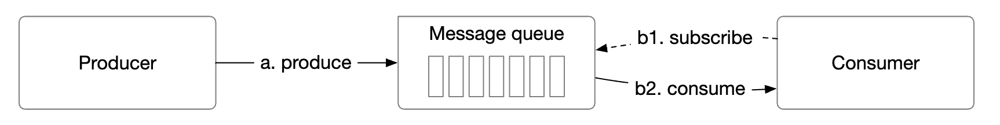
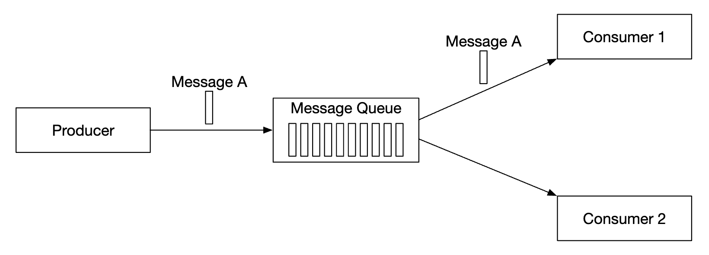
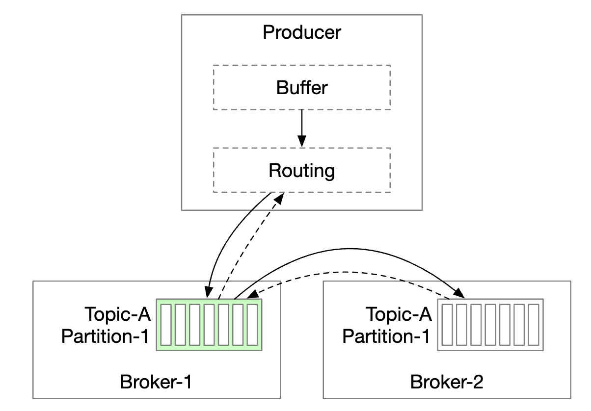
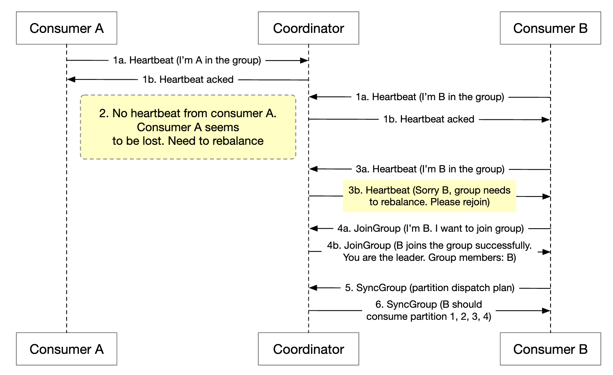
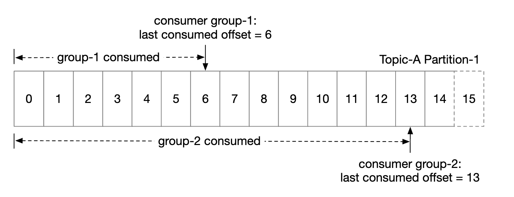
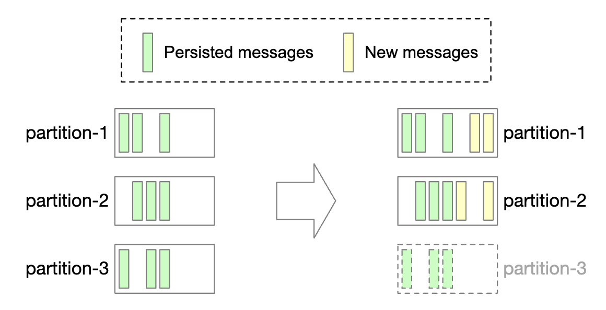
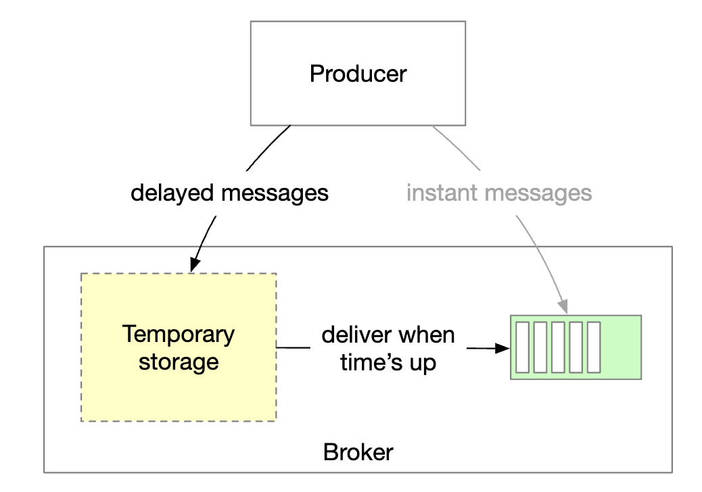

# 第 19 章：分布式消息队列

> 原章节：Distributed Message Queue · 原项目路径 `19. Distributed Message Queue/`

## 本章导读

这一章我们要从零设计一个**分布式消息队列（Distributed Message Queue）**，而且要求比传统消息队列更苛刻：消息要能**重复消费**、要**保证顺序**、要**保留两周**。这三条「额外要求」正是整章的难点——传统消息队列（比如早期的 ActiveMQ）一条都不支持，因为支持它们会显著抬高设计复杂度。

学完这一章，你应该能解释：为什么 Kafka 用机械硬盘还能这么快？为什么设了 `acks=all` 仍可能丢数据？为什么「恰好一次投递」是个需要小心对待的词？

## 你将学到

- 点对点（Point-to-Point）与发布订阅（Pub-Sub）两种模型的区别，以及消息队列的四个核心价值
- 主题（Topic）、分区（Partition）、偏移量（Offset）、消费者组（Consumer Group）之间的关系
- Kafka 高性能的存储根基：分段日志（Segment Log）、稀疏索引、零拷贝（Zero-Copy）
- 生产者路由层放在哪里、消费者该用推模式还是拉模式
- 消费者再均衡（Rebalance）的代价，以及协作式再均衡的改进
- 副本（Replica）、ISR（In-Sync Replicas）与 `acks` 如何共同决定「会不会丢数据」
- 三种投递语义（at-most-once / at-least-once / exactly-once）的准确边界
- 从 ZooKeeper 到 KRaft：Kafka 的元数据管理为什么必须换掉 ZooKeeper

---

## 1. 为什么需要消息队列

用户上传一张图片，后端要做四件事：压缩、生成缩略图、写数据库、发通知。全部同步执行，用户要盯着转圈等好几秒——而「发通知」失败根本不该影响上传成功。把这几件事丢进消息队列，用户立刻收到「上传成功」，剩下的后台慢慢做。这就是消息队列的四个价值：

- **解耦（Decoupling）**：生产者不需要知道消费者是谁、有几个、在不在线，上下游可以独立修改和发布。
- **提升可扩展性（Scalability）**：生产端和消费端按各自流量**独立**扩容，高峰时积压消息、多开消费者追上去。
- **提升可用性（Availability）**：系统某一部分挂了，其他部分仍可继续和队列交互。
- **更好的性能（Performance）**：生产者发出消息后不等消费者确认就返回。

主流实现有 Kafka、RabbitMQ、RocketMQ、Apache Pulsar、ActiveMQ、ZeroMQ。

> **值得主动提的细节**：严格来说 Kafka 和 Pulsar 不是「消息队列」，而是**事件流平台（Event Streaming Platform）**——传统消息队列在消息被消费后就删除消息，流平台把消息当作**可重放的日志**长期保留。本章要设计的正是后者。

---

## 2. 需求澄清与设计范围

面试里最忌讳听到题目就开始画架构。下面是原文的对话，我补上了「为什么问这个」：

| 提问 | 回答 | 为什么重要 |
|---|---|---|
| 消息格式和平均大小？ | 纯文本，通常几 KB | 决定存储结构和网络协议 |
| 消息可以被重复消费吗？ | 可以，不同消费者都要能重复消费 | **额外要求**，传统队列不支持 |
| 消息顺序要保证吗？ | 要保证 | **额外要求**，会限制并行度 |
| 数据保留多久？ | 两周 | **额外要求**，决定存储成本模型 |
| 要支持多少生产者/消费者？ | 越多越好 | 决定扩展性设计目标 |
| 投递语义要支持哪些？ | 至少 at-least-once，最好三种都可配置 | 决定生产者/消费者的确认逻辑 |
| 端到端延迟目标？ | 日志聚合要高吞吐，传统场景要低延迟 | 决定批处理（Batching）策略 |

**功能需求**：生产者发消息到队列；消费者从队列消费；消息可被消费一次或重复消费；历史数据可按保留期截断；消息大小在 KB 量级；顺序需保证；投递语义可配置为 at-most-once / at-least-once / exactly-once。

**非功能需求**：按场景可配置的**高吞吐或低延迟**；**可扩展**（能扛突发流量）；**持久化与可靠**（数据落盘并在节点间复制）。

> **记住这句话**：传统消息队列之所以简单，是因为它**不支持数据保留、不保证顺序**。一旦加上这两条，整个设计就变了——你要在磁盘上维护一份可随机读取、有序、多副本的日志。

---

## 3. 高层架构与两种消息模型

<div align="center"></div>

生产者（Producer）把消息发送到队列；消费者（Consumer）订阅队列并消费订阅到的消息；消息队列是中间的服务，把双方解耦、让它们独立扩展；生产者和消费者都是**客户端**，消息队列是**服务端**。

**点对点模型（Point-to-Point）**，传统消息队列常用：

<div align="center"></div>

一条消息被发送到队列，**只被一个消费者**消费；可以存在多个消费者，但一条消息只被消费一次；消息被确认（Ack）消费后即从队列删除；点对点模型**没有数据保留**——但我们的设计里有。

**发布订阅模型（Publish-Subscribe）**，事件流平台常用：

<div align="center"></div>

消息关联到一个**主题（Topic）**；消费者订阅主题后，会收到发送到该主题的**全部消息**。

<div align="center"></div>

| 组件 | 职责 |
|---|---|
| **客户端（Clients）** | 生产者把消息推到指定主题；消费者组订阅主题的消息 |
| **Broker（代理节点）** | 持有多个分区，一个分区保存某个主题的一个子集消息 |
| **数据存储（Data Storage）** | 在分区中存储消息 |
| **状态存储（State Storage）** | 保存消费者状态（消费到哪了） |
| **元数据存储（Metadata Storage）** | 保存配置和主题属性 |
| **协调服务（Coordination Service）** | 服务发现（哪些 Broker 还活着）和选主（哪个 Broker 是 Leader） |

---

## 4. 主题、分区与偏移量

一个主题的数据量可能非常大，怎么扩展？答案是**把主题拆成分区（Partition）**，也就是分片（Sharding）。

<div align="center"></div>

- 发往某个主题的消息**均匀分布**到它的各个分区；承载分区的服务器叫 **Broker**；
- 每个分区内部就是一个 FIFO 队列，**消息顺序在分区内被保证**；
- 消息在分区内的位置叫**偏移量（Offset）**，就是从 0 开始递增的整数，可以理解为「第几条」；
- 每条消息只被发送到一个特定分区，**分区键（Partition Key）** 决定它落到哪。用 `user_id` 当分区键，就能保证**同一个用户的消息顺序不乱**；
- 每个消费者订阅一个或多个分区；多个消费者消费同一批消息时，组成**消费者组（Consumer Group）**。

> **初学者最容易误解的点**
>
> Kafka 只保证**单个分区内**有序，**不保证跨分区有序**。业务要求全局严格有序时，唯一的办法是把主题设成**单分区**——代价是放弃并行消费，吞吐被锁死在单分区上限。
>
> 更现实的做法是**把「需要保序的维度」做成分区键**。订单场景用 `order_id` 做分区键，同一笔订单的所有事件必然落在同一分区，顺序自然就对了。**绝大多数业务需要的是「局部有序」，不是「全局有序」。**

---

## 5. 消费者组

<div align="center"></div>

- 消息**按消费者组**复制，不是按消费者。组 A 和组 B 各自收到完整一份消息，但组内成员之间是**分摊**关系；
- 每个消费者组维护**自己的一份偏移量**，互不干扰；
- 组内并行读取能提高吞吐，但会**破坏顺序保证**；
- 解决办法：**同一个分区在同一个组内只能被一个消费者订阅**；
- 由此推出：**组内消费者数量不能超过分区数**，多出来的消费者分不到分区，白白空转。

> **实践提醒**：开了 3 分区的主题却起 10 个消费者实例——只有 3 个在工作。反过来，消费者数已经是分区数两倍还没吃满 CPU，那不是加消费者能解决的，得先加分区。

---

## 6. 数据存储：分段日志（Segment Log）

先看消息数据的特点：**写多读也多**；**没有更新和删除操作**（消息只是到期被整体截断）；**访问模式几乎全是顺序读写**。

候选方案中，**通用数据库**不理想——典型关系型数据库很难同时扛住写密集和读密集两种负载；**预写日志（Write-Ahead Log, WAL）** 是一个只支持追加（Append）的文件，对机械硬盘极其友好，这就是我们选的方案。具体做法：把分区拆成多个**分段（Segment）**，避免维护无限增长的巨型文件；老分段**只读**，新写入只被最新的**活跃分段（Active Segment）** 接收。

<div align="center"></div>

原文还纠正了一个偏见：**「机械硬盘很慢」高度依赖访问模式**。顺序访问时（我们的场景）机械硬盘能跑出不错的读写速度；而且操作系统的**页缓存（Page Cache）** 会激进地把磁盘数据缓存到内存里进一步加速。

> **原文这里说对了一半，但数字严重过时**
>
> 「HDD 顺序访问不慢」是对的，但「几 MB/s」是二十多年前的水平。现代 7200 RPM 机械硬盘的顺序读写吞吐在 **150 ~ 250 MB/s** 量级，顺序访问几乎就是它的理论峰值。原文把优势说得**太小**了，反而让人以为 HDD 只能勉强够用。
>
> 真正要理解的是**为什么**顺序访问快：机械硬盘的瓶颈是磁头寻道和旋转延迟，随机读写每次都要等磁头挪位置（毫秒级）；顺序读写时磁头几乎不用挪，吞吐完全取决于盘片转速和数据密度。这就是「用追加日志替代随机更新」的全部理由。

### 原笔记缺失：Kafka 存储的三个关键机制

**① 分段 + 稀疏索引（Sparse Index）**。每个分段不只是数据文件，还配了索引：

| 文件 | 作用 |
|---|---|
| `*.log` | 消息数据本体，按 offset 顺序追加 |
| `*.index` | **偏移量索引**，稀疏存储：每写入约 4KB 数据（`index.interval.bytes`）记一条索引项，内容是「相对 offset → 物理文件位置」 |
| `*.timeindex` | **时间戳索引**，支持按时间查找消息 |

Kafka 默认每个分段最大 1GB（`log.segment.bytes`）。为什么索引要「稀疏」？如果每条消息都建索引，索引本身就和数据一样大，每次写入都要维护它。稀疏索引的查询方式是**二分查找定位 + 顺序扫描**：先在索引里二分找到「不大于目标 offset 的最近一条索引项」，拿到物理位置，再顺序扫几十条消息即可。

**② 零拷贝（Zero-Copy）**。传统的一次「从磁盘读文件发给网络」要经历 4 次数据拷贝和 4 次用户态/内核态切换：

```
磁盘 → 内核页缓存 → 用户态缓冲区 → Socket 缓冲区 → 网卡
```

Kafka 用 `sendfile` 系统调用（Java 侧是 `FileChannel.transferTo`），让数据**不经过用户态**：

```
磁盘 → 内核页缓存 ────────────────→ 网卡
```

拷贝次数从 4 次降到 2 次，上下文切换从 4 次降到 2 次，在「大块顺序读」场景下收益非常明显。

**③ 页缓存 + 顺序追加**。Kafka 自己不维护消息的内存缓存，完全依赖操作系统的页缓存——JVM 堆里不存大量数据，避免了 GC 停顿，重启后页缓存可能还是热的。

> **一个可以自己推出的结论**：顺序追加写 + 稀疏索引 + 零拷贝叠加起来，Kafka 的吞吐瓶颈**不在磁盘 IO**，而在网络带宽和副本同步。所以它敢用普通机械硬盘——把磁盘的强项用到极致，把弱项（随机读写）从设计里彻底消除。

---

## 7. 消息的数据结构

生产者、队列、消费者三方的消息结构必须**完全一致**，才能避免序列化/反序列化的额外拷贝。

<div align="center"></div>

- **Key**：决定消息属于哪个分区，默认映射是 `hash(key) % numPartitions`。生产者也可以覆盖默认行为，自己指定分区。
- **Value**：消息负载（Payload），可以是明文或压缩后的二进制块。

> **注意**：消息 Key 和传统 KV 存储的 Key 不同，**不需要唯一**，甚至可以为空。它只负责「决定分区」，不负责「唯一标识」。

| 字段 | 含义 |
|---|---|
| **Topic / Partition** | 消息所属的主题与分区 ID |
| **Offset** | 消息在分区内的位置。`topic` + `partition` + `offset` 可唯一定位一条消息 |
| **Timestamp / Size** | 消息的存储时间与大小 |
| **CRC** | 校验和，保证消息完整性 |

要支持更多能力（比如消息过滤），在结构里增加字段即可。

---

## 8. 批量（Batching）：吞吐与延迟的权衡

批处理是这套系统性能的命脉，我们在**生产者、消费者、消息队列三处**都使用它。原因：让操作系统能把消息**成组**发送，摊销昂贵的网络往返成本；消息成组顺序写入 WAL，产生大量顺序写，进一步吃到页缓存收益。

代价是延迟与吞吐的取舍：**批量越大**吞吐越高但延迟越高（要攒够一批才发）；**批量越小**吞吐越低但延迟越低。

<div align="center"></div>

所以系统是**可调**的：需要低延迟就把批量调小；目标是吞吐（比如日志聚合）就把批量调大，同时可能要**增加分区数**来补偿单分区顺序写的吞吐上限。

---

## 9. 生产者流程：路由层放在哪里

生产者要把消息发给某个分区，该连哪个 Broker？

**方案一：独立的 routing layer（路由层）**

<div align="center"></div>

路由层从元数据存储读取副本分配方案（Replication Plan）并缓存在本地；生产者把消息发给路由层；路由层转发给该分区的 Leader；从副本（Follower）从 Leader 拉取新消息，收到足够确认后 Leader 提交数据并回复生产者。副本存在的理由就是**容错（Fault Tolerance）**。

这个方案有两个缺点：多一个组件就多一跳网络往返；而且**没法做批量**——路由层是转发，很难把多个生产者的消息攒成一批。

**方案二：把路由层嵌进生产者（Kafka 的实际做法）**

<div align="center"></div>

少一跳网络、延迟更低；生产者自己控制消息路由到哪个分区；生产者内部的**缓冲区（Buffer）** 让它能先在内存攒一批再一次请求发出，吞吐大幅提升。这就是上一节吞吐/延迟权衡的工程落地。

---

## 10. 消费者流程：推模式还是拉模式

消费者指定分区里的某个偏移量，从那里开始接收一批消息。

<div align="center"></div>

**推模式（Push）**：Broker 一收到消息就推给消费者。优点是延迟低；缺点是消费速度跟不上生产速度时消费者会被**压垮**，而且不同消费者处理能力不同，由 Broker 统一控速很难照顾所有人。

**拉模式（Pull）**：消费者主动去 Broker 拉。优点是**消费速率由消费者自己掌控**——消费慢就不会被压垮，可以慢慢扩容追上去；更适合批量处理，因为消费者可以激进地一次拉一大批（推模式下 Broker 根本不知道消费者能吃多少）。缺点是延迟更高，且没有新消息时会产生大量空转请求——后者用**长轮询（Long Polling）** 缓解：请求先挂住，有新消息或超时才返回。

**因此绝大多数消息队列（包括我们的设计）选择拉模式。**

<div align="center"></div>

1. 新消费者订阅主题 A，加入组 1；
2. 通过**对组名做哈希**找到正确的 Broker——同一个组的所有消费者都连到同一个节点，这个节点叫**组协调者（Group Coordinator）**；
3. 协调者确认消费者已加入组，把分区 2 分配给它；分区分配策略有轮询（Round-Robin）、范围（Range）等；
4. 消费者从上次的偏移量开始拉取，偏移量由**状态存储**保存；
5. 消费者处理完消息，把偏移量提交（Commit）给 Broker。

> **注意第 5 步的顺序**：先处理后提交，还是先提交后处理？这个顺序直接决定**投递语义**——见第 16 节。

---

## 11. 消费者再均衡（Rebalance）

再均衡解决的问题是：**哪个消费者负责哪些分区**。触发条件：消费者加入或离开；分区新增或移除；消费者长时间不发心跳。Broker 作为**协调者（Coordinator）** 在整个流程中起核心作用。

<div align="center"></div>

同组所有消费者都连到同一个协调者（通过组名哈希找到）；消费者列表变化时，协调者选出这个组的**组长（Leader）**；组长计算新的分区分配方案，上报协调者，协调者再广播给其他消费者。

<div align="center"></div>

**场景一：消费者加入组**

<div align="center"></div>

最初只有消费者 A，它消费所有分区；消费者 B 请求加入组；协调者通过心跳响应**被动地**通知所有成员该再均衡了；所有消费者重新加入组后，协调者选出组长并通知选举结果；组长生成分区分配方案发给协调者，其他成员等待方案；消费者开始从新分配到的分区消费。

**场景二：消费者离开组**

<div align="center"></div>

A 和 B 在同一组；B 请求离开；协调者收到 A 的心跳后通知它该再均衡了；后续步骤相同。

**场景三：消费者长时间不发心跳**

<div align="center"></div>

协调者认定该消费者已死，把它负责的分区重新分配。

### 原笔记缺失：再均衡的三个真实代价

原文把再均衡描述成中性的「流程」，但工程上它是个**需要警惕的痛点**：

1. **全局停顿（Stop-The-World）**：在「急切式再均衡（Eager Rebalancing）」下，所有消费者必须先**放弃全部已分配分区**再重新分配，整个组会有一段时间**完全停止消费**。
2. **重复消费**：因为必须放弃分区，消费者会把进度提交（或回退），重新拿到分区后可能**重复消费**一部分消息。很多系统的「至少一次」语义就是在再均衡时突然暴露出来的。
3. **再均衡风暴**：消费者因处理超时错过心跳被踢出组，回来后再次触发再均衡，再次超时……整个组永远无法稳定。

**改进方案：协作式再均衡（Cooperative Sticky，Kafka 2.4+）**——不再「先全部放弃再分配」，而是**只回收需要移动的分区**，消费者可以继续消费自己保留的分区；一次再均衡可能需要**两轮**协议，但绝大多数消费者全程无感。配合**静态成员资格（Static Membership）**，给消费者一个固定的 `group.instance.id`，短暂重启（比如滚动发布）时不会被踢出组，可以直接拿回原分区——**这是消除再均衡风暴最有效的手段**。

---

## 12. 状态存储与元数据存储

**状态存储**保存**分区与消费者的映射关系**，以及每个分区**最后被消费到的偏移量**。

<div align="center"></div>

上图里组 1 的偏移量停在 6，表示之前的消息都消费完了。如果消费者崩溃，新接手的消费者会从这个位置继续。消费者状态的特征是：读写频繁但**数据量很小**；频繁更新但极少删除；随机读写；**一致性很重要**（写错会导致重复消费或漏消费）。

**元数据存储**保存配置和主题属性：分区数量、保留期、副本分配方案等。元数据**变化不频繁、数据量小，但对一致性要求很高**。

> **原笔记在这里的结论是错的，而且是本章最重要的一条勘误。**
>
> 原文说：「Given these requirements, a fast KV storage like **Zookeeper** is ideal.」（消费者状态适合放在 ZooKeeper 这种快速 KV 存储里）
>
> **这是过时且不准确的说法。** Kafka 在 **0.9 版本（2015 年）** 就把消费者偏移量从 ZooKeeper 迁移到了自己的内部主题 `__consumer_offsets`（见 KIP-31 / KIP-62）。原因很直接：ZooKeeper 把每次写都当成一次共识操作，**根本扛不住消费者提交偏移量这种高频小写入**。消费者一多，ZooKeeper 就成了整个集群的瓶颈。
>
> 正确做法：偏移量存在 Kafka 内部的 **`__consumer_offsets` 主题**里，该主题使用**日志压缩（Log Compaction）** 而非按时间删除——同一个 `(group, topic, partition)` 的偏移量只保留最新值，旧值被压实掉，磁盘占用很小。详见文末【勘误与补充】。

---

## 13. 协调服务：ZooKeeper 时代的经典设计

> **本节必须先读这段提示**
>
> 下面的内容是 **ZooKeeper 时代的经典设计**。它在 2011 到 2022 年间是 Kafka 的标准架构，**理解它对面试依然有价值**（面试官很可能会问「ZooKeeper 在 Kafka 里干什么」）。但请记住：**现代实现已经演进了**。Kafka 从 2.8 开始引入 **KRaft** 模式，3.3 起达到生产可用，并在 **4.0 版本彻底移除了 ZooKeeper 依赖**。

原文认为 ZooKeeper 是构建分布式消息队列的必需品。它是一个**层级式键值存储（Hierarchical Key-Value Store）**，常用于分布式配置、同步服务和命名注册（也就是服务发现）。

<div align="center"></div>

引入 ZooKeeper 后，Broker 只需维护消息数据本身，元数据和状态存储都交给它。此外 ZooKeeper 还负责 **Broker 副本的选主（Leader Election）**。

### KRaft：为什么必须换掉 ZooKeeper

ZooKeeper 不是「有点旧」，而是有三个结构性问题：

- **运维复杂度翻倍**。你要维护**两套分布式系统**：Kafka 集群和 ZooKeeper 集群，各有各的部署方式、监控指标、升级路径、安全配置（TLS、SASL），而且必须协调升级——版本不兼容会导致整个 Kafka 集群无法启动。
- **Controller 故障恢复慢**。Kafka 的 **Controller** 是一个被选出来的 Broker，负责管理分区 Leader 分配和副本状态。ZooKeeper 模式下 Controller 的元数据**不在自己手里**——必须从 ZooKeeper 全量加载，集群越大加载越慢。Controller 一挂，新 Controller 重新选举 + 重新加载元数据，可能让集群在**秒级到分钟级**的时间里无法响应元数据变更。
- **元数据规模有上限**。ZooKeeper 把所有元数据放在内存，每次变更都要走共识协议。实践表明，ZooKeeper 模式的 Kafka 集群在分区数达到**几十万量级**时就会遇到明显瓶颈。

**KRaft（Kafka Raft）** 的核心思路是：**把元数据本身也当成一条日志**。集群里有一组专门的 **Controller 节点**，组成一个 **Raft 共识组**；所有元数据变更（建主题、改分区、Leader 切换）都作为记录**追加到这条元数据日志**；Raft 保证这条日志在 Controller 之间**强一致地复制**；Broker 不再被动等推送，而是**主动订阅**这条日志，像消费普通主题一样拉取元数据更新。

**Raft 在这里扮演什么角色？** 它就是那个「让一组机器对同一份日志的顺序达成一致」的算法，把 ZooKeeper 原先承担的共识职责，用一个**内嵌在 Kafka 进程里**的协议替代掉了。Raft 的核心机制是：Leader 接收写入并复制给 Follower，只要**多数派（Quorum）** 确认落盘，这条记录就被认为已提交；Leader 挂了，拥有最新日志的节点会被选为新 Leader。

| 维度 | ZooKeeper 模式 | KRaft 模式 |
|---|---|---|
| 需要维护的系统 | Kafka + ZooKeeper 两套 | 只有 Kafka 一套 |
| Controller 故障恢复 | 从 ZK 全量加载元数据，秒级到分钟级 | 备用 Controller 已持有元数据日志，**亚秒到秒级**切换 |
| 元数据规模 | 几十万分区量级遇到瓶颈 | 目标支撑**百万级分区** |
| 元数据传播 | Controller 推送给 Broker，可能滞后 | Broker 主动拉取日志，**天然有序、可断点续传** |

> **面试怎么答**：如果面试官问「Kafka 为什么需要 ZooKeeper」，标准答案是——**以前需要**，它承担元数据存储、Controller 选主、集群成员管理；**现在不需要了**，KRaft 用一条 Raft 复制的元数据日志替代了它。动机是降低运维复杂度、加快 Controller 故障恢复、突破元数据规模上限。
>
> **顺带一提**：Pulsar 走的是另一条路——把存储层完全外置给 **Apache BookKeeper**，Broker 本身无状态。这是「计算存储分离」的思路，和 KRaft 是两种不同的解法。

---

## 14. 复制与 ISR：`acks` 如何决定持久性

<div align="center"></div>

每个分区被复制到多个 Broker，但**只有一个 Leader 副本**；生产者把消息发给 Leader；Follower 从 Leader 拉取消息复制；**足够多的副本**同步完成后，Leader 向生产者返回确认（Acknowledgment）；每个分区的副本分布叫**副本分配方案（Replica Distribution Plan）**。

> **勘误提醒**：原文说「某个分区的 Leader 创建副本分配方案并存到 ZooKeeper」。这个说法不准确——副本分配是 **Controller** 的职责。分区 Leader 只负责数据复制和读写，不决定副本放哪里。

**ISR（In-Sync Replicas，同步副本）就是与 Leader 保持同步的副本集合。**

<div align="center"></div>

上图：已提交的偏移量（Committed Offset）是 13；又有两条新消息写入 Leader 但还没提交；**一条消息只有在 ISR 中所有副本都同步之后，才算「已提交」**；副本 2 和 3 完全跟上 Leader，在 ISR 里；副本 4 落后了，暂时被移出 ISR。

> **注意措辞**：「移出 ISR」不是永久的。副本 4 一旦追上 Leader 进度，会**重新加入 ISR**。ISR 是动态集合，不是静态配置。

ISR 体现了**性能与持久性的取舍**：要求一条都不丢，就得等所有副本同步完才确认——**但一个慢副本会让整个分区变得不可用**；容忍丢一点数据，就可以只等一部分副本。

**`acks=all`**（等价于 `acks=-1`）：ISR 中所有副本都必须同步这条消息。发送慢，持久性最高。

<div align="center"></div>

**`acks=1`**：Leader 收到就返回确认。发送快，持久性低——**Leader 在 Follower 复制之前崩溃，这条消息就丢了**。

<div align="center"></div>

**`acks=0`**：生产者发出去就不管了。最快，持久性最低——**消息可能连 Broker 都没到，生产者却以为成功了**。

<div align="center"></div>

### 原笔记缺失：`acks` 单独决定不了任何事

初学者常以为「设了 `acks=all` 就不会丢数据」——**错**。真正决定持久性的是**三个参数的组合**：

| 参数 | 作用 |
|---|---|
| `acks` | 生产者等几个副本确认才认为写成功 |
| `replication.factor`（RF） | 每个分区总共存几份副本 |
| `min.insync.replicas`（min ISR） | **至少**要有几个副本在 ISR 里，才允许写入 |

关键逻辑是：**当 ISR 大小小于 `min.insync.replicas` 时，Broker 会拒绝写入**，生产者收到 `NotEnoughReplicasException`。这是「宁可不可写，也不丢数据」的保护。

一个经典的生产配置是 **RF=3 + `min.insync.replicas=2` + `acks=all`**：容忍 **1 台** Broker 挂掉而集群**仍然可写**（ISR 还剩 2 个）；已提交的消息**不会丢**（每条消息至少落在 2 台机器上）；同时挂掉 **2 台**则写入被拒绝——这看起来是「降低可用性」，实际是**主动选择一致性**：宁可让生产者收到错误（它可以重试或告警），也不要悄悄丢掉已经承诺过的消息。

还有一个必须知道的参数：**`unclean.leader.election.enable`**。默认 `false`（Kafka 3.0 起），只有 ISR 中的副本才能被选为 Leader，**代价是** ISR 全部挂掉时该分区彻底不可用；设为 `true` 则允许非 ISR 副本当 Leader，**收益是**可用性提高，**代价是会丢数据**。

> **一句话总结**：`acks` 管「生产者等多久」，`min.insync.replicas` 管「什么时候干脆不写」，`unclean.leader.election.enable` 管「实在没办法时保数据还是保可用」。**三者合起来才是一份完整的持久性策略。**

### 消费者侧的读

让所有消费者都连到分区的 Leader 上读消息：设计最简单、运维最容易；一个分区内的消息只会被组内的**一个**消费者读取，连接数可控；热主题可以通过**增加分区数和消费者数**扩展；某些场景下可以让消费者从 ISR 中的其他副本读，比如消费者位于另一个数据中心时。**ISR 列表由 Leader 维护**，它跟踪自己和每个副本之间的落后程度。

---

## 15. 可扩展性：四个维度

**生产者**比消费者轻量得多，直接增减实例即可。**消费者**：消费者组之间互相隔离，可以随意增减消费者组，再均衡负责优雅地处理组内消费者的增减——**再均衡机制同时提供了扩展性和容错性。**

**Broker**：

<div align="center"></div>

一个 Broker 挂掉后，仍有足够的副本保证分区数据不丢；系统选举出新 Leader，Broker 协调者把故障 Broker 上的分区重新分配给现有的其他副本；这些副本接管新分区并作为 Follower 运行，直到追上 Leader 进度后加入 ISR。

让 Broker 更容错的三条建议：**最小 ISR 数量**是延迟与安全性的平衡点，可按需微调；**不要把同一个分区的所有副本放在同一个节点**，那是资源浪费也起不到容错作用；**如果某个分区的所有副本全部崩溃，数据就永久丢失了**——把副本分散到多个数据中心能缓解但会显著增加延迟，折中方案是用**数据镜像（Data Mirroring）** 在集群间异步同步。

新增 Broker 时，可以**临时允许副本数超过配置值**，直到新 Broker 追上进度，再删掉不再需要的副本。

<div align="center"></div>

**分区**：新增分区时生产者会被通知，消费者再均衡被触发，数据存储上只把新消息写到新分区，不拷贝旧数据。

<div align="center"></div>

**减少分区数要复杂得多**：

<div align="center"></div>

分区一旦被下线，新消息只被剩余分区接收；**但被下线的分区不会立即删除**，因为里面还有消息可以被消费；等预先配置的保留期（Retention Period）过去后才截断数据、释放空间；**过渡期内**生产者只往活跃分区发消息，但消费者仍从**所有**分区读；保留期到期后对消费者做一次再均衡，把下线分区彻底移除。

---

## 16. 投递语义：三种保证的真实边界

**At-Most-Once（至多一次）**：消息最多被投递一次，也可能一次都没投到。

<div align="center"></div>

生产者**异步**发送消息，投递失败**不重试**；消费者拉到消息后**立即提交偏移量**，如果处理之前崩溃，这条消息就永远不会被处理。**结论：会丢消息，但绝不重复。**

**At-Least-Once（至少一次）**：消息可能被投递多次，但不应该有消息没被处理。

<div align="center"></div>

生产者用 `acks=1` 或 `acks=all` 发送，出问题就**不断重试**；消费者拉到消息后**处理完成才提交偏移量**。于是可能出现：消费者处理完了但还没提交就崩溃——重启后会**再处理一次**。**结论：不丢消息，但可能重复。**

**Exactly Once（恰好一次）**：对用户最友好，但实现代价极高。

<div align="center"></div>

> **原文这一节只有一句话，但它是初学者最容易被误导的概念，必须讲透。**
>
> **第一件事：端到端的「恰好一次」不可能由消息队列单独实现。** 因为「恰好一次」要约束的不是「消息被投递几次」，而是「**业务副作用发生几次**」。而副作用发生在消费者这一侧——可能是写数据库、扣款、调用外部 API，消息队列**无法控制**外部系统的操作是否被重复执行。只要消费者在「处理完成」和「提交偏移量」之间崩溃，队列就无法判断该不该重发。更本质的说法是：**消息投递和业务处理是两个独立的状态变更，除非它们能放进同一个原子事务，否则无法做到恰好一次。**
>
> **第二件事：Kafka 说的 "exactly-once semantics"（EOS）到底是什么？** 它指的是 **Kafka 内部**（从 Kafka 读到 Kafka 写）的恰好一次，由两个机制拼成：
>
> | 机制 | 解决什么问题 | 怎么做到 |
> |---|---|---|
> | **幂等生产者（Idempotent Producer）** | 生产者**重试**导致的重复写入 | 每个生产者会话有生产者 ID（PID），每条消息带单调递增的序列号，Broker 按 `(PID, 分区, 序列号)` 去重。开启方式：`enable.idempotence=true` |
> | **事务（Transactions）** | 跨多分区写入 + 偏移量提交需要原子性 | 用 `transactional.id` 标识事务，Broker 端维护事务状态；消费者用 `isolation.level=read_committed` 只读已提交数据 |
>
> 两者合起来保证的是：**「消费一个主题、处理后写回另一个主题」这个闭环在 Kafka 内部恰好执行一次**，这也是流处理（Kafka Streams / Flink）最常用的模式。
>
> **第三件事：那跨系统怎么办？** 答案是**消费端自己做幂等**，这也是绝大多数生产系统的真实做法。常见手段：**唯一键 + 数据库唯一索引**（重复插入直接失败）；**去重表**（处理前查「这条处理过吗」，处理后写去重记录，注意这两步必须和业务操作在**同一个数据库事务**里）；**UPSERT / 幂等写**（把「加 1」改成「设为 5」）；**状态机 + 版本号**（旧版本操作直接丢弃）。
>
> **一句话总结**：Kafka 的 EOS 是「幂等生产者 + 事务」在 **Kafka 内部**的语义。**真正的端到端恰好一次 = 队列的 EOS + 消费端的幂等**，业界更诚实的叫法是 **effectively-once（效果上一次）**。当有人跟你说「我们用消息队列实现了恰好一次」，你该追问的是：**你的消费端怎么做幂等？**

---

## 17. 高级特性

**消息过滤（Message Filtering）**：有些消费者只想消费分区里某一种类型的消息。一个办法是**为每类消息建独立主题**，但业务场景一多代价很高：同一条消息存在多个主题里是纯粹的存储浪费；生产者被**紧耦合**到消费者上——每来一个新消费需求，生产者就要改一次。

用消息过滤可以解决：**在消费者侧过滤**（最朴素的做法）会带来大量无意义的消费者流量；**给消息打标签（Tag）**、消费者声明订阅哪些标签是推荐做法；也可以通过**消息负载（Payload）** 过滤，但如果消息加密或序列化过，这既困难又不安全；对更复杂的过滤表达式，Broker 可以实现**语法解析器或脚本执行器**，但这会让消息队列变得很重。

<div align="center"></div>

**延迟消息与定时消息**：比如发起支付后 30 分钟再去检查这笔支付是否成功。核心思路是**把消息分流**——普通消息直接进分区，延迟消息先落到临时存储，到点再投递：

<div align="center"></div>

具体实现是先把消息放到 Broker 的**临时存储**，到时间了再挪到正式分区。

<div align="center"></div>

临时存储可以是一个或多个**特殊的消息主题**；定时功能可以用专门的延迟队列，或**分层时间轮（Hierarchical Time Wheel）** 实现——时间轮的思路类似钟表：细粒度的槽负责近期任务，粗粒度的槽负责远期任务，逐层降级，避免为每个延迟消息都维护一个定时器。

> **补充：主流消息队列对延迟消息的支持差别很大**
>
> | 产品 | 支持情况 |
> |---|---|
> | **RocketMQ** | 原生支持。早期只支持 18 个固定延迟等级；5.0 起支持任意精度的定时消息 |
> | **Pulsar** | 原生支持，API 提供 `deliverAfter`（相对延迟）和 `deliverAt`（绝对时间） |
> | **RabbitMQ** | 需安装 `rabbitmq_delayed_message_exchange` 插件，或用死信队列（DLX）+ TTL 组合实现 |
> | **Kafka** | **没有原生支持**。变通做法是写到一个延迟主题，由定时消费者到点后转发到业务主题 |

---

## 18. 收尾：还有哪些可以聊

- **通信协议（Protocol of Communication）**：需要考虑支持各种使用场景、支撑高数据量、验证消息完整性。流行协议有 **AMQP** 和 **Kafka 协议**。AMQP 是标准化消息协议，特性丰富（复杂路由、事务）但比较重；Kafka 协议是私有的二进制协议，为批量传输和高吞吐专门优化。
- **重试消费（Retry Consumption）**：一条消息当前处理不了，可以送到**专门的重试主题**稍后再试。这比在消费者里阻塞重试好得多——阻塞会拖垮整个分区。生产上通常还配**指数退避 + 死信队列（DLQ）**。
- **历史数据归档（Historical Data Archive）**：老消息可以备份到**大容量廉价存储**，比如 HDFS 或对象存储（如 S3）。这就是「冷热分层」，成本能降一个数量级。

---

## 勘误与补充

> 原文覆盖了消息队列的完整设计脉络，主体框架准确。但若干处存在**技术事实错误**与**过时表述**，另有一些现代工程必备的知识点缺失。

### 勘误 1：`replica.lag.max.messages` 已被移除十年

- **原文说法**：用「副本落后多少条消息」判定它是否在 ISR 中。
- **问题**：该参数**在 Kafka 0.9.0.0（2015 年）就被移除**。用消息条数衡量落后程度不合理：分区流量暴涨时，一个健康的副本可能几毫秒内就「落后 10000 条」，被误判踢出 ISR，随即又追回来——ISR 反复抖动，触发不必要的 Leader 选举。
- **正确说法**：现代 Kafka 用 **`replica.lag.time.max.ms`**，基于时间判断：副本在窗口内（默认 30 秒）向 Leader 发起过拉取并跟上进度，即算在 ISR 内。
- **延伸**：用「距离」还是用「时间」衡量同步状态，在不同负载下表现完全不同——时间窗口有界可预测，消息条数没有上界。

### 勘误 2：消费者偏移量不存在 ZooKeeper 里

- **原文说法**：「a fast KV storage like Zookeeper is ideal」（消费者状态适合放在 ZooKeeper）。
- **问题**：这曾是事实，但**从 Kafka 0.9（2015 年）起不再成立**。ZooKeeper 每次写都要走共识（Zab），而偏移量提交是**高频小写入**——消费者一多，ZK 立刻成为瓶颈。
- **正确说法**：偏移量存储在 Kafka 内部主题 **`__consumer_offsets`**（KIP-31、KIP-62），使用**日志压缩（Log Compaction）**：相同 `(group, topic, partition)` 只保留最新值。
- **延伸**：**Delete（按时间/大小删除整段）** 适合普通消息主题；**Compact（保留每个 key 的最新值）** 适合「状态」类主题（偏移量、CDC 日志）。理解这个区别，就明白 Kafka 为什么能同时扮演消息队列和分布式状态存储。

### 勘误 3：副本分配方案不是分区 Leader 决定的

- **原文说法**：分区 Leader 创建副本分配方案并存入 ZooKeeper。
- **问题**：职责搞混。分区 **Leader** 负责数据复制与读写服务；**决定副本放在哪些 Broker 上**的是 **Controller**。
- **正确说法**：Controller 负责分区 Leader 选举与副本分配，ZK 模式下写入 ZK、KRaft 模式下写入元数据日志，其他 Broker 订阅获知变更。
- **延伸**：这解释了 Controller 为什么是集群的单点关注对象——它挂了会触发重选，期间元数据变更暂停。KRaft 能缩短恢复时间，正是因为备用 Controller 已持有完整元数据日志。

### 勘误 4：HDD 顺序读写「几 MB/s」严重低估

- **原文说法**：「HDDs can achieve several MB/s」。
- **问题**：结论对，数字错得离谱。现代 7200 RPM 机械硬盘顺序读写吞吐在 **150 ~ 250 MB/s** 量级，是「几 MB/s」的几十倍。
- **正确说法**：机械硬盘**随机**访问确实慢（IOPS 只有 100 ~ 200 量级），但**顺序**访问能接近盘片理论带宽。这正是「用追加日志替代随机更新」的全部理由。
- **延伸**：SATA SSD 约 500 MB/s，NVMe SSD 可达数 GB/s。Kafka 用 HDD 能跑得很好，换 SSD 只会更好，瓶颈会先转移到网络和 CPU。

### 勘误 5：`ACK=all` 的写法与理解都要修正

- **原文说法**：用 `ACK=all` / `ACK=1` / `ACK=0`，并把持久性完全归因于该参数。
- **问题**：① 参数名错误——Kafka 的配置项是 **`acks`**（小写、复数），取值 `0`/`1`/`all`（或 `-1`）。② 理解不完整——`acks` 只控制生产者等几个副本确认，管不了 ISR 还剩几个副本。
- **正确说法**：持久性由 `acks` + `replication.factor` + `min.insync.replicas` 共同决定；ISR 低于 min ISR 时 Broker 会拒绝写入。
- **延伸**：还要知道 `unclean.leader.election.enable`（默认 `false`）——ISR 全挂时要不要让落后副本当 Leader，这是可用性与一致性之间最赤裸的开关。

### 补充 1：KRaft 与 ZooKeeper 的演进（原笔记完全缺失）

原文把 ZooKeeper 说成「必需品」已经过时：**Kafka 2.8 引入 KRaft，3.3 生产可用，4.0 已彻底移除 ZooKeeper 依赖**。完整动机与机制见第 13 节。面试中如果你还在说「Kafka 用 ZooKeeper 存元数据」，会立刻暴露知识陈旧。

### 补充 2：分段日志、稀疏索引与零拷贝（原笔记只讲了一半）

原文讲了 WAL 和分段，漏掉了 Kafka 高性能的三个关键机制（见第 6 节）。**这是回答「为什么 Kafka 用磁盘还这么快」的标准答案框架**：顺序追加写 + 稀疏索引 + 零拷贝 + 页缓存。

### 补充 3：消息顺序性的真实边界

| 需求 | 能否满足 | 代价 |
|---|---|---|
| **分区内有序** | 可以，天然保证 | 无 |
| **同一业务键（如 `order_id`）有序** | 可以，用业务键做分区键 | 可能导致分区数据倾斜 |
| **全局严格有序** | 可以，但主题必须**只设一个分区** | 放弃并行消费，吞吐被单分区上限锁死 |

**结论**：绝大多数业务需要的是**局部有序**。先想清楚「哪两个事件之间必须保序」，再决定分区键。另外要记住一个反直觉的点：**增加分区会破坏原有的顺序保证**——分区键是 `user_id` 时，从 4 个分区扩到 8 个，同一用户的消息可能因哈希取模结果变化落到新分区，历史消息与新消息的顺序就乱了。

### 补充 4：再均衡的代价与协作式再均衡

原文把再均衡描述成中性流程，没提代价（见第 11 节）。核心：**急切式再均衡会造成 Stop-The-World 停顿和重复消费**，**协作式再均衡（Kafka 2.4+）+ 静态成员资格**能把影响降到最低。

### 补充 5：投递语义的准确边界

原文对 exactly-once 只有一句话（见第 16 节）。核心结论：**端到端的「恰好一次」不可能靠消息队列单独实现**；Kafka 的 EOS 只在 Kafka 内部成立，跨系统必须由消费端保证幂等。

### 补充 6：主流消息队列的架构对比

| 产品 | 存储模型 | 元数据/协调 | 顺序保证 | 典型场景 |
|---|---|---|---|---|
| **Kafka** | Broker 本地分段日志 | KRaft（Raft 共识组） | 分区内有序 | 日志聚合、流处理、事件溯源 |
| **Pulsar** | 计算存储分离：Broker 无状态 + **Apache BookKeeper** | ZooKeeper + BookKeeper | 分区内有序 | 多租户、需要存算独立扩展 |
| **RocketMQ** | CommitLog + ConsumeQueue | NameServer（轻量，无强一致） | 分区（队列）内有序 | 电商交易、金融场景，国内使用广泛 |
| **RabbitMQ** | 基于 Erlang/OTP 的队列，可持久化 | 无中心节点，Erlang 集群 | 队列内有序 | 企业集成、复杂路由（AMQP 特性丰富） |

**怎么选？** 需要**高吞吐 + 可重放的历史数据**，选 Kafka 或 Pulsar；需要**复杂路由和灵活的消息确认机制**，选 RabbitMQ；在**国内做电商/交易类业务**，RocketMQ 的生态和运维经验更成熟。

### 补充 7：本地怎么动手验证

```bash
# 用 Docker 起一个单节点 KRaft 模式的 Kafka（注意：不需要 ZooKeeper）
docker run -d --name kafka -p 9092:9092 apache/kafka:latest

# 创建一个 3 分区的主题
docker exec -it kafka /opt/kafka/bin/kafka-topics.sh \
  --bootstrap-server localhost:9092 \
  --create --topic demo --partitions 3 --replication-factor 1

# 查看主题详情，观察分区分布
docker exec -it kafka /opt/kafka/bin/kafka-topics.sh \
  --bootstrap-server localhost:9092 --describe --topic demo
```

建议做三个实验：**验证分区键的作用**——用相同的 key 发 10 条消息，观察它们全部落在同一个分区；**验证消费者组**——起两个消费者在同一组，观察分区如何被分摊，再起第三个，观察它分不到分区；**验证偏移量**——消费一部分后停掉消费者，用 `kafka-consumer-groups.sh --describe` 查看 `LAG`（积压量），重启消费者观察它从哪里继续。

---

## 常见误区

| 误区 | 为什么错 | 正确理解 |
|---|---|---|
| Kafka 快是因为「消息存在内存里」 | Kafka 的消息**持久化到磁盘**，内存只做页缓存加速 | 快的原因是顺序追加写 + 稀疏索引 + 零拷贝 + 页缓存 |
| `acks=all` 就不会丢数据 | `acks=all` 只控制生产者等几个副本确认，管不了 ISR 还剩几个副本 | 持久性 = `acks` + `replication.factor` + `min.insync.replicas` 的组合 |
| 消息队列保证全局有序 | Kafka 只保证**分区内**有序，跨分区无序 | 需要保序的维度要拿来做**分区键**；真需要全局有序只能单分区 |
| 消费者越多吞吐越高 | 组内超过分区数的消费者**分不到任何分区** | 消费者数量上限是分区数；吞吐不够先加分区 |
| 消息队列实现了 exactly-once | 队列无法控制外部系统的副作用是否重复执行 | 队列的 EOS 只覆盖 Kafka 内部；端到端需要**消费端幂等** |
| 消费者偏移量存在 ZooKeeper 里 | 这是 2015 年之前的设计，ZK 扛不住高频偏移量提交 | 偏移量存在 Kafka 内部主题 `__consumer_offsets`，用**日志压缩**维护 |
| 再均衡是「无感」的 | 急切式再均衡会让整个组**停止消费**，并造成重复消费 | 开启协作式再均衡 + 静态成员资格 |
| 增加分区只有好处 | 增加分区会**改变分区键的哈希映射**，破坏原有的分区内顺序 | 扩分区前要评估「同一业务键的消息是否会漂移到新分区」 |
| ZooKeeper 是 Kafka 的必需品 | Kafka 4.0 已完全移除 ZooKeeper 依赖 | 现代 Kafka 用 **KRaft**：一组 Controller 节点用 Raft 复制元数据日志 |

---

## 面试速记

- **一句话概括**：分布式消息队列本质上是一个**可持久化、可复制、可分区的追加日志**，它用「分区内有序 + 多副本复制 + 消费者组」三件事，同时提供了高吞吐、高可用和可重放的能力。

- **必答要点**：
  1. **分区是扩展和有序的基本单位**。消息按分区键哈希落分区，顺序只在分区内保证；消费者组内一个分区只能被一个消费者消费，所以消费者数不能超过分区数。
  2. **存储用分段日志（WAL）**。老分段只读、新分段追加写，配稀疏索引；高性能来自顺序写 + 页缓存 + 零拷贝。
  3. **持久性由 `acks` + `replication.factor` + `min.insync.replicas` 三者共同决定**，而不是 `acks` 一个参数。
  4. **消费者用拉模式**，因为消费速率要由消费者自己控制；空转问题用长轮询缓解。
  5. **投递语义三种**：at-most-once（不重试 + 先提交后处理，会丢）、at-least-once（重试 + 处理完再提交，会重）、exactly-once（幂等生产者 + 事务，仅在 Kafka 内部成立）。

- **加分项**：
  1. 主动提到 **KRaft 已经取代 ZooKeeper**，并说清三个动机（运维复杂度、Controller 恢复慢、元数据规模上限）。
  2. 主动指出 **exactly-once 的边界**，并说明消费端需要自己做幂等。
  3. 主动提 **再均衡的代价**（Stop-The-World、重复消费、再均衡风暴）和**协作式再均衡**的改进。
  4. 主动区分**日志压缩（Compact）** 和**按时间删除（Delete）**。

- **高频追问**：
  1. *「Kafka 为什么用磁盘还这么快？」* → 顺序追加写（避免寻道）+ 稀疏索引（少量内存换取快速定位）+ 零拷贝 `sendfile`（数据不经过用户态）+ 页缓存。四个机制叠加，瓶颈从磁盘转移到网络。
  2. *「怎么保证消息不丢？」* → 分三段答：**生产者侧** `acks=all` + 重试 + 幂等生产者；**Broker 侧** RF≥3 + `min.insync.replicas=2` + `unclean.leader.election.enable=false`；**消费者侧**处理完再提交偏移量。任何一段缺失都可能丢消息。
  3. *「怎么保证消息不重复？」* → 队列侧做不到端到端去重。要么接受重复 + 消费端幂等（推荐），要么在 Kafka 内部用事务 + 幂等生产者。业务侧最实用的是**唯一索引 + UPSERT**。
  4. *「消费者一直重复消费同一条消息，怎么排查？」* → 先看是不是**再均衡太频繁**（消费者被反复踢出组，偏移量提交不上去）。检查心跳超时配置、单条消息处理耗时是否超过 `max.poll.interval.ms`、是否开启了协作式再均衡和静态成员资格。
  5. *「要支持全局有序，怎么办？」* → 单分区是最简单但最昂贵的答案。更好的问法是：「你说的全局有序，具体是哪两个事件之间必须保序？」通常把粒度降到业务键级别就能既保序又保吞吐。

---

## 延伸阅读

- [Apache Kafka 官方文档](https://kafka.apache.org/documentation/) — 参数、设计原理与协议说明
- [KIP-500：用自管理的元数据仲裁替换 ZooKeeper](https://cwiki.apache.org/confluence/display/KAFKA/KIP-500%3A+Replace+ZooKeeper+with+a+Self-Managed+Metadata+Quorum) — KRaft 的设计提案
- [KIP-429：消费者增量再均衡协议](https://cwiki.apache.org/confluence/display/KAFKA/KIP-429%3A+Kafka+Consumer+Incremental+Rebalance+Protocol) — 协作式再均衡的设计文档
- [KIP-98：恰好一次投递与事务消息](https://cwiki.apache.org/confluence/display/KAFKA/KIP-98+-+Exactly+Once+Delivery+and+Transactional+Messaging) — 幂等生产者与事务的设计
- [Raft 共识算法官网](https://raft.github.io/) — 有可视化演示，理解 KRaft 的基础
- [Apache Pulsar 文档](https://pulsar.apache.org/docs/) — 存算分离架构，和 Kafka 对比着看
- [Apache RocketMQ 文档](https://rocketmq.apache.org/) — 延迟消息、事务消息的原生实现
- [RabbitMQ 文档](https://www.rabbitmq.com/) — AMQP 协议与企业集成场景
- [分层时间轮论文（SOSP'87）](http://www.cs.columbia.edu/~nahum/w6998/papers/sosp87-timing-wheels.pdf) — 原笔记提供的链接
- [Kafka 数据镜像（MirrorMaker）](https://cwiki.apache.org/confluence/pages/viewpage.action?pageId=27846330) — 原笔记提供的链接
