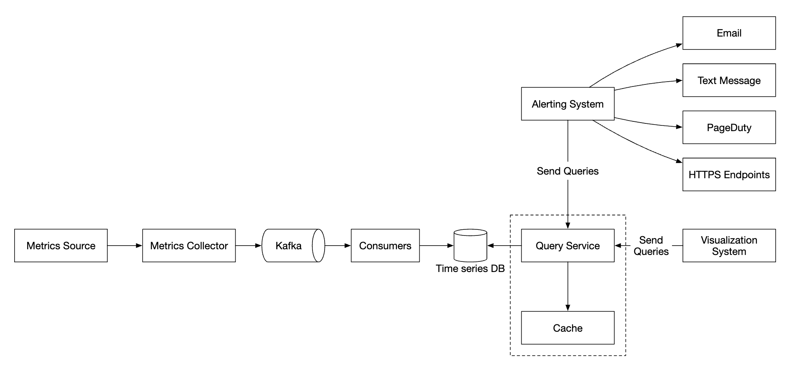
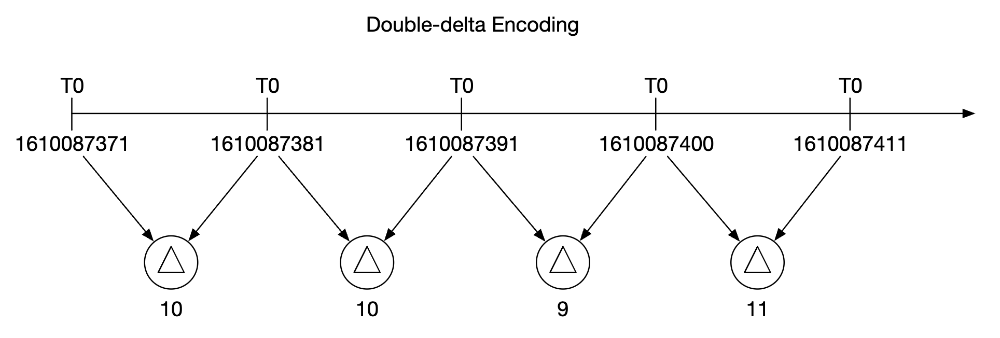

# 第 20 章：指标监控与告警系统

> 原章节：Metrics Monitoring and Alerting System · 原项目路径 `20. Metrics Monitoring and Alerting System/`

## 本章导读

系统上线只是开始。真正难的是：**你怎么知道它现在是好的？**

凌晨三点，数据库连接池被耗尽，所有请求超时。如果没有人发现，直到早上用户投诉才知道——这就是没有监控的系统。而如果监控配得太敏感，一晚上给你发 800 条告警，你会在第三天开始全部忽略——这就是**告警疲劳**，它比没有告警更危险。

这一章我们要设计一个能支撑 **1000 万台机器、1000 万条时间序列**的监控告警系统。它会带你搞清楚：指标（Metric）到底是什么？为什么 Prometheus 用「拉」而 CloudWatch 用「推」？一条标签写错为什么能让整个监控系统内存爆炸？「告警」这件事真正难的地方在哪里？

## 你将学到

- 监控系统的五个核心组件，以及它们各自的职责边界
- 时间序列（Time Series）的数据模型：指标名 + 标签 + 时间戳 + 值
- **基数爆炸（Cardinality Explosion）**——生产环境最常见、也最容易自己制造的事故
- 拉模式（Pull）与推模式（Push）的六个维度对比，以及为什么短生命周期任务必须用 Pushgateway
- 消息队列在采集管道里的作用，以及聚合可以发生在哪三个位置
- 数据编码压缩（delta-of-delta、XOR）、降采样（Downsampling）与长期存储方案
- 现代告警实践：告警风暴、聚合、抑制、静默，以及基于 SLO 与错误预算（Error Budget）的告警
- RED 方法与 USE 方法这两套黄金指标体系

---

## 1. 监控与告警到底解决什么问题

先分清两个经常被混为一谈的概念：

- **监控（Monitoring）** 回答「现在发生了什么」。它是指标的采集、存储和展示。CPU 使用率 92%、QPS 8000、P99 延迟 340ms——这些是监控。
- **告警（Alerting）** 回答「什么时候该叫人」。它是对指标的持续判断：如果连续 5 分钟错误率超过 1%，就叫醒值班工程师。

两者是一体的：**没有监控就没有告警的依据，没有告警监控就只是好看但没人看的图。**

原文给这个系统的定位是「对保证高可用和可靠性至关重要」。说得更具体一点，监控系统要支撑三件事：

1. **发现故障**：在用户投诉之前知道出问题了。
2. **定位故障**：出事时能回答「是哪个服务、哪台机器、从什么时候开始的」。
3. **验证变更**：发了新版本、改了配置之后，指标是变好了还是变坏了。

---

## 2. 需求澄清：从 100 万到 1000 万条时间序列

监控系统可以指很多东西，先问清楚边界——**面试官可能只想聊基础设施指标，而你在设计一个日志系统**，那就完全跑偏了。

| 提问 | 回答 | 为什么重要 |
|---|---|---|
| 给谁用？内部系统还是 SaaS？ | 只做内部使用 | 决定要不要多租户隔离与计费 |
| 采集哪些指标？ | 操作系统指标（CPU、内存、磁盘）+ 高层指标（每秒请求数）。**不含业务指标** | 划定范围，避免设计过度 |
| 被监控的基础设施规模？ | 1 亿日活、1000 个服务器池、每池 100 台机器 | 决定数据量与分区策略 |
| 数据保留多久？ | 1 年 | 决定存储成本模型 |
| 可以降低长期数据的分辨率吗？ | 原始数据留 7 天；30 天内降到 1 分钟；之后降到 1 小时 | 降采样（Downsampling）策略 |
| 支持哪些告警通道？ | 邮件、电话、PagerDuty、Webhook | 决定告警分发链路 |
| 需要采集错误日志/访问日志吗？ | 不需要 | 排除日志系统 |
| 需要分布式链路追踪吗？ | 不需要 | 排除 Tracing 系统 |

### 规模与假设

被监控的基础设施规模是：

- **1 亿日活（DAU）**；
- **1000 个服务器池 × 每池 100 台机器 × 每台约 100 个指标 ≈ 1000 万条时间序列**；
- 数据保留 1 年；
- 保留策略：原始数据 7 天 → 1 分钟分辨率 30 天 → 1 小时分辨率 1 年。

> **这个数字值得自己算一遍**
>
> 1000 池 × 100 台 = **10 万台机器**；每台 100 个指标 → **1000 万条时间序列**。
>
> 如果采集间隔是 10 秒，写入速率就是 `1000 万 ÷ 10 = 每秒 100 万个数据点`。
>
> 一天就是 `100 万 × 86400 ≈ 864 亿个数据点`。按每点压缩后约 2 字节估算（时序数据库的典型压缩水平），大约 **170 GB/天**。
>
> 再套用保留策略：7 天原始数据约 **1.2 TB**；30 天的 1 分钟数据约 **0.9 TB**；剩下约 328 天的 1 小时数据约 **0.16 TB**。**稳态总占用约 2.2 TB**——这是个完全可控的数字，但前提是**每一条时间序列都真的有必要存在**。第 4 节会讲这条前提是怎么被打破的。

### 非功能需求

- **可扩展（Scalability）**：能容纳更多指标和告警；
- **低延迟（Low Latency）**：仪表盘和告警的查询必须快——告警慢一分钟，故障就多持续一分钟；
- **可靠（Reliability）**：不能漏掉关键告警；
- **灵活（Flexibility）**：未来能方便地接入新技术。

### 明确排除的范围

- **日志监控（Log Monitoring）**：ELK 技术栈是这个场景的主流方案，不在本章范围；
- **分布式链路追踪（Distributed Tracing）**：指跟踪一个请求在多个服务之间流转的完整生命周期，也不在本章范围。

> 面试里**主动说出「这两个不在范围内」**是加分项——它说明你知道监控、日志、追踪是三个不同的领域（业界常称为可观测性的三大支柱）。

---

## 3. 五个核心组件与高层架构

一个指标监控与告警系统有五个核心组件：

<div align="center"></div>

- **数据采集（Data Collection）**：从各种来源收集指标数据；
- **数据传输（Data Transmission）**：把数据从来源传到监控系统；
- **数据存储（Data Storage）**：组织和存储收到的数据；
- **告警（Alerting）**：分析数据、检测异常、产生告警；
- **可视化（Visualization）**：用图表展示数据。

对应的高层设计：

<div align="center"></div>

| 组件 | 职责 |
|---|---|
| **指标来源（Metrics Source）** | 应用服务器、SQL 数据库、消息队列等 |
| **指标采集器（Metrics Collector）** | 收集指标数据并写入时序数据库 |
| **时序数据库（Time-Series Database）** | 以时间序列形式存储指标，提供专用查询接口 |
| **查询服务（Query Service）** | 让查询和检索更容易。如果数据库自带接口足够强，这一层可以省掉 |
| **告警系统（Alerting System）** | 向各个告警接收方发送通知 |
| **可视化系统（Visualization System）** | 用图表展示指标 |

---

## 4. 数据模型：时间序列与标签

指标数据通常记录为**时间序列（Time Series）**：一组带时间戳的值。一条序列由**名字**和一组**可选的标签（Tag / Label）** 唯一标识。

**例 1：生产服务器 i631 在 20:00 的 CPU 负载是多少？**

<div align="center"></div>

<div align="center"></div>

这条时间序列由**指标名、标签、以及某个具体时刻上的一个点**共同标识。

**例 2：us-west 区域所有 Web 服务器最近 10 分钟的平均 CPU 负载是多少？**

```
CPU.load host=webserver01,region=us-west 1613707265 50
CPU.load host=webserver01,region=us-west 1613707265 62
CPU.load host=webserver02,region=us-west 1613707265 43
CPU.load host=webserver02,region=us-west 1613707265 53
...
```

把最后一列的值取平均，就得到了答案。这种格式叫**行协议（Line Protocol）**，很多主流监控软件都在用。

> **原文这里有两处不准确，先记一笔**
>
> ① 上面这个例子的**字段顺序并不符合 InfluxDB 的行协议**。InfluxDB 的格式是 `<指标名>[,<标签>...] <字段>=<值> [<时间戳>]`，比如 `weather,location=us-midwest temperature=82 1465839830100400200`——**字段名和值必须在时间戳之前，而且要有 `=`**。原文的例子把时间戳放在值前面，格式是错的。
>
> ② 原文说这个格式「被 Prometheus、OpenTSDB 等使用」——**Prometheus 不用行协议**。它有自己的文本暴露格式 `metric_name{label="value"} 42`，远程写则是 protobuf。三种格式被混在一起了。详见文末【勘误与补充】。

一条时间序列由什么构成：

<div align="center"></div>

一个直观的可视化方式：

<div align="center"></div>

- 横轴（x）是**时间**；
- 纵轴（y）是**你要查询的维度**——比如指标名、标签等。

**数据的访问模式**是：**写入密集 + 读取呈尖峰**。我们持续采集海量指标，但这些数据平时很少被读——只在出事故时被集中、大量地读取。

### 原笔记缺失的核心内容：基数爆炸

原文只有一句「保持标签基数低很重要」，但没说清楚后果。这是本章最该讲透的工程风险。

**基数（Cardinality）** 指的是**不同时间序列的总条数**。它由所有标签的**取值组合数**决定：

```
序列条数 = (标签 A 的取值数) × (标签 B 的取值数) × (标签 C 的取值数) × ...
```

**关键点：标签是相乘的，不是相加的。** 这是所有事故的根源。

看一个真实场景。你给一个 HTTP 请求指标打了几个看起来很合理的标签：

```
http_requests_total{method="GET", path="/api/user", status="200"} 1
```

基数 = 3 种 method × 10 条 path × 5 种 status = **150 条序列**。完全没问题。

现在有人加了两个「方便排查」的标签：

```
http_requests_total{method="GET", path="/api/user", status="200",
                    user_id="88231", request_id="a3f9-..."} 1
```

- `user_id` 有 100 万个取值 → 基数 × 100 万
- `request_id` 每条请求都不一样 → 基数 **无限增长**

结果是：**这个指标每天新增几亿条序列，每条序列至少要占内存里的一份索引和元数据**。监控系统会在几小时内 OOM 崩溃。而崩溃的监控系统，在你最需要它的时候是彻底没用的。

**什么样的标签是危险的？**

| 标签类型 | 例子 | 危险程度 |
|---|---|---|
| 枚举值，取值固定且少 | `method`、`status`、`region`、`env` | 安全 |
| 取值有限但较多 | `path`（如果是 RESTful 路由模板，如 `/api/user/:id`） | 可用，但要控制数量 |
| 取值随业务增长 | `user_id`、`order_id`、`tenant_id` | **危险**，会随用户量线性增长 |
| 每次都不同 | `request_id`、`trace_id`、`session_id`、时间戳 | **绝对禁止**，会无限增长 |

**正确做法：**

1. **永远不要用高基数维度做标签**。`user_id`、`request_id` 这类信息应该写进**日志（Log）或追踪（Trace）**，而不是指标标签——日志系统是按量存储的，天然能承受这种维度。
2. **路径要归一化**。用路由模板 `/api/user/:id` 而不是真实路径 `/api/user/88231`。
3. **用聚合换基数**。如果确实需要统计每个用户的请求数，把它做成一个独立的、只在需要时开启的指标，或者放到业务数仓里算。
4. **监控你的监控系统**。给「当前活跃序列数」本身设一条指标和告警，基数是**渐进式**失控的，早发现能救你一命。
5. **用直方图（Histogram）而不是标签来记录延迟分布**。这是 Prometheus 的经典实践。

> **一句话总结**：标签是**乘法**的。加一个标签很容易，加完之后基数可能涨一万倍。设计指标时先问自己：「这个标签的取值会随时间增长吗？」如果答案是「会」，就不要用它。

---

## 5. 时序数据库：为什么不能用 MySQL

数据存储系统是整个设计的核心。

- **不建议用通用数据库**。虽然专家级调优后也能撑住一定规模，但通用数据库的存储引擎、索引结构、查询优化器都不是为时序数据设计的。
- **NoSQL 理论上可以**，但很难设计出一套能高效存储和查询时间序列的可扩展模式（Schema）。

于是出现了一批**专门为时序数据设计的数据库**：

| 产品 | 说明 |
|---|---|
| **OpenTSDB** | 分布式时序数据库，但基于 Hadoop 和 HBase。如果你没有这套基础设施，用起来会很吃力 |
| **MetricsDB** | Twitter 内部使用的时序数据库 |
| **Amazon Timestream** | AWS 的托管时序数据库服务 |
| **InfluxDB** | 最流行的时序数据库之一，基于**内存缓存 + 磁盘存储** |
| **Prometheus** | 最流行的监控系统之一，自带 TSDB，同样是内存 + 磁盘结构 |

InfluxDB 官方给出的一个规模参考：**8 核 32GB 内存的机器，写入能力超过每秒 25 万点**。

<div align="center"></div>

原文说「不要求你理解指标数据库的内部实现，这属于小众知识」。这句话对面试场景成立，但对**工程判断**不成立：至少要知道两件事——**标签基数决定内存占用**，**压缩算法决定存储成本**。这两点会直接决定你的监控系统能不能活过第一个月。

时序数据库的一个核心能力是**按标签高效聚合和分析海量时序数据**。InfluxDB 会为每个标签建立索引。

> **但索引是有代价的**：索引本身要占内存。标签取值越多，索引越大。这就是上一节基数爆炸在存储层的直接后果——**不是磁盘写不下，而是内存先爆**。

---

## 6. 指标采集（一）：拉模式（Pull）

采集指标时，**偶尔丢几个数据点不是关键问题**——客户端可以「发完就忘（Fire and Forget）」。这个前提很重要，它意味着采集链路可以用比较轻量的协议。

<div align="center"></div>

采集有两种实现方式：**拉（Pull）** 和 **推（Push）**。

拉模式的形态如下：

<div align="center"></div>

采集器需要维护一份**最新**的服务与指标端点列表，这就要靠**服务发现（Service Discovery）**，可以用 ZooKeeper 或 etcd 实现。服务发现里包含「从哪采、什么时候采」的配置规则：

<div align="center"></div>

完整的采集流程：

<div align="center"></div>

1. 采集器从服务发现获取配置元数据，包括**采集间隔、IP 地址、超时与重试参数**；
2. 采集器通过预定义的 HTTP 端点（比如 `/metrics`）拉取指标，通常由客户端库暴露；
3. 或者，采集器向服务发现**注册变更事件通知**，端点变化时被主动告知；
4. 另一种方式是采集器**定期轮询**指标端点配置的变更。

### 多个采集器之间怎么协调

在我们的规模下，单个采集器肯定不够，必须部署多个实例。但多个采集器之间必须同步，**否则两个采集器会重复采集同一批指标**。

一个解决方案是把**采集器和被采集服务器放在同一个一致性哈希环（Consistent Hash Ring）上**，让一组服务器只对应一个采集器：

<div align="center"></div>

---

## 7. 指标采集（二）：推模式（Push）与取舍

推模式下，服务主动把指标推给采集器：

<div align="center"></div>

这种方案通常会在服务实例旁边部署一个**采集代理（Agent）**：代理从服务器收集指标，再推给采集器。

<div align="center"></div>

推模式的一个好处是：**可以在发送前先在本地做聚合**，从而减少采集器要处理的数据量。反过来，采集器可能因为处理不过来而**拒绝**推送请求——所以采集器必须放在负载均衡器后面的**自动伸缩组（Auto-Scaling Group）** 里。

### 六个维度的对比

| 维度 | 拉模式（Pull） | 推模式（Push） |
|---|---|---|
| **调试便利性** | 应用服务器上的 `/metrics` 端点随时可以打开看指标，甚至在你自己的笔记本上就能验证。**拉胜** | 采集器收不到数据时，你无法区分是服务挂了还是网络问题 |
| **健康检查** | 服务不响应拉取，立刻能判断它挂了。**拉胜** | 同样无法区分服务挂了还是网络问题 |
| **短生命周期任务** | 批量任务存活时间太短，来不及被拉到 | **推胜**。这是拉模式的硬伤，需要用 Pushgateway 弥补 |
| **防火墙与复杂网络** | 要求所有指标端点都能被采集器访问，多数据中心场景下可能很麻烦 | 采集器配好负载均衡和自动伸缩后，可以从任何地方接收数据。**推胜** |
| **性能** | 拉模式通常用 TCP | 推模式常被说成「用 UDP，延迟更低」——**这个说法不准确**，见文末勘误 |
| **数据真实性** | 采集目标在配置里预先定义，来源可信 | 任何客户端都能推数据。需要用白名单或鉴权来限制 |

**没有绝对的赢家。** 大型组织往往两种都要支持——毕竟有些场景下你根本没法在目标机器上安装推送代理。

> **补充：短生命周期任务与 Pushgateway**
>
> 这是拉模式唯一真正的硬伤，值得单独说清楚。
>
> 一个每天跑一次、只活 30 秒的定时任务，Prometheus 每 15 秒拉一次，**大概率一次都拉不到**——任务早就退出了。你可能会想「把采集间隔调小」？但采集间隔是全局配置，为了一个 30 秒的任务把全局间隔调到 5 秒，会让整个系统的数据量涨三倍。
>
> **正确解法是 Pushgateway**：任务在退出前，主动把自己的指标 `POST` 到 Pushgateway；Pushgateway 常驻运行，对外暴露 `/metrics`，让 Prometheus 像拉普通服务一样拉它。
>
> 但 Pushgateway 有三个必须知道的坑：
>
> 1. **它不会自动清理**。推送上去的指标会**永久保留**，直到你手动删除或重启。一个跑了一次的任务，它的指标会一直显示在监控里——这是最常见的误用。
> 2. **它不适合长期运行的服务**。Pushgateway 会丢失实例维度（多个实例推同一个 job 会互相覆盖），也让「实例是否存活」的监控失效。
> 3. **它无法做健康检查**。因为指标是「推上来的」，Pushgateway 不知道推送者是否还活着。
>
> **一句话原则**：**长期运行的服务用 Pull，短生命周期的批处理任务用 Push（经由 Pushgateway）**。不要为了图方便把所有东西都推给 Pushgateway。

---

## 8. 传输管道：用消息队列削峰

<div align="center"></div>

无论用推还是拉，采集器都部署在**自动伸缩组**里。但如果时序数据库宕机，采集到的数据就会丢失。为了缓解这个问题，我们引入一个**排队机制**：

<div align="center"></div>

- 采集器把指标数据推入 **Kafka**；
- 消费者或流处理服务（如 Apache Storm、Flink、Spark）处理数据，再写入时序数据库。

这个方案有几个好处：

- Kafka 是一个**高可靠、可扩展**的分布式消息平台；
- 它把**数据采集**和**数据处理**解耦；
- 数据保留在 Kafka 里，可以**防止数据丢失**——时序数据库恢复了再补写。

Kafka 可以按**指标名分区**，让消费者按指标名聚合数据。要进一步扩展，可以再按**标签**分区，并对指标做分类和优先级排序，优先采集重要指标。

<div align="center"></div>

用 Kafka 的主要缺点是**运维开销**。一个替代方案是使用大规模摄取系统，比如 Facebook 的 **Gorilla**。

> **原文这里有个数字问题，值得算一下**
>
> 原文说「Kafka 可以配置成**每个指标名一个分区**」。听起来很合理，但套到我们自己的规模上：**1000 万个指标名 → 1000 万个分区**。
>
> 这个数量级是**不可行**的。Kafka 的每个分区都有固定开销（文件句柄、内存中的索引、副本同步线程），业界实践中单个集群的分区总数通常控制在**几十万**量级——而 KRaft 模式的目标也只是「百万级分区」。1000 万分区需要十个满配集群，而且消费者数量、再均衡时间都会失控。
>
> **更现实的做法**：按「指标名的哈希值」分区（而不是每个指标名一个分区），让同一个指标的数据落在同一个分区里，这样既能做按指标聚合，分区数又保持在一个可控的量级（比如几百到几千个）。再要扩展，就叠加一层标签哈希。

### 聚合可以发生在哪里

指标可以在三个位置聚合，各有取舍：

| 位置 | 做法 | 优点 | 代价 |
|---|---|---|---|
| **采集代理（Collection Agent）** | 客户端本地做简单聚合，比如「统计 1 分钟内的计数器再上报」 | 大幅减少传输量 | 只能做简单逻辑；丢失原始精度 |
| **摄取管道（Ingestion Pipeline）** | 写库前用 Flink 之类的流处理引擎聚合 | 减少写入量 | **丢失数据精度**，原始数据不再存在 |
| **查询侧（Query Side）** | 查询时在可视化系统里聚合 | 不丢数据，随时可以换聚合方式 | 查询慢，因为要处理大量原始数据 |

**怎么选？** 一个实用的判断标准是：**保留原始数据的时间要短，聚合数据的时间要长**。所以常见的组合是——采集代理做轻量预聚合，摄取管道做分钟级降采样，长期数据靠查询侧。

---

## 9. 查询服务与查询语言

把查询服务从时序数据库里独立出来，可以让可视化和告警系统与数据库解耦，从而能自由更换数据库而不影响上层。

我们还可以加一层**缓存**来减轻时序数据库的压力：

<div align="center"></div>

不过也可以**完全不建查询服务**——大多数可视化和告警系统都有强大的插件能直接对接主流时序数据库。如果选对了数据库，连自己写缓存层都不需要。

### 为什么时序数据库通常不支持 SQL

大多数时序数据库不支持标准 SQL，原因很简单：**SQL 表达时序查询非常低效**。原文给了一个计算指数移动平均的例子：

```sql
select id,
       temp,
       avg(temp) over (partition by group_nr order by time_read) as rolling_avg
from (
  select id,
         temp,
         time_read,
         interval_group,
         id - row_number() over (partition by interval_group order by time_read) as group_nr
  from (
    select id,
    time_read,
    "epoch"::timestamp + "900 seconds"::interval * (extract(epoch from time_read)::int4 / 900) as interval_group,
    temp
    from readings
  ) t1
) t2
order by time_read;
```

同样的查询用 InfluxDB 的查询语言 Flux 写出来：

```
from(db:"telegraf")
  |> range(start:-1h)
  |> filter(fn: (r) => r._measurement == "foo")
  |> exponentialMovingAverage(size:-10s)
```

差距一目了然：SQL 版本需要三层嵌套子查询加窗口函数，Flux 版本用管道（Pipe）把「取时间范围 → 过滤 → 计算」串起来，语义直白得多。

> **补充：PromQL 与记录规则（Recording Rules）**
>
> 现代监控里最重要的查询语言是 Prometheus 的 **PromQL**。它有几个概念值得提前建立：
>
> - **瞬时向量（Instant Vector）**：某个时刻的一组序列，如 `http_requests_total`；
> - **区间向量（Range Vector）**：一段时间窗口内的样本，用 `[5m]` 表示；
> - **速率计算**：`rate(http_requests_total[5m])` 计算每秒增长率——这是最常用的写法，也是初学者最容易写错的（计数器只能配 `rate`/`increase`，不能直接算差值，因为进程重启会让计数器归零）；
> - **聚合**：`sum by (service) (rate(http_requests_total[5m]))` 按服务维度求和；
> - **分位数**：`histogram_quantile(0.99, ...)` 从直方图估算 P99 延迟。
>
> **记录规则（Recording Rules）** 解决的是另一个问题：如果仪表盘上有个很重的查询（比如跨 100 万台机器的 `rate` 再聚合），每次打开都要现算，会拖垮数据库。记录规则让你**定期把查询结果预先算好、存成一条新指标**，仪表盘直接读结果。这是「查询侧的降采样」。

---

## 10. 存储层：编码、降采样与长期存储

选时序数据库要谨慎。Facebook 发表过一项研究：**对运维存储的查询中，约 85% 是针对过去 26 小时数据的**。

如果我们选一个能利用这个特性的数据库，对系统性能会有显著影响——InfluxDB 就是这类设计（近期的热数据优先）。

无论选哪个数据库，都有一些通用的优化手段。

### 数据编码与压缩

编码和压缩能显著减小数据体积，好的时序数据库通常内置了这些能力。

<div align="center"></div>

上面这个例子里，我们**不存完整时间戳，而是存时间戳的增量（Delta）**。

> **补充：原文说的是「增量」，而图里展示的是「双增量」**
>
> 图的名字叫 double-delta encoding（双增量编码），来自 Facebook 的 Gorilla 论文。它的做法比原文描述的更进一步：
>
> - **时间戳用 delta-of-delta（增量之增量）**。如果采集间隔稳定是 10 秒，那么「增量」永远是 10，而「增量的增量」永远是 0——**一串 0 几乎不占空间**。一旦间隔抖动，增量之增量才变成一个小数字，也能用很少的比特表示。
> - **数值用 XOR 编码**。相邻两个数值通常很接近（比如 CPU 使用率 51.2 → 51.3），二进制表示的高位几乎相同。把当前值和上一个值做**异或（XOR）**，结果里绝大多数位是 0，再用前导零/尾随零压缩，往往能把 64 位压到几个比特。
>
> Gorilla 论文报告的整体压缩效果是**平均每个数据点约 1.37 字节**——相比原始 16 字节（8 字节时间戳 + 8 字节浮点值），压缩比超过 10 倍。这是上一节那个「2.2 TB」估算能成立的前提。

### 降采样（Downsampling）

把高分辨率数据转换成低分辨率，以减少磁盘占用。可以用在旧数据上，并把规则配置成：

- 7 天内：不降采样；
- 30 天内：降采样到 1 分钟；
- 1 年内：降采样到 1 小时。

原文给了一个例子，10 秒分辨率的数据：

| metric | timestamp | hostname | Metric_value |
|---|---|---|---|
| cpu | 2021-10-24T19:00:00Z | host-a | 10 |
| cpu | 2021-10-24T19:00:10Z | host-a | 16 |
| cpu | 2021-10-24T19:00:20Z | host-a | 20 |
| cpu | 2021-10-24T19:00:30Z | host-a | 30 |
| cpu | 2021-10-24T19:00:40Z | host-a | 20 |
| cpu | 2021-10-24T19:00:50Z | host-a | 30 |

降采样到 30 秒分辨率：

| metric | timestamp | hostname | Metric_value (avg) |
|---|---|---|---|
| cpu | 2021-10-24T19:00:00Z | host-a | 19 |
| cpu | 2021-10-24T19:00:30Z | host-a | 25 |

> **这张表的算术是错的，自己算一遍就知道**
>
> 10 秒降到 30 秒，意味着**每个 30 秒的桶里正好装 3 个点**。
>
> - 第一个桶：`(10 + 16 + 20) ÷ 3 = 46 ÷ 3 ≈ 15.3`
> - 第二个桶：`(30 + 20 + 30) ÷ 3 = 80 ÷ 3 ≈ 26.7`
>
> 表里写的却是 **19 和 25**。19 是怎么来的？`(10 + 16 + 20 + 30) ÷ 4 = 76 ÷ 4 = 19`——它把**前四个点**算成一组。25 则是 `(20 + 30) ÷ 2`——**后两个点**一组。
>
> 也就是说，这张表用的是「4 个点 + 2 个点」这种**桶大小不一致**的分组方式，与它自己声明的「10 秒 → 30 秒」规则矛盾。正确结果应该是 **15.3 和 26.7**。
>
> 这个错误本身不严重，但它提醒了一件事：**降采样规则必须写清楚「桶的边界怎么对齐、桶里放几个点、空桶怎么办」**，否则不同工具算出来的降采样结果会不一致，历史数据和实时数据在图上会「对不上」。

### 冷存储与长期存储

最后，可以用**冷存储（Cold Storage）** 来存放不再被频繁访问的旧数据，成本远低于在线存储。

> **补充：现代长期存储方案**
>
> 原文只说了「用冷存储」，但没说具体怎么做。这是初级开发者最需要补的一块——因为**Prometheus 本身不是为长期存储设计的**：它的本地 TSDB 通常只保留 15 天到几个月，且**不支持水平扩展**（单节点，无法分片）。
>
> 业界的标准解法是「**Prometheus + 远程存储**」，主流方案有四类：
>
> | 方案 | 思路 | 特点 |
> |---|---|---|
> | **Thanos** | 在每个 Prometheus 实例旁挂一个 Sidecar，把数据块上传到对象存储；再由 Querier 层统一查询 | CNCF 项目，与 Prometheus 结合最紧密；查询层可以跨多个 Prometheus 与历史数据 |
> | **Grafana Mimir / Cortex** | 完全替换 Prometheus 的存储与查询层，用微服务架构做多租户水平扩展 | 适合大规模、多团队场景；运维复杂度高 |
> | **VictoriaMetrics** | 单二进制的高性能 TSDB，兼容 PromQL 和 Prometheus 远程写协议 | **运维最简单**，资源占用低，中小团队的首选 |
> | **Prometheus 远程写 + 云托管** | 直接远程写到 Amazon Managed Service for Prometheus、Grafana Cloud 等 | 免运维，但要考虑成本和数据出境 |
>
> **怎么选？** 一个实用原则：
> - 单集群、几百 GB 以内 → **原生 Prometheus 就够了**，别过早引入复杂度；
> - 需要跨集群统一查询、长期保留 → **Thanos 或 Mimir**；
> - 想要最低的运维成本 → **VictoriaMetrics**。
>
> 另外要理解**降采样和长期存储是两件不同的事**：降采样减少的是**存储体积**，长期存储解决的是**保留时长和查询范围**。很多团队以为「配了降采样就能存一年」，其实原生 Prometheus 的保留策略仍会按时间删除旧数据——要存一年，必须有远程存储。

---

## 11. 告警系统

<div align="center"></div>

配置被加载到缓存服务器。规则通常用 YAML 定义，例如：

```yaml
- name: instance_down
  rules:
  # 任何实例超过 5 分钟无法访问时告警
  - alert: instance_down
    expr: up == 0
    for: 5m
    labels:
      severity: page
```

**告警管理器（Alert Manager）** 从缓存获取告警配置，按配置规则以预定义的间隔调用查询服务；如果规则命中，就产生一条告警事件。

告警管理器的其他职责：

- **过滤、合并与去重**：比如同一个实例的告警被触发多次，只生成一条告警事件；
- **访问控制**：告警管理操作应限制在特定人员范围内；
- **重试**：确保告警**至少被投递一次**。

**告警存储（Alert Store）** 是一个 KV 数据库（比如 Cassandra），保存所有告警的状态，确保通知至少发送一次。告警被触发后，发布到 Kafka。

最后，**告警消费者**从 Kafka 拉取告警数据，通过不同渠道发送通知——邮件、短信、PagerDuty、Webhook。

> 原文特别指出：真实世界里有很多现成的告警系统解决方案，**自建很难找到充分的理由**。

### 原笔记缺失的核心内容：告警真正的难点

原文描述的是一套「**阈值告警**」流水线：规则命中 → 产生事件 → 去重 → 发通知。这套机制本身没错，但它只解决了「怎么把告警发出去」，没有解决「**该不该发这条告警**」。而后者才是运维团队真正的痛点。

**① 告警风暴（Alert Storm）**

一个底层组件故障，会引发上游所有依赖它的服务同时报错。如果每个服务都配了自己的阈值告警，一次数据库抖动可能产生**几千条告警**同时涌向值班工程师的手机。

后果不是「有点吵」，而是**信息被淹没**：真正那条「数据库主节点已下线」的关键告警，混在几千条「服务 X 错误率上升」里，根本找不到。**告警风暴会直接延长故障恢复时间。**

对策：

- **告警聚合（Grouping）**：把同一时刻、同一原因触发的多条告警**合并成一条通知**。Alertmanager 的做法是按标签（比如 `alertname`、`cluster`、`service`）分组，同一个组里的告警只发一条消息，并列出受影响的实例。
- **告警抑制（Inhibition）**：**当一条更严重的告警已经触发时，压制由它引起的下游告警**。比如「机房断电」告警触发后，这个机房里所有机器的「实例不可达」告警都应该被抑制掉——因为它们不是独立问题，而是同一个原因的结果。
- **静默（Silencing）**：在计划内维护期间（比如发版、扩容）**主动屏蔽**相关告警，避免制造无意义的噪音。注意静默必须有**明确的过期时间**，否则会变成「永久静音」这种非常危险的状态。

**② 告警疲劳（Alert Fatigue）**

如果告警经常误报，或者大部分告警都不需要人介入，工程师就会开始**忽略告警**——看到手机震动不再点开，或者直接关掉通知。**这比没有告警更危险，因为它制造了虚假的安全感。**

判断你的团队是否已经告警疲劳，看一个指标就够：**有多少比例的告警最终需要人工操作？** 如果低于 50%，说明告警太吵了，应该删掉或降级一部分。

**③ 基于 SLO 与错误预算的告警**

这是现代 SRE 实践对「阈值告警」的替代方案，也是最有价值的补充。

先建立三个概念：

- **SLI（Service Level Indicator，服务水平指标）**：一个**可量化**的服务质量度量。比如「HTTP 请求成功率」「P99 延迟」「可用性」。
- **SLO（Service Level Objective，服务水平目标）**：给 SLI 定的**内部目标**。比如「30 天窗口内，99.9% 的请求成功」。
- **错误预算（Error Budget）**：`100% - SLO`。如果 SLO 是 99.9%，那么错误预算就是 **0.1%**——在 30 天里大约允许 **43 分钟**的完全不可用（按 30 × 24 × 60 × 0.001 ≈ 43.2 分钟计算）。

**为什么这比阈值告警好？**

阈值告警的困境是：定得低会天天误报，定得高会漏掉真故障。而错误预算把问题转换了：

- **告警不再是「某个指标超过某个值」，而是「错误预算的消耗速度异常」。**
- 一种常见做法是**多窗口、多燃烧率（Multi-Window, Multi-Burn-Rate）** 告警：
  - **快燃烧**：1 小时窗口内消耗掉 2% 的错误预算（相当于按当前速度 5 小时就会耗尽全部预算）→ **立即呼叫值班**；
  - **慢燃烧**：6 小时窗口内消耗 5% 的错误预算 → **开一张工单**，不用半夜叫人。

这样做的效果是：**告警的紧急程度直接对应业务受影响的程度**，而不是对应某个技术指标的绝对值。误报大幅减少，而且每条告警都能回答「为什么现在必须处理」。

**④ RED 方法与 USE 方法：两套黄金指标框架**

面对一个服务，你该监控哪些指标？这两个框架给了现成答案。

**RED 方法（面向服务）**——由 Tom Wilkie 提出，适用于**请求驱动的服务**：

| 指标 | 含义 |
|---|---|
| **Rate（速率）** | 每秒处理的请求数 |
| **Errors（错误）** | 每秒失败的请求数（或错误率） |
| **Duration（时长）** | 请求的耗时分布（重点是 P95 / P99，而不是平均值） |

RED 方法的价值在于：**三个指标就能画出服务的健康全貌**，而且全部是「用户视角」的——直接反映用户体验。

**USE 方法（面向资源）**——由 Brendan Gregg 提出，适用于**硬件资源与基础设施组件**（CPU、内存、磁盘、网卡）：

| 指标 | 含义 | 怎么理解 |
|---|---|---|
| **Utilization（使用率）** | 资源被占用的时间比例 | 比如 CPU 使用率 80% |
| **Saturation（饱和度）** | 资源排队等待的程度 | 比如 CPU 运行队列长度、磁盘 IO 等待队列 |
| **Errors（错误）** | 错误事件计数 | 比如网卡丢包、磁盘坏块 |

**两者的关系**：RED 回答「服务好不好」，USE 回答「资源够不够」。排查故障时的典型路径是——**从 RED 发现异常，用 USE 定位到具体资源**。比如「支付服务错误率上升」（RED）→ 查资源发现「数据库磁盘饱和度 100%」（USE）。

> **一句话总结**：阈值告警只能告诉你「某个数字越界了」，而 SLO + 错误预算告诉你「**这件事有多紧急**」。生产环境的告警体系应该是两者的组合——底层用 USE 指标做诊断，上层用 SLO 燃烧率决定要不要叫人。

---

## 12. 可视化与最终架构

可视化系统用图表展示一段时间内的指标与告警。下面是用 Grafana 搭建的仪表盘：

<div align="center"></div>

**高质量的可视化系统非常难做**，很难找到不使用 Grafana 这类现成方案的理由。

最终的完整设计：

<div align="center"></div>

---

## 勘误与补充

> 原文对监控系统的整体架构描述是准确的，五个核心组件、拉/推对比、降采样与告警流程都没有方向性错误。但**具体格式、数字和行业格局**上有多处需要更新，另有几个现代实践完全缺失。

### 勘误 1：行协议的格式写错了，而且 Prometheus 并不用它

- **原文说法**：给出 `CPU.load host=webserver01,region=us-west 1613707265 50` 这样的例子，称其为「行协议」，并说它「被 Prometheus、OpenTSDB 等使用」。
- **问题**：两处错误。① **字段顺序不对**。InfluxDB 行协议的正确格式是 `<measurement>[,<tag>=<value>...] <field>=<value>[,<field>=<value>...] [<timestamp>]`，例如 `weather,location=us-midwest temperature=82 1465839830100400200`——字段必须写成 `名=值`，且位于时间戳**之前**。原文的例子把时间戳放在了值前面。② **Prometheus 不使用行协议**，它用的是自己的文本暴露格式 `metric_name{label="value"} 42`，远程写走 protobuf。
- **正确说法**：这是三种不同的格式被混在一起了——InfluxDB 行协议、OpenTSDB 的 `put` 协议、Prometheus 文本格式。写文档时要说清用的是哪一种。
- **延伸**：这个细节在面试里不致命，但如果你说自己「用过 InfluxDB」，面试官让你手写一行行协议时就会露馅。

### 勘误 2：降采样表格的算术是错的

- **原文说法**：把 10 秒分辨率的 `10, 16, 20, 30, 20, 30` 降采样到 30 秒分辨率，得到 `19, 25`。
- **问题**：10 秒 → 30 秒意味着每个桶**正好 3 个点**，正确结果是 `(10+16+20)/3 ≈ 15.3` 和 `(30+20+30)/3 ≈ 26.7`。原文的 19 是 `(10+16+20+30)/4`，25 是 `(20+30)/2`——它用了「4 个点 + 2 个点」这种桶大小不一致的分组，与声明的规则自相矛盾。
- **正确说法**：正确值是 **15.3 和 26.7**。
- **延伸**：这个错误本身很小，但它暴露了一个真实的工程坑——**降采样规则必须明确定义桶的边界对齐方式、每桶点数、以及空桶如何处理**。不同工具（Prometheus recording rules、Thanos downsampling、InfluxDB continuous queries）在这些细节上做法不同，配置不当会导致**历史数据与实时数据在图上对不上**。

### 勘误 3：「推模式通常用 UDP」是不准确的

- **原文说法**：对比表里写「Pull methods typically use TCP. Push methods typically use UDP. This means the push method provides lower-latency transports of metrics.」
- **问题**：这是对特定实现的过度概括。**StatsD** 确实默认用 UDP（为了极低开销），但这不是「推模式」的固有属性：
  - **Graphite 的 carbon** 默认用 **TCP**（明文端口 2003，pickle 端口 2004）；
  - **Amazon CloudWatch** 通过 **HTTPS**（基于 TCP）接收指标；
  - **OpenTelemetry** 的 OTLP 协议主流实现是 **gRPC/HTTP over TCP**；
  - **Prometheus 的 remote write** 也是 HTTP over TCP。
  
  也就是说，**今天绝大多数推送方案都跑在 TCP 上**。
- **正确说法**：UDP 只是 StatsD 这类「对丢包不敏感、追求极致轻量」的采集方式的选择。而且原文自己也给了反驳：「建立 TCP 连接的开销相比发送指标负载来说很小」——既然如此，就不该把「推模式 = 低延迟」列为推的优势。
- **延伸**：UDP 在指标采集里的确有个合理场景：**极高的采集频率 + 可容忍丢包**（比如每秒钟采一次的高频指标）。但代价是**数据可能乱序、丢失、被中间设备静默丢弃**，而且没有拥塞控制。生产环境的默认选择应该是 TCP。

### 勘误 4：「每个指标名一个 Kafka 分区」在本书的规模下不可行

- **原文说法**：「Kafka can be configured with one partition per metric name, so that consumers can aggregate data by metric names.」
- **问题**：套用本章自己的规模假设（1000 万条时间序列），这意味着**上千万个分区**。Kafka 的每个分区都有文件句柄、内存索引和副本同步线程的固定开销，实践中单集群分区总数通常在**几十万**量级，KRaft 的目标也只是「百万级」。1000 万分区需要多个满配集群，而且消费者数量和再均衡时间都会失控。
- **正确说法**：按**指标名的哈希值**分区，让同一指标的数据落在同一分区（这就能满足「按指标名聚合」的需求），分区总数保持在一个可控量级。需要进一步扩展时，再叠加标签维度的哈希。
- **延伸**：这类「看起来合理、一算就崩」的方案在面试里很常见。养成习惯：**每看到一个容量设计，立刻用题目给的规模数字乘一遍。**

### 勘误 5：InfluxDB 的性能数字与行业格局都需要更新

- **原文说法**：「8 cores and 32gb RAM 下超过每秒 25 万次写入」，并把 InfluxDB 与 Prometheus 并列为「两个最流行的时序数据库」。
- **问题**：① 这个数字来自 InfluxDB 官方的**基准测试**，属于理想条件下的最佳表现，不能当作生产环境的预期值——真实场景受标签基数、查询负载、磁盘性能影响很大。② 行业格局变化很快：InfluxDB 已经演进到基于 Rust 重写的 **3.0 版本**（存储引擎完全更换）；AWS 的托管时序产品线也调整过重心（主推 Timestream for InfluxDB）。「最流行的两个」这个说法放在今天需要补上 **VictoriaMetrics、TimescaleDB、Grafana Mimir** 等新选项。
- **正确说法**：把厂商基准当作**数量级参考**，不要当作容量规划依据。选型一定要用自己的真实数据和查询模式做压测。
- **延伸**：一个更重要的判断是——**Prometheus 严格来说不只是「时序数据库」**，它是一个完整的监控系统（采集 + 存储 + 查询 + 告警规则），而且**单节点、不支持水平扩展**。这一点原文没有点明，却是决定架构的关键。

### 补充 1：基数爆炸（Cardinality Explosion）

原文只有一句「保持标签基数低很重要」。这是生产环境里最常见、也最容易由开发者自己制造的事故。完整分析见第 4 节。核心结论：**标签的取值组合是相乘的**，加一个 `user_id` 标签就能让基数涨一百万倍，直接打爆监控系统的内存。

### 补充 2：拉模式 vs 推模式的完整取舍，以及 Pushgateway

原文给出了对比表，但「短生命周期任务」这一格是空的，只在脚注里提了一句 Pushgateway。完整内容见第 7 节，包括 **Pushgateway 的三个使用陷阱**（不自动清理、不适合长期服务、无法做健康检查）。

### 补充 3：PromQL 与记录规则

原文只展示了 SQL 与 Flux 的对比。现代监控最重要的查询语言是 PromQL，它有自己的几个核心概念（瞬时向量、区间向量、`rate()`、聚合、`histogram_quantile`），以及用来做「查询侧降采样」的**记录规则**。详见第 9 节。

### 补充 4：长期存储方案（Thanos / Mimir / VictoriaMetrics / Cortex）

原文只说了「用冷存储」，没说怎么做。**Prometheus 原生不支持长期存储和水平扩展**，生产环境的标准解法是「Prometheus + 远程存储」。四类主流方案的对比见第 10 节。

### 补充 5：告警风暴、告警疲劳、抑制与静默

原文描述的是一套阈值告警流水线，解决了「怎么把告警发出去」，但没解决「该不该发这条告警」。完整内容见第 11 节，包括**聚合（Grouping）、抑制（Inhibition）、静默（Silencing）** 三种降噪机制，以及判断告警是否过量的实用指标。

### 补充 6：基于 SLO 与错误预算的告警

这是现代 SRE 实践对纯阈值告警的替代方案。SLI / SLO / 错误预算的定义、错误预算的计算、以及**多窗口多燃烧率告警**的设计，详见第 11 节。这是本章最值得掌握的现代实践。

### 补充 7：RED 方法与 USE 方法

「该监控哪些指标」这个问题有两套现成答案：**RED（Rate / Errors / Duration）** 面向服务，**USE（Utilization / Saturation / Errors）** 面向资源。两者的配合方式见第 11 节。

### 补充 8：本地怎么动手验证

```bash
# 用 Docker Compose 起一套 Prometheus + Grafana + node_exporter
# （三个容器：采集目标、监控系统、可视化）

# 1. 启动
docker compose up -d

# 2. 打开 Prometheus 自带的查询界面，验证拉模式
#    http://localhost:9090
#    在输入框里执行：rate(prometheus_http_requests_total[5m])

# 3. 查看采集目标列表，理解服务发现
#    http://localhost:9090/targets

# 4. 打开 Grafana，导入一个现成仪表盘
#    http://localhost:3000  （默认账号密码 admin / admin）
```

建议做三个实验：**验证拉模式**——把 `node_exporter` 容器停掉，观察 Prometheus 的 targets 页面立刻变成 `DOWN`，这就是拉模式在健康检查上的优势；**亲手制造一次基数爆炸**——写一个脚本，用一个每次都变化的字符串（比如时间戳）当标签值往 Pushgateway 推数据，观察 Prometheus 内存曲线；**观察降采样的效果**——在 Prometheus 里对比 `rate(x[5m])` 与 `rate(x[1h])` 的曲线平滑程度差异。

---

## 常见误区

| 误区 | 为什么错 | 正确理解 |
|---|---|---|
| 监控指标越多越好 | 每条时间序列都要占内存和磁盘，指标数量直接决定成本 | 指标要服务于**具体的告警和排查场景**，没有用途的指标应该删掉 |
| 标签随便加，方便排查 | 标签取值是**相乘**的，一个高基数标签就能让序列数涨百万倍 | 禁止用 `user_id`、`request_id` 这类高基数维度做标签，它们属于日志 |
| 用平均值看延迟就够了 | 平均值会把慢请求掩盖掉——1% 的请求慢 10 秒，平均值可能只涨几毫秒 | 看**分位数**（P95 / P99 / P999），这才是用户体验的真实反映 |
| Prometheus 可以直接长期存储 | 原生 Prometheus 是**单节点**的，保留期有限，且不支持水平扩展 | 长期存储需要 Thanos / Mimir / VictoriaMetrics 这类远程存储方案 |
| 告警阈值定得越低越安全 | 阈值过低会导致大量误报，工程师开始忽略告警（**告警疲劳**） | 告警应该由 **SLO 燃烧率**驱动，紧急程度对应业务受影响程度 |
| 告警越多，覆盖越全 | 一次底层故障会引发上千条上游告警，淹没真正关键的那条（**告警风暴**） | 必须配置**聚合、抑制和静默**，让噪音不进入人的视野 |
| 推模式一定比拉模式好（或反之） | 两者各有胜负：拉模式调试和健康检查强，推模式在短任务和复杂网络下强 | 长期服务用 Pull，短生命周期任务用 Pushgateway，大型组织两者都要支持 |
| 采样间隔越短越好 | 间隔减半，数据量和成本翻倍，而多数场景并不需要这个精度 | 采集间隔应该由**告警的响应速度要求**倒推决定 |
| 降采样后数据就不能再用于告警了 | 降采样确实会丢精度，但慢燃烧类的告警本来就看长窗口趋势 | 快燃烧告警用原始数据，慢燃烧和容量规划用降采样数据 |

---

## 面试速记

- **一句话概括**：监控告警系统本质上是一条**「采集 → 传输 → 存储 → 告警 → 展示」的时序数据管道**，它的技术核心是「如何低成本地写入海量时间序列」，而它的业务核心是「如何在对的时刻叫对的人」。

- **必答要点**：
  1. **数据模型是「指标名 + 标签 + 时间戳 + 值」**，一条时间序列由前三者唯一标识。标签基数决定了系统的内存成本，必须严格控制。
  2. **采集有拉和推两种模式**。Prometheus 用拉（便于调试和健康检查），CloudWatch / Graphite 用推；短生命周期任务必须用 **Pushgateway** 弥补拉模式的缺陷。
  3. **时序数据库要专门选型**，通用数据库和 NoSQL 都不合适。压缩（delta-of-delta + XOR）和降采样是控制成本的两个主要手段。
  4. **传输管道要解耦**：采集器写入 Kafka，流处理引擎消费后再写库，这样数据库宕机也不会丢数据。
  5. **告警不能只看阈值**，必须配聚合、抑制、静默；成熟团队用 **SLO + 错误预算**驱动告警。

- **加分项**：
  1. 主动指出**基数爆炸**是监控系统最常见的自伤事故，并说明为什么 `user_id` / `request_id` 不能做标签。
  2. 主动提 **RED 与 USE 两套指标体系**，并说清「RED 发现问题、USE 定位资源」的配合关系。
  3. 主动讲**错误预算**的计算（99.9% SLO → 30 天约 43 分钟预算）和**多窗口多燃烧率告警**。
  4. 主动说明 **Prometheus 原生不支持长期存储**，需要 Thanos / Mimir / VictoriaMetrics。

- **高频追问**：
  1. *「1000 万条时间序列，写入量有多大？」* → 按 10 秒采集间隔算，`1000 万 ÷ 10 = 每秒 100 万点`；一天约 864 亿点；按每点压缩后约 2 字节算约 170 GB/天。这个数字用来倒推存储和分区方案。
  2. *「为什么 Prometheus 用拉而不是推？」* → 三个理由：`/metrics` 端点可以随时手工验证（调试友好）；服务不响应即说明它挂了（健康检查天然可用）；采集目标由配置定义，数据来源可信。短任务用 Pushgateway 补齐。
  3. *「告警风暴怎么解决？」* → 三件套：**聚合**（同一原因的多条告警合并成一条通知）、**抑制**（高优先级告警触发时压制它的下游衍生告警）、**静默**（维护窗口内主动屏蔽，且必须设过期时间）。
  4. *「怎么判断告警配得好不好？」* → 看「需要人工介入的告警占比」。低于 50% 说明噪音太多。更严格的标准是：每条告警都应该**可行动（Actionable）**——如果收到它之后你无事可做，它就不该存在。
  5. *「监控数据要存一年，怎么设计？」* → 分层：7 天原始数据（在线，用于实时告警和排查）→ 30 天 1 分钟降采样 → 1 年 1 小时降采样 + 对象存储。用 Thanos / Mimir 之类的远程存储层统一查询。

---

## 延伸阅读

- [Prometheus 数据模型](https://prometheus.io/docs/concepts/data_model/) — 指标名、标签与样本的官方定义
- [Prometheus：推模式的最佳实践](https://prometheus.io/docs/practices/pushing/) — 官方对 Pushgateway 适用场景与陷阱的说明
- [Prometheus 查询基础（PromQL）](https://prometheus.io/docs/prometheus/latest/querying/basics/) — 瞬时向量、区间向量与运算符
- [Gorilla：Facebook 的内存时序数据库论文](https://www.vldb.org/pvldb/vol8/p1816-teller.pdf) — 原笔记提供的链接，delta-of-delta 与 XOR 编码的出处
- [Google SRE Book：服务水平目标](https://sre.google/sre-book/service-level-objectives/) — SLI / SLO / 错误预算的权威定义
- [Google SRE Workbook：基于 SLO 的告警](https://sre.google/workbook/alerting-on-slos/) — 多窗口多燃烧率告警的完整设计
- [Brendan Gregg：USE 方法](https://www.brendangregg.com/usemethod.html) — Utilization / Saturation / Errors 的原始阐述
- [Thanos 官方文档](https://thanos.io/) — 基于对象存储的 Prometheus 长期存储与全局查询
- [Grafana Mimir](https://grafana.com/oss/mimir/) — 水平扩展的多租户时序数据库
- [VictoriaMetrics](https://victoriametrics.com/) — 运维成本较低的 Prometheus 兼容 TSDB
- [Grafana 官方文档](https://grafana.com/docs/) — 可视化与仪表盘实践
- [OpenTelemetry](https://opentelemetry.io/) — 指标、日志、追踪统一的采集标准，未来的方向
