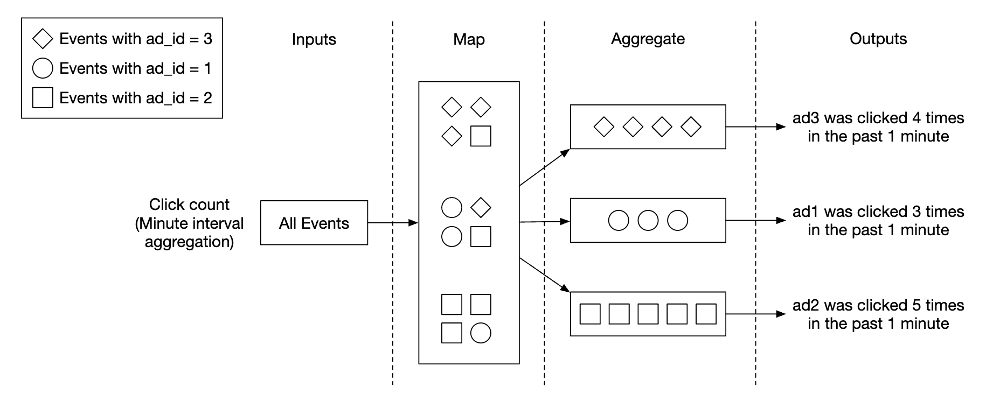
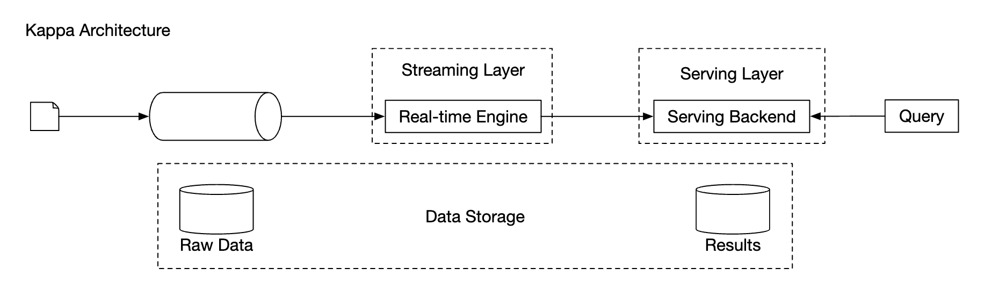
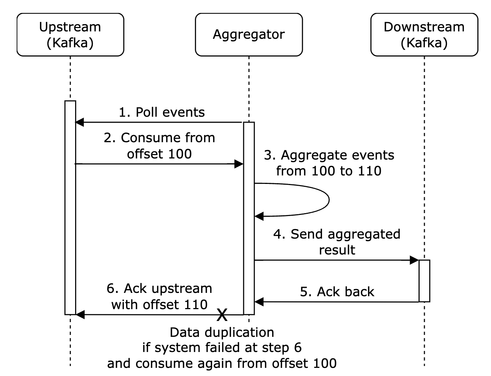
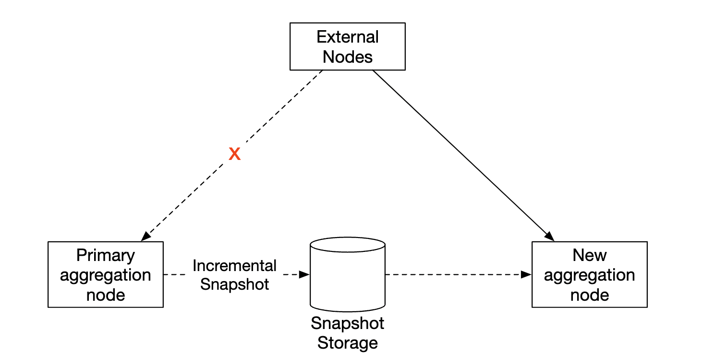

# 第 21 章：广告点击事件聚合

> 原章节：Ad Click Event Aggregation · 原项目路径 `21. Ad Click Event Aggregation/`

## 本章导读

你在刷短视频时看到的每一条广告，背后都有一笔真实的钱在流动。广告主按点击付费，平台按点击收费——那么问题来了：**谁来数这些点击？**

一天 10 亿次点击，峰值每秒 5 万次，还要按广告、按分钟、按国家、按用户维度聚合出来。更麻烦的是：网络会延迟，事件会乱序到达，节点会宕机，消息会重复投递。而你数错一个百分点，可能就是几百万美元的账目差异。

这一章讲的就是这样一套系统：**广告点击事件聚合（Ad Click Event Aggregation）**。它是全书最典型的「大数据处理系统」，也是第一次正式引入流处理（Stream Processing）的完整概念体系——事件时间、水位线、窗口、投递语义、对账。这些概念在后面任何一道大数据题目里都会反复出现。

## 你将学到

- 广告点击系统的业务背景：为什么数据准确性直接等于钱
- 原始数据与聚合数据各自的价值，以及为什么两者都要存
- 用消息队列 + MapReduce/DAG 把无限流拆成可扩展的处理管线
- 流处理与批处理的本质区别，以及 Lambda、Kappa 两种架构的演进逻辑
- **时间语义**：事件时间、处理时间、水位线、迟到数据，这一整套概念怎么配合
- 四种窗口（滚动、滑动、会话、全局）的区别与选型
- 三种投递语义，以及**为什么广告点击必须做去重**、怎么做、去重窗口开多久
- Flink 如何用检查点 + 两阶段提交实现端到端的恰好一次
- 对账（Reconciliation）机制：流式结果与离线结果比对，差异超阈值就告警

---

## 1. 业务背景与需求澄清

### 数字广告与实时竞价

**数字广告（Digital Advertising）** 是 Facebook、Google、TikTok 这类公司的核心收入来源。它有一套关键机制叫**实时竞价（Real-Time Bidding，RTB）**：当用户打开一个页面、准备加载广告位时，平台会把这一个「广告曝光机会」拿去拍卖——在**几百毫秒之内**，多个广告主出价，价高者得，广告立刻渲染出来。

<div align="center"></div>

RTB 有两个硬性特征：

1. **快**：整个过程通常要在一秒内完成。慢了广告位就浪费了。
2. **准**：出价依据是「这个用户大概会点吗」。而判断依据，正是历史点击数据。

所以，广告点击事件聚合系统产出的数据，直接喂给 RTB 的定价模型，也直接用来给广告主**结算账单**。

> **为什么这决定了整套架构？**
> 因为「准」这个要求会把很多在别的系统里可以妥协的设计全部堵死。比如消息队列的「至少一次投递」在大多数业务里够用（重复一条日志无所谓），但在这里不行——重复计费等于多收广告主的钱，这是商业欺诈级别的错误。这一章后面所有的复杂度，几乎都源于这一条。

### 需求澄清（Step 1）

面试第一步永远是问清楚边界。原文给出的对话值得完整过一遍：

| 提问 | 回答 |
|---|---|
| 输入数据长什么样？ | 每天 10 亿次点击，总共 200 万条广告，点击量年增 30% |
| 要支持哪些查询？ | ① 广告 X 在过去 Y 分钟的点击数；② 过去 1 分钟内点击最多的 Top 100 广告；③ 上述查询要支持按 `ip`、`user_id`、`country` 过滤。聚合粒度是每分钟 |
| 有哪些边界情况？ | 事件可能迟到、可能重复、系统可能部分宕机需要恢复 |
| 延迟要求？ | 端到端几分钟可接受（用于计费和报表）。但 RTB 要求亚秒级 |

这里有一个很重要的信号：**面试官主动提醒了「迟到」「重复」「故障恢复」三件事**。这三件事就是本章的全部难点，也是你要主动展开的地方。

#### 功能需求

- 聚合过去 Y 分钟内每个 `ad_id` 的点击数
- 每分钟返回点击量最高的 100 个 `ad_id`
- 支持按不同属性过滤聚合结果
- 数据规模为 Facebook / Google 级别

#### 非功能需求

- **正确性**：结果用于 RTB 和广告计费，不能出错
- **正确处理延迟与重复事件**
- **健壮性**：能扛住部分节点故障
- **延迟**：端到端最多几分钟

### 量级估算

| 指标 | 计算 | 结果 |
|---|---|---|
| 日活用户 | 题设 | 10 亿 |
| 每人每天点击广告数 | 假设 1 次 | 10 亿次/天 |
| 平均写入 QPS | 10⁹ ÷ 86400 秒 | **约 10,000** |
| 峰值 QPS | 平均值 × 5 | **约 50,000** |
| 单条点击存储 | 题设 | 0.1 KB |
| 每日存储 | 10⁹ × 0.1 KB = 10⁸ KB | **100 GB/天** |
| 每月存储 | 100 GB × 30 | **约 3 TB/月** |

这里有一个反直觉的结论值得单独说：**这是一个写入密集（Write-Heavy）的系统**。

10,000 QPS 的写入、每月 3 TB 的增量，但读取量很低——因为原始数据主要是出问题时用来回溯的。这个读写比例直接决定了后面的存储选型。

---

## 2. 高层设计（Step 2）

### 查询 API 设计

API 是客户端和服务端之间的契约。这里的「客户端」是数据看板的使用者：数据分析师、广告主、运营。

**接口一：查询某广告在过去 M 分钟的聚合点击数**

```
GET /v1/ads/{:ad_id}/aggregated_count
```

| 参数 | 含义 |
|---|---|
| `from` | 起始分钟，默认「当前时间 - 1 分钟」 |
| `to` | 结束分钟，默认「当前时间」 |
| `filter` | 过滤策略标识，例如 `001` 表示「非美国地区点击」 |

响应包含 `ad_id` 和该时间区间内的 `count`。

**接口二：查询过去 M 分钟内点击最多的 Top N 广告**

```
GET /v1/ads/popular_ads
```

| 参数 | 含义 |
|---|---|
| `count` | Top N 中的 N |
| `window` | 聚合窗口大小（分钟） |
| `filter` | 过滤策略标识 |

> **注意 `filter` 的设计手法**：它不是把过滤条件一个个传进来，而是传一个**预定义策略的编号**。为什么？因为过滤条件如果任意组合，查询就没法提前优化；而预定义成有限个编号后，聚合服务可以**提前把每种过滤组合都算好**。这是本章第 4 节「星型模型」的伏笔。

### 数据模型

系统里有两类数据：**原始数据（Raw Data）** 和**聚合数据（Aggregated Data）**。

原始数据长这样：

```
[AdClickEvent] ad001, 2021-01-01 00:00:01, user1, 207.148.22.22, USA
```

结构化表示：

| ad_id | click_timestamp | user | ip | country |
|---|---|---|---|---|
| ad001 | 2021-01-01 00:00:01 | user1 | 207.148.22.22 | USA |
| ad001 | 2021-01-01 00:00:02 | user1 | 207.148.22.22 | USA |
| ad002 | 2021-01-01 00:00:02 | user2 | 209.153.56.11 | USA |

聚合数据长这样：

| ad_id | click_minute | filter_id | count |
|---|---|---|---|
| ad001 | 202101010000 | 0012 | 2 |
| ad001 | 202101010000 | 0023 | 3 |
| ad001 | 202101010001 | 0012 | 1 |
| ad001 | 202101010001 | 0023 | 6 |

`filter_id` 指向一张过滤策略字典表：

| filter_id | region | IP | user_id |
|---|---|---|---|
| 0012 | US | * | * |
| 0013 | * | 123.1.2.3 | * |

`*` 表示「该维度不限制」。这样一条聚合记录就同时服务了多种过滤查询。

另外还需要一张表来支撑「Top N」查询：

| 字段 | 类型 | 含义 |
|---|---|---|
| `window_size` | integer | 聚合窗口大小 M（分钟） |
| `update_time_minute` | timestamp | 最后更新时间（分钟粒度） |
| `most_clicked_ads` | array | 广告 ID 列表（JSON 格式） |

> **为什么要单独存 Top N？**
> 因为「求 Top N」和「求某个广告的计数」是两种完全不同的查询模式。前者需要全局排序，后者只需要点查。提前把 Top N 算好存下来，查询就变成了一次点查，而不是每次都对全量数据排序。**预计算换查询速度**，这是大数据系统里最常见的一类交易。

#### 原始数据 vs 聚合数据

| 维度 | 原始数据 | 聚合数据 |
|---|---|---|
| 数据量 | 大（每月 3 TB） | 小（压缩比极高） |
| 查询速度 | 慢 | 快 |
| 信息完整度 | 完整，支持任意维度过滤和重算 | 有损，只保留了预设维度 |
| 用途 | 调试、回溯、回填 | 看板、报表、告警 |

**结论是两者都要存**，各司其职：

- 原始数据保留下来用于**调试**。如果聚合逻辑有 bug，可以定位并**回填（Backfill）**。
- 聚合数据用于**快速查询**。
- 原始数据可以放到**冷存储（Cold Storage）**（如 S3、HDFS）里，降低存储成本。

> 这个「热数据放快存储、冷数据放慢存储」的分层思路，是所有数据系统的通用套路。初学者常犯的错是：为了省钱把原始数据删了。等到发现聚合算错了，你没有原始数据可以重算——这是灾难。

#### 数据库选型

选型前先问四个问题：

1. 数据是什么形态？关系型、文档型还是二进制大对象？
2. 负载是读多、写多还是读写都多？
3. 需要事务吗？
4. 查询依赖 `SUM`、`COUNT` 这类 OLAP 函数吗？

**原始数据的结论**：平均 10k QPS、峰值 50k QPS，典型写入密集。关系型数据库能做，但**写入扩展很吃力**。更合适的是 **Cassandra** 或 **InfluxDB**，它们对高写入负载有原生支持。

> 另一个选项是 **Amazon S3 + 列式格式（ORC / Parquet / AVRO）**。原文说「因为这套配置大家不熟悉，所以我们还是用 Cassandra」——这个理由在面试里是成立的：**用你讲得清楚的方案，而不是用最时髦的方案**。面试考察的是你的推理过程，不是你的技术栈清单。

**聚合数据的结论**：既是读密集（看板和告警不断查询），也是写密集（每分钟写入一批聚合结果）。所以同样选 Cassandra。

### 高层架构

<div align="center"></div>

数据的输入和输出都是**无界数据流（Unbounded Data Stream）**——它永远不会「结束」，一直有新事件进来。

为了避免**同步汇聚（Synchronous Sink）**——即消费者崩了就把整个系统卡住——我们用**消息队列（Kafka）**做异步解耦。

<div align="center"></div>

系统里有两个消息队列：

**队列一：广告点击事件**

| ad_id | click_timestamp | user_id | ip | country |
|---|---|---|---|---|

**队列二：聚合结果**，包含每分钟的点击计数

| ad_id | click_minute | count |
|---|---|---|

以及每分钟的 Top N

| update_time_minute | most_clicked_ads |
|---|---|

<div align="center"></div>

**为什么要有第二个队列？** 为了实现端到端的**恰好一次原子提交（Exactly-Once Atomic Commit）**。这里先埋个引子，第 7 节会展开讲。

> **原文这里有一处用词要注意**：它写的是「exactly-once atomic commit semantics」。严格来说，Kafka 本身提供的是**原子提交**（offset 与输出结果同生共死），而「恰好一次」是一个**端到端**的性质，需要链路上每一环配合。这个区别在第 7 节会讲清楚。

---

## 3. 用 MapReduce 做聚合

聚合服务适合用 **MapReduce** 框架来做：

<div align="center"></div>

<div align="center"></div>

每个节点只负责一件小事，把处理结果交给下游节点。

- **Map 节点**：从数据源读取，做过滤和转换。例如按 `ad_id` 把数据分发到不同的聚合节点：

<div align="center"></div>

- **Aggregate 节点**：在内存中按 `ad_id` 每分钟统计一次点击事件。
- **Reduce 节点**：收集各 Aggregate 节点的结果，产出最终结果：

<div align="center"></div>

这套结构叫 **DAG（有向无环图）模型**：大数据被拆到多个节点上并行计算，最终收敛成常规大小的结果。DAG 模型里，**中间数据存在内存中**，节点之间用 TCP 或共享内存通信。

### 为什么需要一个独立的 Map 节点？

原文这里提出了一个很好的问题：既然 Kafka 本身就能分区，为什么不直接让聚合节点按 `ad_id` 订阅对应的分区？

答案是 Map 节点提供了两个 Kafka 给不了的能力：

1. **清洗与转换（Sanitize / Transform）**：在进入聚合前做数据校验、字段补全、格式统一。
2. **重新分区**：**我们无法控制上游怎么写数据**。上游可能把同一个 `ad_id` 的事件打散到了不同分区。Map 节点可以强制按 `ad_id` 重新分发，保证同一个广告的事件落到同一个聚合节点。

> 第 2 点在生产里极其常见。上游是客户端 SDK，它只知道「尽快发出去」，不关心分区键。所以**在管道里插一层「重分区」节点几乎是标配**。

### 三个用例

**用例一：聚合点击数**

<div align="center"></div>

广告按 `ad_id % 3` 分区（示例里 3 个聚合节点）。

**用例二：返回 Top N 点击广告**

<div align="center"></div>

每个节点维护一个**堆（Heap）**结构，用于快速取 Top N。示例算的是 Top 3，扩展到 Top N 只是改个参数。

> **为什么用堆而不是排序？** 求 Top N 不需要全排序。用大小为 N 的最小堆，遍历一遍数据即可，时间复杂度 O(M log N)（M 是数据量），空间只需要 O(N)。如果数据量是几千万，全排序的开销是不可接受的。

**用例三：数据过滤**

为了支持快速过滤，可以预定义过滤条件并**预聚合**：

| ad_id | click_minute | country | count |
|---|---|---|---|
| ad001 | 202101010001 | USA | 100 |
| ad001 | 202101010001 | GPB | 200 |
| ad001 | 202101010001 | others | 3000 |
| ad002 | 202101010001 | USA | 10 |
| ad002 | 202101010001 | GPB | 25 |
| ad002 | 202101010001 | others | 12 |

原文把这个技术称为**星型模型（Star Schema）**，把过滤字段称为**维度（Dimension）**。它的好处是：

- 简单易懂、易于构建
- 现有的聚合服务可以复用，用来生成更多维度
- 基于过滤条件的查询很快，因为结果是**预先算好的**

局限是：会产生**大量桶（Bucket）和记录**，尤其是过滤维度很多的时候。

> **这里要补充一个重要的成本估算**：如果维度组合是笛卡尔积，记录数会爆炸。假设有 5 个维度、每个维度 3 个取值，那就是 3⁵ = 243 种组合。原本 1 条记录变成 243 条。**这就是「预聚合」的代价：用存储空间和写入放大换查询速度。** 实践中要限制维度的数量和基数，只预聚合高频查询的组合。

---

## 4. 流处理 vs 批处理：Lambda 与 Kappa

### 三类系统的对比

| | 在线服务系统（Online） | 批处理系统（Batch） | 流处理系统（Streaming） |
|---|---|---|---|
| 响应性 | 快速响应客户端 | 不需要响应客户端 | 不需要响应客户端 |
| 输入 | 用户请求 | **有界**输入，数据量大 | **无界**输入（无限流） |
| 输出 | 响应给客户端 | 物化视图、聚合指标 | 物化视图、聚合指标 |
| 性能指标 | 可用性、延迟 | 吞吐量 | 吞吐量、延迟 |
| 典型例子 | 电商网站 | MapReduce | Flink |

这张表最核心的一行是**输入**：

- **有界（Bounded）**：数据是有限的、能读完的。比如「昨天的全部日志」。批处理的前提就是数据能读完。
- **无界（Unbounded）**：数据永远不结束。广告点击流就是这样——你今天算完了，明天还有，永远没有「读完」的那一刻。

> **这是理解流处理的钥匙**：批处理之所以能排序、能全局统计、能反复重算，是因为它知道「数据到头了」。流处理没有这个奢侈，它必须在数据还在流动的时候给出结果。**所有流处理的复杂性，本质上都是在回答「我怎么知道现在可以出结果了？」**——这个问题正是第 5 节「水位线」要解决的。

### Lambda 架构

**Lambda 架构**的核心思想是：**同时跑两条处理路径**。

<div align="center"></div>

它由三层构成（注意：原文只提了「两条路径」，漏掉了服务层，这是它的一个缺失）：

| 层 | 职责 |
|---|---|
| **批处理层（Batch Layer）** | 处理全量历史数据，产出**准确但延迟高**的结果 |
| **流处理层（Speed Layer）** | 只处理最近的数据，产出**实时但可能不精确**的结果 |
| **服务层（Serving Layer）** | 合并两层结果对外提供查询 |

**为什么会有 Lambda？** 因为早年的流处理引擎（如早期的 Storm）**做不到精确一次、也处理不好乱序和迟到数据**。于是工程上的妥协是：用批处理保证最终正确性（T+1 重算一遍全量，覆盖掉流式的近似结果），用流处理保证实时性（先给个大概的答案）。

**Lambda 的致命缺点**：两条路径意味着**两套代码**。业务逻辑一旦变更（比如「排除机器人点击」的规则改了），你必须用完全相同的逻辑改两遍——一份在批处理代码里，一份在流处理代码里。两份代码一旦不一致，就会产生**永远对不上的数据**，而且极难排查。

> 这是真实世界里踩过的坑：很多公司的报表数据「实时看是一个数、第二天看又是另一个数」，根因往往就是 Lambda 两套代码的逻辑漂移。

### Kappa 架构

**Kappa 架构**的提出就是为了干掉这个双份代码的问题：

<div align="center"></div>

**核心思想**：**只保留一套流处理引擎**。

那历史数据重算怎么办？答案是**重放（Replay）**：

1. 消息队列（Kafka）**长期保留**原始事件日志（比如保留 7 天、30 天，甚至永久）。
2. 需要重算时，把消费者 offset **重置到过去某个位置**，用**同一套代码**重新消费一遍。
3. 新结果写入一个**新的结果表/视图**，算完后再切换过去。

**Kappa 的关键判据是「只有一套代码、一个引擎」**，而不是「没有批处理」。批处理被重新定义成了「一次有界范围的重放」。

**为什么现在主流倾向 Kappa / 流批一体？** 三个原因：

1. **引擎能力补齐了**：Flink、Spark Structured Streaming 这些现代引擎已经能处理乱序、迟到数据，并支持端到端精确一次。Lambda 存在的理由（流处理不够准）消失了。
2. **维护成本减半**：一套代码，一个团队，逻辑不会漂移。
3. **需求变化快**：业务规则天天改，每次都要改两套代码是不可持续的。

**流批一体（Unified Batch and Streaming）** 是更进一步的目标：用**同一个引擎、同一套 API**，既能处理有界数据（批），也能处理无界数据（流）。Flink 的 DataStream API 和 Table API 就在往这个方向走——同一段 SQL 既可以跑在历史数据上，也可以跑在实时流上。

> **什么时候 Lambda 仍然是合理选择？**
> 当你的批处理逻辑依赖极其复杂的机器学习模型、或者依赖只有批处理生态才有的库（比如某些 pandas / scikit-learn 的流程）时，硬要塞进流处理引擎反而更痛苦。**架构选择永远是权衡，不是站队。**

### 原文对本系统架构的判断

原文说：「我们的高层设计使用 Kappa 架构，因为历史数据的重算也走聚合服务」，并给出了重算流程：

<div align="center"></div>

1. **重算服务**从原始存储中读取数据（这是一个批任务）。
2. 读到的数据发送给一个**专用的聚合服务**，这样**不影响实时处理的聚合服务**。
3. 聚合结果写入第二个消息队列，然后更新聚合数据库。

**这个判断值得商榷，我们在勘误里详细讨论。** 简单说：这套设计里「重算」是从冷存储（S3/HDFS）读的批任务，而且走的是独立部署的服务实例——这更接近 Lambda 的批处理层，而不是 Kappa 的「重放日志」。不过它符合 Kappa 的精神内核（**复用同一套聚合代码**），所以原文的说法也不能算错，只是表述不严谨。

---

## 5. 时间语义：本章最大的难点

这一节是整章的核心。原文只用了半页纸讲「时间」，概念体系是不完整的。我们把它补完整。

### 事件时间与处理时间

要给数据做「按分钟聚合」，你得先回答一个问题：**这一分钟，是从哪个时钟读出来的？**

- **事件时间（Event Time）**：事件**实际发生**的时刻。也就是用户真正点下广告的那一秒。这个时间通常由客户端打上，或者由第一台接收的服务器打上。
- **处理时间（Processing Time）**：**服务器处理这条事件**时的系统时钟。

**这两个时间可能差很多。** 原文给出了两个原因：异步处理（消息队列）和网络延迟。

设想一条链路：手机 → 边缘节点 → Kafka → 聚合服务。每一跳都有排队和重试。如果某个 Kafka 分区出现积压，事件可能延迟几分钟甚至几小时才被处理。

<div align="center"></div>

这张图信息量很大，值得逐条读：

- **事件时间轴**：事件 1~5 分别在约 10s、35s、55s、125s、165s 发生。
- **处理时间轴**：同一批事件到达聚合服务的时间是约 40s、69s、79s、139s、185s。**注意事件 2 迟到了 34 秒。**
- **窗口**：窗口 1 覆盖事件时间 [0, 60)，窗口 2 覆盖 [60, 120)，窗口 3 覆盖 [120, 180)。

问题出在哪？**事件 2 的事件时间（35s）属于窗口 1，但它在处理时间 69s 才到达，而窗口 1 已经在 60s 关闭了。** 这条事件被漏掉了。同理事件 5 也漏掉了。

**两种时间各自的取舍：**

| | 优点 | 缺点 |
|---|---|---|
| **事件时间** | 聚合结果**准确**（事件落在它真正发生的那个窗口） | 客户端时钟可能不准；时间戳可能被恶意用户伪造 |
| **处理时间** | 服务器时钟**可靠**，不受客户端影响 | 事件一迟到，结果就不准 |

原文的结论是：**因为数据准确性重要，所以用事件时间**。

> **这个结论是对的，但推理可以更完整。**
> 用事件时间，意味着你必须处理「乱序」和「迟到」——因为事件到达顺序和发生顺序不一致。这是用**工程复杂度**换**正确性**。
> 用处理时间，你得到的是「服务器在 10:00 到 10:01 之间收到了多少条点击」，而不是「用户在 10:00 到 10:01 之间点了多少次广告」。**这两个指标在计费场景下是完全不同的东西**——前者会因为网络抖动而漂移，后者才是广告主该付的钱。
> 顺便说一句：事件时间被伪造的风险是真实存在的（刷点击的黑产会伪造时间戳），但这属于**风控（Risk Engine）**的职责，不应该靠「改用处理时间」来规避——那等于把脏数据的问题换成了数据不准的问题。

### 水位线（Watermark）

既然选了事件时间，就要面对迟到事件。原文介绍的机制叫**水位线（Watermark）**。

**水位线的定义**：一条声明「**我认为事件时间早于 T 的数据不会再来了**」的进度信号。

它不是一个「时间点」，而是一个**单调递增的进度标记**，通常由数据流本身携带（比如「当前已观察到的事件时间最大值减去 5 秒」）。

**窗口什么时候触发计算？** 当水位线**越过窗口的结束时间**时，窗口关闭并触发计算。

回到上图，原文给出的解法是「**刻意延长聚合窗口**」：

<div align="center"></div>

图中的粉色部分是延长出来的部分：

- 窗口 1 从 60s 延长到约 75s，**收留了事件 2**（它在 69s 到达）。
- 窗口 3 从 180s 延长到约 195s，**收留了事件 5**（它在 185s 到达）。

**这里有一个取舍：**

- **水位线设短**：漏掉的事件多，但结果出得快（延迟低）。
- **水位线设长**：漏掉的事件少，但结果出得慢（延迟高）。

原文说：「无论水位线设多大，总有可能漏掉事件，但为这种低概率事件做优化没有意义。我们可以改为在**日终对账**时修正这些不一致。」

这个工程判断是对的。**你不可能为了等一条迟到三小时的广告点击，就让今天的账单晚三小时出。** 迟到到离谱的事件，交给 T+1 的对账流程兜底。

> **注意：原文把「延长窗口」这件事本身称为 watermark，这个说法不严谨。** 详见勘误 1。这里先记住正确的关系：
> **水位线决定窗口何时关闭；「允许迟到时间」决定窗口关闭后还能收多久的数据。**

### 迟到数据的完整处理流程

一个工业级的流处理作业，处理迟到数据是分层的。以 Flink 为例：

```
第一层：正常窗口计算
  水位线越过窗口结束时间 → 触发计算 → 输出结果

第二层：允许迟到（Allowed Lateness）
  窗口触发后不立即销毁，继续保留一段时间（比如 1 分钟）
  迟到的事件到达 → 再次触发计算 → 输出「修正后的结果」（一个更新消息）

第三层：侧输出流（Side Output）
  超过允许迟到时间才到达的事件 → 不丢弃，写到一条单独的「迟到数据流」
  这条流可以：写入死信表人工排查 / 送入对账流程 / 单独统计迟到率
```

**为什么第二层要输出「更新」而不是覆盖？** 因为下游可能已经读了旧结果。正确做法是输出一个带版本或带窗口标识的更新记录，让下游做**幂等更新（Upsert）**——同一个窗口的重复更新，最终结果一致。

**为什么要有第三层？** 因为「丢弃」是最坏的选择。你至少要知道**丢了多少**。侧输出流的迟到率是一个非常重要的监控指标——如果迟到率突然从 0.1% 涨到 5%，说明上游某个环节出问题了，这比数据本身更值得关注。

> **一个反直觉的点**：很多人以为「水位线设长一点就万无一失」。错。水位线只解决「按时间顺序乱序」，不解决「某台机器卡了十分钟然后一次性吐出十万条数据」。**水位线是一种估计，不是一种保证。** 任何声称「用水位线可以做到零丢失」的说法都是错的——零丢失只能靠「无限等待」（不可接受）或「对账兜底」。

### 一个具体的参数怎么定

面试官很可能会追问：「你怎么定水位线的长度？」

一个可操作的思路：

1. **先测量**：在链路里打点，统计「处理时间 - 事件时间」这个差值的**分布**（P50、P95、P99、P99.9）。
2. **再定水位线**：取 P99 作为水位线长度。这意味着 99% 的事件能被正确归入窗口。
3. **剩余 1% 交给允许迟到 + 侧输出 + 日终对账**。
4. **持续监控**：把这个分布做成监控指标，上游变化时及时调整。

**核心思想**：不要凭感觉设一个「5 秒」或「1 分钟」，要用**分布**说话。这和后面第 20 章讲尾延迟（Tail Latency）的思路是一模一样的。

---

## 6. 窗口（Window）

**窗口（Window）** 是把无界流切成有界片段的机制。没有窗口，你就没法对无限流做聚合——因为你永远等不到「全部数据」。

原文列了四种窗口，我们把它讲清楚。

<div align="center"></div>

**① 滚动窗口（Tumbling Window）**

固定长度、**首尾相接、互不重叠**。比如每 1 分钟一个窗口：[0:00, 1:00)、[1:00, 2:00)、[2:00, 3:00)。

- **特点**：每条事件**只属于一个**窗口。
- **适用**：本章的「每分钟点击计数」。因为计费要求「一条点击只能算一次」，滚动窗口天然满足这个约束。

<div align="center"></div>

**② 滑动窗口（Sliding Window）**

固定长度，但**按固定的滑动步长向前推进**，所以窗口之间**可以重叠**。比如「长度 5 分钟、每 1 分钟滑动一次」。

- **特点**：一条事件**可能属于多个**窗口（重叠次数 = 窗口长度 ÷ 滑动步长）。
- **适用**：本章的「过去 M 分钟内点击最多的 Top N」。因为这里的语义是「滚动统计最近 M 分钟」，同一分钟的数据出现在多个窗口里是**符合预期的**。
- **代价**：重叠意味着**存储和计算量成倍增加**。窗口 5 分钟、滑动 1 分钟，每条事件会被处理 5 次。

> **注意**：原文把 **Hopping Window（跳跃窗口）** 和 **Sliding Window（滑动窗口）** 列成了两种不同类型的窗口，这是不准确的。详见勘误 3。简单说：**Flink 叫它 Sliding Window，Azure Stream Analytics 叫它 Hopping Window，它们是同一个东西。**

**③ 会话窗口（Session Window）**

按「活动间隙」切分，**长度不固定**。当一段时间内没有新事件时，窗口关闭。比如用户连续点击广告，间隔不超过 30 秒算作一次「会话」，超过 30 秒就开一个新会话。

- **适用**：分析用户行为序列（一次会话里看了几个广告、点了几个）。
- **不适用**：本章的按分钟计费——因为会话窗口的边界不确定，没法对齐到「分钟」。

**④ 全局窗口（Global Window）**

所有数据归入**同一个**窗口，永不关闭。看起来没用，但它需要配合**触发器（Trigger）**使用，比如「每 1000 条数据输出一次」。是自定义窗口逻辑的底层原语。

### 选型速查

| 窗口类型 | 长度 | 重叠 | 典型用途 |
|---|---|---|---|
| 滚动 Tumbling | 固定 | 不重叠 | 定期报表、按分钟计费 |
| 滑动 Sliding | 固定 | 可重叠 | 最近 N 分钟趋势、Top N |
| 会话 Session | 不固定 | 不重叠 | 用户行为分析 |
| 全局 Global | 无限 | — | 自定义触发器 |

> **一个容易踩的坑**：窗口的长度和滑动步长不要设成没有公约数的奇怪数字（比如长度 7 分钟、滑动 3 分钟）。这会让窗口边界难以对齐，调试时非常痛苦。**优先选能被整除的组合**（5 分钟 / 1 分钟），并且**窗口长度应该是滑动步长的整数倍**——否则会出现「某些时间段的数据完全不被任何窗口覆盖」的漏洞。

---

## 7. 投递语义与数据去重

### 三种投递语义

| 语义 | 含义 | 代价 |
|---|---|---|
| **至多一次（At-Most-Once）** | 消息可能丢，但绝不重复 | 最省事，但会丢数据 |
| **至少一次（At-Least-Once）** | 消息不丢，但可能重复 | 需要去重 |
| **恰好一次（Exactly-Once）** | 不丢也不重 | 成本最高 |

原文的判断是：**大多数场景下「至少一次」就够了**——重复一条日志、多发一次通知，业务上无所谓。

**但广告计费不行。** 原文说得非常直接：**「小百分比的差异可能导致几百万美元的账目差异」**。

我们来算一下这个「几百万」是怎么来的：

- 每天 10 亿次点击。
- 假设 CPC（单次点击成本）是 0.5 元。
- 一天的广告流水 = 10 亿 × 0.5 元 = **5 亿元**。
- 如果重复计费 0.1%，就是 100 万次重复点击，**多收 50 万元**。
- 如果重复率到 1%，**多收 500 万元**。

**这就是为什么本章必须实现恰好一次。**

> 补充一个真实世界的背景：广告行业的重复点击和无效点击（IVT, Invalid Traffic）是一个每年涉及数十亿美元的问题。行业组织（如 MRC、IAB）有专门的标准来定义「什么算一次有效曝光/点击」，并且要求第三方审计。**所以「去重」在这里不是技术洁癖，是合规要求。**

### 数据为什么会重复

原文列了两类来源：

1. **客户端（Client-Side）**：客户端可能重发同一个事件。网络超时后重试、用户狂点、或者**恶意刷量**。原文特别指出：**恶意重复应该交给风控引擎（Risk Engine）处理**，不要试图在聚合层识别。
2. **服务端故障（Server Outage）**：聚合节点在处理过程中挂掉，上游没收到确认（ack），于是重发。

原文举了一个「最后一跳确认失败导致重复」的例子：

<div align="center"></div>

在这个例子里，**offset 100 会被处理并向下游发送多次**。

**三种处理方案，原文的推进逻辑是：**

**方案 A：把「最后处理的 offset」存在 HDFS/S3**

<div align="center"></div>

**问题**：如果先写 offset 再处理数据，那么「offset 写成功但处理失败」时，这条数据就**永远不会被处理**了——结果永远到不了下游。这是把「重复」换成了「丢失」，更糟。

**方案 B：offset 与下游写入原子化**

<div align="center"></div>

要同时保证「offset 更新」和「结果写入下游」要么都成功、要么都失败，就需要一个**分布式事务**。

**方案 C（原文作者的补充）：让下游幂等**

> 原文的 Personal side-note 写得很到位：**「如果下游系统能幂等地处理聚合结果，就不需要分布式事务。」**
>
> 这句话是对的，而且是工业界的主流答案。**分布式事务很贵，幂等很便宜。** 只要下游的写入是「用同一个 key 重复写，结果不变」（比如 `UPSERT` 到 `(ad_id, click_minute)` 上），重复投递就自然被吸收了。

### 业务级去重：为什么广告点击必须去重

原文的「数据去重」一节其实只讲了**系统级的重复**（消息重投）。但面试官更想听的是**业务级的重复**：**同一个用户，点了同一个广告两次，该算几次？**

这个问题的答案取决于商业模式：

| 计费模式 | 含义 | 去重规则 |
|---|---|---|
| **CPC（按点击付费）** | 每次有效点击收费 | 同一用户对同一广告的重复点击，**通常只算一次** |
| **CPM（按千次曝光付费）** | 按展示次数收费 | 关注的是曝光去重 |
| **CPA（按转化付费）** | 按下单/注册等转化收费 | 关注转化去重 |

**为什么必须去重？** 因为：

1. **多收广告主的钱 = 商业欺诈。** 广告主付钱买的是「真实用户的一次点击」，不是「某个脚本刷的一万次」。重复计费一旦被发现，轻则退款赔偿，重则失去客户和牌照。
2. **污染模型。** 点击数据会喂给 RTB 的出价模型。重复数据会让模型高估某个广告的效果，导致预算错配。
3. **行业审计。** 大的广告主会用第三方（如 MRC 认证的审计机构）核对数据，对不上就要解释。

**什么是「重复」？** 这本身是个业务定义问题，需要和产品/法务对齐。常见规则：

- 同一 `user_id` + 同一 `ad_id`，在 **30 分钟内**只算一次（常见于 CPC）。
- 同一 `ip` + 同一 `ad_id`，在 **1 小时内**超过 N 次视为无效流量。
- 同一设备指纹的点击，按设备维度去重。

> **关键点：去重规则是业务规则，不是技术规则。** 技术方案要能灵活支持规则的调整——这就是为什么下面要讲「去重窗口」这个概念。

### 去重的三种实现方案

**方案一：布隆过滤器（Bloom Filter）**

**原理**：用一个位数组 + 多个哈希函数表示一个集合。插入时把 k 个哈希位置的位设为 1；查询时如果所有位都是 1，则「可能在集合中」，否则「一定不在」。

- **优点**：**极其省内存**。而且没有「假阴性」——说不存在就一定不存在。
- **缺点**：有**假阳性**——可能把没见过的 key 误判为已见过，导致**漏算一次点击**。且**不支持删除**。
- **适合**：**过滤**场景。即「先粗筛掉明显重复的」，剩下的再精确判断。

我们来算一下内存：

- 峰值 QPS = 50,000
- 去重窗口 = 1 小时 = 3,600 秒
- 需要记住的 key 数 = 50,000 × 3,600 = **1.8 亿个**
- 布隆过滤器在 1% 假阳性率下，每个元素约需 **9.6 bit**
- 内存 = 1.8 亿 × 9.6 bit = 17.3 亿 bit ≈ **216 MB**

**216 MB 就能覆盖 1 小时的去重窗口，而且单机就能扛。** 这就是布隆过滤器的威力。

**方案二：Redis SET / 精确集合**

用 `SADD ad:dedup:{ad_id} {user_id}:{click_id}` 加 `EXPIRE`，天然利用 Redis 的过期机制。

- **优点**：**精确**，无误判；实现简单；TTL 自动清理。
- **缺点**：**内存消耗大得多**。
  - 1.8 亿个 key，每个 key 假设 60 字节，加上 Redis 自身的对象开销（约 50~100 字节/条），实际占用 **约 20~30 GB**。
  - 是布隆过滤器的 **100 倍左右**。
- **优化技巧**：不要用 Redis String 存每个 key，用**紧凑的位图（Bitmap）**或 **RedisBloom 模块**。

> **对比结论**：
> - 追求极致内存效率 → 布隆过滤器（接受 1% 的漏算，事后靠对账修正）。
> - 追求精确、且预算充足 → Redis SET。
> - **实践中常见组合**：Redis 做精确去重（窗口短，比如 5 分钟）+ 布隆过滤器做长窗口粗筛。

**方案三：Flink 的键控状态（Keyed State）**

如果整个聚合逻辑都在 Flink 里，最自然的方式是用**键控状态**：按 `ad_id` 作为 key，在 state 里维护一个「已见过的 `click_id` 集合」。

- **优点**：状态由 Flink 统一管理，**随检查点（Checkpoint）一起持久化**，天然具备故障恢复能力。
- **缺点**：状态大小受限于内存和检查点开销，需要配置 **状态后端（State Backend）** 和 **TTL**。
- **关键配置**：Flink 的 `StateTtlConfig` 可以给状态设置 TTL，比如 30 分钟，超时自动清理。这和 Redis 的 `EXPIRE` 是同一个思路。

```java
// Flink 键控状态 + TTL 的示意（Java）
StateTtlConfig ttlConfig = StateTtlConfig
    .newBuilder(Time.minutes(30))
    .setUpdateType(StateTtlConfig.UpdateType.OnCreateAndWrite)
    .setStateVisibility(StateTtlConfig.StateVisibility.NeverReturnExpired)
    .build();

ValueState<Set<String>> seenClicks = getRuntimeContext()
    .getState(new ValueStateDescriptor<>("seen-clicks", ...));
seenClicks.enableTimeToLive(ttlConfig);
```

### 去重窗口该开多久？

这是原文没讲、但面试官很爱问的问题。核心是一个**内存与准确性的权衡**：

| 窗口太短 | 窗口太长 |
|---|---|
| 重复点击落在窗口外 → **漏去重**，多计费 | 内存/状态膨胀 → **OOM、检查点超时、成本飙升** |
| 好处：内存小 | 好处：去重更彻底 |

**怎么定？三条原则：**

1. **跟随业务规则**。如果业务定义是「同一用户 30 分钟内对同一广告只算一次」，那窗口就是 30 分钟——**技术窗口必须覆盖业务窗口**，短一分钟都是 bug。
2. **覆盖重试链路的最长时间**。上游客户端重试、消息队列重投、任务重启重放，这些系统级重复可能在**几分钟**后才出现。窗口至少要覆盖「最长重放时间」。
3. **用数据验证**。统计「重复事件的时间间隔分布」，取 P99.9 作为窗口大小。如果 99.9% 的重复都在 10 分钟内发生，那 30 分钟的窗口就是浪费。

> **一个实用的分层策略**（这是工程上的最佳实践，原文没有）：
> - **短窗口（分钟级）+ 精确结构**：Redis SET / Flink State，处理绝大部分重复。
> - **长窗口（小时/天级）+ 概率结构**：布隆过滤器，粗筛掉明显的刷量。
> - **日终对账**：用批处理重算，把残余的误差修正掉。
>
> 三层叠加，才能同时兼顾内存、延迟和准确性。

---

## 8. 扩展系统

系统有三个独立组件：**消息队列、聚合服务、数据库**。因为它们是解耦的，可以独立扩展。

### 扩展消息队列

- **生产者**：不设限制，可以随意扩展。
- **消费者**：放进**消费者组（Consumer Group）**，增加消费者数量即可。
- **前提**：必须**预先创建足够的分区**。这是关键——**消费者数量不能超过分区数**，多出来的消费者会闲置。所以分区数要在建 topic 时就规划好。
- **注意**：**消费者再均衡（Rebalance）在消费者上千时会很慢**，建议在业务低峰期做。因为 rebalance 期间整个消费者组会暂停消费（Stop-the-world）。
- **进阶**：可以按地域拆分 topic，如 `topic_na`、`topic_eu`，降低单 topic 的规模。

<div align="center"></div>

### 扩展聚合服务

<div align="center"></div>

- Map-Reduce 节点可以简单地**加节点**。
- 单节点吞吐可以通过**多线程**提升。
- 或者用 **Apache YARN** 这类资源管理器，走**多进程**路线。

原文的判断是：**方案一（多线程）更容易，方案二（多进程/资源管理器）在实践中更常用，因为扩展性更好。**

<div align="center"></div>

> **多线程 vs 多进程的取舍，值得多说一句**：
> - **多线程**：共享内存，通信零成本，但受单机 CPU/内存上限约束，且一个线程 OOM 会拖垮整个进程。
> - **多进程/容器**：隔离性好，能跨机扩展，是云原生的标准做法；代价是调度和通信开销。
> - **为什么原文说多进程更常用？** 因为大数据作业的瓶颈往往不是 CPU 而是**资源弹性**——流量涨 10 倍时，你需要的是「立刻多 10 倍的机器」，而不是「在一台机器上多开 10 个线程」。

### 扩展数据库

如果用的是 **Cassandra**，它**原生支持**基于一致性哈希的水平扩展：

- 新节点加入集群时，数据会自动在所有（虚拟）节点间**再均衡**。
- **不需要手动重新分片（Resharding）**。

<div align="center"></div>

> 这是 Cassandra 相对关系型数据库的核心优势：**扩容是运维动作，不是开发动作**。在 MySQL 上做分片，你需要自己处理路由、迁移、双写、切流，是一整个项目；在 Cassandra 上加节点，是加一台机器。

### 热点问题（Hotspot）

如果某个广告特别火，点击量远超其他广告，承载它的聚合节点就会过载：

<div align="center"></div>

原文给出的处理流程：

1. 过载的聚合节点向**资源管理器**申请额外资源。
2. 资源管理器分配更多资源，原节点不再过载。
3. 原节点把事件**拆成 3 组**，每个新聚合节点各处理 100 条。
4. 结果**写回原聚合节点**汇总。

**更高级的两种方案：**

- **全局-本地聚合（Global-Local Aggregation）**：也叫**两阶段聚合**。先在本地（每个并行实例内）做一次局部聚合，再把局部结果按 key 发到下游做全局合并。这样热点 key 的原始数据不需要全量走网络。
- **拆分去重聚合（Split Distinct Aggregation）**：给热点 key **加盐（Salting）**——把 `ad_001` 拆成 `ad_001_0` ~ `ad_001_9` 十个虚拟 key，分散到不同节点各自统计，查询时再相加。

> **这两招是同一个思想的两种形态：把「一个热点 key」拆成「多个不热的 key」，最后再合并。** 和第 1 章讲的「热点 key 加盐」完全一致——**系统设计里很多问题，最后都收敛到「拆开再合并」这个模式。**

---

## 9. 容错（Fault Tolerance）

聚合节点在**内存中**处理数据。节点一挂，内存里的中间结果就全没了。

**基础方案**：利用 **Kafka 的消费者 offset**，新节点接管时从上次提交的位置继续。

**但这里有个问题**：本章除了「计数」，还要维护「过去 M 分钟的 Top N」这类**中间状态**。光靠 offset 恢复不了这些状态。

**解决方案：定期做快照（Snapshot）**

<div align="center"></div>

节点按分钟粒度对「进行中的聚合」打快照。节点挂了之后，新节点读取**最新的已提交 offset** + **最新的快照**，继续干活：

<div align="center"></div>

> **这本质上就是 Flink 的检查点（Checkpoint）机制**。Flink 用 **Chandy-Lamport 算法**做分布式快照：在数据流里周期性插入一种特殊的「屏障（Barrier）」记录，每个算子收到屏障后把自己的状态快照到持久存储（HDFS/S3）。所有算子都完成快照后，这一次检查点就算成功。
>
> **恢复时**：作业从最近一次成功的检查点重启，每个算子恢复自己的状态，数据源（Kafka）的 offset 也一并恢复。**整个作业看起来就像从没挂过一样**——这就是 Flink 的「精确一次状态语义」的基础。

### 端到端恰好一次：检查点 + 两阶段提交

「状态不丢」还不够。你还要保证：**从检查点恢复后重新处理的数据，不会在下游产生重复**。

这就是原文提到的「第二个消息队列」和「原子提交」要解决的问题。Flink 的完整答案是：

```
① 检查点（Checkpoint）
   周期性把所有算子的状态快照到持久存储
   → 解决「状态不丢」

② 两阶段提交 Sink（Two-Phase Commit Sink）
   Flink 1.4+ 提供的 TwoPhaseCommitSinkFunction
   预提交（Pre-commit）：把结果写到一个「未提交」的位置（如 Kafka 事务、临时目录）
   提交（Commit）：当检查点完成时，才把结果真正对外可见
   → 解决「输出不重」

③ 幂等写入
   如果 Sink 天然幂等（如 UPSERT 到主键表），可以省掉两阶段提交
   → 最省事的方案
```

**举个具体例子**：Flink 写 Kafka 时，用 Kafka 的**事务（Transaction）**能力。Flink 开启一个 Kafka 事务写数据，但**不提交**；等到这次检查点完成，才提交事务。如果中间挂了，事务会被中止，未提交的数据对下游不可见。**这样下游看到的要么是完整的、要么是没有的，绝不会是重复的。**

> **和第 19 章（消息队列）的呼应**：第 19 章我们讲过「消息队列如何保证消息不丢」——生产者确认、Broker 持久化、消费者手动提交 offset。这里要补充的是：**「不丢」和「不重」是两个独立的性质**。
> - 只做「消费者手动提交 offset」→ 至少一次（可能重复）。
> - 手动提交 offset + 下游幂等 → 效果上等于恰好一次。
> - 手动提交 offset + 事务性 Sink + 检查点 → **真正的端到端恰好一次**。
>
> **面试时的标准回答顺序**：先问「下游是否幂等」，幂等是最便宜的解法；不幂等才上两阶段提交。

---

## 10. 数据监控与正确性

数据要用于计费，所以监控必须严格。

**要监控的指标：**

- **延迟（Latency）**：跟踪不同环节的时间戳，算出端到端延迟。
- **消息队列积压（Lag）**：积压突然上涨，说明需要加聚合节点。
  - **原文这里有一个很重要的纠正**：不要监控「队列长度」，因为 **Kafka 是一个分布式提交日志（Distributed Commit Log），不是传统队列**——消息被消费后不会立刻删除（而是按保留策略过期）。所以正确的指标是 **records-lag**，即「最新 offset 与消费者已提交 offset 之差」。
- **聚合节点的系统资源**：CPU、磁盘、JVM（GC 情况）等。

### 对账（Reconciliation）

原文提到要有一个**对账流程**：这是一个**批任务，每天结束时运行**。它从原始数据重新计算聚合结果，和聚合数据库里实际存的数据做对比：

<div align="center"></div>

**这是整章最容易被忽略、但在生产环境最重要的一环。** 我们把它讲透。

**为什么必须对账？** 因为前面所有的机制都有残留误差：

| 误差来源 | 是否可完全消除 |
|---|---|
| 迟到数据超出水位线 + 允许迟到时间 | 不能（只能靠对账修正） |
| 布隆过滤器的假阳性导致漏算 | 不能（概率性结构） |
| 上游客户端时钟错误 | 不能（不可控） |
| 消息队列的保留策略导致数据被删 | 不能（配置决定） |
| 聚合逻辑的 bug | 不能（你根本不知道有 bug） |

**对账的具体做法：**

1. **T+1 全量重算**：用批处理作业（Spark / Hive / Flink Batch）从冷存储的原始数据重新算一遍。
2. **逐维度比对**：按 `(ad_id, click_minute, filter_id)` 逐条比对，找出差异记录。
3. **分级告警**：
   - 差异率 **< 0.01%**：记录日志，不告警（正常波动）。
   - 差异率 **0.01% ~ 0.1%**：告警给值班工程师。
   - 差异率 **> 0.1%**：**触发账单冻结或人工复核流程**——因为这个量级的差异已经涉及真金白银。
4. **修正与回填**：把重算的结果写回聚合数据库（或单独存一张「修正表」，对外查询时以修正表为准）。

> **对账阈值怎么定？这必须和财务对齐。**
> 技术团队不能自己拍脑袋定「0.1% 就告警」。正确的做法是问业务方：**「如果账单差多少钱，你们需要人工介入？」** 把金额倒推成差异率。这是一个典型的**技术指标必须由业务指标驱动**的例子。

**对账的代价**：要跑全量重算，成本不低。所以实践中常用**抽样对账**（随机抽 1% 的广告做全量比对）+ **全量对账**（每周一次）的组合。

---

## 11. 替代方案

原文特别说明：**在通用的系统设计面试里，面试官不期望你了解大数据专用软件的内部实现。讲清楚推理过程和取舍，比知道具体工具更重要。**

一个基于现成工具（Off-the-shelf）的替代方案是：

- 广告点击数据存在 **Hive** 里
- 上面加一层 **Elasticsearch** 提供快速查询
- 聚合用 **OLAP 数据库**，如 **ClickHouse** 或 **Druid**

<div align="center"></div>

> **这个替代方案值得展开一点，因为它是国内很多公司的真实做法：**
>
> - **Hive**：廉价的海量存储 + 批处理，适合做原始数据仓库和对账。缺点是查询延迟分钟级到小时级。
> - **Elasticsearch**：倒排索引，适合**按维度筛选**（「找出所有 country=US 且 ad_id=xxx 的记录」）。但**不擅长聚合分析**——ES 的聚合在数据量大时内存压力很大。
> - **ClickHouse / Druid**：**列式存储 + 预聚合**，专为 OLAP 设计。ClickHouse 单表聚合可以做到每秒上亿行的扫描速度，非常适合「按任意维度聚合点击量」这类查询。
>
> **选型经验**：如果需求是「固定几个维度的实时看板」，用 Druid（它的预聚合模型天然契合）；如果是「分析师自由探索、SQL 随意写」，用 ClickHouse（更接近标准 SQL，灵活度高）。**但两者都不适合做计费的唯一数据源**——计费还是要走批处理 + 对账。

---

## 勘误与补充

> 本节逐条指出原笔记中不准确、过时或缺失的地方。

### 勘误 1：把「允许迟到时间」误称为水位线（Watermark）

- **原文说法**：「如果我们刻意延长聚合窗口，就能降低漏掉事件的概率。**窗口延长出来的部分就叫做 watermark（水位线）**。」
- **问题**：这个定义是**错的**。水位线不是一个「时间段的长度」，而是**一个进度信号**——它表示「我认为事件时间早于 T 的事件不会再来了」。原文描述的「把窗口往后延长一段」在流处理里有一个专门的、不同的名字：**允许迟到时间（Allowed Lateness）**。
  这两者的职责完全不同：
  - **水位线**决定「窗口**何时**触发计算」。
  - **允许迟到时间**决定「窗口触发之后，**还能不能**继续接收数据、以及还能收多久」。
- **正确说法**：
  - 水位线 `W(t)` 是一条单调递增的标记，表示「事件时间 ≤ t 的数据预计已经全部到达」。当水位线越过窗口结束时间时，窗口触发计算。
  - 允许迟到时间是在窗口触发**之后**附加的宽限期。在 Flink 里对应 `allowedLateness()`。窗口触发后状态不立即销毁，迟到事件到达会**再次触发**计算并输出更新结果。
  - 超出允许迟到时间的事件，应该通过**侧输出流（Side Output）**收集，而不是静默丢弃。
- **延伸**：原文的**直觉是对的**——延长等待确实能收留更多迟到事件。但概念名称用错会在面试中暴露理解深度不足。面试官问「watermark 是什么」时，如果你回答「就是延长窗口」，会被认为没有真正理解流处理的时间模型。
  **正确的三层表述**：`水位线`（何时触发）→ `允许迟到`（触发后还能收多久）→ `侧输出流`（彻底超时的数据去哪）。

### 勘误 2：窗口类型分类混乱，Hopping 与 Sliding 是同一个东西

- **原文说法**：列了四种窗口函数——Tumbling（fixed）、**Hopping**、**Sliding**、Session。
- **问题**：**Hopping Window 和 Sliding Window 是同一个概念的两种叫法**，把它们并列为两种不同类型的窗口会误导读者。
  - **Flink** 的官方术语是 **Sliding Window**（`TumblingEventTimeWindows` 的兄弟类 `SlidingEventTimeWindows`）。
  - **Azure Stream Analytics** 的官方术语是 **Hopping Window**。
  - 两者定义完全一致：固定长度 + 固定滑动步长 + 窗口可重叠。
- **正确说法**：主流流处理引擎的窗口类型是三类（外加全局窗口）：
  1. **滚动窗口（Tumbling Window）**：长度固定，不重叠。
  2. **滑动窗口（Sliding / Hopping Window）**：长度固定，按步长滑动，可重叠。
  3. **会话窗口（Session Window）**：按活动间隙切分，长度不固定。
  4. **全局窗口（Global Window）**：所有数据一个窗口，需配合触发器。
- **延伸**：判断一个窗口是否「滑动」，看两个参数：**窗口长度（Size）** 和 **滑动步长（Slide）**。`Size == Slide` 就是滚动窗口；`Size > Slide` 就是滑动窗口。**滚动窗口其实是滑动窗口的特例**——这个理解比背四种类型有用得多。

### 勘误 3：把「按维度预聚合」称为星型模型（Star Schema）

- **原文说法**：预定义过滤条件、按 `country` 等维度预聚合数据，「这个技术叫做 **star schema（星型模型）**，过滤字段叫做**维度（dimension）**」。
- **问题**：**星型模型是一个数据建模术语，指「事实表 + 多个维度表」的表结构组织方式**，不是指「提前把聚合算好」这件事。原文描述的做法，更准确的名称是：
  - **预聚合（Pre-aggregation）**
  - **数据立方体（Data Cube）** 或 **物化视图（Materialized View）**
  - 在 OLAP 里也常称为 **Cuboid**（Apache Kylin 的术语）
  原文给出的表 `| ad_id | click_minute | country | count |` 确实**可以**作为星型模型里的**事实表（Fact Table）**，`country` 也确实是一个**维度**。所以原文不是完全错，而是**把「建模方式」和「计算策略」混为一谈了**。
- **正确说法**：
  - **星型模型**：一种表结构设计——中心是一张事实表，周围环绕多张维度表。它回答的是「数据怎么组织」。
  - **预聚合**：一种计算策略——提前把聚合结果算好并物化。它回答的是「结果怎么算、什么时候算」。
  - 原文描述的方案 = **用星型模型组织 + 预聚合加速**，两者是配合关系，不是同一个东西。
- **延伸**：这个区分在面试里其实是个**加分点**。当你说出「这张按维度预聚合的表可以作为星型模型的事实表」时，面试官会认为你既懂数据建模，也懂查询优化。

### 勘误 4：Kappa 架构的判定依据不严谨

- **原文说法**：「我们的高层设计使用 Kappa 架构，因为历史数据的重算也走聚合服务。」随后描述的重算流程是：重算服务从**原始存储**读取数据（**这是一个批任务**），发给**专用的聚合服务**实例，结果再写入第二个消息队列。
- **问题**：严格按 Kappa 架构的定义（Jay Kreps 提出），Kappa 的**关键特征是「重放可保留的日志」**，而不是「从冷存储跑一个批任务」。原文描述的流程有两个特征更像 **Lambda 的批处理层**：
  1. 重算的数据源是**冷存储（S3/HDFS）里的原始数据**，不是消息队列里保留的日志。
  2. 重算是一个**独立的批任务 + 独立的服务实例**，和实时链路是两条物理路径。
- **正确说法**：这套设计更准确的描述是**「混合架构（Hybrid）」或「以 Kappa 思想实现的架构」**：
  - 它**符合 Kappa 的精神内核**——复用同一套聚合逻辑，避免两套代码漂移。这一点原文是对的。
  - 但它**不符合 Kappa 的物理形态**——真 Kappa 是「把 consumer offset 重置到过去，用同一个流处理作业重放 Kafka 里保留的日志」。
- **延伸**：这个区别在工程上有实际影响：
  - **Kappa 的重放受 Kafka 保留策略限制**。如果 Kafka 只保留 7 天，你就没法重放 30 天前的数据。所以真 Kappa 通常要把 Kafka 保留期设得很长（成本高），或者用 Tiered Storage（分层存储）把冷数据放对象存储但仍通过 Kafka 接口访问（如 Confluent 的 Tiered Storage、Redpanda 的 Tiered Storage）。
  - **原文的混合方案**绕开了这个限制，代价是引入了第二条物理路径。
  - **面试时的安全表述**：「我们的设计复用了同一套聚合代码，避免了 Lambda 的双代码维护问题；重算走独立的批任务从冷存储读取，这一点比标准 Kappa 更保守，但也规避了 Kafka 保留期的约束。」

### 勘误 5：投递语义的表述不完整

- **原文说法**：「我们需要使用 exactly-once delivery semantics（恰好一次投递语义）」，并通过第二个消息队列实现「端到端 exactly-once atomic commit semantics」。
- **问题**：「恰好一次投递（Exactly-Once Delivery）」这个说法在分布式系统里是**有争议的**。严格来说，**网络层面不可能实现恰好一次投递**——因为「确认消息丢失」和「消息本身丢失」在发送方看来无法区分，发送方只能选择重发（导致重复）或不重发（导致丢失）。业界公认的准确表述是 **Exactly-Once Processing（恰好一次处理）** 或 **Effectively-Once（效果上恰好一次）**。
- **正确说法**：恰好一次是**通过组合实现的效果**，不是单一机制提供的保证。完整的链条是：
  1. **状态恰好一次**：Flink 的检查点机制保证算子状态不丢不重。
  2. **输出恰好一次**：两阶段提交 Sink（或幂等 Sink）保证下游不看到重复。
  3. **端到端恰好一次** = ① + ②，且**需要链路上每一环配合**（数据源要能重置 offset、Sink 要支持事务或幂等）。
- **延伸**：面试时如果被问「Kafka 支持 exactly-once 吗」，标准答案是：**「Kafka 从 0.11 版本起通过幂等生产者（Idempotent Producer）+ 事务（Transaction）支持了 Exactly-Once Semantics（EOS），但这个保证只在 Kafka 内部（读-处理-写回 Kafka）有效。如果 Sink 是外部系统（如 MySQL、Redis），就需要外部系统支持事务，或者靠幂等写入。」** 这个回答能直接体现你对边界条件的理解。

### 补充 1：Lambda 与 Kappa 的完整对比

原笔记只用两段话带过了 Lambda 和 Kappa，没有讲清演进动因和适用边界。已在第 4 节补全。核心要点：

- **Lambda** = 批处理层 + 流处理层 + 服务层，**两套代码**。
- **Kappa** = 单一流处理引擎，**一套代码**，靠重放日志重算。
- **演进动因**：现代流处理引擎补齐了正确性能力，Lambda 存在的理由消失了。
- **当前主流**：Kappa 思想 + 流批一体（Flink）。但**复杂的批处理依赖（如特定机器学习库）场景下 Lambda 仍合理**。

### 补充 2：时间语义的完整体系

原笔记只讲了「事件时间 vs 处理时间」的取舍，完全没有涉及水位线的工作机制、允许迟到、侧输出流。已在第 5 节补全。**这是本章最重要的补充内容**，也是初级开发者最容易被卡住的地方。

关键记忆链：**事件时间 → 乱序 → 水位线（何时触发）→ 允许迟到（触发后宽限）→ 侧输出流（彻底超时）→ 日终对账（兜底）**。

### 补充 3：业务级数据去重（原文完全缺失）

原笔记的「数据去重」一节只讨论了**系统级重复**（消息重投、offset 提交失败）。完全没有涉及**业务级重复**——即同一个用户对同一个广告的重复点击该不该计费。

这是本章商业价值最高的部分：**重复点击 = 多收广告主的钱 = 商业欺诈**。已在第 7 节补全，包括：

- 为什么必须去重（多计费 / 污染模型 / 行业审计）
- 三种实现方案对比（布隆过滤器 / Redis SET / Flink 键控状态）
- 内存成本的具体推算（1.8 亿 key → 布隆过滤器 216 MB vs Redis SET 20~30 GB）
- **去重窗口该开多久**的判定原则（跟随业务规则 / 覆盖重试链路 / 用分布数据验证）

### 补充 4：对账（Reconciliation）的完整机制

原笔记提到了「日终对账」并给了图，但没有说明**对账的具体做法、阈值怎么定、发现差异后怎么办**。已在第 10 节补全，包括分级告警策略和「阈值必须由业务方定义」这条原则。

### 补充 5：Flink 的端到端恰好一次实现

原笔记说要「实现分布式事务」但没展开。已在第 9 节补全：**检查点（Chandy-Lamport 快照）+ 两阶段提交 Sink（`TwoPhaseCommitSinkFunction`）+ 幂等写入**三条路径，并说明了「下游幂等是最便宜的解法，分布式事务是最后的兜底」。

### 补充 6：背压（Backpressure）

原笔记完全没提。**背压是流处理系统最常见的故障模式**：当聚合服务处理不过来时，上游还在拼命推数据，结果要么是内存爆掉（OOM），要么是消息队列积压无限增长。

- **Flink 的背压机制**：下游算子处理不过来时，会停止向上游发送「缓冲区可用」的信号，数据源自动降速。这是**基于信用（Credit-based）的流控**。
- **Kafka 的背压**：Kafka 本身没有真正的背压——它只会让 lag 增长。所以必须靠**监控 lag + 自动扩容消费者**来应对。
- **实践要点**：背压是**症状**，不是**病因**。看到背压要先问「是流量涨了，还是某个算子变慢了（GC、外部调用超时、数据倾斜）」。

---

## 常见误区

| 误区 | 为什么错 | 正确理解 |
|---|---|---|
| 用处理时间就够了，事件时间太复杂 | 处理时间统计的是「服务器何时收到」，不是「用户何时点击」。网络抖动会让这个数字漂移，**计费场景下不可接受** | 计费、归因类场景必须用**事件时间**；只有「监控系统自身健康度」这类场景才适合处理时间 |
| 水位线设长一点就不会丢数据 | 水位线是一种**估计**，不是**保证**。上游卡住十分钟后一次性吐出十万条数据，任何水位线都拦不住 | 水位线只处理「正常范围内的乱序」。**零丢失只能靠「对账兜底」**，不能靠调参数 |
| 窗口延长 = 水位线 | 两个不同的概念，职责不同 | **水位线决定何时触发**，**允许迟到决定触发后还能收多久**，**侧输出流决定彻底超时的数据去哪** |
| 恰好一次是消息队列提供的保证 | 网络层面不可能实现「恰好一次投递」——确认丢失和消息丢失无法区分 | 恰好一次是**组合效果**：检查点（状态不重）+ 事务性 Sink / 幂等写入（输出不重）。**幂等是最便宜的解法** |
| 消息队列积压了就加消费者 | **消费者数不能超过分区数**，多出来的会闲置；而且加消费者会触发 rebalance，rebalance 期间整个组暂停消费 | 先确认分区数是否够；扩分区需要谨慎（会破坏按 key 的顺序性）；扩消费者尽量在低峰期做 |
| 去重窗口越长越安全 | 窗口越长，需要记住的 key 越多，内存/状态线性增长。1 小时的窗口在 5 万 QPS 下就是 1.8 亿个 key | 窗口长度**由业务规则决定**（比如「同一用户 30 分钟内只算一次」），再用数据验证。**技术窗口必须覆盖业务窗口** |
| 布隆过滤器可以删除元素 | 标准布隆过滤器**不支持删除**——把某个 key 的位清零会同时影响其他 key 的判断 | 需要删除能力时用**计数布隆过滤器（Counting Bloom Filter）**（更占内存）或 **Cuckoo Filter**（支持删除、空间效率更高） |
| 流处理系统不需要对账 | 迟到数据、假阳性、上游时钟错误、逻辑 bug——这些误差**无法被完全消除** | **对账是流处理系统的最后一道防线**，也是计费类系统的强制要求。而且阈值必须由业务方（财务）定义 |
| Kafka 的 lag 就是队列长度 | Kafka 是**分布式提交日志**，消息消费后不立即删除（按保留策略过期） | 正确的指标是 **records-lag**（最新 offset − 已提交 offset）。监控「队列长度」在 Kafka 里是没有意义的 |

---

## 面试速记

- **一句话概括**：这是一个**无界数据流上的精确聚合系统**——用事件时间对齐窗口、用水位线处理乱序、用去重和恰好一次保证计费准确、用对账兜住残余误差。

- **必答要点**：
  1. **写入密集**：10 亿次/天 → 平均 10k QPS、峰值 50k QPS、每月 3 TB。原始数据进冷存储，聚合数据进 Cassandra。
  2. **架构分层**：Kafka（解耦 + 削峰）→ Map 节点（清洗 + 按 `ad_id` 重分区）→ Aggregate 节点（内存窗口聚合）→ Reduce 节点（汇总）。节点间用 DAG 组织。
  3. **时间语义**：因为要计费，必须用**事件时间**；乱序靠**水位线** + **允许迟到** + **侧输出流**处理；残余误差靠**日终对账**修正。
  4. **去重与恰好一次**：系统级重复靠**幂等写入**或**两阶段提交**；业务级重复靠**布隆过滤器 / Redis SET / Flink State**，去重窗口由业务规则决定。
  5. **正确性保障链**：`恰好一次处理` → `去重` → `对账`。三者是叠加的，不是互相替代的。

- **加分项**：
  1. 主动区分**水位线**和**允许迟到**，并说出**侧输出流**的用途。
  2. 主动区分**Lambda 与 Kappa**，并指出 Kappa 的关键判据是「一套代码」而非「没有批处理」。
  3. 主动算出**去重的内存成本**（1.8 亿 key → 布隆 216 MB vs Redis 20~30 GB），用数字支撑选型。
  4. 主动提到**热点 key 的加盐拆分**和**两阶段聚合**。
  5. 主动指出 **Kafka 监控要看 records-lag 而不是队列长度**。

- **高频追问**：
  1. *"水位线设多长？"*
     → 先测量「处理时间 − 事件时间」差值的分布，取 **P99** 作为水位线长度；剩余 1% 交给允许迟到 + 侧输出流；再做**日终对账**兜底。关键是要用**分布**说话，不是拍脑袋。
  2. *"同一个用户点了两次广告，算几次？"*
     → 这是**业务规则**问题，必须先问清计费模式。CPC 下通常「同一 `user_id` + 同一 `ad_id` 在 30 分钟内算一次」。技术上用 `ad_id + click_id` 做去重键，短窗口用精确结构（Redis SET / Flink State），长窗口用布隆过滤器粗筛，残余误差靠对账修正。
  3. *"Flink 怎么做端到端恰好一次？"*
     → 三段式：① **检查点**（Chandy-Lamport 快照）保证状态不丢不重；② **两阶段提交 Sink**（预提交 → 检查点完成 → 提交）保证输出不重；③ 如果 Sink 天然幂等（UPSERT），可以省掉②。**先问下游是否幂等，再决定要不要上事务。**
  4. *"某个广告突然爆火，单个聚合节点扛不住怎么办？"*
     → 短期：节点向资源管理器申请资源，把事件拆成多组并行处理再汇总。长期：用**两阶段聚合**（先本地聚合再全局合并）或**给热点 key 加盐**（`ad_001_0` ~ `ad_001_9`），把热点打散。本质上和第 1 章的热点 key 问题是同一个解法。
  5. *"怎么知道聚合结果是对的？"*
     → 三层：① **实时监控**（端到端延迟、records-lag、节点资源）；② **对账**（T+1 用批任务从原始数据重算，逐维度比对，差异超阈值分级告警）；③ **可回溯**（保留原始数据，任何逻辑 bug 都能回填重算）。**阈值必须由财务方定义，不能技术团队自己拍。**

---

## 延伸阅读

- [ByteByteGo 系统设计面试课程](https://bytebytego.com/courses/system-design-interview) — 原笔记的来源
- [Apache Flink 官方文档](https://flink.apache.org/) — 原笔记 `[13]` 引用的流处理引擎，重点看「Windows」「Event Time」「Checkpointing」三节
- [Jay Kreps: Questioning the Lambda Architecture](https://www.oreilly.com/radar/questioning-the-lambda-architecture/) — Kappa 架构的原始提出文章，理解「为什么只需要一套代码」
- [Nathan Marz: How to beat the CAP theorem](http://nathanmarz.com/blog/how-to-beat-the-cap-theorem.html) — Lambda 架构的原始提出文章
- [Apache Kafka 官方文档：Exactly-Once Semantics](https://kafka.apache.org/documentation/#semantics) — 幂等生产者与事务的官方说明
- [Flink 官方文档：End-to-End Exactly-Once](https://nightlies.apache.org/flink/flink-docs-stable/docs/connectors/datastream/guarantees/) — 两阶段提交 Sink 的实现细节
- [Martin Kleppmann《Designing Data-Intensive Applications》第 11 章](https://dataintensive.net/) — 流处理的权威教材，时间语义部分讲得极透彻
- [Tyler Akidau et al.: The Dataflow Model](https://research.google/pubs/pub43864/) — Google 的流处理模型论文，水位线与窗口理论的开山之作
- [Apache Druid 与 ClickHouse 对比](https://clickhouse.com/docs/en/engines/table-engines) — OLAP 选型参考
- [MRC 无效流量（IVT）标准](https://mediaratingcouncil.org/) — 广告行业对有效点击的定义与审计要求
