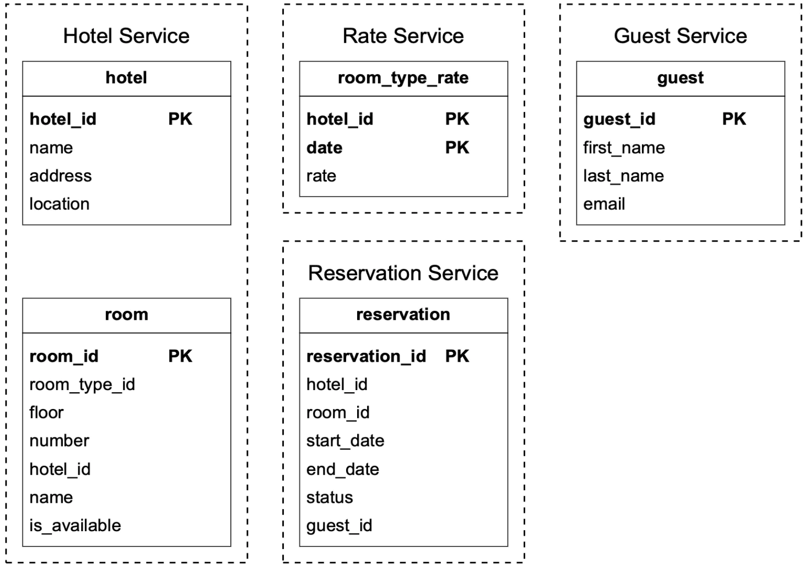

# 第 22 章：酒店预订系统

> 原章节：Hotel Reservation System · 原项目路径 `22. Hotel Reservation System/`

## 本章导读

订酒店这件事看起来很简单：选日期、选房型、点「预订」、付款。但你有没有想过——**同一间房，如果有 100 个人在同一秒点了「预订」，系统怎么保证只有 1 个人成功？**

这就是本章的核心。它和前面章节最大的不同在于：**这一章的难点不是「量」，而是「对」**。酒店预订系统的 QPS 只有个位数（每天约 24 万笔订单，平均每秒不到 3 笔），量级小到单台数据库都能扛。但它的**并发正确性**要求极高——一次超卖就意味着有客人到了酒店却无房可住，这是真实世界里的重大事故。

学完这一章，你会理解「查库存 → 扣库存」这个两步操作里藏着什么样的竞态条件，以及为什么「让数据库来做裁决」往往是最简洁可靠的方案。

## 你将学到

- 预订类系统的需求澄清要点，以及「超卖 10%」这种业务规则怎么落到设计里
- 为什么这类系统应该选关系型数据库，以及 ACID 在这里到底保护了什么
- 「房间维度」和「房型维度」两种数据模型的区别，以及为什么酒店必须用房型
- **并发控制的五种方案对比**：悲观锁、乐观锁、数据库约束、唯一索引、Redis 分布式锁
- 库存预占模式：下单后 15 分钟未支付自动释放库存，这个「延迟任务」怎么实现
- 幂等性：用户重复点击「提交订单」为什么只会生成一个订单
- 分布式事务的四种取舍：2PC、TCC、Saga、本地消息表
- 搜索与预订的一致性难题：「搜索页显示有房，点进去却售罄」怎么缓解

---

## 1. 需求澄清与量级估算（Step 1）

我们要设计一个类似万豪国际（Marriott）的酒店预订系统。这套设计同样适用于 Airbnb、机票预订、电影票选座——**凡是「有限资源 + 时间维度 + 强一致扣减」的场景，都是同一个骨架**。

### 需求澄清

面试第一步是把边界问清楚。原文的对话值得完整走一遍：

| 提问 | 回答 |
|---|---|
| 系统规模多大？ | 连锁酒店，5000 家酒店、100 万间房 |
| 用户是预订时付款，还是到店付款？ | **预订时全额付款** |
| 只能通过网站订吗？需要支持电话预订吗？ | 只支持网站和 App |
| 用户可以取消预订吗？ | 可以 |
| 还有什么要考虑的？ | **允许超卖（Overbooking）10%**。酒店会故意卖出比实际房间更多的房间，因为预期有客人会取消 |
| 范围收敛 | 聚焦于：酒店页面、房型详情页、预订、管理后台、支持超卖 |
| 补充 | **酒店价格每天都会变** |

> **「允许超卖 10%」是本章最重要的业务输入。**
> 这不是技术决策，而是酒店行业延续了几十年的收益管理（Revenue Management）实践：基于历史数据，酒店知道大约有 5%~15% 的预订会被取消或客人爽约（No-Show）。与其让这些房间空着，不如超额售卖，用「万一都来了就给客人升级房型或安排附近酒店」的代价换取更高的入住率。
>
> **注意：这个规则必须在数据模型和校验逻辑里被显式表达出来**，而不是靠工程师「顺手」写个 `<=` 判断。原文后面的 CHECK 约束就在这里出了错，我们会在勘误里详细讨论。

### 非功能需求

- **支持高并发**：旺季时可能大量用户抢订同一家酒店。
- **中等延迟**：用户下单时延迟越低越好，但**几秒钟也可以接受**。

> 「几秒钟也可以接受」这个回答很关键。它意味着你**不需要**为了极致性能牺牲一致性——这个宽松的延迟预算，让「用数据库事务来保证正确性」成为一个完全可行的方案。**如果面试官要求 100 毫秒内完成扣库存，整个设计思路就得换成 Redis + 异步落库了。**

### 量级估算

| 指标 | 计算 | 结果 |
|---|---|---|
| 总房间数 | 题设 | 100 万间 |
| 平均入住率 | 题设 | 70% |
| 平均入住天数 | 题设 | 3 天 |
| 每日预订数 | 100 万 × 0.7 ÷ 3 | **约 24 万笔/天** |
| 平均预订 TPS | 24 万 ÷ 86,400 秒 | **约 3 笔/秒** |

**平均每秒 3 笔预订——这个量级小得惊人。** 单台 MySQL 轻松扛住。

#### 但真正要估算的是「读 QPS」

预订只是漏斗的最后一环。原文给出了一个很实用的**转化漏斗反推法**：

假设从「浏览酒店详情页」到「打开预订页」再到「完成预订」，每一步的转化率是 **10%**：

```
酒店详情页浏览   300 次/秒
      ↓ 10% 转化
预订页面打开      30 次/秒
      ↓ 10% 转化
完成预订           3 次/秒
```

<div align="center"></div>

**为什么要这样反推？** 因为它决定了缓存和 CDN 的设计重点：

- **酒店详情页 300 QPS**：这是最大的一股流量，而且内容是**静态的**（酒店介绍、图片、设施）。→ 适合**强缓存 + CDN**。
- **预订页 30 QPS**：需要展示实时房态和价格。→ 适合**短 TTL 缓存**。
- **预订 3 TPS**：必须走数据库事务。→ **不能缓存，必须强一致**。

> **这套「读多写少 + 读写要求完全不同」的流量特征，是预订类系统的通用形态。** 面试时主动把这个漏斗画出来，能立刻体现出你在思考「流量从哪来、瓶颈在哪」。

---

## 2. API 设计

原文聚焦核心接口（RESTful 风格）。一个完整的系统还需要大量「按各种条件搜索房间」的接口，但那些**技术上没有挑战性**，属于范围外。

**酒店相关**

| 方法 | 路径 | 说明 |
|---|---|---|
| `GET` | `/v1/hotels/{id}` | 获取酒店详情 |
| `POST` | `/v1/hotels` | 新增酒店（仅运营人员） |
| `PUT` | `/v1/hotels/{id}` | 更新酒店信息（仅运营人员） |
| `DELETE` | `/v1/hotels/{id}` | 删除酒店（仅运营人员） |

**房间相关**

| 方法 | 路径 | 说明 |
|---|---|---|
| `GET` | `/v1/hotels/{id}/rooms/{id}` | 获取房间详情 |
| `POST` | `/v1/hotels/{id}/rooms` | 新增房间（仅运营人员） |
| `PUT` | `/v1/hotels/{id}/rooms/{id}` | 更新房间信息（仅运营人员） |
| `DELETE` | `/v1/hotels/{id}/rooms/{id}` | 删除房间（仅运营人员） |

**预订相关**

| 方法 | 路径 | 说明 |
|---|---|---|
| `GET` | `/v1/reservations` | 获取当前用户的预订历史 |
| `GET` | `/v1/reservations/{id}` | 获取预订详情 |
| `POST` | `/v1/reservations` | 创建预订 |
| `DELETE` | `/v1/reservations/{id}` | 取消预订 |

创建预订的请求体：

```json
{
  "startDate": "2021-04-28",
  "endDate": "2021-04-30",
  "hotelID": "245",
  "roomID": "U12354673389",
  "reservationID": "13422445"
}
```

> **注意 `reservationID` 这个字段——它是一个幂等键（Idempotency Key）**，用来防止重复预订。原文特别标注了这一点，第 6 节会详细展开。
>
> **它的设计很巧妙**：这个 ID **不是**后端在收到请求时生成的，而是**前端在用户打开填写页面时就生成好的**（比如用 UUID）。这样用户重复提交时，携带的是同一个 ID，后端一眼就能识别出这是重复请求。**这是幂等键的通用模式**：客户端生成、服务端校验。

---

## 3. 数据模型

### 为什么选关系型数据库

选型前先看访问模式。系统要支持四类查询：

- 查看酒店详情
- **在给定日期范围内查找可用房型**
- 记录一笔预订
- 查询某笔预订或历史记录

原文给出的四条理由，条条都指向关系型数据库：

1. **关系型数据库适合读多写少的系统**。我们算过，预订只有 3 TPS，而页面浏览有 300 QPS——典型的读多写少。
2. **NoSQL 通常为写入优化，但我们的写入很少**。用户从浏览到下单的转化率很低，写压力天然就小。
3. **关系型数据库提供 ACID 保证**。原文说得非常直接：**没有 ACID，我们就无法防止「余额变成负数」「重复扣款」这类问题。**
4. **数据结构清晰，关系型模型天然贴合**。

> **第 3 条是本章的灵魂。** 很多人学 NoSQL 时会觉得「NoSQL 更现代、更容易扩展」，但在**扣减类业务**上，ACID 是无可替代的。
>
> 我们具体说说 ACID 在这里保护了什么：
> - **原子性（Atomicity）**：扣库存和写订单必须同生共死。不能出现「库存扣了但订单没写」。
> - **一致性（Consistency）**：库存不能变成负数。
> - **隔离性（Isolation）**：两个并发事务不能都看到「还剩 1 间」然后都去扣。
> - **持久性（Durability）**：用户付了钱，订单就绝对不能丢。
>
> **如果你用 NoSQL，这四条都要自己在应用层重新实现一遍**，而且极难做对。**在写入量不大的场景下，用关系型数据库换 ACID，是一笔极其划算的交易。**

### 初始 Schema

<div align="center"></div>

初始设计里有五张表，分属三个服务：

| 服务 | 表 | 关键字段 |
|---|---|---|
| Hotel Service | `hotel` | `hotel_id`(PK)、name、address、location |
| Hotel Service | `room` | `room_id`(PK)、`room_type_id`、floor、number、`hotel_id`、name、`is_available` |
| Rate Service | `room_type_rate` | `hotel_id`(PK)、date(PK)、rate |
| Reservation Service | `reservation` | `reservation_id`(PK)、`hotel_id`、`room_id`、start_date、end_date、status、`guest_id` |
| Guest Service | `guest` | `guest_id`(PK)、first_name、last_name、email |

原文说「大部分字段都是自解释的，唯一值得提的是 `status` 字段，它代表某个房间的状态机」：

<div align="center"></div>

状态机的流转是：

```
                ┌─→ Canceled（用户取消）
                │
Pending ────────┼─→ Paid（付款成功）─→ Refunded（退款）
                │
                └─→ Rejected（预订被拒，如库存不足）
```

> **这里原文的表述有一处小错误**：它说 `status` 代表「某个房间的状态机」，但从状态机图来看，Pending / Paid / Canceled / Rejected / Refunded 显然是**一笔预订（reservation）的生命周期**，而不是房间的。房间的状态只有「可用 / 不可用」。详见勘误 4。
>
> 另外，**这个状态机在后面的并发设计里会扮演关键角色**——「取消预订」不是删除记录，而是把 `status` 从 `Paid` 改成 `Canceled` 并**把库存加回去**。**用状态机而不是删除，是为了保留审计轨迹**（谁在什么时候取消了哪笔订单），这在涉及资金的系统里是必须的。

原文还诚实地指出了这个模型的局限：**它适合 Airbnb，但不适合酒店。**

为什么？因为在 Airbnb 上你订的是**一整套具体的房源**（这个房东的这套房子），而在酒店里，你订的是**一种房型**（比如「大床房」），**具体住哪一间是入住时才分配的**。所以 `reservation` 表里存一个 `room_id` 是错的。这个缺陷会在第 5 节修正。

---

## 4. 高层设计

原文选择**微服务架构（Microservice Architecture）**：

<div align="center"></div>

各个组件：

- **用户（Users）**：通过手机或电脑预订房间。
- **管理员（Admin）**：执行退款、取消付款等管理操作。
- **CDN**：缓存 JS 包、图片、视频等静态资源。
- **公共 API 网关（Public API Gateway）**：全托管服务，负责限流、鉴权等。
- **内部 API（Internal APIs）**：只对授权人员可见，通常由 VPN 保护。
- **酒店服务（Hotel Service）**：提供酒店和房间的详情。**酒店和房间数据是静态的，所以可以激进地缓存。**
- **价格服务（Rate Service）**：提供未来不同日期的房价。原文指出了一个有趣的领域特征：**房价取决于酒店当天的入住率**——住得越满，价格越高。
- **预订服务（Reservation Service）**：接收预订请求、锁定房间，并随着预订/取消**追踪房间库存**。
- **支付服务（Payment Service）**：处理支付，成功后更新预订状态。
- **酒店管理服务（Hotel Management Service）**：仅授权人员可用，提供管理和查看预订、酒店等后台功能。

服务间通信用 **RPC 框架**，比如 **gRPC**。

> **为什么用 gRPC 而不是 REST？** 服务内部通信的两个诉求是**低延迟**和**强类型契约**：
> - gRPC 基于 HTTP/2，支持多路复用和头部压缩，比 HTTP/1.1 的 REST 更省带宽、延迟更低。
> - 用 Protocol Buffers 定义接口，**编译期就能发现接口不匹配**，而不是等运行时 500。
> - 自动生成多语言客户端代码。
>
> 但 gRPC 对外部客户端不友好（浏览器支持有限），所以通常是**对外 REST / 对内 gRPC** 的组合。

### 一个关键的架构取舍

注意原文在预订服务里做的一个决定：**预订服务和库存管理被放在同一个服务里**，共享同一个关系型数据库。

这个决定在后面「服务间数据一致性」一节会被面试官挑战（因为它不是「纯」微服务——纯微服务要求每个服务有独立数据库）。原文对此的解释是：**我们想利用关系型数据库的 ACID 来保证一致性**。

**这是一个非常成熟、非常务实的判断**，我们在第 11 节详细展开。

---

## 5. 改进的数据模型：从「具体房间」到「房型」

### API 的修正

预订 API 不再预订 `roomID`，而是预订 `roomTypeID`：

```json
POST /v1/reservations
{
  "startDate": "2021-04-28",
  "endDate": "2021-04-30",
  "hotelID": "245",
  "roomTypeID": "12354673389",
  "roomCount": "3",
  "reservationID": "13422445"
}
```

新增了 `roomCount`——用户可以一次订多间。

### 修正后的 Schema

<div align="center"></div>

关键变化：

- `reservation.room_id` → `reservation.room_type_id`（订的是房型）
- 新增 **`room_type_inventory`** 表（库存表）

`room_type_inventory` 的字段：

| 字段 | 含义 |
|---|---|
| `hotel_id` | 酒店 ID |
| `room_type_id` | 房型 ID |
| `date` | **单个日期** |
| `total_inventory` | 总房间数，减去被临时下架的房间 |
| `total_reserved` | 该（酒店、房型、日期）已预订的房间数 |

**这张表的设计精髓在于「日期粒度」**：不是存「入住区间」，而是**把每个日期拆成独立的一行**。

> **为什么要这么拆？** 这是本章最值得学习的一个设计手法。
>
> 假设不拆日期，直接存 `(start_date, end_date, total_reserved)`。那么「判断某几天是否有房」就变成了**区间重叠判断**：
> ```sql
> -- 判断新预订 [S2, E2) 与已有预订 [S1, E1) 是否冲突
> WHERE NOT (E2 <= S1 OR S2 >= E1)
> ```
> 这类查询**用不上索引**（因为不是等值匹配），而且**并发控制的粒度会变得很粗**——你没法简单地「锁定某一天」。
>
> 拆成「一行一天」之后：
> - 查询变成**等值 + 范围**匹配，索引友好。
> - **并发控制的粒度精确到「某酒店某房型的某一天」**，锁的冲突范围最小。
> - 统计某天的入住率、某天的收入，都是一句简单的聚合。
>
> **代价是数据行数膨胀**。住 3 天的订单要写 3 行。我们来算一下总量。

原文的存储估算：

| 项 | 数量 |
|---|---|
| 酒店数 | 5,000 |
| 每家酒店的房型数 | 20 |
| 时间跨度 | 2 年 |
| 天数 | 365 × 2 = 730 |
| **总行数** | 5,000 × 20 × 730 = **7,300 万行** |

**7300 万行不算大，单台数据库服务器就能处理。** 但为了高可用，原文建议做**读复制（Read Replication）**，最好是**跨可用区（Zone）**部署。

> 补充一个量级感知：7300 万行、每行大约 60 字节（4 个字段），总数据量约 **4~5 GB**。这在今天连一台普通服务器的内存都装得下。**所以本章的瓶颈从头到尾都不是「数据量」，而是「并发正确性」。**

### 表是怎么被填充的

`room_type_inventory` 的行由**每日定时任务（Daily CRON Job）**预先生成。例如今天生成「从明天起未来两年」的所有行。

示例数据：

| hotel_id | room_type_id | date | total_inventory | total_reserved |
|---|---|---|---|---|
| 211 | 1001 | 2021-06-01 | 100 | 80 |
| 211 | 1001 | 2021-06-02 | 100 | 82 |
| 211 | 1001 | 2021-06-03 | 100 | 86 |
| 211 | 1001 | ... | ... | |
| 211 | 1001 | 2023-05-31 | 100 | 0 |
| 211 | 1002 | 2021-06-01 | 200 | 16 |
| 2210 | 101 | 2021-06-01 | 30 | 23 |
| 2210 | 101 | 2021-06-02 | 30 | 25 |

### 查询可用性

检查某个房型在日期范围内的库存：

```sql
SELECT date, total_inventory, total_reserved
FROM room_type_inventory
WHERE room_type_id = ${roomTypeId}
  AND hotel_id = ${hotelId}
  AND date BETWEEN ${startDate} AND ${endDate};
```

判断是否有足够房间（注意：支持 10% 超卖）：

```
if (total_reserved + ${numberOfRoomsToReserve}) <= 110% * total_inventory
```

> **注意这里的 `110%` 是一个硬编码的业务规则。** 生产环境里它应该是一个**可配置参数**，甚至可以按酒店、按房型、按日期区间分别配置（旺季超卖比例低，淡季可以更高）。**把业务规则写死在 SQL 里，是初学者最容易埋下的技术债之一。**

### 如果数据量再大 100 倍怎么办

原文给出了两个追问方向的答案：

1. **只存当前和未来的预订数据**。历史预订可以归档到**冷存储**。
2. **数据库分片（Sharding）**。可以按 `hash(hotel_id) % server_count` 分片，因为**我们所有的查询都带 `hotel_id`**。

> **第 2 点的理由非常重要**：分片键的选择标准就是「**是不是查询的主要维度**」。如果所有查询都带 `hotel_id`，那么按 `hotel_id` 分片后，每个查询都只会落到**一个分片**上，不需要跨分片聚合。**这就是「分片键要让查询局部化」的含义。**

---

## 6. 并发问题：本章的核心

原文把重复预订（Double Booking）分成两类问题：

1. **同一个用户点了两次「预订」按钮**
2. **多个用户同时抢订同一间房**

这两类问题的**根因不同，解法也完全不同**——这是初学者最容易混淆的地方。

### 问题一：同一用户重复提交

<div align="center"></div>

**根因**：用户手抖、网络慢导致用户以为没点上又点一次、或者浏览器重试。**这是「同一个请求被执行了多次」的问题。**

**方案 A：前端处理**——点击后禁用按钮。

> **原文的评价非常到位**：「如果用户禁用了 JavaScript，他们就看不到按钮变灰了。」
> 换句话说：**前端校验只是体验优化，不是正确性保证。** 任何依赖前端来保证数据正确的设计，都是错的。前端可以被绕过（禁用 JS、改请求、直接调 API），**正确性必须由服务端保证**。

**方案 B：幂等 API（Idempotent API）**——在 API 里加一个幂等键，让「无论调用多少次，动作只执行一次」。

<div align="center"></div>

完整流程：

1. 用户进入填写信息页面时，系统就**生成一个预订订单号**（全局唯一标识符）。
2. 提交预订时，携带这个 `reservation_id`。
3. 如果用户第二次点「完成预订」，携带的是**同一个 `reservation_id`**，后端能识别出这是重复请求。
4. 去重靠的是 **`reservation_id` 列上的唯一约束（Unique Constraint）**——数据库层面拒绝写入两条相同 ID 的记录。

<div align="center"></div>

> **为什么这个方案是对的？** 因为它把「去重」这个职责交给了**唯一可靠的裁决者——数据库**。
>
> 应用层的去重（先查一下有没有、再决定插不插）永远有竞态窗口：两个请求同时查到「不存在」，然后都去插入。**只有数据库的唯一索引是在存储引擎层面原子生效的**，天然没有竞态。
>
> **这是本章反复出现的核心思想：把并发裁决权交给数据库，而不是交给应用代码。**

**幂等 API 的完整工程实现**（原文只讲了唯一约束，这里补充生产环境的做法）：

```
① 客户端生成 Idempotency-Key（UUID），随请求发送
② 服务端在「幂等表」里尝试 INSERT 这个 key
   - 成功 → 继续执行业务逻辑
   - 唯一约束冲突 → 说明是重复请求，直接返回上次的结果
③ 幂等表记录：key、请求参数指纹、响应结果、状态、创建时间
④ 幂等表设 TTL（如 24 小时），定期清理
```

**两个必须注意的细节：**

- **要存「响应结果」而不只是「key」**。否则第二次请求虽然知道是重复，但拿不到第一次的结果，用户界面还是错的。
- **要校验「请求参数指纹」**。如果有人用同一个 key 发了不同的参数（客户端 bug 或恶意），应该拒绝而不是返回旧结果。

### 问题二：多用户并发抢订

<div align="center"></div>

这是**真正的并发问题**。原文的推演（假设事务隔离级别**不是**可串行化 Serializable）：

```
初始：total_inventory = 100, total_reserved = 99

时间 →
  事务1: SELECT ... → 看到 99 < 100，有房 ✓
  事务2: SELECT ... → 看到 99 < 100，有房 ✓     ← 两个事务都通过了检查
  事务2: UPDATE total_reserved = 100 → COMMIT
  事务1: UPDATE total_reserved = 101 → COMMIT   ← 事务1 基于过期的快照做决定
```

**结果：卖出去了 101 间房，但只有 100 间。**

> **这个问题的学名叫「检查后使用竞态」（Time-of-Check to Time-of-Use，TOCTOU）。**
> 它的通用形态是：**你先读一个值做判断，然后基于这个判断去写。如果读和写之间没有原子性保证，判断就可能已经过期了。**
>
> 这个模式在系统设计里无处不在：
> - 检查用户名是否被占用 → 然后注册
> - 检查余额是否足够 → 然后扣款
> - 检查库存是否足够 → 然后扣库存
> - 检查文件是否存在 → 然后创建文件
>
> **识别出「这是一段 check-then-act 代码」，是解决所有并发问题的第一步。**

原文给出的原始 SQL：

```sql
-- 第 1 步：检查库存
SELECT date, total_inventory, total_reserved
FROM room_type_inventory
WHERE room_type_id = ${roomTypeId}
  AND hotel_id = ${hotelId}
  AND date BETWEEN ${startDate} AND ${endDate};

-- 对第 1 步返回的每一行：
-- if ((total_reserved + ${numberOfRoomsToReserve}) > 110% * total_inventory) {
--   Rollback;
-- }

-- 第 2 步：扣减库存
UPDATE room_type_inventory
SET total_reserved = total_reserved + ${numberOfRoomsToReserve}
WHERE room_type_id = ${roomTypeId}
  AND date BETWEEN ${startDate} AND ${endDate};

COMMIT;
```

> **⚠️ 上面这段 SQL 有一个真实的 bug**：第 2 步的 `UPDATE` **漏掉了 `hotel_id` 过滤条件**。如果不同酒店存在相同的 `room_type_id`，这个 UPDATE 会误改其他酒店的库存。原文的示例代码和前面给出的 SELECT 不一致。详见勘误 2。

原文提出三类解法：**悲观锁、乐观锁、数据库约束**。我们逐一分析，并补充另外两类在真实工程里常用的方案。

---

## 7. 并发控制方案对比（原文三方案）

### 方案一：悲观锁（Pessimistic Locking）

**核心思想**：假设冲突一定会发生，所以在读取时就直接加锁，把并发变成串行。

在 MySQL 里用 `SELECT ... FOR UPDATE` 实现——它锁定查询选中的行，直到事务提交才释放。

<div align="center"></div>

```sql
BEGIN;
-- 加排他锁，其他事务的 FOR UPDATE 会被阻塞
SELECT date, total_inventory, total_reserved
FROM room_type_inventory
WHERE hotel_id = ${hotelId}
  AND room_type_id = ${roomTypeId}
  AND date BETWEEN ${startDate} AND ${endDate}
FOR UPDATE;

-- 检查（此时锁已持有，其他事务看不到中间状态）
-- 若不满足，ROLLBACK

UPDATE room_type_inventory
SET total_reserved = total_reserved + ${numberOfRoomsToReserve}
WHERE hotel_id = ${hotelId}
  AND room_type_id = ${roomTypeId}
  AND date BETWEEN ${startDate} AND ${endDate};

COMMIT;  -- 释放锁
```

**优点**：

- 阻止应用更新「正在被修改」的数据
- **实现简单**，通过串行化更新来避免冲突。**数据争用（Data Contention）严重时很有效**

**缺点**：

- 锁定多个资源时**可能死锁（Deadlock）**
- **扩展性差**——如果事务锁太久，会影响所有试图访问该资源的其他事务
- 当查询选中大量行、且事务很长时，影响尤其严重

**原文作者的结论：由于扩展性问题，不推荐这个方案。**

> **补充两个原文没讲、但工程上必须知道的关键细节：**
>
> **① `FOR UPDATE` 的锁范围取决于索引。** 在 MySQL InnoDB 里，如果 `WHERE` 条件用不上索引，`FOR UPDATE` 会**锁住扫描过的所有行**，极端情况下相当于锁表。所以用悲观锁的前提是——**`(hotel_id, room_type_id, date)` 上必须有合适的复合索引**。
>
> **② 死锁的常见诱因是「加锁顺序不一致」。** 如果事务 A 先锁 6 月 1 日再锁 6 月 2 日，事务 B 先锁 6 月 2 日再锁 6 月 1 日，就会死锁。**标准解法是让所有事务按同一个顺序加锁**——比如在应用层**把日期排序后再依次加锁**。这是一个非常实用的小技巧。
>
> **③ 悲观锁并非一无是处。** 原文说「不推荐」，理由是高争用下会阻塞。但在**争用极高**的场景下，乐观锁的失败率会接近 100%（所有人都在重试），此时悲观锁反而更稳定——因为它把「大量重试」变成了「有序排队」。**准确的说法是：低争用用乐观锁，高争用用悲观锁或排队机制。** 本章的预订场景（3 TPS）属于低争用，所以乐观锁更合适。

### 方案二：乐观锁（Optimistic Locking）

**核心思想**：假设冲突很少发生，所以**不加锁**，但在写入时检查「数据有没有被别人改过」。如果改过了，就失败重试。

两种常见实现：**版本号（Version Number）** 和 **时间戳（Timestamp）**。**推荐用版本号，因为服务器时钟可能不准。**

<div align="center"></div>

工作流程：

1. 在表里加一个 `version` 列。
2. 修改前先**读出**版本号。
3. 更新时把版本号 +1 写回。
4. **数据库校验：如果新的版本号没有超过之前的版本号，就拒绝这次更新。**

```sql
-- 读取时拿到 version
SELECT total_reserved, version FROM room_type_inventory
WHERE hotel_id = ${hotelId} AND room_type_id = ${roomTypeId} AND date = ${date};
-- 假设读到 version = 7, total_reserved = 99

-- 更新时带上 version 条件
UPDATE room_type_inventory
SET total_reserved = total_reserved + ${n},
    version = version + 1
WHERE hotel_id = ${hotelId}
  AND room_type_id = ${roomTypeId}
  AND date = ${date}
  AND version = 7;          -- ← 关键：版本不匹配则影响 0 行

-- 应用层检查：affected_rows == 0 说明有人抢先改了，需要重试或报错
```

**优点**：

- 阻止应用修改**过期数据（Stale Data）**
- **不需要在数据库里加锁**
- **数据争用低时（很少发生更新冲突）是首选**

**缺点**：

- **数据争用高时性能很差**（大量失败重试）

**原文结论：预订 QPS 不高，所以乐观锁对本系统是个好选择。**

> **这里要补充一个原文说得不够精确的地方**：原文说「数据库校验会阻止插入，如果新版本号没超过之前的版本号」。准确的说法是——**`UPDATE ... WHERE version = 7` 在版本不匹配时「影响 0 行」，而不是「报错」**。应用必须**主动检查受影响行数**，否则会静默地什么都不做，用户以为下单成功了但其实没有。这是一个真实且高频的 bug。
>
> **另外，乐观锁的「重试」要小心**：必须设置**最大重试次数**（比如 3 次）和**退避（Backoff）**，否则高并发下会形成「重试风暴」，把数据库打得更惨。

### 方案三：数据库约束（Database Constraints）

原文的说法是：**这个方案和乐观锁非常相似，只是把守卫（Guardrail）换成了数据库约束。**

```sql
CONSTRAINT `check_room_count` CHECK((`total_inventory - total_reserved` >= 0))
```

<div align="center"></div>

**优点**：

- **实现最简单**
- 数据争用小的时候工作良好

**缺点**：

- 和乐观锁类似，**数据争用高时性能差**
- **数据库约束不像应用代码那样容易做版本控制**（迁移脚本管理麻烦）
- **不是所有数据库都支持约束**（MySQL 8.0.16 之前会静默忽略 CHECK 约束）

**原文结论：因为实现简单，这对酒店预订系统也是一个好选择。**

> **⚠️ 这里原文有一个真实且重要的错误，必须指出：**
>
> 上面那条约束是 `CHECK(total_inventory - total_reserved >= 0)`，也就是**「已预订不能超过总库存」**。但本章的需求明确说了**要支持 10% 的超卖**！这条约束会**直接禁止超卖**，和业务需求矛盾。
>
> 正确的约束应该是：
> ```sql
> CONSTRAINT `check_room_count`
>   CHECK (total_reserved <= total_inventory * 1.1)
> ```
> 详见勘误 1。
>
> **另外，原文说这个方案「和乐观锁非常相似」也不准确。** 一条 `UPDATE ... SET total_reserved = total_reserved + n` 本身就会**在 InnoDB 里对目标行加排他锁**，并发事务会**排队等待**，而不是像乐观锁那样「失败重试」。所以从并发行为上看，**它更接近悲观锁**。CHECK 约束只是最后一道安全网，不是并发控制机制本身。详见勘误 5。

---

## 8. 并发控制方案对比（补充两方案）

原文只给了三个方案。但在真实工程里，另外两个方案同样常见，而且其中一个可能是**最简洁可靠的**。这一节是本章最重要的补充。

### 方案四：原子条件更新（Atomic Conditional Update）—— 最推荐

**核心思想**：**把「检查」和「更新」合并成一条 SQL**，让数据库在一次原子操作里完成判断和修改。

```sql
UPDATE room_type_inventory
SET total_reserved = total_reserved + ${numberOfRoomsToReserve}
WHERE hotel_id = ${hotelId}
  AND room_type_id = ${roomTypeId}
  AND date BETWEEN ${startDate} AND ${endDate}
  AND total_reserved + ${numberOfRoomsToReserve} <= total_inventory * 1.1;
  -- ↑ 检查条件直接写在 WHERE 里

-- 应用层：检查 affected_rows
-- 如果 affected_rows == 期望的行数（比如 3 天就是 3 行）→ 成功
-- 如果 affected_rows < 期望行数 → 说明某一天库存不足，ROLLBACK
```

**为什么这是最好的方案？**

1. **彻底消除了 TOCTOU 窗口**。判断和修改在**同一条语句**里完成，数据库保证它的原子性。不再有「读到的值已经过期」的问题。
2. **不需要显式的锁语句**。`UPDATE` 自带行锁，但持锁时间极短（就是这一条语句），阻塞窗口最小。
3. **不需要重试逻辑**。要么成功要么失败，没有「读-改-写」的重试循环。
4. **实现简单**，代码量最少。
5. **`affected_rows` 天然给出了结果**——不用额外查询就知道成没成功。

**唯一需要注意的坑**：

- **多天预订要么全成功、要么全失败**。住 3 天就要更新 3 行，如果第 3 天库存不足，必须把前 2 天回滚。**把整个操作放在一个事务里就能解决**（这也再次说明了为什么必须用支持事务的数据库）。
- **必须校验 `affected_rows` 等于期望值**，不能只看「没报错」。
- **`date BETWEEN` 的顺序**：多个并发事务更新同一组日期时，InnoDB 会按索引顺序加锁，所以死锁风险比手工 `FOR UPDATE` 低，但**给日期加索引仍然是必须的**。

> **为什么原文没有提到这个方案？** 因为原笔记是「面试速查」性质，篇幅有限。但在实际工作中，**「把条件写进 WHERE」是处理扣减类并发问题的第一选择**——它比悲观锁轻、比乐观锁简单、比约束更可控。
>
> **面试时如果你能主动提出这个方案，是明确的加分项。**

### 方案五：唯一索引（Unique Constraint）—— 适用于「具体房间」模型

这是用户提到的最简洁方案，**但它只适用于特定的数据模型**，必须讲清楚适用边界。

**做法**：不存「已预订数量」这个计数器，而是**为每一个「房间 + 日期」组合存一行占用记录**：

```sql
CREATE TABLE room_occupancy (
  room_id    BIGINT NOT NULL,
  stay_date  DATE   NOT NULL,
  reservation_id BIGINT NOT NULL,
  PRIMARY KEY (room_id, stay_date)   -- ← 唯一索引，由数据库裁决
);
```

预订时直接 `INSERT`：

```sql
INSERT INTO room_occupancy (room_id, stay_date, reservation_id)
VALUES (101, '2021-06-01', 13422445);
-- 如果 (101, '2021-06-01') 已被占用 → 唯一约束冲突 → 数据库自动拒绝
```

**优点**：

- **彻底没有竞态**。唯一索引的冲突检测是在存储引擎层面**原子完成**的，比任何应用层判断都可靠。
- **不需要计数器，不需要加锁，不需要重试**。
- **天然精确**——不用算「还剩几间」，直接尝试占位。

**关键限制（这是必须讲清的边界）**：

- **它只适用于「订具体房间」的模型**（Airbnb 式的整套房源、电影院选座、机票选座）。因为你要在**下单时就确定** `room_id`。
- **本章的酒店场景是「订房型」**，下单时并不分配具体房间（房间是入住时前台分配的）。所以**不能**直接对 `(room_type_id, date)` 建唯一索引——那样意味着「同一房型同一天只能卖一间」。
- **不解决「超卖 10%」需求**。唯一索引保证的是「一间房一天只能被占一次」，是**零超卖**；而酒店业务需要**允许超卖 10%**。要支持超卖，就得引入「虚拟房间」的概念（把 100 间房扩展成 110 个虚拟位），这会显著复杂化数据模型。

> **所以，正确的结论是：**
> - **房型模型（本章场景）** → 用**方案四（原子条件更新 + CHECK 约束兜底）**。
> - **具体房间模型（选座、Airbnb）** → 用**方案五（唯一索引）**，这是最简洁可靠的。
>
> **面试时如果你能主动区分这两种模型并说明各自的方案，会显得非常专业。** 很多候选人会不加区分地说「用唯一索引就行」，然后被面试官追问「酒店是订房型，你怎么建唯一索引」时卡住。

### 方案六（延伸）：Redis 分布式锁

**做法**：在 Redis 里对 `lock:hotel:{hotelId}:roomType:{roomTypeId}:date:{date}` 这个 key 加锁，拿到锁的请求才能去操作数据库。

```bash
SET lock:inventory:211:1001:20210601 <uuid> NX PX 5000
```

（`NX` = 不存在才设置，`PX 5000` = 5 秒后自动过期，防止持有者崩溃导致死锁）

**为什么在酒店预订场景下不推荐？** 三个原因：

1. **多了一层故障点**。Redis 挂了或网络分区，整个预订功能就不可用。而数据库本来就在链路里，用它自带的锁**不增加任何新依赖**。
2. **性能没有收益**。本章只有 3 TPS，数据库行锁的开销完全可以忽略。分布式锁是为「数据库锁扛不住的高并发」准备的，这里用不上。
3. **锁的正确性很难保证**——见下面的 Redlock 争议。

#### Redlock 的争议

「单机 Redis 锁」的问题是：Redis 主从**异步复制**，如果主节点在把锁同步给副本前宕机，副本升主后就**不知道这把锁存在**，另一个客户端能立刻拿到同一把锁 → **两个客户端同时持锁**。

为解决这个问题，Redis 作者 antirez 提出了 **Redlock** 算法：向 **N 个（通常 5 个）独立的 Redis 实例**请求加锁，**超过半数成功**且总耗时小于锁的有效期，才算加锁成功。

**但 Redlock 引发了著名的争论**，双方的观点值得了解：

**质疑方（Martin Kleppmann，分布式系统研究者）的核心论点**：

- Redlock 依赖**时钟假设**——它假定各节点的时钟漂移有界。但真实系统里，一次 **GC 停顿（Stop-the-world GC）** 或**时钟跳变**就可能让锁提前过期，导致两个客户端同时持锁。
- Redlock **没有 fencing token（隔离令牌）**。即使锁机制本身偶尔出错，只要下游能通过单调递增的令牌拒绝过期持有者的写入，系统仍然是安全的。**问题不在于锁，而在于锁保护的操作没有防重入机制。**
- 结论：Redlock 是一个「对效率友好、对正确性不友好」的锁。**如果你需要的是正确性（比如防止超卖），不要用 Redlock，应该用数据库事务或带 fencing token 的方案。**

**支持方（antirez，Redis 作者）的回应要点**：

- Kleppmann 描述的时钟跳变场景需要人为修改系统时间等极端条件。
- Redlock 的设计目标是「比单机 Redis 锁更可靠」，而不是「达到共识算法的正确性级别」。
- 如果业务真的需要严格互斥，本来就应该用 Paxos/Raft 类共识系统。

**对我们这个系统的实际意义**：

> **双方其实都同意一件事——如果目标是「防止超卖」这类正确性要求，Redis 锁（无论是否 Redlock）都不是最佳选择。**
>
> 正确的层级是：
> 1. **能用数据库事务解决，就用数据库事务**（本章属于这一类）。
> 2. 需要跨服务协调且必须严格互斥时，用**基于共识的协调服务**（ZooKeeper、etcd），或者**带 fencing token 的锁**。
> 3. Redis 锁适合**「用错也不会造成数据损坏」的乐观场景**——比如「避免多个节点重复执行同一个耗时的缓存重建任务」（重复执行只是浪费资源，不会出错）。
>
> **注意：Redis 官方文档本身也建议配合 fencing token 使用锁**——这个细节常被忽略。

---

## 9. 超卖与库存预占：15 分钟未支付自动释放

原文的需求是「预订时全额付款」，所以链路里没有「等待支付」这一步。但**真实世界的预订系统绝大多数都有支付窗口**——下单后给你 15 分钟付款，超时释放库存。这一节补充这个缺失的设计。

### 为什么需要「预占」？

假设没有预占，直接「下单即扣减、付款即确认」，会有两个问题：

1. **恶意占座**：用户可以无限下单不付款，把库存全部占死。
2. **支付失败**：用户下单成功但支付失败，库存需要回退，链路变复杂。

**预占（Reservation / Hold）模式**把流程拆成两段：

```
下单 → 预占库存（reserved_hold +1，15 分钟内有效）
        ↓
     支付成功 → 转为正式占用（reserved_hold -1, total_reserved +1），状态 Paid
        ↓
     支付失败 / 15 分钟超时 → 释放预占（reserved_hold -1），状态 Canceled
```

对应的表结构可以这样设计：

```sql
ALTER TABLE room_type_inventory
  ADD COLUMN total_reserved INT NOT NULL DEFAULT 0,   -- 已确认占用
  ADD COLUMN total_held     INT NOT NULL DEFAULT 0;   -- 预占（待支付）

-- 可用量 = total_inventory - total_reserved - total_held
```

### 核心问题：15 分钟超时这个「延迟任务」怎么实现？

这是面试高频追问。原文完全没有涉及，这里给出四种主流实现及其取舍。

**方案 A：定时任务扫描（Scheduled Scan）**

```sql
-- 每分钟跑一次
SELECT * FROM reservation
WHERE status = 'Pending' AND created_at < NOW() - INTERVAL 15 MINUTE;
-- 对每条记录执行释放库存 + 更新状态
```

- **优点**：实现最简单，不需要额外组件。
- **缺点**：**精度差**（最多延迟一个扫描周期）；**扫描压力大**（订单表大了以后，每分钟扫全表代价高）；**瞬时批量释放**可能造成数据库尖峰。
- **优化**：给 `(status, created_at)` 建索引，用游标分页扫描，并限制每批处理的条数。

**方案 B：延时队列（Delayed Queue）**

下单时投递一条「15 分钟后检查」的消息，消息到期后消费者执行释放逻辑。

| 实现 | 机制 |
|---|---|
| **RabbitMQ** | 用 `TTL` + **死信交换机（DLX）** 组合实现延时 |
| **RocketMQ** | 原生支持**定时/延时消息**（`delayLevel`），最省事 |
| **Kafka** | **不原生支持延时消息**，需要自己用时间轮或外部调度实现 |
| **Redis** | 用 **ZSET**：`ZADD delay_queue <execute_at_timestamp> <reservation_id>`，再用一个轮询任务 `ZRANGEBYSCORE ... 0 now` 取出到期的 |
| **时间轮（Timing Wheel）** | Netty、Kafka 内部都用的数据结构，适合海量定时任务 |

- **优点**：**精度高**（可以精确到秒）；**天然削峰**（消息分散到期，不会集中爆发）。
- **缺点**：引入额外组件；**消息可能丢失**（需要持久化 + 重试），所以**必须有兜底扫描**。

**方案 C：Redis 过期回调（Keyspace Notification）**

```bash
# 开启通知
CONFIG SET notify-keyspace-events Ex
# 下单时
SET hold:{reservation_id} 1 EX 900
# 订阅过期事件
SUBSCRIBE __keyevent@0__:expired
```

- **优点**：不用自己写调度，Redis 自动触发。
- **缺点**：**Redis 的过期事件是「尽力而为」的，不保证可靠投递**——如果那一刻没有订阅者，事件就丢了。而且 Redis 的过期删除策略是**惰性 + 定期采样**，过期时间到不代表立刻触发。**所以这个方案只能作为辅助，不能作为唯一机制。**

**方案 D：数据库 TTL + 查询时惰性处理**

不主动释放，而是在**查询库存时顺便过滤掉过期的预占**：

```sql
SELECT total_inventory - total_reserved
     - (SELECT COUNT(*) FROM reservation
        WHERE status = 'Pending' AND expires_at > NOW() AND ...) AS available
FROM room_type_inventory WHERE ...;
```

- **优点**：零额外组件，绝对不会有「预占泄漏」。
- **缺点**：查询变复杂、变慢；`total_held` 不能作为单一数字缓存。

### 推荐的生产组合

> **方案 B（延时队列）+ 方案 A（兜底扫描）** 是最稳的组合：
>
> - **延时队列负责「准时」**：99% 的订单在 15 分钟时被准时释放，用户体验好。
> - **兜底扫描负责「不漏」**：每 5 分钟扫一次「已经过期但状态还是 Pending」的订单，处理那些消息丢失、消费者崩溃、异常路径遗漏的订单。
> - **释放逻辑必须幂等**：因为延时消息可能重复投递。用「`UPDATE ... WHERE status = 'Pending' AND expires_at < NOW()`」这种**条件更新**来保证同一条订单只会被释放一次（`affected_rows == 0` 就说明已经被处理过了）。
>
> **核心思想**：**任何「延迟触发」机制都可能失效，所以永远要有一个「周期性对账」的兜底。** 这和上一章的对账思路完全一致——**主动触发 + 周期对账**是分布式系统的通用安全模式。

---

## 10. 可扩展性：分片与缓存

### 分片（Sharding）

原文指出：酒店预订系统的负载通常不高，但面试官可能问「如果这套系统被 booking.com 这样的旅游大站采用，QPS 放大 1000 倍怎么办」。

**QPS 放大 1000 倍后**：预订 3 TPS → 3000 TPS；总 QPS 约 30,000。

**所有服务都是无状态的，所以可以简单地复制扩展。** 唯一的瓶颈是**有状态的数据库**。

分片方案：**按 `hotel_id` 分片**，因为所有查询都带 `hotel_id`。

<div align="center"></div>

**原文的容量推算**：假设 QPS 是 30,000，分成 **16 个分片**后，每个分片承担：

```
30,000 ÷ 16 = 1,875 QPS
```

**1,875 QPS 在单台 MySQL 集群的承载能力范围内。**

> **这个推算的思路值得学习**：不是笼统地说「加机器」，而是「先算出单机上限，再用总量除以单机上限得到分片数」。面试时能给出这个推理链，比说「分 16 片」有价值得多。
>
> **补充分片带来的两个新问题**（原文没提，但面试必问）：
> - **跨分片查询**：「查询某个用户的所有订单」如果按 `hotel_id` 分片，就会打到所有分片。解法是**建一张按 `guest_id` 分片的订单索引表**（异构索引），或者用**基因法**（把 `hotel_id` 的哈希位嵌进 `reservation_id`，让订单 ID 自带路由信息）。
> - **热点酒店**。某个网红酒店的所有请求都落在一个分片上。解法是**缓存**（见下）和**二级分片**（把热点酒店按日期再拆）。

### 缓存

原文建议用 **Redis** 缓存**房态（Room Inventory）和预订信息**，并设置 TTL 让过去的日期自动过期：

<div align="center"></div>

**缓存的 key 设计**：

```
key:   hotelID_roomTypeID_{date}
value: 该（酒店、房型、日期）的可用房间数
```

**缓存与数据库的一致性**：通过 **CDC（Change Data Capture）流式同步**机制异步维护——读取数据库的变更日志，应用到独立系统。**Debezium 是把数据库变更同步到 Redis 的流行选择。**

**原文对不一致的态度非常重要，值得完整引用**：

> 「用这种机制，缓存和数据库可能在一段时间内不一致。**但在我们的场景里这是可以接受的，因为数据库会阻止我们做出无效的预订。**」

**这句话是整章的架构精髓**：

> **数据库是唯一的事实来源（Source of Truth）和最终裁决者。缓存只负责「让大部分请求更快」，不负责「保证正确」。**
>
> 具体来说：
> - 缓存说「有房」→ 用户去下单 → 数据库检查后可能说「没有」→ **下单失败**。用户看到一次失败，但**数据没有出错**。
> - 缓存说「没房」→ 用户看到售罄 → 但数据库其实还有。这会导致**少卖**，需要靠缓存 TTL 自然过期来纠正。
>
> **两种不一致的后果是完全不对称的**：
> - 「假有房」→ 用户失望一次，**可接受**。
> - 「假没房」→ **损失订单**，需要缩短 TTL 或主动失效来缓解。
> - 「错误扣减」→ **数据损坏**，绝对不可接受——而这正是我们通过「数据库裁决」杜绝的。
>
> **所以设计缓存时必须问自己：这个缓存错了会怎样？** 如果答案是「会损坏数据」，那这个数据就不该被缓存，或者必须走强一致路径。

**缓存的优点**：

- 降低数据库负载
- 高性能（Redis 在内存中管理数据）

**缓存的缺点**：

- **维护缓存与数据库的一致性很难**。必须仔细考虑不一致会如何影响用户体验。

### 补充：价格缓存策略

原文提到「酒店价格每天都会变」，但没有讲价格怎么缓存。价格和库存的缓存策略**完全不同**，值得单独说明：

| 维度 | 库存 | 价格 |
|---|---|---|
| 变化频率 | **高**（每次下单/取消都变） | **低**（每天变一次，甚至更低） |
| 一致性要求 | 高（错一次就可能超卖） | 中（价格显示错一次影响可接受） |
| 缓存 TTL | **短**（几秒~几十秒） | **长**（几小时~一天） |
| 失效方式 | CDC 主动失效 + 短 TTL | **按日期边界主动失效**（每天 00:00 刷新） |

**价格缓存的推荐做法**：

1. **长 TTL + 定时刷新**。`room_type_rate` 每天变一次，所以可以缓存一整天，在每天凌晨价格更新后**批量刷新缓存**。
2. **给 TTL 加随机抖动**。如果所有价格 key 都在 00:00 过期，会形成**缓存雪崩**。应该让过期时间散布在几分钟内。
3. **按「酒店 + 日期」维度缓存**，而不是按「用户」。价格对所有用户是一样的（除非有个性化定价），所以缓存命中率极高。
4. **预取（Pre-fetch）**。用户浏览酒店详情页时，可以**异步预热**未来 30 天的价格，这样进入预订页时缓存已经就绪。

> **价格和库存分开缓存，是一个重要的设计判断。** 初学者常见的错误是把它们塞进同一个缓存对象、用同一个 TTL——结果要么是价格缓存被库存的高频失效拖累，要么是库存缓存因为 TTL 太长而不准。**按「数据的变化频率」和「错误的后果」来分组设计缓存策略**，是缓存设计的通用原则。

---

## 11. 服务间数据一致性

### 单体 vs 微服务的取舍

原文坦诚地讨论了这个问题：

- **单体应用（Monolith）**可以用一个共享的关系型数据库来保证一致性。
- 我们的微服务设计采用了**混合方案**：一部分服务是独立的，但**预订 API 和库存 API 由同一个服务处理**。

**为什么？** 因为**我们想利用关系型数据库的 ACID 保证来确保一致性**。

<div align="center"></div>

但面试官可能会挑战这个方案——**因为它不是「纯」微服务架构**（纯微服务要求每个服务有独立数据库）。

**这会导致什么问题？** 看下面两张图：

<div align="center"></div>

在单体服务里，我们可以利用关系型数据库的**事务能力**实现原子操作——扣库存和写订单在同一个事务里，要么都成功要么都失败。

<div align="center"></div>

但当操作**跨越多个服务**（比如预订服务扣库存、支付服务扣款），**保证原子性就变得困难了**——因为它们是两个数据库，一个数据库的事务管不到另一个。

### 四种分布式事务方案对比

原文只提到了 **2PC** 和 **Saga**。这里补全四种主流方案的完整对比。

#### ① 两阶段提交（Two-Phase Commit，2PC）

**原文描述**：一个数据库协议，保证跨多个节点的原子事务提交。**性能不好，因为单个节点滞后会导致所有节点阻塞。**

**工作流程**：

```
阶段一（准备 Prepare）：
  协调者 → 所有参与者：「你能提交吗？」
  参与者：执行事务但【不提交】，锁定资源，回复「可以」或「不行」

阶段二（提交 Commit）：
  如果所有人都说「可以」→ 协调者通知所有人「提交」
  只要有一个人说「不行」→ 协调者通知所有人「回滚」
```

**优点**：强一致（ACID），实现相对成熟（XA 规范）。

**缺点**：

- **同步阻塞**。参与者在准备阶段之后要一直**持有锁**等待协调者的决定。原文说的「单个节点滞后导致所有节点阻塞」就是这个意思——**这是 2PC 最致命的问题**。
- **协调者单点**。协调者在阶段二崩溃，参与者会一直挂着（**这就是著名的「阻塞式 2PC」问题**）。
- **性能差**。两次网络往返 + 全程持锁，吞吐量很低。
- **不适用于微服务**。微服务之间通常是 HTTP/gRPC 调用，没有 XA 事务上下文。

> **补充**：业界有 **3PC（三阶段提交）** 试图解决阻塞问题（加一个「预询问」阶段 + 参与者超时机制），但它引入了新的不一致窗口，实际很少使用。**更主流的替代是 Saga 或 TCC。**

#### ② TCC（Try-Confirm-Cancel）

**核心思想**：把每个参与者的操作**显式拆成三个阶段**，由业务代码自己实现。

```
Try     ：预留资源（不是直接扣减！）
          例：把「可用库存 -1，冻结库存 +1」
Confirm ：确认，把预留转为正式
          例：把「冻结库存 -1」
Cancel  ：取消，把预留还回去
          例：把「可用库存 +1，冻结库存 -1」
```

**优点**：

- **不依赖数据库锁**，性能远好于 2PC。
- **最终一致 + 业务可控**，每个阶段都是本地事务。
- 适合**资金、库存**这类需要显式预留的场景。

**缺点**：

- **业务侵入性极强**。每个服务都要实现 Try / Confirm / Cancel 三个接口，开发成本高。
- **需要处理空回滚（Cancel 在 Try 之前到达）、幂等、悬挂（Cancel 比 Try 先到）**这三类异常。这是 TCC 最容易被踩坑的地方。
- **Confirm / Cancel 必须幂等**，否则重试会造成数据错误。

> **TCC 和本章的「库存预占」是同一个思想**——都是「先把资源占住，再决定确认还是释放」。所以本章第 9 节的「预占 + 超时释放」在架构上就是一种 TCC 的简化形态。

#### ③ Saga

**原文描述**：**一系列本地事务的序列，如果工作流中任何一步失败，就触发补偿事务（Compensating Transaction）。这是一种最终一致的方案。**

```
正常流程：T1 → T2 → T3 → T4
失败流程：T1 → T2 → T3 ✗  → 执行 C3 → C2 → C1（反向补偿）
```

**两种协调方式**：

| 方式 | 说明 |
|---|---|
| **编排（Orchestration）** | 有一个中心协调器（Saga Orchestrator）负责按顺序调用各服务，并决定何时补偿。逻辑集中，易理解和调试 |
| **协同（Choreography）** | 各服务通过事件互相触发，没有中心协调器。耦合更低，但流程难以追踪 |

**优点**：

- **无长事务、无锁**，性能好。
- **天然适配微服务**（每个步骤都是本地事务）。
- 适合**长流程**（比如「订机票 + 订酒店 + 租车」这种跨越几分钟甚至几天的业务流程）。

**缺点**：

- **只保证最终一致**，中间状态对外可见（比如「订单已创建但支付未完成」）。
- **补偿逻辑必须自己写**，而且**补偿不总是可能的**——「已发送的邮件」没法撤销，「已出票的机票」只能走退款流程。所以 Saga 的补偿通常是**业务语义上的补偿**，不是技术上的回滚。
- **没有隔离性（Isolation）**。其他事务可能看到中间状态，需要额外处理（比如用 `status` 字段标记「处理中」）。

#### ④ 本地消息表（Transactional Outbox）

**核心思想**：把「业务操作」和「发送消息」放进**同一个本地数据库事务**，然后用一个后台任务把消息投递出去。

```sql
BEGIN;
  UPDATE room_type_inventory SET total_reserved = total_reserved + 1 WHERE ...;
  INSERT INTO outbox (event_type, payload, status)
    VALUES ('ReservationCreated', '{"reservation_id": 13422445}', 'PENDING');
COMMIT;   -- ← 两步在同一个本地事务里，天然原子
```

然后由一个**中继（Relay）**进程读取 `outbox` 表，把消息发到消息队列，成功后把状态标记为 `SENT`（或直接删除）。

**优点**：

- **不需要分布式事务协议**，只用本地事务 + 一个后台任务。
- **实现简单，可靠性高**。消息和业务数据同生共死。
- **是业界最常用的方案之一**（配合 Debezium 之类的 CDC 工具可以做到完全不侵入业务代码——直接读 binlog 里的 outbox 表变更）。

**缺点**：

- **需要额外一张表和一套中继逻辑**。
- **中继可能重复投递**（发出去但没来得及标记 `SENT` 就崩了）→ **消费者必须幂等**。
- 消息投递有**延迟**（取决于中继的轮询频率，通常毫秒到秒级）。

#### 四种方案速查对比

| 方案 | 一致性 | 性能 | 业务侵入性 | 适用场景 |
|---|---|---|---|---|
| **2PC** | 强一致 | **差**（全程持锁、阻塞） | 低（框架支持） | 传统数据库间、短事务。**微服务里不推荐** |
| **TCC** | 最终一致 | **好** | **极高**（三接口） | 资金、库存等需要显式预留的场景 |
| **Saga** | 最终一致 | **好** | 高（需写补偿逻辑） | 长流程业务（旅行套餐、订单履约） |
| **本地消息表** | 最终一致 | **好** | **低**（可借 CDC 免侵入） | 事件驱动的服务间通知。**最常用** |

### 原文的务实结论

原文在最后给出了一个非常成熟的判断，值得完整引用：

> 「值得注意的是，解决微服务间的数据不一致是一个很有挑战性的问题，它会显著提高系统复杂度。**考虑到我们把相互依赖的操作封装在同一个关系型数据库里这个更务实的做法，值得想一想这个成本是否划算。**」

**这句话应该被每个初学者记住。**

> **架构选择的本质是成本收益分析，不是「先进技术排行榜」。**
>
> 在酒店预订这个场景里：
> - 业务规模小（3 TPS），不需要为了扩展性牺牲一致性。
> - 核心操作（扣库存 + 写订单）本来就该是原子的，把它们放在同一个数据库里是**最自然的做法**。
> - 引入 Saga / TCC 会带来：额外的开发工作量、额外的故障模式（补偿失败怎么办）、额外的运维复杂度（监控补偿流程）。
>
> **为了「架构纯洁性」而引入这些成本，是不划算的。**
>
> **面试时的正确表述**：「我选择把预订和库存放在同一个服务、共享一个数据库，因为这个操作需要原子性，而关系型数据库的 ACID 天然提供了它。代价是这个服务不能独立扩展，但在我们的量级下这不是问题。如果未来预订服务的负载成为瓶颈，我会考虑按 `hotel_id` 分片，或者把库存操作独立出来并用 TCC 处理跨服务一致性。」
>
> **这段话体现了三件事**：知道取舍、知道代价、知道演进的触发条件。**这正是系统设计面试想听到的。**

---

## 12. 搜索与预订的一致性，以及幂等性

### 搜索显示「有房」，点进去却「已售罄」

这是预订类系统**最常见的用户体验问题**，原文只在缓存一节顺带提了一句（「用户需要刷新页面才能看到没房了」）。这里展开讲。

**问题的成因**（有三层，很多人只知道第一层）：

1. **缓存延迟**：搜索结果来自缓存（或搜索引擎），缓存更新有延迟。
2. **时间差（这是更根本的原因）**：用户看到搜索结果的那一刻，库存是有的；等他点进去、填完信息、点提交，**可能已经过去了几十秒甚至几分钟**。在这段时间里，最后一间房被卖掉了。
3. **漏斗放大**：搜索页有 300 QPS，但只有 3 TPS 真正下单。**这意味着「看到有房」和「抢到房」的比例是 100:1**——在旺季的热门酒店上，供不应求是常态。

> **关键认知**：**第 2 层是物理上无法消除的。** 只要存在「用户思考时间」，就必然存在「看到时还有、下单时没了」的情况。**这不是 bug，这是分布式系统的本质。**
>
> 所以目标不是「消除它」，而是「**让它发生得更少、发生时体验更好**」。

**四层缓解策略：**

**① 库存预占（Hold）**

用户进入预订页时，**立即为这个会话预占库存 15 分钟**。这样他在填信息的过程中，房间已经被占住了，不会被人抢走。

- 优点：**体验最好**，用户不会白填表单。
- 缺点：**容易被恶意占座**。需要限制「单个用户同时只能持有 N 个预占」。
- 实现：见第 9 节的延时队列。

**② 短 TTL 缓存 + 主动失效**

- 搜索结果缓存 TTL 设**很短**（几秒到几十秒），而不是几小时。
- 库存变化时通过 **CDC 主动失效**相关 key。
- **给 TTL 加随机抖动**，避免大量 key 同时过期（缓存雪崩）。

**③ 前端兜底（这是投入产出比最高的一层）**

- 在下单页**实时展示剩余房量**（「仅剩 2 间」），制造紧迫感的同时也管理了预期。
- 提交失败时，**明确告知原因**（「很抱歉，该房型刚刚售罄」），而不是一个含糊的「系统错误」。
- **推荐替代方案**：售罄时立刻给出「同酒店其他房型」「附近同价位酒店」，把一次失败的转化变成一次新的机会。
- **不要让用户重新填一遍表单**。保留已填信息，一键切换到替代房型。

**④ 异步确认 + 超时兜底（用于秒杀类极端场景）**

极端场景下（比如限量特价房），可以把「同步下单」改成「提交排队 + 异步通知结果」。用户提交后立即收到「排队中」，几秒后通过站内信/短信告知结果。

- 优点：**彻底避免「点了没反应」**，而且**保护了后端**（把瞬时流量转成队列）。
- 缺点：体验有延迟；实现复杂（需要消息推送）。

> **面试时的标准回答框架**：「这个问题在物理上无法完全消除，因为用户从『看到』到『下单』之间有时间差。我的策略是四层：**预占库存**减少抢单、**短 TTL 缓存 + CDC 失效**减少脏读、**前端明确反馈 + 推荐替代**改善失败体验、**极端场景用异步排队**保护系统。核心原则是——**缓存可以不准，但数据库必须准；体验可以降级，但数据不能错。**」

### 幂等性（Idempotency）总结

原文在「同一用户重复提交」一节讲得很好（用 `reservation_id` + 唯一约束），这里做一个工程化的总结。

**幂等性的定义**：**同一个操作执行一次和执行多次，对系统状态的影响相同。**

**为什么必须做？** 因为分布式系统里**重复是必然的**：

| 重复来源 | 说明 |
|---|---|
| 用户行为 | 手抖双击、以为没点上又点一次 |
| 网络重试 | 超时后客户端/网关自动重试 |
| 消息队列 | 至少一次投递语义天然会重复 |
| 服务端重试 | 调用下游失败后的重试策略 |
| 运维操作 | 人工重放、故障恢复时的数据重放 |

**幂等实现的三层模式**（按推荐顺序）：

**第一层：数据库唯一约束（最简单、最可靠）**

```sql
-- reservation_id 上加唯一索引
ALTER TABLE reservation ADD UNIQUE KEY uk_reservation_id (reservation_id);
```

- 冲突时数据库抛异常（`Duplicate entry`），应用捕获并返回上次的结果。
- **不依赖任何应用层判断**，天然无竞态。

**第二层：幂等键表（需要返回上次结果时）**

```sql
CREATE TABLE idempotency_record (
  idempotency_key VARCHAR(64) NOT NULL,
  request_hash    VARCHAR(64) NOT NULL,   -- 请求参数指纹
  response_body   TEXT,                    -- 缓存的响应
  status          TINYINT,                 -- 0=处理中 1=成功 2=失败
  created_at      DATETIME,
  PRIMARY KEY (idempotency_key)
);
```

处理流程：

```
① 尝试 INSERT (key, hash, status=处理中)
   - 唯一约束冲突 → 走 ②
   - 成功 → 执行业务逻辑 → 更新记录为成功 + 写入响应
② 读到已有记录：
   - status = 成功 → 直接返回缓存的 response_body
   - status = 处理中 → 返回「处理中，请稍候」（或让客户端轮询）
   - request_hash 不一致 → 拒绝（同一个 key 发了不同请求，说明是客户端 bug 或攻击）
```

**第三层：状态机约束（用于状态流转类操作）**

用条件更新保证「同一个状态只能流转一次」：

```sql
-- 只有 Pending 状态的订单才能被确认为 Paid
UPDATE reservation
SET status = 'Paid'
WHERE reservation_id = 13422445 AND status = 'Pending';

-- affected_rows == 0 → 说明已经被处理过了（或状态不对），直接返回成功
```

- 这就是**幂等**：第二次执行时 `affected_rows == 0`，状态没变，结果一致。

**幂等键的 TTL**：幂等记录不能永久保存（会无限增长），但**也不能太短**（要覆盖客户端的重试窗口）。实践建议 **24 小时到 7 天**，配合定期归档。

> **一个重要的区分：幂等 ≠ 去重。**
> - **去重**是「重复的请求我不处理」。
> - **幂等**是「重复的请求我处理了，但结果和只处理一次一样」。
>
> 幂等是更强的性质——它不要求你识别出重复，只要求结果一致。**在分布式系统里，幂等比去重更容易实现，也更可靠**（因为识别重复本身就需要一个可靠的去重存储）。**所以优先设计幂等，而不是去重。**

---

## 勘误与补充

> 本节逐条指出原笔记中不准确、过时或缺失的地方。

### 勘误 1：CHECK 约束与「允许超卖 10%」的需求自相矛盾

- **原文说法**：需求部分明确写了「我们允许超卖 10%（allow overbooking by 10%）」，库存判断公式是 `if (total_reserved + n) <= 110% * total_inventory`。但「数据库约束」一节给出的约束是：
  ```sql
  CONSTRAINT `check_room_count` CHECK((`total_inventory - total_reserved` >= 0))
  ```
- **问题**：`total_inventory - total_reserved >= 0` 等价于 `total_reserved <= total_inventory`，也就是**「已预订不能超过 100% 总库存」**。这条约束会**直接禁止超卖**，与本章的核心业务需求（允许 110%）**完全冲突**。如果照这个约束建表，所有超过 100% 的预订都会被数据库拒绝——超卖功能根本用不了。
- **正确说法**：约束应该与业务规则一致：
  ```sql
  CONSTRAINT `check_room_count`
    CHECK (total_reserved <= total_inventory * 1.1)
  ```
  更规范的做法是**把超卖比例参数化**（存到配置表或按酒店/房型分别配置），而不是把 `1.1` 硬编码在 DDL 里——因为超卖比例通常由收益管理系统动态调整，旺季低、淡季高。
- **延伸**：这个错误很典型——**业务规则和技术约束写在了两个地方，然后忘了同步**。工程上的防呆手段是：
  1. 把业务规则写成**显式常量或配置**，让代码和 DDL 引用同一个来源。
  2. 写**集成测试**专门验证「超卖 110% 时应该成功、111% 时应该失败」。
  3. 在数据库约束上写注释，说明它对应哪条业务规则。

### 勘误 2：扣减库存的 UPDATE 语句漏掉了 `hotel_id` 过滤条件

- **原文说法**：「reserve a room」的 SQL 是：
  ```sql
  UPDATE room_type_inventory
  SET total_reserved = total_reserved + ${numberOfRoomsToReserve}
  WHERE room_type_id = ${roomTypeId}
    AND date between ${startDate} and ${endDate}
  ```
- **问题**：**漏掉了 `hotel_id = ${hotelId}` 这个过滤条件**。而前一步的 `SELECT` 查询里是**有** `hotel_id` 的。这是两处不一致。
  后果很严重：**`room_type_id` 只在酒店内部唯一，不是全局唯一的**。比如酒店 211 和酒店 2210 可能都有 `room_type_id = 101`。这条 UPDATE 会把**所有酒店**中匹配该房型和日期的库存全部扣减，造成**大规模数据错误**——这是生产环境下会导致资金损失级别的 bug。
- **正确说法**：
  ```sql
  UPDATE room_type_inventory
  SET total_reserved = total_reserved + ${numberOfRoomsToReserve}
  WHERE hotel_id = ${hotelId}          -- ← 必须加上
    AND room_type_id = ${roomTypeId}
    AND date BETWEEN ${startDate} AND ${endDate};
  ```
- **延伸**：这个 bug 暴露了一个更普遍的问题——**在 UPDATE / DELETE 语句上忘了 WHERE 条件，是 SQL 世界里最危险的错误**。工程上的防呆措施：
  1. **`room_type_inventory` 的主键应该是 `(hotel_id, room_type_id, date)`**，让所有写操作都必须带上完整的键。
  2. 生产环境开启 **`sql_safe_updates`**（MySQL）或类似机制，**禁止不带索引条件的 UPDATE/DELETE**。
  3. 所有 UPDATE / DELETE 先写成 SELECT 验证影响范围，再改写成写操作。
  4. 上线前用**从库或影子表**验证 `affected_rows` 是否等于预期。

### 勘误 3：`room_type_rate` 表缺少 `room_type_id` 列，无法存储分房型价格

- **原文说法**：初始 Schema 和改进后的 Schema 中，`room_type_rate` 表的字段都是 `hotel_id`(PK)、`date`(PK)、`rate`，主键是 `(hotel_id, date)`。
- **问题**：**这张表名为「room_type_rate（房型价格）」，却没有任何字段标识房型**。按照这个结构，同一家酒店在同一个日期只能有一个价格——但真实酒店里，「标准大床房」和「行政套房」在同一天的价格显然不同。**这张表无法表达「不同房型不同价格」这个最基本的业务事实。**
- **正确说法**：主键应该是 `(hotel_id, room_type_id, date)`，并增加 `room_type_id` 列：
  ```sql
  CREATE TABLE room_type_rate (
    hotel_id     BIGINT NOT NULL,
    room_type_id BIGINT NOT NULL,
    date         DATE   NOT NULL,
    rate         DECIMAL(10,2) NOT NULL,
    PRIMARY KEY (hotel_id, room_type_id, date)
  );
  ```
- **延伸**：注意这和 `room_type_inventory` 的主键结构是**完全一致的**——这其实是个好信号：**价格表和库存表都是「酒店 × 房型 × 日期」的二维事实表**，它们可以按同样的方式分片、同样的方式缓存。原笔记可能是绘图时的简化，但如果照图实现，业务上是跑不通的。
  另外，真实系统的价格表通常还要区分**币种（currency）**、**价格类型（含早/不含早、会员价/散客价）**、**取消政策**，会比这张表复杂得多。

### 勘误 4：`status` 字段的归属描述错误

- **原文说法**：「唯一值得提的字段是 `status`，它代表**某个房间（a given room）**的状态机。」
- **问题**：从紧随其后的状态机图来看，状态是 `Pending → Paid / Canceled / Rejected`、`Paid → Refunded`——这显然是**一笔预订（reservation）的生命周期**，而不是房间的状态。房间的状态只有「可用 / 不可用 / 维护中」，而且它不随订单流转（一间房今天被订了，明天还是同一间房）。
- **正确说法**：`status` 是**预订（reservation）的状态机**，描述一笔订单从创建到完结的流转过程。它属于 `reservation` 表。
- **延伸**：这个区分不只是措辞问题，它决定了**状态变更时要做哪些副作用**：
  - `Pending → Paid`：扣减预占、增加已确认占用。
  - `Pending → Canceled`（用户取消）：释放预占。
  - `Paid → Refunded`：**库存要加回去**、**触发退款流程**。
  - `Pending → Rejected`（库存不足或被风控拦截）：释放预占。
  **每一个状态转换都是一次业务动作**，所以状态机必须画清楚、写进代码，并且**状态变更必须幂等**（见第 12 节）。
  **另外，状态机应该有明确的不变量**：比如 `Refunded` 只能从 `Paid` 来，不能从 `Pending` 直接跳到 `Refunded`（没付过钱退什么款）。

### 勘误 5：把 CHECK 约束描述为「与乐观锁非常相似」是不准确的

- **原文说法**：「这个方案（数据库约束）和乐观锁非常相似，只是守卫（guardrails）换成了数据库约束。」
- **问题**：从**并发行为**上看，两者是**相反的**：
  - **乐观锁**：不加锁，靠 `WHERE version = ?` 检测冲突。冲突时**更新影响 0 行**，应用层**失败并重试**。**高并发下会产生大量重试。**
  - **数据库约束 + 普通 UPDATE**：`UPDATE ... SET total_reserved = total_reserved + n` 这条语句本身会**在 InnoDB 中对目标行加排他锁（X Lock）**。并发事务会**阻塞排队**，等前一个事务提交后再执行，然后 CHECK 约束在**最新的值**上被求值。**不会产生重试。**
  所以从并发行为看，**「普通 UPDATE + CHECK 约束」更接近悲观锁**（排队等待），而不是乐观锁（失败重试）。
- **正确说法**：
  - **乐观锁** = 无锁 + 冲突检测 + 重试。
  - **普通 UPDATE + CHECK 约束** = 行锁排队 + 约束兜底。
  - **CHECK 约束是「安全网」，不是「并发控制机制」**。真正提供并发控制的是 `UPDATE` 语句持有的行锁。
- **延伸**：这个区别有实际影响。如果面试官问「数据库约束方案在高并发下会怎样」，正确答案是「**它会串行化这些更新，导致锁等待和响应时间上升**」，而不是「它会失败重试」。
  同时值得补充：**MySQL 8.0.16 之前的版本会静默忽略 CHECK 约束**（解析但不执行）。这是一个非常危险的陷阱——你在旧版本 MySQL 上写的 CHECK 约束看起来没问题，实际根本没生效。**生产环境必须验证约束确实在工作**（比如手工插入一条违反约束的数据试试）。

### 勘误 6：缺少「检查后使用（TOCTOU）」问题的命名与原子解法

- **原文说法**：原文非常准确地描述了「两个事务都看到 99 < 100，然后都提交，结果变成 101」的问题，并给出了三个基于锁/约束的解法。
- **问题**：原文没有：
  1. 指出这个问题的**通用名称**（TOCTOU / 检查后使用竞态），导致读者难以把这个问题迁移到其他场景（注册用户名、扣余额、创建文件都是同一个模式）。
  2. 给出**最简洁的解法**——把检查条件直接写进 `UPDATE ... WHERE`，用一条原子语句完成判断和修改。
- **正确说法**：
  - 这个问题叫 **TOCTOU（Time-of-Check to Time-of-Use）**，是所有「先读后写」并发场景的通用形态。
  - 最简洁的解法是**原子条件更新**：
    ```sql
    UPDATE room_type_inventory
    SET total_reserved = total_reserved + ${n}
    WHERE hotel_id = ? AND room_type_id = ? AND date BETWEEN ? AND ?
      AND total_reserved + ${n} <= total_inventory * 1.1;
    -- 检查 affected_rows 是否为期望行数
    ```
    判断和修改在同一条语句里，数据库保证其原子性，**彻底消除了 TOCTOU 窗口**，而且不需要显式锁、不需要重试逻辑。
- **延伸**：为什么这个方案比原文的三个都更好？
  - 比**悲观锁**轻：持锁时间只有一条语句，而不是整个事务。
  - 比**乐观锁**简单：不需要版本号列，不需要重试循环。
  - 比**约束**可控：能精确表达「某天库存不足」这个业务语义（`affected_rows` 少了几行），而约束只能抛出笼统的「违反约束」异常。
  **面试时主动提出这个方案是明确的加分项。**

### 补充 1：Redis 分布式锁与 Redlock 争议

原笔记完全没有提到分布式锁。已在第 8 节补全，包括：

- 为什么在酒店预订场景下**不推荐**用 Redis 锁（多一层故障点、性能无收益、正确性难保证）。
- **Redlock 的争议**：Martin Kleppmann 质疑（依赖时钟假设、缺 fencing token）与 antirez 的回应。
- 双方共同认可的结论：**正确性要求高的场景（防超卖）不该用 Redis 锁，应该用数据库事务或带 fencing token 的方案。**
- **Redis 官方文档本身也建议配合 fencing token 使用锁**——这个细节常被忽略。

### 补充 2：库存预占与「15 分钟超时释放」的实现

原笔记的需求是「预订时全额付款」，所以没有支付窗口。但真实系统普遍有。已在第 9 节补全：

- 为什么需要预占（防恶意占座、简化支付失败回退）。
- 表结构怎么改（`total_reserved` + `total_held` 双字段）。
- **延迟任务的四种实现**及取舍：定时扫描 / 延时队列 / Redis 过期回调 / 惰性处理。
- **推荐组合**：延时队列（准时）+ 兜底扫描（不漏）+ 释放逻辑幂等（防重复）。
- 核心原则：**任何「延迟触发」机制都可能失效，所以永远要有周期性对账兜底。**

### 补充 3：分布式事务的完整对比（TCC、本地消息表）

原笔记只提到了 **2PC** 和 **Saga**。已在第 11 节补全四种方案的完整对比（2PC / TCC / Saga / 本地消息表），包括一致性、性能、业务侵入性三个维度的取舍，以及各自的失败场景。

**最关键的一条**：原文「2PC 性能不好，因为单个节点滞后会导致所有节点阻塞」这个描述是准确的——这确实是阻塞式 2PC 的致命缺陷（准备阶段之后参与者要一直持有锁）。

### 补充 4：搜索与预订的一致性

原笔记只在缓存一节顺带提了一句「用户需要刷新页面才能看到没房了」。已在第 12 节展开：

- 问题有**三层成因**（缓存延迟 / 用户思考的时间差 / 100:1 的漏斗放大）。
- **第 2 层在物理上无法消除**——这不是 bug，是分布式系统的本质。
- **四层缓解策略**：库存预占 / 短 TTL + CDC 主动失效 / 前端兜底与替代推荐 / 异步排队。
- 核心原则：**缓存可以不准，但数据库必须准；体验可以降级，但数据不能错。**

### 补充 5：价格缓存策略（与库存缓存的区别）

原笔记说「酒店价格每天变」，也说了要缓存库存，但没说价格怎么缓存。已在第 10 节补全。核心判断是：**价格和库存的变化频率、错误后果完全不同，所以缓存策略必须分开设计**——库存用短 TTL + CDC 失效，价格用长 TTL + 每日定时刷新 + 随机抖动 + 预取。

### 补充 6：幂等的三层实现模式

原笔记对幂等的讲解（`reservation_id` + 唯一约束）是**准确且优秀**的。这里补充工程化的三层模式（唯一约束 / 幂等键表 / 状态机条件更新）、幂等键表应该存什么（key + 参数指纹 + 响应结果 + 状态）、TTL 该设多久，以及一个重要的概念区分：**幂等 ≠ 去重，幂等是更强的性质，也更容易实现**。

---

## 常见误区

| 误区 | 为什么错 | 正确理解 |
|---|---|---|
| 前端禁用按钮就能防重复下单 | 前端可以被绕过（禁用 JS、直接调 API、重放请求）。**前端校验只是体验优化** | 正确性必须由**服务端 + 数据库唯一约束**保证 |
| 用户点两次，我用 Redis 去重就行 | 去重逻辑放在缓存里，缓存失效/宕机就失效了 | **能用数据库唯一约束解决，就不要用缓存去重**。数据库的唯一索引是原子的、持久的 |
| 库存和订单应该拆成两个微服务 | 拆开后「扣库存 + 写订单」就不是原子的了，需要引入分布式事务 | 相互依赖、必须原子的操作应该**放在同一个数据库事务里**。拆分要等到有明确的扩展需求时再做 |
| 用 `SELECT` 查库存够不够，然后 `UPDATE` 扣减 | 这是 TOCTOU 竞态。两个事务可能都读到「有房」，然后都扣 | **把检查条件写进 `UPDATE ... WHERE`**，让判断和修改在同一条原子语句里完成 |
| 加了唯一索引就不会超卖 | 唯一索引保证的是「一条记录只能插一次」，它不理解「还剩几间房」 | 唯一索引适合**具体房间模型**；**房型模型**要用**条件更新 + CHECK 约束** |
| 乐观锁一定比悲观锁快 | 高并发下乐观锁失败率接近 100%，大量重试反而更慢 | **低争用用乐观锁，高争用用悲观锁/排队**。要看争用程度，不是看哪个「先进」 |
| `UPDATE` 没报错就说明扣减成功了 | `UPDATE ... WHERE version = ?` 在版本不匹配时影响 0 行，**不报错** | **必须检查 `affected_rows`**。这是乐观锁最常见的实现 bug |
| 把业务规则（超卖 10%）直接硬编码在 SQL 里 | 业务规则会变，硬编码后每次调整都要改代码、发版、迁移 | 超卖比例应该是**可配置参数**，最好能按酒店/房型/季节分别配置 |
| 缓存和数据库不一致就是 bug | 缓存天然是最终一致的。关键看**不一致的后果**是什么 | 「假有房」→ 下单失败（可接受）；「假没房」→ 少卖（靠短 TTL 缓解）；「错误扣减」→ **不可接受，必须由数据库裁决** |
| 幂等和去重是一回事 | 去重是「识别并跳过重复」；幂等是「处理了但结果一样」 | **幂等是更强的性质，也更容易实现**。优先设计幂等，而不是去重 |
| 状态机只是给前端展示用的 | 状态机定义了**每个状态转换要触发的业务副作用**（释放库存、退款、通知） | 状态机是**业务逻辑的核心**，必须有明确的不变量（如 `Refunded` 只能从 `Paid` 来），且每次转换都要**幂等** |
| 分布式事务是「高级方案」，应该优先用 | 分布式事务会显著提高系统复杂度，引入新的故障模式 | **先用本地事务把问题关在一个数据库里**。只有在明确需要跨服务原子性、且成本可接受时才上 Saga/TCC |

---

## 面试速记

- **一句话概括**：这是一个**读多写少、量级不大、但并发正确性要求极高**的系统——核心是「用数据库的原子性来裁决有限资源的竞争」，而不是靠应用层的加锁。

- **必答要点**：
  1. **量级很小但要求很高**：约 24 万笔预订/天、3 TPS，单库可扛。真正的难点是**并发正确性**，不是性能。
  2. **选关系型数据库的理由**：ACID 保护了「库存不能为负」「不能重复扣款」这两条底线。**NoSQL 需要自己重新实现这些保证，代价极高。**
  3. **数据模型的关键设计**：把「入住区间」拆成「一行一天」（`room_type_inventory`），让并发控制粒度精确到「某酒店某房型的某一天」。总行数 5000 × 20 × 730 = **7300 万行**，单库可扛。
  4. **并发控制方案**：**原子条件更新（检查写进 WHERE）+ CHECK 约束兜底**是首选；乐观锁适合低争用；悲观锁适合高争用；唯一索引适合「具体房间」模型。
  5. **两类重复预订要分开解**：**同一用户重复提交** → 幂等键（`reservation_id`）+ 唯一约束；**多用户并发抢订** → 数据库原子性裁决。

- **加分项**：
  1. 主动指出**「先查后改」是 TOCTOU 竞态**，并给出「把条件写进 `UPDATE ... WHERE`」这个最简洁的解法。
  2. 主动**区分「订房型」和「订具体房间」两种模型**，说明唯一索引只适用于后者（酒店是前者）。
  3. 主动说明**缓存和数据库的分工**：数据库是唯一裁决者，缓存只负责加速。**「缓存可以不准，数据库必须准。」**
  4. 主动提到**超卖比例应该是可配置参数**，而不是硬编码的 `1.1`。
  5. 主动给出**分布式事务的取舍框架**，并说明为什么在本场景**不需要**（本地事务已经够了）。

- **高频追问**：
  1. *"两个用户同时抢最后一间房怎么办？"*
     → 先识别这是 **TOCTOU 竞态**。最简解法是把检查写进 UPDATE：`UPDATE ... SET total_reserved = total_reserved + 1 WHERE ... AND total_reserved + 1 <= total_inventory * 1.1`，然后**检查 `affected_rows`**——等于 1 说明抢到了，等于 0 说明售罄。再配一条 CHECK 约束兜底。**整个操作放在一个事务里**，保证多天预订要么全成功要么全失败。
  2. *"用户重复点「提交订单」怎么办？"*
     → **幂等键**。前端在打开填写页时生成 UUID 作为 `reservation_id`，提交时携带。数据库在 `reservation_id` 上加**唯一约束**——重复提交会撞唯一键，后端识别后返回上次的结果。前端禁用按钮只是体验优化，**不是正确性保证**。
  3. *"搜索页显示有房，点进去售罄，怎么解决？"*
     → 这个问题的成因有三层，其中「用户思考的时间差」**物理上无法消除**。策略是四层：**库存预占**（进预订页就占 15 分钟）、**短 TTL 缓存 + CDC 主动失效**、**前端明确反馈 + 推荐替代房型**、**极端场景异步排队**。核心原则是**数据不能错，体验可以降级**。
  4. *"下单后 15 分钟未支付，怎么自动释放库存？"*
     → **延时队列（准时）+ 兜底扫描（不漏）+ 释放逻辑幂等（防重复）**。延时队列用 RocketMQ 定时消息或 RabbitMQ 的 TTL + 死信队列。兜底扫描每 5 分钟扫一次「已过期但状态还是 Pending」的订单。释放时用**条件更新**（`WHERE status = 'Pending' AND expires_at < NOW()`），靠 `affected_rows` 保证只释放一次。**任何延迟触发机制都可能失效，所以必须有兜底。**
  5. *"为什么不用纯微服务架构，每个服务一个数据库？"*
     → 因为「扣库存 + 写订单」**必须是原子的**。拆成两个库后，就需要分布式事务（Saga / TCC）来保证一致性，引入额外的开发量、故障模式和运维成本。在我们 3 TPS 的量级下，**这个成本换不来任何收益**。如果未来预订服务成为瓶颈，我会先按 `hotel_id` 分片，再考虑把库存独立出来用 TCC 处理。
  6. *"Redis 分布式锁能解决超卖吗？"*
     → 技术上可以，但**不该用**。三个理由：① 多一层故障点（Redis 挂了预订就不可用，而数据库本来就在链路里）；② 本章 3 TPS，数据库行锁的开销可以忽略，**分布式锁没有性能收益**；③ **Redis 锁的正确性难以保证**——主从异步复制下可能出现两个客户端同时持锁，Redlock 也因为依赖时钟假设、缺少 fencing token 而受到质疑。**正确性要求高的场景应该用数据库事务。**

---

## 延伸阅读

- [ByteByteGo 系统设计面试课程](https://bytebytego.com/courses/system-design-interview) — 原笔记的来源
- [MySQL InnoDB 锁机制官方文档](https://dev.mysql.com/doc/refman/8.0/en/innodb-locking.html) — 理解 `SELECT ... FOR UPDATE`、间隙锁、死锁的权威资料
- [Martin Kleppmann: How to do distributed locking](https://martin.kleppmann.com/2016/02/08/how-to-do-distributed-locking.html) — 质疑 Redlock 的经典文章
- [antirez: Is Redlock safe?](http://antirez.com/news/101) — Redis 作者对上述质疑的回应
- [Redis 官方文档：Distributed Locks](https://redis.io/docs/manual/patterns/distributed-locks/) — 官方对锁的说明，**注意其中也建议配合 fencing token**
- [Chris Richardson: Saga Pattern](https://microservices.io/patterns/data/saga.html) — Saga 模式的权威说明，含编排与协同两种实现
- [microservices.io: Transactional Outbox](https://microservices.io/patterns/data/transactional-outbox.html) — 本地消息表模式
- [Debezium](https://debezium.io/) — CDC 工具，用于把数据库变更同步到 Redis 或消息队列
- [AWS: Idempotent API 设计](https://aws.amazon.com/builders-library/making-retries-safe-with-idempotent-APIs/) — 亚马逊构建者文库中关于幂等 API 的实践
- [RocketMQ 定时消息](https://rocketmq.apache.org/docs/featureBehavior/02delaymessage/) — 延时队列的一种主流实现
