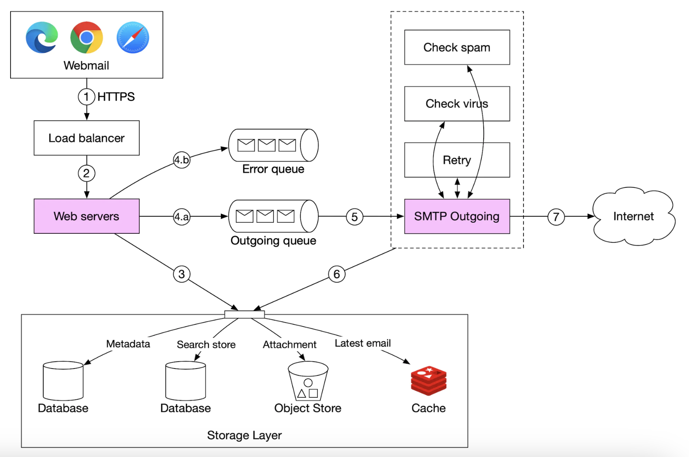
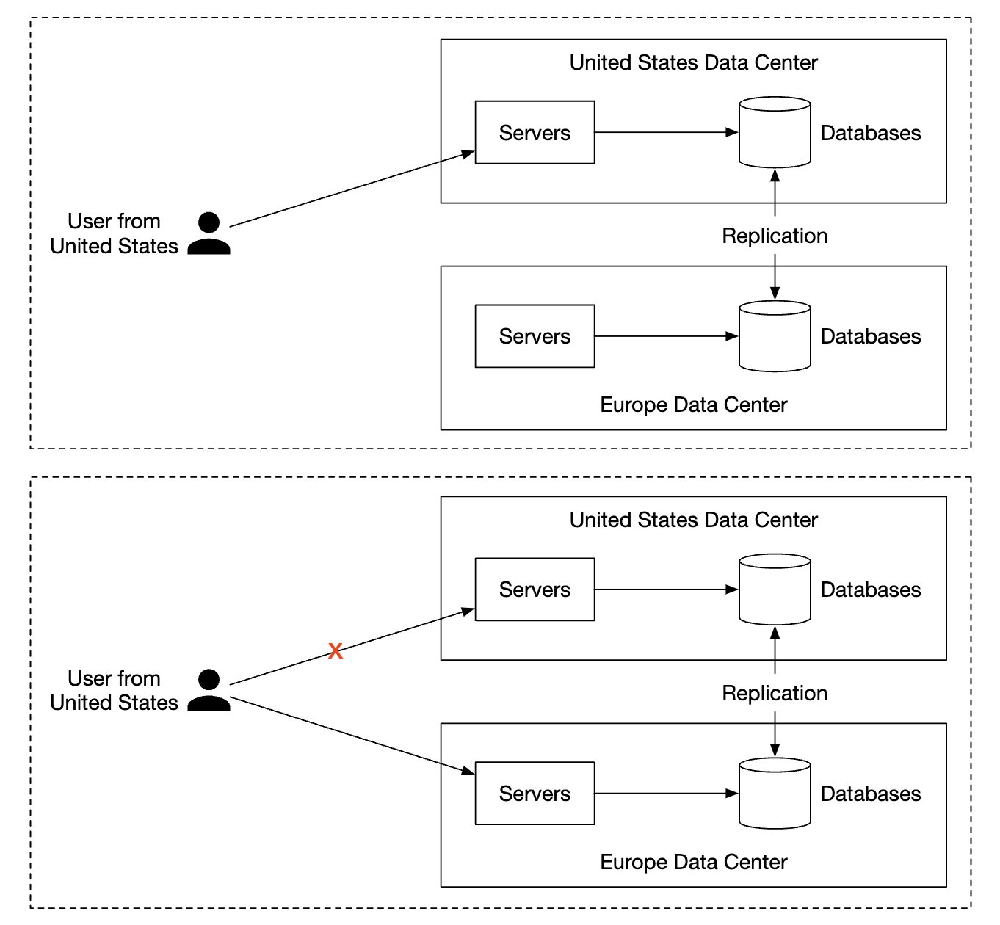

# 第 23 章：分布式邮件服务

> 原章节：Distributed Email Service · 原项目路径 `23. Distributed Email Service/`

## 本章导读

邮件协议比 HTTP 还老，为什么系统设计面试里还要专门考它？

因为邮件是**最苛刻的一类分布式系统练习题**。它同时要求：数据一封都不能丢（用户无法接受收件箱里少了一封合同邮件）、全球可用（发信人可能在任何一个机房）、扛得住 10 亿用户和每年两千 PB 量级的写入，还要**对抗一个永不休息的对手**——垃圾邮件发送者。

这一章会带你走一遍 Gmail 这个量级的邮件系统是怎么搭起来的。其中最有价值、也最容易被忽略的部分是**邮件送达率（Email Deliverability）**：让服务器"能发信"只要十分钟，让发出去的信"进得了收件箱"可能要花几个月。

学完这一章，你应该能回答：为什么 Gmail 不用普通关系型数据库存邮件？为什么你自己搭的邮件服务器发出去的信总是进垃圾箱？为什么邮件搜索不能写成 `SELECT ... WHERE body LIKE '%关键词%'`？

## 你将学到

- SMTP / IMAP / POP3 三种协议各自负责什么，为什么 IMAP 取代了 POP3
- MX 记录、附件 base64 编码这些邮件系统特有的基础知识
- 传统邮件服务器为什么扛不住规模，分布式邮件服务是怎么拆的
- 发信与收信两条完整链路的每一个环节，以及队列积压意味着什么
- 邮件元数据该怎么建模、怎么分片，为什么要把"已读/未读"拆成两张表
- **邮件送达率**：SPF / DKIM / DMARC 分别解决什么问题，新 IP 为什么会被当成垃圾邮件，硬退信和软退信怎么处理
- 反垃圾邮件的常见手段：贝叶斯过滤、发信人信誉、灰名单
- 全文搜索为什么要用倒排索引，以及 LSM-Tree 为什么适合写密集场景

---

## 1. 邮件系统的基本功：发送和接收是两个世界

在动手设计之前，必须先分清一件事：**"发邮件"和"收邮件"用的是完全不同的协议，解决的问题也完全不同。**

### 1.1 四个协议，各管一段

| 协议 | 全称 | 干什么 | 谁在用 | 默认端口 |
|---|---|---|---|---|
| **SMTP** | Simple Mail Transfer Protocol | **发送与中继**邮件 | 客户端 → 服务器（提交）、服务器 → 服务器（中继） | 25（中继）、587（提交）、465（隐式 TLS） |
| **POP3** | Post Office Protocol v3 | **收取**邮件，默认下载后从服务器删除 | 老式邮件客户端 | 110 / 995（TLS） |
| **IMAP** | Internet Message Access Protocol | **收取**邮件，邮件始终保留在服务器 | 现代邮件客户端、手机 | 143 / 993（TLS） |
| **HTTPS** | HyperText Transfer Protocol Secure | 不是邮件协议，但 Web 邮箱用它做 API | 浏览器里的 Gmail、Outlook Web | 443 |

这里有个初学者最容易搞混的点，务必记牢：

> **SMTP 只负责"送出去"，它不能"收进来"。**
> 你写好一封邮件点"发送"，SMTP 负责把这封信从你的客户端送到你的发信服务器，再由你的发信服务器送到对方的收信服务器。整个过程 SMTP 都在做同一件事：**把邮件从 A 推到 B**。
> 但收件人怎么"看到"这封信？那是 IMAP / POP3 / HTTPS 的活儿——客户端主动去服务器**拉取**。

所以完整的邮件生命周期是这样的：

```
发件人客户端 ──SMTP──▶ 发件方邮件服务器 ──SMTP──▶ 收件方邮件服务器
                                                        │
收件人客户端 ◀──IMAP / POP3 / HTTPS──────────────────────┘
```

### 1.2 为什么 IMAP 取代了 POP3

这是面试里常被追问的一个点，也是理解邮件系统演进的关键。

**POP3 的工作模型是"邮局自取"**：客户端连上服务器，把邮件**下载到本地**，然后（默认）从服务器上删掉。邮件的"状态"——哪些读过、哪些没读、分在哪个文件夹——全部保存在**客户端本地**。

在只有一台电脑、一个邮件客户端的年代，这没问题。但在今天：

- 你在手机上读了邮件，打开笔记本，**它还显示未读**；
- 你在笔记本上把邮件归档了，手机上**还在收件箱里**；
- 你换了台电脑，**历史邮件和文件夹全都不见了**；
- 服务器上根本没有"文件夹"这个概念，只有一堆邮件。

**IMAP 的工作模型是"邮局寄存"**：邮件始终留在服务器上，客户端只是"远程操作"这个邮箱。文件夹、已读/未读标记、星标、删除标记，**全部是服务端的持久状态**。于是：

- 任何设备打开，看到的都是**同一份邮箱状态**；
- 支持**只拉邮件头**（先在列表里看到标题和发件人，点开才拉正文），省流量，手机上尤其重要；
- 支持**服务端搜索**（不用把所有邮件下到本地再搜）；
- 支持 **IDLE 推送**（新邮件到达时服务器主动通知客户端，不用轮询）。

一句话总结：**POP3 把状态放在客户端，IMAP 把状态放在服务端。多设备时代，状态必须放在服务端。**

> **延伸**：IMAP 本身设计于 1980 年代，协议相当复杂（RFC 3501 有 100 多页，且客户端要处理各种服务器实现差异）。业界近年推出了 **JMAP（JSON Meta Application Protocol，RFC 8620/8621）** 作为现代替代品，用 JSON 和批量请求简化了移动端场景，Fastmail 等厂商已经在用。但 IMAP 的存量太大，短期内不会被取代。

### 1.3 MX 记录：别人怎么找到你的邮件服务器

域名 `gmail.com` 对应的 IP 是 Web 服务器的 IP，**但邮件不走这个 IP**。邮件有一套独立的寻址记录，叫 **MX 记录（Mail Exchanger Record）**。

MX 记录是 DNS 里的一条记录类型，告诉全世界："发给 `gmail.com` 的邮件，请投递到这几台服务器，优先级如下。"

<div align="center"></div>

一条 MX 记录长这样：

```
gmail.com.   MX   5    gmail-smtp-in.l.google.com.
gmail.com.   MX   10   alt1.gmail-smtp-in.l.google.com.
```

数字是**优先级（Preference）**，越小越优先。发信方会先尝试优先级 5 的服务器，连不上再退到 10。这就是邮件系统原生的**故障转移（Failover）**机制。

> **面试加分点**：SPF、DKIM、DMARC 这些反垃圾邮件机制，本质上也是 DNS 记录（TXT 类型），只是挂在不同的子域名上。所以**邮件系统的"配置面"几乎全在 DNS 里**。理解了这一点，你就理解了为什么邮件送达率问题通常表现为"DNS 配错了"。

### 1.4 附件：base64 编码和 25 MB 上限

邮件协议诞生于只能传 7 位 ASCII 文本的年代。要传二进制文件（图片、PDF），必须做编码，标准做法是 **base64**。

base64 用 4 个 ASCII 字符表示 3 个字节，所以**二进制数据编码后体积会膨胀约 33%**。

> 这也是为什么各大邮箱的"25 MB 附件上限"看起来总是不太够用——这个上限限制的通常是**编码后的报文大小**，而不是你原始文件的大小。

附件大小是可配置的，个人邮箱和企业邮箱的限制往往不同。

---

## 2. 传统邮件服务器：为什么它扛不住规模

理解了协议，我们看看"朴素"的邮件服务器是怎么做的。

<div align="center"></div>

流程很直观：

1. Alice 登录 Outlook，写好邮件，点击"发送"。邮件通过 **SMTP** 送到 Outlook 的邮件服务器。
2. Outlook 的服务器查询 DNS，找到 `gmail.com` 的 **MX 记录**，然后通过 **SMTP** 把邮件中继到 Gmail 的服务器。
3. Bob 通过 **IMAP 或 POP3** 从 Gmail 服务器上把邮件取下来。

### 存储方式：一封邮件一个文件

传统邮件服务器把邮件存在**本地文件系统**上，每封邮件是**一个独立的文件**。

<div align="center"></div>

在小规模下这套方案完全能用。但它有两个致命问题：

**问题一：磁盘 I/O 成为瓶颈。** 邮件是海量小文件。10 亿用户每天收发几百亿封邮件，意味着每秒几十万次文件创建、打开、读取、删除。机械硬盘的随机寻址能力（IOPS）只有 100～200 次/秒，这个量级根本扛不住。

**问题二：不满足高可用和可靠性要求。** 硬盘会坏，服务器会宕机。而邮件是用户**不允许丢失**的数据——一台机器挂了，上面所有用户的邮件就都没了。本地文件系统天然是单点。

> **这就是"单机方案"的典型死法**：不是功能做不出来，而是**规模一上来，I/O 和可用性同时崩掉**。

---

## 3. 高层设计：把邮件系统拆成可独立扩展的部件

分布式邮件服务器的设计目标是：**继续支持 IMAP / POP3（给原生客户端）和 SMTP（服务器间中继），同时为 Web 邮箱提供一套 RESTful API。**

为什么 Web 邮箱要用 HTTP 而不是 SMTP？原笔记给出的理由是**灵活性和可扩展性**：HTTP 生态成熟（负载均衡、缓存、鉴权、网关、监控都有现成方案），加新功能容易；而 SMTP 是为"传一封信"设计的，不适合做"列出文件夹""标记已读"这类操作。

### 3.1 API 设计示例

```
POST /v1/messages                     # 发送一封邮件给 To、Cc、Bcc 中的收件人
GET  /v1/folders                      # 返回某个账号的所有文件夹
GET  /v1/folders/{:folder_id}/messages  # 返回某文件夹下的邮件（分页）
GET  /v1/messages/{:message_id}       # 获取某封邮件的完整信息
```

`GET /v1/folders` 的响应大致是：

```json
[{
  "id": "string",       // 文件夹唯一标识
  "name": "string",     // 文件夹名
  "user_id": "string"   // 所属账号
}]
```

> **关于默认文件夹**：原笔记引用了 **RFC 6154**，指出标准默认文件夹可以取这几个名字：`All`、`Archive`、`Drafts`、`Flagged`、`Junk`、`Sent`、`Trash`。这个规范的意义是让**不同客户端对同一套服务端文件夹有一致的理解**——你在手机上归档的邮件，在网页版里也应该出现在 Archive 里。

`GET /v1/messages/{:message_id}` 的响应大致是：

```json
{
  "user_id": "string",                       // 所属账号
  "from":    {"name": "string", "email": "string"},   // 发件人
  "to":      [{"name": "string", "email": "string"}], // 收件人列表
  "subject": "string",                       // 主题
  "body":    "string",                       // 正文
  "is_read": true                            // 是否已读
}
```

### 3.2 组件清单

<div align="center"></div>

| 组件 | 职责 | 关键设计考量 |
|---|---|---|
| **Webmail** | 用户用浏览器收发邮件 | 前端，无状态 |
| **Web 服务器** | 对外提供请求/响应服务，处理登录、注册、用户资料等 | 无状态，可任意增删 |
| **实时服务器（Real-time Servers）** | 把新邮件**实时推送**给在线客户端 | 用 WebSocket；老浏览器降级为长轮询 |
| **元数据数据库** | 存主题、正文、发件人、收件人等邮件元数据 | 有状态，最难扩展的部分 |
| **附件存储** | 存大文件（附件） | 用对象存储（如 Amazon S3） |
| **分布式缓存** | 缓存最近邮件，提升体验 | Redis |
| **搜索存储** | 支持全文搜索 | 分布式文档存储（如 Elasticsearch） |

**为什么要拆出这么多独立存储？** 因为这几类数据的访问模式完全不同：元数据是"小、读多、要强一致"，附件是"大、写一次读多次、要便宜"，搜索索引是"写密集、读稀疏、要能全文匹配"。**把访问模式不同的数据放在一起，只能互相拖累**——这是后面反复出现的核心设计原则。

### 3.3 发信流程

<div align="center"></div>

1. 用户写好邮件，点"发送"。请求先到**负载均衡器**。
2. 负载均衡器做**限流**（防止有人狂发邮件），然后把请求路由到某台 Web 服务器。
3. Web 服务器做**基础校验**（比如邮件大小）。如果收件人和发件人**同域**，可以直接短路投递到本地邮箱——但**垃圾邮件检查还是要先做**。
4. 校验通过 → 邮件进入**消息队列**（附件在对象存储里，消息里只放引用）。校验失败 → 进**错误队列**。
5. **SMTP 出站工作进程（outgoing workers）** 从队列里取消息，做垃圾/病毒检查，然后通过 SMTP 中继到目标邮件服务器。
6. 邮件同时存入**"已发送"（Sent）文件夹**。

### 3.4 队列积压是一个重要的监控信号

原笔记专门强调了这一点：**要监控出站消息队列的长度**。队列持续增长通常意味着两种情况之一：

- **对方邮件服务器不可用**。这时应该**用指数退避（Exponential Backoff）重试**——比如等 1 分钟、5 分钟、30 分钟、2 小时……而不是疯狂重试。疯狂重试只会让对方更不愿意收你的信，也会拖垮你自己的队列。
- **消费者不够用**。处理速度跟不上生产速度，需要**扩容消费者**。

> **为什么指数退避这么重要？** 邮件是"延迟可接受、丢失不可接受"的业务。用户不会介意一封信晚到 5 分钟，但会介意它永远不到。所以重试策略必须**足够持久**：业界惯例是持续重试 24～72 小时，只有超过这个窗口才最终放弃并向发件人发退信通知。

### 3.5 收信流程

<div align="center"></div>

1. 外部邮件到达 **SMTP 负载均衡器**，分发到各台 **SMTP 服务器**。
2. SMTP 服务器执行**收信策略（mail acceptance policy）**——比如明显非法的邮件直接丢弃。这是**第一道反垃圾防线**，也是成本最低的一道：**在 SMTP 会话阶段就拒收，不要先把垃圾收下来再分析**（收下来要消耗存储和后续算力）。
3. 如果附件太大，直接放进**对象存储（S3）**，数据库里只存引用。
4. **邮件处理工作进程**做初步检查，然后把结果分别写入元数据存储、缓存、对象存储，并通知**实时服务器**。
5. **离线用户**重新上线时，通过 HTTP API 拉取新邮件。

> **注意收发两条链路的对称性**：都是"负载均衡 → 校验 → 队列/工作进程 → 多路写入"。区别在于发信是自己主动推给别人（要处理对方不可用），收信是别人推给自己（要处理恶意输入）。

---

## 4. 元数据数据库：本章最硬的设计题

邮件元数据是典型的"看起来简单、做起来极难"。

### 4.1 邮件元数据的五个特征

原笔记总结得很到位，这五条直接决定了后面的所有选型：

1. **邮件头（headers）通常很小，且访问极其频繁**——列表页要显示发件人、主题、时间。
2. **正文大小跨度极大，但通常只读一次**——点开看过就不会再看了（少数会被反复搜索）。
3. **绝大多数操作是"单用户隔离"的**——取邮件、标已读、搜索，都只涉及一个用户的数据，用户之间几乎不交叉。
4. **数据新鲜度影响使用**——用户几乎只读最近的邮件。
5. **可靠性要求极高**——数据丢失不可接受。

第 3 条是最关键的：**因为用户之间不交叉，我们天然可以按 `user_id` 分片，把同一个用户的所有数据放在同一个分片上。** 这让"跨分片查询"这个分布式系统最大的噩梦，在这里几乎不存在。

### 4.2 数据库选型：三个方案都不完美

| 方案 | 优点 | 致命缺点 |
|---|---|---|
| **关系型数据库** | 可以为邮件头和正文建索引 | 为"小数据块"优化，正文这种大字段会拖垮性能；单机容量有上限 |
| **分布式对象存储** | 适合做备份存储 | **无法高效支持搜索、"标记已读"这类操作**——它只会"按 key 取整个对象" |
| **NoSQL（如 Bigtable）** | Gmail 用的就是 Google BigTable | **没有开源版本**，拿不到 |

结论是：**市面上几乎没有现成方案能完美匹配**。Gmail / Outlook 这个量级，数据库往往是**自研**的，核心目标之一是**降低 IOPS**。

> **面试技巧**：面试官不会真的让你设计一个分布式数据库。原笔记说得很实在——**"面试中设计一个新分布式数据库是不现实的，但说清楚它应该具备什么特性是加分的。"**

原笔记列出的五个特性值得背下来：

- 单个列（column）可以到**个位数 MB** 级别（因为邮件正文可能很大）
- **强一致性**
- **为降低磁盘 I/O 而设计**
- **高可用、容错**
- **支持方便的增量备份**

### 4.3 数据建模：主键的两段式设计

分片键选 `user_id`，让一个用户的数据落在同一个分片上。

> **代价**：这样就没法让**多个人共享同一封邮件**（比如同一封邮件同时属于发件人和收件人的邮箱）。原笔记明确说，这个需求不在本题范围内，可以接受。

**主键由两部分组成**：

- **分区键（Partition Key）**：决定数据落在哪个分片（数据分布）。
- **聚类键（Clustering Key）**：决定同一个分区内数据的排序方式。

图例说明：

<div align="center"></div>

**folders 表**：

<div align="center"></div>

**emails 表**：

<div align="center"></div>

其中 `email_id` 是 **TIMEUUID** 类型——一种把时间戳编码进去的 UUID。这样**按 `email_id` 排序就等于按邮件创建时间排序**，不需要额外的 `created_at` 字段和二级索引。这是一个很实用的技巧。

**attachments 表**：附件单独建表，用文件名标识。

<div align="center"></div>

### 4.4 已读/未读：一个典型的"反范式化"取舍

在关系型数据库里，"查所有未读邮件"是一句 `WHERE is_read = false` 就搞定的事。但在 Cassandra 这类宽列数据库里**做不到**——它**禁止在非分区键、非聚类键的列上做过滤**。

> 这背后是 Cassandra 的设计哲学：**查询必须"顺着数据的物理存储顺序走"**，不允许全表扫描。好处是每次查询都极快、可预测；代价是**你必须为每一种查询模式预先设计一张表**。

原笔记提到的"workaround"是"把一个文件夹的所有邮件取出来在内存里过滤"——**这在规模稍大的应用里完全不可行**：一个用户可能有几十万封邮件，每次都全量拉出来过滤，内存和网络都会被吃光。

正确做法是**反范式化（De-normalization）**：把 emails 表按"已读/未读"拆成两张表。

<div align="center"></div>

> **这就是 NoSQL 世界的基本功**：**用存储冗余换查询性能**。同一封邮件的信息存了两份，标记已读时要从一张表删掉、往另一张表插入（或者更新状态字段）。听起来浪费，但换来的是"取未读邮件"变成一次分区内顺序扫描，快得毫无悬念。
> 关系型数据库用 JOIN 和索引解决这类问题；NoSQL 用"多写一份"解决。**没有免费的午餐，只是把成本从"查询时"挪到了"写入时"。**

### 4.5 会话线索（Conversation Threads）

Gmail 的"会话视图"（把一来一回的邮件折叠成一条线）靠的是邮件头里的三个字段：

```json
{
  "headers": {
    "Message-Id":  "<7BA04B2A-430C-4D12-8B57-862103C34501@gmail.com>",
    "In-Reply-To": "<CAEWTXuPfN=LzECjDJtgY9Vu03kgFvJnJUSHTt6TW@gmail.com>",
    "References":  ["<7BA04B2A-430C-4D12-8B57-862103C34501@gmail.com>"]
  }
}
```

- `Message-Id`：这封邮件自己的唯一标识。
- `In-Reply-To`：这封邮件回复的是哪一封。
- `References`：整条会话的祖先链。

**服务端只负责原样保存这些头**，由**邮件客户端**去解释它们、重建出会话树。这样服务端逻辑简单，客户端也灵活（不同客户端可以有不同的折叠策略）。

### 4.6 一致性取舍：宁可短暂不可用

原笔记在这里做了一个明确的选择：**"trade availability for consistency"**——为了强一致，牺牲可用性。

理由是邮件元数据（尤其是"已读/未读""已发送"这类状态）**不一致的代价很高**：用户刚发的邮件如果"已发送"文件夹里看不到，会以为发送失败，然后重发一遍。

所以当发生**故障转移（Failover）或网络分区（Network Partition）**时，受影响用户的操作会**短暂不可用**，而不是返回可能过期的数据。

> **用 CAP 的语言说**：这是一个 **CP 系统**。对比一下第 21 章（类似 Google 搜索）和第 20 章（监控告警），你会发现**同一个架构模式在不同业务约束下会做出完全相反的选择**——这就是系统设计的核心：**没有最优解，只有最合适的取舍**。

---

## 5. 邮件送达率：本章最实用的一节

这是原笔记写得最浅、但**工程价值最高**的部分。它只用了半页列了六条建议，我们就着这六条，把背后的机制讲透。

### 5.1 "发送成功"不等于"送到了"

先建立一个关键认知：**SMTP 返回 `250 OK`，只表示对方服务器"收下了"这封信，不表示用户能在收件箱里看到它。**

对方的邮件服务器可以在三个位置做拦截：

1. **SMTP 会话阶段**：直接回 `4xx`（临时拒绝，你稍后重试）或 `5xx`（永久拒绝，别再试了）。
2. **收下之后、投递之前**：扔进垃圾箱（Junk）或"推广"标签页。
3. **静默丢弃（Blackhole）**：收下了，什么都不回，也不投递。这是最恶劣的情况——你**根本不知道自己被拦了**。

所以"送达率"是一个**观测难题**：你只能通过退信率、投诉率、以及各家邮箱提供的**发件人信誉面板**（如 Google Postmaster Tools）来间接判断。

### 5.2 三层身份验证：SPF、DKIM、DMARC

这三个词是送达率的核心，也是初学者最容易混成一团的地方。先用一个类比建立直觉：

> - **SPF** 是**门卫核对车牌**：这辆车（IP）是不是登记在册、允许代表这个小区送快递？
> - **DKIM** 是**包裹上的防拆封条**：包裹在运输途中有没有被打开过？封条上的签名是不是寄件人的？
> - **DMARC** 是**你留给门卫的处理规则**：车牌和封条都对不上时，你是要门卫直接拒收、先扣下来检查，还是照收但写份报告给你？

#### SPF（Sender Policy Framework，发件人策略框架）

你的域名在 DNS 里发布一条 TXT 记录，声明**哪些 IP 有资格代表这个域名发信**：

```
example.com.  TXT  "v=spf1 ip4:203.0.113.0/24 include:_spf.google.com -all"
```

接收方收到邮件时，检查**发起 SMTP 连接的来源 IP** 是否在列表里：

- `ip4:203.0.113.0/24`：授权这个 IP 段。
- `include:_spf.google.com`：把 Google 的 SPF 记录整个包含进来（用第三方代发邮件时必须写）。
- `-all`：**不在列表里的一律拒绝**（`~all` 是"软失败"，只标记不拒绝；`-all` 是硬失败，强烈建议用这个）。

**SPF 的局限**：

- 它校验的是**信封发件人（Envelope From / Return-Path）**，不是用户在邮件客户端里看到的 `From:` 头。两者可以不一致——这正是伪造邮件的空间。
- **邮件被转发后会失效**。你发给 A，A 自动转发给 B，此时发信 IP 变成了 A 的服务器，不在你的 SPF 里，校验必然失败。

#### DKIM（DomainKeys Identified Mail，域名密钥识别邮件）

发送方用**私钥**对**选定的邮件头 + 正文**做签名，把签名附在邮件头里；**公钥**发布在 DNS 上：

```
selector1._domainkey.example.com.  TXT  "v=DKIM1; k=rsa; p=MIGfMA0GCS..."
```

接收方拿到邮件后，用 DNS 里的公钥**验签**。

**DKIM 证明两件事**：

1. 这封邮件确实是由**持有该域名私钥**的一方发出的；
2. 被签名的部分（指定的头 + 正文）在传输过程中**没有被篡改**。

**DKIM 的关键优势**：签名**跟着邮件走**。邮件被转发时，只要被签名的部分没被修改，验签依然通过——这正好补上了 SPF 的短板。

#### DMARC（Domain-based Message Authentication, Reporting & Conformance）

DMARC 记录发布在 `_dmarc.<你的域名>`，它做三件事：

**第一，对齐检查（Alignment）。** 这是 DMARC 最核心的价值。它要求**用户在邮件客户端里看到的 `From:` 域名**，必须与 SPF 或 DKIM 通过验证的域名**一致**。

> 为什么需要对齐？因为攻击者可以这样做：用**自己的域名**（`evil.com`）发信，SPF 和 DKIM 全都合法通过，但把 `From:` 头写成 `yourbank.com`。没有 DMARC 的话，接收方看到 SPF/DKIM 都通过了，就可能放行——用户看到的是"来自 yourbank.com"，实际却是 `evil.com` 发的。**DMARC 的对齐检查专门堵这个漏洞。**

**第二，失败处理策略。** 通过 `p=` 参数告诉接收方，验证失败时怎么办：

| 策略 | 含义 | 适用阶段 |
|---|---|---|
| `p=none` | 只观察，不做处置（但会发报告给你） | 上线初期，先摸底 |
| `p=quarantine` | 扔进垃圾箱 | 观察一段时间、确认无正常邮件被误伤后 |
| `p=reject` | 直接拒收 | 最终目标状态 |

**第三，报告机制。** 接收方会定期把验证结果回传给你：

- **聚合报告（Aggregate Report, RUA）**：每天一份 XML，汇总"有多少封邮件通过了 SPF/DKIM、来源 IP 是哪些"。这是**排查"谁在用我的域名发信"的唯一手段**。
- **取证报告（Forensic Report, RUF）**：单封邮件的详细信息，但涉及隐私，很多 ISP 不提供。

**三者的关系一句话总结**：

> **SPF 管 IP，DKIM 管内容，DMARC 管决策和报告。**

只有 SPF + DKIM 而没有 DMARC，攻击者依然能伪造你的显示名；只有 DMARC 而没有前两者，DMARC 就没有可判定的依据。**三个必须一起上。**

> **2024 年的行业硬性要求（重要更新）**
>
> 从 **2024 年 2 月**起，Google 和 Yahoo 对**批量发信人**（每天向 Gmail 发送 5000 封以上）提出了强制要求：
>
> 1. 必须配置 **SPF 和 DKIM**；
> 2. 必须有 **DMARC 记录**（最低 `p=none`）；
> 3. 必须支持**一键退订（One-Click Unsubscribe，RFC 8058）**；
> 4. **垃圾邮件投诉率必须控制在 0.3% 以下**（Google 给出的建议目标是 0.1% 以下）。
>
> 这意味着 SPF/DKIM/DMARC 已经从"最佳实践"变成了"不做就进垃圾箱"的准入门槛。**这是原笔记写作时（2021 年前后）还不存在的行业变化**，见文末勘误。

### 5.3 邮件为什么会进垃圾箱

身份验证只是入场券。通过 SPF/DKIM/DMARC 之后，接收方还会用一整套信号来判断你是不是垃圾邮件发送者：

| 信号类别 | 具体内容 |
|---|---|
| **IP 信誉** | 你这个发信 IP 的历史表现。用共享 IP 时，**同一个 IP 上其他发信人的劣迹会算到你头上** |
| **域名信誉** | 域名注册多久了、历史投诉率如何。新注册的域名天然低分 |
| **内容特征** | 垃圾邮件常见词、过多的链接、纯图片无文字、畸形的 HTML、可疑的短链接 |
| **用户互动** | 收件人是否打开、是否回复、是否移动邮件。**"用户从不打开"本身就是负面信号** |
| **投诉率** | 用户点"举报垃圾邮件"的比例。这是**最重的负面信号** |
| **退信率** | 无效地址比例过高，说明你在群发未验证的名单 |
| **垃圾陷阱（Spam Trap）** | ISP 故意放出的"废弃地址"。**正常用户永远不会给这些地址发信**——你发了，就说明你在买名单或者从不清理列表 |

> **一个反直觉的结论**：**"发送量"本身不是问题，"发送量突然暴增"才是问题。** 一个每天稳定发 100 万封、投诉率 0.02% 的域名信誉会很好；一个昨天发 0 封、今天发 50 万封的新域名，几乎必进垃圾箱。接收方看的是**行为模式的一致性**。

### 5.4 IP 预热（IP Warming）

这是原笔记提到但没解释的一条，非常关键。

**问题**：一个全新的 IP 地址**没有任何历史记录**。如果你拿到新 IP 的第一天就群发 100 万封，接收方的风控模型会看到"一个完全陌生的 IP，突然产生巨量投递"——这正是垃圾邮件发送者换 IP 后的典型行为。**结果就是直接进垃圾箱，甚至被拉黑。**

**解法：IP 预热。** 逐步增加从这个 IP 发出的邮件量，让它慢慢积累正面信誉：

| 阶段 | 每天发送量（示意） | 发给谁 |
|---|---|---|
| 第 1 周 | 几百 ~ 几千 | **最活跃、最可能打开邮件的那批用户** |
| 第 2～3 周 | 几万 | 逐步扩大到较活跃用户 |
| 第 4～6 周 | 几十万 → 全量 | 全部用户 |

原笔记给的"**2 到 6 周**"就是这个过程的典型时长。

**预热的两个要点**：

1. **优先发给高互动用户**。因为他们大概率会打开、点击，这些正面互动会被记入 IP 信誉。
2. **预热期不要中断**。连续几天不发信，会让刚积累的信誉"凉掉"。

### 5.5 退信处理：硬退信必须自动清理

原笔记完全没提这一节，但它是**最容易把域名信誉搞死的地方**。

退信（Bounce）分两类，处理方式完全不同：

| 类型 | 英文 | 含义 | 典型 SMTP 状态码 | 处理方式 |
|---|---|---|---|---|
| **硬退信** | Hard Bounce | **永久性失败**：地址不存在、域名不存在、收件人已注销 | `550 5.1.1`（用户不存在）、`550 5.1.2`（域名不存在） | **立即从名单中永久移除** |
| **软退信** | Soft Bounce | **临时性失败**：邮箱已满、对方服务器过载、邮件太大、被限流 | `452 4.2.2`（邮箱满）、`421 4.7.0`（临时限流） | **指数退避重试**；连续失败 N 次后转为硬退信处理 |

**状态码的通用规则**：**`4xx` 开头 = 临时失败（软），`5xx` 开头 = 永久失败（硬）。** 这个规则在所有 SMTP 实现里通用，记住它能省很多事。

**为什么必须自动清理硬退信地址？**

因为**持续向不存在的地址发信，是垃圾邮件发送者的典型特征**。正规的发信方会维护干净的名单，垃圾邮件发送者不会（他们的名单是买来的、过期的）。所以：

> 如果同一个地址连续硬退信，而你还在继续发——接收方会认定你在群发未验证名单，**你的域名信誉会快速下滑，最终所有邮件都进垃圾箱**。

工程上的做法是：把退信处理做成一个**自动化的反馈闭环**——收到 DSN（Delivery Status Notification，投递状态通知）退信邮件后，解析状态码，`5xx` 直接加入抑制名单（Suppression List），`4xx` 进入重试计数，超过阈值后也加入抑制名单。

**还有一个配套机制：反馈环（Feedback Loop, FBL）。** 当用户点"举报垃圾邮件"时，部分 ISP 会通过 **ARF（Abuse Reporting Format）** 把投诉回传给你。收到投诉后应当**立即停止向该用户发信**——继续发只会让投诉率上升。

### 5.6 原笔记六条建议的逐条解读

现在回头看原笔记列出的六条，每一条都能对上上面的原理：

1. **使用专用 IP（Dedicated IPs）**——共享 IP 的信誉不受你控制，别人的劣迹会连累你。（但有例外，见勘误 3）
2. **对邮件分类发送（Classify emails）**——**不要把营销邮件和事务性邮件（密码重置、订单确认）混在同一个 IP 上发**。营销邮件的投诉率天然更高，会拖累事务性邮件的送达率。业界标准做法是按**邮件流（Mail Stream）**拆分 IP。
3. **缓慢预热 IP（Warm up your IP address）**——见 5.4 节，需要 2～6 周。
4. **快速封禁垃圾邮件发送者（Ban spammers quickly）**——如果你的平台上有人用你的服务群发垃圾邮件，**你的域名信誉会被他们拖垮**。必须快速识别并封禁。
5. **处理反馈（Feedback processing）**——与 ISP 建立反馈环，跟踪投诉率，及时处理。
6. **邮件身份验证（Email authentication）**——也就是 SPF / DKIM / DMARC。

原笔记最后那句"你不需要记住所有细节，只要知道搭建一个好邮件服务器需要大量领域知识"，说得非常实在。**这就是为什么绝大多数公司选择用第三方邮件服务（SendGrid、SES、Postmark 等）而不是自建——难点不在技术，在信誉运营。**

---

## 6. 反垃圾邮件：接收方的视角

上一节讲的是"怎么让自己的邮件不被当成垃圾"，这一节反过来讲"**怎么判断别人的邮件是不是垃圾**"。原笔记几乎没写这部分，但对设计邮件系统来说是必须的。

### 6.1 分层拦截

工业界的反垃圾邮件是**分层**的，越靠前成本越低：

| 层次 | 手段 | 成本 | 效果 |
|---|---|---|---|
| **连接层** | IP 黑名单（DNSBL）、SPF 校验、连接频率限制 | 极低 | 拦住大量低级垃圾 |
| **协议层** | 灰名单（Greylisting）、DKIM 验签、DMARC 策略 | 低 | 拦住自动化群发 |
| **内容层** | 贝叶斯过滤、规则评分、URL 黑名单、附件扫描 | 中 | 拦住内容型垃圾 |
| **信誉层** | 发信人/域名/IP 历史信誉打分 | 中 | 长期有效性最好 |
| **用户层** | 用户主动举报、手动加入黑名单 | 高（需人工） | 最准确，用于训练上层模型 |

**关键原则：能在连接层拦住的，绝不留到内容层。** 因为内容分析要消耗 CPU、要存储，还要面对无穷无尽的变形。

### 6.2 贝叶斯过滤（Bayesian Filtering）

这是内容层最经典的算法，也是初学者最该理解的一个。

**核心思想**：把邮件看成"词（token）的集合"，用**朴素贝叶斯**判断它属于垃圾邮件的概率。

训练阶段：统计每个词在垃圾邮件和正常邮件里出现的频率。

```
P(垃圾 | 词) = P(词 | 垃圾) × P(垃圾) / P(词)
```

举例：如果"中奖"这个词在垃圾邮件里出现的概率是 80%，在正常邮件里是 0.1%，那么一封包含"中奖"的邮件是垃圾的概率就很高。把邮件里所有词的判定结果按朴素贝叶斯的独立性假设组合起来，就得到整封邮件的垃圾概率。

**为什么它有效？** 因为它是**自适应**的——每个用户的正常邮件和垃圾邮件特征都不同（你收的"正常邮件"和别人收的不一样），贝叶斯过滤可以为**每个用户单独训练模型**。

**实践中的三个关键点**：

1. **需要训练数据**。用户点"举报垃圾"就是最好的训练样本；点"这不是垃圾"是反向样本。所以**用户反馈本身就是反垃圾系统的一部分**。
2. **要处理"词的概率极端值"**。如果某个词只在垃圾邮件里出现过（比如一次），概率会是 100%，这不可靠。工程上会给每个词一个**最小样本数阈值**和**概率上下限**（比如限制在 0.01～0.99 之间）。
3. **它会被"贝叶斯投毒"攻击**。垃圾邮件发送者会故意在垃圾邮件里塞大量正常词汇（比如从新闻网站抓的段落），污染训练数据。所以现代系统**不会只用贝叶斯**，而是把它作为多信号中的一个。

> **历史背景**：贝叶斯过滤在 2002 年由 Paul Graham 的《A Plan for Spam》一文推广开来，随后被 SpamAssassin、SpamBayes 等开源项目采用，一度把垃圾邮件拦截率从 80% 提升到 99% 以上。这是反垃圾邮件史上最重要的技术转折之一。

### 6.3 发信人信誉（Sender Reputation）

贝叶斯过滤的是"内容"，信誉系统过滤的是"发信人"。

**核心思想**：**一个长期发送正常邮件的 IP / 域名，比一个陌生 IP 更可信。** 这和第 5.4 节的 IP 预热是同一套逻辑的两面。

信誉分的输入信号包括：

- 历史投诉率、退信率
- 是否通过 SPF/DKIM/DMARC
- 邮件量随时间的变化曲线（突然暴增 = 可疑）
- 是否出现在**垃圾陷阱（Spam Trap）**的收件记录里
- 域名年龄（新域名 = 低分）
- 是否被**实时黑名单（DNSBL，如 Spamhaus）**收录

> **注意一个容易被忽略的事实**：**域名信誉比 IP 信誉更难"洗白"。** 换一个 IP 相对便宜，但域名一旦被标记为垃圾来源，往往需要几个月甚至永久无法恢复。所以正规发信方宁愿多花钱做预热，也不愿冒险把域名搞脏。

### 6.4 灰名单（Greylisting）

这是最简单、最"优雅"的一个反垃圾技巧，原理一句话就能说清：

> **对来自陌生发信人的邮件，先临时拒绝，让它过几分钟再试一次。**

具体流程：

1. 收到一封来自陌生三元组 **（发信 IP、发信地址、收信地址）** 的邮件；
2. 返回 `4xx` 临时错误（比如 `450 4.7.1 Please try again later`）；
3. 记下这个三元组，允许它在**几分钟后**重新投递；
4. 如果它真的重试了，就放行并把它加入白名单，以后不再拦截。

**为什么有效？** 因为**正规的邮件服务器（MTA）严格遵守 SMTP 规范，收到 `4xx` 会按退避策略自动重试**（通常几分钟到几小时）；而**绝大多数垃圾邮件发送机器人为了效率，收到拒绝就直接放弃了**，不会重试。

**代价**：邮件会**延迟几分钟到几十分钟**。所以灰名单适合用在"反垃圾优先、延迟可接受"的场景，很多企业邮箱网关会默认开启。

> **为什么这条对初学者特别有价值？** 因为它体现了系统设计里一个常见思路：**利用"正规系统会遵守协议、攻击者不会"这个不对称性来区分两者。** 类似的思路还有：要求客户端执行一个计算量很小的挑战（防爬虫）、要求 TCP 三次握手完整（防 SYN Flood）。**攻击者的成本优势，往往来自"省掉正常流程"——那就把正常流程变成必答题。**

### 6.5 一个完整的反垃圾判断流程

把上面这些串起来，一封外部邮件的处理大致是：

```
建立 SMTP 连接
  ├─ IP 在 DNSBL 黑名单里？        → 直接拒收（5xx）
  ├─ 该 IP 连接频率异常？           → 限流或拒收
  ├─ 陌生三元组？                   → 灰名单临时拒绝（4xx）
  └─ 通过 ↓
SMTP 会话
  ├─ SPF 校验失败？                 → 标记 / 拒收
  ├─ DKIM 验签失败？                → 标记
  └─ DMARC 策略 = reject 且验证失败？ → 拒收（5xx）
  └─ 通过 ↓
收下邮件
  ├─ 查发信人信誉分                 → 低分则提高后续阈值
  ├─ 贝叶斯内容分析                 → 垃圾概率
  ├─ 规则评分（SpamAssassin 类）    → 累加得分
  ├─ URL / 附件扫描                 → 恶意链接、病毒
  └─ 综合评分
       ├─ 高分 → 投进垃圾箱
       └─ 低分 → 投进收件箱
用户行为
  └─ 举报 / 标记非垃圾 → 反哺训练模型与信誉系统
```

---

## 7. 搜索：为什么不能用 `LIKE '%关键词%'`

邮件搜索要支持**全文搜索**（在正文里找词），以及**结构化过滤**（按发件人、收件人、主题、未读状态筛）。

### 7.1 邮件搜索和网页搜索有什么不同

原笔记的这张对比表很精辟：

| | 范围 | 排序方式 | 准确性要求 |
|---|---|---|---|
| **Google 搜索** | 整个互联网 | 按**相关度**排序 | 索引需要时间，结果不必即时 |
| **邮件搜索** | 用户自己的邮箱 | 按**属性**排序（时间、日期等） | 索引要快，结果要准确 |

差异的根源在于**数据规模和用户预期**：

- 网页搜索面对的是"无数个可能的答案"，所以**相关度排序**是核心；用户能接受"结果里没有我要的"。
- 邮件搜索面对的是"**我自己的、确定存在的那封信**"，所以**召回率必须高**——用户知道那封邮件就在那儿，搜不到就是你的问题。同时**排序主要靠时间**（最近的最可能有用），相关度反而是次要的。

> 原笔记还提到一个容易被忽略的特征：**邮件搜索的索引写入量远大于查询量**。因为每收一封新邮件、每标记一次已读，索引都要更新；而用户真正点开搜索框的次数很少。**这是一个典型的写密集、读稀疏场景**——这个特征直接决定了后面索引结构的选择。

### 7.2 为什么关系型数据库的 `LIKE` 不行

初学者最容易想到的方案是：

```sql
SELECT * FROM emails
WHERE user_id = '123'
  AND body LIKE '%合同%';
```

**这在生产环境是不可接受的**，原因有四个：

1. **前导通配符会让索引完全失效。** B+ 树索引是按**前缀**有序排列的。`LIKE '合同%'`（前缀固定）还能用索引；`LIKE '%合同%'`（前缀未知）只能**全表扫描**——把每一行都读出来做字符串匹配。
2. **复杂度是 O(N)。** 一个用户有 10 万封邮件，每封平均 50 KB 正文，一次搜索要扫描 5 GB 数据。用户等不了，数据库也扛不住。而且这是**每个用户各自**的开销，10 亿用户意味着随时可能有几万次全表扫描同时在跑。
3. **无法排序、无法打分。** 全文搜索需要"哪封邮件最相关"的概念（词频、字段权重、位置邻近度），`LIKE` 只会返回"匹配 / 不匹配"。
4. **无法处理语言的复杂性。** 中文需要分词（"北京大学"要能切成"北京/大学"），英文需要词干还原（"running" 和 "run" 应该匹配），还有同义词、拼写纠错。`LIKE` 对这些一无所知。

### 7.3 正确方案：倒排索引（Inverted Index）

**正排索引**是"文档 → 包含哪些词"，**倒排索引**反过来："词 → 出现在哪些文档里"。

```
正排：doc1 → [合同, 甲方, 乙方, 签署]
      doc2 → [合同, 到期, 续签]

倒排：合同 → [doc1, doc2]
      签署 → [doc1]
      续签 → [doc2]
```

搜索"合同"时，只需要查一次词典拿到 posting list `[doc1, doc2]`，复杂度接近 **O(1)**，而不是 O(N) 全表扫描。

**索引的构建流程**：

```
原始邮件
  ↓ ① 分词（Tokenization）      中文用分词器，英文按空格和标点切
  ↓ ② 归一化（Normalization）   转小写、词干还原（running → run）、去停用词（the、的）
  ↓ ③ 构建词典 + posting list   记录词出现在哪些文档、哪个位置、出现几次
  ↓ ④ 落盘                      分段存储 + 压缩（增量编码、跳表）
```

**查询时**：

```
查询词 → 分词 → 归一化 → 查词典 → 取 posting list → 求交集 → 打分排序 → 返回
```

位置信息（词在文档中的偏移）让**短语查询**（"系统 设计"必须相邻）成为可能，词频信息让**相关度打分**（TF-IDF / BM25）成为可能。

### 7.4 增量索引：怎么让新邮件立刻可搜

**问题**：全量重建索引在邮件场景不可行（用户刚收到的邮件必须马上能搜到），所以需要**增量索引**。

原笔记给出的方案是：

<div align="center"></div>

- 用 **Elasticsearch 集群**做搜索存储，**用 `user_id` 作为分区键**，让同一个用户的数据落在同一个节点上（这样查询天然局部化，不需要跨节点聚合）。
- **写操作（索引更新）通过 Kafka 异步进行**，把业务服务和重建索引流程**解耦**。
- **查询是同步的**——用户点了搜索，必须立刻拿到结果。

> **为什么写入要用 Kafka 异步？** 因为索引写入比查询慢得多，而且是"可延迟"的。如果同步做，用户点"发送"要等索引写完才能返回，体验会很差；更糟的是，如果搜索服务挂了，**发邮件这个核心功能也会跟着挂**。用消息队列解耦后，搜索服务故障只会导致"暂时搜不到新邮件"，不会影响收发。
> 这个模式在整本书里反复出现：**把"必须成功"的核心链路和"可以延迟"的辅助链路分开。**

**异步索引的代价：准实时（Near-Real-Time）。** 新邮件到达后到能被搜到，中间有几秒的窗口期（Elasticsearch 默认 `refresh_interval` 是 1 秒，加上 Kafka 消费延迟）。**这是可以接受的**——用户不会在发出邮件后的 1 秒内就去搜索它。

### 7.5 Elasticsearch 还是自研？

原笔记做了这个对比，值得保留：

| 维度 | Elasticsearch | 自研搜索引擎 |
|---|---|---|
| **扩展性** | 能扩展到相当规模 | 可以针对邮件场景深度优化，理论上限更高 |
| **运维成本** | 是**独立于元数据库之外的另一个服务**，要单独维护 | 可以和数据存储**合二为一**，少维护一套系统 |
| **开发成本** | 开箱即用 | **需要大量工程投入** |

**结论**：绝大多数团队应该选 Elasticsearch。自研只在"规模大到 ES 撑不住、且团队有足够搜索工程能力"时才值得考虑（Gmail 这个量级）。

> **一个需要限定的说法**：原笔记说"Elasticsearch scales to some extent（只能扩展到一定程度）"——这个表述**容易误导**。Elasticsearch 在生产环境里可以支撑**几十到上百节点的集群、PB 级数据**，很多大型企业就是这么用的。真正的取舍不是"ES 撑不大"，而是：**ES 是一个独立的有状态服务，你要为它付出额外的运维成本（集群管理、分片规划、rebalance、版本升级），并且它的资源开销不小。** 详见文末勘误。

### 7.6 自研方案的核心挑战：LSM-Tree

如果真要自研，原笔记指出了一个**核心挑战：为写密集（write-heavy）负载做优化**。

**为什么写密集是难点？** 因为传统的 B+ 树索引**是"原地更新"的**——更新一条记录要在磁盘的随机位置改写一个页。机械硬盘的随机写只有 100～200 IOPS，这是硬瓶颈。

**解法是 LSM-Tree（Log-Structured Merge-Tree，日志结构合并树）**，核心思想一句话：

> **所有写入都变成顺序追加，绝不做原地修改。**

工作流程：

1. 写入先进入内存中的有序结构（**MemTable**），同时追加写 **WAL（预写日志）** 保证崩溃不丢。
2. MemTable 达到阈值后，**整体顺序刷盘**，生成一个不可变的 **SSTable（Sorted String Table）**。
3. 后台**合并（Compaction）** 把多个 SSTable 归并成更大的有序文件，顺带清理已删除和过期的数据。
4. 读取时依次查 MemTable → 最近的 SSTable → 更老的 SSTable，用**布隆过滤器**快速跳过"肯定不含目标 key"的文件。

<div align="center"></div>

**为什么 LSM-Tree 适合邮件索引？**

- **写入全是顺序 I/O**，吞吐量比随机写高一个数量级；
- **天然适配"追加 + 批量合并"的索引更新模式**；
- **写入放大可以通过分层合并控制**。

**代价**：

- **读会变慢**（可能要查多个层级，用布隆过滤器缓解）；
- **写放大**（同一份数据会被反复合并重写）；
- **合并过程会占用磁盘 I/O**，需要精细调参。

**工业实现**：**Cassandra、Bigtable、HBase、RocksDB、LevelDB** 全都基于 LSM-Tree。这也解释了为什么邮件元数据存储（Cassandra）和搜索索引可以用同一套底层技术——**它们的写入模式是相似的**。

---

## 8. 可扩展性与可用性

### 8.1 为什么邮件系统"容易"水平扩展

原笔记在这里点出了一个关键性质：**因为单个用户的操作不会和其他用户冲突，绝大部分组件都可以独立扩展。**

- 用户 A 收邮件，和用户 B 发邮件，**互不影响**；
- 数据按 `user_id` 分片后，**每个分片的负载天然均衡**（用户之间没有热点交叉）；
- Web 服务器、SMTP 服务器、工作进程都是**无状态**的，加机器就行。

> 这是"用户隔离型系统"的共同优势。对比一下第 21 章（类似 Google 搜索）——那里所有用户查的是**同一份全网索引**，天然有热点；而邮件系统里，**每个用户就是一个独立的小世界**。这就是为什么邮件系统在分片问题上比社交系统简单得多。

### 8.2 多数据中心与故障转移

为了高可用，需要**多数据中心（Multi-DC）**部署，并支持**主从故障转移（Leader-Follower Failover）**。

<div align="center"></div>

> **术语说明**：原笔记用的是 "leader-follower"，这正是我们推荐的现代术语（详见第 1 章勘误）。邮件系统里的每个用户数据只在一个 DC 有主副本，其他 DC 是跟随副本；主副本所在 DC 故障时，提升另一个 DC 的副本。

---

## 9. 收尾：还有哪些值得聊的话题

原笔记在 Step 4 列了几个可以继续展开的方向，这些也是面试里很好的"主动加分点"：

- **容错（Fault Tolerance）**：系统里很多部件都可能故障。**主动讨论"某个节点挂了会怎样"**，比只讲正常流程更能体现深度。
- **合规（Compliance）**：邮件内容包含大量**个人身份信息（PII）**。在欧洲 **GDPR** 下，PII 的存储、访问、删除都有法律要求（比如"被遗忘权"意味着用户注销后必须真正删除数据）。**这是邮件系统绕不开的现实约束。**
- **安全（Security）**：邮件加密（传输用 STARTTLS / MTA-STS，静态用服务端加密）、钓鱼防护、安全浏览（扫描邮件里的链接）。
- **优化（Optimizations）**：比如**防止同一份附件被不同用户重复存储**。

### 附件去重：一个很实在的优化

原笔记提到的"防止重复附件"值得展开，因为它在真实系统里收益巨大。

**问题**：公司内部传的那份 PDF 手册、那个 50 MB 的产品演示视频，可能被几百个员工互相转发了几十次。如果每次都完整存一份，存储成本会爆炸式增长。

**解法**：**内容寻址（Content-Addressable Storage）**。

```
① 计算附件内容的哈希（如 SHA-256）
② 用哈希作为对象存储的 key 去查：已经存在了吗？
③ 存在 → 只增加一个引用计数，不写新数据
④ 不存在 → 上传，引用计数 = 1
⑤ 删除邮件时引用计数减 1，减到 0 才真正删除物理文件
```

**收益**：同一份内容在物理存储里**只占一份**。在"大量转发"的场景下（企业邮件、群发通知），去重率可以非常高。

**代价**：需要维护**引用计数**，且删除变成"延迟删除"（引用计数归零才删）。这正好是第 24 章**垃圾回收**那一节要讲的问题——**你会发现这两章的设计思想是相通的**。

---

## 勘误与补充

> 本章原笔记整体结构清晰、结论可靠，估算部分经复算全部正确。以下逐条指出表述含糊、内容缺失或需要限定的地方。

### 勘误 1：POP3"取走即删除"是默认配置，不是协议强制

- **原文说法**：`POP - standard protocol for receiving and downloading emails from a remote mail server to a local client. Once retrieved, emails are deleted from remote server.`
- **问题**：这句话把"默认行为"说成了"协议行为"。POP3 确实默认在 `RETR`（取信）后删除，但客户端可以选择**保留副本**（"Leave a copy of messages on the server" 是几乎所有邮件客户端都提供的选项）。更重要的是，**POP3 真正的淘汰原因不是"删除"，而是"状态在客户端"**——它不支持服务端文件夹、服务端已读标记、服务端搜索，所以在多设备场景下必然出问题。
- **正确说法**：POP3 的模型是"下载到本地、状态存在本地"，删除只是这个模型的一个可配置选项；IMAP 的模型是"邮件和状态都留在服务端，客户端远程操作"。**多设备时代，状态必须放服务端，所以 IMAP 取代了 POP3。**
- **延伸**：IMAP 也不是终点。它协议复杂、为移动网络优化不足，业界已推出 **JMAP（RFC 8620/8621）** 作为现代替代（Fastmail 等在用）。

### 勘误 2：送达率部分漏掉了 DMARC，且未涵盖 2024 年的行业强制要求

- **原文说法**：`Email authentication - use common techniques to combat phishing such as Sender Policy Framework, DomainKeys Identified Mail, etc.`
- **问题**：**只提了 SPF 和 DKIM，完全没有提 DMARC。** 而 DMARC 恰恰是三者中最关键的一环——**没有 DMARC，SPF 和 DKIM 无法阻止攻击者伪造你的显示名（`From:` 头）**，因为 SPF 校验的是信封发件人、DKIM 只证明"某个域名签了名"，两者都不检查"用户看到的那个域名"。
- **正确说法**：完整的邮件身份验证是 **SPF + DKIM + DMARC 三位一体**。SPF 验证发信 IP 是否被授权，DKIM 用签名证明内容未被篡改，DMARC 负责**对齐检查**（可见 `From:` 域名必须与通过验证的域名一致）、**失败处置策略**（`none` / `quarantine` / `reject`）和**报告回传**（RUA/RUF）。
- **延伸（重要更新）**：从 **2024 年 2 月**起，Google 和 Yahoo 对批量发信人（每天向 Gmail 发送 5000 封以上）**强制要求** SPF + DKIM + DMARC，并要求支持一键退订（RFC 8058），投诉率控制在 0.3% 以下（建议 0.1% 以下）。**这是原笔记写作时还不存在的行业门槛**，现在做邮件系统必须知道。

### 勘误 3："使用专用 IP"并非对所有发信方都更好

- **原文说法**：`Dedicated IPs - use dedicated IPs for sending emails, otherwise, recipient servers will not trust you.`
- **问题**：**结论过于绝对。** 专用 IP 的价值来自"你能通过它积累属于自己的信誉"——但**前提是你的发信量足够大**。如果一个月只发几千封邮件，专用 IP 永远积累不起信誉，**一个"冷"的专用 IP 的送达率往往还不如一个信誉良好的共享 IP**。这就是为什么 SendGrid、Mailgun 等厂商对小客户默认用共享 IP，只有发信量上去了才推荐专用 IP。
- **正确说法**：**发信量大（能持续稳定产生互动信号）→ 用专用 IP；发信量小 → 用信誉良好的共享 IP。** 原笔记第二条"分类发送"其实已经暗含了这个逻辑（按邮件流拆 IP），但和第一条放在一起容易让人以为"专用 IP 永远更好"。

### 勘误 4："Elasticsearch 只能扩展到一定程度"需要限定

- **原文说法**：`Elasticsearch scales to some extent, whereas a custom search engine can be fine-tuned for the email use-case, allowing it to scale further.`
- **问题**：**这个表述容易让人低估 Elasticsearch。** 生产环境中的 ES 集群可以做到几十到上百节点、PB 级数据，很多大型企业（包括做邮件搜索的场景）都在用。真实情况不是"ES 撑不大"。
- **正确说法**：选择自研而非 ES 的真实理由是**运维成本和资源开销**——ES 是一个**独立的有状态服务**，需要单独的集群管理、分片规划、rebalance 和版本升级；它的 JVM 堆内存和磁盘开销也不小。**自研的优势在于"可以和数据存储合二为一"以及"针对邮件场景深度调优"，而不是"ES 扩展性不够"。**

### 补充 1：反垃圾邮件的完整机制

原笔记只在收信流程里提了一句"mail acceptance policy"，没有展开。详见第 6 节，覆盖了分层拦截、贝叶斯过滤、发信人信誉、灰名单的完整原理。**这是设计邮件系统必须掌握的部分。**

### 补充 2：退信处理（硬退信 / 软退信）

原笔记完全没提。详见 5.5 节：`4xx` 是软退信（重试）、`5xx` 是硬退信（永久移除），**不清理硬退信地址会直接摧毁域名信誉**。这是"邮件运营"里最容易踩的坑。

### 补充 3：邮件搜索的底层结构

原笔记只说了"用 Elasticsearch 或自研"，没有解释**倒排索引、分词、增量索引**这些核心概念，也没有回答"为什么不能用 `LIKE '%x%'`"。详见第 7 节。

### 补充 4：附件与正文分离存储的设计理由

原笔记提到附件存在对象存储，但没有解释**为什么**。核心理由是访问模式不同：元数据是"小、读多、要强一致"，附件是"大、写一次读多次、要便宜"。**把访问模式不同的数据混在一起只能互相拖累。** 详见 3.2 节，另见第 9 节的附件去重（内容寻址 + 引用计数）。

### 补充 5：Cassandra 的一致性是可调的

原笔记在元数据库里要求"强一致性"，又暗示使用 Cassandra（在讨论 `is_read` 过滤时提到），但没有说明这两者如何统一。**Cassandra 的一致性级别是可调的**：通过设置读写法定人数满足 `R + W > N`（例如 3 副本下用 QUORUM 读 + QUORUM 写），就能获得强一致性，代价是可用性下降（这正是原笔记说的 "trade availability for consistency"）。**这个机制叫 Quorum（法定人数）**，在第 5、6 章有详细展开。

### 补充 6：邮件传输安全

原笔记在收尾提到"email encryption"，但没说具体是什么。工程上有三层：

- **STARTTLS**：在明文 SMTP 端口（25/587）上协商升级为 TLS。问题是它**可被降级攻击**（中间人把 STARTTLS 支持声明删掉）。
- **MTA-STS（RFC 8461）**：通过 DNS + HTTPS 发布策略，强制要求对端必须用 TLS，防止降级。
- **TLS-RPT（RFC 8460）**：让对端把 TLS 连接失败的统计报告发给你，便于排查。

**注意**：这些只保护**传输中**的邮件。端到端加密（S/MIME、PGP）是另一回事，而且因为密钥管理复杂，在企业外几乎没有普及。

---

## 常见误区

| 误区 | 为什么错 | 正确理解 |
|---|---|---|
| SMTP 负责收发邮件 | SMTP 只负责**发送和中继**，它没有"收信"的能力 | 发信用 SMTP，收信用 IMAP / POP3 / HTTPS。**两套协议、两个方向** |
| POP3 和 IMAP 只是"删不删邮件"的区别 | 真正的区别是**状态存在哪里** | POP3 把状态放在客户端（多设备必然不一致），IMAP 把状态放在服务端 |
| 配了 SPF 和 DKIM 就不会被伪造了 | 两者都不校验用户在客户端看到的 `From:` 头 | 必须加 **DMARC** 做对齐检查，否则显示名照样能被伪造 |
| 邮件发送成功 = 用户能收到 | `250 OK` 只表示对方**收下了**，之后可能被扔进垃圾箱甚至静默丢弃 | 送达率要靠退信率、投诉率、发信人信誉面板来**间接观测** |
| 新 IP 直接群发就行，反正内容没问题 | 新 IP 没有信誉，突然的巨量投递是垃圾邮件的典型特征 | 必须做 **IP 预热**（2～6 周），且优先发给高互动用户 |
| 退信地址留着无所谓，反正失败了 | 持续向不存在的地址发信 = 群发未验证名单的典型特征 | 硬退信（`5xx`）**必须自动永久移除**；软退信（`4xx`）指数退避重试 |
| 用 `LIKE '%关键词%'` 就能做邮件搜索 | 前导通配符让索引失效，退化为全表扫描，O(N) 且无法排序打分 | 必须用**倒排索引**（Elasticsearch 或 Lucene 系） |
| 搜索索引和邮件数据应该同步写入 | 搜索挂了会导致发信也挂了；同步等待索引还会拖慢发信 | 索引更新走 **Kafka 异步**（准实时），核心收发链路与搜索解耦 |
| 附件和邮件正文存一起就行 | 两者访问模式完全不同（小/大、读多/写一次） | 附件放**对象存储**，元数据库只存引用；再做**内容寻址去重** |
| 用户隔离的系统也有热点问题 | 用户之间数据不交叉，按 `user_id` 分片天然均衡 | 邮件系统比社交/搜索系统**容易水平扩展得多**，这是它的结构性优势 |

---

## 面试速记

- **一句话概括**：邮件系统是一个"用户隔离、写多读少、可靠性要求极高、还要对抗恶意输入"的分布式系统，核心难点在**元数据建模**和**送达率运营**。

- **必答要点**：
  1. **协议分工**：SMTP 发送/中继，IMAP/POP3 收取；Web 邮箱用 HTTP API 是为了灵活性和可扩展性。
  2. **数据按 `user_id` 分片**，让一个用户的数据落在同一分片，从根上避开跨分片查询。
  3. **附件与元数据分离**：元数据进数据库，附件进对象存储，因为访问模式不同。
  4. **搜索用倒排索引 + Kafka 异步增量索引**，绝不能对正文做 `LIKE '%x%'` 全表扫描。
  5. **送达率三件套 SPF + DKIM + DMARC**，加上 IP 预热和硬退信自动清理。

- **加分项**：
  1. 主动说出 **DMARC 的"对齐检查"** 解决了什么问题（SPF/DKIM 都防不住显示名伪造）。
  2. 主动指出 **"新 IP 直接群发必进垃圾箱"**，并说明 IP 预热要 2～6 周、优先发给高互动用户。
  3. 主动区分**硬退信（`5xx`，永久）和软退信（`4xx`，重试）**，并强调硬退信必须自动清理。
  4. 主动提到 **LSM-Tree** 为什么适合写密集的索引场景（顺序写 + 后台合并）。
  5. 主动讨论**附件内容寻址去重 + 引用计数**。

- **高频追问**：
  1. *"为什么不用关系型数据库存邮件？"*
     → 关系库为小数据块优化，正文这种大字段会拖垮它；单机容量有上限；而且这个量级下数据库往往要自研以降低 IOPS。真正需要的是"强一致 + 低磁盘 I/O + 高可用 + 易增量备份"。
  2. *"邮件为什么会被判为垃圾邮件？"*
     → 分三层看：**身份**（SPF/DKIM/DMARC 是否通过）、**信誉**（IP/域名历史表现、投诉率、退信率、垃圾陷阱命中）、**内容与行为**（垃圾特征词、互动率低、发信量突变）。**"发送量突然暴增"本身就是最强的负面信号。**
  3. *"搜索索引和邮件数据怎么保持一致？"*
     → 发信/收信是**核心链路，必须同步成功**；索引更新走 Kafka **异步**，允许几秒的准实时延迟。这样搜索服务故障只影响"搜不到新邮件"，不会影响收发。
  4. *"这个系统怎么水平扩展？"*
     → 关键性质是**用户操作互不冲突**：Web/SMTP/工作进程都是无状态可任意增删；元数据按 `user_id` 分片后负载天然均衡；搜索按 `user_id` 分区。跨 DC 用主从故障转移。

---

## 延伸阅读

- [ByteByteGo 系统设计面试课程](https://bytebytego.com/courses/system-design-interview) — 原笔记的来源
- [RFC 5321：SMTP 规范](https://datatracker.ietf.org/doc/html/rfc5321) — 发送与中继的权威定义
- [RFC 3501：IMAP4rev1](https://datatracker.ietf.org/doc/html/rfc3501) — 服务端状态模型
- [RFC 7208：SPF](https://datatracker.ietf.org/doc/html/rfc7208) / [RFC 6376：DKIM](https://datatracker.ietf.org/doc/html/rfc6376) / [RFC 7489：DMARC](https://datatracker.ietf.org/doc/html/rfc7489) — 送达率三件套
- [RFC 8058：一键退订](https://datatracker.ietf.org/doc/html/rfc8058) — 2024 年批量发信人的强制要求之一
- [Google 邮件发件人指南](https://support.google.com/mail/answer/81126) — 批量发信人的硬性门槛（2024 年 2 月起生效）
- [RFC 6154：IMAP 特殊用途邮箱](https://datatracker.ietf.org/doc/html/rfc6154) — 默认文件夹命名规范
- [Apache Cassandra 文档](https://cassandra.apache.org/doc/latest/) — 宽列存储与可调一致性
- [Elasticsearch 官方文档](https://www.elastic.co/guide/index.html) — 倒排索引与准实时搜索
- [Paul Graham：A Plan for Spam](https://paulgraham.com/spam.html) — 贝叶斯过滤的经典文献
