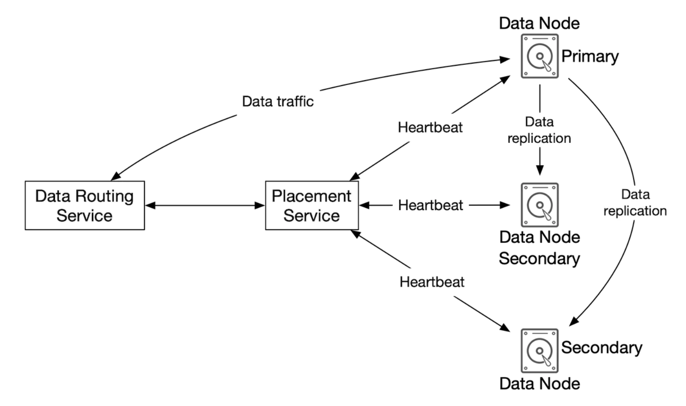
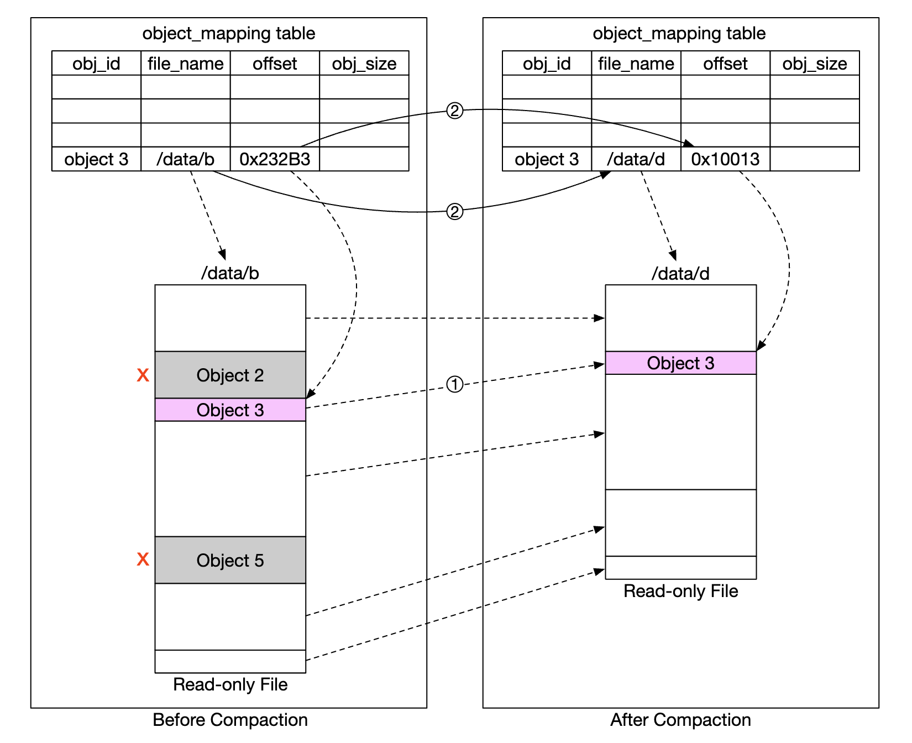

# 第 24 章：类 S3 对象存储

> 原章节：S3-like Object Storage · 原项目路径 `24. S3-like Object Storage/`

## 本章导读

你每天都在用对象存储，只是可能没意识到：手机相册的云备份、GitHub 的 Release 附件、你公司的数据仓库、训练大模型的语料，底层几乎都是 S3 或它的同类产品。

对象存储看起来很简单——"不就是个网盘吗？"但它有三个反常识的地方，恰恰是这一章的考点：

- **它没有"目录"**。你看到的文件夹，只是 key 字符串里的斜杠。
- **它不能修改文件**。你没法把一个大文件中间改掉 1 KB，只能把整个文件重新传一遍。
- **它"很强"，但强的方向和其他存储不一样**。它牺牲了延迟和灵活性，换来了极致的持久性、近乎无限的容量和极低的成本。

学完这一章，你应该能回答：为什么对象存储天生适合做不可变存储？为什么大文件上传要"分片"？为什么对象存储几乎都用纠删码而不是多副本？为什么"元数据"才是这个系统真正的瓶颈？

## 你将学到

- 块存储、文件存储、对象存储三者的本质区别，以及各自适合什么场景
- 对象存储为什么没有目录、为什么不支持随机写，以及"不可变"带来的五个好处
- S3 数据一致性模型的历史演变（2020 年 12 月是一个分水岭）及其架构影响
- 上传/下载/列举/版本控制四条链路的完整流程
- 数据节点怎么组织数据（WAL 合并大文件 + 本地映射表）
- 持久性怎么做到 11 个 9：故障域隔离 + 纠删码，以及纠删码和多副本的成本对比
- 元数据为什么是瓶颈，以及分片 + 缓存 + 一致性哈希怎么解决
- 大文件上传优化：分片上传、断点续传、并行上传，以及**预签名 URL 直传**
- 垃圾回收：为什么删除是"标记删除"，孤儿数据从哪来，压实（Compaction）怎么做

---

## 1. 三种存储：块、文件、对象

在动手设计之前，先把"存储"这个词拆开。业界把存储系统分成三大类，它们的区别不是"容量大小"，而是**抽象的层次**。

<div align="center"></div>

### 1.1 块存储（Block Storage）

最底层、最古老的一类，1960 年代就有。**硬盘（HDD）、固态盘（SSD）本身就是块存储设备。**

它的接口是"**读写第 N 号块的若干字节**"——没有文件名，没有目录，只有一个扁平的、按固定大小切分的地址空间。

- 通常**物理挂载**在服务器上（也可以通过网络协议挂载，比如 iSCSI、FC）。
- 操作系统拿到这些裸块之后，可以**格式化成一个文件系统**（这样就变成了文件存储），也可以**直接交给应用自己管**（比如数据库往往绕过文件系统，自己管理块）。

**块存储的典型用途**：虚拟机的磁盘、数据库的数据文件。它快，但要你自己管理"数据放在哪块"。

### 1.2 文件存储（File Storage）

**建立在块存储之上**，提供更高层的抽象：目录树、文件名、权限、锁。

- 接口是 `open` / `read` / `write` / `close` 这类系统调用。
- 支持**随机读写**——你可以 `seek` 到文件的任意位置改写几个字节。
- 支持**多个进程同时打开、并发修改**同一个文件（配合文件锁）。

**文件存储的典型用途**：通用文件共享（NFS、SMB/CIFS）、代码仓库、共享盘。

### 1.3 对象存储（Object Storage）

这是本章的主角。它**牺牲了性能，换取了高持久性、海量规模和低成本**。

核心特征：

- **扁平结构，没有层级目录**。所有数据都作为"对象"存放在一个扁平的命名空间里。
- **每个对象是不可变的**。要"修改"一个对象，只能整个替换。
- **通过 RESTful API 访问**（HTTP 的 GET/PUT/DELETE/LIST），而不是文件系统调用。
- **相对慢**。单次请求的延迟通常比本地文件系统高一个数量级。

**典型产品**：Amazon S3、Google Cloud Storage、Azure Blob Storage、阿里云 OSS、MinIO（开源）。

### 1.4 三种存储的完整对比

| | 块存储 | 文件存储 | 对象存储 |
|---|---|---|---|
| **内容可变** | 是 | 是 | **否**（通过对象版本控制实现"历史保留"） |
| **成本** | 高 | 中到高 | **低** |
| **性能** | 中到高，可极高 | 中到高 | **低到中** |
| **一致性** | 强一致 | 强一致 | 强一致（**2020 年 12 月起**，见第 4 节） |
| **访问方式** | SAS / iSCSI / FC | 标准文件访问，CIFS/SMB、NFS | **RESTful API** |
| **扩展性** | 中等 | 高 | **极大** |
| **适合** | 虚拟机、数据库 | 通用文件系统 | **二进制数据、非结构化数据** |

---

## 2. 术语与服务水平协议（SLA）

### 2.1 五个必须掌握的术语

- **桶（Bucket）**：对象的逻辑容器。**桶名在全球范围内唯一**——这意味着任何人在任何区域创建的桶，名字都不能和你重复。这也是为什么桶名经常要加随机后缀。
- **对象（Object）**：一份独立的数据，存放在某个桶里。**包含对象数据（object data）和元数据（metadata）两部分**。
- **版本控制（Versioning）**：让同一个对象在同一个桶里保留多个版本的特性。这是"不可变"存储实现"可恢复"的关键手段。
- **统一资源标识符（Uniform Resource Identifier, URI）**：每个资源由唯一的 URI 标识，比如 `s3://bucket-to-share/script.txt`。
- **服务水平协议（Service-Level Agreement, SLA）**：服务提供方和客户之间的合同，规定了可用性、持久性等承诺。**注意 SLA 是"承诺"，不是"保证"**——违反了要赔钱，但数据还是丢了。

### 2.2 耐久性和可用性：别把这两个词混了

原笔记引用了 **Amazon S3 Standard-IA（标准不频繁访问）** 存储类的 SLA：

- **持久性（Durability）99.999999999%**（11 个 9），跨多个可用区
- **即使整个可用区被摧毁，数据依然可恢复**
- **可用性（Availability）设计目标 99.9%**

这两个指标的区别非常关键：

| 指标 | 含义 | 衡量什么 | 11 个 9 是什么概念 |
|---|---|---|---|
| **持久性（Durability）** | 数据**不丢失**的概率 | 存储层 | 存 1000 亿个对象，一年丢 1 个 |
| **可用性（Availability）** | 服务**能访问**的概率 | 服务层 | 一年停机时间上限 |

> **初学者最常见的混淆**：把 99.999999999% 当成"可用性"。**不是的。** 持久性说的是"数据还在不在"，可用性说的是"我现在能不能读到它"。一个系统可以持久性极高但可用性一般（数据都在，但服务暂时挂了），也可以反过来（服务一直响应，但偶尔返回错误数据）。
> **两者的技术手段也完全不同**：持久性靠**冗余**（多副本、纠删码、故障域隔离），可用性靠**故障转移、负载均衡、多活部署**。

---

## 3. 需求分析与粗略估算

### 3.1 面试对话

- **候选人**：需要哪些功能？
- **面试官**：创建桶、上传/下载对象、版本控制、列举桶内对象。
- **候选人**：典型数据大小是多少？
- **面试官**：**既要高效存海量小对象，也要高效存大对象。**
- **候选人**：一年要存多少数据？
- **面试官**：100 PB。
- **候选人**：可以假设 6 个 9 的数据持久性（99.9999%）和 4 个 9 的服务可用性（99.99%）吗？
- **面试官**：可以，听起来合理。

### 3.2 非功能需求

- **100 PB 数据量**
- **6 个 9 的数据持久性**
- **4 个 9 的服务可用性**
- **存储效率**：在保持高可靠性和性能的前提下，尽量降低存储成本

> **注意这里有个矛盾**：第 2 节引用的 S3 Standard-IA 是 **11 个 9** 的持久性，而设计目标只要求 **6 个 9**。原笔记没有解释这个落差。真实的 S3 对外承诺的就是 11 个 9，6 个 9 是面试时为了简化讨论而降低的目标。详见文末勘误 2。

### 3.3 粗略估算：对象存储的瓶颈在哪里

**先确定瓶颈是什么。** 对象存储的瓶颈通常是**磁盘容量**或**每秒 I/O 次数（IOPS）**，而不是 CPU 或网络。

**假设**：

- 对象大小分布：**20% 小对象**（< 1 MB）、**60% 中等对象**（1～64 MB）、**20% 大对象**（> 64 MB）
- 一块 SATA 7200 转硬盘大约能做 **100～150 次随机寻址/秒**（即 100～150 IOPS）

**计算对象总数**（取每类的中位数简化计算）：

| 类别 | 占比 | 中位大小 | 加权贡献 |
|---|---|---|---|
| 小对象 | 20% | 0.5 MB | 0.1 MB |
| 中等对象 | 60% | 32 MB | 19.2 MB |
| 大对象 | 20% | 200 MB | 40 MB |
| **平均** | | | **59.3 MB** |

```
① 100 PB = 10^11 MB
② 假设只有 40% 的容量被实际使用 → 40 PB = 4 × 10^10 MB
③ 对象总数 = 4 × 10^10 MB ÷ 59.3 MB ≈ 6.75 × 10^8 ≈ 6.8 亿个（即原笔记的 0.68 billion）
④ 元数据存储：假设每个对象 1 KB 元数据
   6.8 × 10^8 × 1 KB = 6.8 × 10^8 KB ≈ 0.68 TB
```

**结论**：

- 约 **6.8 亿个对象**（原笔记写 0.68 billion，即 6.8 亿，复算一致）
- 元数据需要约 **0.68 TB** 存储空间

> **这里有个值得自己算一遍的推论**：0.68 TB 的元数据听起来不多，但**元数据的访问量和数据量无关，只和请求量有关**。每一次上传、下载、删除、列举都要访问元数据。假设峰值 100 万 IOPS，用 150 IOPS 的机械盘，光元数据层就需要 `1,000,000 ÷ 150 ≈ 6,667` 块硬盘。
> **这就是元数据成为瓶颈的直觉来源**——它的规模不是问题，"每次操作都要碰它"才是问题。第 13 节会详细展开。

---

## 4. 对象存储的四个本质特性

在设计之前，先把对象存储"为什么长这样"讲透。原笔记列了四条，我们逐条解释背后的原因。

### 4.1 对象不可变（Object Immutability）

**对象存储里的对象是不可变的**——这是它和其他存储系统最根本的区别。你可以**删除**它、可以**替换**它，但**不能修改**它。

**为什么不做成可变的？** 因为对象存储的物理实现决定了"原地修改"的成本高到不可接受：

> 一个对象可能被**纠删码**切成 12 片，散落在 12 台不同机器、不同机架上。要修改中间 1 KB，系统必须：把 8 个数据片读回来 → 重新计算 4 个校验片 → 把 12 片全部写回。**为了改 1 KB，传输了几十 MB。** 而且这个过程中任何一片失败，都会留下一半新一半旧的破损状态。

**所以设计上直接放弃了"原地修改"**：写入永远是"**写一个全新的对象，然后原子地切换指针**"。

> **精确一点说**：对象存储既**不支持随机写**，也**不支持追加（append）**。它只有"整体替换"。
> **一个容易被忽略的例外**：**读取是支持随机访问的**。S3 的 GET 请求支持 `Range` 头（比如 `Range: bytes=0-1023`），可以只取对象的一部分。所以准确的说法是"**随机读可以，随机写不行**"。
> （顺带一提，Azure Blob Storage 提供了 Append Blob 这个特例类型，专门用于日志追加场景，但这不是对象存储的主流用法。）

**不可变带来了五个非常实在的好处**：

1. **可以自由地做数据布局优化**。既然对象不会被改，那就可以任意地切分、压缩、加密、纠删码——不用担心"改了一处要同步改多处"。
2. **缓存和 CDN 极其友好**。`key` 不变 ⇒ 内容不变 ⇒ 可以放心地长期缓存，不用担心缓存和源数据不一致。**这是对象存储成为静态资源托管首选的根本原因。**
3. **版本控制变得自然**。每次写入产生一个新版本，历史版本天然保留。误删可恢复，审计有据可查。
4. **并发控制极其简单**。没有"两个人同时改同一个文件"的冲突——两个并发 PUT 只会产生两个版本，最后一个胜出，不会出现文件损坏。
5. **天然满足合规要求**。金融、医疗等行业有 **WORM（Write Once Read Many，一次写入多次读取）** 的合规要求（比如 SEC 17a-4）。不可变存储天生符合。

### 4.2 键值存储（Key-Value Store）

**对象的 URI 就是它的 key**，通过一次 HTTP 调用就能取到内容。

```
PUT  https://foo.s3example.org/bucket-to-share/script.txt
GET  https://foo.s3example.org/bucket-to-share/script.txt
```

这意味着对象存储本质上就是一个**超大规模的分布式键值数据库**，只不过 value 是"一坨字节 + 元数据"，而且 value 可以非常大（S3 单个对象最大 5 TB）。

### 4.3 写一次，读很多次（Write Once, Read Many）

原笔记引用了一项 LinkedIn 的研究：**95% 的操作是读**。

这个访问模式非常重要，它决定了后面几乎所有的架构决策：

- **读多写少 ⇒ 可以大量使用缓存**（元数据缓存、CDN 缓存）。
- **读多写少 ⇒ 冗余策略可以偏向"便宜"而不是"低延迟"**（因为读的时候可以从多个地方并行取）。
- **读多写少 ⇒ 索引和元数据表可以重度反范式化**。

### 4.4 同时支持小对象和大对象

这是设计上的一个硬约束。前面估算里，小对象中位数 0.5 MB、大对象中位数 200 MB，**差了 400 倍**。存储系统必须同时对两者都高效——这个矛盾在第 10 节（数据组织）会正面解决。

### 4.5 设计哲学：像 UNIX 一样把"元数据"和"内容"分开

原笔记的这个类比非常精准。

**UNIX 文件系统是怎么做的？**

1. 你保存一个文件，系统在磁盘上创建一个叫 **inode** 的数据结构，记录文件名、权限、大小、时间戳。
2. **文件的实际内容存在磁盘的其他位置**，inode 里只存一串"块指针"，指向这些位置。
3. 访问文件时，**先读 inode 拿到元数据，再根据指针去读内容**。

<div align="center"></div>

**对象存储完全一样**：元数据存储负责"文件信息"，数据存储负责"文件内容"。

**这个分离带来的最大好处是：两者可以独立扩展。**

<div align="center"></div>

- 元数据是"小、多、访问频繁"——它需要的是**高 IOPS、低延迟**，适合用 SSD 和内存缓存。
- 内容是"大、少、访问相对稀疏"——它需要的是**大容量、低成本**，适合用机械盘 + 纠删码。

**如果把它们放在一起**（就像传统文件系统那样），你就必须为整个系统配置最贵的硬件，而其中 90% 的容量其实只用来存大文件。**分离之后，各花各的钱。**

> **这是本章最重要的一句话**：**"把元数据和数据分开"是对象存储所有设计取舍的起点。** 后面讲的分片、缓存、纠删码、垃圾回收，全都是这句话的推论。

---

## 5. 高层设计

<div align="center"></div>

| 组件 | 职责 |
|---|---|
| **负载均衡器（Load Balancer）** | 把 API 请求分发到多个服务副本 |
| **API 服务（API Service）** | **无状态**服务器，编排对元数据存储、数据存储和 IAM 服务的调用 |
| **身份与访问管理（Identity and Access Management, IAM）** | 集中的认证、授权、访问控制中心 |
| **数据存储（Data Store）** | 存储和读取实际数据。所有操作都基于**对象 ID（UUID）** |
| **元数据存储（Metadata Store）** | 存储对象的元数据 |

> **注意"API 服务是无状态的"这一点**。这意味着它可以随便加机器、随便重启，所有状态都在后面的存储层。这是整个架构能水平扩展的前提。
> **另一个关键设计**：**数据存储用 UUID 而不是对象名来定位数据**。这样做的意义是——**对象名（key）和物理位置彻底解耦**。改名、移动、去重、迁移都不会影响物理布局。这是第 4.5 节"分离"思想的延续。

---

## 6. 上传一个对象

<div align="center"></div>

1. 用 HTTP **PUT** 请求创建一个名为 `bucket-to-share` 的桶。
2. API 服务调用 **IAM**，确认用户已认证且有写权限。
3. API 服务调用**元数据存储**，创建一条桶记录。成功后返回响应。
4. 桶创建完成后，再发一个 HTTP **PUT** 请求创建名为 `script.txt` 的对象。
5. API 服务再次验证身份和写权限。
6. 校验通过后，**对象数据通过 HTTP PUT 发到数据存储**。数据存储持久化后返回一个 **UUID**。
7. API 服务调用元数据存储，写入一条新记录，包含 `object_id`、`bucket_id`、`bucket_name` 等元数据。

**上传请求示例**：

```http
PUT /bucket-to-share/script.txt HTTP/1.1
Host: foo.s3example.org
Date: Sun, 12 Sept 2021 17:51:00 GMT
Authorization: authorization string
Content-Type: text/plain
Content-Length: 4567
x-amz-meta-author: Alex

[4567 bytes of object data]
```

> **注意 `x-amz-meta-` 前缀**：这是 S3 的**用户自定义元数据（User-Defined Metadata）** 约定。任何带这个前缀的头都会被当作元数据存下来，之后可以通过 `HEAD` 请求取回。这是一个很实用的特性——你可以在对象上挂业务标签，而不用额外维护一张表。

**注意流程里的一个顺序问题**：**数据先写入数据存储，拿到 UUID，再写元数据。** 这个顺序不是随便定的：

> **如果反过来（先写元数据，再写数据）**，那么在两个步骤之间，元数据里会存在一条"指向不存在的对象"的记录。用户去下载会 404，而且这条脏记录需要额外机制清理。
> **按现在的顺序**，最坏情况是"数据写成功了但元数据没写成"——这会产生**孤儿数据（Orphan Data）**，用户看不到它（因为元数据里没有），但也不会读到错误的 404。**孤儿数据可以由后台垃圾回收清理**（见第 17 节）。
> **原则：宁可产生"看不见的垃圾"，也不要产生"看得见的错误"。**

---

## 7. 下载一个对象

**桶没有目录层级**，但我们可以把**桶名和对象名拼起来**，模拟出文件夹的结构。

```http
GET /bucket-to-share/script.txt HTTP/1.1
Host: foo.s3example.org
Date: Sun, 12 Sept 2021 18:30:01 GMT
Authorization: authorization string
```

<div align="center"></div>

1. 客户端向负载均衡器发送 HTTP **GET** 请求，例如 `GET /bucket-to-share/script.txt`。
2. API 服务查询 **IAM**，验证用户对该桶有读权限。
3. 验证通过后，从**元数据存储**中取出对象的 **UUID**。
4. 用 UUID 从**数据存储**取出对象内容，返回给客户端。

### 7.1 "文件夹"到底是什么

这一点必须讲透，因为它是初学者最容易误解的地方。

**对象存储的命名空间是扁平的。** 下面这两个 key：

```
photos/2024/beach.jpg
photos/2024/mountain.jpg
```

在对象存储看来，它们只是**两个普通的字符串**，长度分别是 22 和 25 个字符。那个 `/` 不是分隔符，**就是一个普通字符**，和字母 `p`、数字 `4` 没有任何区别。**不存在一个叫 `photos` 的"目录对象"。**

**那为什么在 S3 控制台里能看到文件夹？** 因为**控制台和 API 帮你"模拟"出来了**：

- **列举时用 `delimiter=/` + `prefix=`**：`ListObjectsV2` 请求带上 `prefix=photos/&delimiter=/`，S3 就会把所有以 `photos/` 开头的 key，按**第一个 `/` 之前的部分**分组返回。命中的叫 `Contents`，被折叠的叫 `CommonPrefixes`——**客户端把 `CommonPrefixes` 渲染成"文件夹"**。
- **删除"文件夹"是逐个删对象**：因为目录根本不存在，删除一个"文件夹"实际上是**列举出它下面所有的 key，然后一个个删**。这也是为什么删一个有几百万对象的"目录"会非常慢。

> **这个认知有什么用？**
> 1. **对象存储的"目录重命名"本质上是"复制所有对象 + 删除原对象"**，非常昂贵。**永远不要把对象存储当文件系统用**——不要指望 `mv` 一个目录很快。
> 2. **`/` 只是约定**。你完全可以用 `:` 或 `#` 做分隔符，S3 一样能按它分组。用 `/` 只是因为它看起来像路径。
> 3. **不要创建"空文件夹"**。在某些工具里创建空目录会生成一个 0 字节的"占位对象"（key 以 `/` 结尾），这是历史遗留的 hack，现代工具一般不这么做。

---

## 8. 数据存储的内部结构

这是本章第一个深挖点。前面看到 API 服务把数据发给"数据存储"，现在拆开看里面是什么。

<div align="center"></div>

数据存储的主要组件：

<div align="center"></div>

### 8.1 数据路由服务（Data Routing Service）

对外提供 **RESTful 或 gRPC API**，用于访问数据节点集群。它本身是**无状态**的，加机器就能扩展。

**三个主要职责**：

- 向**放置服务**查询"哪个数据节点最适合存这份数据"
- 从数据节点读数据，返回给 API 服务
- 把数据写到数据节点

### 8.2 放置服务（Placement Service）

**决定一个对象应该存在哪些数据节点上。**

它维护一张**虚拟集群图（Virtual Cluster Map）**，描述整个集群的物理拓扑。

<div align="center"></div>

**它还负责心跳检测**：向所有数据节点发送心跳，判断哪些节点已经不可用、需要从虚拟集群中移除。

**这个服务是关键的（critical）**——它挂了，整个集群就不知道该往哪写数据了。所以原笔记建议：

> **用 5 个或 7 个副本来维护这个服务，通过 Paxos 或 Raft 共识算法同步。**
> 例如一个 7 节点集群可以容忍 3 个节点同时故障。

> **为什么是 5 或 7，而不是 6 或 8？** 因为 Paxos / Raft 这类共识算法需要**多数派（Majority）**才能推进——`N` 个节点需要 `⌊N/2⌋ + 1` 个同意。
> - 5 个节点：需要 3 个同意，容忍 2 个故障。
> - 7 个节点：需要 4 个同意，容忍 3 个故障。
> - 6 个节点：需要 4 个同意，容忍 2 个故障——**和 5 个节点一样，但多了一台机器的成本和一份复制开销。**
> **所以共识集群的节点数几乎总是奇数。** 这是分布式系统里最常被追问的一个小知识点。

### 8.3 数据节点（Data Nodes）

**存储实际的对象数据**。可靠性和持久性靠**把数据复制到多个数据节点**来保证。

每个数据节点上跑一个**守护进程（daemon）**，向放置服务发送心跳。心跳内容包含：

- 这个数据节点管理了多少块硬盘（HDD 或 SSD）？
- 每块盘上存了多少数据？

> **为什么心跳要上报磁盘信息？** 因为放置服务的核心任务是"把新数据放到合适的位置"，而它必须知道**每个节点的容量水位**。如果某个节点快满了还在往里塞，就会造成负载倾斜；如果它能上报"我这台机器 80% 满了"，放置服务就能把新数据导向空闲节点。**这就是分布式存储里的"容量感知调度"。**

---

## 9. 数据持久化流程

<div align="center"></div>

1. API 服务把对象数据转发给数据存储。
2. 数据路由服务把数据发到**主数据节点（Primary Data Node）**。
3. 主数据节点**先本地保存**，然后**复制到两个从数据节点（Secondary Data Nodes）**。**复制成功后才返回响应。**
4. 对象的 UUID 返回给 API 服务。

**两个关键细节（原笔记专门标注的）**：

1. **给定一个对象 UUID，它的复制组是通过一致性哈希确定性地选出来的。** 也就是说，任何节点拿到同一个 UUID，都能算出同一组数据节点。**不需要一个中心化的"谁存在哪"的查询。**
2. **主节点在返回响应之前就完成了复制**——这**选择了强一致性，代价是更高的延迟**。

<div align="center"></div>

> **这个取舍值得展开**。写入时"等所有副本确认"和"立即返回"之间的差别是：
> - **等复制完成（本方案）**：写延迟 = 本地写 + 两次网络复制。但写完立刻读，一定能读到。**强一致。**
> - **不等复制（异步复制）**：写延迟 = 本地写。但写完立刻读可能读到旧数据。**最终一致。**
>
> 对象存储的访问模式是"**写一次、读很多次**"（95% 是读），所以**写入路径上多花的那点延迟，相对于后续海量读取的一致性收益，是完全值得的**。这就是为什么原笔记说这里"favors strong consistency over higher latency"。

---

## 10. 数据是怎么组织的

### 10.1 朴素方案：一个对象一个文件

最直观的做法是**每个对象存成一个独立文件**。

**能用，但性能很差**，原因有两个（都是文件系统的固有限制）：

1. **磁盘块被浪费**。文件系统按**块（block）**分配空间，典型块大小是 **4 KB**。哪怕你只存一个 100 字节的小对象，它也会占用一整个 4 KB 块——**浪费 97.5% 的空间**。而前面估算里，20% 的对象是小于 1 MB 的小对象，数量占比可能更高。
2. **inode 数量爆炸**。**每个文件需要一个 inode**。操作系统处理海量 inode 的能力有限，而且**inode 总数是有上限的**（格式化时就固定了）。6.8 亿个对象就是 6.8 亿个 inode，任何本地文件系统都撑不住。

### 10.2 解法：用 WAL 把很多小文件合并成大文件

原笔记给出的方案是：**通过预写日志（Write-Ahead Log, WAL）把很多小对象合并写入少数几个大文件**。文件写满（通常是几 GB）之后，再创建一个新文件。

<div align="center"></div>

**这个方案同时解决了两个问题**：

- **空间浪费消失了**：小对象首尾相接排在一个大文件里，**只在文件末尾可能有不足一个块的浪费**。
- **inode 数量骤降**：6.8 亿个对象变成几万个几 GB 的文件。

**代价：写入必须串行化。** 因为多个对象要往同一个文件的末尾追加，**多个 CPU 核心访问同一个文件时必须互相等待**，形成**锁竞争（Lock Contention）**。

**解法**：**把文件绑定到特定的 CPU 核心**（术语叫 **sharding by core** 或 per-core file）。每个核心独占一组文件，核心之间不需要竞争锁。这是一个"**用空间换并发**"的经典手法。

> **注意这个设计的顺序写特性**：追加写是**纯顺序 I/O**，机械硬盘顺序写的吞吐量比随机写高一个数量级。这正好和第 23 章的 LSM-Tree 是同一个思想——**"把所有写入变成顺序追加"，是存储系统对抗磁盘物理特性的通用武器。**

### 10.3 对象查找：映射表

既然多个对象挤在同一个文件里，就必须有一张表告诉数据节点"某个对象在哪"：

| 字段 | 含义 |
|---|---|
| `object_id` | 对象 ID |
| `filename` | 对象存放在哪个文件里 |
| `file_offset` | 对象从文件的哪个偏移量开始 |
| `object_size` | 对象多大 |

**用什么存这张表？** 原笔记给了两个选项：文件型数据库（如 **RocksDB**）或传统关系型数据库。**因为访问模式是"低写入 + 高读取"，关系型数据库更合适。**

> **这里有个容易混淆的点**：RocksDB 是 **LSM-Tree** 结构的，为**写密集**场景优化；而映射表是**读密集**的（每读一个对象都要查一次表），B+ 树结构的关系库（读性能更好、读放大更小）反而更合适。**选存储引擎要看访问模式，不是看哪个更"新"。**

**部署方式也有讲究**：

| 方案 | 优点 | 缺点 |
|---|---|---|
| **独立部署一个数据库集群**，所有数据节点访问 | 统一管理 | ① 要为所有请求做激进扩容；② **数据节点和数据库集群之间多了一次网络往返** |
| **把关系库部署在数据节点本机** | 零网络延迟；每台机器只管自己的数据 | 需要轻量级数据库 |

**原笔记选择了第二个方案**，理由是：**数据节点只关心和自己相关的数据**——它不需要知道别的节点上有什么。所以完全可以把数据库放在本地。

**SQLite** 是一个很好的选择：**轻量级、基于文件的关系型数据库，不需要独立进程，直接嵌进应用里。**

### 10.4 更新后的持久化流程

<div align="center"></div>

1. API 服务发送保存新对象的请求。
2. 数据节点服务把新对象**追加到文件末尾**，例如 `/data/c`。
3. 向对象映射表插入一条新记录。

> **注意第 2 步的措辞：追加（append）**。整个写入路径只有一次顺序写。没有随机寻址，没有原地修改。

---

## 11. 持久性：故障域隔离与纠删码

数据持久性是本章最重要的非功能需求。要做到 6 个 9（更不用说 S3 的 11 个 9），**必须逐一检查每一种故障场景**。

### 11.1 第一层：跨故障域复制

**硬件故障是第一个要解决的问题。** 通过复制数据节点，可以极大降低数据丢失的概率。

但仅仅复制还不够——**还必须跨不同的故障域（Failure Domain）复制**：跨机架、跨数据中心、跨独立网络。

**为什么？** 因为一次关键事件（比如机架掉电、交换机故障、机房空调失效）可以**同时**干掉同一个域里的多台机器。

<div align="center"></div>

**这就是"不要把鸡蛋放在同一个篮子里"的字面实现**：三个副本放在同一台机器的三块盘上，和放在三个机架上，硬件成本一样，但**风险差了几个数量级**。

### 11.2 纠删码（Erasure Coding）的基本原理

原笔记给出了一个数字：**假设一块典型硬盘的年故障率（Annualized Failure Rate, AFR）是 0.81%，做三份副本可以给我们 6 个 9 的持久性。**

复制数据节点确实能带来想要的持久性，但**存储成本很高**。所以我们还可以用**纠删码**来降低存储成本。

**纠删码的核心思想**：用**校验位（Parity Bits）**来重建丢失的数据。

<div align="center"></div>

**把图中的每一块想象成一个数据节点**。如果其中两块挂了，可以用剩下的四块把它们恢复出来。

**常见的纠删码方案**：本章场景可以用 **8+4 纠删码**——把数据切成 **8 个数据块**，计算出 **4 个校验块**，共 **12 块**，分散到不同的故障域中以最大化可靠性。

<div align="center"></div>

**8+4 的容错能力**：**任意 4 块丢失都能恢复**（因为只需要任意 8 块就能重建全部数据）。对比三副本只能容忍 2 块丢失——**纠删码容错更强，存储成本还更低。**

### 11.3 纠删码 vs 多副本：算一笔账

<div align="center"></div>

| 维度 | 三副本（3 Replicas） | 8+4 纠删码 |
|---|---|---|
| **存储一份数据实际占用** | 3 份 | 12 ÷ 8 = **1.5 份** |
| **冗余开销** | **200%** | **50%** |
| **容错能力** | 容忍 **2** 块丢失 | 容忍 **4** 块丢失 |
| **读取延迟** | **低**（读任意一个副本即可，只需联系 1 台机器） | **高**（可能要从多台机器收集分片） |
| **CPU 开销** | 低（只是复制） | **高**（要计算和存储校验块） |
| **实现复杂度** | 简单 | **高** |
| **修复（Repair）开销** | 低（复制一份即可） | 高（要读 8 块并重算） |

**存储成本对比一目了然**：`1.5x` 对 `3x`——**纠删码省了整整一半的存储**。在 100 PB 的规模下，这意味着一半的硬件采购成本和机房电费。

**关于持久性**：原笔记引用了 Backblaze 的建模结果，指出纠删码可以做到 **11 个 9** 的持久性，而（朴素计算下的）三副本是 6 个 9。

> **这里必须加一个重要的限定**：这个"6 个 9"是**"三个副本同时坏掉"的朴素概率计算**（`0.0081³ ≈ 5.3 × 10⁻⁷`），它**忽略了副本会被自动修复这一关键机制**。
> 真实的 S3 用多副本时对外承诺的也是 **11 个 9**——因为**一块盘坏了之后，系统会在几小时内把副本重建出来**，所以"三块盘同时坏"这个前提几乎不成立。真正的持久性模型必须考虑**修复时间（MTTR）**和**修复期间的二次故障概率**。
> 详见文末勘误 2。**记住结论就好：纠删码和多副本都能做到极高持久性，纠删码的真正优势是省一半存储。**

### 11.4 为什么对象存储几乎都用纠删码

结合前面的分析，答案很清晰：

1. **对象存储是延迟不敏感的**。对象存储主要面向**温数据和冷数据**（备份、归档、数据湖、AI 训练语料），这些场景**不在乎多等几十毫秒**。而数据库、缓存这类延迟敏感的场景就必须用副本。
2. **成本是对象存储最大的成本项**。存储成本几乎正比于冗余倍数，`1.5x` 和 `3x` 的差距是**直接的、成比例的**硬件开支。
3. **读取可以并行化**。虽然纠删码读取要联系多台机器，但这些请求可以**并行发起**，总延迟不一定比单副本差太多（受最慢的那台决定）。

**所以业界的标准分工是**：

> **延迟敏感的热数据用多副本，延迟不敏感的温冷数据用纠删码。** 同一个系统里两者常常并存——比如元数据用多副本（要低延迟），对象数据用纠删码（要低成本）。**这正好呼应了第 4.5 节"元数据和数据分开"的思想。**

### 11.5 补充：纠删码的进阶话题

- **修复放大（Repair Amplification）**：8+4 方案里，丢 1 块要读 8 块才能重建。频繁修复会消耗大量网络带宽。**LRC（Locally Repairable Codes，局部可修复码）** 通过增加局部校验块，让常见情况下的修复只需要读 2～3 块，代价是稍微多占一点存储。
- **为什么不直接用 20+4？** 冗余率更低（24/20 = 1.2x），但**修复时一次要读 20 块**，且**容错只到 4 块**。**数据块数 k 越大，存储越省，但修复代价越高。** 8+4、10+4、12+4 是常见的平衡点。
- **纠删码不能替代备份**。它能防硬件故障，防不了**误删除、软件 bug、勒索软件**——因为纠删码保护的是"同一份数据的冗余"，逻辑上的错误会同时污染所有分片。**备份是另一个维度的事。**

---

## 12. 正确性校验

**如果一块盘彻底坏掉，故障很容易检测。但如果盘只有一部分数据被静默损坏（Silent Data Corruption），检测就难得多。**

这类问题有个专门的名字：**位腐（Bit Rot）**。磁盘上的磁畴会随着时间缓慢退化，数据可能在几个月后悄悄变成另一个值——**没有报错，没有异常，只有错误的数据**。

**解法是用校验和（Checksum）**：对文件内容算一个哈希值，用来验证文件完整性。

本章的设计中，**每个文件和每个对象都要存校验和**：

<div align="center"></div>

**为什么文件和对象都要存？**

- **文件级校验和**：用于**后台扫描（Scrubbing）**——定期读取磁盘上的数据、重算校验和、和记录的值比对，主动发现位腐。
- **对象级校验和**：用于**按需验证**——用户下载时校验，确保返回的数据是正确的。

**使用纠删码（8+4）时**，校验会更麻烦：需要**分别取回 8 个数据分片，逐个验证它们的校验和**。

> **一个重要的实践提醒**：发现校验失败后，系统应当**用其他副本或纠删码重建这份数据**，而不是简单报错。这就是所谓的**自愈（Self-Healing）**——而自愈的前提是**有冗余**。所以校验和（发现错误）和冗余（修复错误）必须配套，缺一不可。

---

## 13. 元数据数据模型：真正的瓶颈

现在来到本章第二个深挖点，也是**整个系统里最难扩展的部分**。

### 13.1 表结构

<div align="center"></div>

**需要支持的查询**：

- 按名字查找对象 ID
- 按名字插入/删除对象
- **列举某个桶里所有共享同一前缀的对象**（这就是"模拟目录"的查询）

### 13.2 两张表的规模完全不同

| 表 | 规模 | 扩展策略 |
|---|---|---|
| **buckets 表** | **小**——通常对用户能创建的桶数量有限制，所以这张表能放进**单个数据库服务器** | 容量不是问题，但**读吞吐仍需扩展**（要加只读副本） |
| **objects 表** | **巨大**——6.8 亿个对象就是 6.8 亿行 | **必须分片** |

### 13.3 为什么元数据会成为瓶颈

这是本章最需要讲清楚的一个问题。**对象存储的"数据面"可以近乎无限扩展，但"控制面"不行。**

**原因有三**：

**第一，元数据是一个全局共享的命名空间。** 数据可以按 UUID 随意散落到任何一台机器（每份数据是独立的，互不相干）。但**元数据不行**——桶名全局唯一，"`bucket-to-share/script.txt` 这个 key 对应哪个 UUID"这个映射，**必须能被任何一个 API 服务实例在任意时刻查到**。这是一个**全局的、必须一致的索引**。

**第二，元数据的访问量和数据量无关，只和请求数有关。** 每上传一个对象、每下载一个对象、每删除一个、每列举一次，**都要访问元数据**。所以：

```
元数据的 QPS ≈ 系统的总请求 QPS
```

而 S3 这种规模的系统，**请求量是千万级 QPS**。这是数据量增长完全无法解释的负载。

**第三，元数据的访问模式是随机的，而且条目数极多。** 6.8 亿条记录，每条都很小（1 KB），访问完全随机——**这正是 B+ 树索引最擅长、但磁盘最不擅长的场景**。它不能像对象数据那样"追加成大文件"来规避随机 I/O。

**第四，强一致性要求进一步收紧了选项。** 如果允许最终一致，你可以用"异步复制的多副本 + 本地缓存"轻松扩展；但要保证"写完立刻能读到"，就必须在一致性协议上花代价。

> **AWS 在宣布 S3 强一致性时特别强调了一句**：这次升级"**没有任何全局依赖（there are no global dependencies）**"，并且"对性能没有影响"。
> 这句话的分量很重——**它说明 S3 团队找到了一种"既能强一致、又不引入全局单点"的元数据架构**。如果存在一个全局的协调点，那么它既是性能瓶颈，也是可用性单点。**"消除全局依赖"是超大规模元数据系统的圣杯。**

### 13.4 分片策略：一个需要权衡的选择

原笔记给了三条（注意第二条原文有笔误，见勘误 1）：

| 分片键 | 优点 | 缺点 |
|---|---|---|
| **按 `bucket_id` 分片** | 同一桶的对象都在一个分片，**列举快** | **严重的热点问题**——一个桶可能有几十亿个对象，全压在一个分片上 |
| **按 `object_id`（UUID）分片** | **负载分布均匀** | **查询变慢**——按名字查对象要先知道它在哪个分片；按前缀列举要扫所有分片 |
| **按 `hash(bucket_name, object_name)` 分片**（本方案的选择） | 分布均匀，且**大多数查询本来就是基于对象名/桶名的** | 前缀列举仍然困难 |

**为什么选第三个？** 因为**大多数查询是"给定桶名 + 对象名，找对象"**（上传、下载、删除都是这个模式）。按名字哈希，这个查询一次就能定位到分片。

**代价**：**列举桶内对象会变慢**（第 14 节专门处理）。

### 13.5 补充：业界如何扩展元数据存储

原笔记只说"分片"，但真实的元数据扩展需要一套组合拳：

**① 分片 + 一致性哈希**

分片解决容量问题，但**扩容时不能重新哈希所有数据**（那会导致几乎全部数据迁移）。用**一致性哈希**（配合虚拟节点），扩容时只需要迁移 `1/N` 的数据。

**② 预先规划大量逻辑分片**

更常见的做法是一开始就把 key 空间切成**远多于物理机器数量**的逻辑分片（比如 1024 个），将来扩容时整个逻辑分片搬走即可，不需要重新计算哈希。**这是避免"扩容即大迁移"的标准手法。**

**③ 多层缓存**

元数据是"**读多写少**"的（95% 操作是读，而且对象一旦写入很少改名）。所以在 API 服务层加缓存收益极大：

- **客户端缓存**：浏览器的 ETag / If-None-Match。
- **边缘缓存**：CDN 缓存元数据查询结果。
- **服务端缓存**：API 服务实例内存里缓存热点 key 的映射。

> AWS 官方在宣布 S3 强一致性的博客中提到，团队**为元数据子系统内建了缓存技术**，并在保证高可用的同时**消除了全局依赖**。这说明"**强一致 + 大规模缓存**"是可以共存的——关键是让缓存成为**一致性协议的一部分**（比如缓存只保存已提交的值，并在失效时走一致性读），而不是一个"最终一致的外挂层"。

**④ 读写分离**

元数据的写（上传、删除）远少于读（下载、列举）。可以用主库承接写、大量只读副本承接读。**注意**：这会重新引入"读副本延迟"问题，所以只适合**可以容忍轻微延迟的查询**（比如列举），核心的"按 key 取 UUID"要走强一致路径。

**⑤ 为列举单独建反范式表**

见第 14 节。

**⑥ 分层存储元数据**

热元数据（最近被访问的）放内存 / SSD；冷元数据放机械盘。因为"数据新鲜度影响使用"——**用户几乎只访问最近的对象**。

---

## 14. 列举桶内对象

### 14.1 单库情况下很简单

在**单个数据库**里，按前缀列举对象（模拟目录）就是一句 SQL：

```sql
SELECT * FROM object
WHERE bucket_id = '123'
  AND object_name LIKE 'abc/%';
```

> **注意这里是 `LIKE 'abc/%'`——前缀固定，不是 `LIKE '%abc%'`。** 前缀匹配可以用 B+ 树索引，性能很好。这和我们在第 23 章批评的"前导通配符"是完全不同的情况。**这是初学者容易混淆的一个点：`LIKE` 本身不是问题，"前导通配符"才是问题。**

### 14.2 分片后就麻烦了

**数据库分片之后，这条查询变得非常难做**，因为"前缀是 `abc/` 的对象"可能散落在**任何一个分片**上（因为分片键是 `hash(bucket_name, object_name)`）。

**解法：在每个分片上各跑一次查询，然后在内存里聚合结果。**

**但这带来了新的问题——分页极其困难**：

- 每个分片返回的结果数量不同；
- 要维持**每个分片各自的 limit/offset**；
- 用户翻到第 100 页时，需要向每个分片请求"第 100 页"，然后归并——**而每个分片的第 100 页所对应的全局位置是完全不同的**。

> **这是一个分布式查询的经典难题**。根本原因是"**全局有序 ≠ 局部有序的简单拼接**"。同样的难题出现在 Elasticsearch 的深分页（`from + size` 超过 `index.max_result_window` 时要改用 `search_after`）和任何跨分片排序场景里。

### 14.3 两个务实的取舍

原笔记给了两个方案：

**方案一：接受列举慢。** 理由是"**对象存储本来就不以列举性能见长**"。这符合产品定位——S3 的 `ListObjects` 一直是被认为"慢且昂贵"的操作（它按请求数计费，而且有 1000 条/次的返回上限，列举百万对象要发上千次请求）。

**方案二：为列举单独建一张反范式表，按 `bucket_id` 分片。**

这张表只存列举需要的最小信息（对象名、大小、时间戳），按桶 ID 分片。于是"列举某个桶"的查询**完全落在单个数据库实例上**，速度足够快。

**代价**：

- **额外的存储**（同一份信息存了两份）。
- **一致性维护成本**：上传/删除对象时，要**同时更新两张表**。如果更新失败，两张表就不一致了。
- **需要后台对账任务**定期修复不一致。

> **这就是反范式化的标准交易**：**用"多写一份 + 一致性维护成本"换"查询性能"。** 这个模式和关系型数据库的物化视图、读模型（CQRS 里的 Query Model）本质上是同一件事。**你在第 23 章见过一次（已读/未读拆表），这里是第二次。**

---

## 15. 对象版本控制

**版本控制的实现很简单：加一个 `object_version` 列，类型是 TIMEUUID**（把时间戳编码进去的 UUID），这样就能按版本排序。

**每一次写入都产生一个新的 `object_id`**：

<div align="center"></div>

**删除对象时，实际上是创建一个特殊 `object_id` 的新版本，表示"这个对象被删除了"**（术语叫**删除标记，Delete Marker**）。此后查询它会返回 **404**：

<div align="center"></div>

### 15.1 为什么删除要做成"写一个新版本"

这个设计非常巧妙，值得说清楚：

1. **原子性**。写入是原子的，所以"删除"也是原子的。如果删除要"遍历所有副本、逐个物理删除"，那么中途失败就会留下一半删一半没删的状态，**而且这个状态无法自愈**。
2. **可恢复**。误删之后，只要把删除标记移除（或指定旧版本读取），数据就回来了。**这是对象存储敢让用户直接 `DELETE` 的底气。**
3. **不需要修改数据文件**。删除一个对象**不触碰**包含它的大文件（还记得第 10 节吗？对象是追加进大文件的）。删除只是往元数据表写一条新记录，**零数据 I/O**。
4. **并发安全**。两个并发的删除和写入不会互相破坏——它们各自产生一个版本。

**代价**：**空间不会立刻释放**。所有历史版本都还占着存储，直到被垃圾回收清理。这就是第 17 节的主题。

> **一个实用的工程提醒**：开启版本控制后，**存储成本会持续增长**，因为每次覆盖都留一份历史。生产环境必须配**生命周期策略（Lifecycle Policy）**——比如"非当前版本保留 30 天后自动删除"。**很多团队忘了配这个，账单涨上来才发现。**

---

## 16. 大文件上传优化

### 16.1 分片上传（Multipart Upload）

**上传大文件可以用分片上传优化：把大文件切成若干块，各自独立上传。**

<div align="center"></div>

1. 客户端调用服务，**初始化**一次分片上传。
2. 数据存储返回一个 **upload ID**，唯一标识这次上传。
3. 客户端把大文件**切成若干块（chunk / part）**，用 upload ID 独立上传。
4. 每上传完一块，数据存储返回一个 **ETag**（一块的 MD5 校验和），标识这个分片。
5. 所有分片上传完成后，客户端发送**完成请求（complete multipart upload）**，携带 `upload_id`、**所有分片编号（part numbers）**和**所有 ETag**。
6. 数据存储按分片**重新组装**对象。这个过程可能要几分钟。完成后返回成功响应。

**此时，不再有用的旧分片可以被清理——这就是垃圾回收器的职责**（见第 17 节）。

### 16.2 为什么需要分片上传

**分片上传解决了三个问题**：

| 问题 | 分片上传如何解决 |
|---|---|
| **单次 PUT 有大小上限**（S3 是 5 GB） | 分片后可以上传最大 5 TB 的对象 |
| **网络中断要重传整个文件** | 只需重传失败的那一个分片 → **断点续传** |
| **单条 TCP 连接带宽利用率低** | 多个分片**并行上传**，跑满带宽 |

> **为什么单条 TCP 连接跑不满带宽？** 因为 TCP 的吞吐量受 **`窗口大小 / 往返时间（RTT）`** 限制。跨地域传输时 RTT 可能有 100 ms 以上，单条连接很容易成为瓶颈。**开多条并发连接是绕过这个限制的标准做法**——这也是下载工具（迅雷、aria2）做多线程下载的同一个原理。

### 16.3 补充：分片大小怎么选

**这是原笔记完全没讲、但工程上必须知道的一环。**

**硬约束**：S3 最多允许 **10000 个分片**。所以：

```
分片大小 ≥ 文件大小 ÷ 10000
```

举例：

| 文件大小 | 最小分片大小 |
|---|---|
| 5 GB | 512 KB |
| 100 GB | 10 MB |
| 1 TB | 100 MB |
| 5 TB（S3 上限） | **512 MB** |

**实际选择还要考虑三个因素**：

- **分片太小**：请求次数多，每次都有固定开销（签名、网络往返、元数据写入），总耗时反而增加。
- **分片太大**：① 单个分片失败要重传的代价高（**断点续传的粒度变粗**）；② **并行度下降**（10000 个分片的文件，如果分片是 512 MB，就只有 10000 个并发单元；如果分片是 5 MB，就有更多单元，但会超过上限）。
- **S3 还有额外限制**：除最后一块外，**每块必须 ≥ 5 MB**（这是硬性要求，不是建议）。

**实践中的经验值**：**8 MB ～ 64 MB** 是比较常用的区间；大文件用大分片，同时保证总分片数不超过 10000。

### 16.4 补充：断点续传的具体做法

**客户端必须自己记录上传状态**：

```
本地状态文件（示例）
{
  "upload_id": "2K3j...",
  "key": "bucket-to-share/big-video.mp4",
  "part_size": 16777216,
  "parts": [
    {"part_number": 1, "etag": "\"a1b2...\"", "size": 16777216},
    {"part_number": 2, "etag": "\"c3d4...\"", "size": 16777216}
  ]
}
```

网络恢复后：**先列出服务端已接收的分片**（S3 提供 `ListParts` API），和本地记录比对，**只重传缺失或校验失败的分片**。

> **为什么必须依赖服务端的 `ListParts` 而不能只信本地记录？** 因为本地记录的 ETag 可能是"服务端收了但客户端没收到响应"的情况——**只有服务端说的才算数**。这是一个典型的"**分布式系统里不能相信单方面的状态**"的例子。

### 16.5 补充：预签名 URL（Presigned URL）——让客户端直传

**这是原笔记完全缺失、但在实际工作中最常用的一环。**

**问题**：按前面第 6 节的设计，客户端上传文件时，字节流要**经过 API 服务**：

```
客户端 ──10 GB 数据──▶ API 服务 ──10 GB 数据──▶ 数据存储
```

API 服务要承担：**接收全部字节（带宽）** + **缓冲（内存或临时磁盘）** + **转发（又一次带宽）**。上传一个 10 GB 文件，API 服务要搬 20 GB 的数据，**而且它还得为此配备足够的网络带宽和内存**。

**这在经济上是不可接受的**：API 服务本该是无状态、轻量的，现在却变成了一个昂贵的流量中转站。

**解法：预签名 URL（Presigned URL）。**

```
① 客户端问 API 服务："我要上传 big-video.mp4，可以吗？"
② API 服务校验身份和权限（IAM）
③ API 服务用长期凭证生成一个带签名的临时 URL：
     https://bucket.s3.amazonaws.com/big-video.mp4
       ?X-Amz-Algorithm=AWS4-HMAC-SHA256
       &X-Amz-Credential=...
       &X-Amz-Date=20260920T120000Z
       &X-Amz-Expires=3600
       &X-Amz-Signature=...
④ API 服务把这个 URL 返回给客户端（几 KB）
⑤ 客户端直接把文件 PUT 到这个 URL，字节流直达对象存储
```

**收益**：

- **省带宽**：字节流完全不走 API 服务。
- **省 CPU 和内存**：API 服务不需要缓冲文件内容。
- **更快**：客户端直连对象存储的边缘节点，减少一跳。
- **API 服务可以保持无状态、可随意扩缩容**。

**安全性怎么保证？** 预签名 URL 把"授权"编码进了 URL 本身：

- **有签名**：签名由服务端的私钥生成，客户端无法伪造。
- **有过期时间**：`X-Amz-Expires` 参数（比如 1 小时）。**过期后 URL 失效。**
- **限定了资源**：URL 里写死了桶名和对象名，**不能拿去访问别的对象**。
- **限定了操作**：签名时指定了 HTTP 方法（PUT 用于上传，GET 用于下载），**上传用的 URL 不能用来读**。
- **可以限定条件**：可以约束 `Content-Type`、最大文件大小等。

**下载同样适用**：私有桶的文件不能直接公开访问，但可以生成一个临时的 GET 预签名 URL 给用户（比如邮件里的下载链接、报表导出链接）。

> **这是一个"授权与数据面分离"的经典模式**，在云原生架构里到处都是：
> - **S3 预签名 URL**：控制面签发凭证，数据面直连。
> - **Azure SAS Token（Shared Access Signature）**：同样的思路。
> - **JWT**：认证服务签发令牌，各业务服务自行验证，不需要每次都回源问认证中心。
>
> **共同点**：**把"每次请求都要问一次中心化服务"变成"一次授权、多次使用"。** 这是消除瓶颈最有效的手段之一。

### 16.6 补充：ETag 的陷阱

原笔记说"数据存储返回一个 etag，它是一块的 md5 校验和"——**对于单个分片来说这是对的**。但有一个非常重要的陷阱必须知道：

> **分片上传生成的对象的 ETag，不是整个对象的 MD5。**

具体规则是：

- **单次 PUT 上传**：ETag = 对象内容的 MD5。✅ 可以用来校验完整性。
- **分片上传**：ETag = **各分片 MD5 值拼接后再取一次 MD5**，并且**带一个 `-N` 后缀**（N 是分片数），例如 `"d41d8cd98f00b204e9800998ecf8427e-3"`。

**后果**：

- **不能用 ETag 校验整体完整性**（因为它不等于整体内容的 MD5）。
- **不能用 ETag 做跨上传方式的比对**（同一个文件，单次 PUT 和分片上传会得到不同的 ETag）。
- **不能用 ETag 做去重**（这正是第 23 章附件去重需要"自己算内容哈希"的原因）。

**正确做法**：使用对象存储提供的**独立校验和功能**（S3 支持 `CRC32`、`CRC32C`、`SHA-1`、`SHA-256`），在完成上传时一并提交并验证。

---

## 17. 垃圾回收（Garbage Collection）

**垃圾回收就是回收不再使用的存储空间的过程。**

### 17.1 垃圾从哪来：三种来源

原笔记列了三种（这一节写得准确，我们展开讲）：

| 类型 | 成因 | 例子 |
|---|---|---|
| **懒删除（Lazy Object Deletion）** | 对象被**标记为删除**，但物理数据还没删 | 版本控制下的删除标记；或者单纯为了性能，删除只改元数据 |
| **孤儿数据（Orphan Data）** | 上传中途失败，留下的碎片 | 分片上传中断后，已上传的 part 永远没人认领 |
| **损坏数据（Corrupted Data）** | 校验和验证失败的数据 | 位腐、磁盘坏道 |

**关于懒删除**：第 15 节讲过，删除一个对象只是写一条"删除标记"记录。**物理数据还在文件里占着空间。** 这不是设计缺陷，而是刻意的——它换来了原子性、可恢复性和零数据 I/O。

**关于孤儿数据**：这是一个特别容易被忽视的问题。分片上传如果**没有走完 `CompleteMultipartUpload`**（用户关掉了浏览器、网络断了、客户端崩了），那么**已经上传的分片会一直躺在对象存储里，而且持续计费**。

> **这是真实世界里非常常见的一笔"隐形账单"**。AWS 因此提供了 **`AbortIncompleteMultipartUpload` 生命周期规则**——比如"7 天未完成的分片上传自动清理"。**任何用分片上传的系统都应该配这条规则。**

### 17.2 垃圾回收器还要处理副本

**垃圾回收器还负责回收副本中的未使用空间。**

- **多副本方案**：数据要从**主副本和所有从副本**上删除。
- **8+4 纠删码方案**：数据要从**全部 12 个节点**上删除。

> **这就是"冗余"的隐藏成本**：一份数据的删除操作，要乘以冗余倍数。**冗余度越高，删除、修复、一致性维护的成本也越高。** 这个成本在容量规划时经常被忽略。

### 17.3 压实（Compaction）：怎么把"洞"填上

问题来了：对象是**追加写进大文件**的（第 10 节）。删除一个对象之后，**它在文件中间留下了一个"洞"**——这块空间无法被单独回收（因为文件是连续分配的）。

**解法是压实（Compaction）**：

1. **垃圾回收器把未被删除的对象从旧文件（如 `data/b`）复制到新文件（如 `data/d`）**。
2. 复制完成后，**用一次数据库事务更新 `object_mapping` 表**，把记录指向新文件。
3. **为了不产生大量小文件，只对增长超过一定阈值的文件做压实。**

<div align="center"></div>

**注意第 2 步为什么要用"数据库事务"**：因为"复制数据"和"更新映射"必须**原子地完成**。如果复制完了但映射没更新，那对象就"失联"了（数据在，但没人知道它在哪）；如果映射更新了但复制失败，那对象就"指向了不存在的数据"。**事务是保证这两步不可分割的唯一手段。**

> **这个"复制 + 事务更新指针"的模式，和 Linux 文件系统的日志（journaling）、以及数据库的 MVCC 是同一个思想**：**永远不要原地修改关键数据，而是"写新的 + 原子地切换指针"。** 这样任何一步崩溃，都能回退到一个完整一致的状态。

### 17.4 什么时候不该做压实

**压实不是免费的**——它要复制数据，消耗 I/O 和网络带宽。

**关键判断依据：垃圾占比。**

```
假设一个文件里 10% 的对象已被删除。
压实它需要复制 90% 的数据，只为回收 10% 的空间。
→ 得不偿失，应该等垃圾积累更多。
```

所以实践中会设一个**阈值**（比如垃圾占比超过 30% 才触发压实）。**这是"空间回收收益"和"I/O 成本"之间的权衡**——和 LSM-Tree 的合并策略、以及文件系统的碎片整理是同一类问题。

### 17.5 补充：完整的空间回收策略

真实系统里，空间回收是**多层**的：

| 层次 | 机制 | 回收什么 |
|---|---|---|
| **生命周期策略（Lifecycle Policy）** | 按规则自动执行 | 过期对象、旧版本、未完成的分片上传、按时间转存储类 |
| **删除标记清理** | 定期任务 | 只有删除标记、没有实际数据的记录 |
| **孤儿数据清理** | 定期扫描 | 有物理数据但元数据里没有记录的对象 |
| **反向孤儿清理** | 定期扫描 | 有元数据记录但物理数据不存在（更严重，需要从冗余重建） |
| **压实（Compaction）** | 按垃圾占比阈值触发 | 大文件里的空间空洞 |
| **引用计数归零** | 删除时触发 | 去重场景下的共享物理对象 |

> **注意"引用计数"这一条**。如果实现了附件去重（第 23 章第 9 节），那么**物理对象是被多个逻辑对象共享的**，删除逻辑对象只能**减引用计数**，计数归零才能真删。**这就是"懒删除"在去重场景下的必然形态。**
>
> **第 23 章和第 24 章在这里完美会合了**：邮件附件去重需要引用计数 → 引用计数导致延迟删除 → 延迟删除需要垃圾回收。**同一个设计问题，在不同的系统里会以不同的面貌出现。**

---

## 18. 收尾

原笔记总结的覆盖范围：

- 设计了一个类 S3 的对象存储
- 对比了对象、块、文件三种存储的差异
- 覆盖了桶内对象的上传、下载、列举、版本控制
- 深挖了数据存储和元数据存储、复制与纠删码、分片上传、分片策略

**如果面试时间还有富余，这几个方向可以主动展开**：

- **多租户隔离与配额**：如何防止一个大客户占满整个集群？配额、限流、公平调度。
- **跨区域复制（Cross-Region Replication）**：异步把对象复制到另一个区域，用于容灾和就近访问。
- **存储分层（Storage Classes）**：S3 提供 Standard / Standard-IA / Glacier 等多档存储类，通过**生命周期策略**自动把冷数据迁移到便宜的层。**这是对象存储商业模式的精髓——同一份数据，按访问频率定价。**
- **安全性**：桶策略、预签名 URL、服务端加密（SSE-S3 / SSE-KMS / SSE-C）、客户端加密、访问日志。

---

## 勘误与补充

> 本章原笔记结构完整、估算部分经复算全部正确（见第 3.3 节），且对纠删码与多副本的取舍分析到位。以下指出若干**真实的错误、过时表述与内部矛盾**，并补充原笔记缺失的工程细节。

### 勘误 1：分片策略的两条要点都写成了 `bucket_id`（明确的笔误）

- **原文说法**：
  > - Sharding by bucket_id will lead to hotspot issues as a bucket can have billions of objects
  > - Sharding by bucket_id makes the load more evenly distributed, but our queries will be slow
- **问题**：**两条都写的是 `bucket_id`，但描述的性质完全相反**——第一条说它会造成热点，第二条说它让负载更均匀。这在逻辑上不可能同时成立，是明显的笔误。
- **正确说法**：第二条应当是 **按 `object_id` 分片**。修正后逻辑就通顺了：
  - 按 **`bucket_id`** 分片 → 同一桶的对象集中在一个分片，**列举快**，但**大桶会造成严重热点**；
  - 按 **`object_id`（UUID）** 分片 → **负载均匀**，但**按名字查对象要先定位分片、按前缀列举要扫所有分片，查询变慢**。
- **延伸**：这个取舍是分布式索引的通用难题——**"按什么维度分片"决定了"哪种查询快、哪种查询慢"**，没有两全方案。所以原笔记最后选择 `hash(bucket_name, object_name)`，是在"**大多数查询按名字来**"这个前提下的折中。

### 勘误 2：设计目标"6 个 9"与开头引用的 S3"11 个 9"自相矛盾；且"三副本 = 6 个 9"的算法忽略了副本修复

- **原文说法**：开头引用 S3 Standard-IA 的 SLA 是 `Durability of 99.999999999%`（**11 个 9**）；但在 Step 1 的设计范围里，面试官确认的是 **6 nines of data durability（99.9999%）**。后文又说 `Assuming annual failure rate of a typical HDD is 0.81%, making three copies gives us 6 nines of durability`。
- **问题**：存在两个问题。
  1. **内部矛盾**：同一个系统，开头说 11 个 9，设计目标说 6 个 9，原笔记没有解释这个落差。
  2. **"三副本 = 6 个 9"是过于朴素的算法**。它的计算是 `0.0081³ ≈ 5.3 × 10⁻⁷`，即"三块盘在同一年内同时坏掉"的概率。**这个计算忽略了最关键的机制：一块盘坏掉之后，系统会自动重建副本（Repair）。** 有了修复，三块盘"同时"坏的前提几乎不成立。
- **正确说法**：
  - **真实的 S3 在多副本模式下同样对外承诺 11 个 9 的持久性**（S3 Standard 的官方说法是 99.999999999%）。6 个 9 只是面试中为了简化讨论而降低的目标，**不是 S3 的真实水平**。
  - **正确的持久性模型必须考虑"修复时间（MTTR）"和"修复窗口内的二次故障概率"**，而不是简单的 `AFR^n`。
  - **纠删码的真正优势是省存储（1.5x vs 3x），而不是"持久性从 6 个 9 变成 11 个 9"。** 原笔记引用 Backblaze 的建模结果时，把"朴素计算的多副本"和"精细建模的纠删码"放在一起比较，属于**不对等的比较**。
- **延伸**：硬盘年故障率（AFR）因型号和年份差异很大（Backblaze 长期公开这类统计数据，不同型号之间能差好几倍），所以**任何具体的 AFR 数字都只能当作量级参考**。做容量规划时，应该用自己实际观测到的故障率。

### 勘误 3："对象存储面向冷数据、主要用于归档备份"已经过时，且与后文自相矛盾

- **原文说法**：`It targets "cold" data and is mainly used for archival and backup.`
- **问题**：**这个定位在今天是明显过时的**，而且**与原文自己的后文矛盾**——同一章后面写道 `According to some Linkedin research, 95% of operations are reads`（95% 的操作是读）。一个"只做归档备份"的存储，不会有 95% 的读操作。
- **正确说法**：对象存储今天的用途远远超出归档备份，它已经是**云上数据的主要载体**：
  - **数据湖（Data Lake）**：S3 是事实上的数据湖标准存储层；
  - **大数据与数仓**：EMR、Spark、Snowflake、Databricks 都直接以 S3 为底层存储；
  - **机器学习**：训练语料、模型 checkpoint、特征存储；
  - **静态网站托管与 CDN 源站**：得益于对象的不可变性（见 4.1 节，缓存极其友好）；
  - **日志与可观测性**：长期日志归档与查询；
  - **备份与容灾**：这仍然是一大用途，但已不是全部。
  - **开放式表格式**：Apache Iceberg、Delta Lake、Apache Hudi 这类"数据湖表格式"本质上就是**在对象存储之上补一层元数据管理**——这恰好从反面印证了第 13 节"元数据是瓶颈"的论点。
- **延伸**：**为什么对象存储能"从冷变热"？** 因为它牺牲的是**单次请求延迟**，而不是**吞吐量**。通过并行请求（分片上传、多线程下载）和大规模缓存（CDN），对象存储完全能支撑高吞吐的热数据访问。**"延迟高"和"只能存冷数据"是两件事。**

### 勘误 4："对象存储是强一致的"需要补上一个关键时间点

- **原文说法**：对比表里对象存储的 `Consistency` 一栏写的是 `Strong consistency [5]`。
- **问题**：**这个结论在今天是对的，但原笔记没有给出任何上下文**，而这个上下文极其重要——**很多更早的参考资料（以及很多人脑子里的印象）都说对象存储是"最终一致"的**。如果不讲清楚，读者会以为这是"从来如此"，从而误解历史上那些为了一致性而做的复杂补偿设计。
- **正确说法**：**Amazon S3 的数据一致性模型在 2020 年 12 月 1 日发生了根本性变化。**
  - **2020 年 12 月 1 日之前**：S3 只对**新对象的 PUT** 提供"写后读一致（read-after-write consistency）"；而**覆盖写（overwrite PUT）和 DELETE 是最终一致的**——写完/删完之后，短时间内读可能读到旧数据，`LIST` 的结果也可能不反映最新状态。
  - **2020 年 12 月 1 日之后**：**所有的 GET、PUT、LIST 操作，以及修改对象标签、ACL、元数据的操作，全部变为强一致**；适用于所有已有和新建对象、所有区域；**不额外收费、对性能没有影响、不需要改动应用代码**。
- **对架构的实际影响（这才是重点）**：
  - **不再需要一致性补偿层**。AWS 官方明确说明，此前为了在 S3 上跑大数据工作负载而构建的 **EMRFS Consistent View** 和开源社区的 **S3Guard**，**现在都不再需要了**。
  - **数据湖可以直接读刚写入的数据**。"写完立刻读"不再有窗口期，ETL 任务不需要再插入等待或重试逻辑。
  - **`LIST` 之后立刻 `GET` 是安全的**。列表结果反映的是真实状态，不会出现"列出来的对象其实还不存在"。
  - **消除了全局依赖**。AWS 特别强调这次升级"**没有任何全局依赖**"，并且"每秒可以覆盖同一个对象上百次"。这说明强一致不是靠一个中心化的协调服务实现的——**否则那个服务会同时是性能瓶颈和可用性单点**。
- **延伸**：需要注意，**"S3 是强一致的"不等于"所有对象存储都是强一致的"**。不同厂商、不同产品的一致性模型可能有差异，选型时要看具体产品的文档。另外，**强一致 ≠ 高性能自动到手**——它只是消除了"为了一致性而做的额外补偿"，架构上仍然要处理元数据扩展、热点、跨区域复制等问题。

### 补充 1：预签名 URL（Presigned URL）—— 原笔记完全缺失

这是原笔记**最大的工程缺口**。按原笔记的上传流程，客户端字节流要经过 API 服务中转，这在大文件场景下是**不可接受的资源浪费**（上传 10 GB 要搬 20 GB 数据）。详见第 16.5 节，包含完整的流程、安全机制，以及"授权与数据面分离"这个通用模式。

### 补充 2：分片上传的工程细节

原笔记只讲了流程，没讲**分片大小怎么选**（受 10000 分片上限约束，`分片大小 ≥ 文件大小 ÷ 10000`）、**断点续传怎么实现**（依赖服务端 `ListParts`，不能只信本地状态）、**并行上传为什么有效**（单条 TCP 受 RTT 限制）、以及**未完成分片必须配生命周期规则清理**（否则持续计费）。详见第 16.2～16.4 节。

### 补充 3：元数据存储的扩展性

原笔记只说"分片"，没有解释**为什么元数据会成为瓶颈**（全局共享命名空间 + 访问量与请求数而非数据量成正比 + 随机访问 + 强一致约束），也没有给出业界的完整做法（分片 + 一致性哈希 + 多层缓存 + 读写分离 + 反范式列举表 + 分层存储）。详见第 13.3～13.5 节。

### 补充 4：ETag 的陷阱

原笔记说 `etag, which is a md5 checksum`。**对单个分片而言这是正确的**，但由此推出"ETag 可以用来校验整个对象"是错的：**分片上传生成的对象的 ETag 是"各分片 MD5 拼接后再取 MD5"，并且带 `-N` 后缀，不等于整个对象的 MD5。** 因此它不能用于整体完整性校验、不能跨上传方式比对、也不能用于去重。详见第 16.6 节。

### 补充 5：垃圾回收的完整机制

原笔记的 GC 一节方向正确，但缺少：**垃圾占比阈值**（垃圾太少时压实不划算）、**引用计数**（去重场景）、**生命周期策略**（自动清理旧版本和未完成的分片上传）、以及**反向孤儿清理**（有元数据但物理数据不存在）。详见第 17.4～17.5 节。

### 补充 6：纠删码的进阶话题

原笔记提到"纠删码更难实现"，但没有说清难在哪。补充：**修复放大（Repair Amplification）**、**LRC（局部可修复码）**、**为什么常见配置是 8+4 / 10+4 而不是 20+4**（数据块越多存储越省，但修复代价越高）、以及**纠删码不能替代备份**（它防硬件故障，不防误删除和软件 bug）。详见第 11.5 节。

---

## 常见误区

| 误区 | 为什么错 | 正确理解 |
|---|---|---|
| 对象存储里也有"文件夹" | 命名空间是扁平的，`/` 只是普通字符，不存在"目录对象" | 所谓文件夹是**客户端用 `delimiter` + `prefix` 聚合出来的视图**；"重命名目录"实际是复制全部对象再删除 |
| 对象存储就是把文件系统搬到了云上 | 两者的可变性、访问接口、扩展方式完全不同 | 对象存储**不支持随机写、不支持追加**，只有整体替换；**随机读可以**（`Range` GET） |
| 对象存储不能改数据，所以不方便 | 不可变恰恰是它最大的优势 | 不可变带来：布局可自由优化、缓存/CDN 友好、版本控制自然、并发控制简单、天然满足 WORM 合规 |
| 99.999999999% 说的是可用性 | 这是**持久性**（数据不丢的概率），不是可用性 | 持久性靠**冗余**（副本/纠删码/故障域隔离），可用性靠**故障转移与多活** |
| 对象存储是最终一致的 | 这是 2020 年 12 月之前的模型 | **2020-12-01 起，S3 的 GET/PUT/LIST 以及标签、ACL、元数据变更全部强一致**，且无需额外成本 |
| 纠删码比多副本"更先进"，所以应该都用纠删码 | 纠删码读取要联系多台机器，延迟更高 | **延迟敏感用副本，延迟不敏感用纠删码**；同一系统内常常两者并存（元数据用副本，数据用纠删码） |
| 三副本能做到 6 个 9，纠删码能做到 11 个 9 | 这是"朴素计算"与"精细建模"的不对等比较 | 两者都能做到极高持久性；**纠删码的真正优势是省一半存储（1.5x vs 3x）** |
| 冗余度越高越安全，多加点副本总没错 | 冗余的成本是**成倍**的：存储、删除、修复、一致性维护都乘以冗余倍数 | 冗余要在**成本**和**容错目标**之间权衡，还要考虑**修复时间（MTTR）** |
| 分片上传生成的 ETag 就是文件的 MD5 | 它是"各分片 MD5 拼接后再取 MD5"，还带 `-N` 后缀 | 不能用 ETag 校验整体完整性或做去重，要用对象存储提供的**独立校验和**（CRC32C / SHA-256） |
| 删除对象后空间立刻就释放了 | 删除只是写一条"删除标记"，物理数据还在大文件里占着位置 | 空间要等**压实（Compaction）**把有效对象搬到新文件后才真正回收；且要配**生命周期策略** |
| 分片上传中断没关系，下次继续就行 | 已上传的分片会一直占存储**并持续计费** | 必须配置 **`AbortIncompleteMultipartUpload`** 生命周期规则自动清理 |
| 上传就该经过自己的服务器，这样才安全 | 让 API 服务中转字节流，会让它承担全部带宽和缓冲开销 | 用**预签名 URL** 让客户端直传：控制面签发凭证，数据面直连对象存储 |
| 元数据和对象数据可以存在一起 | 两者的访问模式和成本结构完全不同 | **元数据要低延迟（SSD/内存/多副本），对象数据要大容量低成本（机械盘/纠删码）**。分开才能各自独立扩展 |

---

## 面试速记

- **一句话概括**：对象存储是一个"**扁平命名空间 + 不可变对象 + 元数据与数据分离**"的超大规模分布式键值系统，用"牺牲单次延迟"换来了极高持久性、近乎无限的容量和极低的成本。

- **必答要点**：
  1. **不可变 + 扁平命名空间**：没有目录（`/` 只是字符），不支持随机写（只有整体替换），随机读可以（`Range` GET）。
  2. **元数据与数据分离**，两者独立扩展：元数据要低延迟（副本 + 缓存），数据要低成本（机械盘 + 纠删码）。
  3. **持久性靠故障域隔离 + 纠删码**：8+4 纠删码 = 1.5x 存储开销、容忍 4 块丢失；三副本 = 3x、容忍 2 块。
  4. **元数据是真正的瓶颈**：全局共享命名空间 + 访问量与请求数成正比 + 随机访问 + 强一致约束。
  5. **大文件用分片上传**：解决大小上限、断点续传、并行带宽三个问题。

- **加分项**：
  1. 主动说出 **S3 在 2020 年 12 月 1 日升级为全强一致**，并指出这消除了 EMRFS Consistent View / S3Guard 这类补偿层。
  2. 主动提出用**预签名 URL** 让客户端直传对象存储，说明这省掉了 API 服务的带宽、CPU 和内存。
  3. 主动区分**"垃圾占比阈值"**——垃圾太少时做压实不划算；并提到**未完成的分片上传必须配生命周期规则清理**。
  4. 主动指出**共识集群节点数应为奇数**（5 或 7），因为需要多数派。
  5. 主动区分**持久性与可用性**是两个不同的指标、不同的技术手段。

- **高频追问**：
  1. *"为什么对象存储没有目录？"*
     → 扁平命名空间让 key → 位置的映射可以自由哈希分片；引入真正的目录树会让元数据必须维护层级关系和原子重命名，成本和复杂度急剧上升。**"文件夹"是客户端用 `delimiter` + `prefix` 聚合出来的视图。**
  2. *"为什么对象存储用纠删码而不是三副本？"*
     → 对象存储面向延迟不敏感的温冷数据，**成本是第一约束**。8+4 纠删码 1.5x 存储开销、容忍 4 块丢失；三副本 3x、容忍 2 块。**纠删码在成本和容错上都更优，代价是读取延迟和实现复杂度。** 延迟敏感的场景（数据库、缓存）仍然用副本。
  3. *"元数据怎么扩展？"*
     → 按 `hash(bucket_name, object_name)` 分片（因为大多数查询按名字来）+ **一致性哈希**避免扩容大迁移 + **多层缓存**（元数据读多写少）+ 读写分离 + **为列举单独建按 `bucket_id` 分片的反范式表** + 热冷分层。
  4. *"大文件上传怎么优化？"*
     → 分片上传（分片大小受 10000 分片上限约束，常用 8～64 MB）+ 断点续传（依赖服务端 `ListParts`）+ 并行上传（绕过单 TCP 的 RTT 限制）+ **预签名 URL 直传**（字节流不走 API 服务）+ 生命周期规则清理未完成分片。
  5. *"删除一个对象，空间什么时候真正释放？"*
     → 删除先写**删除标记**（原子、可恢复、零数据 I/O），物理空间在**压实（Compaction）**把有效对象搬到新文件后才回收；压实按**垃圾占比阈值**触发；去重场景还要配合**引用计数**。

---

## 延伸阅读

- [ByteByteGo 系统设计面试课程](https://bytebytego.com/courses/system-design-interview) — 原笔记的来源
- [Amazon S3 强一致性说明](https://aws.amazon.com/s3/consistency/) — 官方的一致性模型文档
- [AWS 官方博客：S3 强后写一致性升级（2020-12-01）](https://aws.amazon.com/blogs/aws/amazon-s3-update-strong-read-after-write-consistency/) — 变更内容与架构影响
- [AWS 官方博客：S3 分片上传（Multipart Upload）](https://aws.amazon.com/blogs/aws/amazon-s3-multipart-upload/) — 分片上传的设计动机
- [Amazon S3 预签名 URL 文档](https://docs.aws.amazon.com/AmazonS3/latest/userguide/using-presigned-url.html) — 客户端直传的做法与安全考量
- [Backblaze：纠删码持久性建模](https://github.com/Backblaze/erasure-coding-durability) — 原笔记引用的纠删码持久性计算
- [MinIO 文档](https://min.io/docs/minio/linux/index.html) — 开源对象存储实现，适合本地动手验证
- [Apache Iceberg](https://iceberg.apache.org/) — 在对象存储之上构建数据湖表格式，可直观看到"元数据是瓶颈"这一论断
- [RFC 6154 相关背景：S3 的 LIST 语义](https://docs.aws.amazon.com/AmazonS3/latest/API/API_ListObjectsV2.html) — `delimiter` 与 `prefix` 如何模拟目录
