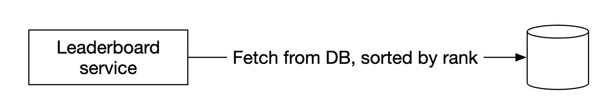
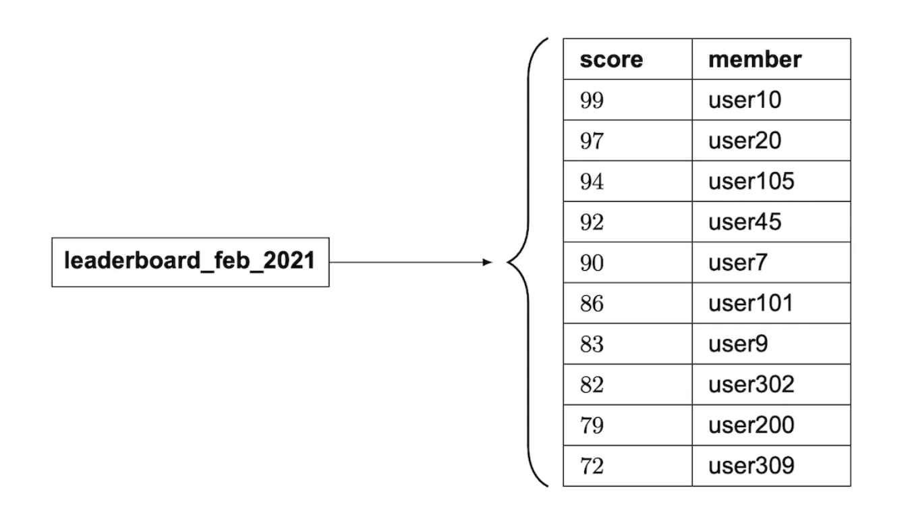
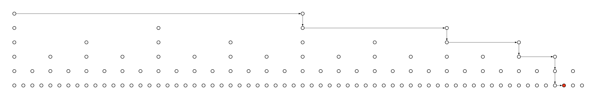

# 第 25 章：实时游戏排行榜

> 原章节：Real-time Gaming Leaderboard · 原项目路径 `25. Real-time Gaming Leaderboard/`

## 本章导读

排行榜看起来是系统设计里最简单的一类需求：按分数排序，显示前 10 名，再告诉用户他排第几。

把规模放大就完全不一样了：2500 万月活、峰值每秒 2500 次加分、必须实时、还要能查到**任意一个玩家**的名次。这时三个问题会接连冒出来——关系型数据库的 `ORDER BY score` 撑不住；单个 Redis 实例的内存会成为天花板；而一旦决定分片，"全局排名怎么算"就躲不开了。

本章真正的重点不是"用 Redis 的有序集合"，而是搞清楚**它为什么快、快到什么程度、在哪里会不够用**。

<div align="center">
  
</div>

## 你将学到

- 排行榜题的需求怎么澄清，哪些问题必须问出来
- 为什么"按分数排序"这件事，关系型数据库只能解决一半
- Redis 有序集合的底层结构（哈希表 + 跳表），以及为什么两者缺一不可
- `ZADD` / `ZINCRBY` / `ZREVRANGE` / `ZRANK` 的时间复杂度与生产用法
- 亿级成员下排名查询的真实成本，以及"分桶排名"能解决什么、不能解决什么
- 分片之后，全局 Top-K 与全局排名分别怎么算
- 实时性取舍、同分排名、防作弊、宕机恢复

---

## 1. 需求澄清与量级估算

原文记录了一段访谈对话。逐条看它为什么重要：

| 问题 | 回答 | 为什么必须问 |
|---|---|---|
| 分数怎么算？ | 赢一局得一分 | 写入模式：高频、小增量、只增不减 |
| 所有玩家都进榜吗？ | 是 | 成员基数 = 全量用户 |
| 有周期吗？ | 每月一个新赛季、新榜单 | 数据有生命周期，老榜归档、新榜初始化 |
| 只关心前 10 吗？ | 前 10，**外加指定用户的名次**；时间够再聊"前后各 4 名" | 最关键一条：**Top-K 和个人排名是两种完全不同的查询** |
| 多少用户？ | 500 万日活、2500 万月活 | 规模量级 |
| 平均打多少局？ | 每人每天 10 局 | 写入 QPS |
| 同分怎么排？ | 名次相同；时间够再聊打破平局 | 决定了排名查询的实现方式（后面会看到这是个大坑） |
| 要实时吗？ | 要，不能接受批量结果的滞后展示 | 不能用"定时重算"作为主方案 |

**功能需求**：展示前 10 名；展示指定用户的名次；（加分项）展示指定用户上下各 4 名。

**非功能需求**：分数更新实时反映到榜单；可扩展、高可用、可靠。

### 量级估算

500 万日活，一天按 10 万秒近似：

```
平均到达率：5,000,000 ÷ 100,000 = 50 人/秒
得分写入：50 × 10 局 = 500 次/秒（平均），峰值按 5 倍算 = 2500 次/秒
榜单读取：假设每人每天打开一次 = 50 次/秒（平均）
```

> **这里有个概念必须分清**
> `DAU ÷ 秒数` 得到的是**到达率（人/秒）**，是一个流量；而"同时在线人数"是一个**存量**。两者靠**利特尔法则（Little's Law）** 联系：`并发数 = 到达率 × 平均停留时长`。若玩家平均在线 10 分钟，则平均同时在线约 `50 × 600 = 30,000` 人。做容量规划（内存、连接数）要看并发数，做 QPS 规划才看到达率。原文把这两者混为一谈了。

**结论**：2500 QPS 对单个 Redis 实例（通常 10 万 QPS 量级）毫无压力，存储也在 GB 级。所以**这个规模下性能不是难点，数据结构和排名算法才是**。

---

## 2. 接口设计

```
POST /v1/scores                  # 提交分数
GET  /v1/scores                  # 取前 10 名
GET  /v1/scores/{:user_id}       # 取某个用户的名次
```

请求体包含 `user_id` 和本次赢得的 `points`。前 10 名的响应：

```json
{
  "data": [
    { "user_id": "user_id1", "user_name": "alice", "rank": 1, "score": 12543 },
    { "user_id": "user_id2", "user_name": "bob",   "rank": 2, "score": 11500 }
  ],
  "total": 10
}
```

单个用户的响应：

```json
{ "user_info": { "user_id": "user5", "score": 1000, "rank": 6 } }
```

> **两个藏在接口里的决定**
> 1. **写接口只能对游戏服务器开放，绝不能对终端客户端开放。** 客户端若能直接调它，玩家只要挂一个代理就能把分数改成任意值——这不是"可能被作弊"，而是"必然被作弊"，成本为零。
> 2. 读接口返回 `rank` 而不是一条记录，暗示后端必须能高效回答"有多少人比我高"。这是第 7 节的主题。

---

## 3. 高层架构与安全边界

<div align="center">
  
</div>

一次"玩家赢了"的流程：

1. 客户端把结果上报给**游戏服务（Game Service）**。
2. 游戏服务**校验这局是否合法**（反作弊体系的根基），再调用排行榜服务加分。
3. 排行榜服务把新分数写进**排行榜存储**。
4. 玩家查询时，客户端直接调排行榜服务拿前 10 或自己的名次。

### 被否决的替代方案

<div align="center">
  
</div>

让客户端**直接**写排行榜服务被否决，理由是经不起**中间人攻击（Man-in-the-Middle Attack）**。

> **更根本的问题**
> 让客户端上报"我赢了"本身就不成立。**服务端不能相信客户端对结果的任何陈述。** 正确做法是游戏逻辑跑在服务端，服务端自己知道谁赢了，直接加分——客户端连"我赢了"都不用说。原文也提到：服务端管理游戏逻辑时，客户端无需显式上报胜利。
>
> 这个原则叫**永不信任客户端（Never Trust the Client）**，是在线游戏和金融系统的第一条军规。

### 要不要加消息队列

<div align="center">
  
</div>

原文的结论是：除非有其他服务也关心比赛结果，否则不引入。这在面试场景下是对的，补充两点工程视角：

- **队列能削峰**：平均 500 QPS、峰值 2500 QPS，差 5 倍。缓冲后排行榜服务可按平均速率消费，机器规格能省一大截。
- **代价是排行榜变成最终一致**：分数进了队列还没消费时，榜单是旧的。而需求明确要求实时。

这是一笔明确的交易：**要削峰就接受秒级延迟，要严格实时就让写入路径同步**。在 2500 QPS 这个规模下，同步写入是更好的选择。

---

## 4. 方案一：关系型数据库

<div align="center">
  
</div>

原文在这里加了一句旁注：不该"每月建一张新表"，应该加一个 `month` 字段。**这个旁注是对的，而且比它看起来更重要。** 每月建表的代价是：表数量无限增长；查询要拼表名导致 SQL 无法参数化；跨月查询变成 UNION；建表这个 DDL 操作在高峰期执行有风险。

正确做法是加 `tournament_id`（或 `month`）字段并建复合索引——**用数据行上的一个维度区分逻辑集合，而不是用物理对象区分**。

### 用户得分

<div align="center">
  
</div>

```sql
-- 用户不存在时先插入
INSERT INTO leaderboard (user_id, score) VALUES ('mary1934', 1);
-- 之后累加
UPDATE leaderboard SET score = score + 1 WHERE user_id = 'mary1934';
```

### 查前 10 名

<div align="center">
  
</div>

未优化的写法是全表排序再取前 10，代价 O(N log N)：2500 万行排序要几秒到几十秒。

```sql
SELECT (@rownum := @rownum + 1) AS rank, user_id, score
FROM leaderboard ORDER BY score DESC LIMIT 10;
```

**这里必须说清一个常被误解的点**：加上 `score` 索引之后，`ORDER BY score DESC LIMIT 10` 其实**很快**——数据库对索引做一次反向扫描，读 10 条就停，复杂度 O(log N + 10)。原文说它"性能不好"，严格说只对**没有索引**的版本成立。

关系型数据库真正卡住的是**两件事**，原文只提到了第一件。

**第一件：查某个人的名次。**

```sql
SELECT *, (SELECT COUNT(*) FROM leaderboard lb2
           WHERE lb2.score >= lb1.score) RANK
FROM leaderboard lb1 WHERE lb1.user_id = {:user_id};
```

这个子查询要数出"有多少人分数不低于我"。即使 `score` 上有索引，这也是一次**索引范围扫描**——对中位数玩家要扫过约一半的索引条目，也就是上千万条。这是**秒级**查询，而每个用户查一次名次就触发一次。这才是真正的瓶颈。

**第二件：写入。** 2500 QPS 的 `UPDATE` 意味着每秒 2500 次 B+ 树二级索引维护：随机写、页分裂、redo log 与 binlog 追加。更麻烦的是**争用**——排行榜的更新天然集中在高分玩家所在的索引页上，这些页会成为热点。

> **一句话总结**
> 关系型数据库能高效回答"前 10 名是谁"，但**不能高效回答"我排第几"**，而且高频更新下索引维护成本很高。而排行榜的核心需求恰恰包括"我排第几"。
> 这个判断在几千用户时无所谓，但到百万级就必须换方案。

---

## 5. 方案二：Redis 有序集合

我们要找一个能支撑千万级玩家、又不需要写复杂 SQL 的方案。Redis 的**有序集合（Sorted Set，ZSET）** 正好命中。

### 底层结构：哈希表 + 跳表，缺一不可

<div align="center">
  
</div>

Redis 的有序集合内部同时维护**两个**结构：

| 结构 | 作用 | 支撑的命令 |
|---|---|---|
| **哈希表（Hash Table / dict）** | 成员 → 分数 的映射，O(1) 查分 | `ZSCORE`；`ZADD` 时判断成员是否已存在 |
| **跳表（Skip List）** | 按分数排序的链表 + 多级索引 | `ZRANGE`、`ZRANK`、`ZREVRANGE`、按分数范围查询 |

**为什么两个都要？** 因为短板刚好互补：

- 只有哈希表：能 O(1) 查到某个人的分数，但完全不知道谁排在谁前面，做不了任何排序查询。
- 只有跳表：能排序，但查某个成员的分数要 O(log N) 走一遍，也判断不了成员是否重复。

**这是本章最值得记住的一句话**：排行榜需要"按分数排序 + 按成员定位"，这是**两种不同方向的访问模式**，任何单一数据结构都只能高效支持其中一种。有序集合之所以是排行榜的标准答案，就是它用两个结构把两种访问模式都做成了对数级。

### 跳表怎么工作

<div align="center">
  
</div>

- 最底层是一条**完整的有序链表**，包含所有节点。
- 上面叠若干层**索引**，每层都是下层的稀疏抽样（Redis 里每个节点以 1/4 的概率被提升到上一层）。
- 查找从最高层开始，能往右就往右，不能往右就下一层。每层把范围缩小到约 1/4，总比较次数从 O(N) 降到 O(log N)。

<div align="center">
  
</div>

原文的例子：64 个节点里查找一个值，普通链表最坏走 62 步，跳表只需 11 步。这个数字可以验证——跳表的期望步数与 `log N` 成正比，N=64 时 `log₂64 = 6`，考虑约 2 倍的常数因子，10~12 步正好在预期内。

> **跳表里藏着一个关键字段：span**
> 跳表的每个前进指针上都附带一个 **`span`（跨度）**，记录这个指针跨过了多少个节点。
>
> **这是排名查询能做成 O(log N) 的关键。** 有了 span，从表头走到某个节点的过程中把沿途跨度累加，就能直接算出它是第几名，不需要从头数。没有 span，`ZRANK` 就退化成 O(N)。
>
> 很多讲跳表的资料只讲"多级索引加速查找"，会漏掉 span，导致你理解不了 Redis 为什么能 O(log N) 查排名。

> **两个补充**
> **小集合不用跳表**：成员数少时（Redis 7.2 前由 `zset-max-ziplist-entries` 控制、默认 128；7.2 后改名 `zset-max-listpack-entries`），Redis 用紧凑列表（listpack）存储，比跳表 + 哈希表更省内存、缓存更友好。超阈值才单向转成跳表。
>
> **为什么不用平衡树**：红黑树同样能提供 O(log N)，Redis 选跳表主要是工程性考虑——实现比平衡树的旋转和再平衡简单得多，范围查询（`ZRANGEBYSCORE`）也天然友好，找到起点后顺着底层链表走即可。

---

## 6. Redis 上的排行榜操作与容量估算

### 四个核心命令

| 命令 | 作用 | 时间复杂度 |
|---|---|---|
| `ZADD` | 成员不存在就插入，存在就更新分数 | O(log N) |
| `ZINCRBY` | 给成员分数增加增量；不存在则从 0 开始 | O(log N) |
| `ZRANGE` / `ZREVRANGE` | 按分数取区间，可指定升降序、偏移、数量 | O(log N + M)，M 是返回条数 |
| `ZRANK` / `ZREVRANK` | 取指定成员的排名（升/降序） | O(log N) |

```bash
ZINCRBY leaderboard_feb_2021 1 'mary1934'            # 加分
ZREVRANGE leaderboard_feb_2021 0 9 WITHSCORES        # 取前 10
```

每月新建一个 key，老 key 移到历史存储。

### 取某个用户前后各 4 名

<div align="center">
  
</div>

```bash
ZREVRANGE leaderboard_feb_2021 357 365
```

这个闭区间是 9 个元素，正好覆盖"本人 + 上面 4 个 + 下面 4 个"。若用户的 1 基名次是 362，0 基下标就是 361，`357..365` 的中心正是 361。✓

> **两个生产环境必须处理的边界**
> 1. **越界**：用户排第 2 名时这个区间显然不对，要先做 `max(0, rank-5)` 和 `min(总人数-1, rank+3)` 的钳制。
> 2. **下标 vs 名次**：Redis 区间参数是 0 基下标，业务上的"名次"是 1 基，差 1。混用会让整个榜单整体偏移一位——非常常见的线上 bug。
>
> 另外 **`ZREVRANGE` 在 Redis 6.2 已被废弃**，官方推荐写 `ZRANGE key 0 9 REV WITHSCORES`。

### 容量估算

原文的算法是：ID 是 24 字符、分数是 16 位整数，所以每条 26 字节：

```
26 字节 × 25,000,000 = 650,000,000 字节 ≈ 650 MB
```

**这个算法漏了两件事**（详见【勘误与补充】）：

1. **分数不是 2 字节。** Redis 把分数存成 IEEE-754 双精度浮点，占 **8 字节**。裸数据是 `24 + 8 = 32 字节`。
2. **忽略了内部开销。** 每个成员还要付出哈希表节点（约 24 字节）、SDS 字符串头 + 内存对齐（24 字符约 32 字节）、跳表节点（头部约 32 字节 + 平均 1.33 层指针 ≈ 53 字节，对齐后约 64 字节）。

**经验值约 120~150 字节/成员。重新估算：**

| 规模 | 裸数据（32 字节） | 实际经验值（约 130 字节） |
|---|---|---|
| 2500 万成员 | 800 MB | **约 3.2 GB** |
| 5 亿成员 | 16 GB | **约 65 GB** |

这个约 65 GB 恰好和原文后面"用户涨到 500mil 时需要 65GB"吻合——说明那处是按真实开销估的，只是前面 650MB 那步漏了开销，两处对不上。我们把它们接上了。

**吞吐**：2500 次写入/秒。每次 `ZINCRBY` 约 30 次内存跳转，按每次 100 纳秒算，一秒只消耗约 7.5 毫秒 CPU，占单核不到 1%。**CPU 完全不是瓶颈，真正的约束是内存和单点。**

---

## 7. 亿级规模下的排名查询

这是本章最需要算清楚的一节。很多资料（包括原笔记）只说一句"`ZRANK` 是 O(log N)"就过去了，没告诉你这意味着什么。

### `ZRANK` 到底要多少步

假设榜单有 **1 亿成员**：

```
log₂(100,000,000) ≈ 26.6
```

考虑常数因子，实际跳转大概在**几十次内存跳转**量级。每次跳转都是指针解引用，而跳表节点内存分散，绝大多数是**缓存未命中（Cache Miss）**，一次主存访问约 100 纳秒：

```
50 次跳转 × 100 纳秒 ≈ 5 微秒
```

**结论：单次 `ZRANK` 在 1 亿成员上仍是微秒级，远低于 1 毫秒。**

> **这里必须纠正一个直觉**
> 很多人以为"亿级数据查排名一定很慢"，其实**算法层面并不慢**。从 2500 万到 1 亿，`log N` 只从 24.6 涨到 26.6，多了 2 次跳转。

### 真正的瓶颈：不是算法，是单 key

1. **内存放不下一个 key。** 1 亿成员 × 约 130 字节 ≈ **13 GB**，只为一个 key。加上复制缓冲区和持久化 fork 的写时复制（Copy-On-Write）开销，实际需要 25 GB 以上。而且这个 key **无法拆分**——它是一整体。
2. **单线程串行执行。** Redis 命令执行是单线程的（6.0 之后 I/O 多线程，但命令执行仍单线程），同一 key 的所有写入必须排队。2500 QPS 没问题，但峰值到几十万 QPS 时这个 key 就是硬瓶颈。
3. **副本与故障转移代价高。** 13 GB 的 key 首次全量同步要传 13 GB；fork 做 RDB 快照时写时复制会额外占内存。
4. **热点 key。** 前 10 查询和名次查询都打向同一个 key。排行榜天然是"读多写少且高度集中"的访问模式。

### 分桶排名（分段排名）

把分数区间切成多个桶，每个桶一个 key：

```
buckets: [0-100) [100-200) ... [900-1000)
每个桶是独立的 sorted set，另有一个 hash 记录每桶成员数
```

排名公式：

```
rank(u) = 所有分数更高的桶的成员数之和
        + u 所在桶内分数严格高于 u 的成员数
        + 1
```

第二项用 `ZCOUNT bucket_key "(score" "+inf"`，复杂度 O(log(桶大小))。第一项用桶计数做**前缀和**。

**关键要诚实地说清楚：分桶并不会降低渐近复杂度。**

1 亿成员分成 1 万个桶，每桶 1 万人：

- 桶内 `ZCOUNT`：`log₂(10,000) ≈ 13` 步；
- 桶计数前缀和：朴素累加是 O(桶数) = 10000 次，反而更慢；用**树状数组（Fenwick Tree）** 或分层计数可做到 `log₂(10,000) ≈ 13` 步。

合计约 26 步，和直接 `ZRANK` 的 27 步几乎一样。所以：

> **分桶的真实价值不是"把 O(log N) 变低"，而是：**
> 1. **把内存和写入压力分散到多个 Redis 实例**——这才是它解决的核心问题；
> 2. **让 Top-K 只读顶部少数几个桶**，不用碰全量数据；
> 3. **让"百分位"这类近似指标变便宜**（只读桶计数，误差上界是一个桶的容量）。
>
> 如果有人说"分桶能把排名查询降到 O(1)"，那是错的——除非你愿意接受误差，放弃桶内精确排名。

**分桶的两个真实难点**（原文完全没提）：

- **分数分布是长尾的，等宽分桶会严重倾斜。** 真实游戏里绝大多数玩家挤在低分段。按等宽切分，最低的桶可能有 2000 万人，最高的桶可能只有几百人，桶内查询又退化成大 key 问题。**正确做法是按分位数（Quantile）切分**，让每桶人数大致相等，代价是桶边界要定期重算，而边界一变，所有历史排名的口径都要重新解释。
- **每次加分都可能跨桶。** 分数越过边界时需要"从旧桶删除 + 插入新桶 + 更新两个桶计数"，三步必须原子完成（可用 Lua 脚本），但脚本期间会阻塞主线程。而且**计数结构本身会成为新的热点**。

---

## 8. 分片与全局聚合排名

当数据量必须分片时，最难的问题不是"数据放哪"，而是**"全局排名怎么算"**。这是原文着墨最少、面试官最可能追问的地方。

### 方式一：按分数范围分片

<div align="center">
  
</div>

按分数区间切到不同实例，`user_id → 分片` 的映射放在应用层（或存在 MySQL / 另一个缓存里）。

**取前 10 名**：从分数最高的分片开始查。原文说"查 `[900-1000]` 这个分片"，这只在**该分片至少有 10 个成员**时成立。最高的桶往往是稀疏的，必须**依次向下取直到凑够 10 个**。

**取某个人的排名**：

```
rank(u) = Σ ZCARD(所有比 u 所在分片更高的分片)
        + ZCOUNT(u 所在分片, "(score(u)", "+inf")
        + 1
```

原文说这一步可以用 `INFO keyspace` 拿到分片总记录数，是 O(1)。**这个说法是错的**：`INFO keyspace` 返回的是 **key 的数量**（形如 `db0:keys=1,expires=0,avg_ttl=0`），不是 sorted set 的**成员数**。整个分片就是一个 sorted set 时，它会返回 `keys=1`。正确命令是 **`ZCARD key`**（O(1)）。

**按分数范围分片的问题：**

| 问题 | 说明 |
|---|---|
| **倾斜** | 分数长尾分布 → 低分桶巨大、高分桶极小，与分片均衡的初衷相反 |
| **跨桶写入** | 分数越过边界要跨分片搬数据，不是原子操作 |
| **底部热点** | 绝大多数加分发生在低分玩家身上，写入压力集中在最低的桶 |
| **边界重算** | 分位数切分需定期重算，重算期间排名口径会变 |

### 方式二：按哈希分片

<div align="center">
  
</div>

**取前 10 名**：必须**扇出到所有分片**，每个分片取自己的前 10，再在应用层合并排序。

<div align="center">
  
</div>

这是经典的 **scatter-gather（分散-聚合）** 模式。代价随分片数线性增长：K 越大每分片返回越多；分片越多扇出越广，**尾延迟（Tail Latency）** 越差——一次请求的延迟等于**最慢那个分片**的延迟。

**取某个人的排名**：原文说"没有直接办法确定用户排名"。**这个说法不准确。**

分片按 `user_id` 哈希，每个成员**恰好存在于一个分片**中，所以：

```
rank(u) = 1 + Σ 所有分片 ZCOUNT(shard_i, "(score(u)", "+inf")
```

这个和式是**精确的**，不是估算。总复杂度是 `O(分片数 × log N)`。代价是**网络往返次数**：10 个分片并行约 1~2 毫秒，完全可接受；1000 个分片即使并行，尾延迟也会很难看。

> **准确的结论**
> 哈希分片下**可以**算出精确的全局排名，代价是**扇出次数与分片数成正比**。
> 工程上更常见的选择是**降低精度换性能**——只采样部分分片估算，或者像原文说的，直接告诉用户"你在前 X%"。

### 方式三：两套结构（生产中最常用）

- **精英榜**：只放前 N 名（比如前 10,000 名）的 sorted set，永远在一个实例上，保证 Top-K 和头部用户的个人名次都是 O(log N)。
- **全量榜**：按用户哈希分片，用于计算百分位、发放奖励、后台统计。

因为**用户真正会看的只有前几名和自己的名次**，而自己的名次在头部之外时，展示"前 5%"和展示"第 1,237,456 名"的体验差别很小。

### 三种方案对比

| 方案 | Top-K | 个人精确排名 | 写入扩展性 | 主要代价 |
|---|---|---|---|---|
| **单实例单 key** | O(log N + K) | O(log N) | 差（单 key） | 内存上限、单点 |
| **按分数范围分片** | 从高到低依次取 | O(分片数 + log N) | 中（有倾斜） | 倾斜、跨桶写、边界重算 |
| **按哈希分片** | 扇出 + 合并 | O(分片数 × log N)，精确 | 好 | 扇出延迟随分片数增长 |
| **精英榜 + 全量榜** | O(log N + K) | 头部精确、其余近似 | 好 | 两套数据要同步 |

**原文倾向"固定分区（按分数范围）"**。前两条理由成立；第三条（难以确定用户排名）不成立，但**"扇出成本随分片数增长"这个更本质的理由已经足够支撑同样的结论**。

---

## 9. 自建、云托管与 NoSQL

### 自己管服务

<div align="center">
  
</div>

典型组合：Redis 存排行榜，MySQL 存用户资料（用户名、昵称），需要扩展数据库时再加一层缓存。

### 云托管 / 无服务器

<div align="center">
  
</div>

用 AWS API Gateway 把请求路由到 AWS Lambda：不用自己管理或预置服务器，按需运行、自动伸缩。

<div align="center">
  
</div>

<div align="center">
  
</div>

Lambda 是**无服务器架构（Serverless Architecture）** 的一种实现。原文作者建议：如果从零开始做这个游戏，可以走这条路。

> **无服务器的代价，原文没提**
> - **冷启动（Cold Start）**：长时间不被调用后首次请求要等运行环境初始化，可能多出几百毫秒，对实时接口是抖动。
> - **执行时长上限**：Lambda 单次最长 15 分钟，且不适合长连接（如 WebSocket 推送）。
> - **按请求计费**：API Gateway 和 Lambda 都按请求数 + 执行时长计费。500 QPS 平均下一天约 4300 万次请求，**持续高 QPS 场景下按量计费的总成本可能高于一台固定规格的服务器**。要用真实流量算账单再决定，而不是凭"无服务器更省钱"的印象。
> - **供应商锁定与调试困难**。
>
> 另外，**"无服务器"不等于"没有服务器"**，只是不用你管服务器。这句话说出来能体现你对术语的准确理解。

### 备选方案：NoSQL

<div align="center">
  
</div>

针对"写入量大 + 能在同一分区内按分数排序"这两点优化的 NoSQL 都可以：DynamoDB、Cassandra、MongoDB。原文选了 DynamoDB：全托管、性能可靠、扩展性好，还支持**全局二级索引（Global Secondary Index，GSI）**。

从一张棋类游戏的表开始：

<div align="center">
  
</div>

一旦要按分数查询就不行了，于是把分数设成排序键（Sort Key）：

<div align="center">
  
</div>

还有个问题：**按月份做分区键会导致热点分区**——最新月份被不成比例地访问，其他月份几乎没人碰。解决办法叫**写分片（Write Sharding）**：给每个 key 追加一个分区编号，通过 `user_id % num_partitions` 计算：

<div align="center">
  
</div>

**分片数量是一笔明确的交易**：分片越多，写入扩展性越好；但读取扩展性越差——要收集聚合结果必须查询更多分区。

<div align="center">
  
</div>

这就是前面说的 scatter-gather：**时间复杂度随分区数增长**。分片数必须靠基准测试确定，不能拍脑袋。

这个方案还有一个硬伤：**很难算出某个用户的具体名次**，因为名次需要跨分区统计，而 DynamoDB 没有 Redis 那种带 span 的跳表。

原文给出的折中是：既然规模大到必须分片，就干脆**只告诉用户百分位（Percentile）**，用定时任务周期性地分析分数分布：

```
第 10 百分位 = 分数 < 100
第 20 百分位 = 分数 < 500
...
第 90 百分位 = 分数 < 6500
```

> **两点补充**
> 1. **百分位在 Redis 上可以实时算**，不需要定时任务：`百分位 = 1 - ZRANK(key, user) / ZCARD(key)`。定时任务只是"没有跳表"时的替代手段，而且它的输出是**快照**，严格说已不满足"实时"这条非功能需求——这个取舍必须向面试官说清楚。
> 2. **百分位的误差来自桶的粒度。** 用固定分数阈值划分，分布一变（赛季中期玩家普遍变强）阈值就失真。更稳的做法是按分位数定期重算阈值。

---

## 10. 实时性与一致性取舍

需求说"实时"，但"实时"到底指什么？这里有三个层面，分开讲会显得非常专业。

### 层面一：写入路径——写扩散 vs 定时重算

| 策略 | 做法 | 优点 | 缺点 |
|---|---|---|---|
| **写扩散（Fan-out on Write）** | 分数一变，立刻更新所有相关榜单 | 读最快，榜单永远最新 | 写放大：一次得分写 N 个榜单 |
| **定时重算（Periodic Recompute）** | 定期（如每 10 秒）重新扫描生成榜单 | 写路径极轻 | 有延迟；重算期间可能不一致 |

**榜单少（如全局榜 + 赛季榜）时用写扩散**，两个榜单的写放大完全可以接受。

**派生视图很贵时用定时重算**：

- **好友榜**：每个用户有几百个好友，若给每人维护一个"好友榜"，一次得分要更新几百个榜单——写放大到不可接受。这时应用**读扩散（Fan-out on Read）**：读的时候取该用户好友的分数集合（几百到几千个）排序返回，因为好友数有上限，成本可控。
- **地区榜 / 模式榜 / 百分位**：这些是聚合视图，定时重算是合理选择。

> **注意 Fan-out 的方向，很容易写反**
> **Fan-out on Write = 写扩散 / 推模式**：写入时就扩散。
> **Fan-out on Read = 读扩散 / 拉模式**：读取时才聚合。
> 写扩散优化读，读扩散优化写。选哪个取决于读写比例。

### 层面二：读取路径

即使 Redis 里是实时的，读到的也可能不是：

- **应用层缓存**：把前 10 名缓存 1 秒，能挡掉大量重复请求（前 10 名一秒内通常不变）。
- **Redis 副本读取**：Redis 主从复制是**异步**的，从副本读可能读到落后几毫秒到几秒的数据。

**推荐策略**：

- **前 10 名**：可以从副本读，甚至加 1 秒缓存。用户对"榜单少了我刚打的那局"容忍度很高。
- **"我的名次"**：刚打完一局立刻查自己名次，读副本就可能看不到刚加的分——这是典型的**写后读（Read-Your-Writes）** 问题。解决方式：用户自己的名次走主节点读，或用会话粘性，或等待副本追到指定位点。

### 层面三：跨地域

全球部署时跨区域复制延迟是几十到几百毫秒，且通常异步，全球榜单必然是**最终一致**的。合理取舍是：**分区榜（Region Leaderboard）本地实时，全球榜最终一致**。

> **面试时怎么回答"这个系统是强一致还是最终一致"**
> 正确答案是**分层的**：
> - 单个 Redis 主节点上的 `ZINCRBY` 是原子操作，对**同一个 key 的读写是强一致的**；
> - 但"分数提交 → 榜单可见"这条链路上如果有消息队列、应用缓存、跨区域复制，整体就是**最终一致**的；
> - 关键是把**可接受的延迟窗口量化出来**（比如"前 10 名最多滞后 1 秒，个人名次不滞后"），而不是笼统地说"我们保证了实时"。

---

## 11. 同分排名规则

原文在需求里问了这一点，回答是"名次相同"，收尾时说可以用"最后一局的时间"打破平局。这里有一个**必须纠正的技术细节**。

### 并列名次的两种定义

| 规则 | 名次序列 | 说明 |
|---|---|---|
| **标准竞赛排名（Standard Competition Ranking，1224）** | 1, 2, 2, 4 | 并列后跳号，符合"有多少人比我高"的直觉 |
| **密集排名（Dense Ranking，1223）** | 1, 2, 2, 3 | 并列不跳号 |

游戏排行榜通常用**标准竞赛排名**：并列都发第 2 名的奖励，比"第 3 名不存在"更符合玩家直觉。

### Redis 的 `ZRANK` 不给并列名次

这是原笔记里一个实实在在的矛盾：需求说"同分名次相同"，实现却说"用 `ZREVRANK` 拿名次"。

**但 `ZRANK` / `ZREVRANK` 返回的是成员在有序序列中的位置（0 基下标），不是并列名次。** 同分的两个成员，Redis 会按**成员名的字典序**给它们排出不同的位置——分数都是 1000 的 `user5` 和 `user9` 会拿到两个不同的值，而不是都返回 5。

**正确做法**是用 `ZCOUNT` 数出"分数严格高于我"的人数再加 1：

```bash
ZCOUNT leaderboard_feb_2021 "(1000" "+inf"   # 返回 N，名次 = N + 1
```

复杂度仍是 O(log N)，因为 Redis 官方文档明确说明 `ZCOUNT` 的复杂度只有 O(log N)，正是因为它借助了元素排名。

> **如果确实要打破平局**（比如并列时按"谁先达到该分数"排），有两种做法：
>
> 1. **复合分数**：把分数和平局因子编码进一个浮点数，如 `score × 2²⁰ − 最后对局时间戳`。实现简单，但浮点数只有 53 位有效位（IEEE-754 双精度），分数很大且平局因子需要高分辨率时精度会被吃掉，出现意料之外的并列。
> 2. **成员名里带平局信息**：成员名编码成 `{时间戳}:{user_id}`，分数仍只用真实分数。同分时按成员名字典序就是按时间戳排。代价是每次更新分数都要 `ZREM` 旧成员 + `ZADD` 新成员（成员名变了），写入成本翻倍，且查询时必须能精确重建成员名。
>
> **实践建议**：只需并列名次就用 `ZCOUNT`；确实要打破平局优先考虑方案 2，但要用 Lua 脚本保证 `ZREM` + `ZADD` 的原子性。

---

## 12. 防作弊：分数提交的校验

原文只有"游戏服务校验这局是否合法"一句。**分数是这个系统里唯一有价值的资产，一旦能被伪造，整个排行榜就失去意义。**

| 层次 | 措施 | 拦截什么 |
|---|---|---|
| **信任边界** | 分数只能由服务端写入，客户端无权调用写接口 | 代理改包、直接调接口 |
| **身份认证** | 写接口要求服务端到服务端的双向认证（mTLS）或签名 | 伪造服务端身份 |
| **请求完整性** | 请求体做 HMAC 签名 + 带 nonce 和时间戳 | 重放攻击（Replay Attack）、篡改 |
| **业务校验** | 服务端**重算**这局结果，而不是相信上报的分数 | 客户端伪造胜负 |
| **合理性校验** | 单次加分必须在合理范围（如 1~3 分），单位时间加分速率有上限 | 异常高分 |
| **统计检测** | 离线分析分数增长曲线，识别离群用户 | 慢速、分散的作弊 |
| **限流** | 按 `user_id` 限制提交频率 | 批量刷分 |

**服务端复算是关键**：不要接受"我赢了，加 1 分"这样的陈述。服务端应自己持有对局信息、按规则算出谁赢该加多少分，只把自己算出来的结果写进排行榜。如果游戏逻辑确实跑在客户端，至少要做**统计异常检测**——正常玩家一天 10 局，一天刷 10000 分的必须被标记。

**一个容易被忽略的点：重放攻击。** 攻击者不需要伪造分数，只要把一次合法的加分请求重放 100 次就能刷 100 分。所以写接口**必须**带 nonce（一次性随机数）或幂等键，服务端记录已处理过的 nonce。这个机制和第 26 章支付系统的幂等键是同一个东西。

---

## 13. 持久化与灾难恢复

### Redis 的两种持久化

| 方式 | 机制 | 数据丢失窗口 | 代价 |
|---|---|---|---|
| **RDB（快照）** | 定期 fork 子进程把内存数据写成快照 | 上次快照之后的所有写入 | fork 时写时复制，大 key 有内存翻倍风险 |
| **AOF（追加日志）** | 每条写命令追加到日志 | `appendfsync everysec` 下最多约 1 秒 | 文件更大，恢复更慢 |

**关键认知：持久化只能减少丢失，不能消除丢失。** `everysec` 最坏丢 1 秒数据。对排行榜来说这是可接受的——因为**排行榜数据可以从源头重建**。

### 副本不等于不丢数据

原文说"可以起一个 Redis 副本来避免宕机时丢数据"。这句话需要打补丁：**Redis 的主从复制默认是异步的**，主节点处理完写入就返回成功，不会等副本确认。主节点在复制完成前宕机，这部分数据就丢了。

想要更强保证可以用 `WAIT numreplicas timeout`（阻塞到指定数量副本确认收到，但不保证副本已落盘），或 `min-replicas-to-write`（副本不足时拒绝写入，牺牲可用性换一致性）。

**但对排行榜来说，不值得为强持久化付出性能代价**，因为数据可重建。这是一个"按数据价值分级"的好例子：**用户的钱必须强持久化，用户的游戏分数可以从源重建。**

### 从数据库重建

原文提到用 MySQL 的第二张表在故障时重建排行榜，收尾里说通过遍历 **MySQL 的 WAL（Write-Ahead Log，预写日志）** 条目用脚本重建。

> **这个建议值得商榷**
> 解析 binlog 重建排行榜是可行的，但非常规：binlog 格式（ROW / STATEMENT / MIXED）和版本相关，解析脚本很脆弱；binlog 里混着所有表的变更，需要过滤和重放逻辑；binlog 还有保留期限（`binlog_expire_logs_seconds`），过期就没了。
>
> **更标准的做法是维护一个只追加的"得分事件表"**：
>
> ```sql
> CREATE TABLE score_events (
>   event_id      BIGINT AUTO_INCREMENT PRIMARY KEY,
>   user_id       VARCHAR(24) NOT NULL,
>   tournament_id VARCHAR(16) NOT NULL,
>   points        SMALLINT    NOT NULL,
>   created_at    TIMESTAMP   NOT NULL,
>   INDEX idx_tournament_user (tournament_id, user_id)
> );
> ```
>
> 重建时直接聚合，或按 `event_id` 顺序用管道（Pipeline）批量 `ZADD` 写入 Redis：
>
> ```sql
> SELECT user_id, SUM(points) AS score
> FROM score_events WHERE tournament_id = '2021-02' GROUP BY user_id;
> ```
>
> 这样重建逻辑是显式的、可测试的，不依赖数据库内部格式。

**重建要多久？** 2500 万条记录，用管道批量 `ZADD`（每批 1000 条）在单实例上大约能到每秒几十万次操作，重建时间在**分钟级**。这个数字决定了你的 RTO（恢复时间目标）能不能接受。

| 故障 | 恢复手段 | 目标恢复时间 |
|---|---|---|
| 单个 Redis 节点宕机 | 副本提升 | 秒级 |
| 整个 Redis 集群不可用 | 从 `score_events` 表重建 | 分钟级 |
| 数据库也丢了 | 从备份恢复 | 小时级 |

> **工程原则**
> **把排行榜当作"派生数据"（Derived Data），而不是"源数据"（Source of Truth）。** 源数据是"谁在何时赢了多少分"这个事实，存在关系型数据库或事件日志里；排行榜只是它的**物化视图**。这个定位一明确，恢复策略就顺理成章了：缓存丢了就重建。

### 其他收尾话题

- **更快的读取**：用 Redis 哈希缓存用户对象（`user_id → user object`）。前 10 名的用户信息会被频繁读取，缓存收益很高。原文也提到可以缓存前 10 名用户详情。
- **赛季切换**：让 key 里带赛季标识（`leaderboard_2021_02`），新旧榜天然隔离，不需要"清空"操作。
- **冷热分离**：历史赛季榜单基本只读，可迁到更便宜的存储，只在用户查看历史战绩时加载。
- **监控告警**：`ZINCRBY` 的 P99 延迟、Redis 内存使用率、主从复制延迟，以及"榜单人数异常下降"这类业务指标。

---

## 勘误与补充

> 原笔记本章整体结构清晰、判断基本正确，但在几处数字、命令和结论上存在可核实的问题。

### 勘误 1：量级估算里的 DAU 前后不一致

- **原文说法**：需求澄清里是"5mil DAU and 25mil MAU"，但量级估算一节开头写的是"With 50mil DAU"。
- **问题**：两处相差 10 倍。从后续推算反推可以确定哪个对：原文算出"50 users per second"，而 `5,000,000 ÷ 100,000 = 50`、`50,000,000 ÷ 100,000 = 500`。所以正确值是 **5mil（500 万）DAU**。
- **正确说法**：500 万 DAU，按每天 10 万秒近似，平均到达率 50 人/秒。
- **延伸**：这类"同一数字在不同段落不一致"的错误在技术文档里很常见，通常是改了需求但没回头改估算。**读任何系统设计资料时，遇到数字都应该自己反推一遍。**

### 勘误 2：把"到达率"当成了"同时在线人数"

- **原文说法**："we'd have an average of 50 users per second... the peak online users would be 250 users per second"。
- **问题**：`DAU ÷ 秒数` 得到的是**到达率（人/秒）**，不是**同时在线人数**。原文用"peak online users"指代一个单位为"人/秒"的量，把存量和流量混为一谈了。
- **正确说法**：两者靠**利特尔法则**联系：`并发数 = 到达率 × 平均停留时长`。若平均在线 10 分钟，平均同时在线约 `50 × 600 = 30,000` 人。容量规划（内存、连接数）看并发数，QPS 规划才看到达率。
- **延伸**：利特尔法则不需要任何分布假设就能成立，在估算消息队列积压、连接池大小、线程池大小时都会用到。

### 勘误 3：关系型数据库"性能不好"的说法不准确

- **原文说法**：`ORDER BY score DESC` 全表排序 "is not performant though as it makes a table scan"。
- **问题**：原文把两件事混在一起了。**加了 `score` 索引之后，`ORDER BY score DESC LIMIT 10` 本身是高效的**——对索引做反向扫描，只读 10 条就停，复杂度 O(log N + 10)。
- **正确说法**：真正的瓶颈是**排名查询**（`COUNT(*) WHERE score >= X` 要扫过约一半的索引条目，中位数玩家要扫上千万条）和**高频更新的索引维护成本**。原文后面那句"用户不在榜单头部又想定位名次时不好扩展"其实说到了点子上，只是前面那句总结下错了。
- **延伸**：面试里区分 **Top-K 查询**和**排名查询**很关键。Top-K 是 B+ 树索引的强项；排名查询需要"数出比我大的有多少个"，是索引结构的弱项——除非索引里存了子树大小（这正是跳表 span 字段做的事）。

### 勘误 4：每条记录 26 字节的估算漏了两件事

- **原文说法**："ID is 24-character string and score is 16-bit integer, we need 26 bytes * 25mil = ~650MB"。
- **问题**：
  1. **分数不是 16 位。** Redis 把分数存成 IEEE-754 双精度浮点，占 **8 字节**，不是 2 字节。裸数据至少是 `24 + 8 = 32 字节`。
  2. **完全忽略了 Redis 内部开销**：哈希表节点约 24 字节、SDS 头 + 内存对齐约 32 字节、跳表节点约 64 字节。经验值合计约 **120~150 字节/成员**。
- **正确说法**：2500 万成员实际约 **3~3.5 GB**；5 亿成员约 **65 GB**。
- **延伸**：原文后面写"用户涨到 500mil 时需要 65gb"——这个数字恰好和按真实开销算出的结果吻合。也就是说两处估算用了不同口径，一处漏了开销、一处算了开销。**把两处接上之后，结论（需要分片）反而是成立的。**

### 勘误 5：`INFO keyspace` 拿不到 sorted set 的成员数

- **原文说法**："add up all users with higher scores in other shards. The latter is a O(1) operation as total records per shard can quickly be accessed via the info keyspace command."
- **问题**：`INFO keyspace` 返回的是**数据库里 key 的数量**（形如 `db0:keys=1,expires=0,avg_ttl=0`），**不返回 sorted set 的成员数**。整个分片就是一个 sorted set 时它会返回 `keys=1`，而不是 2500 万。
- **正确说法**：获取成员数的正确命令是 **`ZCARD key`**，复杂度 **O(1)**。所以"这一步是 O(1)"的结论对，但用错了命令。
- **延伸**：`INFO` 是诊断命令，返回服务器级统计（内存、连接、命令统计、keyspace 概览），**不是数据结构级元数据**。要拿数据结构的元信息应该用该结构自己的命令：`ZCARD`、`LLEN`、`HLEN`、`SCARD`、`STRLEN`。

### 勘误 6：Redis Cluster 不是代理，也不是一致性哈希

- **原文说法**："we can use hash partitioning via Redis Cluster. It is a proxy which distributes data across redis nodes based on partitioning similar to consistent hashing, but not exactly the same"。
- **问题**：
  1. **Redis Cluster 不是代理（proxy）。** 它是**去中心化**集群：每个节点持有完整的槽位映射表，节点间通过 Gossip 协议交换状态；客户端连任意节点，key 不在该节点时节点返回 `MOVED` / `ASK` 重定向，客户端缓存映射后直连正确节点。**整个链路上没有代理进程。**（Twemproxy、Codis、Envoy 的 Redis 过滤器是另外的代理方案，不是 Redis Cluster 本身。）
  2. **它不是一致性哈希。** Redis Cluster 用**固定哈希槽（Hash Slot）**：共 **16384 个槽**，用 `CRC16(key) mod 16384` 决定归属，槽再分配给节点。这是确定性哈希，**没有哈希环、没有虚拟节点**，和一致性哈希是两套机制。它还支持哈希标签 `{...}` 强制多个 key 落到同一槽。
- **正确说法**：Redis Cluster 使用 16384 个固定哈希槽 + 客户端重定向（`MOVED`/`ASK`）的架构，没有代理层，也不是一致性哈希。
- **延伸**：为什么是 16384 而不是 65536？Redis 作者的公开解释是：节点心跳要携带槽位位图，16384 个槽对应 2 KB，65536 个槽对应 8 KB——每秒多次心跳下带宽代价不划算；而 Redis Cluster 的设计节点数上限在千级，16384 个槽足够均匀。这个细节在面试里提一句，能立刻区分出你是否真的读过文档。

### 勘误 7：哈希分片下"无法确定用户排名"不成立

- **原文说法**："There is no straightforward approach to determine a user's rank"。
- **问题**：结论过于绝对。**用 `ZCOUNT` 扇出可以精确算出全局排名。** 分片按 `user_id` 哈希，每个成员恰好存在于一个分片中，所以"分数严格高于某人的总人数"等于各分片中该人数之和：
  ```
  rank(u) = 1 + Σ_i ZCOUNT(shard_i, "(score(u)", "+inf")
  ```
  这是**精确值**，不是估算。总代价是 O(分片数 × log N) 次操作加 N 次网络往返。
- **正确说法**：哈希分片下可以精确计算全局排名，代价是**扇出次数随分片数线性增长**。
- **延伸**：这个更正不改变原文的结论（作者仍推荐按分数范围分区），但**理由要换掉**。正确的理由是"扇出成本随分片数增长、尾延迟受最慢分片拖累"，而不是"算不出来"。面试里给出错误的理由比给不出理由更危险——面试官顺着追问，一旦发现其实能算，前面的判断就站不住了。

### 补充 1：`ZREVRANGE` 已被废弃

原文通篇使用 `ZREVRANGE`。该命令在 **Redis 6.2 已被标记为废弃**，官方推荐用带 `REV` 参数的 `ZRANGE`：

```bash
ZREVRANGE leaderboard_feb_2021 0 9 WITHSCORES   # 旧写法，仍可用但不建议
ZRANGE    leaderboard_feb_2021 0 9 REV WITHSCORES  # 推荐写法（Redis 6.2+）
```

同类被废弃的还有 `ZREVRANGEBYSCORE`、`ZREVRANGEBYLEX`。另外 `ZRANK` / `ZREVRANK` 在较新版本（Redis 7.2+）支持 `WITHSCORE`，可一次拿到名次和分数，省掉一次 `ZSCORE`。

### 补充 2：`ZRANK` 不返回并列名次（与需求矛盾）

需求明确说"同分名次相同"，实现却说"用 `ZREVRANK` 拿名次"——**两者不能同时成立**。`ZRANK` / `ZREVRANK` 返回的是序列**位置（0 基下标）**，同分成员会按成员名字典序拿到不同位置。

**正确做法**是 `1 + ZCOUNT(key, "(myScore", "+inf")`，复杂度仍是 O(log N)。详见第 11 节。这是本章最重要的一处实现级错误。

### 补充 3：全局聚合排名的完整算法

原文对"分片后怎么算全局排名"几乎没有展开，这是本章最难的工程问题。完整讨论见第 8 节，核心结论：

| 分片方式 | Top-K | 精确全局排名 |
|---|---|---|
| 按分数范围 | 从最高分片依次向下取，凑够 K 个 | Σ 更高分片 `ZCARD` + 本分片 `ZCOUNT` + 1 |
| 按哈希 | 所有分片各取 Top-K 后合并（scatter-gather） | Σ 所有分片 `ZCOUNT` + 1（精确，但扇出 N 次） |
| 精英榜 + 全量榜 | 只读精英榜 | 头部精确，其余用百分位近似 |

### 补充 4：分桶排名不会降低渐近复杂度

原文没提分桶。很多资料会说"分桶能把排名查询从 O(log N) 降到 O(1)"，这是**错的**。分桶的真实价值是把内存和写入压力分散到多个实例，以及让 Top-K 只读顶部桶。详见第 7 节。

### 补充 5：实时性与一致性的三层分解

原文的非功能需求只写了"实时更新"，没有拆解。实际应分成写入路径（写扩散 vs 定时重算）、读取路径（缓存与副本延迟）、跨地域三层，并给出每层可接受的延迟窗口。详见第 10 节。

### 补充 6：防作弊的分层设计

原文只有"游戏服务校验是否合法"一句。完整防御包括信任边界、身份认证、请求完整性（签名 + nonce 防重放）、服务端复算、合理性校验、统计检测、限流。详见第 12 节。

### 补充 7：持久化的真实保证与重建方式

原文说"起一个 Redis 副本可以避免宕机丢数据"，但**Redis 主从复制默认异步**，主节点在复制完成前宕机仍会丢数据。另外原文建议"遍历 MySQL 的 WAL 重建排行榜"——binlog 解析脆弱、格式依赖版本、有保留期限。更标准的做法是维护只追加的 `score_events` 表，重建时聚合或重放。详见第 13 节。

---

## 常见误区

| 误区 | 为什么错 | 正确理解 |
|---|---|---|
| "排行榜就是 `ORDER BY score`" | 关系库能高效回答"前 10 名"，但回答不了"我排第几"——后者要数出所有比我高的人 | 核心查询是**排名查询**，需要"按分数排序 + 能算排名"的数据结构 |
| "Redis 快是因为它在内存里" | 内存只是一半原因，MySQL 的缓冲池也在内存里。关键在于**数据结构**：跳表的 span 让 O(log N) 算排名成为可能 | 选 Redis 是为了它的**有序集合语义**，不只是内存速度 |
| "`ZRANK` 是 O(log N)，所以亿级也不怕" | 算法确实不怕（2500 万到 1 亿只多 2 次跳转），但**一个 key 占 13 GB**、单线程串行、副本同步、热点争用都会崩 | 亿级的瓶颈在**内存与单点**，不在算法。解法是分片，而分片带来全局排名问题 |
| "分桶能把排名查询降到 O(1)" | 桶内仍要精确排名，前缀和也要 O(log 桶数)，合计仍是 O(log N) 量级 | 分桶的价值是**分散内存与写入压力**、让 Top-K 只读顶部桶、让百分位变便宜 |
| "同分的人 `ZRANK` 会返回相同的值" | `ZRANK` 返回序列位置，同分成员按成员名字典序拿到不同位置 | 用 `1 + ZCOUNT(key, "(score", "+inf")` 才能得到并列名次 |
| "分片后就没法算全局排名了" | 哈希分片下每个成员只在一个分片，各分片 `ZCOUNT` 求和就是精确的全局排名 | 能算，代价是**扇出次数随分片数增长**。真正的问题是尾延迟，不是可行性 |
| "起了 Redis 副本就不会丢数据" | 主从复制默认异步，主节点在复制完成前宕机仍会丢 | 要减少窗口用 `WAIT` 或 `min-replicas-to-write`；但排行榜是派生数据，**从源重建才是正解** |
| "等宽切分分数区间就能均衡分片" | 游戏分数是长尾分布，低分玩家占绝大多数，等宽切分会让最低的桶巨大 | 要按**分位数**切分，让每桶人数大致相等，代价是边界需要定期重算 |
| "写扩散一定比读扩散好" | 写扩散的写放大随"榜单数量"增长，好友榜这类场景会放大到不可接受 | 榜单少用写扩散（简单、读快），榜单多且读者集合有上限时用读扩散 |
| "无服务器一定更省钱" | 按请求计费，持续高 QPS 下总成本可能高于固定规格服务器 | 用真实流量算账单再决定；同时评估冷启动、执行时长上限、供应商锁定 |

---

## 面试速记

- **一句话概括**：本章设计的是一套"实时 Top-K + 个人排名"系统，核心是用 Redis 有序集合把排名查询做到 O(log N)，并在数据量超出单实例后用分片 + 聚合排名解决扩展性。

- **必答要点**：
  1. **写接口只能对游戏服务器开放**，客户端绝不能直接提交分数；服务端要**复算**结果而不是相信上报。
  2. **Redis 有序集合 = 哈希表 + 跳表**：哈希表负责 O(1) 按成员查分，跳表负责 O(log N) 排序与排名；跳表节点上的 **span** 字段是排名能做成 O(log N) 的关键。
  3. **`ZINCRBY` 加分（O(log N)）、`ZREVRANGE` 取前 K（O(log N + K)）、`ZCOUNT` 算名次（O(log N)）**。名次必须用 `ZCOUNT` 而不是 `ZRANK`，否则同分名次是错的。
  4. **亿级的瓶颈是内存和单 key，不是算法**：2500 万成员约 3 GB，5 亿成员约 65 GB。
  5. **分片后全局排名**：按分数范围分片则"更高分片 `ZCARD` 之和 + 本分片 `ZCOUNT`"；按哈希分片则"全部分片 `ZCOUNT` 求和"，精确但扇出 N 次。

- **加分项**：
  1. 主动区分 **Top-K 查询**和**排名查询**，说明为什么关系型数据库只擅长前者。
  2. 主动指出**分桶不会降低渐近复杂度**，它解决的是内存与写入分散问题。
  3. 主动提出**精英榜 + 全量榜**的双结构，头部用户看精确名次、其余用户看百分位。
  4. 主动提到**排行榜是派生数据**，源数据是得分事件表，因此恢复策略是"重建"而非"抢救"。
  5. 主动用**利特尔法则**把 DAU 换算成同时在线人数。

- **高频追问**：
  1. *"为什么不用 MySQL 直接 `ORDER BY score`？"*
     → 前 10 名其实可以（索引反向扫描，O(log N + 10)）。真正不行的是**排名查询**：`COUNT(*) WHERE score >= X` 要扫过约一半索引条目，中位数玩家要扫上千万条，是秒级操作。加上 2500 QPS 的索引维护成本，就不合适了。
  2. *"1 亿成员的排行榜，`ZRANK` 要多久？"*
     → `log₂(10⁸) ≈ 27`，实际跳转约几十次，每次是缓存未命中的主存访问（约 100 纳秒），合计约 **5 微秒**。算法上完全没问题。问题是这一个 key 要占约 **13 GB 内存**，且无法拆分、无法并行写。
  3. *"分片之后怎么算全局排名？"*
     → 分情况。哈希分片下用 `ZCOUNT` 扇出求和，**结果是精确的**，代价是 N 次网络往返、尾延迟受最慢分片影响。分数范围分片下用"更高分片 `ZCARD` 求和 + 本分片 `ZCOUNT`"。规模再大就退化成百分位近似。
  4. *"两个人分数一样，Redis 返回的名次一样吗？"*
     → 不一样。`ZRANK` 返回序列位置，同分按成员名字典序排列，会拿到不同值。要并列名次必须用 `1 + ZCOUNT(key, "(score", "+inf")`。
  5. *"Redis 挂了排行榜数据怎么办？"*
     → 排行榜是派生数据。源数据是"谁在何时赢了多少分"的事件表。Redis 挂了就从事件表聚合重建，2500 万条约分钟级。副本和 AOF 只是减少丢失窗口，不承担"不丢"的责任。

---

## 延伸阅读

- [ByteByteGo 系统设计面试课程](https://bytebytego.com/courses/system-design-interview) — 原笔记的来源
- [Redis 官方文档：Sorted Sets](https://redis.io/docs/latest/develop/data-types/sorted-sets/) — 有序集合的语义与命令全集
- [Redis 官方教程：用有序集合构建实时排行榜](https://redis.io/tutorials/howtos/leaderboard/) — 官方给出的排行榜实现范例
- [Redis 源码 `t_zset.c`](https://github.com/redis/redis/blob/unstable/src/t_zset.c) — 跳表与 span 字段的实现，想彻底搞懂排名查询必读
- [Redis 官方文档：ZCOUNT](https://redis.io/docs/latest/commands/zcount/) — 文档明确说明其复杂度为 O(log N)，因为它借助了元素排名
- [Redis 官方文档：Cluster 规范](https://redis.io/docs/latest/operate/oss_and_stack/reference/cluster-spec/) — 16384 个哈希槽、MOVED/ASK 重定向、无代理架构
- [Redis 官方文档：持久化](https://redis.io/docs/latest/operate/oss_and_stack/management/persistence/) — RDB 与 AOF 的丢失窗口对比
- [AWS：DynamoDB 最佳实践](https://docs.aws.amazon.com/amazondynamodb/latest/developerguide/best-practices.html) — 含写分片与热点分区处理
