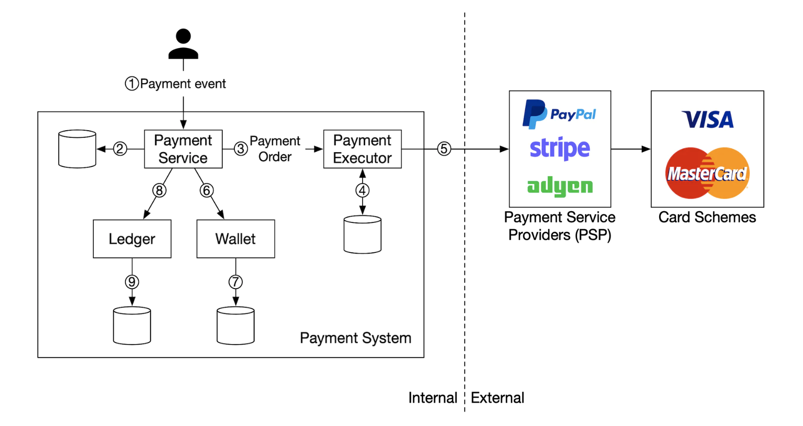
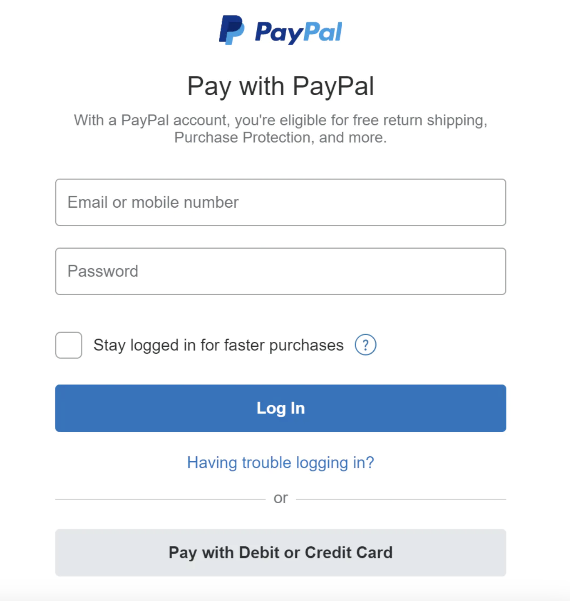
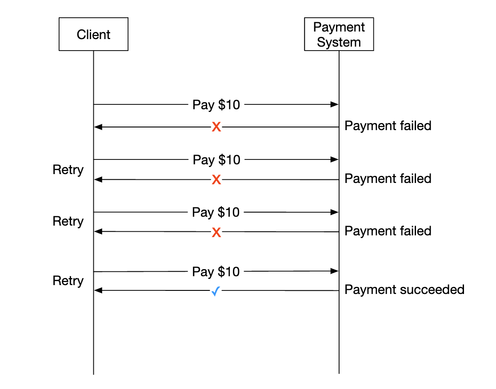
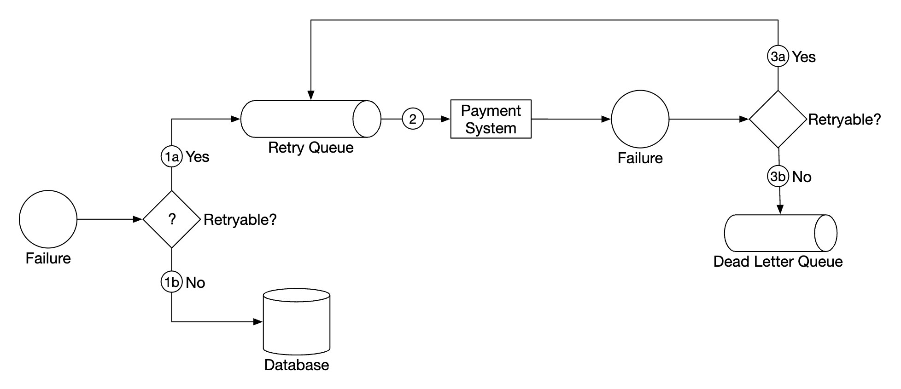

# 第 26 章：支付系统

> 原章节：Payment System · 原项目路径 `26. Payment System/`

## 本章导读

支付系统是全书工程严谨性要求最高的一章。原因很简单：**别的地方出 bug 是用户看到错误页面，支付出 bug 是用户的真金白银没了。**

这一章会设计一个电商的支付后端。但真正的难点不是"怎么调第三方支付接口"，而是四个容易被忽略的问题：

- 钱记在账上，凭什么保证账不会错？——**复式记账**
- 网络会丢包、会超时，那"只扣一次钱"到底能不能做到？——**"恰好一次"是个需要纠偏的说法**
- 第三方支付商和你的数据一定会有差异，怎么办？——**对账**
- 用户看到"支付失败"，但其实钱已经扣了，怎么办？——**支付状态机与延迟处理**

学完这一章，你应该能回答：为什么支付系统宁可用又慢又"老土"的关系型数据库，也不用时髦的 NoSQL？

## 你将学到

- 支付系统的参与者、资金流向，以及支付入账 / 出账两条链路
- 为什么**必须**用复式记账（Double-Entry Ledger），而不是简单地改余额字段
- 为什么跨网络的"恰好一次投递"在理论上不可能实现，工程上的正确做法是什么
- 幂等键（Idempotency Key）的完整设计：谁生成、存什么、过期时间怎么定
- 支付状态机为什么必须单向流转，以及"未知状态"为什么是最重要的一个状态
- 重试策略（指数退避 + 抖动）与**绝对不能重试**的场景
- 对账的分类与处理，以及为什么它无法被工程手段取代
- PCI DSS 合规，以及为什么"不自己存卡号"是一个商业决策

---

## 1. 需求澄清

原文的访谈记录，逐条看它的价值：

| 问题 | 回答 | 为什么重要 |
|---|---|---|
| 建什么支付系统？ | 电商的支付后端，类似 Amazon，处理一切和钱流动相关的事 | 确定了范围是"资金流转"，不只是"调个接口" |
| 支持哪些支付方式？ | 现实中要支持信用卡、PayPal、银行转账等；面试里只做信用卡 | 限定复杂度 |
| 自己处理信用卡吗？ | 不，用第三方支付服务商，如 Stripe、Braintree、Square | **决定了整个架构的安全边界** |
| 自己存信用卡数据吗？ | 出于合规原因不直接存，依赖第三方处理器 | 同上，这是 PCI DSS 的要求 |
| 是全球应用吗？ | 是全球的，但面试里假设只用一种货币 | 多币种是独立的复杂话题 |
| 每天多少笔交易？ | 100 万笔 | 规模量级 |
| 要支持出款吗？ | 要，需要给收款方打款 | 引入 pay-out 链路 |
| 还有其他要注意的吗？ | 需要支持**对账（Reconciliation）**，用来修复内外部系统之间的不一致 | **这是本章最关键的一句话** |

**功能需求**：

- **支付入账流程（Pay-in Flow）**：支付系统代表商户从客户那里收钱。
- **支付出账流程（Pay-out Flow）**：支付系统把钱打给全球各地的卖家。

**非功能需求**：

- **可靠性与容错**，失败的支付必须被谨慎处理；
- **必须在内部系统与外部系统之间建立对账机制**。

> **注意最后这条**
> "需要支持对账"这句话看起来像是补充说明，其实是整章的设计前提。它隐含承认了一件事：**系统必然会出现不一致**。支付系统的设计目标不是"消灭不一致"，而是"**发现不一致并修正它**"。这个心态的转变，是初学者和资深工程师最大的差别。

---

## 2. 量级估算：为什么吞吐不是重点

```
每天 100 万笔交易
100,000,000 ÷ 100,000 秒（一天近似） = 10 笔/秒
```

原文的结论是：这对任何数据库都不算高吞吐，所以不是面试重点。**这个判断是对的**，补充两点：

**峰值比平均值更重要。** 如果 40% 的交易集中在 6 小时内，峰值是：

```
1,000,000 × 0.4 ÷ (6 × 3600) ≈ 18.5 笔/秒
再乘 5 倍突发系数 ≈ 90 笔/秒
```

依然很低。单台数据库配上同步提交（fsync）完全够用。

**真正的压力来自数据增长和审计要求**，原文没算：

| 项目 | 计算 | 结果 |
|---|---|---|
| 支付事件表 | 100 万行/天 × 365 | 约 3.65 亿行/年 |
| 复式记账分录 | 每笔交易至少 2 条分录 × 100 万/天 × 365 | 约 **7.3 亿条/年** |
| 存储量（按每行约 150 字节估） | 7.3 亿 × 150 字节 | 约 **110 GB/年** |

而且**账本是不能删的**——会计和监管通常要求保留多年（常见是 7 年）。所以账本会**单调增长**，必须一开始就规划**按月分区**和冷热分离。

> **本章的核心难点是这三件事**
> 1. **正确性**：钱不能算错，一分都不能。
> 2. **一致性**：跨多个服务、跨外部系统的状态必须收敛到一致。
> 3. **可审计性**：任何一笔余额都要能解释清楚它是怎么来的。

---

## 3. 参与者与资金流向

<div align="center">
  
</div>

### 支付入账流程（Pay-in）

<div align="center">
  
</div>

| 组件 | 职责 |
|---|---|
| **支付服务（Payment Service）** | 接收支付事件、协调整个支付流程；通常还会调用第三方做风险检查，识别反洗钱（AML）违规或犯罪活动 |
| **支付执行器（Payment Executor）** | 通过支付服务商执行**单笔**支付订单。一个支付事件可能包含多笔支付订单 |
| **支付服务商（Payment Service Provider，PSP）** | 把钱从一个账户转到另一个账户，例如从买家的信用卡账户转到电商的银行账户 |
| **卡组织（Card Schemes）** | 处理信用卡操作的组织，如 Visa、Mastercard |
| **账本（Ledger）** | 记录所有支付交易的财务流水 |
| **钱包（Wallet）** | 记录所有商户的账户余额 |

一次典型的入账流程：

1. 用户点击"下单"，一个支付事件被发到支付服务；
2. 支付服务把事件存进数据库；
3. 支付服务针对事件中的每一笔支付订单调用支付执行器；
4. 支付执行器把支付订单存进数据库；
5. 支付执行器调用外部 PSP 处理信用卡支付；
6. 支付执行器处理完后，支付服务更新钱包，记录卖家收到了多少钱；
7. 钱包服务把更新后的余额存进数据库；
8. 支付服务调用账本，记录所有资金流动。

> **这里有一个顺序问题，后面第 6 节会详细讲**
> 原文把"更新钱包"放在"调用账本"**之前**。但在复式记账体系里，**账本才是账簿（Book of Record），钱包只是账本的物化视图**。正确的顺序应该是**先记账本，再投影到钱包**。否则账本写入失败时，钱已经记到商户余额上了，账就对不平了。

### 支付出账流程（Pay-out）

出账流程的组件和入账非常相似，主要区别：

- 钱从电商的银行账户流向商户的银行账户；
- 可以使用第三方的应付账款服务商，例如 Tipalti；
- 出账涉及大量记账和监管要求。

> **出账流程原笔记写得很薄，补充几个真实存在的复杂点**
> - **KYC / AML**：出款前必须完成卖家身份验证（Know Your Customer）和反洗钱筛查，否则平台自己承担法律责任。
> - **制裁名单筛查**：对收款方做 OFAC 等制裁名单比对。
> - **税务**：美国的 1099-K 申报、欧洲的 VAT / GST，都需要按卖家维度归集数据。
> - **可用余额 vs 待结算余额**：这是最容易被忽略的一点。PSP 打款给平台通常是 T+1 到 T+3，**钱还没到平台账上时，不能算作卖家的"可提现余额"**。钱包必须区分 `available_balance` 和 `pending_balance`，否则会出现"卖家提现了，但平台还没收到钱"的现金流缺口。
> - **出款失败与退回**：银行转账可能几天后被退回（账户已注销、信息错误）。系统必须能处理"出款成功后又失败"这种逆向状态。

---

## 4. 接口设计

### 创建支付

```
POST /v1/payments
{
  "buyer_info": {...},
  "checkout_id": "some_id",
  "credit_card_info": {...},
  "payment_orders": [{...}, {...}, {...}]
}
```

单笔支付订单的结构：

```json
{
  "seller_account": "SELLER_IBAN",
  "amount": "3.15",
  "currency": "USD",
  "payment_order_id": "globally_unique_payment_id"
}
```

原文在这里给了两条很关键的注意事项，**两条都是对的**：

1. **`payment_order_id` 会转发给 PSP 用于去重，也就是说它就是幂等键（Idempotency Key）。**
2. **`amount` 用 `string` 而不是数字，因为 `double` 不适合表示金额。**

第 2 条值得展开，因为它是初学者最容易犯的错。

### 金额为什么不能用浮点数

IEEE-754 双精度浮点数**无法精确表示大多数十进制小数**。经典例子：

```
0.1 + 0.2 = 0.30000000000000004
```

在支付系统里，这类误差会累积，最终导致"账对不平"。

**正确做法**：

- **传输层用字符串**：JSON 里的数字会被解析成浮点，所以金额必须以字符串形式传（这正是原文的做法）。
- **存储层用整数最小货币单位（Minor Units）**：3.15 美元存成 `315`（分）。所有运算都是整数运算，不存在精度问题。
- **或者用定点小数类型**：数据库的 `DECIMAL(18,4)` / `NUMERIC` 类型，但要注意不同数据库的实现差异，跨语言序列化时容易出问题。

> **一个必须注意的细节：不同货币的最小单位不一样**
> 按 ISO 4217 标准，USD、EUR 有 2 位小数（1 美元 = 100 分），**JPY 有 0 位小数**（1 日元就是最小单位），KWD 有 3 位小数。
> 所以"金额存成整数分"这个说法本身不严谨——准确说法是"存成**最小货币单位**的整数"，而且必须和 `currency` 字段一起解释。1 亿日元存成 `100000000`，而不是 `10000000000`。搞错这个，金额会差 100 倍。

### 查询支付状态

```
GET /v1/payments/{:id}
```

按 `payment_order_id` 返回单笔支付的执行状态。

> **这个接口比它看起来更重要**
> 它是解决"**未知状态**"的唯一手段。当支付请求超时、结果不明时，客户端或后台任务就是靠这个接口去确认"到底扣没扣钱"。第 13 节会详细讲。

---

## 5. 数据模型

需要两张表：`payment_events` 和 `payment_orders`。

原文有一条很重要的判断：**对支付来说，性能通常不是重要因素，强一致性才是。**

选择数据库时的考量：

- 有足够多可招聘的 DBA 来管理它；
- 有被其他大型金融机构使用的、经过验证的记录；
- 配套工具链丰富；
- **选传统 SQL 而不是 NoSQL / NewSQL，因为它提供 ACID 保证。**

**这几条都是对的，尤其是最后一条。** 支付系统宁可要一个"每秒几千 TPS 但能保证事务"的数据库，也不要一个"每秒百万 TPS 但只能最终一致"的数据库。

### `payment_events` 表

| 字段 | 类型 | 说明 |
|---|---|---|
| `checkout_id` | string | 主键 |
| `buyer_info` | string | 买家信息（原文旁注：更合适的是指向另一张表的外键） |
| `seller_info` | string | 卖家信息（同上） |
| `credit_card_info` | 取决于卡组织 | **这一列有问题，见下** |
| `is_payment_done` | boolean | 支付是否完成 |

> **`credit_card_info` 这一列与需求自相矛盾**
> 访谈里明确说了"出于合规原因，我们不在系统里直接存信用卡数据"，第 7 节还要讲用托管支付页来避免接触卡数据。**但这里的数据模型却有一列叫 `credit_card_info`。**
>
> **正确设计**：这一列应该只存**PSP 返回的支付方式令牌（token）** 和**用于展示的元数据**（卡组织品牌、后 4 位、有效期），绝不能存卡号（PAN）或 CVV。
>
> 原文用"取决于卡组织"来含糊带过，没有解决这个矛盾。这是一个实打实的设计漏洞——如果照着这个模型实现，你的系统就直接进入了 PCI DSS 的最高审计范围。

### `payment_orders` 表

| 字段 | 类型 | 说明 |
|---|---|---|
| `payment_order_id` | string | 主键，全局唯一 |
| `buyer_account` | string | 买家账户 |
| `amount` | string | 金额 |
| `currency` | string | 币种 |
| `checkout_id` | string | 外键，指向 `payment_events` |
| `payment_order_status` | enum | `NOT_STARTED`、`EXECUTING`、`SUCCESS`、`FAILED` |
| `ledger_updated` | boolean | 账本是否已更新 |
| `wallet_updated` | boolean | 钱包是否已更新 |

原文的几点说明：

- 一个支付事件关联多个支付订单；
- 入账流程不需要 `seller_info`，那是出账才需要的；
- `ledger_updated` 和 `wallet_updated` 在调用相应服务记录结果时更新；
- 支付状态由后台任务管理，它会检查在途支付的更新情况，如果支付在合理时间内没处理完就触发告警。

> **`ledger_updated` / `wallet_updated` 这个设计值得说清楚**
> 这是典型的 **Saga（补偿事务）** 里的"**每步状态标记**"模式：把一次跨服务的长流程拆成若干步，每一步完成后打个标记，后台任务扫描"打了标记但流程没走完"的记录继续推进。
>
> **但这两个布尔值有两个弱点：**
> 1. **标记和副作用不在同一个事务里。** 标记写在支付服务的库里，副作用发生在账本/钱包服务的库里。所以会出现"标记写了但副作用其实没提交"（RPC 成功了但响应丢了）的情况。**解决办法是让下游操作本身幂等**（用 `payment_order_id` 做幂等键），这样重放是安全的。
> 2. **布尔值表达不了"未知"。** 和后面要讲的支付状态一样，两个布尔值只能表达"做了/没做"，表达不了"尝试了但结果不明"。这会导致重复执行。
>
> 更严谨的做法是配合**事务性发件箱（Transactional Outbox）**：把"要发的消息"和业务数据写在同一个本地事务里，再由独立的投递进程发出去，保证至少一次投递 + 消费端幂等。

---

## 6. 复式记账：支付系统的心脏

原文对复式记账只有一小段，但这是整个支付系统最重要的机制。我们讲透它。

### 什么是复式记账

**复式记账（Double-Entry Accounting）** 的核心规则只有一条：**每一笔交易都同时记在两个账户上，一边增加（贷记 Credit），一边减少（借记 Debit），金额相等。**

| 账户 | 借记（Debit） | 贷记（Credit） |
|---|---|---|
| 买家 | $1 | |
| 卖家 | | $1 |

所有分录的**总和恒为零**。这个机制提供了系统内所有资金流动的端到端可追溯性。

### 为什么不能简单地改余额字段

初学者最自然的想法是：

```sql
UPDATE wallets SET balance = balance + 10 WHERE seller_id = 'X';
```

这一行代码能跑，但它带来了七个致命问题：

| 问题 | 说明 |
|---|---|
| **没有审计轨迹** | 你只知道余额是多少，不知道它是**怎么变成**这个数的。余额错了，你无从查起 |
| **没有正确性不变量** | 系统里没有任何"可校验的恒等式"，你无法证明账是对的 |
| **错误无法被发现** | 一个 bug 让某笔钱被加了两次，余额看起来仍然"正常"，没人会发现 |
| **无法归因** | 用户投诉"我少了 100 块"时，你答不出是哪几笔交易造成的 |
| **无法对账** | PSP 结算文件里的一行金额，你无法对应到系统里的某次余额变动 |
| **并发问题** | `balance = balance + 10` 是读-改-写，并发下必须加锁，容易出错 |
| **历史被覆盖** | 想"修正"错误只能直接改余额，历史痕迹消失，无法追责 |

### 复式记账带来的四个能力

1. **一个可随时校验的不变量**：每个记账凭证（Journal Entry）内，借记合计 = 贷记合计；全系统所有分录求和恒为 0。
2. **可审计性**：任何余额都可以通过重放分录**完整解释**。就像银行流水和余额的关系——**从流水一定能推出余额，但从余额推不出流水**。
3. **防篡改**：改动任何一条分录都会破坏平衡，立刻暴露。
4. **错误定位**：账不平的时候，不平衡的**方向和金额**本身就在告诉你问题出在哪。

> **一个类比，帮初学者建立直觉**
> 单式记账（改余额字段）就像**只看体重秤上的数字**：你知道自己多重，但不知道是吃饭长的还是穿衣服重的。
> 复式记账就像**记饮食和运动流水**：每一笔摄入和消耗都记下来，体重是这些流水的**计算结果**。数字对不上时，你能翻流水找出是哪一笔记错了。

### 工程上的实现

**核心原则：分录只追加、不可修改。** 要修正错误，就记一笔**红冲分录（Reversing Entry）**，而不是去改历史。

```sql
CREATE TABLE ledger_entries (
  entry_id     BIGINT      NOT NULL AUTO_INCREMENT PRIMARY KEY,
  journal_id   CHAR(36)    NOT NULL,          -- 同一个凭证的多条分录共享此 ID
  account_id   VARCHAR(64) NOT NULL,          -- 账本账户
  direction    ENUM('DEBIT','CREDIT') NOT NULL,
  amount_minor BIGINT      NOT NULL,          -- 最小货币单位的整数
  currency     CHAR(3)     NOT NULL,
  created_at   TIMESTAMP   NOT NULL,
  INDEX idx_journal (journal_id),
  INDEX idx_account_time (account_id, created_at)
);
```

**借贷平衡是一个可以随时跑的校验查询：**

```sql
-- 每个凭证的借贷必须相抵，结果应为空
SELECT journal_id,
       SUM(CASE WHEN direction = 'DEBIT' THEN amount_minor
                ELSE -amount_minor END) AS imbalance
FROM ledger_entries
GROUP BY journal_id
HAVING imbalance <> 0;
```

这个查询应该被做成**定时任务 + 告警**。它一旦返回非空结果，就是最高优先级的故障。

### 账本里都有哪些账户

初学者容易以为账本只记"买家"和"卖家"。实际上**每一个资金停留过的地方都需要一个账本账户**：

- 买家（应收）
- 卖家（应付）
- **平台收入 / 手续费**
- **PSP 清算账户（PSP Clearing / Suspense Account）** ← 这个最容易被忽略
- 退款、拒付（Chargeback）准备金

**PSP 清算账户的作用**：买家的卡被扣款后，钱并不会立刻到平台银行账户，中间有几天的在途时间。这段时间里，这笔钱记在**PSP 清算账户**上——它代表"平台对 PSP 的应收款"。

```
买家卡被扣款：  借：PSP 清算账户 $10   贷：买家应收 $10
结算到账：      借：平台银行账户  $10   贷：PSP 清算账户 $10
```

没有这个中间账户，"钱在途"这个状态就无处安放，账一定对不平。**这是复式记账在实践中比教科书复杂的地方。**

### 账本与钱包的顺序

回到第 3 节提到的顺序问题：

**账本是账簿（Book of Record），钱包是账本的物化视图（Materialized View）。**

正确的顺序是：

1. PSP 扣款成功；
2. **先写账本**：原子地插入一组平衡的分录；
3. **再把结果投影到钱包**：更新商户余额，用 `journal_id` 做幂等键；
4. 标记支付订单已结算。

这样安排的好处是：**第 3 步失败时，可以从账本重建钱包余额**。反之，如果先改钱包再记账本，账本写入失败就会出现"商户余额多了 10 块，但账本里找不到对应分录"——这时的账**对不平，而且无法自动修复**。

> **一个可用的心智模型**
> 账本是**只追加的事实**，钱包是**可重算的缓存**。凡是"事实"和"缓存"的关系，都应该先写事实、再更新缓存——这个原则在第 1 章的缓存章节里也出现过。

---

## 7. 托管支付页与 PCI DSS

为了不存储信用卡信息、不必遵守各种繁重的合规要求，绝大多数公司会选择使用 PSP 提供的**托管支付页（Hosted Payment Page）** 组件，由 PSP 代你存储和处理信用卡支付。

<div align="center">
  
</div>

### PCI DSS 是什么

**PCI DSS（Payment Card Industry Data Security Standard，支付卡行业数据安全标准）** 是由 PCI 安全标准委员会（成员包括 Visa、Mastercard、American Express、Discover、JCB）制定和维护的一套安全标准，适用于任何处理品牌信用卡的机构。

### 为什么不自己存卡号

**这不是一个技术决策，而是一个商业决策。** 合规成本差了一个数量级：

| 你的系统接触卡数据的程度 | 适用的自评问卷 | 大致工作量 |
|---|---|---|
| 完全不接触，用 PSP 托管页 / iframe | **SAQ A** | 相对轻量，主要是确认外包给了合规的 PSP |
| 卡数据经过你的服务器（哪怕不落库） | **SAQ D** | 数百项控制要求：网络分段、季度 ASV 扫描、年度渗透测试、文件完整性监控、加密密钥管理、日志留存等 |

**SAQ A 和 SAQ D 的合规成本差距可能达到十倍量级。** 这才是"不自己存卡号"真正的驱动力——省下的不只是风险，更是持续投入的合规人力与审计费用。

### 具体要遵守的几条硬规则

- **绝不存储 CVV / CVC。** PCI DSS 明确规定，授权完成后不得存储敏感认证数据（CVV、完整磁道数据、PIN）。这是硬性要求，没有例外。
- **卡号（PAN）必须脱敏展示**：通常只保留前 6 位 + 后 4 位（BIN + 尾号）。
- **绝不记录到日志**：请求日志、错误堆栈、APM 追踪里都不能出现完整卡号。这是最常见的泄露途径。
- **用令牌（Token）代替卡号**：PSP 返回一个 token，你存 token，后续的重复扣款、退款都用 token。
- **3D Secure（3DS2）**：让持卡人在发卡行页面上做额外验证，通常伴随**责任转移（Liability Shift）**——验证通过的交易发生欺诈拒付时，损失由发卡行承担而非商户。

> **一个常见误解**
> "我用了托管支付页，所以完全不在 PCI 范围内。"——**不对。** 托管页只是把卡数据的处理外包出去了，你的系统仍然在范围内（只是范围小得多）。而且只要你通过 API 接收过一次卡数据，或者你的页面直接 POST 卡数据到自己的服务器，你就进入了 SAQ D 的范围。**边界在于"卡数据有没有经过你的系统"，不在于"有没有落库"。**

---

## 8. PSP 集成

如果系统能直接连接银行或卡组织，就可以不用 PSP。但这种连接**非常罕见**，通常只有能证明这笔投资值得的大公司才会做（需要大量资金、合规和风控能力）。

走传统路线的话，PSP 有两种集成方式：

- **通过 API**：如果你的支付系统能自己收集支付信息；
- **通过托管支付页**：避免处理支付信息相关的监管要求。

### 托管支付页的完整流程

<div align="center">
  
</div>

1. 用户在浏览器点击"结账"按钮；
2. 客户端带着支付订单信息调用支付服务；
3. 支付服务收到后，向 PSP 发送一个**支付注册请求**；
4. PSP 收到币种、金额、有效期等信息，以及一个**用于幂等的 UUID**（通常就是支付订单的 UUID）；
5. PSP 返回一个 token，唯一标识这次支付注册。token 被存进支付服务数据库；
6. token 存好后，给用户展示 PSP 托管的支付页，用 token 和一个成功/失败的重定向 URL（Redirect URL）初始化；
7. 用户在 PSP 页面上填写支付信息，PSP 处理支付并返回支付状态；
8. 用户被重定向回 `redirectURL`，例如 `https://your-company.com/?tokenID=JIOUIQ123NSF&payResult=X324FSa`；
9. **异步地**，PSP 通过 **Webhook** 回调我们的支付服务，告知支付结果；
10. 支付服务根据收到的 webhook 记录支付结果。

> **这个流程里有三个必须注意的工程细节**
> 1. **第 8 步的重定向不可信。** 用户可能在重定向发生前就关掉了浏览器，也可能手动篡改 URL 里的 `payResult`。**客户端回传的结果只能用来做界面提示，绝不能作为账务依据。** 真正的依据是第 9 步的 webhook。
> 2. **第 9 步的 webhook 必须验签。** PSP 会用签名（如 HMAC）标识请求来源，必须验证签名，否则任何人都能伪造"支付成功"的通知。同时要校验时间戳防重放。
> 3. **webhook 可能重复、可能乱序、可能比第 8 步先到。** 这是 at-least-once 投递的必然结果。所以处理 webhook 必须**幂等**，并且状态机必须能容忍乱序（见第 10 节）。webhook 处理要**快速返回 200**，把耗时逻辑丢到异步队列，否则 PSP 会认为你没收到而重试。

---

## 9. 对账（Reconciliation）

上一节讲的是"顺利路径"。不顺利的情况，靠后台的**对账流程**来发现和修复。

**每天晚上，PSP 会发送一个结算文件（Settlement File）**，我们的系统用它来比对外部系统的状态和内部系统的状态。

<div align="center">
  
</div>

这个过程也可以用来发现内部系统之间的不一致，例如账本和钱包服务之间的差异。

**差异由财务团队人工处理**，分为三类：

- **可分类的**：已知的差异类型，可以用标准流程自动调整；
- **可分类但无法自动化**：由财务团队手动调整；
- **无法分类的**：由财务团队手动调查和调整。

### 为什么对账无法被工程手段取代

初学者常有的想法是："只要我的幂等做得好、重试做得好，就不会有不一致。"

**这个想法是错的。** 对账之所以必须做，是因为：

- 你的系统和 PSP 是**两个独立失败域**。PSP 可能在处理成功但写日志时崩溃，而你的请求正好超时；
- **至少一次投递**意味着必然存在重复和缺口；
- 网络分区期间，双方各自认为"对方没收到"；
- **PSP 会单方面变更交易状态**——拒付（Chargeback）、退款、汇率调整、手续费扣除，都是你事先不知道的。

**对账是最后一道防线。** 它不优雅，但它是唯一能保证"最终账目正确"的机制。

### 对账怎么做

**时机**：T+1（次日）拉取对账文件是最常见的做法。有些 PSP 还提供近实时的 webhook + 日终文件，**日终文件是结算层面的权威数据**（包含手续费、拒付、币种换算）。

**方法**：以 PSP 的交易 ID 或我们的 `payment_order_id` 为键，**逐笔比对**三个数据源：

1. 我们的 `payment_orders` 表（我们认为发生了什么）
2. 我们的账本（我们记了什么账）
3. PSP 的结算文件（对方认为发生了什么）

### 差异分类与处理

| 差异类型 | 含义 | 风险 | 处理 |
|---|---|---|---|
| **长款**（PSP 有，我们没有） | PSP 记录了一笔成功扣款，但我们认为它失败了 | 我们少记了收入，但**用户已经被扣钱**——用户投诉的第一来源 | 把订单改成成功，补记账本和钱包，必要时通知用户 |
| **短款**（我们有，PSP 没有） | 我们标记了成功，但 PSP 没有对应记录 | 我们多记了收入，可能已经给商户结算 | 冲正该笔收入，回滚钱包余额，调查 PSP 侧原因 |
| **金额不符** | 双方都有这笔交易，但金额不同 | 通常来自币种换算、部分捕获、手续费扣除 | 按结算文件的实际金额调整，差异计入手续费或汇兑损益 |
| **状态不符** | 例如我们认为 FAILED，PSP 认为 SUCCESS | 与长款类似，但更隐蔽 | 以 PSP 为准修正状态，走状态机的合法路径 |
| **重复** | 同一笔交易出现两次 | **重复扣款**，用户直接损失 | 立即发起退款，并排查幂等键失效原因 |
| **时间差** | 交易正好在结算截止时刻在途 | **不是真的差异** | 必须排除，否则每晚都会产生大量误报 |

> **最后一条（时间差）是最容易踩的坑**
> 如果你把所有"我有 PSP 没有"的记录都当成短款，那么每天结算截止时刻附近在途的交易都会被抓出来。假设每秒 10 笔、结算窗口 5 分钟，每晚就会产生 **3000 条假差异**，把财务团队淹没。
>
> 正确做法是：比对时**排除一个时间窗口内仍在处理中（PENDING / EXECUTING / UNKNOWN）的交易**，或者把它们单独归为"待观察"，次日再比对一次。**对账系统的第一要务不是找出差异，而是不产生噪音。**

### 内部对账同样重要

除了和 PSP 对账，还要做**内部一致性校验**：

- **账本内部**：每个凭证借贷是否平衡（第 6 节的那个 SQL）；
- **账本 vs 钱包**：钱包余额是否等于账本上该商户账户的净额；
- **账本 vs 支付订单**：每笔 SUCCESS 的支付订单是否都有对应的账本分录。

这三条应该做成**定时任务**，异常时告警。**账本是事实，其他都是投影**——所以任何不一致都应该以账本为准来修复。

---

## 10. 支付状态机

支付状态必须有明确的状态机，这不是"锦上添花"，而是**防止资金错乱的唯一手段**。

原文给出的状态枚举是：`NOT_STARTED`、`EXECUTING`、`SUCCESS`、`FAILED`。

**这个枚举有两个问题**：一是**缺少"未知"状态**，二是**没有定义合法转移**。我们补全。

### 完整的状态机

```
CREATED ──→ AUTHORIZING ──→ AUTHORIZED ──→ CAPTURING ──→ CAPTURED ──→ SETTLED
                 │               │              │
                 ↓               ↓              ↓
              DECLINED        VOIDED        UNKNOWN ──（查询后）──→ CAPTURED / DECLINED
             (终态)           (终态)
                                                     │
                              CAPTURED ──→ REFUNDING ──→ REFUNDED (终态)
                              CAPTURED ──→ DISPUTED ──→ CHARGEBACK (终态)
```

### 三条铁律

**铁律一：终态不可变更。** `DECLINED`、`REFUNDED`、`CHARGEBACK` 这些终态一旦进入，任何后续事件都不能改变它。

**铁律二：状态只能单向流转。** `SETTLED` 不能退回 `CAPTURED`。一个"支付被拒"的 webhook 如果延迟到达一笔已经 `CAPTURED` 的支付上，**必须被拒绝并告警**，而不是被应用。这类"迟到事件回退状态"是生产环境最常见的资金错乱来源之一。

**铁律三：状态转移必须原子校验。** 不要先读状态再写状态（读-改-写之间会有竞态）。用**带条件的更新**（乐观并发控制）：

```sql
UPDATE payment_orders
SET status = 'CAPTURED', updated_at = NOW()
WHERE payment_order_id = 'po_123'
  AND status IN ('CAPTURING', 'UNKNOWN');
-- 如果影响行数为 0，说明转移非法或已被处理过 → 记录并告警，不要重试
```

这一行 SQL 同时实现了**状态机校验**和**幂等**：重复的"支付成功"事件第二次执行时影响 0 行，自然被忽略。

### 为什么"未知"状态最重要

这是本章最关键的一个设计点。

原文的 `FAILED` 把两种完全不同的情况混在了一起：

| 情况 | 含义 | 正确动作 |
|---|---|---|
| **明确失败** | PSP 明确返回"卡被拒" | 终态，通知用户换卡，**不要重试** |
| **结果未知** | 请求超时、网络中断、PSP 5xx | **绝不能当成失败**，必须去**查询**真实结果 |

如果把"未知"当成 `FAILED`，就会出现这个经典事故：

> 用户点击支付 → PSP 实际上扣款成功了 → 但响应在返回途中丢了 → 我们的系统标记为 FAILED → 提示用户"支付失败，请重试" → **用户重试，被扣了两次钱。**

所以状态机里**必须**有 `UNKNOWN`（或叫 `PENDING_CONFIRMATION`），并且有一条明确的规则：

> **只要结果未知，就必须去查询，绝不能重试扣款。** 这一条比任何幂等机制都重要，因为它是幂等机制能生效的前提。

### 状态转移必须留痕

每一次状态转移都要写进一张**只追加的审计表**，记录：

- 转移前后的状态
- 触发来源（webhook / API / 后台补偿任务）
- **原始事件载荷**（PSP 的完整响应，用于事后追溯）
- 时间戳

出问题时，这张表是唯一能还原真相的东西。

---

## 11. 幂等键（Idempotency Key）的设计

原文提到了幂等，但只有一小段。我们补全整个设计。

### 谁生成、什么时候生成

**由客户端生成**，而不是服务端。原因很直接：**如果服务端生成，客户端就无法安全地重试**——它每次重试都会拿到一个新的键，服务端会认为是两笔不同的支付。

具体到支付场景：

- 生成时机是"**一次支付意图**"，也就是用户点击支付按钮时；
- 这个键要**持久化**（存在订单记录里，或浏览器的 `localStorage`），这样页面刷新、网络重试、用户手动再点一次，都复用同一个键；
- **不要每次 HTTP 请求都新生成一个。**

### 存什么

```sql
CREATE TABLE idempotency_keys (
  key             VARCHAR(64)  NOT NULL,
  client_id       VARCHAR(64)  NOT NULL,
  request_hash    CHAR(64)     NOT NULL,   -- 请求体的 SHA-256
  status          ENUM('IN_PROGRESS','COMPLETED') NOT NULL,
  response_code   INT          NULL,
  response_body   TEXT         NULL,       -- 必须存完整响应
  locked_until    TIMESTAMP    NULL,       -- 防止崩溃后永久锁死
  created_at      TIMESTAMP    NOT NULL,
  expires_at      TIMESTAMP    NOT NULL,
  PRIMARY KEY (client_id, key)             -- 注意是复合主键
);
```

三个容易被忽略的点：

1. **唯一约束要带 `client_id`。** 只按 `key` 做唯一约束的话，两个客户端的键撞车会导致其中一个拿到别人的结果。
2. **必须存完整的响应，而不只是"资源已存在"。** 重放时要返回**一模一样的响应**（同样的状态码、同样的 body），否则客户端的重试逻辑会困惑。
3. **必须存 `request_hash`。** 同一个键配不同的请求体是一个 bug 或攻击信号，应该返回 422 而不是默默执行。

### 执行流程

<div align="center">
  
</div>

```
1. 尝试 INSERT (key, client_id, request_hash, status='IN_PROGRESS')
   ├─ 插入成功 → 继续执行真正的业务逻辑
   └─ 唯一键冲突 → 读取已存在的记录
        ├─ request_hash 不一致 → 返回 422
        ├─ status = COMPLETED → 原样返回存储的响应
        └─ status = IN_PROGRESS
             ├─ locked_until 未过期 → 返回 409（有另一个请求正在处理）
             └─ locked_until 已过期 → 认为前一个请求已崩溃，可以接管重试
2. 业务逻辑完成后，在同一个事务里把记录更新为 COMPLETED 并写入响应
```

> **关键顺序：`IN_PROGRESS` 记录必须在调用 PSP 之前提交。**
> 如果先调 PSP 再写记录，而进程在中间崩溃了，那么扣款成功了但没有任何记录。用户重试时系统认为是全新请求 → **重复扣款**。
> 反过来，先提交 `IN_PROGRESS` 记录，即使之后崩溃，后台任务也能看到这条记录并去查询 PSP 的真实结果。

### 过期时间怎么定

幂等记录的过期时间不是一个随意的数字，它受**两个上界**约束：

| 约束 | 说明 |
|---|---|
| **客户端的最大重试窗口** | 键必须活得比客户端所有可能的重试都久。包括自动重试、用户手动重试、以及**离线重试**（用户第二天打开 App 又点了一次） |
| **PSP 的幂等窗口** | 你转发给 PSP 的幂等键，PSP 也有自己的保留期限 |

**这两个上界取小值：**

> 如果你的键保留 48 小时，但 PSP 只保留 24 小时，那么第 30 小时的一次重试会在 PSP 那边被当成**全新交易**，直接重复扣款。

**业界常见做法是 24 小时。** 例如 Stripe 的文档说明幂等键会在**至少 24 小时后**从系统中移除，此后复用同一个键会被当作新请求。24 小时的合理性在于：它覆盖了绝大多数用户的重试行为（同一业务日内），同时把存储量控制在可接受范围（每天 100 万笔 × 24 小时 = 2400 万条记录，是可控的）。

**过期的代价必须明确**：键过期后，同一个键再次出现就是一个**全新的请求**，幂等保证失效。所以过期时间的选择本质上是在"存储成本"和"重复扣款风险"之间取平衡。**在支付场景里，宁可长一点。**

### 幂等是分层的

支付链路上有多个跳跃点，**每一跳都需要自己的幂等机制**：

| 跳跃点 | 幂等手段 |
|---|---|
| 客户端 → 支付服务 | 客户端生成的 `idempotency-key` |
| 支付服务 → 支付执行器 | `payment_order_id` 作为幂等键 |
| 支付执行器 → PSP | **PSP 的 nonce**（通常就是 `payment_order_id`） |
| 支付服务 → 账本 / 钱包 | `journal_id` / `payment_order_id` 作为幂等键 |
| PSP → 支付服务（webhook） | PSP 的事件 ID 去重 |

**原文提到 PSP 侧也用 nonce 保证幂等**："PSP 会注意不重复处理同一个 nonce 的支付。"这一点是对的，而且是**最后一道防线**——即使你的系统全部出错，PSP 的 nonce 也能挡住重复扣款。**所以 `payment_order_id` 必须在第一次调用 PSP 之前生成并持久化，并且在所有重试中保持不变。**

---

## 12. 重试策略：能重试什么，绝不能重试什么

原文说得很清楚：要实现**至少一次（At-least-once）** 的保证，就要用重试机制。

<div align="center">
  
</div>

### 常见的重试间隔策略

| 策略 | 做法 |
|---|---|
| **立即重试（Immediate Retry）** | 失败后立刻再发一次 |
| **固定间隔（Fixed Intervals）** | 等固定时间后重试 |
| **递增间隔（Incremental Intervals）** | 每次重试间隔递增 |
| **指数退避（Exponential Back-off）** | 每次重试间隔翻倍 |
| **取消（Cancel）** | 客户端取消请求，用于错误是终态或已达重试上限时 |

原文的经验法则是：**默认使用指数退避**，并且服务端应该通过 `Retry-After` 响应头告诉客户端该等多久。**这两条都对。**

### 补充一：必须加抖动（Jitter）

**纯指数退避有一个致命问题：它会让所有客户端在同一时刻重试。**

假设 PSP 宕机 30 秒，期间 10 万个客户端同时失败。如果没有抖动，它们会在第 1、2、4、8、16 秒同时重试——**每次重试都是一次新的流量洪峰**，把刚刚恢复的 PSP 再打垮一次。这叫**惊群效应（Thundering Herd）**。

**解决办法是加入随机抖动。** 最常见的两种（来自 AWS 的经典文章《Exponential Backoff And Jitter》）：

```
Full Jitter（完全抖动）：
  sleep = random(0, min(cap, base × 2^attempt))

Decorrelated Jitter（去相关抖动）：
  sleep = min(cap, random(base, prev_sleep × 3))
```

加上抖动之后，重试请求在时间上被摊平，PSP 能平稳恢复。

### 补充二：必须有上限和断路器

- **最大重试次数**（如 5 次）和**总超时预算**（如 30 秒）。无上限重试等于放弃控制权。
- **断路器（Circuit Breaker）**：当失败率超过阈值时，直接**快速失败**，不再发请求。这既保护了 PSP，也保护了你自己（避免线程池被重试任务占满）。

### 补充三：什么绝对不能重试

这是本节最重要的一张表。

| 场景 | 能否重试 | 原因 |
|---|---|---|
| 网络超时 / 连接被重置 | ⚠️ **不能直接重试扣款** | 这是**模糊态**：可能成功了。必须**先查询**真实结果 |
| 没有幂等键的非幂等操作 | ❌ 绝不 | 重试必然产生重复副作用 |
| PSP 返回 429（限流） | ✅ 可以 | 按 `Retry-After` 退避重试 |
| PSP 返回 5xx | ✅ 可以（带退避 + 抖动） | 通常是临时故障 |
| 卡被拒 / 余额不足 / 卡号无效 | ❌ 绝不 | **终态业务错误**。重试只会浪费配额，还可能触发发卡行的风控规则 |
| 3DS 验证失败 | ❌ 绝不 | 用户未完成验证，重试没有意义 |
| 参数校验错误（400） | ❌ 绝不 | 重试不会让参数变对 |
| PSP 明确标记为不可重试 | ❌ 绝不 | 以 PSP 的语义为准 |

> **最重要的一条规则，请单独记住**
>
> **"已提交但未收到响应"的模糊态，绝对不能重试，只能查询。**
>
> 这是支付系统里最容易造成重复扣款的地方，也是面试的高频追问点。判断依据很简单：**如果失败原因是"我不知道发生了什么"，那就不能重试，只能去问。**
>
> 具体做法是调用 `GET /v1/payments/{id}`（或 PSP 的查询接口），用幂等键去查这笔交易的最终状态：
> - 查到 SUCCESS → 推进状态机到成功；
> - 查到 FAILED → 才是真正的失败；
> - 还查不到 → 保持 `UNKNOWN`，过一段时间再查（退避），**仍然不要重试扣款**。

---

## 13. 支付延迟与"假失败"

原文有一节叫"处理支付处理延迟"，指出了两个原因和两个对策。这一节补充完整。

### 为什么支付会花几小时

原文列出的两个原因：

- 支付被标记为**高风险**，需要人工审核；
- 信用卡需要额外保护，例如 **3D Secure 验证**，需要持卡人提供额外信息才能完成。

补充其他常见原因：

- **发卡行的异步风控**：某些银行会对可疑交易做延迟审批；
- **跨境支付**：涉及中转行、时区、当地清算窗口；
- **替代支付方式**：银行转账、Boleto（巴西）、UPI（印度）等本身就是异步的；
- **PSP 侧的人工复核队列**。

### 原文的两个对策

- **等 PSP 发 webhook**；如果 PSP 不提供 webhook，就**轮询它的 API**；
- 向用户展示"**处理中（Pending）**"状态，给他们一个可以查看支付更新的页面，支付完成后还可以发邮件通知。

**这两条都对。** 补充：轮询要**带指数退避**，不要每秒钟打一次 PSP 的查询接口——那既浪费配额，又可能在限流上被惩罚。

### 同步支付 vs 异步支付

| 维度 | 同步支付 | 异步支付 |
|---|---|---|
| **用户体验** | 一次请求内拿到最终结果，体验流畅 | 需要等待，界面要能表达"处理中" |
| **前端实现** | 简单 | 需要轮询或推送，状态展示更复杂 |
| **系统复杂度** | 低 | 高：需要状态机、webhook、补偿任务 |
| **适用场景** | 低风险、低金额、即时授权 | 高风险、高金额、跨境、替代支付方式 |

**关键认知：现代支付系统必然是异步为主的。** 因为"同步等待外部系统"意味着你的可用性被 PSP 的可用性绑定——PSP 慢，你也慢；PSP 挂，你也挂。**异步化是把外部依赖的不确定性隔离在系统边界之外。**

### "用户看到失败但其实成功了"

这是支付系统最经典的用户体验灾难，也是客服工单的主要来源。完整的处理方案：

**第一层：界面绝不显示"失败"，只显示"处理中"。**

这是最重要的原则。区分两种情况：

- **明确失败**（PSP 返回了拒绝码）→ 可以显示"支付失败，请更换支付方式"；
- **结果未知**（超时、网络错误、未收到 webhook）→ **必须显示"处理中，请稍后查看"**。

很多系统在这里犯错，是因为后端只返回了一个布尔值 `success`。**接口设计上就应该把"未知"表达出来**，而不是硬塞进 `success = false`。

**第二层：前端要做幂等。**

- 点击支付后**立刻禁用按钮**；
- 每次"支付尝试"复用一个客户端生成的幂等键；
- 页面刷新后从 `localStorage` / 订单记录里恢复这个键，而不是生成新的。

**第三层：webhook 是唯一权威。**

- 客户端重定向回跳时 URL 里的结果**只用于界面提示**；
- 真正的账务结果以 webhook 为准；
- webhook 必须验签、去重、幂等、快速返回。

**第四层：补偿任务兜底。**

后台任务定期扫描"状态停留在 `PENDING` / `UNKNOWN` 超过 N 分钟"的支付订单，主动向 PSP 查询最终状态，然后推进状态机。**这是保证"最终一致"的最后一道自动防线。**

**第五层：主动通知。**

支付最终完成或最终失败后，发邮件 / 推送 / 站内信通知用户。原文提到的"支付完成后发邮件"就是这个思路。

> **一个反向的坑：用户看到"成功"但其实失败了**
> 同样要处理。如果 webhook 说失败了，但用户已经看到了成功页面并拿到了商品，你必须有**冲正**流程：撤销权益、通知用户、必要时发起催收。这也是为什么状态机的"单向流转"和"留痕"如此重要——你需要能准确知道"当时给用户展示的是什么"。

---

## 14. 内部服务间通信：同步 vs 异步

服务之间有两种通信模式：同步和异步。

**同步通信（如 HTTP）** 在小规模系统上表现良好，但随着规模增长会出问题：

- **性能差**：调用链上的服务越多，请求-响应周期越长；
- **故障隔离差**：PSP 或任何其他服务失败，用户就收不到响应；
- **耦合紧**：发送方必须知道接收方是谁；
- **难以扩展**：没有缓冲区，很难应对突发流量。

**异步通信**分为两类。原文配了两张图：

**单接收者（Single Receiver）**——多个接收者订阅同一个主题，但消息只被处理一次：

<div align="center">
  
</div>

**多接收者（Multiple Receivers）**——多个接收者订阅同一个主题，消息被转发给所有接收者：

<div align="center">
  
</div>

原文的结论：**后者更适合支付系统**，因为一笔支付可以触发多个副作用，由不同服务分别处理。

**"同步通信更简单，但不允许服务自治；异步通信用简单性和一致性换取可扩展性和韧性。"** 这个总结很准确。

> **补充：术语要精确，这是面试的加分点**
> 原文用"单接收者 / 多接收者"描述，比较口语化。业界标准的说法是：
>
> | 语义 | 标准名称 | 典型实现 |
> |---|---|---|
> | 一条消息只被一个消费者处理 | **点对点（Point-to-Point）/ 竞争消费者（Competing Consumers）** | SQS 队列、RabbitMQ 的队列 |
> | 一条消息被所有订阅者处理 | **发布-订阅（Publish-Subscribe）/ 扇出（Fan-out）** | SNS 主题、RabbitMQ 的 fanout exchange |
>
> **Kafka 的语义需要单独说清楚**：Kafka 里"一个消费者组内，每条消息只被一个消费者处理；不同消费者组之间，每个组都会收到全部消息"。也就是说 **Kafka 用同一个 topic + 多个消费者组，同时实现了两种语义**——组内是队列，组间是发布订阅。这是 Kafka 相比传统消息队列最重要的设计差异。
>
> 另外要记住 Kafka 的两条限制：
> - **顺序保证只在分区（Partition）内**，跨分区无序。所以"同一笔支付的多个事件"要用 `payment_order_id` 作为分区键，才能保证它们被顺序处理。
> - **不支持单条消息的 ack**，只能提交分区级别的 offset。所以消费者必须自己实现幂等。
>
> 还有 **AWS 的 SNS + SQS 扇出模式**：SNS 主题把消息推送到多个 SQS 队列，每个队列由一个独立的消费者组处理，兼顾了广播和独立的消费进度。

---

## 15. 失败支付的处理

每个支付系统都必须处理失败的支付。原文给出了三个机制：

- **追踪支付状态（Tracking Payment State）**：支付失败时，根据支付状态判断应该重试还是退款。
- **重试队列（Retry Queue）**：需要重试的支付被投递到重试队列。
- **死信队列（Dead-Letter Queue，DLQ）**：彻底失败的支付被推送到死信队列，在那里可以调试和检查。

<div align="center">
  
</div>

**这三个机制都对。** 补充几点工程细节：

**关于重试队列：**

- 重试队列必须**按延迟投递**（Kafka 没有原生延迟队列，常见做法是用多个分级 topic，如 `retry-1s`、`retry-10s`、`retry-1min`，配合消费者挂起；或者用支持延迟消息的中间件）。
- 消息里必须带**重试次数**，否则无法实现"上限"。
- **重试的前提是幂等**（见第 11 节）。没有幂等键的重试是危险的。

**关于死信队列：**

- **DLQ 必须配告警。** 一个没人看的死信队列比没有死信队列更糟糕——它让你误以为问题被处理了。
- **DLQ 必须有重放工具。** 修好 bug 后要能把消息重新投递回主流程。
- 消息里要带够上下文：支付订单 ID、错误码、错误详情、尝试次数、原始载荷。否则排查时你只知道"它失败了"，不知道"为什么"。
- 如果用的是 SQS，可以用**重投策略（Redrive Policy）** 配 `maxReceiveCount`，消息被接收 N 次仍失败就自动进 DLQ。

**关于支付状态追踪：**

- 这里的关键是**区分"可重试失败"和"终态失败"**（见第 12 节的表）。
- **退款（Refund）** 是一个独立的状态机分支，不是"重试"的替代品。什么情况下退款而不是重试？典型场景是"钱扣了但商品无法交付"。

---

## 16. "恰好一次"：一个必须纠正的说法

原文有一节叫 **Exactly-once delivery**，开头是：

> "We need to ensure a payment gets processed exactly-once to avoid double-charging a customer. An operation is executed exactly-once if it is executed at-least-once and at-most-once at the same time."

**这句话的结论是对的（支付不能被处理两次），但"恰好一次投递"这个提法必须纠偏。** 这是本章最重要的一节。

### 定义是对的，但它描述的是一个不可达的目标

**投递语义（Delivery Semantics）** 有三种：

| 语义 | 行为 | 后果 |
|---|---|---|
| **至多一次（At-most-once）** | 发出去就不管，不重试 | 可能丢消息，不会重复 |
| **至少一次（At-least-once）** | 重试直到收到确认 | 不丢消息，但**会重复** |
| **恰好一次（Exactly-once）** | 每条消息恰好被投递一次 | 理论上的理想状态 |

### 为什么"恰好一次投递"在理论上不可能

**这是两将军问题（Two Generals Problem）的直接推论。**

场景：两支军队要约定同时进攻，只能通过可能丢失的信使通信。

- 将军 A 发送"明早进攻"；
- 这条消息可能丢失，所以 A 必须等 B 的确认；
- B 的确认也可能丢失，所以 B 必须等 A 对确认的确认；
- **无限递归下去。** 任何一个协议都有一个"最后一条消息"，而它的丢失是发送方**无法检测**的。

**形式化结论**：在一个**消息可能丢失**的信道上，不存在任何**有限**的协议能让双方**确定地**达成一致。

**映射到支付场景：**

> 你向 PSP 发出扣款请求 → 没收到响应。
> 此时你**无法区分**这两种情况：
> - 请求根本没到 PSP（没扣钱）；
> - 请求到了、PSP 扣了钱，但响应丢了。
>
> 你重试 → 如果是第二种情况，就是重复扣款。
> 你不重试 → 如果是第一种情况，就是漏单。
>
> **没有一个算法能让你在这种情况下"既不错扣也不漏单"。** 这不是工程实现问题，是**信息论上的不可能**。

**补充一个相关但不同的结论：FLP 不可能性（FLP Impossibility）。**

FLP 说的是：在一个**完全异步**的系统中，即使只有一个进程可能崩溃，也**不存在**一个确定性的共识协议能同时保证**安全性**和**活性**（即一定能在有限时间内达成一致）。

**两者要分清**（很多资料会混为一谈）：

- **两将军问题**：讲的是**消息投递**的确定性——结论是"不可能"；
- **FLP 不可能性**：讲的是**共识协议**的终止性——结论是"不可能保证终止"，但实践中可以通过引入超时（部分同步假设）绕过。

对支付系统而言，**最直接相关的是两将军问题**，因为它精确描述了"请求超时后我不知道钱扣没扣"这个困境。

### 工程上的正确做法

既然"恰好一次投递"不可能，我们追求的是什么？

> **至少一次投递（At-least-once Delivery） + 消费端幂等（Idempotent Processing） = 业务上的"恰好一次效果"（Effectively-once / Exactly-once Effect）**

这句话是本节的核心，也是面试的标准答案。

**三个层次要分清：**

**层次一：投递层无法保证恰好一次。** 网络会丢包、会超时。所以消息**可能重复**。

**层次二：处理层通过幂等把重复吸收掉。** 消息可以重复到达，但只要每次处理的效果相同（第二次处理是空操作），最终结果就等价于"恰好处理了一次"。

**层次三：外部副作用需要独立保证。** 即使你自己的系统全对，**扣卡这个动作发生在 PSP 那边**。所以你必须把幂等键传给 PSP（PSP 的 nonce），由 PSP 保证"同一个 nonce 只扣一次"。**这就是为什么 `payment_order_id` 必须在第一次调用前生成并保持不变。**

### 那 Kafka / Flink 说的"exactly-once"是什么

这是初学者最大的困惑点。**它们说的是"恰好一次的状态更新"，不是"恰好一次的网络投递"。**

具体机制是：

- **Kafka 事务（Transactions）**：把"写出结果消息"和"提交消费 offset"放进**同一个事务**。要么两者都成功，要么都回滚。这样就不会出现"结果写了但 offset 没提交"（导致重复处理）或"offset 提交了但结果没写"（导致丢数据）。
- **Flink 的两阶段提交 Sink（Two-Phase Commit Sink）**：用检查点（Checkpoint）配合事务性 sink，保证故障恢复后输出既不重也不丢。
- **幂等 Sink**：如果下游支持幂等写（如按主键 upsert），重复写入不会产生额外效果。

**注意这些保证的边界**：

- 它们只对**系统内部**的状态成立。Kafka 事务保证"我的状态和我的 offset 一致"，但它**管不了**"我给外部支付网关发了一次扣款请求"这件事。
- 一旦涉及外部副作用（调用 PSP、发邮件、发货），**必须回到"至少一次 + 幂等"的框架**，由外部系统提供幂等能力。
- 所以业界的严谨说法是 **"effectively-once"（有效一次）** 或 **"exactly-once effect"（恰好一次效果）**，而不是 "exactly-once delivery"。

### 落到支付系统的具体规则

| 层次 | 保证手段 | 谁负责 |
|---|---|---|
| 消息投递 | 至少一次（重试 + 确认） | 你的消息中间件 |
| 你的服务处理 | **幂等**（唯一约束 + 状态机 + 条件更新） | 你的代码 |
| **扣款这个外部动作** | **PSP 的 nonce 幂等** | PSP |
| 账本 / 钱包更新 | 幂等（`journal_id` / `payment_order_id` 做键） | 你的代码 |
| 最终账目正确 | **对账** | 财务 + 后台任务 |

> **面试标准回答**
> "支付系统追求的不是 exactly-once delivery——跨网络的恰好一次投递在两将军问题下**理论上不可能实现**。工程上的做法是 **at-least-once 投递 + 消费端幂等**，得到**业务上的恰好一次效果**。具体来说，我们靠三层幂等：客户端幂等键挡住重复提交，`payment_order_id` 挡住重复创建订单，PSP 的 nonce 挡住重复扣款。最后再用对账兜底。"

---

## 17. 一致性

一次支付的生命周期会调用多个有状态服务：PSP、账本、钱包、支付服务。

**任意两个服务之间的通信都可能失败。** 原文的结论是：通过实现**恰好一次处理**和**对账**，可以保证所有服务之间的**最终数据一致性**。

**这个结论是对的**（把"恰好一次投递"理解成"恰好一次处理"的话），补充几点：

### 复制延迟的问题

如果使用复制，就要面对**复制延迟（Replication Lag）**，它会使用户在主库和副本库之间看到不一致的数据。

原文给了两个缓解方案：

1. **所有读写都走主库，副本只用于冗余和故障转移。**
2. **用共识算法（如 Paxos 或 Raft）保证副本始终同步**；或者使用基于共识的分布式数据库，如 YugabyteDB、CockroachDB。

> **第 2 条的说法需要修正**
> "用 Paxos 或 Raft 保证副本始终同步"这句话混淆了两件不同的事：
>
> - **Paxos / Raft 是共识协议，用来实现"法定人数复制（Quorum Replication）"**——写入需要多数派确认后才算提交。这是一种**与异步复制不同的复制协议**，不是"给异步复制加个算法让它不落后"。
> - 你**不能**在一个 MySQL 主从（异步复制）架构上"加上 Raft"来消除复制延迟。要做的是换掉复制协议。
>
> **正确的表述应该是**：要消除陈旧读，有三条路——
> 1. **所有读写都走主库**（最简单，支付系统通常就这么做）；
> 2. **同步 / 半同步复制**（如 MySQL 半同步复制，配置 `rpl_semi_sync_source_wait_for_replica_count=1`），代价是写延迟上升；
> 3. **使用基于共识的分布式数据库**（CockroachDB、YugabyteDB、TiDB），它们用 Raft 做法定人数复制，从根本上不产生"落后副本读到旧数据"的问题。
>
> 另外，原文提到的 YugabyteDB 和 CockroachDB **确实是基于 Raft 的分布式 SQL 数据库**，这一句是准确的。

### 支付系统的实际选择

**支付系统通常选择方案 1：所有读写都走主库。**

原因：

- 写入量本来就不高（10 TPS 量级），主库完全扛得住；
- 支付场景最需要的是**写后读（Read-Your-Writes）**——用户刚支付完，立刻查订单状态必须看到最新结果；
- 主库单点的问题靠**高可用的故障转移**（如 Patroni、Orchestrator）解决，而不是靠把读分散到副本。

**"强一致性"要诚实地说到什么程度：**

> 严格说，**跨多个服务的强一致性是做不到的**。支付系统实际提供的是：
> - **单个数据库事务内的 ACID**（这是真正强的）；
> - **跨服务之间是最终一致**，靠幂等 + 重试 + 对账收敛；
> - **对用户呈现的"强一致"体验**，靠"所有读走主库"来实现。
>
> 面试时这样分层回答，比笼统地说"我们保证强一致"要可信得多。

---

## 18. 支付安全与合规

原文列出的安全机制，逐条补充：

| 威胁 | 原文对策 | 补充说明 |
|---|---|---|
| **请求/响应窃听** | 用 HTTPS 加密所有通信 | 还要强制 TLS 1.2+、禁用弱套件、开启 HSTS |
| **数据篡改** | 强制加密 + 完整性监控 | 关键请求要加 HMAC 签名；webhook 必须验签；数据库层可用行级校验和 |
| **中间人攻击** | SSL + 证书固定（Certificate Pinning） | 证书固定能防住被信任的 CA 被滥用，但要考虑证书轮换的运维成本 |
| **数据丢失** | 跨多个区域复制数据 + 数据快照 | 还要做**恢复演练**——没演练过的备份等于没有备份 |
| **DDoS 攻击** | 限流 + 防火墙 | 支付接口的限流要**按维度**做：按 IP、按用户、按商户、按卡号 BIN |
| **卡被盗用** | 用 token 而不是在系统里存真实卡信息 | 见第 7 节 |
| **PCI 合规** | 处理品牌信用卡的机构需要遵守的安全标准 | 见第 7 节的 SAQ A / SAQ D 对比 |
| **欺诈** | 地址验证（AVS）、卡验证值（CVV）、用户行为分析等 | 补充见下 |

### 补充：风控的完整手段

原文提到"支付服务通常会调用第三方做风险检查，识别反洗钱（AML）违规或犯罪活动"。完整的风控体系包括：

- **KYC（Know Your Customer）**：商户入驻时的身份验证；
- **AML（Anti-Money Laundering）**：反洗钱，监控可疑的资金模式（如拆分交易规避阈值）；
- **制裁名单筛查**：与 OFAC 等名单比对；
- **AVS（Address Verification Service）**：比对账单地址；
- **CVV 校验**：确认持卡人持有实体卡；
- **3DS 验证**：见第 7 节，带责任转移；
- **速度检查（Velocity Checks）**：同一张卡/同一个 IP 在短时间内的交易次数；
- **设备指纹与行为分析**：识别异常设备、异常操作节奏；
- **机器学习评分**：综合以上信号输出风险分。

> **一个反直觉的行业事实**
> **风控不是越严格越好。** 业界普遍认为，**误拒（False Decline）造成的收入损失常常高于欺诈本身**——一个真实用户被拒付后，很可能直接放弃购买并且不再回来。所以风控的目标是**在欺诈损失和误拒损失之间找到最优解**，而不是把欺诈率压到零。这个权衡在面试里提一句，会显得你有商业视角，而不只是技术视角。

---

## 19. 收尾

原文列出的其他话题，以及我们的补充：

- **监控与告警**：支付成功率、各状态订单分布、`PENDING` 订单滞留时长、对账差异数量、webhook 处理延迟。**"支付成功率突然下降 1%"应该是最高优先级的告警。**
- **调试工具**：需要能一键还原"为什么这笔支付失败了"的全链路：事件 → 订单 → PSP 请求/响应 → 账本分录 → 钱包变动 → 状态机历史。
- **货币兑换**：国际化支付系统的重要话题。汇率来源、锁汇时点、汇兑损益的记账科目都要设计。
- **地域与支付方式差异**：欧洲用 SEPA、巴西用 Boleto/Pix、印度用 UPI、荷兰用 iDEAL；现金支付在印度、巴西等地非常普遍。
- **Google Pay / Apple Pay 集成**：本质上是卡令牌化的另一种形态（网络令牌 Network Token），不改变后端架构，但改变前端流程。

**本章最该记住的三句话：**

1. **账本是事实，钱包是缓存。** 先写账本，再更新钱包。
2. **"恰好一次投递"不可能，但"恰好一次效果"可以做到**——靠至少一次投递加幂等。
3. **对账不是可选项。** 它是承认"系统必然出现不一致"之后的最后一道防线。

---

## 勘误与补充

> 原笔记本章覆盖了支付系统的主要环节，`payment_order_id` 作幂等键、金额用字符串、复式记账、对账、重试退避、DLQ 等判断都是对的。但在"恰好一次"的表述、数据模型的合规性、以及若干工程细节上存在问题或缺失。

### 勘误 1："恰好一次投递"是一个不可实现的目标

- **原文说法**："We need to ensure a payment gets processed exactly-once to avoid double-charging a customer. An operation is executed exactly-once if it is executed at-least-once and at-most-once at the same time."
- **问题**：**结论（支付不能被处理两次）是对的，但"恰好一次投递（Exactly-once delivery）"这个提法在分布式系统中不可能实现。** 这是**两将军问题（Two Generals Problem）** 的直接推论：在消息可能丢失的信道上，不存在有限的协议能让双方确定地达成一致。映射到支付场景就是——你向 PSP 发出扣款请求后超时，**无法区分"请求没到（没扣钱）"和"扣了钱但响应丢了"**。重试可能重复扣款，不重试可能漏单，没有算法能同时避免两者。
- **正确说法**：工程上追求的是 **至少一次投递（At-least-once）+ 消费端幂等（Idempotent Processing）= 业务上的"恰好一次效果"（Effectively-once）**。支付系统靠三层幂等实现：客户端幂等键挡住重复提交、`payment_order_id` 挡住重复创建订单、PSP 的 nonce 挡住重复扣款，最后用对账兜底。
- **延伸**：要区分三个概念——**投递语义**（不可能做到恰好一次）、**处理语义**（靠幂等可以做到"效果上恰好一次"）、以及 **Kafka / Flink 所说的 exactly-once**（那是指"状态更新与 offset 提交的原子性"，只对系统内部状态成立，管不了外部副作用）。业界更严谨的说法是 **effectively-once**。

### 勘误 2：`payment_events` 表里的 `credit_card_info` 与合规要求矛盾

- **原文说法**：访谈里明确"出于合规原因，我们不在系统里直接存信用卡数据"；数据模型里却列了 `credit_card_info` 列，说明是"取决于卡组织"。
- **问题**：**自相矛盾。** 如果真存了 `credit_card_info`，系统就进入了 PCI DSS 的最高审计范围（SAQ D），第 7 节讲的"用托管支付页避免接触卡数据"也就白做了。原文用"取决于卡组织"含糊带过，没有解决矛盾。
- **正确说法**：这一列应该只存 **PSP 返回的支付方式令牌（token）** 和**用于展示的元数据**（卡组织品牌、后 4 位、有效期），绝不存卡号（PAN）或 CVV。字段名可以改成 `payment_method_token`，语义更清晰。
- **延伸**：PCI DSS 明确规定**授权完成后不得存储敏感认证数据**（CVV、完整磁道数据、PIN），这是没有例外的硬性要求。另外，边界在于"卡数据有没有经过你的系统"，不在于"有没有落库"——只要通过 API 接收过一次卡数据，就进入了 SAQ D 范围。

### 勘误 3：账本与钱包的更新顺序反了

- **原文说法**：入账流程中，"After the payment executor processes the payment, the payment service updates the wallet to record how much money the seller has... payment service calls the ledger to record all money movements"——**先更新钱包，后记账本**。
- **问题**：在复式记账体系里，**账本是账簿（Book of Record），钱包只是账本的物化视图**。先更新钱包再记账本，会导致：如果账本写入失败，商户余额已经加上了钱，但账本里没有对应分录——**账对不平，而且无法自动修复**。
- **正确说法**：应该**先写账本**（原子地插入一组借贷平衡的分录），**再把结果投影到钱包**（用 `journal_id` 做幂等键）。这样钱包更新失败时，可以从账本重建。
- **延伸**：这个原则可以推广成一个通用心智模型——**"事实"和"缓存"的关系，永远先写事实、再更新缓存**。和第 1 章的缓存更新策略（先更新数据库、再删缓存）是同一个道理。

### 勘误 4："用 Paxos / Raft 保证副本始终同步"混淆了两件事

- **原文说法**："we can ensure replicas are always in-sync by utilizing a consensus algorithm such as Paxos or Raft. We could also use a consensus-based distributed database such as YugabyteDB or CockroachDB."
- **问题**：前半句把**共识协议**和**异步复制的延迟问题**混为一谈了。Paxos / Raft 实现的是**法定人数复制（Quorum Replication）**——一种与异步复制不同的复制协议。你**不能**在一个异步复制的 MySQL 主从架构上"加上 Raft"来消除复制延迟；要消除它只能换复制协议。（后半句提到的 YugabyteDB 和 CockroachDB 确实是基于 Raft 的分布式 SQL 数据库，这半句是准确的。）
- **正确说法**：消除陈旧读有三条路——① 所有读写都走主库（最简单，支付系统通常这么做）；② 同步 / 半同步复制（代价是写延迟上升）；③ 使用基于共识的分布式数据库（CockroachDB、YugabyteDB、TiDB）。
- **延伸**：支付系统通常选第 ① 条，因为写入量本来就不高（10 TPS 量级），而支付场景最需要的是**写后读**——用户刚付完款立刻查订单，必须看到最新状态。

### 勘误 5：`FAILED` 状态把"明确失败"和"结果未知"混为一谈

- **原文说法**：`payment_order_status` 的枚举是 `NOT_STARTED`、`EXECUTING`、`SUCCESS`、`FAILED`。
- **问题**：**缺少"未知"状态。** `FAILED` 同时表达了两种完全不同的情况：PSP 明确返回"卡被拒"（终态），以及请求超时、结果不明（**不是终态**）。如果系统把"未知"当成 `FAILED`，就会提示用户"支付失败，请重试"，而实际上钱已经扣了——**用户重试即被重复扣款**。
- **正确说法**：状态机里必须有独立的 `UNKNOWN`（或 `PENDING_CONFIRMATION`）状态，并且有明确规则：**只要结果未知，就必须去查询，绝不能重试扣款。**
- **延伸**：这是支付系统里最容易造成重复扣款的设计缺陷，也是面试的高频追问点。同时，原文只给了状态枚举，没有定义**合法的状态转移**——实际实现中必须用带条件的 UPDATE（如 `WHERE status IN ('CAPTURING','UNKNOWN')`）做乐观并发控制，才能同时实现状态机校验和幂等。

### 补充 1：复式记账的完整原理与工程实现

原文对复式记账只有一小段（一个两行的表格 + "总和恒为零"）。但这是支付系统最核心的机制，原文没有讲清**为什么不能用简单的余额字段**（七个理由）、**账本里都有哪些账户**（尤其是容易被忽略的 PSP 清算账户）、以及**怎么用 SQL 校验借贷平衡**。详见第 6 节。

### 补充 2：幂等键的完整设计

原文讲了"用唯一键约束实现幂等"和"PSP 侧用 nonce"，但缺少：幂等键该由**谁**生成、必须存**什么**（完整响应、请求哈希、`client_id` 复合主键）、执行流程中的**并发竞态**怎么处理、以及**过期时间**怎么定。特别是过期时间，它受"客户端最大重试窗口"和"PSP 幂等窗口"两个上界约束，**必须取小值**。详见第 11 节。

### 补充 3：支付状态机的三条铁律

原文只给了状态枚举。完整的状态机需要：**终态不可变更**、**状态只能单向流转**（防止迟到的"失败"事件回退一笔已成功的支付）、**状态转移必须原子校验**。另外还需要一张只追加的状态转移审计表。详见第 10 节。

### 补充 4：重试的抖动、上限、断路器，以及"绝不能重试"的场景

原文列了五种重试间隔策略并推荐指数退避，这是对的。但缺少三样关键内容：**抖动（Jitter）**（没有抖动会导致惊群效应，把刚恢复的 PSP 再次打垮）、**上限与断路器**、以及**"什么绝对不能重试"的清单**。其中最重要的一条是：**"已提交但未收到响应"的模糊态绝对不能重试，只能查询。** 详见第 12 节。

### 补充 5："用户看到失败但其实成功了"的完整处理

原文只提到"显示 pending 状态"和"发邮件通知"。完整的处理有五层：界面只显示"处理中"而不显示"失败"、前端幂等、webhook 是唯一权威、补偿任务兜底、主动通知。另外还要处理**反向情况**（用户看到成功但其实失败了）的冲正流程。详见第 13 节。

### 补充 6：对账的差异分类与"时间差"陷阱

原文列了三类差异处理（可分类/可分类不可自动化/不可分类），这是对的。但缺少**差异的具体类型**（长款、短款、金额不符、状态不符、重复）及其处理方式，以及一个非常容易踩的坑——**结算截止时刻在途的交易会被误判为差异**，必须排除，否则每晚产生大量噪音。详见第 9 节。

### 补充 7：同步 vs 异步通信的术语精确化

原文用"单接收者 / 多接收者"描述异步通信的两种模式。业界标准术语是**点对点 / 竞争消费者**和**发布-订阅 / 扇出**。特别需要说清 Kafka 的语义（组内是队列、组间是发布订阅）、**顺序保证只在分区内**、以及**不支持单条消息 ack** 这三条。详见第 14 节。

### 补充 8：金额不能只用"字符串"就完事

原文说"`amount` 用 `string` 因为 `double` 不适合表示金额"——**这一条是对的**。但不够：传输层用字符串之后，**存储层应该用最小货币单位的整数**（或定点小数类型）。而且要注意**不同货币的最小单位不同**（USD 有 2 位小数、JPY 有 0 位、KWD 有 3 位），所以准确说法是"存成最小货币单位的整数"，必须和 `currency` 字段一起解释。详见第 4 节。

### 补充 9：出账流程的合规与现金流细节

原文对出账只有三行。实际涉及 KYC/AML、制裁名单筛查、税务申报、以及最关键的**可用余额 vs 待结算余额**的区分——PSP 打款给平台通常 T+1 到 T+3，钱没到账时不能算作卖家的可提现余额，否则会出现现金流缺口。详见第 3 节。

---

## 常见误区

| 误区 | 为什么错 | 正确理解 |
|---|---|---|
| "幂等做得好就不会有不一致" | 你和 PSP 是两个独立失败域，PSP 还会单方面变更状态（拒付、退款、汇率调整、手续费） | **对账无法被工程手段取代**，它是最后一道防线。设计目标不是"消灭不一致"，而是"发现并修正它" |
| "追求 exactly-once delivery" | 两将军问题证明：在可能丢包的信道上，跨网络的恰好一次投递**理论上不可能** | 追求 **at-least-once + 幂等 = 恰好一次效果**。Kafka 说的 exactly-once 指的是"状态更新与 offset 的原子性"，管不了外部副作用 |
| "超时了就重试一下" | 超时是**模糊态**，钱可能已经扣了。重试就是重复扣款 | 模糊态**只能查询，不能重试**。判断依据：如果失败原因是"我不知道发生了什么"，就不能重试 |
| "直接改余额字段就行了，何必搞复式记账" | 没有审计轨迹、没有可校验的不变量、错误无法被发现、无法归因、无法对账 | 复式记账提供**借贷平衡不变量**、可审计性、防篡改、错误定位四个能力。分录只追加，修正用红冲 |
| "复式记账只需要买家和卖家两个账户" | 资金在途期间无处安放 | 每个资金停留过的地方都要账户，尤其是 **PSP 清算账户**（应收款）。没有它，账一定对不平 |
| "指数退避就够了" | 没有抖动时，所有客户端会在同一时刻重试，形成惊群效应，把刚恢复的 PSP 再次打垮 | 指数退避 **+ 抖动（Jitter）** + 最大次数 + 断路器 |
| "用了托管支付页就完全不在 PCI 范围内" | 托管页只是把卡数据处理外包，你的系统仍在范围内 | 边界是"卡数据有没有**经过**你的系统"，不是"有没有落库"。SAQ A 和 SAQ D 的合规成本差一个数量级 |
| "金额用字符串传就安全了" | 字符串只解决了传输层问题 | 存储层要用**最小货币单位的整数**（或定点小数）。且不同货币小数位不同（USD 2 位、JPY 0 位、KWD 3 位） |
| "支付失败就退款" | 失败分两类：明确失败（终态）和结果未知（必须查询） | 只有"钱扣了但商品无法交付"才退款；"未知"要先查询确认；"明确拒绝"既不重试也不退款 |
| "幂等键由服务端生成更可靠" | 服务端生成的话，客户端每次重试都会拿到新键，服务端会当成两笔不同支付 | **必须由客户端生成**并持久化，在刷新、重试、手动再点时复用同一个键 |
| "幂等记录可以永久保留" | 存储成本无上限；且必须和 PSP 的幂等窗口对齐 | 常见 24 小时（Stripe 文档说明幂等键至少保留 24 小时后移除）。**键过期后幂等保证失效**，这是存储成本与重复扣款风险的权衡 |
| "所有读都走主库太浪费了" | 支付系统写入量低（10 TPS 量级），主库完全扛得住 | 支付最需要**写后读**：刚付完款查订单必须看到最新状态。陈旧读在支付场景是不可接受的 |
| "风控越严格越好" | 误拒（False Decline）造成的收入损失常常高于欺诈本身，且会永久流失用户 | 风控的目标是**在欺诈损失和误拒损失之间找最优解**，不是把欺诈率压到零 |
| "死信队列把失败消息存起来就行了" | 没人看的 DLQ 比没有 DLQ 更糟——它让你误以为问题被处理了 | DLQ 必须配**告警**和**重放工具**，消息里要带够上下文（订单 ID、错误码、尝试次数、原始载荷） |

---

## 面试速记

- **一句话概括**：本章设计的是电商的支付后端，核心不是"调第三方接口"，而是用**复式记账保证账目正确**、用**幂等 + 状态机 + 对账**在不可靠的网络上实现资金的最终一致。

- **必答要点**：
  1. **复式记账是心脏**：每笔交易借贷两方、金额相等、总和恒为零。账本是**事实**，钱包是**缓存**——先写账本，再投影到钱包。
  2. **"恰好一次投递"不可能**（两将军问题），工程做法是 **at-least-once + 幂等 = 恰好一次效果**。三层幂等：客户端幂等键、`payment_order_id`、PSP 的 nonce。
  3. **状态机必须有 `UNKNOWN` 状态**，且状态只能单向流转。**模糊态只能查询，绝不能重试扣款**——这是重复扣款的最大来源。
  4. **重试要指数退避 + 抖动 + 上限 + 断路器**；**终态业务错误（卡被拒）绝不重试**。
  5. **对账不可省略**：T+1 拉取结算文件逐笔比对，差异分长款/短款/金额不符/状态不符/重复，并排除在途交易避免噪音。
  6. **不自己存卡号**：用托管支付页 + token，PCI DSS 的 SAQ A 与 SAQ D 合规成本差一个数量级。

- **加分项**：
  1. 主动指出"exactly-once delivery"不可实现，并引用**两将军问题**；同时区分 **FLP 不可能性**（讲的是共识终止性）和两将军（讲的是投递确定性）。
  2. 主动说明 **Kafka / Flink 的 exactly-once 是"状态更新 + offset 提交的原子性"**，只对系统内部状态成立，管不了外部副作用。
  3. 主动提到 **PSP 清算账户（Suspense Account）** 用来安放"钱在途"的状态。
  4. 主动把幂等键的过期时间与 **PSP 的幂等窗口**对齐（取小值），并说明过期后幂等保证失效。
  5. 主动用**可用余额 vs 待结算余额**说明出账流程的现金流风险。
  6. 主动提到**误拒损失常常高于欺诈损失**，体现风控的商业视角。

- **高频追问**：
  1. *"支付请求超时了，怎么办？"*
     → **不能重试。** 超时是模糊态，钱可能已经扣了。必须先调用 `GET /v1/payments/{id}` 或 PSP 的查询接口确认最终状态：SUCCESS 就推进状态机，FAILED 才是真失败，查不到就保持 `UNKNOWN` 并退避重查。**"我不知道发生了什么"就绝不能重试。**
  2. *"为什么要复式记账？直接改余额不行吗？"*
     → 直接改余额有七个问题：没有审计轨迹、没有可校验的不变量、错误无法被发现、无法归因、无法对账、并发下需要加锁、历史被覆盖。复式记账提供借贷平衡这个可随时校验的不变量，任何错误都会让账不平，从而暴露出来。
  3. *"怎么保证不重复扣款？"*
     → 三层幂等：客户端生成的幂等键挡住重复提交（服务端用唯一约束 + 存储完整响应）、`payment_order_id` 挡住重复创建订单、PSP 的 nonce 挡住重复扣款。再加状态机的条件更新做幂等，最后用对账兜底。注意幂等键的过期时间必须 ≤ PSP 的幂等窗口。
  4. *"支付成功但 webhook 没收到怎么办？"*
     → 后台补偿任务定期扫描停留在 `PENDING`/`UNKNOWN` 超时的订单，主动向 PSP 查询最终状态并推进状态机。同时前端只展示"处理中"而不是"失败"。这是"最终一致"的最后一道自动防线。
  5. *"为什么用关系型数据库不用 NoSQL？"*
     → 支付需要**强一致性（ACID）** 和**可审计性**，不需要高吞吐（10 TPS 量级）。还要考虑可招聘的 DBA、被大型金融机构验证过的记录、以及工具链成熟度。NoSQL 的最终一致模型会让账目正确性无法保证。
  6. *"对账发现差异怎么处理？"*
     → 先分类：长款（PSP 有我们没有，用户被扣钱但我们没记账）、短款（我们有 PSP 没有，多记了收入）、金额不符（汇率/手续费）、状态不符、重复。可分类的按标准流程自动调整（留审计轨迹），不可自动化的和无法分类的交给财务人工处理。**关键是先排除结算截止时刻的在途交易，否则每晚产生大量误报。**

---

## 延伸阅读

- [ByteByteGo 系统设计面试课程](https://bytebytego.com/courses/system-design-interview) — 原笔记的来源
- [Stripe：幂等请求（Idempotent requests）](https://docs.stripe.com/api/idempotent_requests) — 官方说明幂等键的语义与 24 小时保留策略，幂等键设计的权威参考
- [AWS 架构博客：Exponential Backoff And Jitter](https://aws.amazon.com/blogs/architecture/exponential-backoff-and-jitter/) — 重试与抖动的经典文章，Full Jitter / Decorrelated Jitter 的出处
- [PCI 安全标准委员会：PCI DSS](https://www.pcisecuritystandards.org/) — 标准原文与 SAQ 自评问卷
- [Martin Fowler：事件溯源（Event Sourcing）](https://martinfowler.com/eaaDev/EventSourcing.html) — 账本"只追加"思想在软件架构中的对应物
- [Martin Fowler：Saga 模式](https://martinfowler.com/bliki/Saga.html) — `ledger_updated` / `wallet_updated` 这类"每步状态标记"模式的完整理论
- [microservices.io：事务性发件箱（Transactional Outbox）](https://microservices.io/patterns/data/transactional-outbox.html) — 解决"标记与副作用不在同一事务"的标准模式
- [CockroachDB 文档：事务与一致性](https://www.cockroachlabs.com/docs/stable/architecture/transaction-layer) — 基于 Raft 的法定人数复制，消除陈旧读
- [Apache Kafka 文档：消息投递语义](https://kafka.apache.org/documentation/#semantics) — 官方对 at-least-once / exactly-once 的界定，注意其保证的边界
