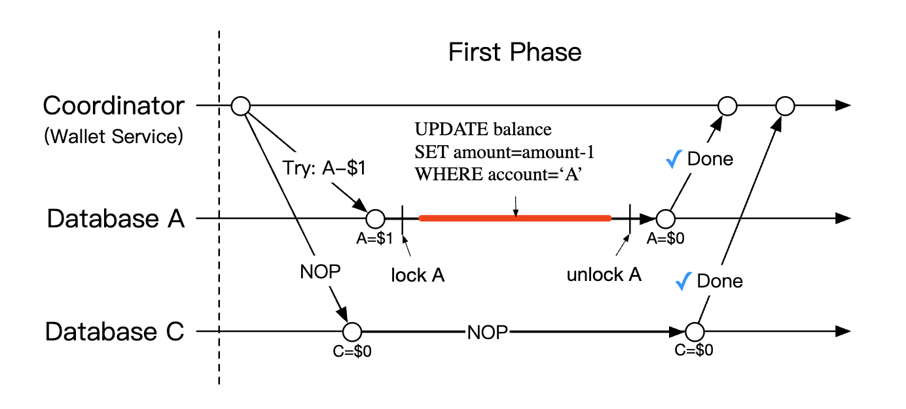
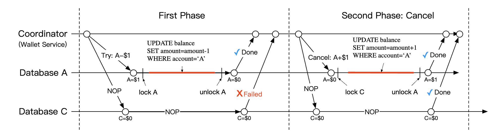
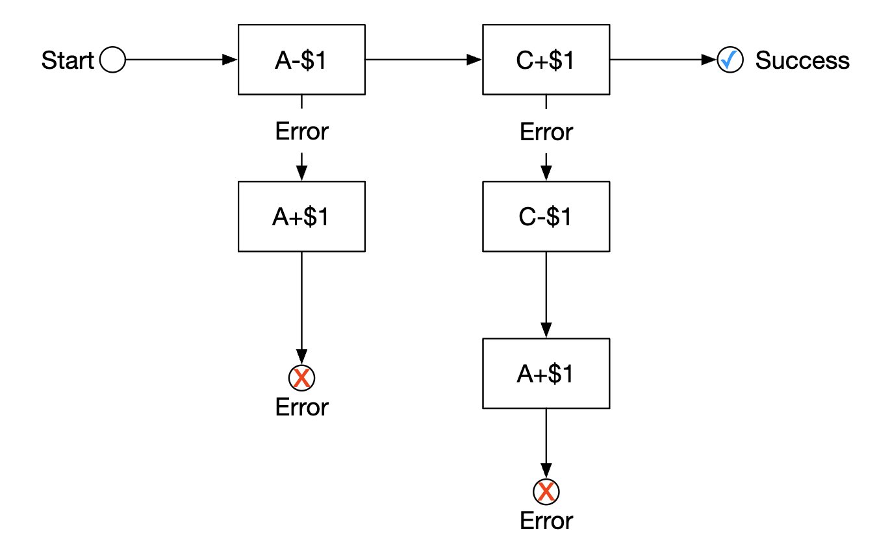
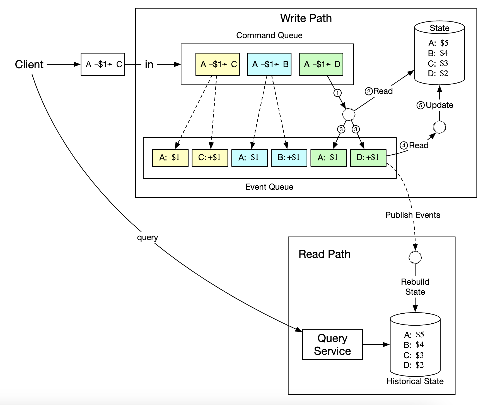
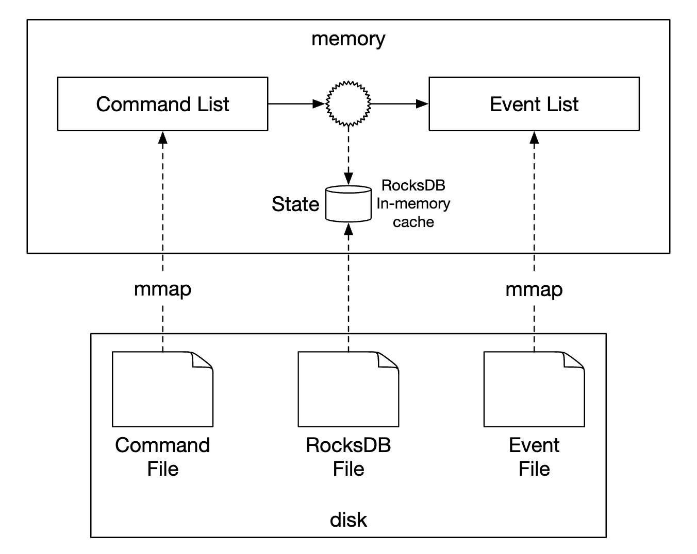
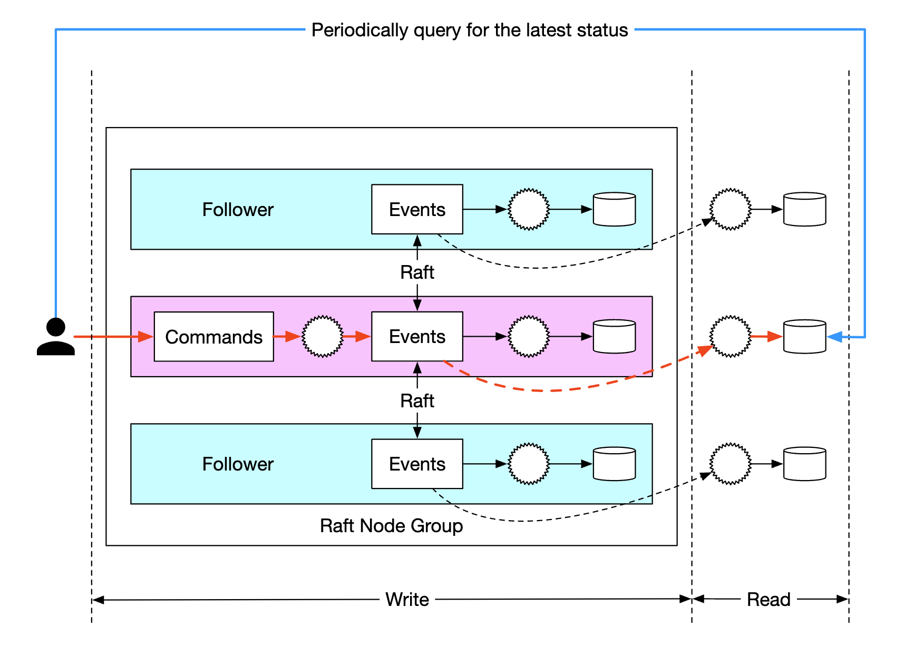

# 第 27 章：数字钱包

> 原章节：Digital Wallet · 原项目路径 `27.  Digital Wallet/`

## 本章导读

你在微信里给朋友转 100 块钱。你这边余额立刻少了 100，朋友那边余额立刻多了 100——整个过程不到一秒，而且**不可能出现"我扣了钱、他没收到"这种情况**。

这个"不可能"，就是本章的全部难点。

一个钱包看起来简单到不像一道系统设计题：两个账户，一加一减而已。但当你把这两个账户放到**不同的服务器、不同的数据库**上，还要一秒处理上百万笔转账时，"一加一减必须同时成功或同时失败"就变成了分布式系统里最棘手的问题之一。更麻烦的是，钱包是**要审计的**——三年后有人问"我在 2026 年 3 月 5 日 14:23 的余额是多少"，你必须能答出来，而且要能证明这个数字没被篡改过。

这一章会带你从零开始，走完一条完整的推理链：为什么一个本地数据库事务不够用？2PC、TC/C、Saga 分别在解决什么问题、代价是什么、什么时候该用哪个？为什么最后这套系统会用"事件溯源"把整个账本重建成一条不可篡改的事件流？

## 你将学到

- 为什么"跨库转账"没有本地事务可用，以及"只成功一半"会造成什么后果
- 两阶段提交（2PC）、三阶段提交（3PC）、TC/C（Try-Confirm/Cancel）、Saga 四种分布式事务方案的原理、代价与适用场景
- TC/C 的三种经典失败模式：Confirm 失败、空回滚、悬挂，以及如何用"阶段状态表"化解
- 幂等性为什么是分布式事务的生命线，以及不幂等会怎样重复扣款
- 事件溯源（Event Sourcing）如何把"余额"从一个可被覆盖的数字，变成一条只能追加的事件流
- CQRS 与快照（Snapshot）如何解决事件溯源的查询慢和重放贵两个问题
- 钱包的硬约束——余额不能为负——在并发下如何保证
- 钱包余额与银行流水如何对账

---

## 1. 需求澄清与量级估算

### 先问清楚边界

系统设计题的第一件事永远不是画架构图，而是**问清楚要做什么**。原文记录了一段面试官（I）和候选人（C）的对话，我们把关键结论提炼出来：

| 问题 | 结论 |
|---|---|
| 支持哪些操作？ | 只做**钱包之间的转账** |
| 吞吐量要求？ | 假设 **100 万 TPS**（每秒百万笔交易） |
| 正确性怎么保证？ | 允许用**事务**保证；但光靠"对账"只能发现问题，不能给出根因 |
| 可重现性？ | **必须支持**——要能从头重放数据、重建历史 |
| 可用性？ | **99.99%** |
| 要不要考虑外汇？ | 不要，超出范围 |

其中有一条特别值得琢磨：面试官说"我们可以通过对账（reconciliation）来证明正确性，但**对账只能发现差异，不能告诉你差异是怎么产生的**。所以我们希望系统能从头重放数据、重建历史。"

这句话是整章的伏笔。它提前告诉你：**最终的方案不会是普通的"余额表 + UPDATE"，而是一套可重放的事件系统**。

### 量级估算（粗略估算 / Back-of-the-envelope）

原文给了一个关键假设：**一个云上配置好的传统关系型数据库，大约能支撑 1000 TPS。**

于是：

- 要扛 100 万 TPS，就需要 `1,000,000 / 1,000 = 1,000` 个数据库节点。
- 但一笔转账有**两条腿（two legs）**——A 扣一次、C 加一次。所以系统实际要处理的是 `100 万 × 2 = 200 万 TPS`。

原文给了一张表，说明"提升单节点 TPS"能省掉多少节点：

| 单节点 TPS | 需要的节点数 |
|---|---|
| 100 | 20,000 |
| 1,000 | 2,000 |
| 10,000 | 200 |

这张表按 **200 万 TPS** 计算，我们验算一下：

- `2,000,000 / 100 = 20,000` ✓
- `2,000,000 / 1,000 = 2,000` ✓
- `2,000,000 / 10,000 = 200` ✓

数字是对的。这张表传达的核心信息是：**单节点性能每提升一个数量级，集群规模就下降一个数量级**。所以后面所有的性能优化，目标都是"让一台机器扛更多"，而不是"无脑加机器"——因为 2000 个数据库节点的运维成本、跨节点事务成本，都是灾难。

> **关于"1000 TPS"这个数字**
> 这是原文给出的**量级假设**，不是精确基准。现代服务器上，一个简单的单行 UPDATE 事务跑到每秒几千甚至上万 TPS 是可能的；但钱包转账事务通常包含：多条记录更新、写 WAL、`fsync` 落盘、可能的同步复制确认——这些都会把 TPS 拉低到千级。所以"1000 TPS"作为一个**保守的量级估算**是站得住的，你不需要纠结它的绝对值。面试时如果被追问，你可以说："这个数取决于事务复杂度和持久化级别，我给的是一个保守量级。"

> **关于"100 万 TPS"这个目标**
> 这个数字**远超现实世界的支付峰值**。真实的大型支付系统（比如电商大促的支付峰值）在几十万笔/秒的量级。原文设定 100 万 TPS 是为了把设计压力拉满，逼出"必须分片 + 必须分布式事务 + 必须优化单机性能"这一整套方案。理解这一点很重要：**这是设计目标，不是行业参照**。面试时你可以主动点破这一点，这反而是加分项。

---

## 2. 高层设计：从内存分片方案说起

<div align="center"></div>

### API 设计

面试范围内只需要一个端点：

```
POST /v1/wallet/balance_transfer
```

请求参数：

| 参数 | 含义 |
|---|---|
| `from_account` | 转出账户 |
| `to_account` | 转入账户 |
| `amount` | 金额。**用字符串（string）而不是浮点数** |
| `currency` | 币种 |
| `transaction_id` | 幂等键（idempotency key） |

响应示例：

```json
{
    "status": "success",
    "transaction_id": "01589980-2664-11ec-9621-0242ac130002"
}
```

这里有两个细节，初学者很容易忽略，但都是真实工程中的硬性要求：

**第一，金额为什么用字符串？**

因为浮点数（float / double）**不能精确表示大多数十进制小数**。经典例子：在 IEEE 754 双精度下，`0.1 + 0.2 != 0.3`（结果是 `0.30000000000000004`）。对钱包来说，这种误差是不可接受的——一分钱都不能错。所以金额要用**字符串**或**整数（以最小货币单位计，比如"分"）**来表示。原文选择了字符串，并明确注明"string to not lose precision"（用字符串以免丢失精度）。

**第二，`transaction_id` 为什么必须传？**

它是**幂等键**。客户端超时重试时，会带着同一个 `transaction_id` 再发一次。服务端靠它判断："这笔转账我已经处理过了，直接返回上次的结果，不要再扣一次钱。"没有它，网络重试就会变成重复扣款。

### 内存分片方案

钱包应用需要为每个账户维护余额。一个很自然的数据结构是：

```
map<user_id, balance>
```

它可以用内存型 Redis 来实现。但一台 Redis 扛不住 100 万 TPS，所以要把 Redis 集群**分片（partition）**成多个节点。

原文给的示例分片算法：

```java
String accountID = "A";
Int partitionNumber = 7;
Int myPartition = accountID.hashCode() % partitionNumber;
```

分片数量和各 Redis 节点的地址，可以放在 **ZooKeeper** 里，因为它是一个高可用的配置存储。

最后，钱包服务本身是一个**无状态服务（stateless service）**，只负责执行转账逻辑，因此可以轻松水平扩展：

<div align="center"></div>

> **这段示例代码有一个真实的坑**
> `accountID.hashCode() % partitionNumber` 在 Java 里**可能返回负数**。Java 的 `%` 运算符对负数操作数返回负结果，而 `String.hashCode()` 完全可能是负数（例如 `"polygenelubricants".hashCode()` 就是 `Integer.MIN_VALUE`）。一旦返回负数，`myPartition` 就是负数，作为分片下标是非法的。
> 正确写法应该是先取绝对值（并特殊处理 `Integer.MIN_VALUE`），或者用 `Math.floorMod(hash, partitionNumber)`。
> 更重要的是：**用取模做分片，一旦 `partitionNumber` 变了，几乎所有 key 的归属都会变**——扩容时等于全量数据迁移。生产环境要么用**一致性哈希（Consistent Hashing）**，要么预先划分远多于物理节点数的**逻辑分片**（详见勘误 2）。

### 这个方案的致命缺陷

原文说得很直接：内存分片方案解决了扩展性问题，**但它没法原子地执行转账**。

- 内存（Redis）不是持久化存储，宕机就丢数据；
- A 和 C 在不同 Redis 节点上，没有任何机制保证"两个操作要么都成功、要么都失败"。

于是问题正式浮出水面：**跨库/跨服务的转账，怎么做成一个原子操作？**

---

## 3. 分布式事务：问题到底出在哪

### 先把问题说清楚

一次转账，本质上要做两件事：

```
A 的余额 -= 100
C 的余额 += 100
```

这两件事**必须同时成功，或者同时失败**。任何"只成功一半"的结果都是灾难：

| 结果 | 后果 |
|---|---|
| A 扣了，C 没加 | **钱凭空消失**（用户会投诉，且这是资金损失） |
| C 加了，A 没扣 | **钱凭空产生**（系统在偷偷印钞） |

### 为什么本地事务不够

如果 A 和 C 在**同一个数据库**里，这根本不是问题：

```sql
BEGIN;
UPDATE accounts SET balance = balance - 100 WHERE account_id = 'A';
UPDATE accounts SET balance = balance + 100 WHERE account_id = 'C';
COMMIT;
```

数据库的 **ACID** 特性（原子性 Atomicity、一致性 Consistency、隔离性 Isolation、持久性 Durability）保证了这个事务要么全做、要么全不做。这就是**本地事务（local transaction）**。

但我们的系统有两个硬约束，把本地事务彻底废掉了：

1. **数据必须分片**。100 万 TPS 单库扛不住，A 和 C 极可能落在**不同的数据库实例**上。
2. **跨库没有本地事务**。数据库的 ACID 只在**单个数据库实例内部**成立。一旦跨越实例边界，数据库就管不了你了——没有任何一个数据库能对另一个数据库说"你回滚"。

> **一句话记住**：分布式事务的全部复杂度，都来自"跨库之后，原子性这个免费午餐没有了"。

所以我们需要一套**跨库的原子性协议**。下面按"从老到新、从阻塞到补偿"的顺序，逐个讲清楚。

### 方案一：两阶段提交（2PC）

<div align="center"></div>

最直接的思路是：**在多个分片关系型数据库之上，叠加一个两阶段提交协议。**

两阶段提交（Two-Phase Commit，2PC）引入两个角色：

- **协调者（Coordinator）**：在我们的场景里就是钱包服务。它负责指挥全局。
- **参与者（Participant）**：各个数据库。它们负责执行具体操作。

<div align="center"></div>

协议流程：

1. **准备阶段（Prepare / Vote）**：协调者先在各个数据库上执行读写操作，然后**要求所有数据库"准备"这个事务**。每个数据库把事务日志写盘、**锁住涉及的数据**，但**先不提交**，然后回复"可以（yes）"或"不行（no）"。
2. **提交阶段（Commit / Abort）**：
   - 如果**所有**数据库都回复 yes，协调者通知所有数据库**提交（commit）**。
   - 只要**有一个**回复 no（或者超时），协调者通知所有数据库**中止（abort）**。

**2PC 的代价（原文列了两条）：**

- **性能差，因为锁竞争（lock contention）**。从 Prepare 到 Commit 之间，数据是被锁住的。在高并发下，其他事务只能排队等——而 2PC 的这个窗口里包含了**至少一轮网络往返**，在高吞吐场景下锁持有时间会被放大成严重的瓶颈。
- **协调者是单点故障（single point of failure）**。如果协调者在"已经发出部分 Commit 指令"之后挂了，就会有一些参与者提交了、另一些还在等——数据库进入 **in-doubt（结果未定）** 状态，可能一直持锁，直到协调者恢复。这期间数据可能不一致。

> **2PC 什么时候还值得用？**
> 当参与方少、事务频率低、能容忍秒级延迟时，2PC 依然是可靠且实现简单的选择。传统企业系统里的 **XA 事务**（MySQL 的 XA、PostgreSQL 的 prepared transactions）就是 2PC 的工业实现。它的问题不是"错"，而是"**扛不住高并发**"——而我们的目标是 100 万 TPS，所以必须继续往下找。

---

## 4. 三阶段提交（3PC）：一个几乎没人用的改良版

原文没有讲 3PC，但它是理解"2PC 为什么阻塞"的最好对照，所以我们在这里补上。

**2PC 最大的问题**是：参与者在 Prepare 之后、Commit 之前，**既不能提交也不能回滚**——它必须等协调者的最终指令。这段时间它锁着资源、什么都不干。这叫**阻塞（blocking）**。

**三阶段提交（Three-Phase Commit，3PC）** 的思路是：在"准备"和"提交"之间**插入一个 PreCommit 阶段**，让参与者提前知道"大家大概率都会同意"，从而减少阻塞。

三个阶段：

1. **CanCommit（询问）**：协调者问所有参与者"你们能不能做？"参与者只做一个**轻量检查**，回复 yes/no。**不锁资源。**
2. **PreCommit（预提交）**：如果全体 yes，协调者让参与者**执行事务并写日志、锁资源**（相当于 2PC 的 Prepare）。参与者回复 ACK。
3. **DoCommit（正式提交）**：协调者让参与者**提交**。

**3PC 的两个改进**：

- 如果参与者在 PreCommit 阶段超时（没收到协调者的 DoCommit），它**可以自行提交**——因为它已经知道"大家都通过了 CanCommit"。这打破了 2PC 的永久阻塞。
- 如果参与者在 CanCommit 之后超时，它可以直接中止，不需要等待。

**但 3PC 有个致命前提**：它假设**网络不会分区（no network partition）**，并且节点只会"崩溃停止"、不会"变慢或发疯"。

> **为什么工业界基本不用 3PC？**
> 因为真实网络的**分区（network partition）**是常态，不是例外。一旦发生分区，3PC 会退化得比 2PC 更糟：一部分节点自行提交、另一部分自行中止，**直接导致数据不一致**。而 2PC 虽然阻塞，但至少不会产生不一致（它宁可停下来等）。
> 3PC 还多了一轮网络往返，延迟更高。所以它的处境很尴尬：**延迟比 2PC 高，正确性比 2PC 弱**。
> **结论**：知道 3PC 存在、知道它想解决什么、知道它为什么失败，就足够了。不要在生产系统里用它。

---

## 5. TC/C（Try-Confirm/Cancel）：本章的重点

### 先厘清一个术语混乱

原文把这一节叫 **"Distributed transaction using Try-Confirm/Cancel (TC/C)"**，并称它是"2PC 协议的一个变体，配合补偿事务工作"。

这里有一个**术语问题必须澄清**：

> **业界标准名称是 TCC（Try-Confirm-Cancel）**。原文写的 **TC/C** 和 **TCC** 是**同一个东西**，只是写法不同。面试时请用 **TCC**。
>
> 另外，"TCC 是 2PC 的变体"这个说法**不够准确**。TCC 确实借用了"两个阶段"的结构（第一阶段 Try，第二阶段 Confirm 或 Cancel），但它和 2PC 有一个**本质区别**：
> - **2PC 是一个跨库的事务**，参与者在 Prepare 之后**锁着资源不提交**，等协调者统一裁决。
> - **TCC 是两个（或更多）独立的本地事务**：Try 阶段每个库**各自提交一个本地事务**；Confirm/Cancel 阶段再各自提交另一个本地事务。
>
> 所以 TCC **不依赖数据库的 XA 协议**，也**不长时间持有数据库锁**。它属于**补偿型事务（Compensating Transaction）**家族——和 Saga 是同一族，而不是 2PC 的直系亲属。原文自己也点出了这个关键区别："2PC performs a single transaction, whereas in TC/C, there are two independent transactions."（2PC 执行的是一个事务，而 TC/C 执行的是两个独立的事务。）

### TCC 的三个阶段

标准 TCC 的语义是：

| 阶段 | 做什么 | 类比 |
|---|---|---|
| **Try** | **预留资源**——把资源"冻住"，但不动用 | 订酒店时先"锁房"，钱还没付 |
| **Confirm** | **确认执行**——把预留的资源真正扣掉 | 入住时真正付款 |
| **Cancel** | **取消预留**——把冻结的资源释放掉 | 取消订单，释放锁房 |

用一个生活化的类比：**你订机票**。

- **Try**：下单占座。座位被标记为"为你保留"，别人订不到了，但航司还没收到钱。
- **Confirm**：付款成功。座位正式归你。
- **Cancel**：超时未付款，座位释放，别人可以订。

**关键在于 Try 只"冻结"，不"扣减"。** 这一点非常容易被搞错，我们用 A 转 100 元给 C 来具体化：

| 阶段 | A 账户 | C 账户 |
|---|---|---|
| **Try** | 冻结 100（`frozen += 100`，可用余额 `-100`） | 什么都不做（或记录一条预留） |
| **Confirm** | 把冻结的 100 真正扣掉（`balance -= 100`，`frozen -= 100`） | `balance += 100` |
| **Cancel** | 解冻（`frozen -= 100`，可用余额 `+100`） | 释放预留（如果有） |

注意 Try 阶段 A 的**总资产没有变**——钱还在 A 名下，只是从"可用"挪到了"冻结"。这就保证了：**在 Try 和 Confirm 之间的任何时刻，钱都不会凭空消失**。

### 原文的 TC/C 用的是另一种变体

原文表格里的 Try 阶段是 **A 直接 `-$1`**（真实扣减，不是冻结）：

| Phase | Operation | A | C |
|---|---|---|---|
| 1 | Try | Balance change: -$1 | Do nothing |
| 2 | Confirm | Do nothing | Balance change: +$1 |
|   | Cancel | Balance change: +$1 | Do Nothing |

<div align="center"></div>

原文的 Try 阶段：协调者在 A 的数据库里**开启一个本地事务**，把 A 的余额减少 1 元并提交；C 的数据库收到一条 **NOP（No Operation，空操作）** 指令，什么都不做。

<div align="center"></div>

如果两个数据库都回复"yes"，进入 Confirm 阶段：A 收到 NOP，C 的数据库被指示把余额增加 1 元（同样是一个本地事务）。

<div align="center"></div>

如果第一阶段有任何操作失败，进入 Cancel 阶段：A 的数据库被指示把余额回补 1 元，C 收到 NOP。

**这是"先扣减、后增加"的变体。** 它和标准 TCC 的"冻结"语义不同，但同样是一种合法设计。我们对比一下：

| 变体 | Try 做什么 | 优点 | 缺点 |
|---|---|---|---|
| **标准 TCC（冻结）** | 冻结资源 | Try 期间钱还在账户名下，语义清晰 | 需要额外的"冻结金额"字段和逻辑 |
| **原文的 TC/C（直接扣减）** | 真实扣减 | 实现更简单，且**绝不会透支**（钱先离开 A） | Try 与 Confirm 之间钱处于"在途"状态，既不在 A 也不在 C |

原文明确选择了后者，理由是**"always executing deductions prior to additions"（永远先执行扣减，再执行增加）**——只要钱先离开 A，就不可能发生"钱还没扣就先花掉"的问题。

**但你要理解这个选择的代价**：在 Try 和 Confirm 之间，这 100 元**处于"悬空"状态**。原文专门用一张图说明了这个短暂的"不平衡状态"：

<div align="center"></div>

原文说：这没问题，**只要我们能从这个状态恢复，并且用户无法使用这笔在途的钱**。而"用户无法使用"正是靠"先扣减、后增加"保证的。

原文还用一张表说明了 Try 阶段的选择：

| Try 阶段的选择 | A 账户 | C 账户 | 是否合法 |
|---|---|---|---|
| 选择 1 | -$1 | NOP | **合法** |
| 选择 2 | NOP | +$1 | 非法 |
| 选择 3 | -$1 | +$1 | 非法 |

**为什么选择 3 非法？** 原文解释得很清楚：选择 3 需要**跨数据库的原子执行**——这恰恰是我们不依赖 2PC 就做不到的事。所以 Try 阶段只能动一个账户。

### 2PC 与 TC/C 的本质对比

原文给了一张非常精炼的对比表，这是本节的核心：

| | 第一阶段 | 第二阶段：成功 | 第二阶段：失败 |
|---|---|---|---|
| **2PC** | 事务**还没完成**（锁着资源，未提交） | 提交/取消所有事务 | 取消所有事务 |
| **TC/C** | 所有事务**已经完成**——要么已提交，要么已取消 | 如有需要，执行**新的事务** | **逆转**已经提交的事务 |

**这张表是理解 TCC 的钥匙。** 请仔细体会"第一阶段"这一行：

- 2PC 的第一阶段结束时，事务**悬而未决**——资源被锁，谁也不知道最终结果。
- TCC 的第一阶段结束时，事务**已经尘埃落定**——A 的钱确实扣掉了，这是一个已提交的事实。所以第二阶段要么"再补一刀"（Confirm，给 C 加钱），要么"把那一刀补回来"（Cancel，给 A 退钱）。

**这就是为什么 TCC 不阻塞、性能好**：它没有"锁着资源等裁决"的阶段。代价是它把复杂度从数据库层搬到了**业务逻辑层**。

原文列出的 TCC 的另外两个性质：

- **与数据库无关（database agnostic）**：只要数据库支持本地事务就行，不需要 XA。
- **分布式事务的细节和复杂度由业务逻辑承担**。

### 幂等性：TCC 的生命线

在讲失败模式之前，必须先讲透一个概念：**幂等性（Idempotency）**。

**定义**：同一个操作执行一次和执行多次，**结果相同**。

为什么 TCC 必须幂等？因为在分布式系统里，**网络超时是常态**：

```
协调者 → Try 请求 → A 的数据库
        ← 超时，没收到响应（但 A 其实已经执行了！）
协调者 → 重试 Try 请求 → A 的数据库
```

如果 Try 不幂等，A 就被扣了两次钱。**这不是小概率事件**，而是分布式系统的日常。

**怎么实现幂等？**

用一个**全局唯一的事务 ID** + 一张**去重表**：

```sql
-- Try 阶段，先尝试插入事务记录
INSERT INTO tcc_transactions (transaction_id, status)
VALUES ('01589980-2664-11ec-9621-0242ac130002', 'TRYING');

-- 如果主键冲突，说明这个事务已经处理过了，直接返回上次的结果
-- 如果插入成功，才真正执行冻结/扣减逻辑
```

关键在于：**"插入去重记录"和"执行业务操作"必须在同一个本地事务里**。这样要么两者都成功，要么都回滚，不会出现"记录了但没执行"或"执行了但没记录"。

> **一句话记住**：**TCC 的三个阶段（Try / Confirm / Cancel）都必须幂等**。任何一个不幂等，重试就会造成资金错误。这是 TCC 实现中最容易出错、也最致命的地方。

---

## 6. TC/C 的失败模式：三个经典难题

TCC 的性能优势是拿"业务复杂度"换来的。这笔账的"利息"，就是三个经典失败模式。原文提到了"failure modes"并给出了"阶段状态表"和"乱序标志"两个机制，但没有系统地把它们讲全。我们在这里讲透。

### 6.1 协调者中途挂掉：阶段状态表

如果协调者在执行到一半时挂了，它必须能**恢复自己的中间状态**，否则就不知道"哪些 Try 发出去了、哪些没发出去"。

原文的解法是：**维护阶段状态表（phase status tables），在各个数据库分片内原子更新。**

<div align="center"></div>

这张表包含（原文列出的字段）：

- 分布式事务的 **ID 和内容**
- **Try 阶段的状态**：未发送 / 已发送 / 已收到响应
- **第二阶段的名称**：Confirm 还是 Cancel
- **第二阶段的状态**
- **乱序标志（out-of-order flag）**（后面解释）

有了这张表，协调者重启后就能**扫描所有处于中间状态的事务**，判断该继续 Confirm 还是该 Cancel。

### 6.2 失败模式一：Confirm 失败了怎么办？

**场景**：Try 阶段全部成功，进入 Confirm 阶段。协调者通知 A 提交（NOP，无所谓），通知 C 加钱。**但 C 的数据库此刻挂了/网络不通。**

**这时候能回滚吗？不能。**

因为 Try 阶段已经**提交**了 A 的扣款（在原文的变体里），在标准 TCC 里也冻结了资源。这是一个**已经发生的事实**，没有"回滚"这个选项——你不能把 A 的钱退回去，因为 C 可能其实已经收到钱了（只是响应丢了）。

**唯一的出路是：不断重试，直到成功。**

```
Confirm 失败 → 重试 → 失败 → 重试 → 失败 → 重试 → ... → 成功
```

这意味着两件事：

1. **Confirm 必须幂等**——如果 C 其实已经加过钱了，只是响应丢了，重试不能再加一次。
2. **系统必须有可靠的重试机制**——通常是把待重试的事务放进一张表，由一个后台任务（定时轮询或消息队列）持续重试，直到明确成功。

> **这是 TCC 最反直觉的一点**：**Confirm 阶段没有"失败"这个终态，只有"还没成功"**。一旦进入 Confirm，就必须成功。这就是为什么 TCC 要求 Confirm 逻辑尽可能简单、可靠、且绝对幂等——它是一条**不能回头的路**。

### 6.3 失败模式二：空回滚（Empty Rollback）

**场景**：协调者发出了 Try 请求，但请求**在网络上丢了**（或者协调者在发出 Try 之后、A 执行之前就挂了）。A 从来没有执行过 Try。

随后，协调者（或者恢复流程）判断这个事务失败了，发出 **Cancel**。

**Cancel 到了 A，但 A 根本没 Try 过。** 如果 Cancel 的逻辑是"把冻结的钱解冻"，那它会把一个**根本没冻结过的账户**解冻——凭空给用户加了钱。

**正确做法**：Cancel 到达时，先检查这个事务 ID 是否存在。

- 如果**存在**（Try 执行过）→ 正常执行解冻。
- 如果**不存在**（Try 从没来过）→ 什么都不做，但**必须插入一条"已空回滚"的记录**。

**为什么必须记录？** 因为要防止下一个问题——

### 6.4 失败模式三：悬挂（Suspension / Hanging）

**场景**：这是"空回滚"的后续。Cancel 先到了（此时 Try 还没来），Cancel 执行完，什么都没做。**然后，那个在网络里迷路了很久的 Try 请求，终于到了。**

Try 一看："这个事务我没处理过啊"，于是**老老实实冻结了用户的 100 元**。

**结果**：这笔钱被**永久冻结**。因为 Cancel 已经执行过了（并且被记录为"空回滚"），系统不会再发第二次 Cancel，这个冻结永远不会被解除。这就是**悬挂**。

原文正是用这张图描述这个问题的：

<div align="center"></div>

原文的解法是：**在阶段状态表里加一个"乱序标志（out-of-order flag）"。当收到 Try 操作时，先检查这个标志是否已置位；如果已置位，直接返回失败，不执行冻结。**

这个"乱序标志"，本质上就是**空回滚记录**。所以两个问题的解法是统一的：

| 问题 | Cancel 先到 | Try 后到 |
|---|---|---|
| **空回滚** | Cancel 发现没有对应 Try → 插入"空回滚"记录，不做事 | — |
| **悬挂** | — | Try 发现已有"空回滚/取消"记录 → **拒绝执行**，返回失败 |

> **一句话记住**：**空回滚是"Cancel 早到了不能乱动"，悬挂是"Try 晚到了不能乱冻"。** 两者的统一解法是**用事务 ID 做状态判断 + 阶段状态表持久化**。
>
> 这三个失败模式（Confirm 必重试、空回滚、悬挂）是 TCC 面试的高频考点。能主动讲出这三个，说明你真的实现过、或者至少认真想过 TCC。

---

## 7. Saga（补偿事务）

### 思路：把大事务拆成一串小事务

Saga 是另一个主流方案，也是微服务架构下实现分布式事务的**标准模式**。

它的思路很朴素：

1. **把一个大事务拆成一串有序的小操作**，每个操作在自己的数据库里是**独立的本地事务**。
2. **按顺序从第一个执行到最后一个。**
3. **任何一步失败，就从这个位置开始，用"补偿操作（compensating operations）"逆序回滚，一直回到起点。**

<div align="center"></div>

> **Saga 的出处**：这个模式最早由 Hector Garcia-Molina 和 Kenneth Salem 在 1987 年的论文《Sagas》中提出，原本是为了解决"长事务（long-lived transaction）持锁太久"的问题。它比 TCC 更"老"，但直到微服务时代才真正流行起来。

### 两种协调方式

原文列了两种：

| 方式 | 英文 | 做法 | 优点 | 缺点 |
|---|---|---|---|---|
| **协同式** | Choreography | 每个服务**订阅相关事件**，自己决定该做什么 | 去中心化，没有单点 | 业务逻辑分散在多个服务里，异步通信，**很难追踪和调试** |
| **编排式** | Orchestration | **一个中心协调器**按正确顺序指挥所有服务 | 复杂逻辑集中，**好维护、好调试** | 协调器可能成为单点（需要自己做高可用） |

原文的结论：**协同式的挑战在于业务逻辑被拆散到多个服务、通过异步通信协作；而编排式能很好地处理复杂度，所以在数字钱包系统里通常更受青睐。**

### TC/C 与 Saga 的对比

原文给了一张对比表，这张表值得逐行读：

| | TC/C | Saga |
|---|---|---|
| **补偿动作在哪** | Cancel 阶段 | 回滚阶段 |
| **中心协调** | 有 | 有（orchestration 模式） |
| **操作执行顺序** | **任意** | **线性** |
| **能否并行执行** | **可以** | 不可以（线性执行） |
| **是否可能看到部分不一致状态** | 是 | 是 |
| **逻辑放在应用层还是数据库层** | 应用层 | 应用层 |

**核心差异只有一条：TCC 可以并行，Saga 只能线性。**

这条差异直接决定了选型：**如果对延迟敏感，选 TCC**——因为 TCC 的两个分支（给 A 扣、给 C 加）可以并行发出，而 Saga 必须一步一步来。原文的原话："The main difference is that TC/C is parallelizable, so our decision is based on the latency requirement - if we need to achieve low latency, we should go for the TC/C approach."

**但无论选哪个，都还有一件事必须做**：原文最后强调——"Regardless of the approach we take, we still need to support auditing and replaying history to recover from failed states."（无论采用哪种方案，我们仍然需要支持审计和历史重放，以便从失败状态中恢复。）

**这句话把本章的下半场引出来了：事件溯源。**

---

## 8. 事件溯源（Event Sourcing）：钱包为什么需要它

### 从一个审计问题说起

原文说：现实中的数字钱包**会被审计**，所以我们必须能回答三个问题：

1. **任意给定时刻，账户余额是多少？**
2. **我们怎么知道历史余额和当前余额是正确的？**
3. **改完代码之后，怎么证明系统逻辑还是对的？**

传统做法（一张 `accounts` 表，存着当前余额）**一个都答不上来**。因为 `UPDATE balance = 850` 这个操作是**破坏性的**——它把旧值覆盖掉了。你只知道"现在是多少"，永远不知道"当时是多少"，更没法验证"这个数字是不是算错了"。

**事件溯源（Event Sourcing）就是为回答这三个问题而生的技术。**

### 四个核心概念

事件溯源由四个概念组成（原文的划分）：

**① 命令（Command）**

来自现实世界的**意图**，比如"从 A 转 1 元到 B"。

- 命令需要一个**全局顺序**，所以它们被放进一个 **FIFO（先进先出）队列**。
- **命令和事件不同，命令是会失败的**，也可能包含随机性（比如依赖外部 IO、依赖当前状态是否合法）。
- 一条命令可以产生 **0 个或多个**事件（比如转账失败就产生 0 个事件）。
- **命令的生成过程可能包含随机性**（比如读外部 IO）——这一点后面很关键。

**② 事件（Event）**

系统内部**已经发生的历史事实**，比如"已从 A 转出 1 元给 B"。

- **和命令不同，事件是事实**——它已经发生了，不会失败，不能被撤销。
- 和命令一样，事件也需要顺序，所以也放进 FIFO 队列。

**③ 状态（State）**

事件导致的结果。比如一个"账户 → 余额"的键值存储。

**④ 状态机（State Machine）**

驱动整个事件溯源流程的组件。它主要负责：**校验命令**、**把事件应用到状态上**。

- **状态机必须是确定性的（deterministic）**——它不应该读外部 IO，也不应该依赖随机数。

<div align="center"></div>

原文还给了一张动态视图，展示命令如何流动成事件、再更新状态：

<div align="center"></div>

### 在钱包里怎么落地

对钱包服务来说，**命令就是转账请求**。我们可以把它们放进一个 FIFO 队列，比如 **Kafka**：

<div align="center"></div>

完整的流程：

<div align="center"></div>

1. 状态机从**命令队列**读取命令；
2. 从数据库读取**余额状态**；
3. **校验命令**。如果合法，为**两个账户各生成一个事件**；
4. 读取下一个事件并**应用**它——更新数据库里的余额（状态）。

### 最大的价值：可重现性（Reproducibility）

原文的原话："The main advantage of using event sourcing is its reproducibility."

在这个设计里，**所有状态更新操作都被保存为一份不可变的、包含全部余额变化的历史**。

于是：

- **历史余额可以随时通过从头重放事件来重建。**
- **因为事件列表不可变、状态机是确定性的，重放任何中间状态都保证会成功。**

<div align="center"></div>

现在回头看开头的三个审计问题，答案全都出来了（原文的三条回答）：

| 审计问题 | 事件溯源如何回答 |
|---|---|
| 任意时刻的余额是多少？ | 从头重放事件，直到你关心的那个时间点 |
| 怎么知道历史余额和当前余额是正确的？ | 从头重新计算所有事件来验证 |
| 改代码后怎么证明逻辑还是对的？ | 用**不同版本的代码**跑**同一批事件**，比对结果是否完全一致 |

> **第三条是事件溯源的"隐藏超能力"**：它让你可以在**生产数据**上验证代码改动的正确性，而不用等到出事故。这在金融系统里价值极高。

### CQRS：解决"查询"的问题

客户端要查余额，不能让每个查询都去重放几百万条事件——太慢了。原文的解法是 **CQRS（Command Query Responsibility Segregation，命令查询职责分离）**：

> 可以有**多个只读状态机**，它们基于那份不可变的事件列表，专门负责**查询历史状态**。

<div align="center"></div>

CQRS 的核心思想是：**读和写用两套不同的模型**。

- **写模型（命令侧）**：接收命令、校验、生成事件、维护权威状态。为了正确性，走的是"重放 + 严格顺序"的路径，**慢但准**。
- **读模型（查询侧）**：订阅事件流，把事件"投影（project）"成方便查询的**物化视图（Materialized View）**——比如一张 `user_id → balance` 的表，甚至是一张预先算好的报表。**快，但不是权威数据源**。

为什么非要拆开？因为这两个场景的诉求是**矛盾的**：

- 写侧要的是**正确性和可审计性**——必须保留完整事件、严格顺序。
- 读侧要的是**低延迟和高吞吐**——它只想快速拿到一个数字。

如果硬要用一套模型，你就会陷入两难：要么为了查询性能而牺牲事件的完整性（就退化成普通的余额表了），要么为了事件完整性而让每次查询都慢得不可接受。CQRS 让两边各取所需。

**代价**：引入了**最终一致性（Eventual Consistency）**。读模型是异步从事件流更新的，所以用户刚转完账，立刻查余额可能还是旧值。这在钱包场景里是**必须正面处理**的问题——本章第 11 节会讲怎么解决。

---

## 9. 深入设计：高性能事件溯源

前面解决了"正确性"，但我们的目标是 **100 万 TPS**。原文在这一节讲了一系列性能优化。

### 优化一：把日志存到本地磁盘

**第一个优化**：把命令和事件存到**本地磁盘存储**，而不是 Kafka 这样的外部存储。

好处：

- **省掉网络延迟**。写本地磁盘不需要网络往返。
- **只做追加写（append-only）**。对磁盘来说，顺序追加是最快的写模式——即使是机械硬盘（HDD）也很快，因为不需要寻道。

### 优化二：把最近的日志缓存在内存

**第二个优化**：把最近用到的命令和事件**缓存在内存**里，省掉从磁盘回读的时间。

### 实现手段：mmap

在底层，上面两个优化可以**用一个系统调用同时实现**：**`mmap`（内存映射）**。它把本地磁盘上的文件映射到进程的内存空间，于是你**既得到了落盘，也得到了内存缓存**。

<div align="center"></div>

> **mmap 到底是什么？**
> `mmap` 是一个 UNIX 系统调用，它把磁盘上的一个文件"映射"到进程的虚拟地址空间。之后你对这段内存的读写，由操作系统自动同步到文件。读的时候如果数据在内存里就直接读（快），不在就触发缺页中断从磁盘加载；写的时候先写内存，内核在后台刷盘。
> **它之所以快**，是因为数据**不经过用户态缓冲区**，也省掉了 `read`/`write` 系统调用的开销。**但要注意**：mmap 写入后，数据要真正落盘需要内核刷页（或显式 `msync`），所以"写了 mmap"不等于"已持久化"。对钱包这种场景，关键路径上的持久化点仍然需要明确的 `fsync` 语义。

### 优化三：状态也存本地，用 LSM 树

**第三个优化**：把**状态**也存到本地文件系统，用一个文件型本地关系数据库，比如 **SQLite**。**RocksDB** 也是一个很好的选择。

原文的选择是 **RocksDB**，理由是：**它使用 LSM 树（Log-Structured Merge-Tree），针对写操作做了优化；读性能则通过缓存来优化。**

<div align="center"></div>

> **为什么 LSM 树适合这个场景？**
> 传统数据库（如 MySQL 的 InnoDB）用的是 **B+ 树**，更新是"原地修改"——要找到那一页、改它、再写回去，**随机写**。而 **LSM 树**把写操作先在内存里攒着（MemTable），攒满了一批**顺序追加**到一个新文件（SSTable）里，后台再慢慢合并。
> 事件溯源的工作负载特点是**写多、且都是追加**——这和 LSM 树的设计完美契合。代价是**读会变慢**（数据可能分散在多个 SSTable 里，需要层层查找），所以要用**缓存**来补。原文说"读性能通过缓存优化"，说的就是这个。

### 优化四：快照（Snapshot）

**第四个优化**：为了优化可重现性，**定期把快照（snapshot）存到磁盘**，这样就不必每次都从最开头重放。

快照可以当作**大二进制文件**，存到 HDFS 这类**分布式文件存储**里：

<div align="center"></div>

> **快照解决了什么具体问题？**
> 想象一个跑了三年的钱包，事件列表有 **100 亿条**。现在要重放，从第 1 条跑到第 100 亿条，可能要跑好几个小时。但如果你在第 99 亿条处存了一个快照，重放就只需要：**加载快照（秒级）+ 重放最后 1 亿条**。
> 这是一个**时间换空间**的经典权衡：快照占存储，但把恢复时间从"小时级"压到"分钟级"。
> **工程上要注意**：快照必须和事件列表的某个**确定位置（offset/sequence）**绑定，否则"快照 + 后续事件"拼不出正确的状态。

---

## 10. 可靠的高性能事件溯源：引入复制

### 一个绕不开的副作用

原文说得很诚实："All the optimizations done so far are great, but they make our service **stateful**."

前面所有优化（本地磁盘、mmap、RocksDB、快照）都很好，**但它们让服务变成了有状态的**。有状态就意味着**单点**——那台机器挂了，数据就没了。所以必须引入**复制（replication）**。

### 先想清楚：什么数据需要高可靠？

原文有一段非常精彩的推理，值得完整复述，因为它是"分清主次"的典范：

1. **状态和快照** 都可以通过重放事件列表**重新生成**。所以**不需要**单独保证它们的可靠性——只要事件列表还在，它们随时能重建。
2. **有人可能会想**："事件列表也能从命令列表重新生成吧？"——**这是错的**，因为**命令是非确定性的**（命令可能失败、可能依赖外部 IO）。
3. **结论**：**我们只需要保证事件列表的高可靠性。**

> **这一步推理是本章最重要的思维训练之一。**
> 为什么事件可以从命令重放，但命令不能从命令重放？因为命令是**非确定性的**——同一条命令，在不同的时间、不同的外部状态下，可能产生不同的事件（甚至失败）。而事件是**已经确定的事实**，它重放出来的结果永远一样。
> **这就是为什么"事件列表"必须被持久化、被复制，而"命令列表"不需要**——命令一旦被执行，它的"历史使命"就完成了，它的产物（事件）才是真相。

### 复制事件列表

要保证事件列表的高可靠，需要把它复制到多个节点，并且必须保证两件事（原文）：

1. **不丢数据**；
2. **日志文件内数据的相对顺序，在所有副本之间保持一致。**

**注意第二条**——"顺序一致"和"不丢数据"同样重要。如果两个副本的事件顺序不一样，它们重放出来的状态就会**分叉**（这是第 28 章"确定性"要展开的核心问题）。

**实现手段：共识算法（consensus algorithm），比如 Raft。**

<div align="center"></div>

Raft 的模型（原文）：

- 有一个 **leader（领导者）**，它是**主动的**；
- 有若干 **follower（跟随者）**，它们是**被动的**；
- 如果 leader 挂了，**其中一个 follower 会顶上**；
- **只要超过半数（majority）的节点存活，系统就能继续运行。**

在这个方案里，**所有节点都基于事件列表更新自己的状态**，而 **Raft 保证 leader 和 followers 拥有完全相同的事件列表**。

> **为什么用"超过半数"而不是"全部"？**
> 因为要求全部节点都确认，只要有一台机器挂了整个系统就停了——可用性太差。而"超过半数"保证了两件事：**(1) 任意两个多数派必然有交集**，所以新 leader 一定能看到已提交的日志；**(2) 容忍少数节点故障**。这是**法定人数（Quorum）**思想的经典应用，代价是延迟取决于"多数派中最慢的那个节点"。

---

## 11. 分布式事件溯源：分片、CQRS 与实时性

到这里，我们已经做出了一个**单节点性能高、且可靠**的系统。但它还有两个限制（原文）：

1. **单个 Raft 组的容量是有限的**。到了一定规模，必须**分片（shard）**数据，并实现分布式事务。
2. **CQRS 架构下请求/响应流程很慢**。客户端必须**定期轮询（poll）**系统，才能知道自己的钱包有没有被更新。

### 问题：轮询不实时，还会压垮系统

**轮询不是实时的**，所以用户要过一会儿才能知道余额变了。而且，**如果轮询频率太高，会压垮查询服务**：

<div align="center"></div>

### 缓解一：反向代理

为了减轻系统负载，可以引入一个**反向代理（reverse proxy）**，它**代表用户发送命令，并代表用户轮询响应**：

<div align="center"></div>

原文说：这能缓解系统负载，因为**我们可以用一次请求拉取多个用户的数据**，但它**仍然没有解决"实时收到结果"的要求**。

### 缓解二：让只读状态机主动推送

**最后一个改动**：让**只读状态机在响应就绪时，主动把结果推回给反向代理**。这样用户就会感觉更新是实时的：

<div align="center"></div>

> **从"轮询"到"推送"，这是一个通用模式。**
> 轮询（polling）的问题是：**你要么查得太勤（浪费），要么查得太懒（不实时）**。推送（push）把"谁来决定什么时候查"从客户端转移到了服务端——服务端知道什么时候有结果，让它来通知你，天然就是最优时机。
> 这个思路在工程里反复出现：WebSocket 替代 HTTP 轮询、消息队列的推送消费、CDC（变更数据捕获）等。**面试时如果被问到"如何实现实时通知"，从"轮询 vs 推送"的角度切入，是一个很好的回答框架。**

### 最终形态：分片的 Raft 组

要更进一步扩展，就把系统**分片成多个 Raft 组**，然后在它们之上用**编排器（orchestrator）**通过 **TCC 或 Saga** 实现分布式事务：

<div align="center"></div>

**注意这里形成了一个漂亮的闭环**：

- **组内**（一个 Raft 组内部）用**共识算法**保证一致性和可靠性；
- **组间**（跨 Raft 组）用**分布式事务**（TCC / Saga）保证原子性。

这就把第 3～7 节讲的分布式事务，和第 10 节讲的 Raft，**各用在最适合它的层级上**。

### 一次转账请求的完整生命周期

原文给了最终系统里一次转账的完整生命周期，我们逐条拆解：

1. 用户 A 向 Saga 编排器发送一个分布式事务，包含两个操作：`A-1` 和 `C+1`。
2. Saga 编排器在**阶段状态表**里创建一条记录，用来追踪这个事务的状态。
3. 编排器确定需要把命令发到**哪些分片（partition）**。
4. **分片 1 的 Raft leader** 收到 `A-1` 命令，**校验**它，把它**转换成一个事件**，并在 Raft 组内**复制**到其他节点。
5. 事件结果被**同步到只读状态机**，状态机把响应**推回**给编排器。
6. 编排器创建一条记录，标明该操作成功，然后继续执行下一个操作 `C+1`。
7. 第二个操作与第一个类似：确定分片 → 发送命令 → 执行 → 只读状态机推回响应。
8. 编排器创建一条记录，标明操作 2 也成功了，最后把结果通知客户端。

**请把这条链路和前面的知识点对应起来**：

- 第 2、6、8 步 → **阶段状态表**（第 6.1 节），用于故障恢复；
- 第 3 步 → **分片**（第 2 节）；
- 第 4 步 → **确定性校验 + 事件生成 + Raft 复制**（第 8、10 节）；
- 第 5、7 步 → **CQRS 只读状态机 + 推送**（第 8、11 节）；
- 整个 1～8 步的编排 → **Saga / TCC**（第 5、7 节）。

---

## 12. 完整设计回顾

原文的收尾总结了一条清晰的演进路线，我们按"每一步解决了什么、又暴露了什么新问题"来重述：

| 阶段 | 方案 | 解决了什么 | 暴露了什么新问题 |
|---|---|---|---|
| 1 | 内存 Redis | 简单、快 | **不是持久化存储**，宕机丢数据；无法原子转账 |
| 2 | 分片关系型数据库 + 分布式事务（2PC / TCC / Saga） | 持久化 + 跨库原子性 | 单库性能扛不住 100 万 TPS |
| 3 | 引入事件溯源 | 所有操作**可审计**、可重放 | 存到外部数据库和队列，**性能不够** |
| 4 | 数据改存本地文件，利用**追加写**的性能，并用**缓存**优化读路径 | 单机性能大幅提升 | 服务变成**有状态**的，**不是可靠的**（单点） |
| 5 | 引入 **Raft 共识 + 复制** | 消除单点故障 | CQRS 的请求/响应流程慢（轮询） |
| 6 | **CQRS + 反向代理**，代表用户管理事务生命周期 | 减轻轮询负载，接近实时 | 单个 Raft 组容量有限 |
| 7 | 把数据**分片**到多个 Raft 组，用**分布式事务（TCC / Saga）**编排 | 可水平扩展 | —— |

> **这张表本身就是一道面试题的答案。**
> 如果面试官问"你怎么设计一个数字钱包"，一个高分回答的结构就是这条演进链：**每一步都是被上一步的问题逼出来的**。不要一上来就抛出"事件溯源 + Raft + 分片"，那样面试官会认为你在背答案。**正确的姿势是：先说最简单的方案，然后自己指出它的问题，再引出改进**——这正是原文 Step 1 → Step 4 的叙事方式。

---

## 勘误与补充

> 本节逐条指出原笔记中不准确、过时或缺失的地方。原笔记本章整体质量很高（尤其是事件溯源和 CQRS 部分），但有几处术语、代码和表述需要修正。

### 勘误 1：`TC/C` 应写作 `TCC`，且它不是 2PC 的"变体"

- **原文说法**：原文使用 `TC/C`（Try-Confirm/Cancel），并称它是"a variation of the 2PC protocol"（2PC 协议的一个变体）。
- **问题**：
  1. **术语不规范**。业界标准名称是 **TCC（Try-Confirm-Cancel）**。原文的 `TC/C` 写法在面试和文档中会显得生僻。
  2. **分类不准确**。TCC 确实有"两个阶段"的结构，但它和 2PC 有本质区别，原文自己也指出了："2PC performs a single transaction, whereas in TC/C, there are two independent transactions."（2PC 执行一个事务，TCC 执行两个独立事务）。既然 TCC 的第一阶段就已经**提交了本地事务**，它就不属于"两阶段提交"这个协议族，而属于**补偿型事务（Compensating Transaction）**族——和 Saga 是同一族。
- **正确说法**：**TCC 是一种基于补偿的分布式事务模式，它借用"两阶段"的形式，但不依赖 XA、不长期持有数据库锁。** 它和 2PC 的对比关系应该是"**替代方案**"，而不是"变体"。
- **延伸**：工业界最有影响力的 TCC 实现是蚂蚁金服（现蚂蚁集团）在支付宝体系内发展出来的，开源实现为 **Apache Seata**（其 TCC 模式）。面试时提到 Seata 会显得你了解工业实践。

### 勘误 2：分片示例代码存在负数取模的隐患

- **原文说法**：
  ```java
  Int myPartition = accountID.hashCode() % partitionNumber;
  ```
- **问题**：Java 的 `%` 运算符对负数操作数**返回负结果**（这一点和 Python 不同）。`String.hashCode()` 完全可能是负数，例如 `"polygenelubricants".hashCode()` 就等于 `Integer.MIN_VALUE`。一旦为负，`myPartition` 就是负数，作为分片下标非法，会导致 `ArrayIndexOutOfBoundsException` 或路由到错误节点。
- **正确说法**：应使用 `Math.floorMod(accountID.hashCode(), partitionNumber)`，它能保证结果非负。或者先取绝对值并特殊处理 `Integer.MIN_VALUE`。
- **延伸**：**这个例子还暴露了一个更大的设计问题**——用 `% partitionNumber` 做分片，一旦分片数从 7 变成 8，**几乎所有 key 的归属都会改变**，等于全量数据迁移。生产环境要么用**一致性哈希**，要么**预先划分远多于物理节点数的逻辑分片**（比如 1024 个逻辑分片映射到 8 台物理机，扩容时搬整个逻辑分片即可）。详见第 1 章第 12 节的讨论。

### 勘误 3："本地磁盘方案不 durable"的表述不准确

- **原文说法**：在 Wrap Up 里，原文说 "The previous approach, although performant, wasn't durable. Hence, we introduced Raft consensus with replication to avoid single points of failure."
- **问题**：这个表述把**持久性（Durability）**和**可用性/可靠性（Availability / Reliability）**混在一起了。第 4 步的方案（本地磁盘 + mmap + RocksDB）**在持久性上是合格的**——数据确实落到了磁盘，进程崩溃也不会丢。它真正缺的是**冗余**：那台机器的磁盘坏了，数据就没了。原文紧接着的"to avoid single points of failure"（为了避免单点故障）说的其实是**可用性**问题。
- **正确说法**：第 4 步的短板是**没有副本、存在单点故障**，因此需要复制。**持久性 ≠ 高可用**：
  - **持久性（Durability）**：数据写下去之后，进程崩溃/重启不会丢。
  - **可用性（Availability）**：系统在部分组件故障时仍能对外服务。
  - **可靠性（Reliability）**：数据在硬件故障（磁盘损坏）后仍不丢失。
- **延伸**：这三个词在面试中经常被混用，而面试官很爱抓这个。一个单机数据库是**持久的**（进程重启不丢），但**不可用**（机器挂了就停）也不**可靠**（磁盘坏了就丢）。加副本同时解决可用性和可靠性，代价是复杂度和写延迟。

### 补充 1：三阶段提交（3PC）

原笔记完全没有提到 3PC。它是理解"2PC 为什么阻塞"的最好对照，正文第 4 节已完整讲解。**记住结论即可：3PC 假设网络不会分区，这个假设在真实网络中不成立，所以工业界基本不用。**

### 补充 2：TC/C 的三种失败模式

原笔记提到了"failure modes"、阶段状态表和乱序标志，但**没有把三个经典难题讲全**。正文第 6 节补齐了：

1. **Confirm 失败** → 无法回滚，只能**不断重试直到成功**（因此 Confirm 必须幂等）；
2. **空回滚（Empty Rollback）** → Cancel 先于 Try 到达，Cancel 必须记录"已空回滚"而不做实际操作；
3. **悬挂（Suspension）** → Cancel 先到、Try 后到，Try 必须检查标志并**拒绝执行**，否则资源被永久冻结。

**这三个是 TCC 面试的高频考点。** 原笔记只覆盖了第 3 个的一半（乱序标志），前两个完全缺失。

### 补充 3：幂等性的实现方式

原笔记把 `transaction_id` 称为"idempotency key"，但没有讲**怎么用它实现幂等**。正文第 5 节给出了具体做法：**用唯一事务 ID 建去重表，把"插入去重记录"和"执行业务操作"放在同一个本地事务里**。这是分布式事务实现中最基础、也最容易写错的一环。

### 补充 4：余额不能为负，并发下如何保证

原笔记没有讨论这个钱包的**硬约束**。但它极其重要——**余额为负就意味着系统在凭空放贷**。

有四种常见做法，按推荐程度排列：

**① 条件更新（推荐，最简单可靠）**

```sql
UPDATE accounts
SET balance = balance - 100
WHERE account_id = 'A' AND balance >= 100;
```

然后检查**影响行数**：

- 如果 `affected_rows == 1`，说明扣款成功；
- 如果 `affected_rows == 0`，说明余额不足（或账户不存在），**整个事务回滚**。

**为什么这个方法好？** 因为"检查余额"和"扣减余额"在**同一条 SQL、同一个数据库锁的保护下**完成，是**原子**的。不存在"检查时够、扣的时候不够"的窗口（那叫 **TOCTOU 问题**：Time-Of-Check to Time-Of-Use）。

**② 乐观锁（Optimistic Locking）**

给账户加一个 `version` 字段：

```sql
UPDATE accounts
SET balance = balance - 100, version = version + 1
WHERE account_id = 'A' AND version = 7;
```

如果 `affected_rows == 0`，说明在读取之后有别人改过（版本对不上），**重试整个流程**。适合**冲突少**的场景；冲突多时重试会拖垮性能。

**③ 悲观锁（Pessimistic Locking）**

```sql
SELECT balance FROM accounts WHERE account_id = 'A' FOR UPDATE;
```

先把行锁住，再读、再算、再写。**简单，但在高并发下锁竞争严重**，而且如果应用层处理不当（比如在锁内做 RPC 调用），会长时间持锁。这就是 2PC 性能差的同一个根源。

**④ 数据库约束（最后一道防线）**

```sql
ALTER TABLE accounts ADD CONSTRAINT chk_balance_non_negative CHECK (balance >= 0);
```

**这个不能作为主要手段**，但**必须加**。它是一道**兜底**：如果应用层的逻辑有 bug，数据库会直接拒绝，而不是默默地产生负余额。这在资金系统里是标配——**永远不要相信应用层的正确性，让数据库守住底线。**

> **TCC 的"冻结"语义恰好天然满足了这条约束**：Try 阶段冻结时，可用余额 = 总余额 - 冻结额，冻结额本身就限制了可用余额不能小于 0。这也是为什么标准 TCC 用"冻结"而不是"直接扣减"。

### 补充 5：对账（Reconciliation）与审计

原笔记在需求澄清里提到了"reconciliation"，但没有展开。**对账是资金系统的生命线**，必须讲清楚。

**什么是对账？** 把系统内部的账目，和外部的权威账目（银行流水、清算所记录）**逐笔比对**，找出不一致的地方。

**为什么要对账？** 因为**再好的分布式事务也挡不住所有意外**：代码 bug、人工误操作、极端故障场景下的补偿失败。对账是**最后一道防线**——它假设"系统一定会有错"，并保证"错误一定会被发现"。

**对账的层次**（从内到外）：

| 层次 | 对什么 | 频率 | 发现什么问题 |
|---|---|---|---|
| **内部一致性** | 所有用户余额之和 vs 事件流累加之和 | 实时/每小时 | 状态机计算错误、事件丢失 |
| **内部账实相符** | 系统记录 vs 冻结/在途资金 | 每小时 | TCC 悬挂、补偿失败 |
| **外部对账** | 系统余额 vs 银行/清算所流水 | **T+1（次日）** | 资金差错、重复/漏单 |
| **监管报送** | 按监管要求生成报表 | 按周期 | 合规问题 |

**对账的核心工具是"双式记账（Double-Entry Bookkeeping）"**：每一笔资金变动都记录为**借贷两条腿**，且**所有分录的借贷总和必须为零**。这是复式记账法（已有几百年历史）在软件里的直接应用。事件溯源天然适配它——**每一个"转账事件"就是一对借贷分录**，只要事件流完整，账永远是平的。

**发现差异怎么办？** 差异分两类：

- **可自动修复的**（比如状态机重算后对上了）→ 自动重算、自动冲正。
- **不可自动修复的**（比如真的少了一笔钱）→ **生成差异工单，人工介入**。系统绝不能"自动抹平"差异——那是在掩盖问题。

> **面试加分点**：主动提到"对账"，并说清楚"对账只能发现差异、不能定位根因，所以还需要事件溯源来重放定位"，这正好呼应了原文 Step 1 里面试官的那句话。**能把"对账"和"事件溯源"的关系讲清楚，说明你理解资金系统的完整闭环。**

### 补充 6：现实参照——100 万 TPS 意味着什么

原笔记设定 100 万 TPS 作为设计目标，没有说明这个数字在现实中的位置。为了避免初学者误以为"支付系统都在这个量级"，这里补充一个参照：

- 真实世界的大型支付系统，峰值在**每秒几十万笔**的量级（通常是电商大促期间的瞬时峰值，且全年只有几个这样的时刻）。
- 100 万 TPS 已经**超过了绝大多数真实支付系统的峰值**。

**这不是说原笔记错了**——系统设计面试本就会刻意放大规模来逼出方案。但你要能区分"**设计目标**"和"**行业常态**"。面试时如果主动指出这一点（"我们假设 100 万 TPS，这其实已经超过了现实中主流支付系统的峰值，所以方案要足够激进"），会显得你对行业有感觉，而不是只会背架构。

### 补充 7：ZooKeeper 之外的配置存储选择

原笔记用 ZooKeeper 存放分片数量和 Redis 节点地址。这在 2010 年代是标准做法，但今天 **etcd** 和 **Consul** 更常见——它们更轻量、运维更简单，且 etcd 是 Kubernetes 的底层存储，生态更主流。ZooKeeper 依然可用（Kafka 曾长期依赖它），但它正在被逐步替代（Kafka 从 2.8 起支持 **KRaft** 模式，不再需要 ZooKeeper）。这不算原笔记的错误，只是**时代在变**。

---

## 常见误区

| 误区 | 为什么错 | 正确理解 |
|---|---|---|
| 跨库转账可以用数据库事务搞定 | 数据库的 ACID 只在**单个实例内部**成立，跨实例没有任何机制能保证原子性 | 跨库必须用分布式事务方案（2PC / TCC / Saga），没有"免费"的原子性 |
| TCC 就是 2PC | TCC 的第一阶段就**提交了本地事务**，不长期持锁；2PC 第一阶段**锁住资源不提交**，等协调者裁决 | TCC 属于**补偿型事务**族，不是 2PC 的变体。两者的性能和失败模式完全不同 |
| TCC 的 Try 阶段就是扣钱 | 标准 TCC 的 Try 是**冻结资源**，不是扣减。冻结保证了 Try 与 Confirm 之间钱不会凭空消失 | Try = 预留（冻结），Confirm = 真正扣减，Cancel = 解冻。原文用的是"直接扣减"的变体，代价是出现"在途资金" |
| Confirm 失败了就回滚 | Confirm 阶段已经没有"回滚"这个选项了——Try 已经提交，你无法撤销 | Confirm **必须重试到成功**。这就是为什么 Confirm 必须**幂等**，且必须有可靠的重试机制 |
| 网络超时 = 操作失败 | 超时只说明**你没收到响应**，操作可能已经成功执行了 | 分布式系统里**必须假设"结果未知"**，所有操作都要靠幂等 + 重试来处理 |
| 事件溯源就是把操作记日志 | 记日志是"辅助信息"，事件溯源是**把事件当作唯一真相来源（source of truth）**，状态是从事件算出来的 | 事件列表是**权威数据**，状态表只是**物化视图**，随时可以从事件重建 |
| 有事件溯源就不需要数据库了 | 重放 100 亿条事件要几个小时，查询根本扛不住 | 必须有 **CQRS**：写侧保留事件，读侧维护物化视图。两者通过事件流同步，接受**最终一致性** |
| 有了分布式事务就不会有资金差错 | 再好的协议也挡不住代码 bug、误操作和极端故障 | 必须有**对账**作为最后防线。对账负责**发现**差异，事件溯源负责**定位**根因 |
| 余额检查用 `SELECT` 再 `UPDATE` 就行 | 在并发下会出现 **TOCTOU**：检查时余额够，写入时已经被别人花掉了 | 用**条件更新**（`WHERE balance >= amount` 并检查影响行数）把检查和扣减合并成原子操作 |
| 100 万 TPS 是支付系统的常态 | 真实大型支付系统的峰值在每秒几十万笔的量级 | 100 万 TPS 是**面试用来放大压力的设计目标**，不是行业参照 |

---

## 面试速记

- **一句话概括**：数字钱包的本质是"**用分布式事务保证转账的原子性，用事件溯源保证账本的可审计和可重放**"，其余所有设计（分片、Raft、CQRS、快照）都是为了在 100 万 TPS 下同时满足这两条。

- **必答要点**：
  1. **跨库没有本地事务**，所以必须引入分布式事务；2PC 的问题是**锁竞争 + 协调者单点**，所以改用 **TCC 或 Saga**。
  2. **TCC 的三个阶段（Try 冻结 / Confirm 扣减 / Cancel 解冻）都必须幂等**，且 Confirm **只能重试不能回滚**。
  3. **事件溯源**是钱包的核心：事件列表是唯一真相，状态和快照都可以重建，因此**只需要保证事件列表的高可靠**。
  4. **Raft 复制事件列表**保证不丢数据且顺序一致；**跨 Raft 组**用 TCC/Saga 编排。
  5. **CQRS** 分离读写，用只读状态机 + 推送解决查询性能与实时性问题。

- **加分项**：
  1. 主动讲出 TCC 的**三种失败模式**（Confirm 必重试、空回滚、悬挂）和统一的解法（阶段状态表 + 事务 ID）。
  2. 主动区分**持久性 / 可用性 / 可靠性**，并说明为什么本地磁盘方案"持久但不可靠"。
  3. 主动提到**余额非负**用条件更新（`WHERE balance >= amount`）保证，并用数据库 CHECK 约束兜底。
  4. 主动提到**对账**是最后防线，且对账只能发现差异、事件溯源才能定位根因。
  5. 主动指出 **100 万 TPS 是设计目标而非行业常态**。

- **高频追问**：
  1. *"为什么不用 2PC 而用 TCC？"*
     → 2PC 在 Prepare 到 Commit 之间**锁住资源**，高并发下锁竞争是致命瓶颈，且协调者是单点。TCC 把每个阶段拆成独立的本地事务，**不长期持锁**，且可并行执行，延迟更低。代价是复杂度从数据库层转移到了业务层。
  2. *"TCC 的 Try 阶段已经扣了钱，如果 Confirm 一直失败怎么办？"*
     → Confirm **不能回滚**，只能**幂等重试直到成功**。需要把待重试事务落库，由后台任务持续重试，并配合告警。这也是为什么 Confirm 的逻辑必须尽可能简单、可靠。
  3. *"为什么事件列表必须持久化，命令列表却不用？"*
     → 因为**命令是非确定性的**（可能失败、可能依赖外部 IO），无法从命令重放出确定的事件；而**事件是已确定的事实**，重放结果永远一致。所以事件列表是真相来源。
  4. *"用户刚转完账立刻查余额，为什么可能是旧值？"*
     → 因为 **CQRS 的读模型是异步从事件流更新的**，存在**最终一致性**窗口。解决方案：**写后读走权威状态机**、**推送替代轮询**、或让客户端等待到指定的事件序列号。
  5. *"为什么单个 Raft 组不够，还要分片？"*
     → 单个 Raft 组的**吞吐和存储都有上限**（所有写都要经过 leader 并复制到多数派）。要突破上限必须分片，而分片之后跨组的原子性又需要**分布式事务**（TCC/Saga）来保证——于是形成"组内共识、组间补偿"的两层结构。

---

## 延伸阅读

- [ByteByteGo 系统设计面试课程](https://bytebytego.com/courses/system-design-interview) — 原笔记的来源
- [Martin Fowler：Event Sourcing](https://martinfowler.com/eaaDev/EventSourcing.html) — 事件溯源的经典定义与讨论
- [Martin Fowler：CQRS](https://martinfowler.com/bliki/CQRS.html) — CQRS 模式的权威说明
- [Garcia-Molina & Salem, "Sagas" (1987)](https://www.cs.cornell.edu/andru/cs711/2002fa/reading/sagas.pdf) — Saga 模式的原始论文
- [Two-phase commit protocol（Wikipedia）](https://en.wikipedia.org/wiki/Two-phase_commit_protocol) — 2PC 与 3PC 的协议细节对比
- [Apache Seata](https://seata.apache.org/) — 开源的分布式事务框架，含 TCC 与 Saga 模式实现
- [RocksDB](http://rocksdb.org/) — LSM 树存储引擎，本设计中用于本地状态存储
- [Raft 共识算法官网](https://raft.github.io/) — 含论文、可视化演示和各类语言实现
- [etcd](https://etcd.io/) — 现代高可用配置存储，ZooKeeper 的主流替代
