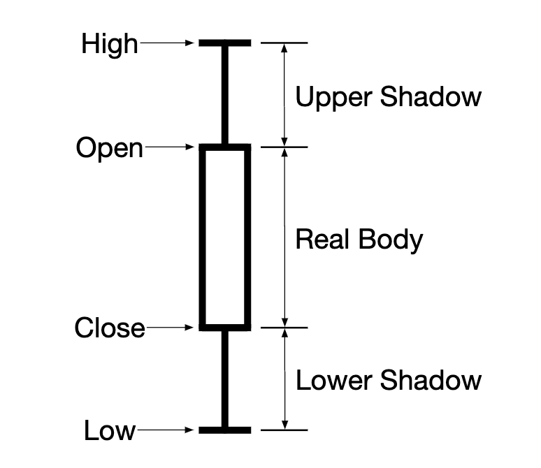
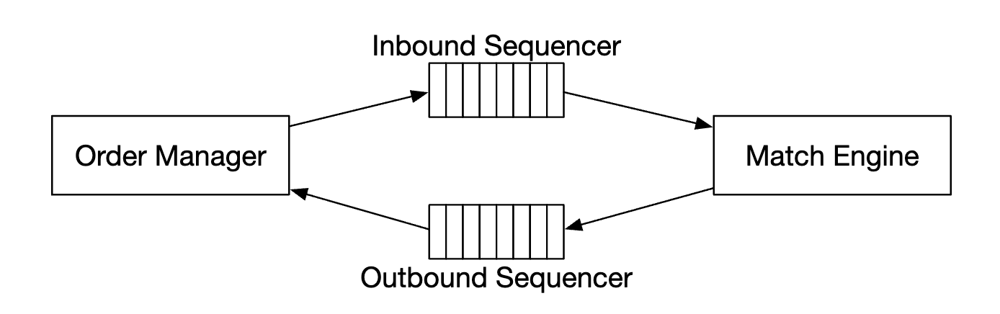
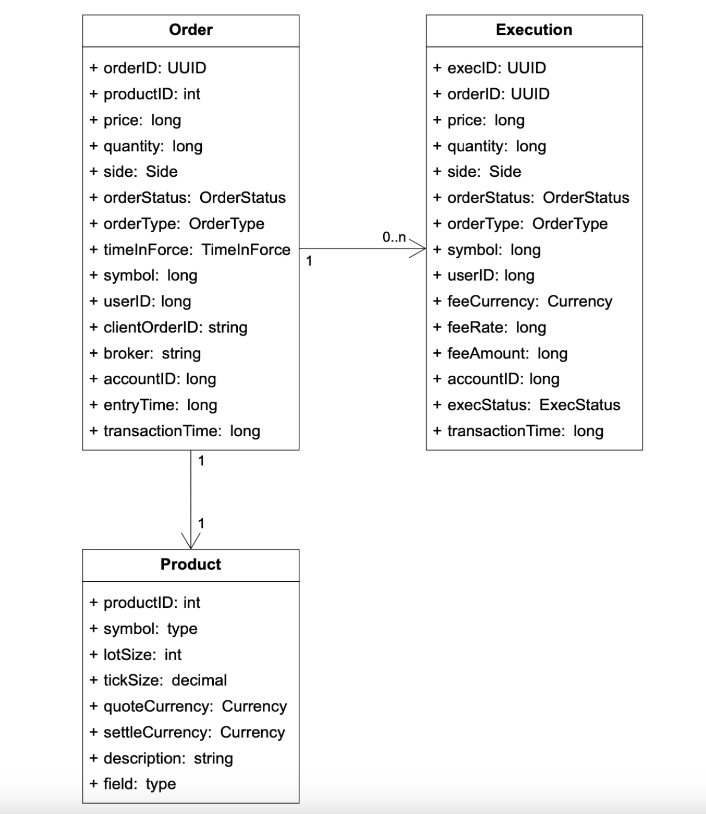
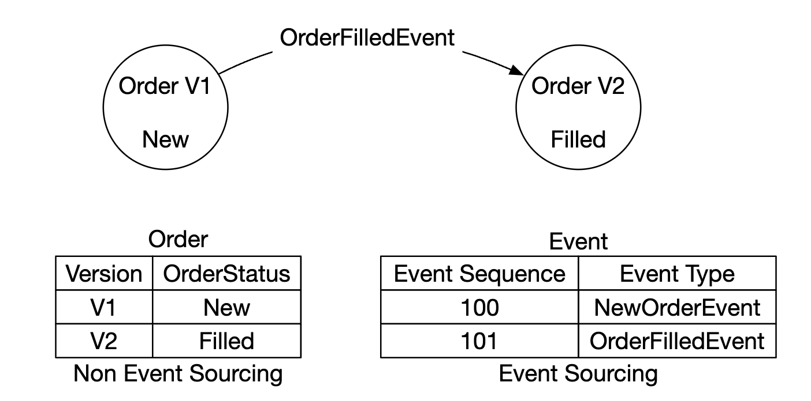
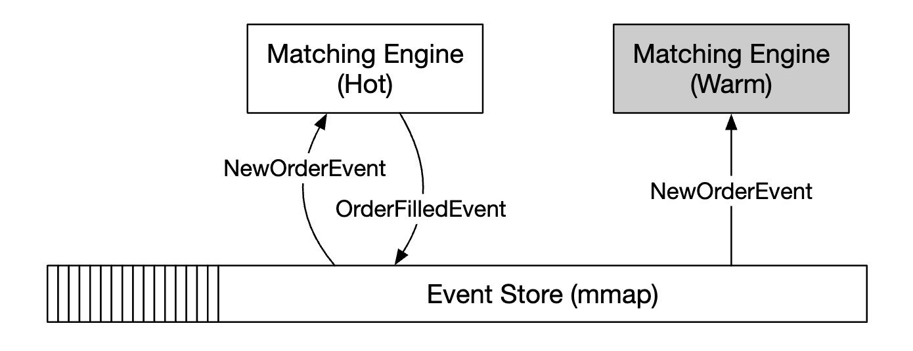
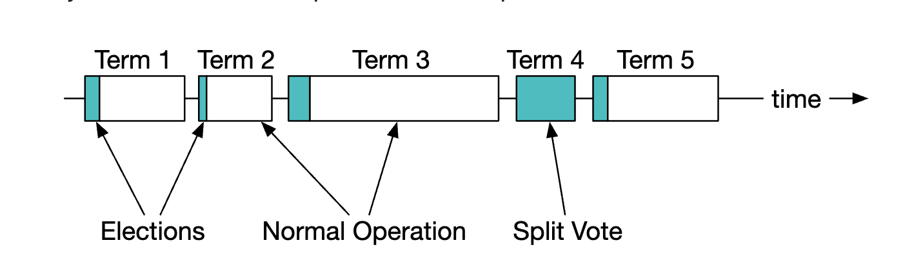

# 第 28 章：股票交易所

> 原章节：Stock Exchange · 原项目路径 `28. Stock Exchange/`

## 本章导读

你挂了一个委托：以 100 元买入 1 手某只股票。三毫秒后，成交回报回来了。

在这三毫秒里，系统做了这些事：验证你的身份、检查你的资金够不够、检查这笔单子有没有超过风控限额、把它送进撮合引擎、在几十万个等待中的订单里找到对手方、生成两笔成交记录（你一笔、对手一笔）、把结果推给你和对手、同时更新行情、写入报送库——而且**全球有成千上万的人在同一时刻做同样的事**，价格在不停地跳。

本章的核心问题是：**一个每秒要处理几十万笔订单、要求微秒级响应、且绝对不能算错的系统，应该怎么设计？**

答案会有些反直觉：现代交易所的关键组件，往往**不是**跑在几百台机器上的分布式集群，而是**跑在一台机器、甚至一个 CPU 核上**。为什么？这就是本章要讲清楚的事。

## 你将学到

- 交易所的业务基础：限价单 / 市价单、买价 / 卖价、L1/L2/L3 行情分级、K 线图、FIX 协议
- 交易所的三条数据流：交易流（关键路径）、行情数据流、报送流，以及它们的延迟要求为什么完全不同
- 撮合引擎（Matching Engine）与订单簿（Order Book）的数据结构：为什么用红黑树 / 跳表而不是普通数组
- 价格优先、时间优先的撮合规则，连续竞价与集合竞价的区别，以及部分成交（partial fill）怎么处理
- 为什么不能用普通数据库做撮合：磁盘 IO、锁竞争、GC 都会制造尾延迟毛刺
- 为什么撮合引擎必须是**确定性的（deterministic）**，以及怎么做到
- 高可用方案：主备（Primary-Standby）、热备 + 输入日志重放、序列号保证不丢不重
- 为什么交易所不用 Raft/Paxos 来做撮合，而是用主备 + 日志复制
- 机房托管（Colocation）与公平性、行情组播（Multicast）分发、风控（Risk Check）在链路中的位置

---

## 1. 需求澄清与非功能需求

<div align="center"></div>

本章要设计的是一个**电子股票交易所（Electronic Stock Exchange）**，基本职能是**高效地撮合买方和卖方**。现实中的代表是纽约证券交易所（NYSE）和纳斯达克（NASDAQ）。

### 先问清楚边界

| 问题 | 结论 |
|---|---|
| 交易哪些证券？ | **只做股票**（简化起见） |
| 支持哪些订单类型？ | 支持**下单**和**撤单**；订单类型**只考虑限价单（limit order）** |
| 支持盘后交易吗？ | 不支持，只做正常交易时段 |
| 基本功能是什么？ | 客户端可以下单/撤单，**实时**收到成交回报，并且能**实时**看到订单簿 |
| 规模多大？ | 同时**数万**用户交易、约 **100** 个标的、**每天数十亿笔订单**；还需要**风控（risk check）** |
| 风控具体指什么？ | 简化处理，比如**限制一个用户一天最多交易 100 万股苹果股票** |
| 资金怎么处理？ | 下单前要确认客户**资金充足**；**挂单占用的资金要冻结，直到订单终结** |

### 非功能需求

原文列了四条，我们逐条展开，并说明它们对架构的影响：

| 需求 | 指标 | 对架构的影响 |
|---|---|---|
| **可用性（Availability）** | 至少 **99.99%**。宕机会损害声誉 | 关键组件必须有备份，故障转移要快 |
| **容错（Fault tolerance）** | 需要容错和**快速恢复机制**，把生产事故的影响控制住 | 主备复制 + 快速切换 + 演练 |
| **延迟（Latency）** | 往返延迟在**毫秒级**，重点关注 **99 分位（p99）** | 关键路径必须极简；关注**尾延迟**而不是平均值 |
| **安全（Security）** | 账户管理系统；合规上要支持 **KYC（Know Your Customer，了解你的客户）**；公开资源要防 **DDoS** | 引入网关鉴权、限流、公私隔离 |

> **注意"关注 99 分位"这句话。**
> 原文说得很准："Persistently high 99p latency causes bad experience for a handful of users."（持续偏高的 p99 延迟会让少数用户体验很差。）
> **为什么交易所关心 p99 而不是平均值？** 因为交易是**对时间极度敏感**的。如果你的平均延迟是 50 微秒，但每 100 笔里有 1 笔要 10 毫秒，那这 1% 的人就是在**用旧价格成交**——对他们来说这是真金白银的损失。所以交易系统优化的是**尾延迟（Tail Latency）**，不是平均延迟。
> 这也是本章反复出现的主题：**平均值掩盖问题，尾部才暴露问题。**

### 关于延迟指标的澄清

原文在非功能需求里写"往返延迟在毫秒级"，但后面深入设计里又说"我们想达到**几十微秒**"（tens of microseconds）。这两处看似矛盾，其实是**不同范围**的指标：

- **毫秒级**：整个系统的**端到端**往返（客户端 → 网关 → 风控 → 撮合 → 回报 → 客户端），包含网络、序列化、队列等多个环节。
- **几十微秒**：**撮合引擎内部**处理一笔订单的时间（内存里的订单簿操作）。

**现代主流交易所的撮合引擎内部延迟通常在微秒级**，而端到端（含托管机房内网络）在几十微秒到亚毫秒级。理解这个区分很重要——面试时如果你把"撮合 10 微秒"和"端到端 10 微秒"混为一谈，会露怯。

---

## 2. 量级估算

原文的估算过程：

- **100 个标的，每天 10 亿笔订单**；
- **正常交易时段 09:30 ~ 16:00，共 6.5 小时**；
- **QPS = 10 亿 / 6.5 / 3600 = 43,000**；
- **峰值 QPS = 5 × QPS = 215,000**；
- **开盘时交易量显著高于其他时段**。

我们验算一遍：

```
每天交易秒数 = 6.5 × 3600 = 23,400 秒
平均 QPS     = 1,000,000,000 / 23,400 ≈ 42,735 ≈ 43,000   ✓
峰值 QPS     = 43,000 × 5 = 215,000                        ✓
```

数字是对的。原文特别强调"**开盘时交易量显著更高**"，这是市场的真实特征：**开盘和收盘时段订单量会爆发**，因为大量策略在开盘时集中下单。所以"峰值 = 平均值 × 5"这个 5 倍系数是必要的——**任何按平均值做容量规划的系统，都会在开盘那一刻崩掉。**

> **再往下拆一层：这些订单怎么分布到 100 个标的上？**
> 如果均匀分布，每个标的的峰值 QPS = `215,000 / 100 = 2,150`。但现实中**绝不均匀**——最热门的几个标的（比如苹果、特斯拉）会占据绝大部分订单量，冷门标的可能一整天只有几笔。这就是**热点问题**，它直接决定了撮合引擎要不要按标的做**并行化**（详见第 9 节）。

> **单核能扛 21.5 万 QPS 吗？**
> 能，而且绰绰有余。一个精心优化的**单线程**撮合引擎，每秒处理**数百万笔**订单是现实可达的（LMAX 的 Disruptor 架构就公开宣称单线程可达每秒数百万笔订单量级）。**这正是本章"单线程撮合"方案成立的根本原因**——现代 CPU 快到你不需要多线程，就能处理一个交易所的订单流。
> 这个数字很关键：**它不是"理论上够用"，而是"有大量余量"**。所以单线程带来的确定性收益，远远超过了它放弃的并行度。

---

## 3. 业务基础：订单、报价与行情分级

在讲架构之前，得先懂业务。原文用了一节 "Business Knowledge 101"，我们完整保留并补充。

### 经纪商（Broker）

**经纪商**是交易所和终端用户之间的中介，比如 Robinhood、Fidelity。散户不直接连交易所，而是通过经纪商下单。

**机构客户（Institutional clients）** 用专门的交易软件进行**大额交易**，需要特殊处理。原文举的例子是：**在大额交易时做订单拆分（order splitting），避免冲击市场**。

> **为什么大单要拆？**
> 假设你想买 100 万股。如果你一次挂出去，会瞬间吃掉订单簿上所有卖单，把价格从 100 元一路推到 105 元——**你自己把价格买贵了**。这就是**市场冲击成本（market impact）**。所以机构会把大单拆成很多小单，在一段时间内慢慢成交。这是一个经典的**算法交易（Algorithmic Trading）**问题，也是交易所需要支持"机构客户"这条业务线的原因。

### 订单类型

| 类型 | 含义 | 特点 |
|---|---|---|
| **限价单（Limit Order）** | 以**指定价格**买入或卖出 | 可能**立刻成交**、可能**部分成交**、也可能**一直挂着不成交** |
| **市价单（Market Order）** | **不指定价格**，按当前市场价**立即执行** | 一定成交，但成交价不确定（可能很差） |

原文明确说：**我们的设计只支持限价单。**

### 价格

| 术语 | 含义 |
|---|---|
| **买价（Bid）** | 买方**愿意出的最高价** |
| **卖价（Ask）** | 卖方**愿意接受的最低价** |

**买价 < 卖价** 时，市场存在**价差（Spread）**，即 `Ask - Bid`。一旦 **买价 ≥ 卖价**，就发生了**交叉（cross）**，可以撮合成交。

> **价差是市场的"流动性"指标**：价差越小，说明买卖双方越接近，交易成本越低；价差越大，说明流动性差，你想成交就得接受更差的价格。

### 行情分级：L1 / L2 / L3

美国市场把报价数据分为三个层级。原文说"美国市场有三个层级"，我们补充说明：**这套分级其实是行业通用约定，不是美国独有。**

**L1：最优买卖价和数量**

<div align="center"></div>

L1 只包含**最优买价、最优卖价**以及它们各自的数量。这是最基础、数据量最小的一级。

**L2：更多价格档位**

<div align="center"></div>

L2 包含**多个价格档位**的**聚合**买卖量（比如"买一到买十"、"卖一到卖十"），但不显示每一档里具体是哪些订单。

**L3：每个档位的排队明细**

<div align="center"></div>

L3 展示每个档位的**档位信息和排队数量**——也就是**逐笔订单（order-by-order）**的明细。数据量最大，通常只有交易所会员才能拿到。

> **这三级的区别可以用一句话概括**：**L1 看价格，L2 看深度，L3 看排队。**
> 想判断"我这一单挂进去要排多久才能成交"，你需要 L3——因为只有 L3 能告诉你前面排了多少手。

### K 线图（Candlestick）

K 线图展示**给定时间区间**内的**开盘价（open）、收盘价（close）、最高价（high）、最低价（low）**：

<div align="center"></div>

> **K 线的本质是"降采样"**：原始数据是每一笔成交，K 线是把一段时间（比如 1 分钟）的所有成交**聚合成 4 个数字**。这样既能大幅压缩数据量，又保留了最重要的信息。代价是**丢失了区间内的细节**——你只知道这一分钟最高到过 105 元，但不知道是第几秒到的。

### FIX 协议

**FIX（Financial Information eXchange）** 是证券交易信息交换的**标准协议**，绝大多数厂商都在用。原文给了一个示例报文：

```
8=FIX.4.2 | 9=176 | 35=8 | 49=PHLX | 56=PERS | 52=20071123-05:30:00.000 | 11=ATOMNOCCC9990900 | 20=3 | 150=E | 39=E | 55=MSFT | 167=CS | 54=1 | 38=15 | 40=2 | 44=15 | 58=PHLX EQUITY TESTING | 59=0 | 47=C | 32=0 | 31=0 | 151=15 | 14=0 | 6=0 | 10=128 |
```

这个格式叫 **Tag=Value**（标签=值）：每个字段由**标签号**和**值**组成，用 `|`（实际协议里是 `\x01`）分隔。几个关键标签：

| 标签 | 含义 | 本例中的值 |
|---|---|---|
| `8` | 协议版本 | FIX.4.2 |
| `35` | 消息类型 | 8（执行报告 Execution Report） |
| `55` | 标的代码 | MSFT（微软） |
| `54` | 买卖方向 | 1（买入） |
| `38` | 订单数量 | 15 |
| `40` | 订单类型 | 2（限价单） |
| `44` | 价格 | 15 |

> **为什么用 Tag=Value 这种"啰嗦"的格式？**
> 因为它是**自描述、可扩展**的——新增字段只要加一个新标签号，老系统会自动忽略不认识的标签。**代价是冗余**：每条消息都要带标签号，报文比二进制协议大得多，解析也更慢。
> 所以在本章的设计里，**FIX 用在客户端网关和经纪商之间**（外部接口，兼容性优先），而**交易所内部组件之间用自定义的二进制协议**（内部接口，性能优先）。这个"**外部用标准、内部用极致**"的分层思路，是高性能系统的常见做法。

---

## 4. 高层设计：三条数据流

<div align="center"></div>

交易所里有**三条数据流**，它们的延迟要求**完全不同**：

### 交易流（Trading flow）—— 关键路径

1. 客户端通过交易界面下单；
2. **经纪商（Broker）** 把订单发到交易所；
3. 订单通过**客户端网关（Client Gateway）** 进入交易所——网关负责**校验、限流、鉴权**等，然后把订单转发给**订单管理器（Order Manager）**；
4. 订单管理器根据**风控管理器（Risk Manager）** 设定的规则执行**风控检查**；
5. 通过风控后，订单管理器**核实钱包里的资金是否充足**；
6. 订单被送到**撮合引擎（Matching Engine）**。找到匹配时，撮合引擎**发出两笔成交（execution，也叫 fill）**——买方一笔、卖方一笔。两笔订单都会被**定序（sequenced）**，以保证**确定性**；
7. 成交回报返回给客户端。

### 行情数据流（Market data flow，M1–M3）

- 撮合引擎产生一个**成交流（stream of executions）**，发给**行情发布器（Market Data Publisher）**；
- 行情发布器**构建 K 线图**，发给**数据服务（Data Service）**；
- 行情数据被存进**专门的存储**用于实时分析。经纪商连接数据服务获取及时的行情。

### 报送流（Reporter flow，R1–R2）

- **报送器（Reporter）** 从订单和成交里收集所有必要的报送字段，写入数据库；
- 报送字段包括：`client_id`、`price`、`quantity`、`order_type`、`filled_quantity`、`remaining_quantity`。

### 关键区别：只有交易流在关键路径上

原文的原话："Trading flow is on the critical path, whereas the rest of the flows are not, hence, latency requirements differ between them."

**这是理解整章架构的钥匙。** 三条流的诉求完全不同：

| 数据流 | 延迟要求 | 优先级 | 为什么 |
|---|---|---|---|
| **交易流** | **微秒级** | 极致的性能 | 每一微秒都直接影响成交价格和公平性 |
| **行情数据流** | 毫秒级（近实时） | 及时 + 公平 | 所有订阅者必须**同时**收到（见第 15 节） |
| **报送流** | **不敏感** | **准确性 + 合规性** | 用于交易历史、税务、合规、清算，晚几秒甚至几分钟都无所谓 |

> **"不是所有东西都要优化"是系统设计中最重要的判断力之一。**
> 初学者常犯的错误是：听说"交易所要微秒级"，就把报送、监控、日志全都按微秒级要求去做——结果是把复杂度推到了极限，收益却为零。
> **正确的做法是：先画清楚哪条路径是关键的，然后对关键路径做到极致，对非关键路径做到"够用、正确、可维护"**。原文把报送流从关键路径上**剥离**出去，这个动作本身就是最重要的设计决策之一。

---

## 5. 交易链路深入：撮合引擎、定序器、订单管理器、客户端网关

原文说："The trading flow is on the critical path, hence, it should be highly optimized for low latency." 我们来逐个拆解关键路径上的四个组件。

### 5.1 撮合引擎（Matching Engine）

撮合引擎是交易链路的**心脏**，也叫**交叉引擎（Cross Engine）**。它的主要职责（原文）：

1. **为每个标的维护订单簿（Order Book）**——一个标的的买单和卖单列表；
2. **撮合买单和卖单**——一次撮合产生**两笔成交（fills）**，买卖双方各一笔。这个功能必须**又快又准**；
3. **把成交流分发出去**作为行情数据；
4. **撮合必须以确定性的顺序产生**——这是**高可用性的基础**。

### 5.2 定序器（Sequencer）

<div align="center"></div>

**定序器是让撮合引擎变得确定性的关键组件。** 它给每一个**入站订单（inbound order）**和每一个**出站成交（outbound fill）**打上**序列号（sequence ID）**。

原文列了打序列号的三个原因：

| 原因 | 说明 |
|---|---|
| **及时性与公平性（timeliness and fairness）** | "谁先到"必须有一个**客观、唯一**的判定标准 |
| **快速恢复/重放（fast recovery / replay）** | 备份节点只要按同样的序列号重放输入，就能得到完全相同的状态 |
| **精确一次（exactly-once）保证** | 靠序列号去重，保证不丢不重 |

原文还提到："概念上我们可以用 Kafka 做定序器，因为它本质上就是一个入站和出站的消息队列。**但我们会自己实现它，以达到更低的延迟。**"

> **为什么 Kafka 不行？**
> Kafka 的延迟在**毫秒级**（因为要批量攒消息、可能还要 `fsync` 落盘、经过网络往返）。而我们要的是**微秒级**。差了三到四个数量级，完全不是一个量级的东西。
> **这不是说 Kafka 不好**，而是说它被设计来解决**吞吐量和持久性**问题，而不是**极限延迟**问题。定序器需要的是"**在同一个进程/同一台机器内，用一个单调递增的计数器给消息编号**"——这件事根本不需要一个分布式消息队列来做。

> **序列号为什么是"精确一次"的基础？**
> 因为网络会重传。同一条订单可能被送达两次。接收方只要检查"这个序列号我处理过没有"，就能安全地去重。**没有序列号，重传就会变成重复下单**——这和我们第 27 章讲的**幂等性**是同一个问题，只是解法从"事务 ID"换成了"单调递增序列号"。

### 5.3 订单管理器（Order Manager）

订单管理器管理**订单状态**，并与撮合引擎交互（发订单、收成交）。它的职责（原文）：

1. **把订单送去风控检查**——比如核实用户的交易量是否小于 100 万股；
2. **对照用户钱包检查订单**，确认资金足够执行；
3. **把订单发给定序器**，再传给撮合引擎。**为了减少带宽，只把必要的订单信息传给撮合引擎**；
4. **从定序器收回成交（fills）**，再通过客户端网关发给经纪商。

原文指出："实现订单管理器的主要挑战是**状态转换管理（state transition management）**。**事件溯源**是一个可行的方案（详见深入设计）。"

### 5.4 客户端网关（Client Gateway）

<div align="center"></div>

客户端网关接收用户订单，发给订单管理器。原文强调：**"因为客户端网关在关键路径上，它应该保持轻量（lightweight）。"**

可以有**多个客户端网关**服务不同的客户端。原文举了一个例子：**colo engine（托管引擎）** 是经纪商在交易所数据中心里**租用**的交易引擎服务器：

<div align="center"></div>

> **"保持轻量"意味着什么？**
> 意味着网关**不能**做这些事：写数据库、调用外部服务、做复杂的业务逻辑、打日志到磁盘。它只能做：解析协议、鉴权、限流、转发。
> **任何一个"顺手加一下"的功能，都会变成关键路径上的延迟。** 这是高性能系统设计的一条铁律：**关键路径上的每一个操作，都必须能证明它值得那一微秒。**

### 5.5 风控（Risk Check）在链路中的位置

这是本章一个非常重要、也非常容易答错的考点。原文的流程里，风控出现在**订单管理器的第 1 步**，也就是**在订单被送进撮合引擎之前**。

**风控必须在撮合之前。为什么？**

因为撮合的**结果是不可逆的**。一旦两笔订单匹配成功，那就是一个**已经发生的成交**——你不能因为事后发现"这个用户资金不够"就把成交撤销掉。撤销一笔已经成交的交易，意味着要**回溯修改双方的持仓和资金**，还会牵涉到已经推送出去的行情数据。这在真实市场里是**不可接受的**（会造成市场混乱和法律责任）。

所以顺序必须是：

```
下单 → 网关鉴权/限流 → 风控检查 → 资金/持仓检查 → 定序 → 撮合 → 成交
                          ↑
                    必须在撮合之前！
```

**风控检查什么？** 原文只给了简化版（限制单日交易量），我们把真实交易所的风控维度补齐：

| 检查项 | 说明 |
|---|---|
| **资金/持仓充足性** | 买单要冻结资金，卖单要冻结持仓（原文特别提到："Funds meant for pending orders need to be withheld until order is finalized."） |
| **单日交易量限额** | 原文的例子：一个用户一天最多交易 100 万股 |
| **单笔数量上限（fat-finger check）** | 防止误操作——比如手抖多敲了两个零，挂出 100 万手 |
| **涨跌停 / 价格带（price band）** | 报价不能超出当日涨跌幅限制，或超出参考价的某个百分比 |
| **自成交防范（Self-Trade Prevention）** | 防止同一个账户的买单和卖单互相成交（这可能是操纵市场或系统 bug） |
| **订单频率限制（rate limit）** | 防止单个客户端用海量订单压垮系统（这本身就是一种攻击） |
| **账户状态** | 账户是否被冻结、是否已完成 KYC |

> **一句话记住**：**风控在撮合之前，因为撮合不可逆。** 这是一个"**防止错误进入系统**"（pre-trade risk）的设计，而不是"**事后纠正错误**"（post-trade）的设计。
> 面试时如果被问到"风控应该放在哪里"，答"撮合之前"并解释"撮合结果不可逆"，是一个非常有力的回答。

---

## 6. 行情数据流与报送流

### 行情数据流

<div align="center"></div>

**行情发布器（Market Data Publisher）** 从撮合引擎接收成交，并**基于成交流构建订单簿和 K 线图**。这些数据被发送给**数据服务（Data Service）**，由它负责把**聚合后的数据**展示给订阅者。

**关键点：行情发布器不参与撮合。** 它只是**消费**撮合的结果，重新构建出对外的视图。这个解耦很重要——**行情系统出问题，不应该影响交易**。

### 报送流

<div align="center"></div>

**报送器（Reporter）不在关键路径上，但依然是一个重要组件。** 它负责：**交易历史、税务报送、合规报送、清算（settlements）** 等。

原文强调："**延迟对报送流不是关键要求。准确性和合规性才更重要。**"

> **这是一个非常好的"分层"示例。**
> 交易流追求**速度**，报送流追求**准确和合规**。它们的**优化目标相反**——为了速度，关键路径上会砍掉所有非必要操作（包括日志）；为了合规，报送流必须完整记录每一个字段，一条都不能少。
> **如果一个团队用同一套标准去要求这两条流，结果一定是两头都做不好。**

---

## 7. API 设计

客户端通过经纪商与交易所交互：下单、查看成交、获取行情、下载历史数据等。

原文的协议选择：**客户端网关与经纪商之间用 RESTful API**；**对机构客户使用专有协议（proprietary protocol）**，以满足他们的低延迟要求。

> **补充：为什么机构要用专有协议？**
> REST/HTTP + JSON 的开销在低延迟场景里是显著的：HTTP 头部冗长、文本解析慢、连接管理复杂。所以延迟敏感的机构客户通常使用 **FIX** 或**自定义二进制协议**，并配合**持久连接（persistent connection）**和**二进制编码**。
> **REST 适合散户**（易用、生态好、频率低），**二进制协议适合机构**（快、但开发成本高）。这是一个典型的"**按客户分层**"的设计。

### 创建订单

```
POST /v1/order
```

**参数：**

| 参数 | 类型 | 说明 |
|---|---|---|
| `symbol` | String | 股票代码 |
| `side` | String | 买或卖 |
| `price` | Long | 限价单的价格 |
| `orderType` | String | limit 或 market（本设计只支持 limit） |
| `quantity` | Long | 订单数量 |

**响应：**

| 字段 | 类型 | 说明 |
|---|---|---|
| `id` | Long | 订单 ID |
| `creationTime` | Long | 订单的系统创建时间 |
| `filledQuantity` | Long | 已成功成交的数量 |
| `remainingQuantity` | Long | 尚未成交的数量 |
| `status` | String | new / canceled / filled |
| 其余字段 | — | 与请求参数相同 |

> **注意 `price` 和 `quantity` 用的是 `Long` 而不是 `Double`**——这和上一章"金额不要用浮点数"是同一条原则：**钱的精度不能丢**。价格通常用**整数最小变动单位（tick）**表示，比如"价格 100.25 元"存成 `10025`（单位为分）。

### 查询成交

```
GET /execution?symbol={:symbol}&orderId={:orderId}&startTime={:startTime}&endTime={:endTime}
```

**参数：** `symbol`（股票代码）、`orderId`（可选）、`startTime` / `endTime`（epoch 时间戳）。

**响应：** `executions` 数组，每个元素包含 `id`、`orderId`、`symbol`、`side`、`price`、`orderType`、`quantity`（成交数量）。

### 查询订单簿

```
GET /marketdata/orderBook/L2?symbol={:symbol}&depth={:depth}
```

**参数：** `symbol`（股票代码）、`depth`（每一侧的档位深度）。

**响应：** `bids`（价格和数量的数组）、`asks`（价格和数量的数组）。

### 查询 K 线

```
GET /marketdata/candles?symbol={:symbol}&resolution={:resolution}&startTime={:startTime}&endTime={:endTime}
```

**参数：** `symbol`、`resolution`（K 线的窗口长度，单位秒）、`startTime` / `endTime`。

**响应：** `candles` 数组，每个元素包含 `open`、`close`、`high`、`low`。

---

## 8. 数据模型：订单簿与 K 线图

交易所里有三类主要数据（原文）：**产品/订单/成交**、**订单簿**、**K 线图**。

### 8.1 产品、订单、成交

**产品（Product）** 描述一个交易标的的属性——产品类型、交易代码、UI 显示代码等。这类数据**不常变**，主要用于 UI 渲染。

**订单（Order）** 是买卖指令；**成交（Execution）** 是撮合产生的输出结果。

<div align="center"></div>

原文指出，订单和成交会出现在**全部三条流**里，但用途不同：

| 数据流 | 处理方式 |
|---|---|
| **关键路径** | 在**内存中**处理以获得高性能；状态**从定序器存储和恢复** |
| **报送流** | 报送器把订单和成交**写入数据库**，供报送使用 |
| **行情数据** | 成交被转发给行情系统，用来**重建订单簿和 K 线图** |

### 8.2 订单簿（Order Book）

**订单簿是一个标的的买卖订单列表，按价格档位组织。**

原文列出了一个高效的数据结构需要满足的条件：

1. **常数级查找时间**——获取某个价格档位的量，或价格档位之间的量；
2. **快速的增 / 成交 / 撤操作**；
3. **查询最优买价 / 卖价**；
4. **能遍历价格档位**。

**订单簿的执行示例：**

<div align="center"></div>

原文的说明："在满足这个大单之后，价格上升，因为买卖价差扩大了。"

**原文的伪代码实现：**

```java
class PriceLevel {
    private Price limitPrice;
    private long totalVolume;
    private List<Order> orders;
}

class Book<Side> {
    private Side side;
    private Map<Price, PriceLevel> limitMap;
}

class OrderBook {
    private Book<Buy> buyBook;
    private Book<Sell> sellBook;
    private PriceLevel bestBid;
    private PriceLevel bestOffer;
    private Map<OrderID, Order> orderMap;
}
```

原文指出：为了更高效，可以把标准列表换成**双向链表（doubly-linked list）**：

- **下新单是 O(1)**——因为是把订单加到列表**尾部**；
- **撮合成交是 O(1)**——因为是从**头部**删除订单；
- **撤单**意味着从订单簿中删除一个订单。我们利用 `orderMap` 做 **O(1) 查找**和 **O(1) 删除**（因为 `Order` 持有对链表中前一个元素的引用）。

<div align="center"></div>

原文最后说：**这个数据结构同样被行情服务用来重建订单簿。**

#### 补充：订单簿的三个核心设计点

原文的伪代码是很好的起点，但有几个关键点需要展开，否则你会以为"一个 HashMap 就够了"。

**① 价格索引必须是"有序"结构，不能是普通哈希表**

原文的需求第 3、4 条是"**查询最优买卖价**"和"**遍历价格档位**"。而 `Map<Price, PriceLevel>`（普通哈希表）**做不到这两件事**——哈希表不维护顺序，你无法"找到比当前价格更高的下一档"。

**正确的选择是"有序映射（ordered map）"**，通常有两种实现：

| 结构 | 插入/删除 | 取最优价 | 找相邻档位 | 特点 |
|---|---|---|---|---|
| **红黑树（Red-Black Tree）** | O(log N) | O(log N)，可缓存为 O(1) | O(log N) | 最常用，如 C++ `std::map`、Java `TreeMap` |
| **跳表（Skip List）** | O(log N) 期望 | O(log N)，可缓存为 O(1) | O(log N) 期望 | 实现更简单，并发友好，Redis 的 ZSet 就用它 |
| **普通数组** | O(N)（中间插入/删除要搬元素） | O(1)（如果按价格索引） | O(1) | 只在**价格范围有限且固定**时可用 |
| **普通哈希表** | O(1) | **做不到** | **做不到** | 无法按价格排序，不能单独使用 |

**"为什么不用普通数组？"** 因为订单簿的价格档位是**动态增删**的：

- 用**线性数组**存价格档位，插入一个新价位需要 O(N) 搬移元素；
- 而且**价格范围可能很大**（比如股票价格从 1 元到 1000 元，按 0.01 元的 tick 就有 99,900 个可能的价位），用数组直接按价格索引会浪费大量空间。

**但有一个重要的例外**：如果**价格范围有限且 tick 固定**（很多交易所确实如此），那么用**数组按 tick 索引**是**最快的**——O(1) 定位到价格档位。这是真实撮合引擎里常见的优化：**用数组换空间，把 O(log N) 变成 O(1)**。

**② 时间优先靠"价格档位内的 FIFO 队列"**

订单簿的排序规则是**价格优先、时间优先（Price-Time Priority）**：

- **价格优先**：买单出价高的优先成交，卖单要价低的优先成交；
- **同一价格**：**先到的先成交**（FIFO）。

所以每个**价格档位**内部，需要一个**FIFO 队列**。用**双向链表**实现最合适：

- **入队（新挂单）**：加到**尾部**，O(1)；
- **出队（成交）**：从**头部**取出，O(1)；
- **任意位置删除（撤单）**：靠 `orderMap` 直接拿到节点，利用链表节点的前后指针 O(1) 删除。

**这就是原文说的"双向链表"的真正价值**——它同时满足了"FIFO 语义"和"O(1) 任意删除"。

**③ 为什么买卖两侧的排序方向相反？**

- **买单（bids）按价格降序**：最高的买价排在最前面，因为它是**最优先成交的买单**；
- **卖单（asks）按价格升序**：最低的卖价排在最前面，因为它是**最优先成交的卖单**。

所以订单簿的"顶部"（best bid / best ask）永远是**双方各自最优的报价**。**当 best bid ≥ best ask 时，就发生了交叉，可以撮合。**

### 8.3 K 线图

K 线数据在行情服务里，基于一个时间区间内的订单处理计算得出：

```java
class Candlestick {
    private long openPrice;
    private long closePrice;
    private long highPrice;
    private long lowPrice;
    private long volume;
    private long timestamp;
    private int interval;
}

class CandlestickChart {
    private LinkedList<Candlestick> sticks;
}
```

原文列了两个避免占用过多内存的优化：

- **使用预分配的环形缓冲区（ring buffer）来存放 K 线**，减少内存分配次数；
- **限制内存中的 K 线数量，其余的持久化到磁盘**。

原文还说：**我们会用内存列式数据库（比如 KDB）做实时分析；收盘之后，数据持久化到历史数据库。**

> **为什么用"列式数据库"？**
> 因为行情分析是典型的**分析型（OLAP）**负载：你要算"过去 20 天的平均成交量"，这需要扫描**一整列**数据。**列式存储把同一列的数据连续存放**，扫描时缓存命中率高、压缩率高（同一列的数据类型相同、相似度高）。而传统的行式数据库（MySQL）适合"查某一行"，不适合"扫某一列"。**KDB 就是金融行业最著名的列式时序数据库。**

---

## 9. 深入设计：为什么把一切塞进一台服务器

原文开篇的一句话，是整章的题眼：

> "One interesting thing to be aware of about modern exchanges is that unlike most other software, they typically run everything on one gigantic server."

**现代交易所和大多数软件不同——它们通常把一切都跑在一台巨大的服务器上。**

这句话乍听很反直觉：我们前面 27 章都在讲**分布式、水平扩展、分片、多副本**，怎么到了交易所反而要"一台机器"？

原文接下来解释了原因。

### 9.1 性能：目标是把延迟从毫秒压到微秒

原文说："For an exchange, it is very important to have good overall latency for all percentiles."（对交易所来说，**所有分位**的延迟都要好，这一点非常重要。）注意"all percentiles"——又是**尾延迟**。

**怎么降低延迟？原文给了两条路：**

1. **减少关键路径上的任务数量**；
2. **缩短每个任务的时间**——减少网络/磁盘使用，或缩短任务执行时间。

原文说，为了达到第一个目标，**关键路径被剥掉了所有无关职责——连日志（logging）都被移除了**，以换取最优延迟。

**如果用前面的"分布式"设计会怎样？** 原文指出会有几个瓶颈：

- **服务之间的网络延迟**；
- **定序器的磁盘使用**。

**结果是：端到端延迟只能做到几十毫秒。而我们的目标是几十微秒。**

于是——**把一切都放在一台服务器上，进程之间通过 `mmap` 作为事件存储来通信**：

<div align="center"></div>

> **这一步是本章最重要的架构决策。**
> 把跨进程的**网络调用**换成同机内的**内存映射文件读写**，省掉的不是"一点点时间"，而是**整个网络协议栈**：序列化/反序列化、TCP 握手、内核缓冲区拷贝、网卡中断、路由跳数……这些加起来通常在**几十到几百微秒**，正好是我们要省掉的那个数量级。
> 代价是**丧失了水平扩展能力**——单机有 CPU 核数、内存、PCIe 带宽的物理上限。但对交易所来说这个取舍是划算的，因为：**单个交易所的订单流，现代单机是能扛住的**（见第 2 节的估算）。

### 9.2 应用循环（Application Loop）

**另一个优化是使用应用循环（application loop）**——一个**执行关键任务的 while 循环**，**绑定（pin）在同一个 CPU 上，以避免上下文切换**：

<div align="center"></div>

原文还指出应用循环的另一个副作用：**没有锁竞争（lock contention）**——不会有多个线程争抢同一个资源。

> **什么是"绑定 CPU（CPU pinning）"？**
> 操作系统默认会让线程在多个 CPU 核之间迁移，以均衡负载。但**迁移本身有成本**：缓存会失效（新核的 L1/L2 缓存里没有你的数据）、有调度延迟。
> **把关键线程绑定到固定核**，就能让它一直享受**热缓存**，且不被调度器打断。在极限延迟场景里，工程师甚至会：
> - 用**忙等（busy-spin）**代替休眠，避免唤醒延迟；
> - **关闭 CPU 的省电状态（C-states）**，避免频率切换带来的抖动；
> - 用**大页（Huge Pages）**减少 TLB miss。
>
> **这些优化听起来极端，但在微秒级场景里每一项都是必要的**——因为一次缓存失效就可能带来几微秒的延迟，而我们的整个预算是几十微秒。

### 9.3 mmap 与 /dev/shm

原文解释了 mmap：**它是一个 UNIX 系统调用，把磁盘上的文件映射到应用的内存空间。**

**一个技巧**：把文件建在 **`/dev/shm`** 目录下，它代表 **"shared memory"（共享内存）**。这样**完全没有磁盘访问**。

> **`/dev/shm` 是什么？**
> 它是一个基于内存的**临时文件系统（tmpfs）**。你在里面创建的文件**只存在于内存中**，不落盘。所以对它做 mmap，读写就是**纯内存操作**，没有任何磁盘 IO。
> **但要注意代价**：`/dev/shm` 里的数据**在机器重启后会丢失**。所以在这个设计里，`/dev/shm` 只用于**进程间的高性能通信通道**（一条"内存总线"），而**真正的持久化仍然要靠定序器写入的日志**。**性能通道和持久化通道必须是两条不同的路径**——混淆这两者是危险的。

### 9.4 为什么不能用普通数据库做撮合

这是本章的高频考点，我们把原因系统化。**普通数据库（如 MySQL/PostgreSQL）在撮合场景下有三个致命的延迟来源：**

**① 磁盘 IO**

- 即使是最快的 NVMe SSD，一次随机读也要**几十微秒**，而 `fsync`（强制刷盘）要**几百微秒到几毫秒**。
- 数据库的**事务提交默认要保证持久性（D）**，也就是每次提交都要 `fsync`。**这一条就把延迟钉死在毫秒级**。
- 相比之下，**内存访问只要约 100 纳秒**——差了三到四个数量级。

**② 锁竞争（Lock Contention）**

- 数据库用**行锁 / 页锁 / 闩锁（latch）**来保证隔离性。高并发下，多个事务争抢同一行（比如同一个标的的订单簿），会**排队等待**。
- **等待时间是不可预测的**——这恰恰是**尾延迟**的最大来源。你可能 99% 的请求是 1 毫秒，但 1% 的请求要等 100 毫秒。
- 我们的撮合引擎是**单线程**的，**根本不需要锁**——没有并发就没有竞争，延迟完全可预测。

**③ 垃圾回收（GC）**

- 如果撮合引擎用 Java/C# 这类带 GC 的语言，**GC 停顿（GC pause）会造成延迟毛刺**——一次 Full GC 可能是几十到几百毫秒。
- 原文在"确定性"一节特别提到了这一点："Things which can cause latency spikes are garbage collector events in eg Java."
- **对策**：要么用**无 GC 的语言**（C++、Rust），要么用**零分配（allocation-free）的设计**——预分配所有对象、用环形缓冲区复用内存、避免在关键路径上创建临时对象。**LMAX 的 Disruptor 就是"用 Java 但做到零分配"的经典案例。**

**④ 还有：SQL 解析、查询计划、MVCC、连接管理**

- 一条 SQL 从收到到执行，要经过**词法分析、语法分析、查询优化、生成执行计划**——这些开销在微秒预算里是不可接受的。
- **撮合不需要 SQL**，它需要的是**确定的内存数据结构的操作**。

**所以正确的做法是：**

| 需求 | 方案 |
|---|---|
| 撮合 | **纯内存**操作，单线程，无锁 |
| 持久化 | **顺序写日志（WAL，Write-Ahead Log）**——追加写，不用随机 IO |
| 查询历史 / 报送 | **异步**写入普通数据库，不阻塞关键路径 |

> **一句话记住**：**内存做撮合，日志做持久化，数据库做查询。** 三者职责分离，各用最适合自己的技术。
> **顺序写（append-only）为什么快？** 因为它**不需要寻道**——磁头一直往前写，即使是机械硬盘也能跑到很高的吞吐。而且日志是**不可变（immutable）**的，不需要原地更新、不需要加锁。**这是 WAL 被几乎所有数据库和高性能系统采用的根本原因。**

---

## 10. 事件溯源

原文说："Event sourcing is discussed in-depth in the digital wallet chapter. Reference it for all the details."（事件溯源在第 27 章数字钱包里深入讨论过，细节请参考那一章。）

**本章只做一个简要回顾**："In a nutshell, instead of storing current states, we store immutable state transitions."（简而言之，我们不存当前状态，而是存**不可变的状态转移**。）

<div align="center"></div>

- **左边**：传统表结构（直接存当前状态）；
- **右边**：事件溯源结构（存状态转移的事件序列）。

**这时的整体设计如下：**

<div align="center"></div>

1. **外部域通过 FIX 协议与客户端网关交互**；
2. **订单管理器接收新订单事件，校验它，加入自己的内部状态。然后订单被送到撮合核心**；
3. **如果订单被撮合，生成 `OrderFilledEvent`，通过 mmap 发出**；
4. **其他组件订阅事件存储，各自动完成自己那部分处理**。

**另一个优化**：**所有组件都持有一份订单管理器的副本，把它打包成库（library）**，以避免为管理订单而进行额外的调用。

**在这个设计里，定序器的角色发生了变化——它不再是一个事件存储，而变成了一个"单写者（single writer）"，在把事件转发给事件存储之前先给它们定序**：

<div align="center"></div>

> **为什么"所有组件持有一份订单管理器的副本"能提升性能？**
> 因为原本每次查询订单状态都要**跨进程调用**订单管理器（一次 IPC 或 mmap 读 + 序列化）。把订单管理器做成**库**，直接在**本进程内存里**读，就没有调用开销了。
> **前提是：所有副本的状态必须完全一致**——而这正是**确定性**要保证的事情（见第 13 节）。**如果状态会分叉，"每个组件持有一份副本"就会变成灾难。** 所以这个优化不是独立的技巧，而是"确定性 + 事件溯源"这个基础打牢之后才能做的上层优化。

---

## 11. 高可用与故障恢复

### 11.1 目标：99.99%

原文："We aim for 99.99% availability - only 8.64s of downtime per day."

我们验算一下：

```
99.99% 可用性 = 0.01% 不可用
每天秒数 = 86,400
每天允许宕机 = 86,400 × 0.0001 = 8.64 秒   ✓
（换算成年：31,536,000 × 0.0001 = 3,153.6 秒 ≈ 52.6 分钟/年）
```

**每天只允许宕机 8.64 秒**——这意味着**故障转移必须是自动的、秒级的**，人工干预根本来不及。

### 11.2 找出单点故障

原文说，要达到这个目标，必须找出交易所架构里的**单点故障（single point of failure）**：

1. **为关键服务（比如撮合引擎）设置备用实例，处于待命（stand-by）状态**；
2. **激进地自动化故障检测和故障转移（failover）到备用实例**。

**无状态服务**（比如客户端网关）很容易通过**加机器**来水平扩展。

**对于有状态组件**，原文给出了一个关键设计：**我们可以处理入站事件，但如果自己不是 leader，就不发布出站事件**：

<div align="center"></div>

**这个设计非常精妙，值得展开：**

- **所有副本（leader 和 standby）都消费同一份输入日志，都执行同样的撮合逻辑，都维护同样的内部状态。**
- **但只有 leader 会对外发布出站事件（成交回报、行情数据）。**
- standby 只是在**"跟着跑"**——它把自己的状态维护得和 leader 一模一样，但**对外界完全隐形**。

**为什么这样设计？** 因为当 leader 挂掉、standby 顶上的时候，**standby 的状态已经是最新的了**——它不需要"重放几个小时的日志"才能追上，它**一直就是同步的**。这就是**热备（hot standby）**。

> **注意这里的核心依赖**：standby 能"跟着跑"，前提是**它必须能精确复现 leader 的每一步**。这就是**确定性**的用武之地（第 13 节）。**如果撮合不是确定性的，standby 跑出来的状态就会和 leader 不一样，切换上去就是灾难。**

### 11.3 故障检测与跨服务器复制

原文说：**要检测主副本（primary replica）是否宕机，可以发送心跳（heartbeat）来发现它已经不可用。**

原文接着指出："This mechanism only works within the boundary of a single server."（**这个机制只在单台服务器的范围内有效。**）

**如果要扩展到多台服务器**，可以把**整台服务器**设为**热/温副本（hot/warm replica）**，在故障时切换过去。

**为了在副本之间复制事件存储，可以使用可靠 UDP（reliable UDP）来获得更快的通信。**

> **什么是"可靠 UDP"？**
> 严格说，**"可靠 UDP" 是一个自相矛盾的说法**——UDP 本身**不保证送达、不保证顺序、不保证不重复**。所谓"可靠 UDP"，是指在 UDP 之上**自己实现一套可靠性机制**（序号、确认、重传、去重），比如 **QUIC**、**RDP**，或者交易所自己定制的协议。
> **为什么不用 TCP？** 因为 TCP 的拥塞控制、重传、队头阻塞（Head-of-Line Blocking）会带来**不可预测的延迟抖动**——而在交易所场景里，**抖动（jitter）比平均延迟更致命**。所以它们宁可自己实现一套可控的重传逻辑，也不要 TCP 那套"为通用互联网设计"的机制。
> **这也是一个通用的教训**：**当通用协议的最优目标（公平、稳定、对所有人友好）和你的目标（极限低延迟、可预测）冲突时，你会被迫自己造轮子。** 这不是"重复造轮子"，而是"目标不同"。

### 11.4 容错：连温备也挂了怎么办

原文："What if even the warm instances go down? It is a low probability event but we should be ready for it."

**大型科技公司解决这个问题的方式是：把核心数据复制到多个城市的多个数据中心**，以抵御自然灾害等极端情况。

**需要考虑的问题（原文）：**

- 如果主实例挂了，**如何、何时**切换到备用实例？
- 如何在备用实例中**选出 leader**？
- 需要的**恢复时间目标（RTO，Recovery Time Objective）** 是多少？
- **哪些功能需要恢复？我们的系统能在降级状态下运行吗？**

**怎么解决（原文）：**

- 系统可能因为**一个 bug**（同时影响主实例和所有副本）而宕机——可以用**混沌工程（Chaos Engineering）** 来暴露这类边缘情况和灾难性后果；
- **在早期阶段，可以手动执行故障转移**，直到我们对系统的失败模式积累了足够的知识；
- 可以用 **leader 选举（比如 Raft）** 来决定主实例挂掉后哪个副本成为 leader。

**跨服务器复制的示例：**

<div align="center"></div>

**leader 选举的任期（term）示例：**

<div align="center"></div>

原文还提供了一个学习 Raft 的链接：https://thesecretlivesofdata.com/raft/

**最后，原文提醒还要考虑"可容忍的丢失量（loss tolerance）"**：在事情变得危急之前，我们能丢失多少数据？**这决定了我们备份数据的频率。**

**对股票交易所来说，数据丢失是不可接受的，所以我们必须频繁备份，并依赖 Raft 的复制来降低数据丢失的概率。**

> **注意："手动故障转移"听起来很落后，但它是一个成熟工程判断。**
> 原文说："Initially though, we could perform failovers manually until we gather sufficient knowledge about the system's failure modes."（**在早期，我们可以先手动做故障转移，直到我们积累了对系统失败模式的足够认知。**）
> **为什么这是对的？** 因为**自动故障转移是一把双刃剑**：如果自动化逻辑本身有 bug，它会在系统已经出问题的时候，**再补一刀**（比如误判健康的 leader 已死，把流量切到一个状态落后的 standby 上，造成数据丢失）。
> **"先手动、后自动"是一条被反复验证的工程路径**：手动操作能让你**观察真实故障的表现**，积累足够的知识之后再自动化。**在你不理解一个系统的失败模式之前，不要自动处理它的失败。**

---

## 12. 撮合算法

原文给了一段伪代码，我们完整保留并逐段解读：

```java
Context handleOrder(OrderBook orderBook, OrderEvent orderEvent) {
    if (orderEvent.getSequenceId() != nextSequence) {
        return Error(OUT_OF_ORDER, nextSequence);
    }

    if (!validateOrder(symbol, price, quantity)) {
        return ERROR(INVALID_ORDER, orderEvent);
    }

    Order order = createOrderFromEvent(orderEvent);
    switch (msgType):
        case NEW:
            return handleNew(orderBook, order);
        case CANCEL:
            return handleCancel(orderBook, order);
        default:
            return ERROR(INVALID_MSG_TYPE, msgType);
}

Context handleNew(OrderBook orderBook, Order order) {
    if (BUY.equals(order.side)) {
        return match(orderBook.sellBook, order);
    } else {
        return match(orderBook.buyBook, order);
    }
}

Context handleCancel(OrderBook orderBook, Order order) {
    if (!orderBook.orderMap.contains(order.orderId)) {
        return ERROR(CANNOT_CANCEL_ALREADY_MATCHED, order);
    }

    removeOrder(order);
    setOrderStatus(order, CANCELED);
    return SUCCESS(CANCEL_SUCCESS, order);
}

Context match(OrderBook book, Order order) {
    Quantity leavesQuantity = order.quantity - order.matchedQuantity;
    Iterator<Order> limitIter = book.limitMap.get(order.price).orders;
    while (limitIter.hasNext() && leavesQuantity > 0) {
        Quantity matched = min(limitIter.next.quantity, order.quantity);
        order.matchedQuantity += matched;
        leavesQuantity = order.quantity - order.matchedQuantity;
        remove(limitIter.next);
        generateMatchedFill();
    }
    return SUCCESS(MATCH_SUCCESS, order);
}
```

**逐段解读：**

**`handleOrder`——入口，三道关卡**

1. **序列号校验**：`if (orderEvent.getSequenceId() != nextSequence)` → 如果收到的不是**期望的下一个序列号**，直接返回 `OUT_OF_ORDER` 错误。**这是确定性的第一道保障**——订单必须严格按序号处理，不能乱序、不能跳号。
2. **订单合法性校验**：`validateOrder(symbol, price, quantity)` → 校验标的、价格、数量是否合法（比如价格是否在涨跌停范围内、数量是否为正）。
3. **按消息类型分发**：`NEW` 走下单，`CANCEL` 走撤单。

**`handleNew`——下单**

- 如果是**买单**，就去**卖盘（sellBook）**里找对手方；
- 如果是**卖单**，就去**买盘（buyBook）**里找对手方。

**注意这个逻辑**：**一个买单，撮合的对象是卖盘。** 这看起来很自然，但初学者写代码时经常搞反。

**`handleCancel`——撤单**

- 如果订单**不在** `orderMap` 里，说明它**已经被成交了**（成交时会从订单簿移除），返回 `CANNOT_CANCEL_ALREADY_MATCHED` 错误；
- 否则移除订单，状态设为 `CANCELED`。

**`match`——撮合核心**

```java
Quantity leavesQuantity = order.quantity - order.matchedQuantity;  // 剩余待成交量
Iterator<Order> limitIter = book.limitMap.get(order.price).orders; // 取该价格档位的订单队列
while (limitIter.hasNext() && leavesQuantity > 0) {
    Quantity matched = min(limitIter.next.quantity, order.quantity);
    order.matchedQuantity += matched;
    leavesQuantity = order.quantity - order.matchedQuantity;
    remove(limitIter.next);
    generateMatchedFill();
}
```

原文的说明："**This matching algorithm uses the FIFO algorithm for determining which orders at a price level to match.**"（这个撮合算法用 **FIFO** 来决定同一价格档位里先撮合哪个订单。）

**这正是"时间优先"的实现**：同一价格档位内，队列头部的订单（最早到的）优先成交。

### 补充：原文伪代码里的一处 bug

上面 `match` 函数里有一处**逻辑错误**，需要指出（详见【勘误与补充】勘误 2）：

```java
Quantity matched = min(limitIter.next.quantity, order.quantity);  // ← 这里应该是 leavesQuantity
```

**问题**：这里用的是 `order.quantity`（订单的**原始总量**），但正确的应该是 `leavesQuantity`（**剩余待成交量**）。

**为什么这是 bug？** 举个例子：订单原始数量 `order.quantity = 100`。

- 第一轮：对手方有 30 手 → `matched = min(30, 100) = 30`，`matchedQuantity = 30`，`leavesQuantity = 70`。
- 第二轮：对手方有 80 手 → 按原代码 `matched = min(80, 100) = 80`，`matchedQuantity = 30 + 80 = 110`。

**结果：订单成交了 110 手，超过了原始的 100 手——超卖！**

正确写法应该是 `min(limitIter.next.quantity, leavesQuantity)`，这样第二轮就是 `min(80, 70) = 70`，总成交恰好 100 手。

**这个 bug 在真实系统里是灾难性的**——它会凭空创造出持仓。这也提醒我们：**伪代码在面试里可以写得很简略，但你必须理解每一行的语义。**

### 补充：连续竞价（Continuous Auction）与集合竞价（Call Auction）

原文的伪代码描述的是**连续竞价**：订单**随到随撮**，来一笔处理一笔。这是交易时段内的主要模式。但真实的交易所有**两种撮合模式**，初学者容易只知其一：

| 模式 | 何时使用 | 撮合方式 | 特点 |
|---|---|---|---|
| **连续竞价（Continuous Auction）** | **正常交易时段**（如 09:30–11:30、13:00–15:00） | 订单**到达即尝试撮合**，能成交就立刻成交 | 价格**连续变化**，实时性好 |
| **集合竞价（Call Auction）** | **开盘前**和**收盘前**（如 09:15–09:25、14:57–15:00） | 在一段时间内**收集所有订单**，在**某个时刻统一撮合一次**，产生一个**单一成交价** | 所有成交**同一价格**，能减少开盘/收盘时的价格剧烈波动 |

**集合竞价怎么定价？** 原则是**最大化成交量**：在所有可能的候选价格中，选一个能让**成交手数最多**的价格。如果有多个价格并列，通常再按"最小剩余不平衡量"等规则打破平局。

> **为什么要有集合竞价？**
> 因为**开盘那一刻订单会集中爆发**。如果直接连续撮合，第一笔订单可能以一个极端的价格成交（因为当时订单簿还很空），引发价格剧烈波动。**集合竞价通过"先攒一攒、再统一定价"来平抑这种波动**，让开盘价更公允。
> **这也解释了原文那句话**："Trading volume is significantly higher when the market opens."（开盘时交易量显著更高。）——正是这个爆发，让集合竞价成为必要。

### 补充：部分成交（Partial Fill）

原文提到限价单"可能立刻成交、可能部分成交、也可能不成交"，但没展开**部分成交**的处理。这是撮合引擎里最容易出错的地方。

**场景**：你想买 1000 手，但卖盘上只有 300 手在你出价或更低的价格。于是：

- 你的订单**成交 300 手**，剩余 **700 手**；
- 成交的部分生成一笔**成交记录（fill）**；
- **剩余的 700 手继续挂在订单簿上**，等待后续的卖单。

**这要求系统维护两个数量字段**（原文 API 里就有）：

| 字段 | 含义 |
|---|---|
| `filledQuantity` | **已成交**的数量 |
| `remainingQuantity` | **剩余未成交**的数量 |

并且 `filledQuantity + remainingQuantity = quantity`（原始数量）——**这个恒等式必须永远成立**，它是撮合正确性的一条不变量。

**订单的状态也要相应扩展**（原文只列了 `new/canceled/filled`，缺了部分成交状态，见勘误 4）：

| 状态 | 含义 |
|---|---|
| `NEW` | 已接受，尚未成交 |
| `PARTIALLY_FILLED` | **部分成交**，剩余仍在订单簿上 |
| `FILLED` | **全部成交** |
| `CANCELED` | 已撤销（可能是在部分成交之后撤销） |
| `REJECTED` | 被拒绝（风控、资金不足等） |

> **部分成交是"时间优先"的直接结果**：因为对手方可能是很多笔小单，你的大单会**依次吃掉队列头部的订单**，产生**多笔成交**而不是一笔。所以**一个订单可以对应多个成交（one-to-many）**——这一点在数据模型设计时必须考虑到。

---

## 13. 确定性（Determinism）

**这是本章最重要的概念之一，也是原文专门用一节来讲的内容。**

### 13.1 什么是确定性，为什么它如此关键

**确定性（Determinism）** 的含义是：**同一批输入，必须以完全相同的顺序、产生完全相同的输出。**

**为什么交易所的撮合引擎必须是确定性的？** 核心原因是**高可用**：

回忆第 11 节的主备设计——**所有副本（leader 和 standby）都在跑同一套撮合逻辑**。

- 如果撮合是**确定性**的，那么只要**输入相同、顺序相同**，所有副本跑出来的**状态必然完全相同**。
- leader 挂掉时，standby 顶上来，**状态是无缝衔接的**。
- 如果撮合**不是确定性**的（比如依赖了随机数、系统时间、或者不同副本收到输入的顺序不同），那么 standby 跑出来的状态就会和 leader **分叉（diverge）**——**切换上去就是灾难**：订单簿不一样、持仓不一样、资金不一样。

> **一句话记住**：**确定性是"主备复制"能成立的前提。** 没有确定性，主备就是两个各自跑偏的系统，切换等于事故。

### 13.2 原文怎么说的

原文："Functional determinism is guaranteed via the sequencer technique we used."（**功能确定性**通过我们使用的**定序器技术**来保证。）

**"实际的事件发生时间不重要"**：

<div align="center"></div>

> **这张图是理解确定性的关键。**
> 假如系统用**真实时间戳**来排序订单，那么两台机器**不可能**得到完全一样的顺序——因为网络延迟有抖动、时钟有偏差（即使有 NTP 也做不到纳秒级一致）。**只要顺序有任何一点不同，撮合结果就可能完全不同。**
> **解法是：不依赖真实时间，而是依赖"序列号"。** 定序器给每个输入打上一个**单调递增的序列号**，所有副本都**按序列号处理**——这样顺序就是**客观、唯一、可复现**的。**"谁先到"不再由物理时钟决定，而由定序器的编号决定。**

原文接着说："**Latency determinism** is something we have to track. We can calculate it based on monitoring 99 or 99.99 percentile latency."（**延迟确定性**是我们要跟踪的东西，可以通过监控 p99 或 p99.99 延迟来计算。）

**"Things which can cause latency spikes are garbage collector events in eg Java."**（会造成延迟毛刺的因素，比如 Java 里的 **GC 事件**。）

### 13.3 补充：两种"确定性"，不要混淆

原文提到了两个概念，但没明确区分。它们其实是**两件不同的事**：

| 类型 | 含义 | 关注点 | 怎么保证 |
|---|---|---|---|
| **功能确定性（Functional Determinism）** | 同一批输入 → **完全相同的输出状态** | **正确性** | 单线程撮合 + 序列号排序 + 禁用随机数/系统时间 |
| **延迟确定性（Latency Determinism）** | 处理时间**稳定可预测**，没有毛刺 | **性能一致性** | 避免 GC、避免锁、CPU 绑定、禁用省电状态 |

**为什么要区分？** 因为一个系统可以**功能确定但延迟不确定**（结果对，但时快时慢），也可以**延迟稳定但功能不确定**（快，但结果会变）。**交易所两者都要。**

### 13.4 补充：实现功能确定性的三个手段

要让撮合引擎**功能确定**，必须做到这三点：

**① 单线程撮合**

- **为什么？** 因为多线程会导致**执行顺序不确定**（线程调度是操作系统决定的，不可复现）。即使你用锁保护共享状态，**两个线程谁先拿到锁**也是不确定的。
- **代价**：放弃了并行度。**但如第 2 节所算，单核的吞吐量对交易所来说是够的**，所以这个代价是值得的。
- **收益**：**没有锁 → 没有竞争 → 延迟可预测**。一举两得。

**② 输入按序号严格排序**

- 定序器给每个输入打上**单调递增的序列号**；
- 撮合引擎**必须按序号处理**——如果收到的不是期望的下一个序号，就报错（原文伪代码里的 `OUT_OF_ORDER`）。
- **这保证了"输入顺序"这个唯一的非确定性来源被消除了。**

**③ 禁止依赖随机数和系统时间**

- **不能用随机数**：比如"随机选择一个对手方"就完全破坏了确定性；
- **不能用系统时间**：比如"根据当前时间决定订单优先级"会因机器不同而不同。原文的图正是在讲这一点——**用序列号排序，而不是用时间排序**；
- **不能读外部 IO**：比如读一个外部服务的数据来决定撮合逻辑——外部服务在不同时刻返回不同结果，就无法复现。

> **和上一章的呼应**：第 27 章讲事件溯源时说过，"**状态机必须是确定性的，因此不应该读外部 IO、不应该依赖随机性**"。**这是同一个原则在两类系统里的应用**——**只要你想让"重放"或"复制"能产生一致的结果，确定性就是硬性前提。**
>
> 这也解释了为什么原文说"**命令是非确定性的，所以事件列表不能从命令列表重建**"——命令可以包含随机性和外部 IO 依赖，而事件不行。**确定性的边界，就是"哪些数据可以被当作真相来源"的边界。**

---

## 14. 行情发布优化与组播

### 14.1 行情发布器的优化

<div align="center"></div>

**行情发布器从撮合引擎接收撮合结果，并基于它们重建订单簿和 K 线图。**

原文指出：**我们只保留部分 K 线，因为没有无限的内存。客户端可以选择它想要多细的粒度；更细的粒度可能需要更高的价格。**

**环形缓冲区（Ring Buffer / Circular Buffer）**：一个**固定大小的队列**，**头尾相连**。**空间是预分配的**，以避免分配开销。这个数据结构也是**无锁（lock-free）**的。

**另一个优化环形缓冲区的技术是填充（padding）**，它**确保序列号永远不会和别的东西处于同一个缓存行（cache line）**。

> **什么是"缓存行填充（Padding）"和"伪共享（False Sharing）"？**
> CPU 读取内存不是按字节读的，而是按**缓存行（通常 64 字节）**整块读的。
> **问题来了**：如果两个**不同的变量**恰好落在**同一个缓存行**里，而这两个变量分别被**两个不同的 CPU 核**频繁修改，那么：核 A 改了变量 1 → 缓存行失效 → 核 B 的缓存也得失效 → 核 B 必须重新从内存加载整行……**明明改的是不同的变量，却互相干扰**。这就是**伪共享**。
> **解法是"填充"**：在变量前后加一些**无意义的字节**，把变量"撑"到独占一个缓存行。这样两个核改各自的变量时，就不会互相使缓存失效了。
> **这是一个"用空间换性能"的典型例子**——多花 60 多个字节，换来的是避免缓存失效带来的几十纳秒延迟。在微秒预算里，这是值得的。

### 14.2 分发的公平性与组播（Multicast）

原文："We need to ensure subscribers receive the data at the same time, since if one receives data before another, that gives them crucial market insight, which can be used to manipulate the market."

（**我们必须保证订阅者同时收到数据**，因为如果有人比别人先拿到数据，他就获得了关键的市场信息，可以用来操纵市场。）

**为了达到这个目标，可以用可靠 UDP 做组播（multicast）来向订阅者发布数据。**

**数据通过互联网传输有三种方式：**

| 方式 | 含义 | 特点 |
|---|---|---|
| **单播（Unicast）** | **一个源 → 一个目的地** | 要给 1000 个订阅者发，就要发 1000 次 |
| **广播（Broadcast）** | **一个源 → 整个子网** | 只在同一个子网内有效，无法跨网段 |
| **组播（Multicast）** | **一个源 → 一组位于不同子网的主机** | **一次发送，组内所有成员同时收到** |

原文说："In theory, by using multicast, all subscribers should receive the data at the same time."（**理论上**，使用组播，所有订阅者应该同时收到数据。）

**但原文也诚实指出**："UDP, however, is unreliable and the data might not reach everyone. It can be enhanced with retransmissions, however."（**UDP 是不可靠的，数据可能到不了所有人。不过可以通过重传来增强。**）

> **这里有一个重要的设计洞察：为什么行情数据可以容忍丢包，而订单不能？**
>
> 这是面试的高频考点，答案是**两类数据的"可恢复性"完全不同**：
>
> | | 订单（Order） | 行情（Market Data） |
> |---|---|---|
> | **能不能丢？** | **绝对不能** | **可以容忍少量丢失** |
> | **为什么？** | 丢一笔订单 = 客户的钱少了/多了，**无法挽回** | 行情是**状态的快照流**，下一笔快照会**覆盖**上一笔 |
> | **恢复机制** | 必须靠**序列号 + 重传 + 持久化**保证不丢 | **发现序号跳号 → 重新拉一份完整快照**即可 |
> | **协议选择** | 可靠传输（TCP 或可靠 UDP） | **UDP 组播**（追求同时性和低延迟） |
>
> **核心区别在于"数据是不是自包含的完整状态"**：
> - **订单是增量事件（delta）**——丢了就永远少了那一笔，无法从后续数据推断出来。
> - **行情快照是完整状态（full snapshot）**——它包含了订单簿的当前完整视图。所以丢了一帧不要紧，**下一帧（或主动拉取的快照）就能把状态纠正回来**。
>
> **这就是"组播 + UDP"能在行情分发里成立的根本原因**：**不是因为它可靠，而是因为它"丢得起"。**
>
> **反过来，如果行情只推送增量（delta）而不定期推送完整快照，那它就丢不起了**——因为丢一个 delta，客户端的状态就永久错误。所以真实系统里，行情协议通常是"**增量 + 定期全量快照**"的组合。

> **组播为什么能保证"同时"？**
> 因为组播在**网络层**做了复制：源只发**一份**数据，由**路由器**在网络的**分叉点**复制给不同的下游。**所有接收者处在同一棵分发树的不同分支上，从分叉点开始，数据是"同时"出发的。**
> 相比之下，单播要发 N 份，**发送方自己就成了瓶颈**——发第一份和发第 N 份之间有明确的时间差，先收到的人就获得了信息优势。**这正是原文担心的"操纵市场"风险的来源。**

---

## 15. 机房托管（Colocation）与网络安全

### 15.1 机房托管

原文："Exchanges offer brokers the ability to colocate their servers in the same data center as the exchange. This reduces the latency drastically and can be considered a VIP service."

（**交易所允许经纪商把自己的服务器托管（colocate）在交易所的同一个数据中心里。这能大幅降低延迟，可以视为一种 VIP 服务。**）

> **为什么托管能"大幅"降低延迟？**
> 因为**光速是有限的**。数据在光纤里的传播速度大约是**每公里 5 微秒**（真空光速的约 2/3）。所以：
>
> | 场景 | 物理距离 | 单程传播时间（约） | 往返（RTT，约） |
> |---|---|---|---|
> | 同城不同机房 | 20 km | 100 μs | 200 μs |
> | 跨城（如上海-北京） | 1,200 km | 6,000 μs = 6 ms | 12 ms |
> | 跨洲（如纽约-伦敦） | 5,500 km | 27,500 μs = 27.5 ms | 55 ms |
>
> **看这个数量级差异**：同机房内可能是**几微秒**，跨城就是**几毫秒**——差了**三个数量级**。而我们的整个延迟预算是**几十微秒**，所以**跨城网络根本不可能进入关键路径**。
> **托管不是"优化"，而是"唯一可行"**——你不把服务器搬进交易所的机房，就永远不可能参与微秒级的竞争。
>
> **这也解释了为什么"延迟"是一门生意**：交易所卖托管机位、卖低延迟行情、卖更短的网线，本质上是**在出售"物理距离"这个稀缺资源**。

### 15.2 公平性（Fairness）——托管的另一面

**托管带来一个新问题：如果谁都可以托管，那是不是谁离撮合引擎近谁就赢？**

这确实是一个真实存在的问题。如果不管控，参与者会陷入"**军备竞赛**"——不断往更近的机位、更短的线缆上砸钱，最终胜负由**物理位置**而非**交易策略**决定。这违背了交易所作为**公平市场**的定位。

**交易所的常见对策：**

- **等长线缆（equal-length cabling）**：给所有托管客户的机位配**长度完全相同的网线**，让物理延迟一致；
- **统一接入点**：所有订单从同一个接入点进入定序器；
- **速度缓冲（Speed Bump）**：**故意引入一段延迟**，让所有人都慢下来，从而抵消"最后几微秒"的优势。**IEX 交易所**以推出"速度缓冲"机制而闻名——它让所有进入的订单**人为延迟一小段时间**再处理，使得"离得近"的优势被抵消，**做市商无法靠"抢跑（front-running）"获利**。

> **这是一个非常深刻的设计取舍：用"更慢"来换"更公平"。**
> 从纯性能角度看，加延迟是"倒退"；但从市场质量角度看，**它消除了"靠物理位置套利"这种无价值竞争**，让市场回归到"靠定价能力竞争"。
> **面试时如果被问到"怎么保证公平"，能从"延迟均等化"和"速度缓冲"两个角度回答，会非常出彩**——因为这说明你理解"交易所不只追求快，还追求公平"这个**业务本质**。

### 15.3 网络安全

原文说："DDoS is a challenge for exchanges as there are some internet-facing services."（**DDoS 对交易所是个挑战，因为有些服务是面向互联网的。**）

**原文给的选项：**

| 手段 | 说明 |
|---|---|
| **隔离公私服务** | 把公开服务和数据与私有服务**隔离**，这样 DDoS 攻击不会影响最重要的客户 |
| **缓存层** | 用缓存层存储**不常更新**的数据 |
| **加固 URL** | 比如优先用 `https://my.website.com/data/recent` 而不是 `https://my.website.com/data?from=123&to=456`，**因为前者更容易被缓存** |
| **黑白名单（allowlist / blocklist）** | 需要有效的黑白名单机制 |
| **限流（rate limiting）** | 用限流来缓解 DDoS |

> **"加固 URL 以利于缓存"是一个很实用的技巧。**
> 因为 CDN 和反向代理通常**按完整 URL（含查询参数）做缓存键**。如果每个用户都带不同的 `from`/`to` 参数，那么**每个 URL 都是"唯一"的，缓存命中率为零**，所有请求都会穿透到源站——**DDoS 的放大效果反而更强**。
> 把参数编码进**路径**（`/data/recent`）就变成了**有限的、可缓存的**资源。**这是"用 URL 设计来抗 DDoS"的经典手法**，成本极低，效果显著。

---

## 16. 收尾

原文在 Wrap Up 里给了两条补充说明：

1. **不是所有交易所都把一切放在一台大服务器上，但有些确实还在这么做。**
2. **现代交易所更多地依赖云基础设施，也更多依赖自动做市商（AMM）来避免维护订单簿。**

> **关于第 2 条，需要一点澄清（详见勘误 3）**：**AMM（Automated Market Maker，自动做市商）主要是去中心化金融（DeFi）里的概念**（比如用恒定乘积公式 `x × y = k` 定价，完全不维护订单簿）。**传统交易所仍然维护订单簿**，它们用的是**指定做市商（Designated Market Maker）或流动性提供者**——这些做市商**仍然在订单簿上挂单**，只是有义务提供流动性。
> **把 AMM 说成传统交易所的趋势，是一个概念混淆。** 你可以在面试里主动澄清这一点，这反而能体现你对两类市场的区分。

---

## 勘误与补充

> 原笔记本章整体质量高（尤其是"关键路径剥离"和"确定性"两节），但有几处**事实错误、代码 bug 和概念混淆**必须指出。

### 勘误 1：事件溯源的章节链接是错的

- **原文说法**：原文在事件溯源一节写道："Event sourcing is discussed in-depth in the `[digital wallet chapter](../chapter28)`."
- **问题**：**链接写成了 `../chapter28`，但数字钱包是第 27 章。** 这是一个明显的笔误——`chapter28` 指向的就是本章（股票交易所）自己，会形成一个**自我引用**的坏链接。
- **正确说法**：应该指向 **`../chapter27`**（数字钱包章节）。
- **延伸**：这类错误在文档里很常见，但**在高信誉的教程项目里会被放大**——读者会认为"连章节都指向错了，内容还可信吗"。这也提醒你：**写作时引用外部内容，一定要回头验证链接。**

### 勘误 2：撮合伪代码存在超卖 bug

- **原文说法**：`match` 函数里：
  ```java
  Quantity matched = min(limitIter.next.quantity, order.quantity);
  ```
- **问题**：这里用的是 `order.quantity`（订单**原始总量**），而不是 `leavesQuantity`（**剩余待成交量**）。当订单需要**多轮撮合**（部分成交）时，会导致**累计成交量超过订单原始数量**。
- **正确说法**：应该写成：
  ```java
  Quantity matched = min(limitIter.next.quantity, leavesQuantity);
  ```
- **延伸**：我们用具体数字验证一下这个 bug 的危害。假设 `order.quantity = 100`，对手方依次有 30 手、80 手：
  - **错误代码**：第一轮 `min(30, 100) = 30`，第二轮 `min(80, 100) = 80`，累计成交 **110 手** —— **超卖 10 手**；
  - **正确代码**：第一轮 `min(30, 70) = 30`，第二轮 `min(80, 70) = 70`，累计成交 **100 手** ✓。
  **在真实系统里，超卖意味着凭空创造持仓**——这是灾难性的资金错误。这段伪代码还省略了"遍历价格档位"的逻辑（`limitMap.get(order.price)` 只取了当前价格档位，没有继续找下一个更优档位），真实实现要复杂得多。

### 勘误 3：AMM 不是传统交易所的趋势

- **原文说法**："modern exchanges rely more on cloud infrastructure and also on automatic market makers (AMM) to avoid maintaining an order book."
- **问题**：**AMM（自动做市商）是去中心化金融（DeFi）的概念**，其核心特征是**用数学公式定价、完全不维护订单簿**（最著名的是恒定乘积公式 `x × y = k`，Uniswap 采用）。**传统证券交易所在可预见的未来仍会维护订单簿**——因为订单簿提供了**价格发现（price discovery）**和**透明度**，是受监管市场的核心机制。
- **正确说法**：传统交易所的趋势是**更多地使用云基础设施**（对非关键路径而言）和**指定做市商 / 流动性提供者计划**（Designated Market Maker / Liquidity Provider Program）。这些做市商**仍然在订单簿上挂单**，只是被赋予了**提供流动性的义务**（并换取一些费用优惠或信息优势）。
- **延伸**：**订单簿 vs AMM 是一个很好的对比题**：
  - **订单簿**：价格由买卖双方的挂单**博弈**产生，价格发现更精细，但需要有人提供流动性（否则订单簿会很空、价差很大）。
  - **AMM**：价格由**公式**产生，永远有流动性（只要你接受公式给的价格），但**存在无常损失（impermanent loss）**，且对大额交易的价格滑点可能很严重。
  **两者不是"新旧替代"关系，而是适用于不同市场结构的两种机制。**

### 勘误 4：订单状态缺少"部分成交"

- **原文说法**：创建订单的响应里，`status` 字段是 `new / canceled / filled` 三种。
- **问题**：**缺少 `PARTIALLY_FILLED`（部分成交）状态。** 而原文自己在业务知识一节明确说了限价单"it might be partially matched"（可能部分成交）。
- **正确说法**：至少需要 `NEW`、`PARTIALLY_FILLED`、`FILLED`、`CANCELED`、`REJECTED` 五种状态。
- **延伸**：这不是小事——**客户端和风控都依赖准确的状态**。如果一个部分成交的订单被标成 `NEW`，客户端会以为"一点都没成交"；如果被标成 `FILLED`，客户端会以为"全成交了"。**状态机的完整性，是订单系统正确性的基础。**

### 勘误 5："所有交易所都把一切放在一台服务器上"是过度概括

- **原文说法**："modern exchanges ... typically run everything on one gigantic server."（现代交易所通常把一切跑在一台巨大的服务器上。）
- **问题**：这是一个**过度概括**。原文自己在 Wrap Up 里也承认："not all exchanges rely on putting everything on one big server, but some still do."（不是所有交易所都这样，但有些确实是。）
- **正确说法**：更准确的表述是——**撮合核心（matching core）通常是单节点、单线程的**（为了确定性和微秒级延迟）；但**外围服务（客户端网关、行情分发、报送、监控、历史查询）是分布式的**，跑在很多台机器上。**"一台机器"说的是撮合这个心脏，不是整个交易所。**
- **延伸**：而且"一台服务器"这个说法本身也不够精确。更准确的是"**关键路径在同一个故障域内**"——可能是同一台机器，也可能是同一机架内通过高速网络连接的几台机器。**关键是避免跨数据中心的网络往返。**

### 勘误 6："美国市场有三级报价"的表述不准确

- **原文说法**："The US market has three tiers of price quotes - L1, L2, L3."
- **问题**：L1/L2/L3 是**行业通用的行情深度分级约定**，不是美国市场特有的制度。原文的表述容易让读者误以为这是美国监管规定的分类。
- **正确说法**：L1（最优买卖价）、L2（多档聚合深度）、L3（逐笔订单明细）是**数据深度层级**的通用划分，全球市场都这么用。
- **延伸**：真正属于美国市场**监管制度**的是 **NMS（National Market System）** 和 **Reg NMS** 等规则体系（比如订单保护规则 Order Protection Rule、访问费上限等）。**不要把"行业惯例"和"监管制度"混为一谈。**

### 补充 1：为什么不能用普通数据库做撮合

原笔记在"性能"一节提到"网络延迟和磁盘使用是瓶颈"，但**没有系统地解释为什么数据库不行**。正文第 9.4 节补齐了五个原因：**磁盘 IO（尤其 `fsync`）、锁竞争、GC 停顿、SQL 解析开销、以及不可预测的尾延迟**。并给出了正确做法：**内存撮合 + 顺序写 WAL + 异步写数据库**。

### 补充 2：为什么交易所不用 Raft/Paxos 做撮合

原笔记提到了用 **Raft 做 leader 选举**和用**可靠 UDP 复制事件存储**，但**没有解释"为什么撮合本身不走共识协议"**。这是一个必须讲清楚的问题，否则读者会困惑："既然 Raft 能保证一致性，为什么不直接用 Raft 复制撮合状态？"

**答案是延迟。**

| 方案 | 每笔订单的延迟 | 原因 |
|---|---|---|
| **Raft / Paxos 复制状态机** | **几百微秒到毫秒级** | 每一笔订单都要等**多数派（quorum）**确认——至少一次网络往返到**最慢的那个多数派节点** |
| **主备 + 异步日志复制** | **几十微秒** | leader **不等 standby 确认**就先撮合、先发布结果；standby 在后台追赶 |

**详细解释：**

- **Raft/Paxos 是"强一致"协议**：它保证任何一条日志被提交之前，**必须复制到多数派**。这意味着**每一笔订单的提交都要等一个网络往返**。在跨机房场景里，一个往返就是**几百微秒到几毫秒**——**这直接吃掉了我们全部的延迟预算**。
- **而且延迟取决于"多数派中最慢的节点"**：只要有一个节点抖动，整个系统的延迟就抖动。这对尾延迟是灾难。
- **交易所的选择是"主备 + 日志复制"**：leader **立即**撮合、立即发布结果；同时把**输入日志**（或输出事件）**异步**复制给 standby。**延迟由本地操作决定，不受网络往返影响。**
- **代价**：如果 leader 在日志复制完成前就挂了，**最近的一小段日志可能丢失**。交易所用两个手段控制这个风险：(1) **同步复制到同机架内的备用机**（延迟只有几微秒，不是几百微秒）；(2) **定期做快照备份**，把"丢失窗口"限制在可接受范围内。

> **一句话记住**：**Raft 保证"一致"，但不保证"低延迟"。** 交易所需要的是"**快 + 能在故障时快速切到状态一致的备份**"，而不是"**每笔订单都经过多数派共识**"。
> **Raft 在这里的正确用法是"控制平面"（选 leader、维护集群成员），而不是"数据平面"（每笔订单的提交）。** 这个"控制平面 vs 数据平面"的区分，是分布式系统里一个非常有力的思维工具。

### 补充 3：连续竞价、集合竞价与部分成交

原笔记的撮合算法只覆盖了**连续竞价**，也**没有展开部分成交的处理**。正文第 12 节补齐了：

- **连续竞价**（交易时段，随到随撮）vs **集合竞价**（开盘/收盘，统一定价，最大化成交量）；
- **部分成交**：`filledQuantity + remainingQuantity = quantity` 是一条必须永远成立的不变量；订单状态要包含 `PARTIALLY_FILLED`。

### 补充 4：订单簿的有序索引结构

原笔记的伪代码用了 `Map<Price, PriceLevel>`，但**普通哈希表无法满足它自己列出的"查询最优买卖价"和"遍历价格档位"两个需求**。正文第 8.2 节补充了：

- 需要**有序映射**：**红黑树**（O(log N)）或**跳表**（O(log N) 期望）；
- 如果**价格范围有限且 tick 固定**，可以用**数组按 tick 索引**，把 O(log N) 降到 **O(1)**（这是真实撮合引擎的常见优化）；
- 价格档位内部用**双向链表**实现 FIFO（时间优先），配合 `orderMap` 实现 O(1) 撤单。

### 补充 5：行情可以丢包，订单不能——为什么？

原笔记说了"UDP 不可靠，可以用重传来增强"，但**没有回答那个更关键的问题**：**为什么行情系统敢用 UDP 组播？** 正文第 14.2 节给出了答案：**因为行情是"完整状态快照流"，丢一帧可以用下一帧覆盖；而订单是"增量事件"，丢了就永久缺失。**

### 补充 6：公平性与机房托管的矛盾

原笔记提到了 colocation 是 "VIP service"，但**没有讨论它带来的公平性问题**。正文第 15.2 节补充了：**等长线缆、统一接入点、速度缓冲（Speed Bump，IEX 的著名机制）**——以及那个深刻的设计取舍：**用"故意更慢"来换取"更公平"。**

### 补充 7：延迟指标的量级澄清

原笔记的非功能需求写"往返延迟毫秒级"，深入设计又说"目标几十微秒"，**这两处需要澄清**（正文第 1 节末尾已说明）：**毫秒级指端到端（含网络、网关、风控），微秒级指撮合引擎内部。** 现代主流交易所的撮合内核在微秒级，端到端在几十微秒到亚毫秒级。

---

## 常见误区

| 误区 | 为什么错 | 正确理解 |
|---|---|---|
| 交易所应该像其他系统一样做分布式水平扩展 | 撮合要求**微秒级**延迟和**确定性**，跨网络调用会引入几十到几百微秒的延迟，多线程会破坏确定性 | **撮合核心单机单线程**；只有外围服务（网关、行情、报送）才分布式 |
| 撮合引擎用数据库就行 | 数据库的 `fsync`、行锁、SQL 解析、GC 都会把延迟钉在毫秒级，且造成不可预测的**尾延迟** | **内存撮合 + 顺序写 WAL 持久化 + 异步写库做查询** |
| 撮合引擎可以多线程并行提速 | 多线程的执行顺序**不确定**，会破坏**确定性**，导致主备状态分叉 | **单线程撮合**（现代 CPU 单核吞吐足够）+ 序列号定序 |
| 用真实时间戳给订单排序就行 | 不同机器的时钟不可能纳秒级一致，网络延迟也有抖动，**顺序无法复现** | 用**定序器的单调递增序列号**排序，**序列号才是"先来后到"的唯一标准** |
| 用 Raft 复制撮合状态最稳妥 | Raft 每笔提交都要等**多数派确认**，引入几百微秒到毫秒的延迟，且受最慢节点拖累 | 用**主备 + 异步日志复制**；**Raft 只用于控制平面**（选主） |
| 风控可以放在成交之后校验 | **撮合结果不可逆**——成交之后发现资金不够，无法撤销已成交的交易 | **风控必须在撮合之前**（pre-trade risk check），把错误挡在系统之外 |
| 行情和订单一样，绝对不能丢 | 行情是**完整状态快照流**，丢一帧可由下一帧覆盖；订单是**增量事件**，丢了无法恢复 | 行情可以用 **UDP 组播**（追求同时性和低延迟），订单必须**可靠传输 + 序列号去重** |
| 订单簿用哈希表就够了 | 哈希表**不维护顺序**，无法"查最优价"或"遍历价格档位" | 价格索引必须是**有序结构**（红黑树 / 跳表 / 定 tick 数组），档位内用双向链表实现时间优先 |
| 报价用 `double` 就行 | 浮点数无法精确表示十进制小数，会累积误差 | 价格用**整数最小变动单位（tick）**表示，数量用整数 |
| 托管就是"快一点"的增值服务 | 托管解决的是**物理距离**问题——跨城往返是毫秒级，而预算是几十微秒，差了三个数量级 | 托管是**参与微秒级竞争的唯一前提**；同时交易所要用**等长线缆 / 速度缓冲**保证公平 |
| 平均延迟低就够了 | 交易对时间极敏感，**p99 的一次 10 毫秒延迟**就意味着那 1% 的用户在用旧价格成交 | 优化**尾延迟（Tail Latency）**，看 p99 / p99.9，不看平均值 |

---

## 面试速记

- **一句话概括**：股票交易所是"**用单机单线程的确定性撮合引擎保证微秒级延迟和主备一致性，用事件溯源保证状态可重放，用组播保证行情分发公平**"的系统；其余设计都围绕"关键路径极致优化、非关键路径放宽要求"这一条主线展开。

- **必答要点**：
  1. **三条数据流的延迟要求完全不同**：交易流在关键路径（微秒级），行情流要求同时性（毫秒级），报送流只要准确（不敏感）。**优化要对准关键路径。**
  2. **撮合引擎必须是确定性的**：单线程 + 输入按序列号严格排序 + 禁用随机数和系统时间。**确定性是主备复制成立的前提。**
  3. **不能用普通数据库做撮合**：磁盘 `fsync`、锁竞争、GC 都会造成尾延迟毛刺。用**内存撮合 + 顺序写 WAL + 异步写库**。
  4. **定序器（Sequencer）是核心**：给入站订单和出站成交打序列号，保证**及时性/公平性、快速恢复、精确一次**。
  5. **风控必须在撮合之前**，因为撮合结果不可逆。

- **加分项**：
  1. 主动解释**为什么不用 Raft 做撮合**（多数派确认的延迟太高），并区分**控制平面（Raft 选主）与数据平面（主备日志复制）**。
  2. 主动说明**行情可以丢包、订单不能**，因为行情是完整快照流（下一帧可覆盖），订单是增量事件（丢了无法恢复）。
  3. 主动提到**尾延迟**，并解释为什么平均值会掩盖问题。
  4. 主动提到**机房托管 + 等长线缆 + 速度缓冲**，说明"交易所不只追求快，还追求公平"。
  5. 主动指出订单簿的**价格索引必须有序**（红黑树 / 跳表 / 定 tick 数组），并说明档位内用双向链表实现时间优先。

- **高频追问**：
  1. *"为什么撮合引擎要单线程？多线程不是更快吗？"*
     → 多线程的执行顺序由操作系统调度决定，**不可复现**，会破坏确定性，导致主备状态分叉。而且单线程**没有锁竞争**，延迟更可预测。**现代 CPU 单核每秒处理数百万笔订单是现实可达的**，对交易所来说吞吐足够，所以用确定性换并行度是划算的。
  2. *"撮合引擎挂了怎么办？"*
     → **主备（Primary-Standby）**架构：standby 一直在消费同一份输入日志、执行同样的确定性撮合、维护同样的状态，但**不对外发布事件**。leader 挂掉时靠**心跳检测**发现，自动切换到 standby——**因为状态一直同步，切换是无缝的**。跨机器时用**可靠 UDP 复制事件存储**。
  3. *"订单簿用什么数据结构？"*
     → **价格维度用有序映射**（红黑树或跳表，O(log N)；价格范围固定时可用数组按 tick 索引做到 O(1)）；**同一价格档位内用双向链表**实现 FIFO（时间优先，入队/出队 O(1)）；**再用一个 `orderId → 订单节点` 的哈希表**支持 O(1) 撤单。**注意：普通哈希表不能单独使用，因为它不维护价格顺序。**
  4. *"为什么行情用 UDP 组播，订单不用？"*
     → 行情是**完整状态快照流**，丢一帧可以由下一帧覆盖或主动拉取快照恢复；订单是**增量事件**，丢一笔就是永久的资金差错。所以行情追求**同时性和低延迟**（组播 + UDP），订单追求**不丢不重**（序列号 + 确认 + 重传）。
  5. *"怎么保证所有订阅者同时收到行情？"*
     → 用**组播（Multicast）**：源只发一份，由路由器在网络分叉点复制，所有订阅者处在同一棵分发树的不同分支上，**从分叉点起是同时出发的**。单播做不到这点，因为发送方要发 N 份，发第一份和发第 N 份之间有明显时间差，先收到的人就获得了信息优势。

---

## 延伸阅读

- [ByteByteGo 系统设计面试课程](https://bytebytego.com/courses/system-design-interview) — 原笔记的来源
- [The Secret Lives of Data: Raft](https://thesecretlivesofdata.com/raft/) — 原笔记推荐的 Raft 可视化教程
- [Martin Fowler：The LMAX Architecture](https://martinfowler.com/articles/lmax.html) — 单线程撮合 + 内存环形缓冲（Disruptor）的经典工业案例，本章"单机撮合"思路的最佳佐证
- [FIX Trading Community](https://www.fixtrading.org/) — FIX 协议官方规范
- [LMAX Disruptor](https://lmax-exchange.github.io/disruptor/) — 无锁环形缓冲区的开源实现，含"缓存行填充"等低延迟技巧
- [Raft 共识算法官网](https://raft.github.io/) — 论文、可视化演示与各类语言实现
- [Two-phase commit protocol（Wikipedia）](https://en.wikipedia.org/wiki/Two-phase_commit_protocol) — 对比理解"为什么共识协议不适用于撮合热路径"
- [KX / KDB+](https://kx.com/) — 金融行业主流的列式时序数据库，用于实时行情分析
